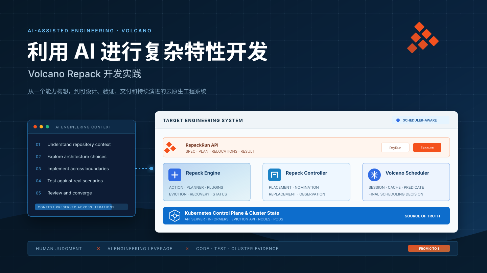
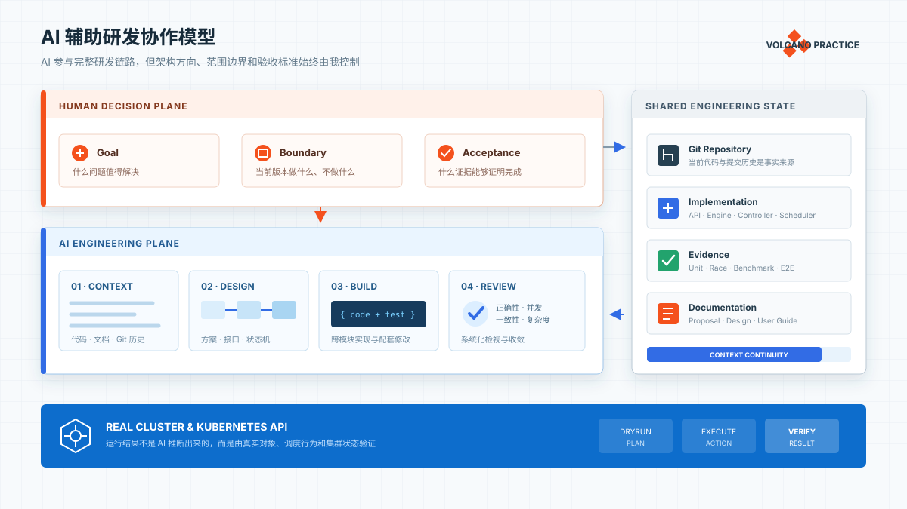
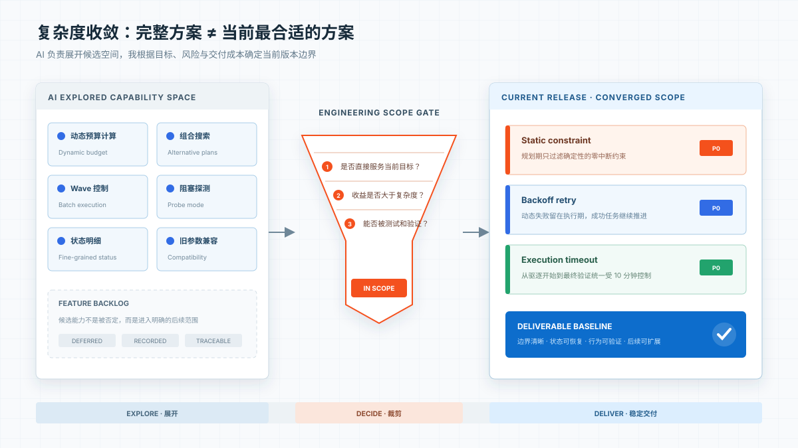
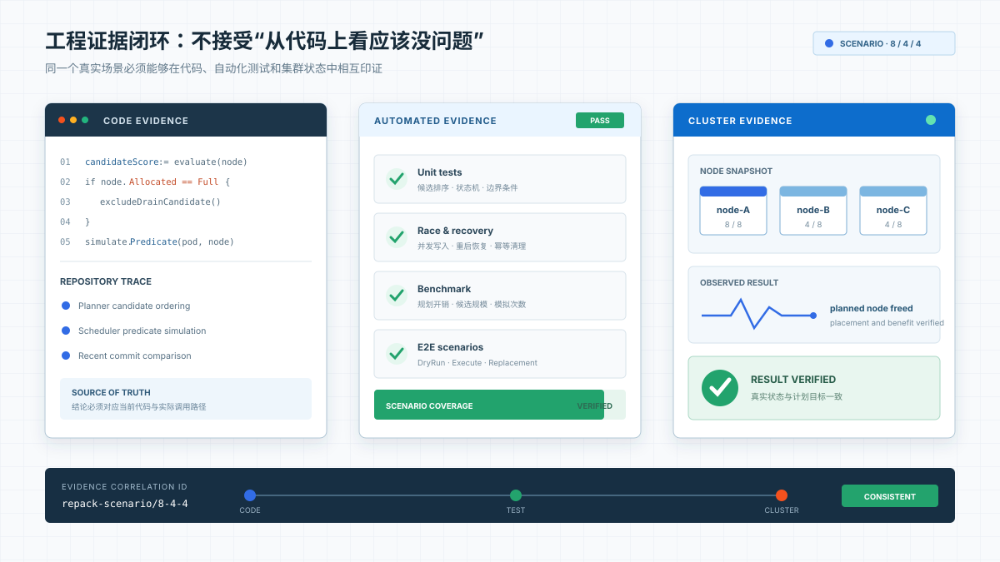

# 利用 AI 进行复杂特性开发

## ——Volcano Repack 开发实践

## 从一个尚不存在的能力开始

当我开始思考异构资源碎片整理时，Volcano 中还没有 Repack。

社区已经有 Kubernetes Descheduler，可以根据策略驱逐不符合预期布局的 Pod。但我的需求不只是“把 Pod 从一个节点驱逐出去”，而是希望解决 AI 集群中的一个实际问题：集群明明还有很多 GPU/NPU 空闲，但这些资源分散在不同节点，无法满足整机或固定卡数任务的调度需求。

要解决这个问题，系统必须在驱逐前回答更多问题：

- 哪些节点值得腾空？
- 节点上的工作负载是否允许迁移？
- 迁移后是否有满足原调度约束的接收节点？
- 是否会破坏 PodGroup/Gang？
- 如何控制一次整理的影响范围？
- 如何预览计划，又如何安全执行？
- Pod 重建后，如何跟踪实际落点？
- 组件重启后，任务如何恢复？

那时，我手里只有一个方向性的想法：

> 能不能在 Volcano 中，从零设计一套面向异构资源的运行时碎片整理能力？

Repack 的概念、架构、API、算法和执行流程，都需要重新设计。这也是我开始深度使用 AI 参与复杂特性开发的起点。

我最初以为，最大的难点会是碎片整理算法。但真正开始设计后，我发现自己面对的是一个跨越 Scheduler、Controller、CRD 和异步状态机，并且需求仍在不断变化的系统工程。如果仍然采用“先把方案全部想清楚，再集中编码和验证”的方式，反馈周期会很长，也很难及时发现跨模块的边界问题。

因此，我决定让 AI 从需求分析阶段就持续参与，而不是等方案确定后，只让它完成几个局部函数。

## 我先让 AI 帮我展开问题

面对一个尚不存在的能力，我没有立即让 AI 写代码，而是先和它一起梳理设计空间。

我们讨论过很多可能的方向：

- 是否直接扩展社区 Descheduler；
- 是否把碎片整理放进 Volcano Scheduler；
- 是否复用已有的重调度逻辑；
- 是否需要独立的 Engine；
- 是否需要新的 CRD；
- 规划与执行是否应该分离；
- 如何复用 Scheduler 的调度语义。

AI 帮我快速检索 Volcano 已有代码、追踪 Scheduler 和 Controller 的职责，也帮助我比较不同方案的优缺点。但架构方向仍然由我判断。

经过多轮讨论，我逐渐明确：Repack 不是一个普通的 Descheduler 策略；长生命周期的整理任务不应该进入 Scheduler 关键路径；Scheduler 仍然负责最终调度和绑定；Repack 应复用 Scheduler 的缓存和过滤语义；使用 `RepackRun` 描述一次整理任务，并同时支持 DryRun 和 Execute。

这个阶段，AI 最重要的作用不是替我做决定，而是快速展开可能性，让我能够在更完整的信息基础上做判断。

*我掌握目标、边界和最终判断，AI 放大理解、执行与验证能力。*

## 从想法走向完整工程能力

确定方向后，我开始和 AI 一起设计 `RepackRun`。

最初，一个整理任务看起来只需要描述整理哪种资源、允许处理哪些节点、允许迁移哪些工作负载，以及是预览还是执行。但沿着完整生命周期推演后，问题很快变得复杂：

- DryRun 的计划保存在哪里？
- Execute 能否直接复用历史 DryRun？
- 一个计划应该记录节点，还是记录每个 Pod？
- Pod 被驱逐后，如何识别对应的 Replacement？
- 计划节点和实际节点不一致是否算失败？
- Engine 重启后，如何判断哪些 Eviction 已经提交？
- Status 由哪个组件更新？
- 整个 RepackRun 什么时候才算完成？

AI 可以迅速给出数据结构、状态机和执行流程。我则结合实现不断判断：哪些信息应该成为对外 API，哪些只是内部实现；哪些状态用户真正关心；哪些设计会增加不必要的兼容负担。

Repack 因此不是“一次设计、一次生成”完成的，而是在设计、实现、测试、Review 和真实场景验证之间持续往返，逐步形成一套完整工程能力。整个开发持续了两个多月，经历了数十次增量提交，覆盖 API、Engine、Controller、Scheduler、Helm、E2E 和设计文档。期间既有功能增加，也有方案回退和重新实现，这正是复杂工程开发的真实状态。

## 真实场景开始纠正代码

Repack 的基本流程实现后，我开始验证它是否真的符合预期。

其中一个典型场景是：集群有三个节点，node-A 已经分配了 8 张卡，node-B 和 node-C 各分配了 4 张卡。我的预期是合并 node-B 和 node-C 上的负载，从而释放一个完整节点，但 DryRun 却首先尝试腾空已经调度满的 node-A。

我把这个场景直接交给 AI：

- 检查候选节点生成和排序；
- 解释为什么选择 node-A；
- 查看近期提交；
- 构造 8、4、4 的回归测试；
- 修改后验证其他候选场景。

AI 可以快速理解代码当前做了什么，但“什么结果才合理”必须由我通过业务场景定义。

这让我形成了一条很重要的经验：与 AI 协作时，具体输入、实际结果和预期结果，比“这个算法好像有问题”有效得多。

## 从局部缺陷追溯系统问题

后来，我又发现部分节点 CPU 不足时，DryRun 和 Execute 给出的计划不一致。

表面上看，只需要增加一项 CPU 检查。但我让 AI 继续对比 DryRun 和 Scheduler 的完整代码路径，最终发现真正的问题不是只漏掉了 CPU，而是模拟调度与真实调度之间存在语义差异。

如果只补 CPU，未来还可能在节点 Pod 数量、端口冲突、亲和性或者其他 Predicate 上再次出现问题。因此，解决方向从“补一个资源判断”转变成了“尽可能复用 Scheduler 的真实调度语义”。

AI 在这里帮助我从一个局部现象追溯到了系统性问题。进一步梳理后，我发现其他 Scheduler 策略的模拟支持与 Repack 主线相对独立。为了不打断主体能力的推进，我没有在当时同步扩展，而是将这部分问题明确记录为独立优化项；等主线功能稳定后，再单独完成设计、实现和验证。

## AI 帮我展开复杂度，我负责把它收回来

PDB 是整个开发过程中很有代表性的一个例子。

当 Eviction 因 PDB 被拒绝时，AI 很快可以展开一套完整方案：规划期动态计算预算、搜索其他驱逐组合、按 Wave 控制执行、全阻塞后进入探测模式，并持续更新 Status。

这些方案并不是错误的，但它们会显著增加规划和执行的复杂度。

我真正希望解决的是：已经成功的驱逐继续处理 Replacement；失败的 Pod 单独记录并退避重试；避免频繁更新 Status；整个执行过程有统一超时；确定性不可驱逐的负载可以提前过滤。

因此，我不断要求 AI 做减法：暂时不做 Wave，不做全阻塞探测，不做动态组合搜索，也不兼容已经不再需要的旧参数。动态问题交给执行期重试，规划期只处理确定性的零中断约束。

在实际交流中，我经常使用一些很短、但边界非常明确的指令：

> “这个方案有点复杂。”
>
> “Wave 和全阻塞探测先不列入当前设计。”
>
> “这些问题先记录，暂时不要修改。”
>
> “重新整理最终方案，再开始开发。”

*AI 可以迅速展开完整方案，但当前版本做什么、不做什么，必须由我决定。*

这次经历让我更加明确：AI 擅长展开问题空间，但开发者必须决定当前版本在哪里停下来。如果没有范围控制，AI 带来的可能不是提效，而是更快地产生过度设计。

## AI 逐渐参与整个工程闭环

随着 Repack 不断完善，我开始让 AI 参与更多工程环节。

除了实现功能，我会继续追问：Engine 中是否增加了过多锁？一个文件承担的职责是否过多？状态优先级是否应该用数字表达？CRD Status 和设计文档是否一致？某个字段是否真的被使用？Terminating Pod 应该如何参与资源统计？

我也逐渐形成固定的开发节奏：

1. 讨论方案；
2. 确认范围；
3. 编码实现；
4. 补充测试；
5. 整体 Review；
6. 根据 Review 修正；
7. 进行 E2E 或场景验证；
8. 更新文档并形成独立提交。

与过去最大的区别是，我不需要在每个环节重新解释全部背景。在持续会话中，AI 可以基于此前的设计讨论继续工作，知道哪些方向已经验证过、哪些方案曾被否决。即使我回退一次重构，它也可以利用之前的讨论帮助我恢复真正需要的功能。

不过，这种上下文只能用来降低沟通成本，不能被当成新的事实来源。代码会变化，历史结论也可能过期，因此每次重要判断仍然需要回到当前代码、Git 差异和测试结果重新确认。

## 让 AI 完成 E2E，而不是让我成为它的测试工具人

随着 AI 能够完成越来越多的代码修改，我也遇到了一种非常低效的协作方式：AI 写完代码、补充几个单元测试，然后告诉我测试已经通过。但这些测试基本都是 UT，只能证明局部函数或模块符合预设断言，并不能证明端到端行为符合真实业务预期。

等我把代码部署到实际集群进行验证时，仍然会发现计划结果、状态流转或者组件协作不符合预期。随后，我又要回到会话中描述集群现象，让 AI 重新分析和修改，再由我重新部署验证。如此往返，AI 虽然完成了编码，我却承担了端到端测试执行器的角色，反复为它发现问题、提供现象，实际研发效率并没有真正提升。

这让我意识到，UT 通过不能作为大颗粒功能完成的标志。如果 AI 能够修改跨组件代码，也应该有能力完成与修改范围相匹配的端到端验证。否则，我只是从自己编写代码，变成了替 AI 不断试错的“测试工具人”。

因此，后续开发较大功能点时，我会先让 AI 设计并编写对应的 E2E 用例，把真实场景和验收标准提前固化下来。功能实现完成后，再由 AI 自己使用 Kind 创建测试集群，安装相关组件并完整运行 E2E，验证两类内容：

- 新增功能是否满足预期场景；
- 既有功能是否因为本次修改发生回归。

AI 不只负责执行测试命令，还要完成 Kind 环境准备、组件部署、测试运行、失败日志收集、问题定位、代码修正和再次回归，直到新增用例和既有 E2E 都完整通过。

我的工作重点转变为定义真实场景、审核 E2E 是否表达了正确预期，以及判断最终证据是否满足交付标准，而不是在每次代码修改后亲自进入集群反复试错。

这并不是把质量责任交给 AI，而是要求 AI 对自己的修改提供与功能粒度匹配的完整证据。只有代码、UT、E2E 用例、Kind 集群执行结果和失败分析一起交付，一个大颗粒功能点才算真正完成。

## 我不再接受“从代码上看应该没问题”

随着协作深入，我对 AI 输出的要求也越来越高。

我不会只接受一个逻辑上合理的解释，而是要求它查看当前代码、检查 Git 历史、构造最小测试场景、运行单元测试、检查并发和异常恢复、自行运行 E2E，并检查代码、CRD、Helm 和文档是否保持一致。

我希望每个重要结论都尽可能经过：

> 问题现象 → 代码证据 → 实现修改 → 自动化测试 → 真实场景验证

*AI 加快抵达答案的速度，但代码、测试和真实场景决定答案能否站住。*

AI 编写的测试也不一定天然正确。测试可能只是重复当前实现，而没有表达真正的业务目标。因此，我仍然需要检查测试中的输入、预期结果和断言是否合理。AI 可以更快地形成证据链，但什么才是正确的证据，依然需要我判断。

## AI 提升的是整体研发效率

回头看整个过程，AI 带来的最大提升不是“少写了多少代码”，而是缩短了复杂研发过程中的每一次反馈周期。

| 传统方式中的成本 | AI 帮我改善的方式 |
|---|---|
| 在大量文件中建立上下文 | 快速检索并整理调用链 |
| 从现象定位到实现 | 将集群场景映射到代码路径 |
| 比较多个架构方向 | 快速展开方案及其影响 |
| 跨模块修改容易遗漏 | 同步检查代码、测试、CRD和文档 |
| 功能完成后集中 Review | 在每个阶段进行增量 Review |
| UT 通过后由我在集群中反复试错 | AI 通过 Kind 完整运行新增与既有 E2E |
| 回退后重新理解设计 | 保留历史讨论和决策上下文 |
| 问题容易停留在口头结论 | 推动形成测试和运行证据 |

## AI 没有替我完成什么

在整个过程中，有几件事情始终需要我负责：

- 定义为什么 Volcano 需要 Repack，以及什么才是正确的业务结果；
- 判断业务风险、版本边界和哪些未来能力值得现在实现；
- 审核测试和运行结果是否真正证明了预期行为；
- 承担最终的架构决策和质量责任。

## 总结

这次实践中，我借助 AI，从零设计并实现了 Volcano Repack。

真正让我感受到提效的，不是 AI 一次生成了多少代码，而是它能够持续参与需求分析、架构设计、代码实现、E2E 验证、Review 和文档沉淀。

我最终总结出五条最值得复用的经验：

1. 在编码前，先让 AI 帮助展开问题和设计空间；
2. 使用真实场景描述输入、实际结果和预期结果；
3. 对复杂方案持续做减法，明确当前版本不做什么；
4. 要求 AI 提前编写 E2E，并通过 Kind 完整运行新增与既有场景；
5. 通过小步实现、高频 Review 和独立提交保持持续收敛。

如果用一句话概括这次经历：

> AI 提升的不是我跳过思考和验证的能力，而是我把一个想法转化为完整工程能力的速度。
