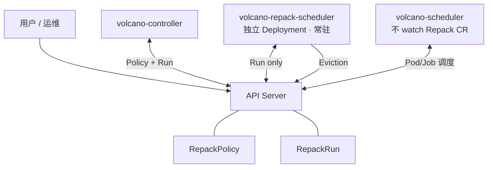

# 碎片整理（Defragmentation / Compaction）需求分析 — v2

> 范围：面向 AI 负载的 **Node 级碎片 + 多层 HyperNode 级碎片** 整理。
> 思路：装箱（调度时预防，已有）→ **碎片整理（运行时重排，本需求）** 闭环。
> 架构取向：**不绑定已停止演进的 `rescheduling` 插件，不沿用 k8s-sigs/descheduler 原型**；以 **Volcano 自身调度框架**实现，复用既有模拟调度与调度算法。
> 状态：需求分析 v2（在 v1 GPU 整卡碎片基础上，扩展为 node + 多层 HyperNode，并纳入 8 个设计维度与架构选型）。

---

## 1. 背景与问题定义

Volcano 在调度 AI 负载时已具备两层装箱能力：

- **Node 级装箱**（`binpack` / `resource-strategy-fit`）：尽量集中放置，减少单节点资源碎片。
- **HyperNode 级装箱**（`network-topology-aware` + HyperNode 拓扑，含多层 tier）：为分布式任务尽量减少跨 HyperNode 的拓扑碎片。

但装箱只在**任务进入时**生效。随着 AI 负载生命周期结束（训练完成、推理下线、抢占、缩容、节点维护），集群中会逐渐出现**资源空洞**——既有 node 级，也有各层 HyperNode 级。后续提交分布式训练任务时，常出现「**集群总资源够、但因碎片分布而无法调度，作业 pending**」。

装箱是"入场时的预防"，无法回收已经形成的存量碎片。**本需求补齐的是"运行期的治理"：碎片整理（重排已运行负载，腾出可用的整块/拓扑连续容量）。**

### 1.1 碎片的分层定义

碎片必须**按层定义**，因为 node 级凑齐了不代表 HyperNode 级凑齐：

- **Node 级碎片**：节点存在空闲资源，但不足以承接目标任务的单副本（如整卡数不够、CPU/Mem 不连续）。
- **HyperNode 级碎片（逐 tier）**：某 HyperNode 内（其 `realNodesSet` 展开的真实节点集合）总空闲资源充足，但无法满足分布式任务在该层所需的**副本数 × 规格 + 拓扑亲和**（gang 在该 HyperNode 内放不下）。多层 HyperNode（tier0/1/2…）需逐层评估。

> 统一以"**目标任务画像集合**"为参照定义碎片：一块空闲资源若无法被任何目标画像利用，即为该层碎片。目标画像来自集群实际/历史/pending 的分布式任务规格。

### 1.2 碎片率指标（核心 KPI，可观测）

| 指标 | 层级 | 含义 |
|---|---|---|
| `NodeFragRate` | Node | 不可用于目标画像单副本的空闲资源占比 |
| `HyperNodeFragRate{tier}` | 每层 HyperNode | 该层无法承接目标分布式画像的空闲容量占比 |
| `WeightedFragRate` | 集群 | 各层、各画像按权重加权的单一总分（优化目标函数） |
| `PendingByFragmentation` | 业务 | 因碎片（资源总量足但放不下）而 pending 的作业数 / 时长 P50·P95 |
| `SchedulableDomains{画像}` | 容量 | 当前可立即承接某分布式画像的 HyperNode 数 |

度量须**低开销、可独立开关、dry-run 友好**，且调度时打分与运行时整理共用同一口径（否则两条链路互相打架）。

---

## 2. 现状核对（仓库实证）与可复用地基

代码核对（`pkg/scheduler`）结论：**Volcano 已具备实现本需求所需的全部底层机制，本需求是"组装 + 新增策略"，而非造框架。**

| 机制 | 位置 | 对碎片整理的价值 |
|---|---|---|
| **模拟调度引擎** | `actions/utils/simulate.go::BuildNominationPlanInDomain` | **关键**。在指定 HyperNode 域内 dry-run「驱逐 victims + 重排 pending 子作业」，**完全复用真实调度算法**（PrePredicate/Predicate、NodeOrder、HyperNode 梯度 `HyperNodeGradientForSubJobFn`、`SubJobReady`/`JobPipelined` 的 gang 校验），仅当作业可被满足时才返回**可提交的计划**。已被 `gangpreempt`/`gangreclaim` 复用。 |
| **投机执行原语** | `framework/statement.go::Statement` | `Evict`/`Pipeline`/`Allocate` + `Discard`/`Commit`；`SaveOperations`（克隆已验证计划）+ `RecoverOperations`（回放提交）。提供**"先模拟、收益达标再原子提交、否则整体丢弃"**的事务能力——正是碎片整理"谨慎、可回滚"的基础。 |
| **HyperNode 多层模型** | `api/hyper_node_info.go::HyperNodesInfo` | 分 tier（`hyperNodesSetByTier`）、`realNodesSet` 展开到真实节点。支持**多层 HyperNode 碎片**的逐层评估与定位。 |
| **子作业/Gang 模型** | `api/sub_job_info.go`、`SubJobReady`/`MinSubJobs` | 分布式任务的 gang 语义已建模，整理可直接复用而非自行判断 gang。 |
| Action 编排 | `actions/factory.go`（enqueue/allocate/backfill/preempt/reclaim/**gangpreempt/gangreclaim**/shuffle） | 新增碎片整理可作为**与之并列的独立 action**，沿用现代 gang/拓扑感知 action 模式。 |
| Node 装箱 | `binpack`、`resource-strategy-fit` | 调度时预防（已有），整理后落点仍走它们打分。 |
| 旧重调度路径 | `plugins/rescheduling`（仅 lowNodeUtilization）+ `actions/shuffle` 消费 `VictimTasks` | **本需求明确不绑定**（见 §3.2）。 |

---

## 3. 架构取向分析（对你"初步想法"的评估）

### 3.1 你的三点取向 — 评估结论：成立，且代码已铺路

1. **不关联 `rescheduling`（已停止演进）** —— ✅ 合理。该插件仅有 `lowNodeUtilization` 策略，目标是"均衡利用率"而非"消除碎片"，且依赖 `shuffle` action 的 `VictimTasks` 单点驱逐路径，缺少 gang/HyperNode/模拟能力。绑定它会继承其包袱。
2. **不沿用 k8s-sigs/descheduler 原型** —— ✅ 合理。其框架独立于 Volcano 调度算法，无法复用 Volcano 的 predicate/nodeorder/HyperNode 梯度/gang 判定，"模拟调度后再落子"几乎要重写。
3. **用 Volcano 同框架以复用模拟调度** —— ✅ **强烈推荐，且已具备**。`BuildNominationPlanInDomain` + `Statement` 已经把"复用既有算法做模拟、产出可提交计划"实现了，`gangpreempt`/`gangreclaim` 就是先例。

### 3.2 推荐落地形态：**新增独立 Action `defragment`（或 compact）**

- 与 `gangpreempt`/`gangreclaim` 并列注册到 `actions/factory.go`，**复用 `actions/utils/simulate.go` 与 `Statement`**。
- 与现有调度同一 Session、同一组 plugin function（NodeOrder/HyperNode 梯度/Predicate/Gang），天然满足"与既有调度算法兼容"（维度 7）。
- 触发与策略参数走 action 配置，**不引入 rescheduling 插件依赖**。
- 整理流程统一为：**选目标画像 → 选 victim（带约束）→ `BuildNominationPlanInDomain` 模拟 → 收益/代价判定 → `Save/RecoverOperations` 原子提交，否则 Discard**。

> 备选：若希望整理逻辑可被多 action 共享，可把"碎片度量 + victim 候选 + 收益判定"做成 plugin 提供的扩展函数（类似 VictimTasksFn 的思路），由 `defragment` action 调用。建议**主体走 action，策略点用 plugin 扩展**。

---

## 4. 功能需求（FR）— 含 8 维度细化

### FR-1 碎片度量（P0，基础）
分层计算 §1.2 指标（node + 各 tier HyperNode），导出 metrics，支持 dry-run 建 baseline。目标画像集合可配置 / 可从 pending 与历史作业学习。

### FR-2 碎片整理 Action（P0，核心）
新增 `defragment` action，复用模拟调度与 Statement，端到端"模拟—判定—原子提交"。整理后落点仍由 binpack/resource-strategy-fit/HyperNode 梯度决定，保证与装箱目标一致。

### FR-3 Gang 调度原则（维度 1，P0）
- victim 选择与重排必须保持 gang 语义：不得使某 gang 作业跌破 `MinSubJobs`/`MinAvailable`；整理产生的空位要能让目标分布式作业**整组**ready（复用 `SubJobReady`/`JobPipelined` 判定）。
- 迁移被整理作业时同样以 gang 为单位评估可行性，避免"迁一半卡死"。

### FR-4 中断成本模型（维度 2，P0）
为每个候选 victim 计算**中断代价分**，作为 victim 排序的核心因子：
- 任务规模（副本数 × 单副本规格，规模越大代价越高）。
- 已运行时长（长训练 = 高 checkpoint 重算成本）。
- 历史被中断次数（避免反复迁移同一作业，需退避/计数）。
- 负载类型：**训练**（可 checkpoint，中断成本中高）vs **在线推理**（重启需重新加载且影响 SLA，成本最高，默认尽量不动）。
- 估算迁移后重启恢复耗时。
> 原则：**只迁移"低代价、可中断、收益高"的负载**；高代价负载优先作为"被腾挪保护对象"而非 victim。

### FR-5 优先级（维度 3，P0）
兼容 K8s `PriorityClass` 与 Volcano 优先级：低优作业优先作为 victim，高优作业受保护；整理不得违反既有优先级/抢占语义。

### FR-6 平台可中断策略（维度 4，P1）
支持平台对整理能力"包装/限流"：
- 任务级注解/标签声明 **allow / disallow / prefer-not** 中断。
- 队列、命名空间、PriorityClass 级豁免与配额（单轮最大迁移作业数/卡时）。
- 提供 hook/policy 接口，便于上层平台二次封装与策略下发。

### FR-7 多重触发机制（维度 5，P1）
- **阈值触发**：`WeightedFragRate` 或某层碎片率超阈值。
- **定时触发**：用户定义时间窗口/周期（低峰期整理）。
- **手动单次触发**：用户/平台显式发起一次（On-demand，配合 dry-run 预览）。
- **按需触发**：检测到因碎片 pending 的高优作业时触发。
- 各触发器可组合、可分别开关、可限频。

### FR-8 可观测与可解释（维度 6，P0 并行）
每轮整理输出清晰审计：触发原因、目标画像、候选与最终 victim 及其**入选理由（代价分、优先级、约束）**、模拟出的迁移计划、碎片率前后对比、预期 vs 实际收益、迁移作业列表。无此则"难运维、难解释"。以 events + metrics + 结构化日志三路呈现。

### FR-9 与既有调度兼容（维度 7，P0）
同 Session 复用同一组 plugin function 与算法，整理结果与正常调度一致；与 allocate/preempt/reclaim 的执行顺序、互斥关系需明确（§6）。

### FR-10 独立模拟调度 / 可调度性预检能力（维度 8，P0，高价值）
将 `BuildNominationPlanInDomain` 能力**抽象为对外可复用的"可调度性查询"**：
- 输入一个（拟提交的）作业规格，返回：**当前集群能否调度**；若能，给出落点/拓扑域；若不能，给出**详细原因**（哪层资源不足、被哪些 predicate 拒绝、是否仅靠整理可解）。
- 形态建议：CLI（`vcctl` 子命令）/ 只读 API / dry-run 接口，**复用调度算法、不落子**。
- 价值：用户提交前自检"能不能调度→要不要先触发整理→还是不投这个集群"，正是你维度 8 的诉求；同时此能力是 FR-2 整理决策与 FR-7 按需触发的内部基础。

---

## 4.4b 总体架构

> **详细 API 与模块图**见 [repack-policy-design.md §4（v6）](./repack-policy-design.md#4-场景驱动-api-设计v6)、[§5 架构](./repack-policy-design.md#5-模块架构框架图--时序图)。  
> P0 主路径：**RepackPolicy** → **RepackRun**（`mode=DryRun`）→ 用户读 `report` 填写 **scope** → 新建独立 **RepackRun**（`mode=Execute`）。

### 分层框架（独立容器部署 · 定稿）

详见 [repack-policy-design.md §5.1](./repack-policy-design.md#51-独立部署集群进程与-cr-交互定稿)。

### 跨进程协作（摘要）

Controller 与 **volcano-repack-scheduler** **不直连**；**`RepackRun`** 为唯一握手 CR；主 scheduler 仅 **allocate** 重排。

详见 [repack-policy-design.md §4.7](./repack-policy-design.md#47-三进程分工controllervolcano-repack-schedulervolcano-scheduler定稿)、[§5.1.3](./repack-policy-design.md#513-cr-握手时序policy--run--独立-repack-容器)。

### 五层职责（逻辑拆分）

1. **策略 / 触发（Controller）**：P0 以 `triggers.onPending` + **DryRun/Execute** 为主；P1 扩展定时 / 碎片率 / 全自动 Execute。
2. **核心库** `pkg/scheduler/repack`：碎片度量、FragmentationDetector、Engine、Committer。
3. **执行入口（定稿）**：**`volcano-repack-scheduler` 独立常驻容器**；**只消费 RepackRun**；与 volcano-scheduler **分开部署**。
4. **Committer（定稿）**：Eviction API 驱逐；重排交还 **volcano-scheduler `allocate`**。
5. **底座**：`BuildNominationPlanInDomain` + Gang/拓扑 Plugin；主调度仍是放置唯一事实源。

---

## 4.5 部署与编译形态（可合可拆）

> 诉求：模拟调度 action 与重调度（defragment）action **既能与 Volcano 合并编译部署，也能拆分为独立进程编译部署**，从而**避免对既有 volcano-scheduler 的功能与性能造成影响**。

### 现状约束（实证）

主调度器 `scheduler.go::runOnce()` 每个调度周期 `OpenSession(cache) → 顺序执行各 action.Execute(ssn) → closeSession`。Session 由 `cache.Snapshot()` 构建，cache 由 informer 持续喂养，是唯一事实源。**结论**：若把 defragment 直接做成普通 in-tree action，它会跑在延迟敏感的主调度环里，重计算（模拟、driun 驱逐规划）会拖慢正常调度——这正是要规避的。

### 设计原则：一套核心库 + 两个入口 + 一个执行抽象

1. **共享核心库**（`pkg/scheduler/defrag/`，暂名）：碎片度量 + victim 候选 + 收益判定 + 计划生成。仅依赖 `*framework.Session` 与 `framework.Statement`，**复用 `actions/utils/simulate.go`**；不感知"自己跑在进程内还是独立进程"。
2. **执行抽象 `Committer` 接口**：把"如何落子（驱逐/提交）"与"决策核心"解耦：
   - In-tree 实现：直接用 `ssn.Evict` / `Statement.Commit` 作用于活动 Session。
   - 独立实现：通过 K8s eviction API 驱逐，**不做绑定**。
3. **两个入口**：
   - **入口 A（合并）**：`actions/defragment` 与 `actions/simulate`，注册进 `actions/factory.go`，编入 volcano-scheduler；
   - **入口 B（拆分）**：独立 binary `cmd/volcano-defragment`（独立镜像 / Deployment），用**自己的 informer + cache**，通过 `framework.OpenSession(ownCache, tiers, conf)` 构建**独立 Session**，复用同一核心库与同一组 plugin/算法，自带控制循环（定时/阈值/手动触发）。

### 两种形态对比

| 维度 | 形态 A：合并（in-tree action） | 形态 B：拆分（独立进程） |
|---|---|---|
| 部署 | 随 volcano-scheduler，一进程 | 独立 Deployment / 镜像，可单独升级、单独关停 |
| 性能影响 | 与主调度同进程，需自限频/时间盒隔离 | **进程级隔离，对主调度零 CPU/延迟影响**（推荐用于大规模/在线敏感集群） |
| 数据源 | 复用主调度 live cache/session | 自建只读 cache（同 informer 源） |
| 落子方式 | Statement 原子提交 | 仅驱逐（evict），重排交还主调度 allocate |
| 协调风险 | 无（单进程内串行） | 需 leader 选举（单活）+ 提交前对最新快照二次校验 + 计划 TTL |
| 适用 | 中小集群、想要最简部署 | 大集群、在线推理为主、强调隔离与独立运维 |

### 关键设计点

- **职责切分让拆分变干净**：独立进程**只负责"决定并驱逐 victim"**，腾出的空位由主 volcano-scheduler 的 allocate 正常重排——主调度始终是放置的唯一事实源，避免两个进程争相绑定。
- **"合 / 拆"靠构建目标 + 配置选择，不分叉代码**：
  - 合并形态：把 action 列入 scheduler `actions:` 配置即生效；不列入则零运行开销。
  - 拆分形态：编译并部署 `cmd/volcano-defragment`，主 scheduler 配置中**不启用**该 action。
  - 若需让 action 代码完全不进 scheduler 二进制，可对其 `init()` 注册加 build tag；但**优先用配置门控**（更简单，未配置即不执行）。
- **模拟调度/可调度性预检（FR-10）天然适配独立进程**：它是只读能力，独立进程可直接暴露为查询服务（CLI / 只读 API），不触碰主调度。
- **一致性窗口**：独立进程模拟基于某一快照，提交（驱逐）前须对最新状态二次校验并设置计划 TTL，避免脏决策（§6 开放问题之一）。

---

## 5. 非功能需求（NFR）

- **安全/事务**：整理一律"先 dry-run 模拟、收益与约束校验通过后用 `Save/RecoverOperations` 原子提交，否则整体 `Discard`"，杜绝半成品状态。
- **稳定/防抖**：限频、收益阈值、单轮迁移上限、同作业迁移退避，避免反复折腾在线业务。
- **性能**：度量与模拟在千节点 / 多层 HyperNode 规模下开销可控，不阻塞主调度。
- **兼容/可回退**：默认关闭，灰度可控；不改变既有调度/重调度默认行为。
- **可靠性优先**：在线推理类负载默认强保护，迁移须保证有合规落点（gang + 拓扑 + 可用性）后才执行。

---

## 6. 关键挑战与开放问题

1. **整理 vs 抢占/回收的协调**：`defragment` 与 `preempt`/`gangpreempt`/`reclaim` 都会驱逐，需明确触发条件、优先级与互斥，避免相互抵消或重复驱逐。
2. **多层 HyperNode 的整理顺序**：自底向上还是按碎片最严重层优先？跨层迁移代价如何计入收益。
3. **目标画像来源**：人工配置 vs 从 pending/历史学习；冷启动如何取默认。
4. **中断成本量化**：运行时长、checkpoint 友好度、恢复耗时等需要可获取的信号（部分依赖业务侧注解配合）。
5. **收益口径**：碎片率下降 vs 迁移代价的权衡函数如何定义与暴露给平台调参。
6. **在线推理保护与"必须整理"冲突**：当唯一可行 victim 是在线服务时，是放弃整理还是走受控迁移（配额 + 滚动）。
7. **模拟与真实的一致性窗口**：模拟基于 session 快照，提交前集群可能变化，需校验/重试。

---

## 7. 验收标准

- AC-1 `WeightedFragRate`（node + HyperNode 加权）相比 baseline 下降 ≥ 30%（目标值待评审）。
- AC-2 因碎片 pending 的分布式作业数显著下降，多卡/多机作业 P95 排队时延下降 ≥ 25%，无新增饿死。
- AC-3 整理严格不破坏 gang、优先级、平台可中断策略；在线推理默认不被误伤。
- AC-4 所有动作可解释（审计完整）；迁移代价在预算内，无抖动。
- AC-5 可调度性预检能正确回答"能否调度 + 原因"，与真实调度结果一致。
- AC-6 默认关闭时行为与现网一致；全部 KPI metrics 可在面板对比。

---

## 8. 分阶段交付建议

| 阶段 | 内容 |
|---|---|
| **P0-a** | FR-1 分层碎片度量 + metrics（dry-run，建 baseline）；FR-10 可调度性预检（抽象 `BuildNominationPlanInDomain`） |
| **P0-b** | FR-2 `defragment` action 主体 + FR-3 Gang + FR-4 中断成本 + FR-5 优先级 + FR-9 兼容；安全事务（§5） |
| **P0-c** | FR-8 可观测/可解释闭环 |
| **P1** | FR-6 平台可中断策略 + FR-7 多重触发；§6 与抢占/回收协调 |
| **P2** | 多层 HyperNode 整理顺序优化、目标画像自适应学习、收益函数调参面板 |

---

## 附：实现锚点

- 模拟/计划：复用 `pkg/scheduler/actions/utils/simulate.go::BuildNominationPlanInDomain` 与 `framework/statement.go`（`Save/RecoverOperations`）。
- 新 action：`pkg/scheduler/actions/defragment/`，注册于 `actions/factory.go`，与 `gangpreempt`/`gangreclaim` 同构。
- HyperNode 多层：`api/hyper_node_info.go`（`hyperNodesSetByTier` / `realNodesSet`）。
- Gang：`api/sub_job_info.go`、`SubJobReady`/`MinSubJobs`。
- 预检对外：`vcctl` 子命令 / 只读接口，复用上述模拟引擎。
- 度量与配置：scheduler metrics 体系；action 级参数（触发器、阈值、配额、画像、豁免）。
