# Group Topology Affinity（组间拓扑亲和）设计提案

| 项 | 内容 |
|----|------|
| Authors | wangyang0616 |
| 关联 Issue | [volcano-sh/volcano#5347](https://github.com/volcano-sh/volcano/issues/5347) |
| 插件 | `group-topology-affinity`（组间）+ `network-topology-aware`（组内） |
| 关联设计 | [Network Topology Aware Scheduling](./Network%20Topology%20Aware%20Scheduling.md)、[Preempt Action Support Topology](./preempt-action-support-topology.md) |

本文档为 **Volcano 社区 design proposal**：在现有组内网络拓扑调度之上，增加 **PodGroup / SubJob 级组间拓扑** 的 API 与调度实现说明。

## 目录

| 章节 | 内容 |
|------|------|
| [概述](#概述) | 背景、社区现状、目标、范围 |
| [用户故事](#用户故事) | 典型诉求（对应实例 1–7）；[设计决策一览](#设计决策一览) |
| [用户场景与能力对照](#用户场景与能力对照) | 实例 1–7 与完整 YAML |
| [API 设计](#api-设计) | 类型、能力边界、HyperNode、附录 |
| [设计决策](#设计决策) | 设计决策 1～6 |
| [调度实现](#调度实现) | 插件、Framework、allocate |
| [架构与时序图](#架构与时序图) | 总览图与 allocate 路径 |
| [校验规则](#校验规则webhook)、[交付阶段](#交付阶段)、[状态](#状态可选)、[参考](#参考) | Webhook、Phase、Condition |

> 对象与插件名使用 **全称**（PodGroup、SubGroup、`network-topology-aware`、`group-topology-affinity` 等）；**不使用** NTA、GTA、PG 等缩写。设计决策编号为「设计决策-1」～「设计决策-6」。与外部调度对照 **仅** 引用 **kube-scheduler** 的 Pod 级 `affinity` / `topologySpreadConstraints`。

# 概述

## 背景与问题

Volcano 在 [Network Topology Aware Scheduling](./Network%20Topology%20Aware%20Scheduling.md) 中已具备：

- 基于 **HyperNode 树** 的多级网络拓扑；
- **PodGroup / SubGroup** Gang 与 `subGroupPolicy`、`matchLabelKeys` 拆 SubJob；
- **`networkTopology`**：在 SubJob / 通信子组 **底层** 域内聚合，并在 PodGroup / Job **更高层** 拓扑上收束整负载（不跨 `highestTierAllowed` 所定义的 tier）。

上述能力已覆盖：**通信密集型** Pod 在子组内共域、整负载在更高层拓扑域内聚合，并配合 **多维 Gang** 成组调度。生产中还普遍存在另一类诉求：**多组之间** 要「尽量靠近」或「刻意拆开」——且分组单位是 **PodGroup（多副本 instance）** 或 **同一 PodGroup 内的不同 SubGroup（如 prefill / decode、多分片）**，而不是单个 Pod 的 `podAffinity`。

| 现状缺口 | 典型后果 |
|----------|----------|
| 无声明式 **跨 PodGroup** 拓扑 **反亲和**（互斥） | 多个 inference instance 落在同一超节点，单点故障拖垮全部在线副本 |
| 无声明式 **同 PodGroup 内跨 SubGroup** 拓扑关系 | Prefill-Decode 分片无法「分片分机柜、整体共超节点」；只能拆多个 PodGroup 或在 PodGroup 外硬凑规则 |
| **组内与组间未分层** | 组间诉求与 `networkTopology` 混写或靠运维约定，与 HyperNode 组内调度 **不在同一配置面**，难验收 |

本设计在 **不替代** 现有 `network-topology-aware` 的前提下，补齐 **组间（inter-group）** 拓扑调度能力：

- **跨 PodGroup**：仅 **`topologyAffinity.podGroupAntiAffinity`**（实例 2/5）；**不做** `podGroupAffinity`（见 [设计决策-2](#ad-2phase-1-不声明-podgroupaffinity)）。
- **同 PodGroup 内跨 SubGroup**：`subGroupTopologyAffinity`（实例 4/6/7）。

配置示例 → [#用户场景与能力对照](#用户场景与能力对照)；实现 → [#调度实现](#调度实现)；总览图 → [#架构与时序图](#架构与时序图)。

## 社区现状与本案要补什么

### Volcano 已具备（组内）

| 能力 | 配置 / 组件 |
|------|-------------|
| 多级网络拓扑 | HyperNode CRD |
| Gang / SubJob 拆分 | PodGroup、`subGroupPolicy`、`matchLabelKeys` |
| **组内** 拓扑聚合 + Gang | `networkTopology` + `network-topology-aware`，配合 `minMember` / `subGroupPolicy` / `subGroupSize` 等 |

**已覆盖（组内）：** 面向 **训练、推理** 等通信密集型负载——在 **SubJob（或通信子组）** 粒度，将一批 Pod **聚合在同一底层拓扑域**（如机柜内高带宽域）；在 **PodGroup / Job** 粒度，将 **整份负载收束在更高层拓扑域**（如 `highestTierAllowed` 定义的超节点 envelope，整机不跨域）；并与 **多维 Gang**（PodGroup `minMember`、`subGroupPolicy` + `subGroupSize` / `minSubGroups`、`matchLabelKeys` 拆 SubJob 等）协同，**成组满足资源与拓扑后再绑定**。详见 [Network Topology Aware Scheduling](./Network%20Topology%20Aware%20Scheduling.md)。

### Volcano 尚不具备（组间）

| 缺口 | 典型场景（本文实例） | 用户侧后果 |
|------|----------------------|------------|
| **跨 PodGroup 拓扑反亲和** | [实例 2](#实例-2多-inference-instance故障隔离)、[5](#实例-5多-instance--pd-组合) | 多个 inference **instance** 可能落在同一超节点，单点故障影响面大 |
| **同 PodGroup 内跨 SubJob 拓扑边** | [实例 4](#实例-4分布式-prefill-decode-推理推荐)、[6](#实例-6可选prefill-与-decode-跨角色分机柜)、[7](#实例-7subgroup-软性反亲和可选) | 多分片 Prefill-Decode 难以声明「分片分机柜、整机共超节点」等组合 |
| **组内 + 组间统一调度链** | 上述组合 | 只能拆多个 PodGroup 或依赖 Pod 模板外挂规则，与 HyperNode **整组模拟** 脱节，Pending 难排查 |

> SubJob **内部** 逐 Pod 打散仍可用 Pod 模板上的 spread 等（见 [范围 · SubJob 内逐 Pod spread](#目标外)）；**本设计不替代** 该能力，只补 **PodGroup / SubJob 之间** 的拓扑关系。

### 本案要做什么

| 交付项 | 作用 |
|--------|------|
| **`topologyAffinity.podGroupAntiAffinity`** | 跨 PodGroup：按 **整组** 在指定 tier（如 supernode）**互斥** |
| **`subGroupTopologyAffinity`** | 同 PodGroup：跨 `subGroupPolicy` 拆出的 SubJob **亲和 / 反亲和** |
| **插件 `group-topology-affinity`** | 组间 hard gradient + soft order；与 `network-topology-aware` **Framework 交集** |
| **allocate 资源预筛 + Webhook** | 与现有拓扑调度同路径；配置可校验 |
| **分阶段 P1 → P2** | P1 主路径调度；P2 preempt/backfill 与占用一致（见 [交付阶段](#交付阶段)） |

### 目标示意（Volcano 视角）

**三层能力（组内 + 组间）：**

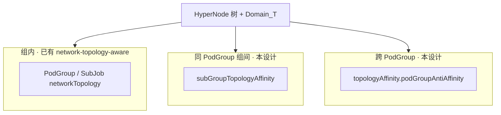

**图 · 多 instance 各占一超节点（实例 2）：**

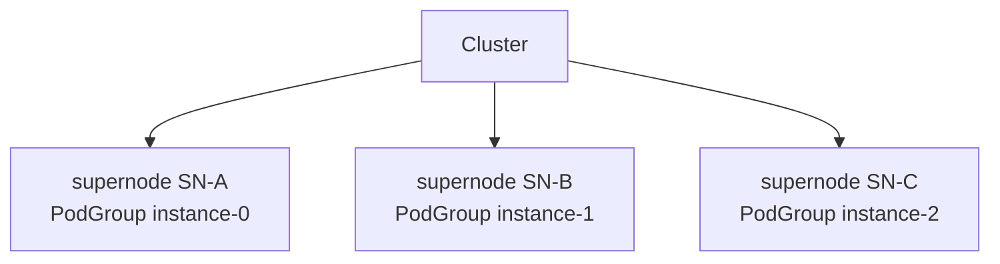

**图 · 单 instance 内多分片（实例 4）：** 分片 **分机柜**，整机 **共超节点**。

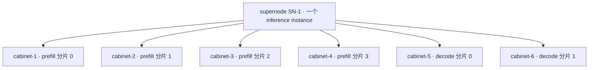

**图 · 组内 + 组间同一条调度链：**

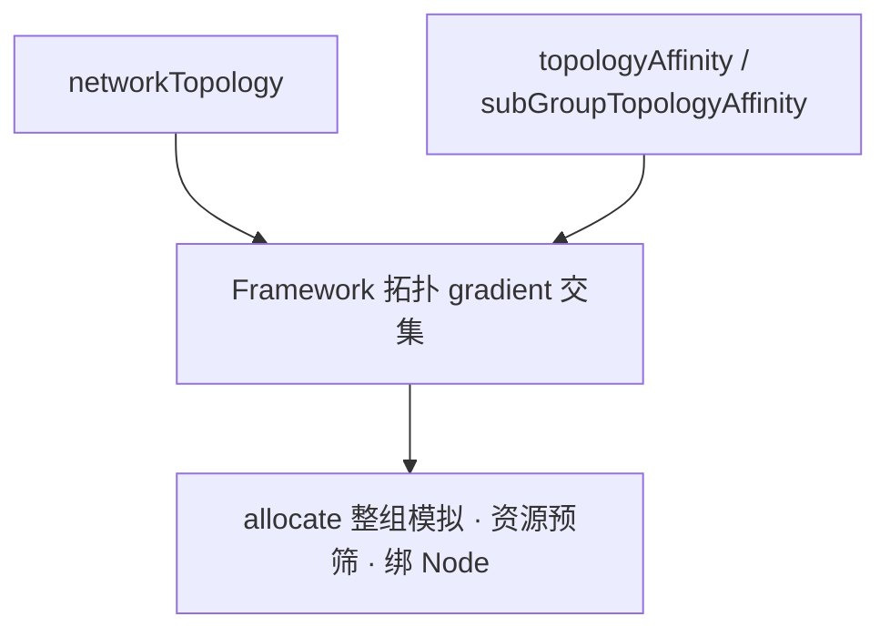

---
## 设计目标

| 目标 | 说明 |
|------|------|
| **组间可声明** | **跨 PodGroup 反亲和**（`topologyAffinity.podGroupAntiAffinity`）+ **同 PodGroup 跨 SubGroup** 亲和/反亲和（`subGroupTopologyAffinity`）；拓扑比较层级与组内 `networkTopology` 一样支持 `topologyTierName` / `topologyTier`（置于 `topologyDomain`） |
| **作用域清晰** | 跨 PodGroup 与跨 SubGroup 分字段；组内仍用 `networkTopology`，不与组间混用 |
| **Hard / Soft 可区分** | 组间 hard/soft 由 `required` / `preferred` 列表表达；`networkTopology` 单独使用 `mode` |
| **与 network-topology-aware 可组合** | 新插件 `group-topology-affinity` 负责组间；hard 拓扑 gradient **多插件交集** 后统一分层；容量在 allocate **资源预筛** |
| **可验证、可演进** | Admission Webhook 校验；API 以 optional 字段 additive 扩展；Phase 1 交付主路径（见 [交付阶段](#交付阶段)） |

能力分层示意见 [目标示意（Volcano 视角）](#目标示意volcano-视角)。

## 范围

### 目标内

- **PodGroup API**（作用域分离）：
  - `topologyAffinity.podGroupAntiAffinity`：**跨 PodGroup 反亲和**（`podGroupSelector`，标准 `metav1.LabelSelector`）
  - `subGroupTopologyAffinity`：**同一 PodGroup 内、跨 `subGroupPolicy`（SubJob）** 的亲和与反亲和；**不**跨 PodGroup
- **插件**：`group-topology-affinity`（组间 hard gradient + soft order）+ 现有 `network-topology-aware`（组内 Gang / binpack）
- **Framework**：拓扑类 `HyperNodeGradient` 多插件 **集合交集 + 按 tier 重分层**（不含资源判断）
- **allocate**：`filterGradientsByMinResource`（与 `HyperNodeGradientFor*Fn` 解耦）
- **Admission Webhook** 校验
- **Phase 1**：hard（`required` → gradient 剪枝）+ soft（`preferred` + `weight` → order 打分）

### 目标外

| 项 | 说明 |
|----|------|
| 组内 Gang / 不跨 tier | 继续由 `PodGroupSpec.networkTopology`、`subGroupPolicy[].networkTopology` + network-topology-aware 承担 |
| SubJob 内逐 Pod spread | 使用组内 `networkTopology` 或 Pod 模板上的 `topologySpreadConstraints` / `podAffinity`（kube-scheduler），不在此设计扩展 |
| 跨 Namespace 的 SubGroup 对等 | 不支持 |
| `preempt` / `backfill` 拓扑一致 | Phase 2+ |
| Batch Job API 与 `PartitionPolicy` 同步 | Phase 2+，可后续同路径接入 |
| PodGroup `TopologyUnsatisfiable` Condition | Phase 2（可选，见 [状态（可选）](#状态可选)） |
| **跨 PodGroup 亲和** `topologyAffinity.podGroupAffinity` | **不做**（见 [设计决策-2](#ad-2phase-1-不声明-podgroupaffinity)） |

设计决策见 [#设计决策](#设计决策)；交付里程碑见 [#交付阶段](#交付阶段)。

---

# 用户故事

以下故事与 [#用户场景与能力对照](#用户场景与能力对照) 中的实例一一对应。

1. **训练 / 单组 Gang（实例 1、3）**  
   作为平台用户，我希望整 Job 的 Worker 在机柜或超节点内成组调度，以便通信密集型训练获得稳定带宽；组内能力由现有 `networkTopology` 满足，**本提案不重复实现**。

2. **多 inference instance 故障隔离（实例 2、5）**  
   作为推理服务运维，我希望多个 PodGroup（instance）**各占不同超节点**，避免单点故障拖垮全部在线副本；需要 **PodGroup 级** `podGroupSelector` 反亲和，而非在 Pod 模板上堆规则。

3. **Prefill–Decode 多分片（实例 4、6、7）**  
   作为 Prefill-Decode 推理用户，我希望同一 instance 内：分片 **分机柜**、整机 **共超节点**、片内仍 Gang；并可选「prefill 与 decode 强制分机柜」或「尽量分机柜、资源紧时可降级」；需要 **`subGroupTopologyAffinity`** 与 `matchLabelKeys` 协同。

---

## 设计决策一览

| 设计决策 | 议题 | 结论 |
|----------|------|------|
| [决策-1](#ad-1跨-podgroup-仅做反亲和) | 跨 PodGroup | **仅** `podGroupAntiAffinity` |
| [决策-2](#ad-2phase-1-不声明-podgroupaffinity) | `podGroupAffinity` | Phase 1 **CRD 不声明** |
| [决策-3](#ad-3subgroup-反亲和双-selector) | SubGroup 反亲和 term | **双 selector** |
| [决策-4](#ad-4subgrouptopologyaffinity-在-podgroup-顶层) | 组间边放哪 | **PodGroup 顶层** |
| [决策-5](#ad-5组间-hardsoft) | 组间 hard/soft | **`required` / `preferred`**，term 禁止 `mode` |
| [决策-6](#ad-6tiername-与-tier-整数二选一) | 拓扑比较层级 | **`topologyTierName` 与 `topologyTier` 二选一** |
| [决策-7](#ad-7组间层级命名与-kubernetes-topologykey) | 字段命名 | **`topologyTierName` / `topologyTier`**（不用 `topologyKey`）；term 嵌套 **`topologyDomain`** |

论证见 [#设计决策](#设计决策)。

---

# 用户场景与能力对照

按 **场景 → 业务价值 → 配置能力 → HyperNode 调度结果** 组织。图示使用同一套 **多级 HyperNode 树**（与集群 CR 一致；`tierName` 以实际为准，示例 tier 名为 `supernode` / `cabinet`）。

## 三类能力与作用域

| 能力 | 配置位置 | 作用域 | 解决什么问题 |
|------|----------|--------|--------------|
| Job / PodGroup 级域内聚合 | `PodGroupSpec.networkTopology` | **整个 PodGroup（Job）** | 全 Job 不跨越某 tier（如共 **一个 supernode**） |
| SubJob 内 Gang | `subGroupPolicy[].networkTopology` | 同一 SubJob 内 Pod | 一组 Pod **聚在** 某层拓扑域（如单机柜） |
| 组间互斥 / 共域（同 PodGroup） | `subGroupTopologyAffinity` | 不同 `subGroupPolicy` 拆出的 SubJob 之间 | 分片 **互斥**、角色间 **共域**（见实例 4） |
| 跨 PodGroup | `topologyAffinity.podGroupAntiAffinity` | 不同 PodGroup（多 instance） | 多副本服务 **故障域** 隔离 |

> **拓扑比较层级：** 示例 YAML 多写 `topologyTierName`；等价 `topologyTier` 整数见 [设计决策-6](#ad-6tiername-与-tier-整数二选一) 与 [HyperNode 层级](#hypernode-层级与-topologytier--topologytiername)。

## 如何阅读调度结果图

图中 **方框 = HyperNode**（按 `tierName` 分层），**最底层 = Node / Pod**；**虚线框 = 同一 `Domain_T`**（在该 tier 上被视为同一调度域）。Mermaid **节点 ID** 使用语义化蛇形命名（如 `cluster_root`、`supernode_instance_0`、`cabinet_prefill_shard_0`），与图中显示含义一致。

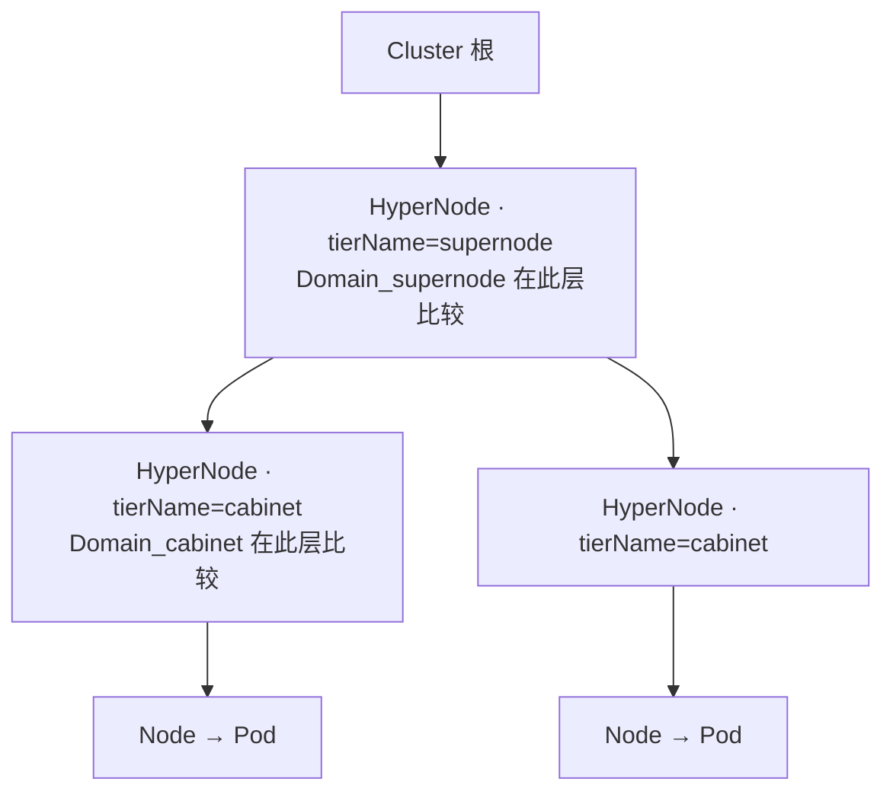

**图例：**

| 符号 | 含义 |
|------|------|
| 同色 cabinet 下多个 Pod | 组内 Gang（`networkTopology`） |
| 多个 cabinet 同属一个 supernode | 见 [实例 4](#实例-4分布式-prefill-decode-推理推荐)（方式一或方式二） |
| 同一 supernode 下不同 cabinet | `subGroupAntiAffinity` @ cabinet（policy 内分片互斥） |
| 两个 supernode 各放一个 PodGroup | `podGroupAntiAffinity` @ supernode（跨 instance） |

## 场景总览

| 编号 | 场景 | 业务价值 | 使用能力 | 默认推荐 |
|------|------|----------|----------|----------|
| [实例 1](#实例-1训练-job组内-gang) | 训练 / 同步训练 Worker Gang | 机内/柜内 NVLink 或高带宽域训练 | 仅 `networkTopology` | 训练默认 |
| [实例 2](#实例-2多-inference-instance故障隔离) | 多推理 instance 并行 | 单超节点故障不拖垮全部在线副本 | `podGroupAntiAffinity` | 多副本 serving |
| [实例 3](#实例-3单模板在线推理) | 无 Prefill-Decode 拆分 | 配置简单、整组 Gang | 仅 `networkTopology` | 小模型推理 |
| [实例 4](#实例-4分布式-prefill-decode-推理推荐) | 4×prefill + 2×decode 分片 | 分片故障隔离 + Prefill-Decode 低延迟（共超节点） | `subGroupPolicy` + `matchLabelKeys` + 分片反亲和；共超节点二选一（见实例 4） | **Prefill-Decode 生产默认** |
| [实例 5](#实例-5多-instance--pd-组合) | 实例 4 + 多 instance | 容量扩展 + 双层故障域 | `podGroupAntiAffinity` + 实例 4 | 生产全栈 |
| [实例 6](#实例-6可选prefill-与-decode-跨角色分机柜) | prefill 与 decode 强制分柜 | 角色级资源/故障硬隔离（牺牲局部性） | 跨 policy `subGroupAntiAffinity` | **仅特殊需求** |
| [实例 7](#实例-7subgroup-软性反亲和可选) | Prefill-Decode 分片 **尽量** 分机柜 | 资源紧时仍可调度 | `subGroupAntiAffinity.preferred` + `weight` | 非关键 SLO |

**不推荐作为 Prefill-Decode 默认：** prefill 与 decode **跨角色分机柜**（实例 6）——与「共超节点、降低 Prefill-Decode 通信代价」通常相反；**推荐** policy 内 prefill↔prefill、decode↔decode 分机柜（实例 4）。

---

## 场景实例

> 每个实例包含：**场景与价值** → **配置要点** → **调度结果（HyperNode 树）** → **与其它实例差异**。  
> **层级双写法（示例集群）：** `supernode` ↔ `spec.tier: 2`，`cabinet` ↔ `spec.tier: 1`。下文 YAML 在 `highestTierName` / `topologyTierName` 旁用注释标出等价的 **`highestTierAllowed` / `topologyTier` 整数**（二选一，勿同时启用）。

### 实例 1：训练 Job — 组内 Gang

**场景：** 单 PodGroup，多 Worker（如 4 组 × 8 GPU）在同一训练 Job 内 Gang 调度。  
**业务价值：** 同 SubJob 内 Pod 落在 **同一机柜（或更低 tier）**，提高机内/柜内通信带宽，满足 AllReduce 等集合通信。  
**能力：** `networkTopology`（**不**使用 `topologyAffinity` / `subGroupTopologyAffinity`）。

| 配置选择 | 适用 |
|----------|------|
| `subGroupPolicy[].networkTopology` @ cabinet | 多 SubJob / 分区，每区 8 Pod 聚柜 |
| `PodGroupSpec.networkTopology` @ supernode | 整 Job 共超节点（无分片互斥时） |

```yaml
spec:
  minMember: 32
  # 可选：整 Job 不跨 supernode
  # networkTopology: { mode: hard, highestTierName: supernode }
  # 或：networkTopology: { mode: hard, highestTierAllowed: 2 }
  subGroupPolicy:
    - name: workers
      subGroupSize: 8
      networkTopology:
        mode: hard
        highestTierName: cabinet
        # highestTierAllowed: 1   # 与 highestTierName: cabinet 二选一
```

**调度结果（HyperNode 树）：** 每个 SubJob（8 Pod）占 **一个** cabinet，组内 Pod 不跨柜。

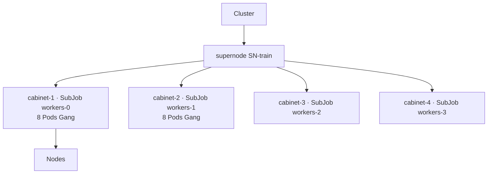

**差异：** 无组间拓扑 API；若需多 Job 互斥，另见实例 2。

---

### 实例 2：多 inference instance — 故障隔离

**场景：** 同一模型 `llama-70b` 起 3 个 PodGroup（instance-0/1/2），同时 serving。  
**业务价值：** 任意 **单个超节点故障** 只影响一个 instance，其余 instance 仍可服务。  
**能力：** `topologyAffinity.podGroupAntiAffinity` @ `supernode` + `podGroupSelector`（匹配其它 PodGroup 的 `metadata.labels`）。

`metadata.labels` 与 `podGroupSelector` 中的键值须 **一致**；通常 **一个** label 即可界定 peer 集合（仅当需要 AND/OR 组合时再增加 `matchLabels` 项或改用 `matchExpressions`）。

```yaml
metadata:
  labels:
    # 【用户设置】Volcano 不会自动生成；在创建 PodGroup 时由平台/业务方写入。
    # 【赋值原则】凡应在同一拓扑层（topologyDomain 所指定的 tier）上彼此「异域」的 PodGroup，对此键使用相同取值；
    #   本例 llama-70b-prod = 同一生产模型服务的多 instance 池（instance-0/1/2 互斥占不同 supernode）。
    #   不同环境/流量池用不同值（如 llama-70b-staging）；与 instance 名、Pod 模板 label 无关。
    topology.volcano.sh/spread-group: llama-70b-prod
spec:
  topologyAffinity:
    podGroupAntiAffinity:
      requiredDuringSchedulingIgnoredDuringExecution:
        - podGroupSelector:
            matchLabels:
              topology.volcano.sh/spread-group: llama-70b-prod
          topologyTierName: supernode
          # topologyTier: 2   # 与 topologyTierName: supernode 二选一
```

**调度结果（HyperNode 树）：** 比较在 **PodGroup 级** `Domain_supernode`；三个 instance 落在 **三个不同** supernode。

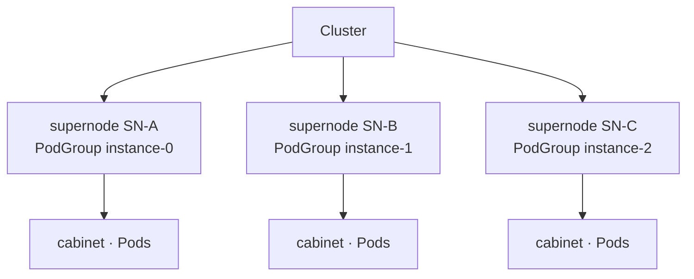

**差异：** 约束 **PodGroup 之间**；instance 内 Prefill-Decode 拓扑见实例 4。

---

### 实例 3：单模板在线推理

**场景：** 一种 Pod 模板，无 prefill/decode 拆分，整组副本 Gang。  
**业务价值：** 配置成本最低；适合无 PD、无分片的在线推理。  
**能力：** `PodGroupSpec.networkTopology` 和/或 `subGroupPolicy[].networkTopology`（二选一或组合）。

```yaml
spec:
  minMember: 8
  networkTopology:
    mode: hard
    highestTierName: cabinet
    # highestTierAllowed: 1   # 与 highestTierName: cabinet 二选一
  # 或 subGroupPolicy:
  #   - name: infer
  #     subGroupSize: 8
  #     networkTopology: { mode: hard, highestTierName: cabinet }
  #     # networkTopology: { mode: hard, highestTierAllowed: 1 }
```

**调度结果（HyperNode 树）：**

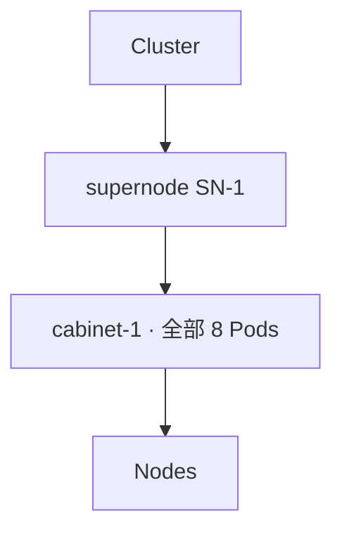

**差异：** 仅 1 条 policy 且无组间诉求时，**不要**配 `subGroupTopologyAffinity`。

---

### 实例 4：分布式 Prefill-Decode 推理（推荐）

**场景：** 一个 inference instance：4 个 prefill 分片（各 8 Pod）+ 2 个 decode 分片（各 6 Pod）；用 **`prefill` / `decode` 两条 `subGroupPolicy`** + **`matchLabelKeys`** 表达分片，**不要**为每个分片单独建 policy 名（不写 `prefill-0` 等）。

**业务目标（两种方式一致）：**

| 约束 | 对业务的意义 |
|------|----------------|
| 同角色各分片 **不同机柜** | 单柜故障不会打掉全部 prefill 或全部 decode |
| prefill + decode **落在同一超节点** | Prefill-Decode 跨阶段流量尽量在超节点内，降低时延 |
| prefill 与 decode **不强制分机柜** | 允许某 decode 与某 prefill 同柜，调度更灵活 |
| 每个分片内 Pod **同柜 Gang** | 分片内 8/6 Pod 仍走高速域 |

**共同配置（两种方式都要写）：** `subGroupPolicy`（含 `matchLabelKeys`、组内 `networkTopology` @ cabinet）+ **`subGroupAntiAffinity`**（prefill↔prefill、decode↔decode 分机柜）。  
**仅「共超节点」的写法二选一**（见下）。

---

#### 方式一：在 PodGroup 上声明「整个推理实例共超节点」

适合：按 **instance / PodGroup** 管理资源域，希望顶层 YAML 一眼看出「这一副本不跨超节点」。

```yaml
spec:
  minMember: 44
  networkTopology:
    mode: hard
    highestTierName: supernode
    # highestTierAllowed: 2   # 与 highestTierName: supernode 二选一
  subGroupPolicy:
    - name: prefill
      labelSelector:
        matchLabels: { volcano.sh/role: prefill }
      matchLabelKeys: [volcano.sh/shard-id]
      subGroupSize: 8
      minSubGroups: 4
      networkTopology: { mode: hard, highestTierName: cabinet }
      # networkTopology: { mode: hard, highestTierAllowed: 1 }
    - name: decode
      labelSelector:
        matchLabels: { volcano.sh/role: decode }
      matchLabelKeys: [volcano.sh/shard-id]
      subGroupSize: 6
      minSubGroups: 2
      networkTopology: { mode: hard, highestTierName: cabinet }
      # networkTopology: { mode: hard, highestTierAllowed: 1 }
  subGroupTopologyAffinity:
    subGroupAntiAffinity:
      requiredDuringSchedulingIgnoredDuringExecution:
        - subGroupSelector:
            matchSubGroupPolicyNames: [prefill]
          antiSubGroupSelector:
            matchSubGroupPolicyNames: [prefill]
          topologyTierName: cabinet
          # topologyTier: 1
        - subGroupSelector:
            matchSubGroupPolicyNames: [decode]
          antiSubGroupSelector:
            matchSubGroupPolicyNames: [decode]
          topologyTierName: cabinet
          # topologyTier: 1
```

---

#### 方式二：在组间拓扑里声明「prefill 与 decode 共超节点」

适合：习惯在 **`subGroupTopologyAffinity`** 里集中写 Prefill-Decode 的 **角色间关系**（分片互斥 + 共超节点都在同一节）。

```yaml
spec:
  minMember: 44
  subGroupPolicy:
    - name: prefill
      labelSelector:
        matchLabels: { volcano.sh/role: prefill }
      matchLabelKeys: [volcano.sh/shard-id]
      subGroupSize: 8
      minSubGroups: 4
      networkTopology: { mode: hard, highestTierName: cabinet }
      # networkTopology: { mode: hard, highestTierAllowed: 1 }
    - name: decode
      labelSelector:
        matchLabels: { volcano.sh/role: decode }
      matchLabelKeys: [volcano.sh/shard-id]
      subGroupSize: 6
      minSubGroups: 2
      networkTopology: { mode: hard, highestTierName: cabinet }
      # networkTopology: { mode: hard, highestTierAllowed: 1 }
  subGroupTopologyAffinity:
    subGroupAffinity:
      requiredDuringSchedulingIgnoredDuringExecution:
        - matchSubGroupPolicyNames: [prefill, decode]
          topologyTierName: supernode
          # topologyTier: 2
    subGroupAntiAffinity:
      requiredDuringSchedulingIgnoredDuringExecution:
        - subGroupSelector:
            matchSubGroupPolicyNames: [prefill]
          antiSubGroupSelector:
            matchSubGroupPolicyNames: [prefill]
          topologyTierName: cabinet
          # topologyTier: 1
        - subGroupSelector:
            matchSubGroupPolicyNames: [decode]
          antiSubGroupSelector:
            matchSubGroupPolicyNames: [decode]
          topologyTierName: cabinet
          # topologyTier: 1
```

---

#### 两种方式：业务上的相同点与不同点

| | 说明 |
|---|------|
| **相同点** | 目标拓扑一致：6 个分片占 6 个机柜，且 **同属一个超节点**；分片内 Gang、分片间互斥、prefill/decode 不强制分柜；**分片互斥与组内同柜的 YAML 完全相同**，与「共超节点」写法无关（见下图）。 |
| **不同点 · 配置意图** | **方式一**：整份 PodGroup（推理 instance）不跨超节点。**方式二**：仅 `matchSubGroupPolicyNames` 点名的 policy（本例 prefill + decode）共超节点。 |
| **不同点 · 适用范围** | **方式一** 约束 **本 PodGroup 内全部 workload**（若以后在同一 PodGroup 里增加其它 `subGroupPolicy`，默认也受「整实例不跨超节点」约束）。**方式二** 只约束 affinity term 里点名的 policy（本例为 `[prefill, decode]`）；未写进 term 的其它 policy **不受这条共超节点约束**。 |
| **不同点 · 配置习惯** | **方式一** 共超节点写在 `spec` 顶层，与实例 3 等「整组 Gang」风格一致。**方式二** 共超节点与分片互斥同在 `subGroupTopologyAffinity`，便于只维护一块「组间规则」。 |
| **选用建议** | 本场景仅 prefill/decode、且希望表达 **整实例边界** 时，**更推荐方式一**；若团队规范要求所有组间拓扑只写在 `subGroupTopologyAffinity`，可用 **方式二**，但 **不要与方式一重复配置** 同一超节点约束。 |

**预期部署形态（两种方式相同）：**

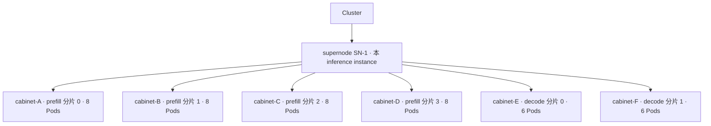

| 在集群里看到 | 配置含义 |
|--------------|----------|
| 每个机柜内 8 或 6 个 Pod | 各 `subGroupPolicy.networkTopology` @ cabinet（分片内 Gang） |
| 4 个 prefill 机柜互不相同 | `subGroupAntiAffinity`：两侧均为 `[prefill]` |
| 2 个 decode 机柜互不相同 | `subGroupAntiAffinity`：两侧均为 `[decode]` |
| 全部在 SN-1 下 | 方式一：`PodGroup.networkTopology`；方式二：`subGroupAffinity` `[prefill, decode]` @ supernode |
| decode 可与某 prefill 同柜 | **未配置** prefill 与 decode 之间的分机柜规则 |

**填写提醒：** `matchSubGroupPolicyNames` 只写 policy 名 **`prefill` / `decode`**，不要写 `prefill-0` 等分片后缀。

---

### 实例 5：多 instance + Prefill-Decode 组合

**场景：** 实例 4 × N 个 PodGroup。  
**业务价值：** 外层超节点故障隔离 + 内层分片机柜隔离与共超节点 PD。  
**能力：** `topologyAffinity.podGroupAntiAffinity` + 实例 4 全部配置。

```yaml
metadata:
  labels:
    topology.volcano.sh/spread-group: llama-70b-prod   # 同实例 2：用户设置，多 instance 共用同一取值
spec:
  topologyAffinity:
    podGroupAntiAffinity:
      requiredDuringSchedulingIgnoredDuringExecution:
        - podGroupSelector:
            matchLabels:
              topology.volcano.sh/spread-group: llama-70b-prod
          topologyTierName: supernode
          # topologyTier: 2
  # subGroupPolicy + 共超节点 + subGroupAntiAffinity：同实例 4（推荐方式一）
  # 组内/组间 tier 整数注释见实例 4
```

**调度结果（HyperNode 树）：**

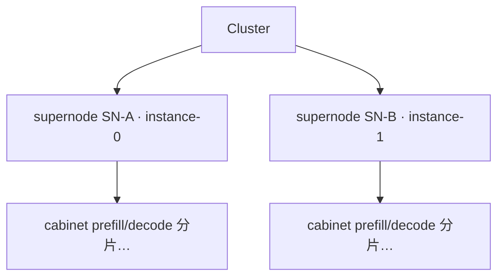

**差异：** `podGroupAntiAffinity` 保证 SN-A ≠ SN-B；**每个 supernode 内部** 复现实例 4 的六柜结构。

---

### 实例 6（可选）：prefill 与 decode **跨角色** 分机柜

**场景：** 在实例 4 之外，强制 prefill 柜组与 decode 柜组 **不相交**。  
**业务价值：** 角色级 GPU/TOR 硬隔离、合规分域；**代价**是跨角色通信更易跨柜。  
**何时用：** 运维明确要求；**非 Prefill-Decode 默认**（与降低 Prefill-Decode 延迟常冲突）。  
**能力：** 共 supernode 配置同 [实例 4](#实例-4分布式-prefill-decode-推理推荐)；另增跨角色 `subGroupAntiAffinity`（prefill vs decode 分机柜）。

```yaml
spec:
  networkTopology:
    mode: hard
    highestTierName: supernode
    # highestTierAllowed: 2
  subGroupTopologyAffinity:
    subGroupAntiAffinity:
      requiredDuringSchedulingIgnoredDuringExecution:
        - subGroupSelector:
            matchSubGroupPolicyNames: [prefill]
          antiSubGroupSelector:
            matchSubGroupPolicyNames: [decode]
          topologyTierName: cabinet
          # topologyTier: 1
  # 分片互斥、组内 @ cabinet 等同实例 4，省略
```

**调度结果对比（HyperNode 树）：**

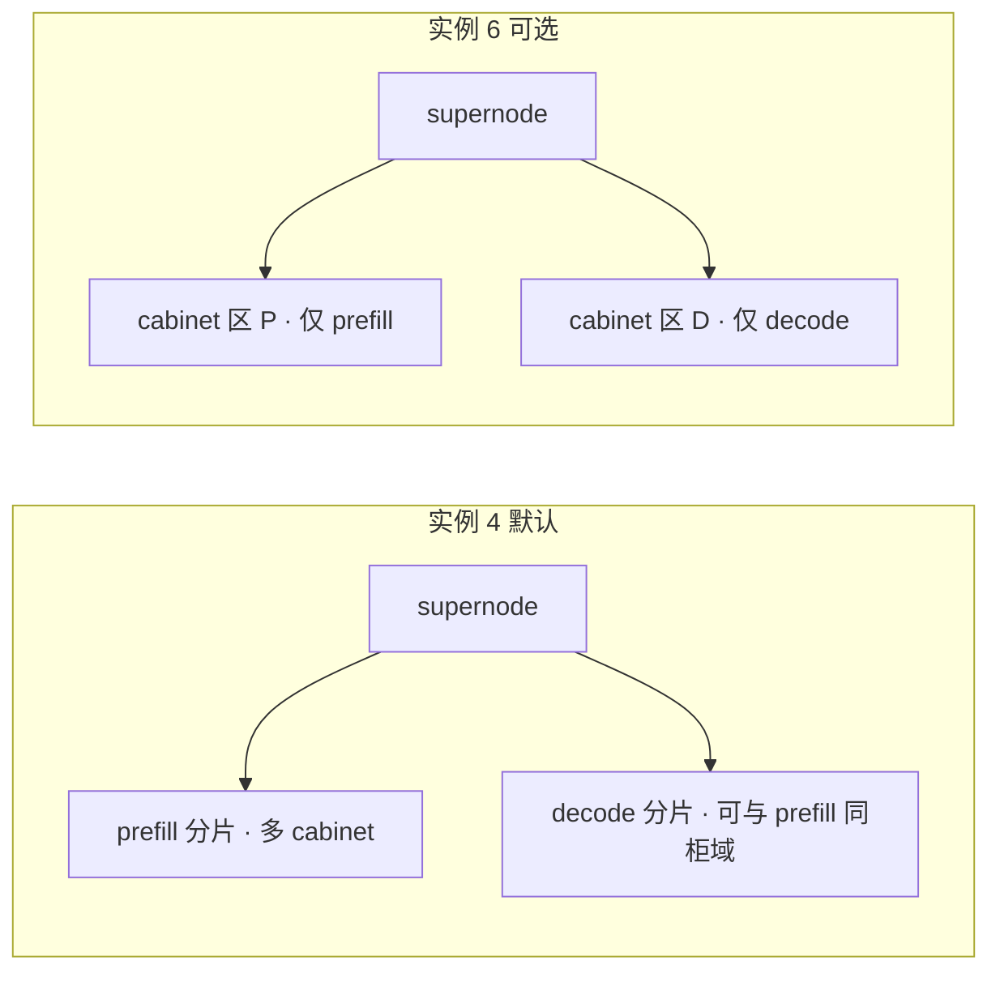

**差异：** 实例 6 **叠加**在实例 4 上；多数部署仅保留 policy 内 `[prefill]` / `[decode]` 互斥即可。

---

### 实例 7：SubGroup 软性反亲和（可选）

**场景：** 与 [实例 4](#实例-4分布式-prefill-decode-推理推荐) 相同的 4 Prefill 分片 + 2 Decode 分片 Prefill-Decode 布局，但机柜资源紧张：希望 prefill / decode **各分片尽量落在不同机柜**，**若做不到也不要阻塞调度**。  
**业务价值：** 在故障隔离与上线率之间折中——有柜可分时仍打散分片；无柜可分时允许临时同柜，避免 PodGroup 长期 Pending。

#### 与实例 4（`required` 反亲和）的对比

| | 实例 4（`requiredDuringSchedulingIgnoredDuringExecution`） | 实例 7（`preferredDuringSchedulingIgnoredDuringExecution` + `weight`） |
|---|-------------------------------------|--------------------------------------|
| **业务语义** | 分片 **必须** 分机柜，否则不满足 | 分片 **优先** 分机柜，不满足仍可调度 |
| **适用** | 生产默认、SLO 要求分片级故障域 | 灰度、扩容、机柜余量不足、非关键批推理 |
| **共超节点** | 仍建议方式一 `PodGroup.networkTopology` @ supernode（与实例 4 相同） | 同左 |

#### 配置示例

在实例 4 **方式一** 基础上，将 `subGroupAntiAffinity` 的 `required` 改为 `preferred`，并为 term 设置 `weight`（越大表示「避开同柜」的偏好越强）：

```yaml
spec:
  minMember: 44
  networkTopology:
    mode: hard
    highestTierName: supernode
    # highestTierAllowed: 2
  subGroupPolicy:
    - name: prefill
      labelSelector:
        matchLabels: { volcano.sh/role: prefill }
      matchLabelKeys: [volcano.sh/shard-id]
      subGroupSize: 8
      minSubGroups: 4
      networkTopology: { mode: hard, highestTierName: cabinet }
      # networkTopology: { mode: hard, highestTierAllowed: 1 }
    - name: decode
      labelSelector:
        matchLabels: { volcano.sh/role: decode }
      matchLabelKeys: [volcano.sh/shard-id]
      subGroupSize: 6
      minSubGroups: 2
      networkTopology: { mode: hard, highestTierName: cabinet }
      # networkTopology: { mode: hard, highestTierAllowed: 1 }
  subGroupTopologyAffinity:
    subGroupAntiAffinity:
      preferredDuringSchedulingIgnoredDuringExecution:
        - weight: 100
          term:
            subGroupSelector:
              matchSubGroupPolicyNames: [prefill]
            antiSubGroupSelector:
              matchSubGroupPolicyNames: [prefill]
            topologyTierName: cabinet
            # topologyTier: 1
        - weight: 100
          term:
            subGroupSelector:
              matchSubGroupPolicyNames: [decode]
            antiSubGroupSelector:
              matchSubGroupPolicyNames: [decode]
            topologyTierName: cabinet
            # topologyTier: 1
```

> **说明：** 软性反亲和 **仅** 通过 `preferredDuringSchedulingIgnoredDuringExecution` + `weight` 表达，**不要** 在 term 上再写 `mode: soft`（与 `required`/`preferred` 重复）。`term` 内只需 `subGroupSelector`、`antiSubGroupSelector`、`topologyTierName`（或 `topologyTier`）。

#### 预期行为（业务视角）

| 集群状况 | 典型结果 |
|----------|----------|
| 超节点内 **≥6 个可用机柜** | 与实例 4 相近：6 分片各占一柜（调度器优先选择「与已放置分片不同柜」的候选） |
| 可用机柜 **不足 6 个** | 仍可能调度成功：部分分片 **同柜** 放置，整体得分偏低；不满足 hard 失败条件 |
| 仅要求共超节点 | 由 `networkTopology` @ supernode 保证；soft 反亲和 **不替代** 共超节点 hard 约束 |

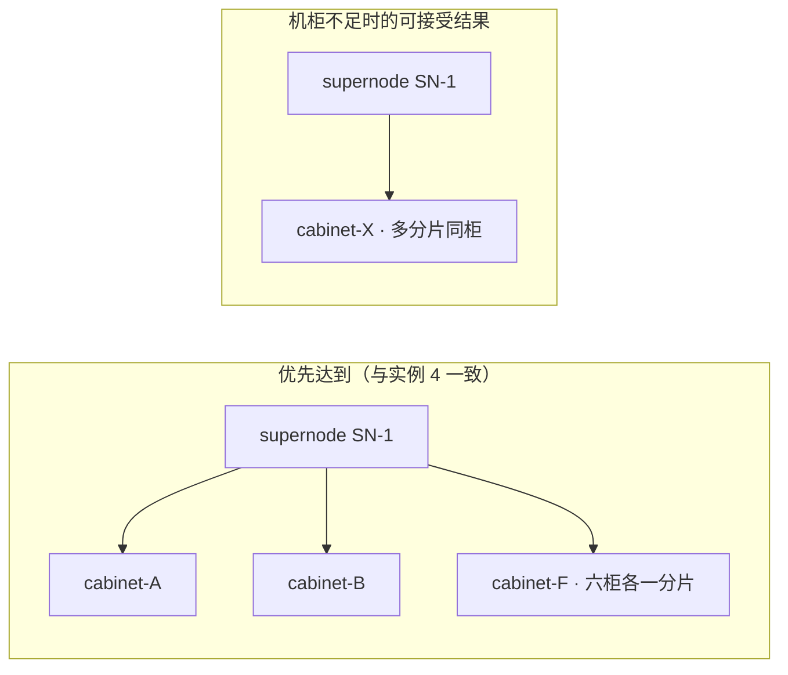

**填写提醒：**

- policy 内互斥：两侧 selector 仍写 **同名** `[prefill]` 或 `[decode]`（与实例 4 相同），**不要**写成 prefill vs decode。
- **勿** 将共超节点改为 soft：Prefill-Decode 低延迟路径通常仍对 supernode 使用 **hard** `networkTopology`（或实例 4 方式二 hard `subGroupAffinity`）。
- 可与 required 类约束 term **混用**（例如 supernode 用 `required` hard，分机柜仅用 `preferred` soft）；Webhook 校验 tier 关系时以 **required** 类 term 为准。

**跨 PodGroup 的 soft 反亲和**（多 instance 尽量分超节点、但不硬失败）可类比为 `topologyAffinity.podGroupAntiAffinity.preferred`，思路与上表相同，场景见 [实例 2](#实例-2多-inference-instance故障隔离)。

---

# API 设计

PodGroup 字段、Go 类型与能力边界。配置示例见 [#用户场景与能力对照](#用户场景与能力对照)；tier 填写见 [#hypernode-层级与-topologytier--topologytiername](#hypernode-层级与-topologytier--topologytiername)；API 取舍见 **附录**。

## PodGroupSpec 新增字段

```go
type PodGroupSpec struct {
    // ... existing fields ...

    // TopologyAffinity: cross-PodGroup topology vs OTHER PodGroups (podGroupSelector).
    // Phase 1 CRD exposes only podGroupAntiAffinity under this object; podGroupAffinity is not declared (see design doc).
    // Intra-PodGroup SubJob relationships: use SubGroupTopologyAffinity.
    // Evaluated at Job scope (HyperNodeGradientForJobFn).
    // +optional
    TopologyAffinity *PodGroupTopologyAffinitySpec `json:"topologyAffinity,omitempty"`

    // SubGroupTopologyAffinity expresses topology affinity/anti-affinity between SubGroupPolicies
    // defined in THIS PodGroup's subGroupPolicy list only. Evaluated per SubJob at
    // HyperNodeGradientForSubJob scope; peers are other SubJobs of the same JobInfo (same PodGroup UID).
    // Cannot reference PodGroups in other namespaces; peers matched via podGroupSelector on PodGroup labels.
    // Requires subGroupPolicy; ignored (webhook reject) if subGroupPolicy is empty.
    // +optional
    SubGroupTopologyAffinity *SubGroupTopologyAffinitySpec `json:"subGroupTopologyAffinity,omitempty"`
}
```

> **`podGroupAffinity`：** Phase 1 不在 CRD 中声明该字段，理由见 [设计决策-2](#ad-2phase-1-不声明-podgroupaffinity)。实现时在 `PodGroupTopologyAffinitySpec` 的 godoc 中引用设计决策-2 即可。

## 核心类型

```go
// TopologyDomainSpec selects the HyperNode tier at which Domain_T is computed for cross-group comparison.
// Semantics align with choosing a "topology dimension" (cf. PodTopologySpread topologyKey), but values come
// from HyperNode.spec.tierName / spec.tier — NOT from Node label keys. See design decision-7.
type TopologyDomainSpec struct {
    // TopologyTier: compare scheduling domains at HyperNode.spec.tier (integer).
    // Must match the numeric tier of a HyperNode layer in this cluster. Mutually exclusive with TopologyTierName.
    // +kubebuilder:validation:Minimum=0
    // +optional
    TopologyTier *int `json:"topologyTier,omitempty"`

    // TopologyTierName: compare scheduling domains at HyperNode.spec.tierName (string).
    // The value MUST be identical to tierName configured on HyperNode CRs in the cluster (case-sensitive).
    // Scheduler resolves it via Session HyperNodeTierNameMap (same source as networkTopology.highestTierName).
    // Example: if cabinet HyperNodes use spec.tierName: cabinet, set topologyTierName: cabinet here.
    // Mutually exclusive with TopologyTier.
    // +optional
    TopologyTierName string `json:"topologyTierName,omitempty"`
    // Note: hard vs soft for topologyAffinity / subGroupTopologyAffinity is NOT expressed here.
    // Use requiredDuringSchedulingIgnoredDuringExecution (hard) vs
    // preferredDuringSchedulingIgnoredDuringExecution (soft), aligned with Kubernetes PodAffinity.
}

// NetworkTopologySpec (PodGroup / SubGroupPolicy): domain aggregation with explicit mode.
// +kubebuilder:validation:Enum=hard;soft
type NetworkTopologySpec struct {
    Mode               NetworkTopologyMode `json:"mode,omitempty"`
    HighestTierName    string              `json:"highestTierName,omitempty"`
    HighestTierAllowed *int                `json:"highestTierAllowed,omitempty"`
}
```

> `TopologyDomainSpec` 的层级字段与 HyperNode CR 的对应关系、填写步骤、与 Kubernetes `topologyKey` 的对照，见 [#hypernode-层级与-topologytier--topologytiername](#hypernode-层级与-topologytier--topologytiername) 与 [设计决策-7](#ad-7组间层级命名与-kubernetes-topologykey)。

### 与 `networkTopology` 的 tier / tierName 对齐

组内 `NetworkTopologySpec` 与组间 `TopologyDomainSpec` 使用 **同一套 HyperNode 层级来源**，仅语义不同（组内「不跨越」vs 组间「在该层比 Domain 相同/不同」）：

| 用途 | 字符串（`spec.tierName`） | 整数（`spec.tier`） | 互斥 |
|------|---------------------------|---------------------|------|
| **组内** Gang / envelope | `networkTopology.highestTierName` | `networkTopology.highestTierAllowed` | 是 |
| **组间** affinity / antiAffinity term | `topologyDomain.topologyTierName` | `topologyDomain.topologyTier` | 是 |

调度器在 Session 内维护 **`HyperNodeTierNameMap`**（`tierName → tier`）与 **`HyperNodeTierSet`**（集群出现过的 `spec.tier` 集合）；`network-topology-aware` 与 `group-topology-affinity` **共用** 上述映射解析层级，保证同一 Job 上 `highestTierName: supernode` 与 `topologyTierName: supernode`（或 `highestTierAllowed: 2` 与 `topologyTier: 2`）指向 **同一物理层**。

### 与 Kubernetes `topologyKey` 的语义对照（速查）

| | Kubernetes（Pod 拓扑散布 / 亲和） | Volcano 组间拓扑 term |
|---|-----------------------------------|------------------------|
| **字段** | `topologySpreadConstraints[].topologyKey` 等 | `topologyDomain.topologyTierName`（或 `topologyTier`） |
| **用户填什么** | Node **标签键**（如 `topology.kubernetes.io/zone`、`kubernetes.io/hostname`） | HyperNode **`spec.tierName`**（如 `supernode`、`cabinet`），**不是** Node label |
| **域如何划分** | 具有相同 label **key+value** 的 Node 为一域 | 沿 HyperNode 父链取第一个 `tierName`/`tier` 匹配的祖先 `metadata.name` 为 `Domain_T` |
| **为何不直接叫 `topologyKey`** | — | 与 Job/Pod 模板内已有 **`podAffinity.topologyKey`（Node label key）** 同名异义，易误填 zone/hostname；见 [决策-7](#ad-7组间层级命名与-kubernetes-topologykey) |

**推荐：** 与现有 [Network Topology Aware Scheduling](./Network%20Topology%20Aware%20Scheduling.md) 设计文档一致，运维侧优先 **`tierName`**（跨集群对照表友好）；自动化/模板生成可用 **`tier` 整数**（与 CR 中 `spec.tier` 一一对应，不依赖字符串命名）。

### `required` / `preferred` 与 `mode`（不重复）

| API | 如何表达 hard / soft | 是否在 term 上写 `mode` |
|-----|----------------------|-------------------------|
| `topologyAffinity` / `subGroupTopologyAffinity` | **`requiredDuringSchedulingIgnoredDuringExecution`** = 必须满足（hard）；**`preferredDuringSchedulingIgnoredDuringExecution`** = 尽量满足（soft，`weight` 越大偏好越强） | **否**（与 Kubernetes `PodAffinity` / `PodAntiAffinity` 一致） |
| `PodGroupSpec.networkTopology`、`subGroupPolicy[].networkTopology` | 字段 **`mode: hard \| soft`**（无 required/preferred 列表） | **是**（仅此两类配置使用 `mode`） |

**为何不在 term 上保留 `mode`：** 若同时在 `preferred` 列表里写 `mode: soft`，或在 `required` 里写 `mode: hard`，与列表语义重复，且可能出现 `required` + `mode: soft` 等矛盾。Webhook 对组间拓扑 term **拒绝或忽略** `topologyDomain` 内的 `mode` 字段。

**实现约定：** `ContainsHardCrossSubGroupTopology` / `ContainsHardCrossPodGroupTopology` 仅看是否存在 **非空 `required`** 列表；`preferred` 条目只注册 `HyperNodeOrderFn`。

### YAML 书写约定

- **组间 term**（`topologyAffinity` / `subGroupTopologyAffinity`）：下文示例为可读性常将 `topologyTierName` 或 `topologyTier` **与 selector 写在 term 同级**；与 Go 类型等价于嵌套对象 `topologyDomain: { ... }`，且 **`topologyTierName` 与 `topologyTier` 互斥**（同 `TopologyDomainSpec`）。
- **组内**（`networkTopology`）：`mode: hard | soft` + `highestTierName` **或** `highestTierAllowed`（互斥），**无** `required` / `preferred` 列表。

**组间 term：名称 vs 数字（等价示例，假设 supernode=`tier: 2`、cabinet=`tier: 1`）**

```yaml
# 跨 PodGroup：写法 A（tierName）与写法 B（tier 整数）二选一，勿同时写
topologyAffinity:
  podGroupAntiAffinity:
    requiredDuringSchedulingIgnoredDuringExecution:
      - podGroupSelector:
            matchLabels:
              topology.volcano.sh/spread-group: llama-70b-prod
        topologyTierName: supernode   # A
        # topologyTier: 2             # B（与 A 等价，当 supernode 对应 spec.tier==2）

# 跨 SubGroup：同样支持 topologyTierName 或 topologyTier
subGroupTopologyAffinity:
  subGroupAntiAffinity:
    requiredDuringSchedulingIgnoredDuringExecution:
      - subGroupSelector:
          matchSubGroupPolicyNames: [prefill]
        antiSubGroupSelector:
          matchSubGroupPolicyNames: [prefill]
        topologyTierName: cabinet     # 或 topologyTier: 1
```

```go
// PodGroupTopologyAffinitySpec expresses topology constraints between THIS PodGroup and OTHER PodGroups
// podGroupSelector (metav1.LabelSelector). Evaluated at Job scope (HyperNodeGradientForJobFn).
//
// Phase 1 scope: ONLY PodGroupAntiAffinity is implemented and exposed in the CRD.
//
// podGroupAffinity (cross-PodGroup colocation) is intentionally NOT declared on this struct in Phase 1:
//   - No product scenario requires forcing multiple PodGroups into the same Domain_T at a given tier.
//   - Single-instance colocation: use PodGroupSpec.networkTopology.
//   - Prefill/decode or other roles in one instance: use SubGroupTopologyAffinity.subGroupAffinity.
//   - Peers: other PodGroups whose metadata.labels match podGroupSelector (kube-scheduler labelSelector semantics).
// Phase 2+ may add: PodGroupAffinity *TopologyAffinitySpec `json:"podGroupAffinity,omitempty"` additively.
type PodGroupTopologyAffinitySpec struct {
    // PodGroupAntiAffinity: hard/soft anti-affinity vs other PodGroups at topologyTier(/Name).
    // +optional
    PodGroupAntiAffinity *TopologyAntiAffinitySpec `json:"podGroupAntiAffinity,omitempty"`
}

// SubGroupTopologyAffinitySpec: intra-PodGroup, cross-subGroupPolicy scope only.
type SubGroupTopologyAffinitySpec struct {
    SubGroupAntiAffinity *SubGroupAntiAffinitySpec `json:"subGroupAntiAffinity,omitempty"`
    SubGroupAffinity     *SubGroupAffinitySpec     `json:"subGroupAffinity,omitempty"`
}

// SubGroupAntiAffinitySpec / SubGroupAffinitySpec: term lists for SubGroup peers (not PodGroup selectors).
type SubGroupAntiAffinitySpec struct {
    RequiredDuringSchedulingIgnoredDuringExecution  []SubGroupTopologyAntiAffinityTerm `json:"requiredDuringSchedulingIgnoredDuringExecution,omitempty"`
    PreferredDuringSchedulingIgnoredDuringExecution []WeightedSubGroupTopologyAntiAffinityTerm `json:"preferredDuringSchedulingIgnoredDuringExecution,omitempty"`
}

type SubGroupAffinitySpec struct {
    RequiredDuringSchedulingIgnoredDuringExecution  []SubGroupTopologyAffinityTerm `json:"requiredDuringSchedulingIgnoredDuringExecution,omitempty"`
    PreferredDuringSchedulingIgnoredDuringExecution []WeightedSubGroupTopologyAffinityTerm `json:"preferredDuringSchedulingIgnoredDuringExecution,omitempty"`
}

type TopologyAntiAffinitySpec struct {
    RequiredDuringSchedulingIgnoredDuringExecution  []TopologyAntiAffinityTerm `json:"requiredDuringSchedulingIgnoredDuringExecution,omitempty"`
    PreferredDuringSchedulingIgnoredDuringExecution []WeightedTopologyAntiAffinityTerm `json:"preferredDuringSchedulingIgnoredDuringExecution,omitempty"`
}

// Cross-PodGroup terms (anti-affinity; Phase 1)
type TopologyAntiAffinityTerm struct {
    // PodGroupSelector: match OTHER PodGroups by metadata.labels (same semantics as kube-scheduler labelSelector).
    // +required
    PodGroupSelector  *metav1.LabelSelector `json:"podGroupSelector"`
    // NamespaceSelector: optional scope for peer PodGroups (same role as in PodAntiAffinityTerm).
    // +optional
    NamespaceSelector *metav1.LabelSelector `json:"namespaceSelector,omitempty"`
    TopologyDomain    TopologyDomainSpec `json:"topologyDomain"`
}

// --- Phase 2+ only (NOT in Phase 1 CRD): cross-PodGroup affinity / colocation ---
// When podGroupAffinity is added to PodGroupTopologyAffinitySpec, use these types (same shape as anti).
//
// type TopologyAffinitySpec struct {
//     RequiredDuringSchedulingIgnoredDuringExecution  []TopologyAffinityTerm `json:"requiredDuringSchedulingIgnoredDuringExecution,omitempty"`
//     PreferredDuringSchedulingIgnoredDuringExecution []WeightedTopologyAffinityTerm `json:"preferredDuringSchedulingIgnoredDuringExecution,omitempty"`
// }
//
// type TopologyAffinityTerm struct {
//     PodGroupSelector  *metav1.LabelSelector `json:"podGroupSelector"`
//     NamespaceSelector *metav1.LabelSelector `json:"namespaceSelector,omitempty"`
//     TopologyDomain    TopologyDomainSpec `json:"topologyDomain"`
// }

// Cross-SubGroup terms (intra-PodGroup only).
// matchSubGroupPolicyNames ALWAYS refers to subGroupPolicy[].name (policy name), NOT shard suffixes in SubJobID.
type SubGroupTopologyAntiAffinityTerm struct {
    // SubGroupSelector: applies when the SubJob being scheduled belongs to one of these policy names.
    SubGroupSelector SubGroupSelectorSpec `json:"subGroupSelector"`
    // AntiSubGroupSelector: peer SubJobs to compare against (already placed in this PodGroup).
    AntiSubGroupSelector SubGroupSelectorSpec `json:"antiSubGroupSelector"`
    TopologyDomain       TopologyDomainSpec `json:"topologyDomain"`
}

type SubGroupTopologyAffinityTerm struct {
    // MatchSubGroupPolicyNames: policy names (subGroupPolicy[].name). All SubJobs under ANY listed policy
    // must share Domain_T at the tier selected in topologyDomain (e.g. [prefill, decode] @ supernode covers 4+2 SubJobs).
    // Must list >= 2 distinct policy names.
    MatchSubGroupPolicyNames []string `json:"matchSubGroupPolicyNames"`
    TopologyDomain           TopologyDomainSpec `json:"topologyDomain"`
}

// SubGroupSelectorSpec selects SubJobs by policy name (and optional pod labelSelector).
type SubGroupSelectorSpec struct {
    // MatchSubGroupPolicyNames: subGroupPolicy[].name. When matchLabelKeys splits one policy into multiple
    // SubJobs (SubJobID = <JobID>/<name>-<matchValues>), ALL such SubJobs match this selector.
    MatchSubGroupPolicyNames []string `json:"matchSubGroupPolicyNames,omitempty"`
    LabelSelector            *metav1.LabelSelector `json:"labelSelector,omitempty"`
}

type WeightedSubGroupTopologyAntiAffinityTerm struct {
    Weight int32                              `json:"weight"`
    Term   SubGroupTopologyAntiAffinityTerm   `json:"term"`
}

type WeightedSubGroupTopologyAffinityTerm struct {
    Weight int32                            `json:"weight"`
    Term   SubGroupTopologyAffinityTerm    `json:"term"`
}
```

## 附录：API 设计取舍

### API 设计取舍：`subGroupSelector` 与 `antiSubGroupSelector` 为何不合并

`subGroupAntiAffinity` 的每条 term 使用 **两个** `SubGroupSelectorSpec`（`subGroupSelector`、`antiSubGroupSelector`），而不是像 `subGroupAffinity` 那样只用一个 `matchSubGroupPolicyNames` 列表。本节说明定稿形状的原因及与亲和的差异。

#### 调度语义：有向规则，不是「列表内任意两两互斥」

实现上，一条反亲和 term 表达的是：

> 当 **当前待调度** 的 SubJob 属于 `subGroupSelector` 所匹配的 policy 集合时，为其选择的 `Domain_T`（在 `topologyDomain` 指定层）必须与 **本 PodGroup 内已放置**、且属于 `antiSubGroupSelector` 所匹配集合的 **任意 peer SubJob** 的 `Domain_T` **不同**。

因此这是 **subject（谁在调度）→ peer（跟谁比）** 的有向关系；两侧集合可以相同，也可以不同。

| 写法 | subGroupSelector | antiSubGroupSelector | 业务语义 |
|------|------------------|----------------------|----------|
| 实例 4：分片互斥 | `[prefill]` | `[prefill]` | 仅在 **prefill 各 SubJob 之间** 两两分机柜；不涉及 decode |
| 实例 6：跨角色分柜 | `[prefill]` | `[decode]` | prefill SubJob 与 decode SubJob **异域**；两侧 policy 名 **不相交** |

#### 为何不合并为单个 `matchSubGroupPolicyNames`

反亲和 term **不** 采用与亲和相同的单列表 `matchSubGroupPolicyNames`，主要原因如下。

**1. 单列表语义无法同时覆盖「policy 内互斥」与「跨 policy 互斥」**

若写成：

```yaml
# 反例：单一列表（不支持）
matchSubGroupPolicyNames: [prefill, decode]
```

常见误解有两种，且都与 [实例 4](#实例-4分布式-prefill-decode-推理推荐) 默认诉求冲突：

| 若理解为 | 效果 | 问题 |
|----------|------|------|
| 列表内 **任意两个** SubJob（含 prefill×decode）都互斥 | 强制 prefill 与 decode 分机柜 | 实例 4 默认 **允许** 同柜，仅需分片间互斥 |
| 仅在 **各自 policy 内** 两两互斥 | 语义正确 | 单列表 **表达不清**，仍需额外 `scope: IntraPolicyOnly` 等枚举 |

为消歧就要引入 `antiAffinityScope`、`pairwiseMode` 等字段，配置与 Webhook 复杂度 **不低于** 双 selector，可读性更差。

**2. 与 `subGroupAffinity` 的「单列表」语义 deliberately 不同**

| | `subGroupAffinity`（共域） | `subGroupAntiAffinity`（异域） |
|---|---------------------------|--------------------------------|
| 列表含义 | 所列 policy 下 **全部** SubJob 落在 **同一** `Domain_T` | 需区分 **谁调度** 与 **跟谁比** |
| 典型写法 | `matchSubGroupPolicyNames: [prefill, decode]` | `subGroupSelector` / `antiSubGroupSelector` 可同可异 |
| 拓扑关系 | 无向、共域（clique 共一点） | 有向、成对异域 |

亲和用单列表表示「大家一起挤进同一个域」是自然且无歧义的；反亲和若强行共用同一形状，容易与亲和 **配反**（例如误把 `[prefill, decode]` 写成反亲和列表）。

**3. 对齐 kube-scheduler 的 PodAffinity / PodAntiAffinity 双端建模**

kube-scheduler 处理的 `PodAntiAffinityTerm` 通过 `labelSelector`（及可选 `namespaceSelector`）指明 **要避免的 Pod 集合**；**当前待调度 Pod** 作为 subject 隐含存在（见 [Kubernetes Pod affinity](https://kubernetes.io/docs/concepts/scheduling-eviction/assign-pod-node/#affinity-and-anti-affinity)）。Volcano 在 SubJob / `subGroupPolicy.name` 粒度上显式写出 subject 与 peer，便于：

- Webhook 校验：跨 policy 时两侧 `matchSubGroupPolicyNames` **不相交**；policy 内互斥时 **允许相同**（见 [校验规则](#校验规则webhook) 规则 8）；
- 调度顺序：`subGroupSelector` 侧 policy 对应 SubJob **优先** 调度，再调度依赖其 peer 域信息的 SubJob（见 [#allocate-action其它](#allocate-action其它) 中 `organizeJobWorksheet`）；
- 显式 subject / peer 便于 Webhook 校验与调度顺序，term 顶层形状固定。

#### 配置示例

**policy 内两两互斥（实例 4、7）** — `subGroupSelector` 与 `antiSubGroupSelector` **均必填**；policy 内互斥时两侧写 **相同** policy 名：

```yaml
subGroupAntiAffinity:
  requiredDuringSchedulingIgnoredDuringExecution:
    # 两侧 policy 名相同：prefill 分片互斥
    - subGroupSelector:
        matchSubGroupPolicyNames: [prefill]
      antiSubGroupSelector:
        matchSubGroupPolicyNames: [prefill]
      topologyTierName: cabinet
```

**跨 policy 互斥（实例 6）** — **必须** 区分两侧，不可合并为单列表：

```yaml
    - subGroupSelector:
        matchSubGroupPolicyNames: [prefill]
      antiSubGroupSelector:
        matchSubGroupPolicyNames: [decode]
      topologyTierName: cabinet
```

**小结：** 双 selector 在 **不引入歧义枚举** 的前提下，同时支持 **policy 内分片互斥** 与 **跨 policy 角色互斥**；与 `subGroupAffinity` 单列表共域形成对称、互补的 API 面。`antiSubGroupSelector` 为 **必选字段**，不提供「省略 peer 侧」或「单 policy 名简写」等等价写法。

### API 设计取舍：`subGroupTopologyAffinity` 为何在 PodGroup 顶层，而非挂在每条 `subGroupPolicy` 上

**同 PodGroup、跨 SubGroup** 的拓扑关系集中在 **`PodGroupSpec.subGroupTopologyAffinity`**，**不** 挂在各 `subGroupPolicy` 上。

#### 与「挂在 Pod 模板 / 各 policy 上」的差异

| 维度 | kube-scheduler /「每条 policy 各写组间规则」 | 本设计（PodGroup 顶层） |
|------|---------------------------------------------|-------------------------|
| 声明位置 | Pod `spec`，或每条 `subGroupPolicy` 各写一份 | **`PodGroupSpec.subGroupTopologyAffinity`** 一处声明 |
| 比较对象 | **Pod** ↔ Pod | **SubJob**（`subGroupPolicy` + `matchLabelKeys`）↔ 已分配 `Domain_T` |
| 拓扑域 | 多依赖 Node label 等外挂约定 | HyperNode `topologyTier` / `topologyTierName` |
| 组内 vs 组间 | 易与组内规则拆在两处、难统一校验 | `subGroupPolicy[].networkTopology`（组内）+ 顶层字段（组间），同一调度链 **AND** |

调度单元是 **SubJob（一组 Pod）**，不是单个 Pod；SubJob 内逐 Pod 打散仍用 Pod 模板上的 spread 等（见 [范围 · SubJob 内逐 Pod spread](#目标外)），**不由** 本字段承担。

#### 反例：组间规则写在各 `subGroupPolicy` 内（不支持）

```yaml
subGroupPolicy:
  - name: prefill
    networkTopology: { mode: hard, highestTierName: cabinet }
    subGroupTopologyAntiAffinity:
      - peerSubGroupPolicyNames: [prefill]   # 分片互斥
        topologyTierName: cabinet
      - peerSubGroupPolicyNames: [decode]    # 实例 6 时才需要
        topologyTierName: cabinet
  - name: decode
    networkTopology: { mode: hard, highestTierName: cabinet }
    subGroupTopologyAntiAffinity:
      - peerSubGroupPolicyNames: [decode]
        topologyTierName: cabinet
```

上述写法在 **形式上** 接近 kube-scheduler「每个 Pod 模板在 `spec` 里写 `podAntiAffinity`」；在 Volcano 中 **不采用**，原因如下（故定稿为 PodGroup 顶层 `subGroupTopologyAffinity`）。

**1. 组内与组间职责已在不同字段拆分**

| 作用域 | 配置位置 | 语义 |
|--------|----------|------|
| **同一 SubJob 内** Pod 聚在同一拓扑域 | `subGroupPolicy[].networkTopology` | 组内 Gang / 域内聚合（`network-topology-aware`） |
| **不同 SubJob / policy 之间** | `subGroupTopologyAffinity` | 分片互斥、跨角色共域/异域 |

`networkTopology` **已经在每个 policy 上**；再加一层 per-policy 的「组间」字段，会与 `networkTopology` 并列，用户需记住两个块都在 policy 内、职责不同，**并不更简单**。

**2. 许多约束是「一条边」或「多方共域」，天然不属于单一 policy**

| 场景 | 为何不适合只写在一侧 policy |
|------|------------------------------|
| `subGroupAffinity`：`[prefill, decode]` @ supernode（实例 4 方式二） | 一条约束涉及 **两个** policy 的 **并集**；写在 prefill 或 decode 任一侧都不完整，写两侧则 **重复且易漂移** |
| 实例 4：prefill 分片互斥 | 若拆到单侧 policy 配置，无法与「跨 policy 边」统一表达，且易与 `networkTopology` 混放 |
| 实例 6：prefill ↔ decode 异域 | 需 prefill→decode **或** 两侧各写一条；对称配置 **冗余** |

顶层 `subGroupTopologyAffinity` 把 **所有 SubJob↔SubJob 的边** 收在一处，Webhook 可统一做 tier 一致性、与 `topologyAffinity`（跨 PodGroup 反亲和）对称。

**3. `matchLabelKeys`：一个 policy 名 → 多个 SubJob**

实例 4 用 **一条** `name: prefill` + `matchLabelKeys` 得到 `prefill-0…3`。互斥发生在 **这些 SubJob 之间**，不是「prefill 这条 policy 配置块」与「decode 块」之间的键值对。  
在顶层用 `subGroupSelector` / `antiSubGroupSelector` 均为 `[prefill]`，表达的是 **「任意 prefill SubJob 与任意其它 prefill SubJob」**；若写在 prefill policy 内，也需额外语义：`peerSubGroupPolicyNames: [prefill]` == **同 policy 下其它 SubJob**，与 kube-scheduler 在 Pod 反亲和里「同 label 的其它 Pod」类似，但 Volcano 仍要在实现里按 **SubJobID / policyName** 解析，**并不会少实现复杂度**。

**4. per-policy 组间字段易弱化「跨 policy 边」**

若组间规则分散在各 `subGroupPolicy` 上，配置面更易退化为「每个 policy 只描述本块属性」，而不利于在 **一处** 声明 prefill↔decode、多分片互斥等 **SubJob↔SubJob** 关系（实例 4/6）。顶层 `subGroupTopologyAffinity` 将 **policy 间边**（含同 policy 内两两互斥）作为一等公民。

**5. 调度实现与顺序**

组间 hard 规则需要 **SubJob 调度顺序**（如先调度 `subGroupSelector` 侧）。规则集中在 PodGroup 顶层时，`organizeJobWorksheet` / `group-topology-affinity` 插件只需读 **一处**；分散在各 policy 上要 **合并** 成同一有向图，避免循环依赖（prefill 依赖 decode、decode 又依赖 prefill）。

#### 小结

```text
subGroupPolicy[].networkTopology     → 组内 Gang（像「这个角色模板内的 Pod 聚在一域」）
PodGroupSpec.subGroupTopologyAffinity → 组间边（SubJob↔SubJob，含同 policy 多分片互斥 + 跨 policy）
PodGroupSpec.topologyAffinity         → 跨 PodGroup 反亲和（仅 podGroupAntiAffinity）
```

与 **kube-scheduler** 侧最接近的是 Pod 级 `affinity` / `topologySpreadConstraints`（比较对象是 Pod↔Pod）；本提案在 Volcano 侧对应 **PodGroup/SubJob 级** 声明（比较对象是 SubJob↔SubJob 的 `Domain_T`）。把 `subGroupTopologyAffinity` 放在 PodGroup 顶层，是为了表达 **边（关系）** 而非 **点（单个 policy 的属性）**，并与 `topologyAffinity`、Webhook 分层一致。

---

## subGroupPolicy.name 与 SubJob（`matchLabelKeys`）

一条 `subGroupPolicy` 可对应 **多个 SubJob**，无需为每个分片单独建 policy。规则与 [Network Topology Aware Scheduling](./Network%20Topology%20Aware%20Scheduling.md#SubJobID) 一致：

| 配置 | 效果 |
|------|------|
| `name: prefill` + `labelSelector`（角色） | 选中所有 prefill Pod |
| `matchLabelKeys: [volcano.sh/shard-id]` | 按 shard 标签值拆成多个 SubJob |
| `subGroupSize: 8` | 每个 SubJob 内 8 Pod 为一组 Gang |
| `minSubGroups: 4` | 至少 4 个这样的 SubJob 才触发 prefill 侧调度 |

**SubJobID 示例：** `my-job/prefill-0`、`my-job/prefill-1`、…（`PolicyName` = `prefill`，`MatchValues` 来自 label）。

**`subGroupTopologyAffinity` 中的名字：** 只写 **`prefill` / `decode`**（policy name），**不要**写 `prefill-0` 等 SubJobID 后缀。

| Term 写法 | 语义 |
|-----------|------|
| `matchSubGroupPolicyNames: [prefill, decode]`（affinity） | 所有 prefill SubJob **与** 所有 decode SubJob 共 `Domain_supernode` |
| `subGroupSelector` / `antiSubGroupSelector` 均为 `[prefill]`（antiAffinity） | **同一 policy 下任意两个不同 SubJob**（如 `prefill-0` vs `prefill-1`）`Domain_cabinet` 互异 |
| 同上，写入 `preferred` + `weight`（**不写** `mode`） | **优先** 分机柜，无法满足仍可调度（[实例 7](#实例-7subgroup-软性反亲和可选)） |
| `subGroupSelector: [prefill]`、`antiSubGroupSelector: [decode]` | **跨 policy** 的两个 SubJob 互异（实例 6） |

**实现（group-topology-affinity）：** 将 `SubJobInfo` 映射到 `policyName`（解析 `SubJobID` 或 Job 内索引）；selector 按 policyName 匹配；affinity term 对 listed policies 的 SubJob 集合求并集后比较 `Domain_T`。

> **API 可扩展性：** `SubGroupTopologyAffinitySpec` 采用 `subGroupAffinity` / `subGroupAntiAffinity` **独立子容器**；后续新组间语义应 **additive** 增加 optional 子字段或新 Term 类型，**不修改** 既有 Term 字段语义（实现与 CRD 须保持向前兼容）。

## API 命名约定

不确定用哪个字段时，先看 [#用户场景与能力对照](#用户场景与能力对照)。

组间拓扑的外层容器字段统一使用 **`*TopologyAffinity`** 后缀，对齐 Kubernetes `affinity` / `antiAffinity`（required / preferred、hard / soft）；内层子字段用作用域前缀区分对象：

| 作用域 | `PodGroupSpec` 字段 | 内层子字段 |
|--------|---------------------|------------|
| 跨 PodGroup | `topologyAffinity` | **`podGroupAntiAffinity` only**（Phase 1）；**CRD 不含** `podGroupAffinity` |
| 跨 SubGroup（**仅同 PodGroup**） | `subGroupTopologyAffinity` | `subGroupAffinity` / `subGroupAntiAffinity` |

> 详细能力范围、非目标与 Webhook 规则见 [#subgrouptopologyaffinity-能力范围同-podgroup跨-subgroup](#subgrouptopologyaffinity-能力范围同-podgroup跨-subgroup)。

与已有字段的边界：

| 字段 | 语义 |
|------|------|
| `PodGroupSpec.networkTopology` | **Job 级别** 域内聚合（整 Job 不跨 tier） |
| `subGroupPolicy[].networkTopology` | **组内** Gang：不跨越 `highestTierAllowed`（域内聚合） |
| `topologyAffinity.podGroupAntiAffinity` | **跨 PodGroup**：在 `topologyDomain` 选定层上 **异域**；peer 由 `podGroupSelector`（+ 可选 `namespaceSelector`）指定 |
| `subGroupTopologyAffinity` | **同 PodGroup 跨 SubGroup**：在 `topologyDomain` 选定层上同域或异域 |

Go 类型：`SubGroupTopologyAffinitySpec`（容器）与 `SubGroupTopologyAffinityTerm`（单条亲和 term）并存，与 kube-scheduler 所消费的 `PodAffinity` / `PodAffinityTerm` 命名方式一致。

## API 能力与边界

按作用域选用 PodGroup / SubJob 拓扑字段。

| 层级 | API | 比较对象 | 典型场景 | 调度锚点 |
|------|-----|----------|----------|----------|
| **PodGroup（Job）内** | `PodGroupSpec.networkTopology` | 整个 Job 全部 Pod / SubJob | Job 级别 envelope（如不跨 supernode） | `HyperNodeGradientForJobFn`（network-topology-aware）→ `allocateForJob` |
| **SubGroup 内** | `subGroupPolicy[].networkTopology` | 同一 SubJob 内 Pod / Task | 组内 Gang、不跨机柜 | `HyperNodeGradientForSubJobFn`（network-topology-aware）+ `subGroupSize` |
| **同 PodGroup、跨 SubGroup** | `subGroupTopologyAffinity` | 不同 policy 的 **SubJob** | **互斥** / **共域**（`subGroupAntiAffinity` / `subGroupAffinity`） | `HyperNodeGradientForSubJobFn`（group-topology-affinity） |
| **跨 PodGroup** | `topologyAffinity.podGroupAntiAffinity` | 其它 PodGroup | 多 instance **互斥**占不同超节点 | `HyperNodeGradientForJobFn`（group-topology-affinity）+ `TopologyOccupancyIndex` |

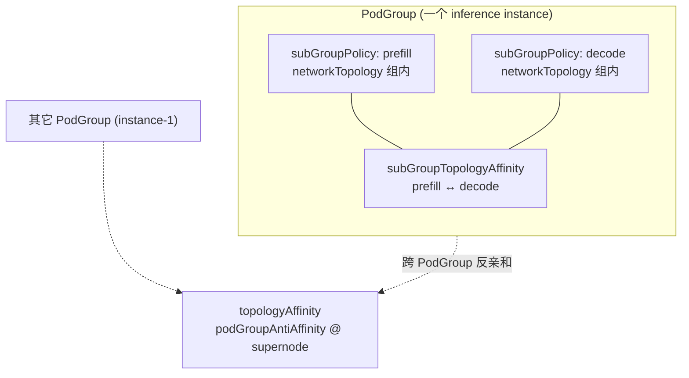

### `topologyAffinity`（跨 PodGroup）

| 项 | 说明 |
|----|------|
| Phase 1 | **仅** `podGroupAntiAffinity`（[设计决策-1](#ad-1跨-podgroup-仅做反亲和)、[设计决策-2](#ad-2phase-1-不声明-podgroupaffinity)） |
| 作用 | 本 PodGroup 与其它 PodGroup 在 `topologyTier(*)` 上 **异域**（`podGroupSelector`，标准 `metav1.LabelSelector`） |
| 调度 | `TopologyOccupancyIndex` + Job 级 `HyperNodeGradientForJobFn`；hard/soft 见 [设计决策-5](#ad-5组间-hardsoft) |
| 跨 PodGroup 共域 | **不支持** → `networkTopology` / `subGroupAffinity` |

### `subGroupTopologyAffinity`（同 PodGroup、跨 SubGroup）

**语义：** 约束本 PodGroup 内各 `subGroupPolicy` 拆出的 **SubJob** 在 `Domain_T` 上的同域/异域（**非** Pod 级 affinity，**非** 跨 PodGroup）。

**前置：** `subGroupPolicy` ≥ 2 条；term 中只写 policy **name**（非 `prefill-0` 等后缀）。

#### 能力一览（In scope）

| 能力 | 说明 |
|------|------|
| 多个 SubJob 共超节点 | `PodGroupSpec.networkTopology` 或 `subGroupAffinity`（见 [实例 4](#实例-4分布式-prefill-decode-推理推荐)） |
| 同角色多分片机柜互斥 | `subGroupAntiAffinity` @ `cabinet`，selector 两侧为 **同名** policy（如均为 `[prefill]`） | [实例 4](#实例-4分布式-prefill-decode-推理推荐) |
| 两 **不同 policy** 的 SubJob 异域 | `subGroupAntiAffinity` + `subGroupSelector` / `antiSubGroupSelector`（policy 名 **不相交**） | [实例 6](#实例-6可选prefill-与-decode-跨角色分机柜) |
| 同一 policy 内 Pod 分机柜（非 SubJob 间） | **非本字段** | `matchLabelKeys` 拆 SubJob + policy 内 anti，或 Pod spread |
| prefill 与 decode 无要求 | 不写跨角色 `subGroupAntiAffinity` | 实例 4 仅 prefill↔prefill、decode↔decode |
| Hard / soft | Hard → `HyperNodeGradientForSubJobFn` 剪枝；Soft → `HyperNodeOrderFn`（见 [实例 7](#实例-7subgroup-软性反亲和可选)） |
| 与组内 Gang 叠加 | 各 SubGroup 仍可独立配置 `networkTopology.highestTierAllowed` |
| SubJob 调度顺序 | Hard `subGroupAntiAffinity` 时，被引用为 `subGroupSelector` 的 policy 对应 SubJob **优先** 调度（见 [#allocate-action其它](#allocate-action其它)） |
| 部分调度 | 一方 SubJob 已分配 `AllocatedHyperNode` 后，另一方须满足 `Domain_T` 关系再选 HyperNode |

### 非目标（Out of scope）

| 非目标 | 应使用的 API / 机制 |
|--------|---------------------|
| 跨 PodGroup / 跨 instance **互斥** | `topologyAffinity.podGroupAntiAffinity` |
| 跨 PodGroup **共域** | **不支持**（用 `networkTopology` / `subGroupAffinity`） |
| 同一 SubGroup 内 Pod 不跨 tier | `subGroupPolicy[].networkTopology` |
| 选择「任意其它 PodGroup」的 SubGroup | **不支持**；selector 仅解析本 PodGroup 的 `subGroupPolicy` |
| 跨 Namespace 的 SubGroup 对等 | **不支持** |
| 无 `subGroupPolicy` 时定义 SubGroup 间关系 | **无效**；Webhook 拒绝 |
| 用 `podGroupAntiAffinity` 表达同 PodGroup 内 prefill/decode | **错误**；同 PodGroup 内应使用 `subGroupTopologyAffinity` |

### 前置条件

1. `spec.subGroupPolicy` **非空**，且至少 **2 条** `subGroupPolicy`（单 SubGroup 无「组间」对象，配置 `subGroupTopologyAffinity` 无意义）。
2. Term 中的 `matchSubGroupPolicyNames` / `matchSubGroupPolicyNames`（selector 内）必须 **全部出现在本 PodGroup** 的 `subGroupPolicy[].name` 中。
3. 对应 SubGroup 的 Pod 须能通过各 policy 的 `labelSelector`（及可选 `matchLabelKeys`）正确归属到 SubJob。

### 调度语义与实现锚点

| 项 | 行为 |
|----|------|
| 比较主体 | `JobInfo.SubJobs`（按 `subGroupPolicy.name` 区分），非 `JobInfo` 与其它 Job |
| Gradient 注册 | 仅当 `ContainsHardCrossSubGroupTopology(job)` 为真时，group-topology-affinity 注册 `HyperNodeGradientForSubJobFn` |
| 与 Job 级别 PodGroup 约束 | 先 `HyperNodeGradientForJobFn`（含跨 PodGroup hard）→ `allocateForJob` 选定 Job 级别 HyperNode 域 → 再对各 SubJob 应用 `subGroupTopologyAffinity` |
| Occupancy 索引 | **不**写入跨 PodGroup 索引；仅在同 PodGroup 的 SubJob 已分配域上在 Session 内做 peer 查询 |
| 忽略执行期变更 | `*IgnoredDuringExecution`：已放置 SubJob 不因 PodGroup Spec 变更被驱逐（与 PodAffinity 一致） |

### 设计考量与限制

1. **Peer 依赖与顺序：** Hard `subGroupAffinity` 要求 peer SubJob 已有 `AllocatedHyperNode`（或同轮内先调度方）；因此 `organizeJobWorksheet` 需保证至少一个 peer 先进入 `allocateForSubJob`。
2. **Tier 一致性：** 若同时配置 hard `subGroupAffinity` @ supernode 与 hard `subGroupAntiAffinity` @ cabinet，Webhook 要求 affinity 的 tier **不低于** antiAffinity 的 tier（数值更大或 tierName 更靠近根），避免逻辑矛盾。
3. **与 `topologyAffinity` 并用：** 可同时配置实例级 `topologyAffinity`；`subGroupTopologyAffinity` 仅在有 **角色间** 需求时添加（实例 6），与「角色内副本打散」（实例 4）正交。
4. **仅 HyperNode 域：** 约束在 HyperNode 树 `Domain_T` 上表达；SubJob 选定 HyperNode 后，组内 Pod 仍由 `networkTopology` + Node `predicate` 落位。
5. **Phase 1：** `preempt` / `backfill` 不保证重算 SubGroup 间拓扑；Occupancy 以 Session 内已运行 Job 为准。

### 配置反例

```yaml
# 错误：用 subGroupAntiAffinity(prefill, decode) 表达「4 个 prefill 彼此分机柜」
subGroupTopologyAffinity:
  subGroupAntiAffinity:
    requiredDuringSchedulingIgnoredDuringExecution:
      - subGroupSelector:
          matchSubGroupPolicyNames: [prefill]
        antiSubGroupSelector:
          matchSubGroupPolicyNames: [decode]   # ❌ 这是角色间，不是副本内

# 正确：prefill 与 decode 无要求 → 不配上述 term
# 正确：prefill 副本间 → 见实例 4（policy 内 `[prefill]` antiAffinity + matchLabelKeys）
```

---

### `podGroupSelector` 匹配语义

与 kube-scheduler 的 `labelSelector` 一致：在集群已缓存的 **其它 PodGroup** 上，用 `metadata.labels` 做匹配（支持 `matchLabels` / `matchExpressions`）；可选 `namespaceSelector` 限制命名空间。  
**不** 在 CRD 中引入 Volcano 专用 `topologyGroup` 字符串字段；peer 完全由用户在 PodGroup 上打的 label 界定。

#### Label 由谁设置、如何取值

| 项 | 说明 |
|----|------|
| **谁写入** | **用户/平台** 在创建或更新 PodGroup 时设置 `metadata.labels`；Volcano **不会** 根据 `podGroupAntiAffinity` 自动补写该 label。 |
| **与 selector 的关系** | `podGroupSelector.matchLabels`（或 `matchExpressions`）必须与目标 PodGroup 上的 label **一致**；通常 **一个键** 即可表达「同一互斥组」（示例键 `topology.volcano.sh/spread-group`，键名可自定）。 |
| **赋值原则** | 凡需要在 **同一拓扑比较层**（`topologyDomain`）上 **彼此异域** 的 PodGroup，对该键使用 **相同取值**；该取值应表示 **故障域/容量池** 等业务含义（如 `llama-70b-prod` = 同一生产模型多 instance），**不是** PodGroup 名、SubJob 名或 Pod 模板 label 的拷贝。 |
| **与其它 label 分工** | `app` / `model` 等可用于运维筛选；**是否互为 anti-affinity peer** 只由 `podGroupSelector` 选中与否决定。不要把无关 label 写进 selector，以免误伤其它 PodGroup。 |
| **环境隔离** | 不同环境、租户、流量池使用 **不同取值**（如 `…-staging` vs `…-prod`），避免跨环境互斥。 |

调度实现：peer 集合 = 满足 selector 的其它 PodGroup（排除本 PodGroup UID）；`TopologyOccupancyIndex` 按 `(topologyTier, Domain_T)` 记录已占用域，结合 peer 的已分配 HyperNode 做剪枝。

## HyperNode 层级与 topologyTier / topologyTierName

组间亲和/反亲和与组内 `networkTopology` 一样，基于 **HyperNode CR** 树，**不**使用任意 Node label。用户在 term 的 `topologyDomain`（`TopologyDomainSpec`）中必须指定 **且仅能指定一种** 拓扑比较层级：`topologyTierName`（对齐 `spec.tierName`）或 `topologyTier`（对齐 `spec.tier` 整数），与 `highestTierName` / `highestTierAllowed` 的对偶关系一致。

### HyperNode 上定义什么

每个 HyperNode 资源（`topology.volcano.sh/v1alpha1`）在 `spec` 中描述自己处于哪一层：

| HyperNode 字段 | 含义 | 与 PodGroup 的对应 |
|----------------|------|-------------------|
| `spec.tier` | 层级 **序号**（非负整数，集群内统一递增约定，越大越靠近根） | `topologyTier: <int>` |
| `spec.tierName` | 层级 **可读名称**（集群内约定，如 `cabinet`、`supernode`、`rack`） | `topologyTierName: "<string>"` |

示例（集群侧，与 PodGroup 无关）：

```yaml
apiVersion: topology.volcano.sh/v1alpha1
kind: HyperNode
metadata:
  name: supernode-sn-1
spec:
  tier: 2
  tierName: supernode          # ← PodGroup 里 topologyTierName 必须写 supernode
  members:
    - type: HyperNode
      selector:
        exactMatch:
          name: cabinet-a
    - type: HyperNode
      selector:
        exactMatch:
          name: cabinet-b
---
apiVersion: topology.volcano.sh/v1alpha1
kind: HyperNode
metadata:
  name: cabinet-a
spec:
  tier: 1
  tierName: cabinet            # ← topologyTierName: cabinet 时，Domain 在机柜层比较
  members:
    - type: Node
      selector: { ... }
```

调度器在 Session 启动时扫描全部 HyperNode，构建：

- **`HyperNodeTierNameMap`**：`tierName → tier`（`network-topology-aware` 解析 `highestTierName`、`group-topology-affinity` 解析 `topologyTierName` 共用）；
- **`HyperNodeTierSet`**：集群内出现过的 `spec.tier` 整数值集合（用于校验 `highestTierAllowed` / `topologyTier`）。

Webhook：未知 `topologyTierName` 或不在 `HyperNodeTierSet` 中的 `topologyTier` **拒绝**。

### 用户如何填写拓扑比较层级

1. **先查集群**：`kubectl get hypernodes -o custom-columns=NAME:.metadata.name,TIER:.spec.tier,TIERNAME:.spec.tierName`（维护「tier ↔ tierName」对照表，与组内 `networkTopology` 填法相同）。
2. **二选一（每个 term 的 `TopologyDomainSpec`）**：
   - **`topologyTierName`**：与目标层 HyperNode 的 `spec.tierName` **完全一致**（区分大小写）；
   - **`topologyTier`**：与目标层 HyperNode 的 `spec.tier` **整数相等**。
3. **勿混用**：同一 `TopologyDomainSpec` 内 `topologyTier` 与 `topologyTierName` **互斥**（与 `highestTierAllowed` / `highestTierName` 规则相同）。
4. **推荐**：人工运维、多集群对齐 → **tierName**；由 tier 序号驱动的模板/控制器 → **tier 整数**。
5. **与组内区别**：`highestTier*` 限制 **组内** Pod 不跨层；`topologyTier(*)` 定义 **组间** 在该层上 `Domain_T` 相同或不同。

| 用户写法 | 调度器解析为 | 组内等价字段 |
|----------|--------------|--------------|
| `topologyTierName: supernode` | 沿父链取第一个 `spec.tierName == "supernode"` 的祖先 `metadata.name` 为 `Domain_T` | `highestTierName: supernode` |
| `topologyTier: 2` | 沿父链取第一个 `spec.tier == 2` 的祖先为 `Domain_T` | `highestTierAllowed: 2` |
| `topologyTierName: cabinet` | 机柜层域 | `highestTierName: cabinet` |
| `topologyTier: 1` | 机柜层域（当集群约定 cabinet=1） | `highestTierAllowed: 1` |

无效配置示例：`topologyTierName: foo`（无 HyperNode 使用该 tierName）；`topologyTier: 99`（`HyperNodeTierSet` 中不存在）。

### 与示例拓扑的对应

**tierName / tier 以本集群 HyperNode CR 为准**（下表两列可任选其一填写）。

| 业务说法 | `topologyTierName` | `topologyTier`（示例） | API |
|----------|----------------------|--------------------------|-----|
| 不同 inference instance 不占同一超节点 | `supernode` | `2` | `topologyAffinity.podGroupAntiAffinity` |
| 4 个 prefill（或 decode）彼此分机柜 | `cabinet` | `1` | 实例 4：policy 内 anti |
| prefill 与 decode **无**拓扑要求 | — | — | 不配跨角色 term |
| （可选）prefill 与 decode 分机柜且共超节点 | `cabinet` + `supernode` | `1` + `2` | 实例 6 |

---

## 语义：分离域 Domain_T

对候选 HyperNode `H` 与用户配置的拓扑比较层级（`topologyDomain` 中的 `topologyTier` 或 `topologyTierName`）：

```
Domain_T(H) = 从 H 沿 HyperNode 父链向上，第一个满足下列之一的祖先 HyperNode 的 metadata.name：
              · spec.tier == topologyTier（整数模式）
              · spec.tierName == topologyTierName（字符串模式，与 HyperNode CR 配置一致）
```

| 约束 | Hard 语义 |
|------|-----------|
| 反亲和 | `Domain_T(A) ≠ Domain_T(B)` |
| 亲和 | `Domain_T(A) == Domain_T(B)`（一方未分配时，后分配方须落入已分配域） |

与现有 `NetworkTopologySpec` 的区别：

| 字段 | 语义 | 层级来源 |
|------|------|----------|
| `highestTierAllowed` / `highestTierName`（已有） | **组内** Gang：整组 Pod 不跨越该层 | 同上 HyperNode `tier` / `tierName` |
| `topologyTier` / `topologyTierName`（本设计） | **组间**：在该层比较 Domain 相同或不同 | 同上，**必须与集群 HyperNode 定义一致** |

## Hard 约束优先级

1. PodGroup hard antiAffinity（跨 instance）
2. SubGroup hard antiAffinity（**SubJob 之间**，含实例 4 policy 内分片互斥）
3. SubGroup hard affinity（**不同 policy / SubJob 之间** 共域，如实例 6）
4. SubGroup / Job hard `networkTopology`（组内 Gang，已有）
5. Soft → `HyperNodeOrderFn` 加权

## 配置示例（多 Instance + Prefill-Decode 角色内打散）

组间拓扑见实例 4；此处仅示 **跨 instance 互斥** + 两条角色 policy（**无** prefill↔decode 组间 term）。

```yaml
apiVersion: scheduling.volcano.sh/v1beta1
kind: PodGroup
metadata:
  name: pd-instance-0
  labels:
    topology.volcano.sh/spread-group: llama-70b-prod
spec:
  minMember: 8
  queue: default

  topologyAffinity:
    podGroupAntiAffinity:
      requiredDuringSchedulingIgnoredDuringExecution:
        - podGroupSelector:
            matchLabels:
              topology.volcano.sh/spread-group: llama-70b-prod
          topologyTierName: supernode

  subGroupPolicy:
    - name: prefill
      labelSelector:
        matchLabels:
          volcano.sh/role: prefill
      # 分片与组间拓扑：见实例 4（matchLabelKeys + subGroupTopologyAffinity）
    - name: decode
      labelSelector:
        matchLabels:
          volcano.sh/role: decode
      subGroupSize: 1

  # 角色内 prefill-0..3 / decode-0..3 互斥 @ cabinet：subGroupTopologyAffinity（省略）
  # 若需 prefill 与 decode 整机柜分离：另见实例 6
```

# 设计决策

### 设计决策-1：跨 PodGroup 仅做反亲和

**结论：** 实现 `topologyAffinity.podGroupAntiAffinity`（**必填** `podGroupSelector` + `topologyTier(*)`），配合 `TopologyOccupancyIndex` 与 Job 级 gradient。

**理由（摘要）：**

- **Peer 表达：** 使用 **`metav1.LabelSelector`**（`matchLabels` / `matchExpressions`）匹配其它 PodGroup 的 `metadata.labels`，语义对齐 kube-scheduler；**不** 增加 CRD 专用 `topologyGroup` 字段，便于复用业务既有 label 与表达式。
- **有场景：** 多 inference instance 需在 supernode（等）层 **互斥**（实例 2、5）；组内 `networkTopology` 无法表达「相对其它 PodGroup」。
- **社区缺口：** Volcano 尚无 PodGroup 级 **组间** hard 异域 API（组内 `networkTopology` 不表达「相对其它 PodGroup」）。
- **成本可接受：** 索引语义单一（记录已占用 `Domain_T`）；preempt/backfill 一致性交 [Phase 2](#交付阶段)。

---

### 设计决策-2：Phase 1 不声明 `podGroupAffinity`

**结论：** `PodGroupTopologyAffinitySpec` **仅** 含 `PodGroupAntiAffinity`；**不** 在 Go/CRD 中声明 `PodGroupAffinity`。用户若提交未知字段 `topologyAffinity.podGroupAffinity`，由 API Server 按 schema 拒绝（无需 Webhook「必须为空」）。

| 方案 | CRD 是否暴露 `podGroupAffinity` | 结论 |
|------|--------------------------------|------|
| 保留字段 + Webhook 拒绝 | 是 | 未采用 |
| **不声明字段** | **否** | **采用** |

**不做跨 PodGroup 亲和的理由（采纳「不声明字段」）：**

1. **无独立场景** — 共域已由下表 API 覆盖：

| 诉求 | 使用 |
|------|------|
| 单 instance 整机共 supernode | `PodGroupSpec.networkTopology` |
| 同 instance 内 prefill + decode 共域 | `subGroupAffinity` 或 `networkTopology`（实例 4） |
| 多 Pod 副本共 rack | `subGroupPolicy[].networkTopology` |

2. **易混淆** — 跨 PodGroup 共域若再引入 `podGroupAffinity`，与 `subGroupAffinity`、共域类 `networkTopology` 职责重叠。
3. **实现不划算** — 不做亲和 **不能** 省掉反亲和的 OccupancyIndex/Job gradient；若做亲和还需共域 clique、冲突检测、调度顺序等，**无验收场景**。

**演进：** 若有已落地需求，Phase 2+ **additive** 增加 `PodGroupAffinity *TopologyAffinitySpec`（类型形状见 [API 设计](#api-设计) 注释块），**不改变** 反亲和语义。

---

### 设计决策-3：SubGroup 反亲和双 selector

**结论：** `subGroupAntiAffinity` 使用 `subGroupSelector` + `antiSubGroupSelector`（有向 subject→peer），**不** 用单列表 `matchSubGroupPolicyNames`。

**理由（摘要）：** 单列表形态无法同时表达「policy 内分片互斥」（两侧均为 `[prefill]`）与「跨 policy 互斥」（`[prefill]` vs `[decode]`）而不引入歧义枚举。详见 [API 附录：双 selector](#api-设计取舍subgroupselector-与-antisubgroupselector-为何不合并)。

---

### 设计决策-4：`subGroupTopologyAffinity` 在 PodGroup 顶层

**结论：** 同 PodGroup 内 SubJob 间拓扑边集中在 `PodGroupSpec.subGroupTopologyAffinity`，**不** 挂在各 `subGroupPolicy` 上；**不** 提供 per-policy 组间字段或语法糖。

**理由（摘要）：** 多方共域（`[prefill, decode]`）、统一 Webhook、与 `topologyAffinity` 对称等需求要求 PodGroup 顶层一处声明。详见 [API 附录：顶层放置](#api-设计取舍subgrouptopologyaffinity-为何在-podgroup-顶层-而非挂在每条-subgrouppolicy-上)。

---

### 设计决策-5：组间 hard/soft

**结论：** 组间用 `requiredDuringSchedulingIgnoredDuringExecution` / `preferredDuringSchedulingIgnoredDuringExecution` + `weight`；**禁止** 在 `TopologyDomainSpec` 内写 `mode`。组内仍用 `networkTopology.mode`。

---

### 设计决策-6：tierName 与 tier 整数二选一

**结论：** 组间 `topologyTierName` ↔ `HyperNode.spec.tierName`，`topologyTier` ↔ `spec.tier`；与组内 `highestTierName` / `highestTierAllowed` 共用 `HyperNodeTierNameMap`、`HyperNodeTierSet`。

**示例集群约定（实例 YAML 注释亦采用）：** `supernode` ↔ `2`，`cabinet` ↔ `1`（以 `kubectl get hypernodes` 为准）。

| 业务说法 | tierName | tier（示例） |
|----------|----------|--------------|
| 多 instance 互斥 @ 超节点 | `supernode` | `2` |
| 分片互斥 @ 机柜 | `cabinet` | `1` |
| 整机共超节点（组内） | `highestTierName: supernode` | `highestTierAllowed: 2` |

填写步骤、HyperNode CR 示例、Domain_T 解析 → [#hypernode-层级与-topologytier--topologytiername](#hypernode-层级与-topologytier--topologytiername)。实例 YAML 多写 tierName，旁注等价整数。

---

### 设计决策-7：组间层级命名与 Kubernetes topologyKey

**背景：** 方案评审中提出：原字段名 **`separationTierName`** 不够直观，难以像 Kubernetes **`topologyKey`** 那样一眼看出「在哪个拓扑维度上比较」。

**结论：**

1. **字符串 / 整数字段** 定名为 **`topologyTierName`**、**`topologyTier`**（二选一，互斥），取值仍分别对齐 `HyperNode.spec.tierName` / `spec.tier`。
2. **term 上的嵌套对象** 定名为 **`topologyDomain`**（类型 `TopologyDomainSpec`），承载上述二选一字段；**不再** 使用外层也叫 `topologyTier`、内层再写 `topologyTierName` 的重复命名。
3. **不** 在组间 API 上复用字段名 **`topologyKey`**。

**为何不直接采用 `topologyKey`：**

| 考量 | 说明 |
|------|------|
| **与 K8s 字面不一致** | `PodTopologySpread` / `PodAffinity` 的 `topologyKey` 是 **Node 标签键**（如 `topology.kubernetes.io/zone`）；本特性取值是 **HyperNode 层级名**（如 `supernode`），填法与校验规则完全不同。 |
| **与 Volcano 现有 CR 冲突** | Job / PodGroup 模板中已有标准 **`podAffinity` / `podAntiAffinity` 的 `topologyKey`**；组间 term 再叫 `topologyKey` 会导致「同一 YAML 里两个 topologyKey、含义不同」的运维事故。 |
| **可读性** | `topologyTierName` 明确表达：**拓扑比较发生在 HyperNode 的哪一层**；与组内 `highestTierName` 共用 `tierName` 词汇，且 `highest*` 表 envelope 上界、`topologyTier*` 表组间比较平面，职责可区分。 |

**与 K8s 的心智模型（回复 reviewer）：**

- K8s：**选定拓扑维度** → 用 Node label **key** 表达 → 字段名 `topologyKey`。
- Volcano：**选定拓扑维度** → 用 HyperNode **tier 层** 表达 → 字段名 **`topologyTierName`**（或整数 **`topologyTier`**）；调度器在该层计算 `Domain_T`，再在亲和/反亲和 term 中比较相同/不同。
- 文档 [#与-kubernetes-topologykey-的语义对照速查](#与-kubernetes-topologykey-的语义对照速查) 与实例 YAML 旁注中保留对照表，降低从 Pod 拓扑散布迁移过来的学习成本。

**曾用名（评审稿）：** `separationTierName` / `separationTier`、嵌套对象亦名为 `separationTier` — 仅表示「分离边界」，未突出「拓扑维度」，且外层/内层命名重复；CRD 尚未发布，定稿采用上表命名。

---


# 调度实现

## 职责划分

| 插件 / 模块 | Hard（gradient） | Soft（order） | 资源预筛 |
|-------------|------------------|---------------|----------|
| `allocate` action（新增职责） | — | — | **HyperNode `minResource` vs idle/futureIdle**（与 Node predicate 前资源判断同级） |
| `network-topology-aware`（现有） | BFS 梯度、`highestTierAllowed`（**不含**资源判断） | HyperNode binpack、LCA tier 打分 | 仅维护 Session 级 HyperNode 资源账面（供 allocate 读取） |
| `group-topology-affinity`（新增） | Job 级别：跨 PodGroup **反亲和** hard；SubJob 级别：同 PodGroup、跨 SubGroup hard | 上述 soft 打分 | — |
| `framework`（聚合） | **仅拓扑插件**：集合交集 + 统一按 tier 重分层 | 多插件分数累加（已有） | **不参与** |

Hard / Soft 分工：

- **Hard 拓扑**（`topologyAffinity` / `subGroupTopologyAffinity` 的 **`required`** 列表，或 `networkTopology.mode: hard`）：各拓扑插件独立计算 `HyperNodeGradient`，Framework **求候选 HyperNode 集合交集** 后 **统一分层**。
- **Hard 容量**：在 **`allocate.go`** 对 gradient 候选做 **`minResource` 预筛**（**不**放入 `HyperNodeGradientForJobFn` 聚合逻辑）。
- **Soft 拓扑**（上述 API 的 **`preferred`** 列表 + `weight`，或 `networkTopology.mode: soft`）：仅 `HyperNodeOrderFn` 加权，不进入 gradient 交集。

## 框架约束：HyperNode Gradient 多插件聚合

### 现状与目标

| 项 | 现状 | 本设计 |
|----|------|--------|
| `HyperNodeGradientForJobFn` / `HyperNodeGradientForSubJobFn` | **仅第一个注册插件生效** | **所有启用 `enabledHyperNodeGradient` 的插件均参与** |
| 多 hard 约束组合 | 无法组合 | **集合交集（AND）** |
| `HyperNodeOrderFn` | 多插件分数累加 | 不变 |

### 聚合流程（拓扑插件交集 + allocate 资源预筛）

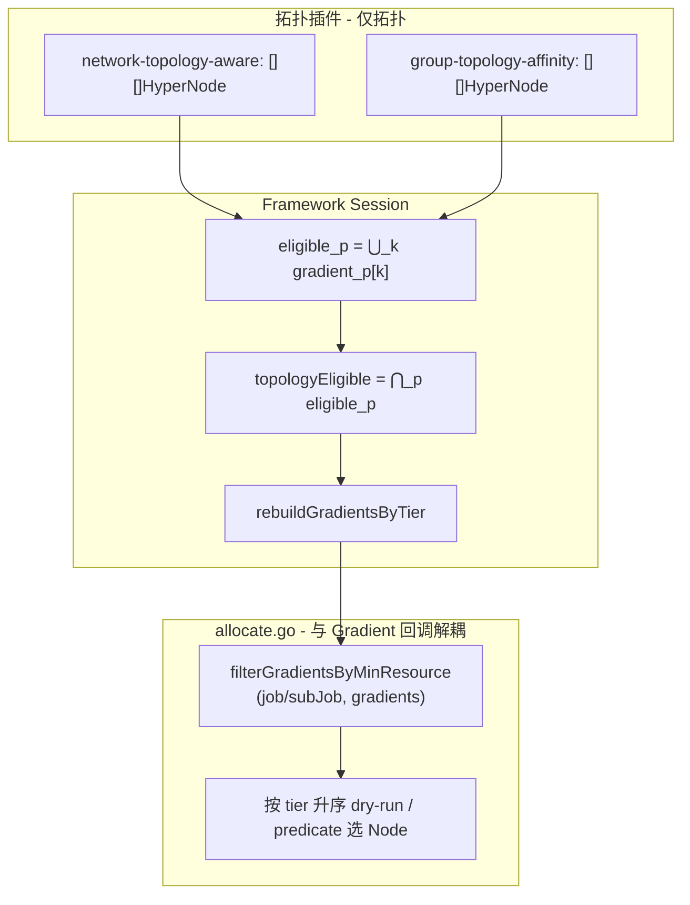

**Framework 侧（仅拓扑，不含资源）：**

1. 各拓扑插件返回 `[][]*HyperNodeInfo`（满足「插件不变式」）。
2. `topologyEligible = ⋂_p ⋃_k gradient_p[k]`，再 `rebuildGradientsByTier`。
3. **不在此阶段做** `minResource` 判断。

**allocate 侧（容量预筛，类比 Node predicate 前资源判断）：**

4. `allocateForJob` / `allocateForSubJob` 在拿到 `hyperNodeGradients` 之后、进入 dry-run 循环之前，调用 **`filterGradientsByMinResource`**，剔除资源不足的 HyperNode。
5. 仅对过滤后的 HyperNode 做 subJob dry-run；进入 `allocateResourcesForTasks` 后，仍由现有 **`alloc.predicate`** 对 Node 做 `FutureIdle` 检查（双层：HyperNode 整组容量 → Node 单 Pod 容量）。

**与 Node 路径对照：**

| 层级 | 容量预筛位置 | 细粒度调度 |
|------|--------------|------------|
| Node | `allocate.predicate`：`InitResreq` vs `node.FutureIdle()` | `PredicateForAllocateAction` |
| HyperNode | **`allocate.filterGradientsByMinResource`**：`GetMinResources()` vs HyperNode idle/futureIdle | 其下对每个 Node 仍走 `predicate` |

**空结果：**

- 拓扑交集为空 → 拓扑不可满足；
- 资源过滤后为空 → 容量不可满足（可与 `NotEnoughResources` 等原因区分记录）。

**为何不采用「按 gradient 下标逐层交集」：**

各插件 BFS/剪枝路径不同，同一 HyperNode 可能落在不同下标层。按下标对齐交集会产生假阴性（某轮为空但并集交集非空）。**先集合交集、再统一分层** 语义稳定，且与 allocate「先低 tier、后高 tier」一致。

### 插件返回 gradient 的不变式

每个注册 `HyperNodeGradientFor*Fn` 的插件应保证：

1. `len(gradients) >= 1`；若无可行 HyperNode，返回空 slice 或 `nil`（Framework 视为 `eligible_p = ∅`）。
2. **层间 tier 单调**：对任意 `i < j`，`gradients[i]` 中任意 HyperNode 的 `tier` ≤ `gradients[j]` 中任意 HyperNode 的 `tier`（tier 越小表示域越贴近、越优先尝试）。
3. 同一 gradient 层内 HyperNode 名称不重复。

Framework **不**假设各插件 tier 分桶完全一致；最终以 **Session 统一重分层** 为准。

### 未注册 gradient 的插件

- 未注册 `HyperNodeGradientFor*Fn` 的插件：**不参与交集**（对该插件无 hard gradient 约束）。
- 某 Job/SubJob **无任何** required 组间拓扑约束时，可仅 `network-topology-aware` 注册；`group-topology-affinity` 在无 required 类约束 term 时可不注册 gradient，仅注册 Order（或整插件跳过）。

### Framework API（`session_plugins.go`）

```go
// 各插件仍通过 AddHyperNodeGradientForJobFn / AddHyperNodeGradientForSubJobFn 注册。

// HyperNodeGradientForJobFn 聚合逻辑（伪代码）：
func (ssn *Session) HyperNodeGradientForJobFn(job *api.JobInfo, root *api.HyperNodeInfo) [][]*api.HyperNodeInfo {
    var perPlugin [][]*api.HyperNodeInfo
    for _, plugin := range ssn.enabledGradientPlugins() {
        g, err := ssn.hyperNodeGradientForJobFns[plugin](job, root)
        if err != nil { /* 记录错误；该插件 eligible_p = ∅ */ }
        perPlugin = append(perPlugin, g)
    }
    if len(perPlugin) == 0 {
        return [][]*api.HyperNodeInfo{{root}}
    }
    if len(perPlugin) == 1 {
        return perPlugin[0]
    }
    eligible := intersectHyperNodeSets(perPlugin) // ⋂_p ⋃_k gradient_p[k]
    if len(eligible) == 0 {
        return nil
    }
    return rebuildGradientsByTier(ssn.HyperNodes, eligible)
}
```

辅助函数（建议放在 `pkg/scheduler/api` 或 `pkg/scheduler/framework`）：

```go
func unionGradientHyperNodeNames(gradients [][]*api.HyperNodeInfo) sets.Set[string]
func intersectHyperNodeSets(perPlugin [][]*api.HyperNodeInfo) sets.Set[string]
func rebuildGradientsByTier(hyperNodes api.HyperNodeInfoMap, eligible sets.Set[string]) [][]*api.HyperNodeInfo
```

`HyperNodeGradientForSubJobFn` 使用相同聚合逻辑；SubJob 上下文需传入 `hyperNodeForJob`（父域），各插件在子树内计算 gradient。

### Hard / Soft 与 Order 的配合

```text
拓扑 Hard:  HyperNodeGradient（多拓扑插件）→ Framework 交集 → rebuildGradientsByTier
容量 Hard:  allocate.filterGradientsByMinResource（不经过 HyperNodeGradientFor*Fn 聚合）
调度:       allocate 逐层 dry-run → allocateResourcesForTasks → predicate(Node)
Soft:       HyperNodeOrderFn（多插件分数相加）→ selectBestHyperNodeForSubJob
```

`group-topology-affinity`：**`required` term** → `HyperNodeGradientFor*Fn`；**`preferred` term** → `HyperNodeOrderFn`（term 内 **无** `mode` 字段）。

## allocate Action：HyperNode 资源预筛（与 Gradient 回调解耦）

### 设计原则

- **资源是否够 Gang / SubGroup**：属于 **allocate action** 的调度路径决策，与「拓扑插件如何产 gradient」正交。
- **不**在 `HyperNodeGradientForJobFn` / `HyperNodeGradientForSubJobFn` 的 Framework 聚合里做 `minResource` 过滤，避免 group-topology-affinity、network-topology-aware 在 BFS 中对资源不足 HyperNode 重复计算，也避免与回调生命周期耦合。
- 判断逻辑从 `network-topology-aware.isEligibleHyperNode` **迁出容量分支**，改为 allocate 内显式调用；network-topology-aware **仅保留 tier / `highestTierAllowed`** 等拓扑条件。

### 调用位置

在 `allocateForJob` 中（`allocateForSubJob` 同理，使用 `subJob.GetMinResources()`）：

```go
// 1. 拓扑：仅通过 Framework 插件回调（多插件交集 + 重分层）
hyperNodeGradients := ssn.HyperNodeGradientForJobFn(job, hyperNodeToAllocate)

// 2. 容量：allocate 本地过滤，与 HyperNodeGradientForJobFn 无关
hyperNodeGradients = alloc.filterGradientsByMinResource(job, nil, hyperNodeGradients)

for gradient, hyperNodes := range hyperNodeGradients {
    for _, hyperNode := range hyperNodes {
        // 3. dry-run subJobs（内部 allocateResourcesForTasks → predicate(Node)）
    }
}
```

SubJob 级别在 `allocateForSubJob` 内、调用 `HyperNodeGradientForSubJobFn` 之后同样执行 `filterGradientsByMinResource(job, subJob, gradients)`。

### `filterGradientsByMinResource` 语义

```go
// pkg/scheduler/actions/allocate/hypernode_resource.go（建议新文件或 allocate.go 内）

func (alloc *Action) filterGradientsByMinResource(
    job *api.JobInfo,
    subJob *api.SubJobInfo, // nil 表示 Job 级别过滤
    gradients [][]*api.HyperNodeInfo,
) [][]*api.HyperNodeInfo
```

| 规则 | 行为 |
|------|------|
| `minResource` | `subJob != nil` → `subJob.GetMinResources()`；否则 `job.GetMinResources()` |
| 比较口径 | 与现 `isEligibleHyperNode` 一致：`minResource.LessEqual(idle)` **或** `minResource.LessEqual(futureIdle)` 则保留 |
| 部分已调度 | `job.AllocatedHyperNode != ""`（Job 级别）或 `subJob.AllocatedHyperNode != ""`（SubJob 级别）时 **跳过** 资源过滤，与现网「partial 不预筛资源」一致 |
| 数据来源 | 读取 **Session 级** HyperNode 资源账面（见下），allocate **不**实现 cache 更新 |

过滤实现：对 `gradients` 每层 `hyperNodes` 原地剔除不满足的项；若某层为空则跳过该层（与现 BFS 不产出该层效果一致）。

### Session 级 HyperNode 资源账面

将 `network-topology-aware` 中的 `hyperNodeResourceCache` **提升为 Session 可读**（名称示例 `ssn.HyperNodeResourceStatus`），仍由 network-topology-aware 在 `OnSessionOpen` + `Allocate`/`Deallocate` EventHandler 维护；allocate 只读。

```go
// api 或 framework.Session
type HyperNodeResourceStatus struct {
    Allocatable, Used, Idle, FutureIdle *api.Resource
}

func (ssn *Session) HyperNodeSatisfiesMinResource(
    hyperNodeName string,
    minResource *api.Resource,
) bool
```

便于单测：对 `filterGradientsByMinResource` 注入 mock Session 账面，无需拉起 gradient 插件。

### `network-topology-aware` 配套改动

```go
// isEligibleHyperNode：删除 minResource / hyperNodeResourceCache 分支，仅保留：
// - tier <= highestAllowedTier
// - （不再在此处做 idle/futureIdle 判断）

func (networkTopologyAware *networkTopologyAwarePlugin) isEligibleHyperNode(
    hn *api.HyperNodeInfo,
    highestAllowedTier int,
    allocatedHyperNode string,
) bool {
    if hn.Tier() > highestAllowedTier {
        return false
    }
    if allocatedHyperNode != "" {
        return true
    }
    return true // 拓扑 BFS 默认展开；资源由 allocate 预筛
}
```

`hyperNodeGradientFn` 签名可去掉 `minResource` 参数；`HyperNodeGradientForJobFn` / `HyperNodeGradientForSubJobFn` 注册函数不再传入 `job.GetMinResources()`。

### 为何放在 allocate 更合适

| 点 | 说明 |
|----|------|
| 与 Node 一致 | 容量先筛、再 predicate，都在 **action** 层，而非 scheduler plugin 回调聚合 |
| 解耦 | Framework `HyperNodeGradientFor*Fn` 只表达 **拓扑可行域**；容量是 Job/SubJob 调度上下文 |
| 性能 | group-topology-affinity / network-topology-aware 的 BFS 不再遍历「注定容量不够」的 HyperNode；过滤在 gradient 列表上 **O(n)** 一次完成 |
| 可测 | allocate 单测覆盖资源过滤，无需 mock 多插件 gradient |

## 推荐 Scheduler 配置

```yaml
actions: "enqueue, allocate, backfill"
tiers:
- plugins:
  - name: gang
  - name: predicates
  - name: group-topology-affinity
    arguments:
      weight: 10
  - name: network-topology-aware
    arguments:
      weight: 10
      # 组内 binpack 等扩展项仅 network-topology-aware 使用，见该插件文档
      # hypernode.binpack.cpu: 5
      # hypernode.binpack.memory: 1
```

两者均开启 `enabledHyperNodeGradient` 与 `enabledHyperNodeOrder`（与现有 e2e 配置一致）。tier 内插件顺序不影响交集交换律，但影响 **Order 分数相加顺序**（加法可交换，无影响）。

### 插件 `arguments` 约定（与 `network-topology-aware` 一致）

`group-topology-affinity` 的 Scheduler 插件配置 **对齐** `network-topology-aware`：在 `plugins[].arguments` 下使用 **短键名** `weight`，**不**使用 `group-topology-affinity.weight` 等带插件名前缀的键（与 `binpack.weight` 风格不同，与 `network-topology-aware` 相同）。

| 键 | 类型 | 默认 | 作用 |
|----|------|------|------|
| `weight` | int | `1` | 将本插件 `HyperNodeOrderFn` 产出的分数 **整体缩放**（与 `network-topology-aware` 的 `GlobalWeight` 同语义）；实现读取键名建议与现网一致：`const PluginWeight = "weight"` |
| `hypernode.binpack.*` | — | — | **不属于** `group-topology-affinity`；组内 HyperNode binpack / tier 打分仍由 `network-topology-aware` 承担 |

**与 PodGroup API 中 `preferred` term 的 `weight` 区分：**

| 配置面 | 字段 | 含义 |
|--------|------|------|
| Scheduler `arguments.weight` | 插件级 | 多个 `HyperNodeOrderFn` 插件之间的 **相对权重**（Framework 对各插件 Order 分数相加前的倍率） |
| `subGroupTopologyAffinity` / `topologyAffinity` 的 `preferred[].weight` | term 级 | 单条 soft 组间规则 **内部的** 偏好强度（kube-scheduler `preferredDuringScheduling` 同义） |

实现上：`HyperNodeOrderFn` 对某 HyperNode 的原始分 `score ∈ [0,1]`（或插件内部归一化分）乘以 `arguments.weight`，再参与 Framework 与其它拓扑/优先级插件的 Order **累加**——与 `network-topology-aware` 在 `hyperNodeOrderFn` 末尾 `scaledScores[name] = MaxNodeScore * weight * score` 的模式一致。

## group-topology-affinity 扩展点

| 扩展点 | 用途 |
|--------|------|
| `OnSessionOpen` | 构建 `TopologyOccupancyIndex`；解析 `arguments` 中的 `weight`（默认 `1`，键名与 `network-topology-aware` 相同） |
| `AddHyperNodeGradientForJobFn` | Hard 跨 PodGroup 约束下的 Job 级别梯度 |
| `AddHyperNodeGradientForSubJobFn` | Hard 跨 SubGroup 约束下的 SubJob 级别梯度（含同 Job 已分配 SubJob 域） |
| `AddHyperNodeOrderFn` | Soft 跨组拓扑亲和/反亲和偏好；分数 × `arguments.weight` 后参与 Framework Order 累加 |
| `AddJobValidFn`（可选 P2） | 全局域耗尽预检 |

## network-topology-aware 改动（最小）

- **保留** `hyperNodeGradientFn` BFS；`isEligibleHyperNode` **仅拓扑**（tier / partial 场景），**移除** `minResource` 判断。
- **保留** `hyperNodeResourceCache` 维护，但升级为 **Session 可读**，供 allocate 使用。
- 与 `group-topology-affinity` 通过 Framework **拓扑 gradient 交集**协作；**不**在插件内做容量预筛。

## allocate Action（其它）

- `RequiresHyperNodeAllocate()`：`ContainsHardTopology() \|\| ContainsSubJobPolicy() \|\| ContainsHardCrossPodGroupTopology() \|\| ContainsHardCrossSubGroupTopology()`
- `ContainsHardCrossPodGroupTopology(job)`：存在非空 `topologyAffinity.podGroupAntiAffinity` 的 **`required`** 列表（**不含** `podGroupAffinity`）
- `ContainsHardCrossSubGroupTopology(job)`：非空 `subGroupTopologyAffinity` 且存在 hard `subGroupAffinity` / `subGroupAntiAffinity` term
- `organizeJobWorksheet`：含 hard subGroup antiAffinity 的 SubJob 稳定排序（被依赖方先调度）
- 主路径：`allocateForJob` →（`HyperNodeGradientForJobFn` → **`filterGradientsByMinResource`**）→ `allocateForSubJob` →（`HyperNodeGradientForSubJobFn` → **资源过滤**）→ `selectBestHyperNodeForSubJob` → `allocateResourcesForTasks` → `predicate(Node)`

## 实现文件（Phase 1）

| 路径 | 说明 |
|------|------|
| `staging/.../scheduling/v1beta1/types.go` | API |
| `pkg/scheduler/api/topology_constraint.go` | 解析结构 |
| `pkg/scheduler/api/topology_occupancy.go` | 占用索引 |
| `pkg/scheduler/api/hyper_node_info.go` | `GetAncestorAtTier` |
| `pkg/scheduler/api/hyper_node_gradient.go` | `union` / `intersect` / `rebuildGradientsByTier` |
| `pkg/scheduler/api/hyper_node_resource.go` | HyperNode 资源账面类型 + `SatisfiesMinResource` |
| `pkg/scheduler/plugins/group-topology-affinity/` | 新插件（topology gradient + order） |
| `pkg/scheduler/plugins/network-topology-aware/` | 去掉 gradient 内资源预筛；Session 资源 cache |
| `pkg/scheduler/framework/session.go` | 暴露 HyperNode 资源账面 |
| `pkg/scheduler/framework/session_plugins.go` | **仅拓扑** Gradient 多插件交集 + 重分层 |
| `pkg/scheduler/actions/allocate/allocate.go` | `filterGradientsByMinResource`；Job/SubJob 调用点 |
| `pkg/scheduler/actions/allocate/hypernode_resource_test.go` | 资源过滤单测 |
| `pkg/webhooks/.../validate_podgroup.go` | 校验 |
| `pkg/scheduler/framework/session_plugins_test.go` | 拓扑交集/重分层单测 |

---

# 架构与时序图

两张总览图概括配置准入与 allocate 拓扑路径；模块职责、聚合规则、插件扩展点与代码锚点见 [#调度实现](#调度实现)。

| 想了解… | 阅读 |
|--------|------|
| Framework 拓扑 gradient 交集、allocate 资源预筛 | [框架约束 · HyperNode Gradient 聚合](#框架约束hypernode-gradient-多插件聚合)、[聚合流程](#聚合流程拓扑插件交集--allocate-资源预筛) |
| `group-topology-affinity` / 占用索引 | [调度实现 · group-topology-affinity 扩展点](#group-topology-affinity-扩展点) |
| 实例 2 / 4 / 5 在调度链上的含义 | [用户场景](#用户场景与能力对照)、[概述 · 目标示意](#目标示意volcano-视角) |

**符号：** `Domain_T(H)` = HyperNode H 在拓扑比较 tier T 上的祖先域。

---

## 总览图 1：分层与调度周期

配置经 Webhook 进入 Cache；每个 Session 内插件初始化 → allocate（拓扑路径）→ Close 写回 Status。

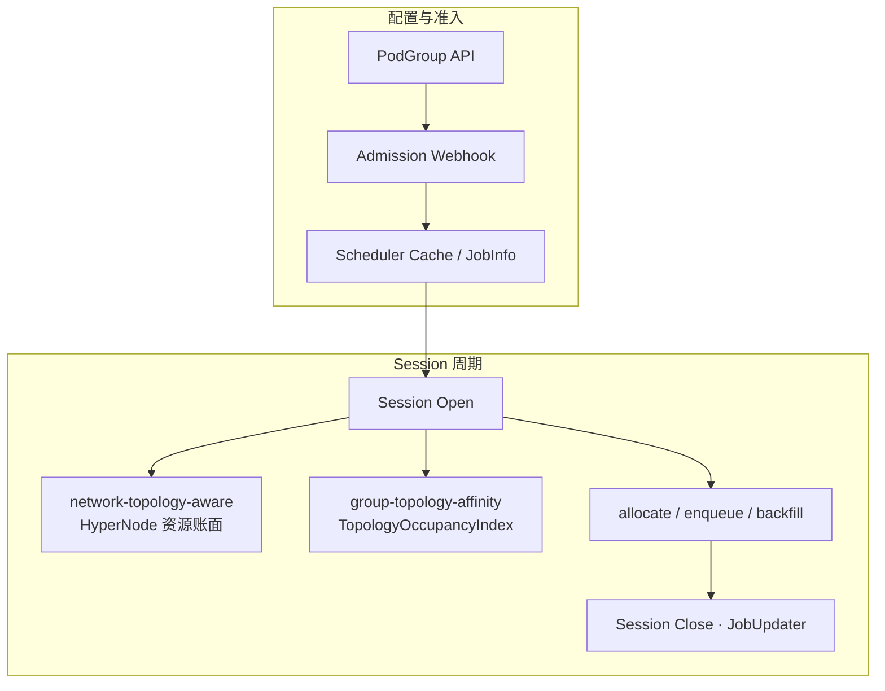

---

## 总览图 2：allocate 拓扑路径（组内 + 组间）

Hard 约束：各拓扑插件产出 gradient → Framework **集合交集 + 按 tier 重分层** → allocate **`filterGradientsByMinResource`** → SubJob dry-run → Node predicate。Soft 约束仅走 `HyperNodeOrderFn`，不参与交集。

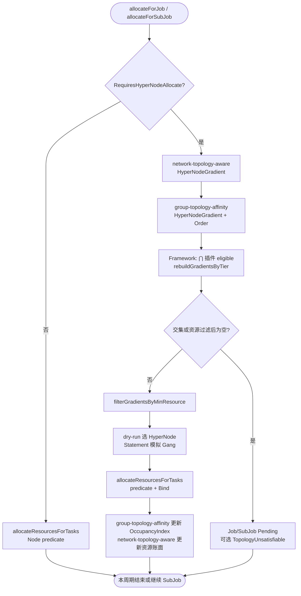

**场景与总览图的对应：**

- **跨 PodGroup 反亲和（实例 2、5）：** Job 级 `HyperNodeGradientForJobFn` 剪枝；`TopologyOccupancyIndex` 记录 `Domain_T` 已占用；见调度实现 [设计决策-1](#ad-1跨-podgroup-仅做反亲和) 与 `group-topology-affinity` 插件节。
- **跨 SubJob 亲和/反亲和（实例 4、6、7）：** SubJob 级 `HyperNodeGradientForSubJobFn`；policy 内互斥 vs 跨 policy 由双 selector 区分；见 [API 设计 · subGroupTopologyAffinity](#subgrouptopologyaffinity同-podgroup跨-subgroup)。
- **组内 Gang（实例 1、3）：** 仅 `network-topology-aware` 参与 gradient（无组间 term 时 `group-topology-affinity` 可不注册 gradient）；与组间 term 同时存在时 **AND** 交集。

---

## 代码锚点（实现对照）

| 步骤 | 路径 |
|------|------|
| allocate 入口 / 资源预筛 | `pkg/scheduler/actions/allocate/allocate.go` |
| Gradient 多插件交集 | `pkg/scheduler/framework/session_plugins.go` |
| 组间插件 | `pkg/scheduler/plugins/group-topology-affinity/` |
| 组内拓扑插件 | `pkg/scheduler/plugins/network-topology-aware/network_topology_aware.go` |
| 占用索引 | `pkg/scheduler/api/topology_occupancy.go` |

---

# 校验规则（Webhook）

**通用**

1. 每个组间 term 的 `TopologyDomainSpec`：`topologyTier`（int）与 `topologyTierName`（string）**互斥**，且 **至少配置其一**（与 `networkTopology` 的 `highestTierAllowed` / `highestTierName` 规则对称）。`topologyTierName` 须存在于 `HyperNodeTierNameMap`；`topologyTier` 须存在于 `HyperNodeTierSet`（至少一个 HyperNode 的 `spec.tier` 等于该值）。**禁止** 在 `TopologyDomainSpec` 内写 `mode`（hard/soft 由 `required` / `preferred` 决定，见 [#required--preferred-与-mode不重复](#required--preferred-与-mode不重复)）。

**`topologyAffinity`（跨 PodGroup）**

2. Phase 1 CRD **无** `topologyAffinity.podGroupAffinity`（见 [设计决策-2](#ad-2phase-1-不声明-podgroupaffinity)）；**无** `topologyGroup` 字段；提交未知字段由 API Server 拒绝。
3. 每条 `podGroupAntiAffinity` term 的 `podGroupSelector` **必填**（`metav1.LabelSelector`：支持 `matchLabels` / `matchExpressions`）；可选 `namespaceSelector` 限制 peer PodGroup 命名空间（语义对齐 kube-scheduler）。
4. `podGroupSelector` 不得仅匹配本 PodGroup 自身来模拟 SubGroup 关系（应使用 `subGroupTopologyAffinity`）。

**`subGroupTopologyAffinity`（同 PodGroup、跨 SubGroup）**

5. 若 `subGroupTopologyAffinity` 非空，则 `subGroupPolicy` 非空且 `len(subGroupPolicy) >= 2`。
6. 所有 `matchSubGroupPolicyNames` 必须是 **本 PodGroup** `subGroupPolicy[].name`（**禁止**写 SubJobID 分片后缀如 `prefill-0`）。
7. `subGroupTopologyAffinity` term 中 **禁止** 出现 `podGroupSelector`、`namespaceSelector`（跨 PodGroup 字段仅属于 `topologyAffinity.podGroupAntiAffinity`）。
8. `subGroupAntiAffinity`：**跨 policy** 时 `subGroupSelector` 与 `antiSubGroupSelector` 的 policy name 集合 **不相交**；**policy 内两两互斥** 时允许两侧填写 **相同** policy name（如均为 `[prefill]`，实例 4）。
9. `subGroupAffinity.required` 中每条 `matchSubGroupPolicyNames` 至少包含 **2 个不同** policy name（如 `[prefill, decode]`，覆盖其下全部 SubJob）。
10. 使用 policy 内互斥时，该 policy 应配置 `matchLabelKeys` 且运行时 SubJob 数量 ≥ 2（否则 Webhook 警告）。
11. hard `subGroupAffinity` 的 tier ≥ hard `subGroupAntiAffinity` 的 tier（数值比较，或 tierName 映射后比较）。

**组合**

12. `topologyAffinity`（仅 anti）与 `subGroupTopologyAffinity` 可同时存在；Webhook 分别校验，调度时 **AND**。
13. `subGroupTopologyAffinity` 与 `subGroupPolicy[].networkTopology` 同时存在时，在文档/Condition 中说明组间 + 组内语义；Webhook 检测明显矛盾的 tier 组合（可选告警）。
14. 若 `PodGroupSpec.networkTopology`（`mode: hard`）与 `subGroupAffinity` 的 **`required`** term 在 **同一拓扑层**（如 `topologyTierName: supernode`）表达「共域」，Webhook **警告** 冗余（见 [实例 4](#实例-4分布式-prefill-decode-推理推荐)，方式一与方式二勿重复配置）。

---

# 状态（可选）

```go
const PodGroupTopologyUnsatisfiable PodGroupConditionType = "TopologyUnsatisfiable"
```

| Reason | 场景 |
|--------|------|
| `PodGroupAntiAffinityUnsatisfiable` | 无可用 supernode 域 |
| `SubGroupAntiAffinityUnsatisfiable` | Prefill-Decode 分机柜失败 |
| `SubGroupAffinityUnsatisfiable` | 无法与 peer 共超节点 |

---

# 交付阶段

**交付范围：P1 + P2。**

| Phase | 内容 |
|-------|------|
| **P1** | API、`group-topology-affinity`、Framework gradient 交集、allocate 资源预筛、Webhook、e2e |
| **P2** | preempt/backfill 与 occupancy 一致、enqueue 预检、SubJob annotation、可选 `TopologyUnsatisfiable` |

与 [#调度实现](#调度实现)、[#架构与时序图](#架构与时序图) 中的实现路径一致。

---

# 参考

- 用户使用文档（中文）：[组间拓扑亲和用户使用指南](../user-guide/how_to_use_group_topology_affinity_zh.md)
- User guide (English)：[How to Use Group Topology Affinity](../user-guide/how_to_use_group_topology_affinity.md)
- Volcano：[Network Topology Aware Scheduling](./Network%20Topology%20Aware%20Scheduling.md)（组内拓扑与 HyperNode，本提案前置依赖）
- Volcano：[Preempt Action Support Topology](./preempt-action-support-topology.md)（Phase 2 抢占与拓扑一致性参考）
- Kubernetes / **kube-scheduler**：[Pod affinity and anti-affinity](https://kubernetes.io/docs/concepts/scheduling-eviction/assign-pod-node/#affinity-and-anti-affinity)（组间 `required` / `preferred` 命名与双端 selector 语义对齐参考；本提案作用域为 PodGroup/SubJob，**非** kube-scheduler 实现路径）
