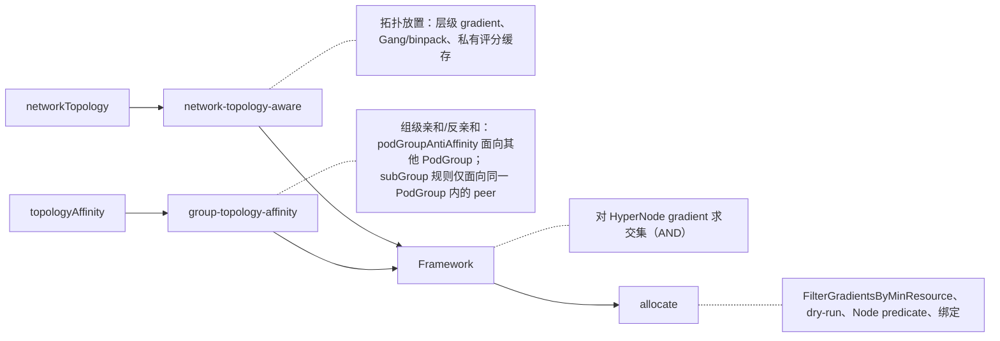
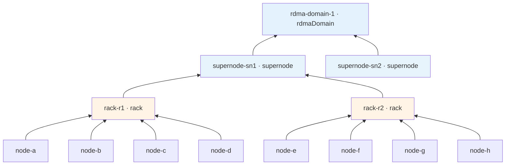
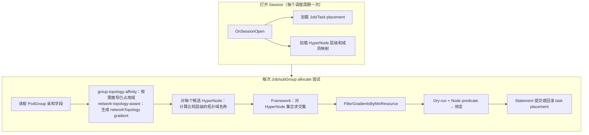
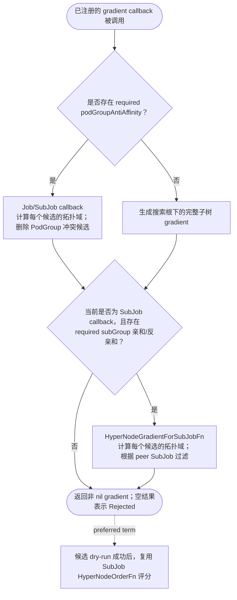
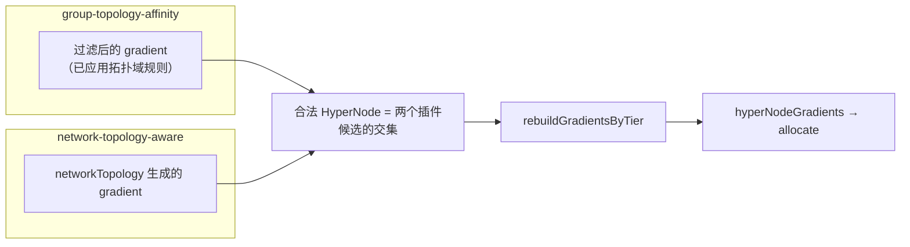
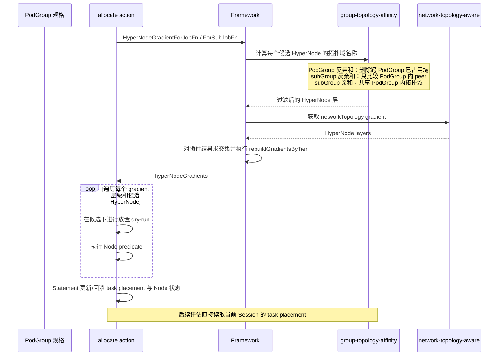
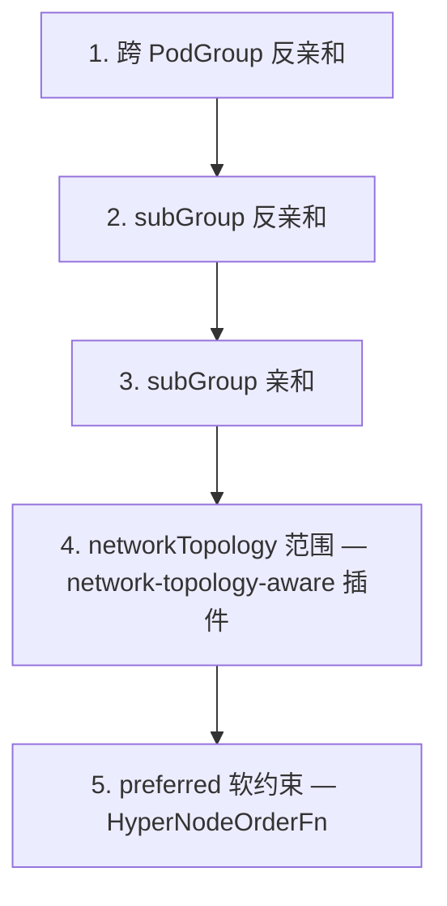
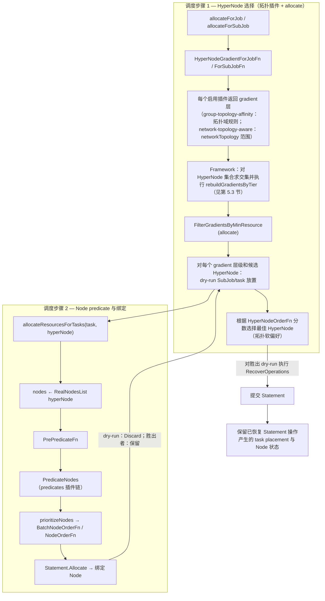

# PodGroup 级拓扑亲和性设计

作者：wangyang0616 · 2026-05-28

---

## 1. 概述

Volcano 已经能够通过 **`networkTopology`** 在 HyperNode 树上调度工作负载，用于定义 PodGroup 或 subGroup 应当在何处**聚合**，例如在一个 rack 内执行 Gang 调度，或者将完整实例限制在一个 supernode 下。本设计为 PodGroup 增加**组级拓扑亲和性与反亲和性**字段（[volcano-sh/volcano#5347](https://github.com/volcano-sh/volcano/issues/5347)），用于描述同一棵拓扑树上**不同组之间的关系**，而不是描述单个 subGroup 内 Pod 的分布。

用户可以声明如下规则：

- **跨 PodGroup：**在指定层级分离多个实例，例如将各推理实例放置到不同 supernode 上以实现故障隔离。
- **同一 PodGroup 内跨 subGroup：**组合分片打散、角色共置或跨角色隔离，例如 Prefill–Decode 的分片按 rack 打散，同时完整实例位于同一个 supernode。

这些能力与现有 `networkTopology` 配置并存，不替代 Pod 模板中用于单个 subGroup 内部约束的 **`podAffinity`** / **`podAntiAffinity`**。

### 实现基线与兼容范围

本文档中的 API 结构在本次交付中已经**冻结**。实现必须使用 [API 类型](#api-types)中定义的 `TopologyAffinitySpec`、`PodGroupAntiAffinity`、`SubGroupAffinity`、`SubGroupAntiAffinity`、`PodGroupAffinityTerm` 和 `SubGroupAffinityTerm`，不得重命名、调整嵌套关系或以其他方式修改其序列化字段。

`task2-podgroup-antiaffinity-v1.14.1` 分支当前确认的基线提交为 `a42372bdc`。该提交上已经验证通过的实现，是第一阶段 PodGroup 反亲和的组匹配、拓扑域计算、硬约束 gradient 过滤、软约束评分、资源预过滤、失败诊断以及与 `network-topology-aware` 组合行为的功能基线。当前 `master` 上的实现属于向前移植，不重新设计这些用户可见语义。SubGroup 能力仍按第二阶段设计实现，不能把该分支视为 SubGroup 行为基线；若参考分支后续移动，必须先重新确认基线提交再更新本文。

master 兼容性分析以当前分支的共同基线提交 `427ad092b228` 为准。该基线新增了 Gang 感知的 HyperNode preemption/reclaim、`SearchPurpose`、驱逐域排序与数量限制，以及 HyperNode nomination。因此，本次交付还需要明确 Gang preemption/reclaim 的**兼容行为**；后续再次 rebase master 时，应按本节清单复核新增差异：

- 分配和驱逐域规划都必须执行 required 组拓扑约束。合法域结果为空时，绝不能回退到集群根节点。
- Gang preemption/reclaim 可以在**已经合法的拓扑域内部**驱逐资源 victim；仅为了消除反亲和冲突而驱逐匹配 PodGroup 的能力暂缓实现。
- 必须先对各插件返回的完整 HyperNode 驱逐候选求交集，再按 master 的 `PurposeEvict` 语义从粗到细排序并限制候选数量。
- 持久化的 `NominatedHyperNode` 只是规划提示，不能绕过最新的 required 亲和性校验；preferred 规则可以在正常 allocate 路径重新评分。
- **Backfill 约束推迟到第三阶段。**第一、二阶段使用这些字段的 PodGroup，不得依赖 backfill 调度 optional/BestEffort 成员。

### 分阶段交付计划

API 作为一个整体契约冻结并交付，但调度器行为分为三个可以独立评审的阶段逐步启用。后续阶段必须保留此前阶段的全部退出标准和回归测试。

| 阶段 | 用户可见能力 | 主要实现范围 | 启用边界 |
| --- | --- | --- | --- |
| **第一阶段 — PodGroup 反亲和** | required 和 preferred `podGroupAntiAffinity`，包括 namespace 与 PodGroup selector | Framework gradient 聚合、基于 task placement 的占用域推导、allocate/资源预过滤集成，以及 master 上 gangpreempt/gangreclaim 的兼容 | 调度仅接受 `podGroupAntiAffinity`。非空 SubGroup 拓扑字段在第二阶段前一律拒绝；服务该能力的调度器配置不启用 backfill。 |
| **第二阶段 — SubGroup 亲和/反亲和** | required 和 preferred `subGroupAffinity` / `subGroupAntiAffinity`，并与第一阶段规则及 `networkTopology` 组合 | SubJob 锚点/排除域、确定性 SubJob 排序、dry-run 可见性与回滚、SubJob 评分及 Gang 驱逐模拟 | 只有 allocate 和 Gang 路径测试通过后，Admission 才开放两个 SubGroup 字段；仍不支持 backfill。 |
| **第三阶段 — Backfill 与收尾** | 对 backfill/optional 成员执行 required 过滤和 preferred 排序，保证各调度 action 行为一致 | Backfill 集成、跨 action 一致性测试、可观测性、性能与回归覆盖、升级指导及最终用户文档 | 仅在第三阶段退出标准全部通过后，才移除禁止拓扑依赖型工作负载使用 backfill 的部署限制。 |

分阶段启用属于实现和发布门禁，而不是 API 版本机制。各阶段之间不得新增、删除、重命名或重新解释 API 字段。特别是，第一阶段二进制必须在 Admission 阶段拒绝第二阶段能力请求，不能接受后再静默忽略。

### 实现复用原则

第一阶段不是依据本文重新实现一套等价逻辑，而是将 `task2-podgroup-antiaffinity-v1.14.1` 的已验证实现按模块移植到 master。评审时默认“参考分支行为保持不变”，只有下表明确列出的 master 差异或参考分支缺口允许调整：

| 模块 | 处理方式 | 说明 |
| --- | --- | --- |
| PodGroup API、required/preferred term 与 weight | **保持冻结** | 参考分支覆盖第一阶段 PodGroup 字段；本文已确认的 SubGroup 字段同时保留，但第一阶段 Admission 禁用 |
| `JobInfo` term 辅助函数、tier 解析、PodGroup selector、自身 UID 排除 | **直接移植** | 以 `pkg/scheduler/api/topology_affinity_info.go` 为主，移植参考分支实际使用的 HyperNode map 辅助函数，不顺带重构插件私有搜索函数 |
| 基于 task placement 的占用域集合、`AllocatedHyperNode` 同步及 annotation 兜底 | **直接移植并适配状态** | 保留 task 为事实来源和参考分支对 Releasing/终态的排除；仅为 master Gang 试算增加带 `NodeName` 的 Pipelined 占用 |
| `group-topology-affinity` required gradient、preferred penalty/weight 和完整子树搜索 | **直接移植** | callback 增加 `SearchPurpose` 参数；第一阶段 Job/SubJob callback 都执行 PodGroup 规则，保持参考分支行为 |
| `WithTopologyAffinity`、`RequiresHyperNodeAllocate` 与 allocate 分流 | **直接移植** | required 和 preferred PodGroup 规则都必须进入 `allocateForJob`；HyperNode 未就绪时不能退化到普通 Node 路径 |
| Framework 多插件交集、`HyperNodeGradientStats` 与排除统计 | **直接移植两态契约** | 已注册 callback 必须返回非 nil：空结果 fail closed，非空结果作为约束或透传参与交集；无 callback 才由 Framework 返回根节点 |
| `FilterGradientsByMinResource` | **直接移植** | 保留 Job/SubJob 调用位置、`GetMinResources()` 输入、`RealNodesSet` 现场聚合和统计；仅验证 master dry-run 状态同步，不新增过滤门槛 |
| HyperNode/Node 双维度 fit summary、PodGroup/Pod Event、日志 | **直接移植** | 保留消息格式和调用时机；日志 API 写法遵循 master 当前风格 |
| Cache task 增删后的 placement 重算、JobUpdater annotation 写回 | **直接移植** | 与 master 的 DirtyJobs、nomination 写回合并，不能互相覆盖 |
| Gang preempt/reclaim、`PurposeEvict`、`maxDomains`、`NominatedHyperNode` | **master 必需新增** | 参考分支没有这些路径；必须在交集后截断、在 allocate 前重新校验 required 规则 |
| `namespaceSelector` 的跨 namespace/Namespace label 语义 | **补齐参考分支缺口** | 参考分支实际只支持同 namespace；master 已有 Namespace informer，可通过其 lister 匹配 Namespace label |
| Admission UPDATE | **补齐参考分支缺口** | 参考分支 webhook 只注册 CREATE；master 必须校验 UPDATE，同时避免重复执行 create-only Queue 状态检查 |
| Admission selector 语法与阶段门禁 | **补齐参考分支缺口** | 保留参考分支的 weight、selector 必填和 tier one-of 校验；增加 `podGroupSelector` / `namespaceSelector` 语法校验，并在第一阶段拒绝非空 SubGroup 字段 |
| 空 `topologyAffinity` 的 no-op 一致性 | **修正参考分支边界问题** | 参考分支 HyperNode ready 门禁按指针存在判断，可能阻塞空对象；目标实现按实际存在的已启用 term 判断，保持 Admission 声明的 no-op 语义 |
| SubGroup 亲和/反亲和与 backfill | **后续阶段扩展** | 沿用 task-placement、gradient、评分和诊断原则，不反向修改第一阶段 PodGroup 行为 |

以下内容不作为第一阶段的新架构引入：独立且必须事务维护的 `TopologyOccupancyIndex`、新的 CRD status/condition 字段、另一套 topology-specific Event 管道，以及让 allocate 读取 `network-topology-aware` 私有资源缓存。若性能测试证明按需扫描需要优化，只能增加可从 task placement 重建的内部缓存，不能改变语义或事实来源。

## 2. 背景与动机

[网络拓扑感知调度](./Network%20Topology%20Aware%20Scheduling.md)已经允许用户通过 `networkTopology` 在某个 HyperNode 域内对 Pod 和 subGroup 进行 Gang 调度，例如将 Prefill 和 Decode subGroup 限制在同一个 supernode 下。它解决的是组应当在拓扑树上**聚合到哪里**的问题。

推理服务还需要表达**多个组之间如何关联**：既包括 **PodGroup** 粒度的跨 PodGroup 关系，也包括同一 PodGroup 内 **subGroup** 粒度的关系。Pod 级 `podAffinity` 无法很好地表达这些要求。

典型场景之一是**多实例推理**：多个 PodGroup 为同一个模型提供服务。运维人员希望每个实例位于**不同的 supernode**，避免一次硬件故障同时影响所有副本。目前没有声明式 PodGroup API 能保证这种隔离；如果不在调度器外部施加约束，多个实例可能落到同一个 supernode。

另一个场景是同一 PodGroup 内的 **Prefill–Decode**：分片应当跨 **rack** 打散，但**完整实例**仍需位于同一个 supernode。没有 **`topologyAffinity`** 时，用户只能拆分成多个 PodGroup，或者叠加脆弱的 Pod 模板规则，这些方案无法与 HyperNode 的整组调度语义对齐。

对于包含同一模型多个推理实例的**服务型工作负载**，通常既需要实例间隔离，也需要实例内 Prefill–Decode 布局。当前这些规则往往散落在运维约定中，或重复写入多个 PodGroup 模板，既难以校验，也无法与现有拓扑调度使用统一配置入口。

本设计通过 PodGroup **`topologyAffinity`** 表达这些亲和与反亲和关系。它构建于现有 HyperNode 能力之上，**不会**替代 `networkTopology`，也不会替代 Pod 模板上的 Pod 级 **`podAffinity`** / **`podAntiAffinity`**。

## 3. 目标

1. 在 PodGroup 上提供**可声明的组级亲和/反亲和**：跨 PodGroup 反亲和，以及同一 PodGroup 内的 subGroup 亲和/反亲和。
2. **清晰的 API 分层：**聚合/范围约束使用 `networkTopology`；组间亲和/反亲和统一使用 **`topologyAffinity`**（`podGroupAntiAffinity`、`subGroupAffinity`、`subGroupAntiAffinity`）。
3. **硬约束与软约束：**`required` 表示强制规则；每个 `preferred` term 必须设置 1–100 的 **`weight`**。`networkTopology` 保留独立的 `mode`，不与本 API 混用。
4. **两个插件、一条路径：**`network-topology-aware` 负责拓扑放置，`group-topology-affinity` 负责亲和/反亲和；Framework 对 gradient 求**交集**；**allocate** 执行 **`FilterGradientsByMinResource`** 后进行 dry-run 和 Node 绑定。
5. **可校验的 API：**通过 Admission Webhook 校验；层级字段与 HyperNode `spec.tierName` / `spec.tier` 对齐。
6. **兼容 master：**在 Gang preempt/reclaim 域规划和 nomination 重新校验过程中保持硬约束有效。
7. **安全的分阶段发布：**每个阶段都必须显式拒绝尚未支持的字段或 action，不能静默弱化用户请求的约束。

## 4. 非目标


| 项目 | 处理方式 |
| -------------------------------------------------------- | --------------------------------------------------------------------------------------- |
| 拓扑聚合/Gang 范围（`networkTopology`） | 由现有 `networkTopology` 字段和 `network-topology-aware` 处理 |
| 单个 subGroup 内的 Pod 级亲和性 | 使用 Pod 模板 `podAffinity` / `podAntiAffinity` |
| 跨 PodGroup 或 namespace 的 **`subGroupAffinity`** / **`subGroupAntiAffinity`** | 不支持；参与比较的 SubJob 始终来自**同一个 PodGroup**（同一 UID） |
| 跨 PodGroup **`podGroupAffinity`**（共置） | 不支持；同一 PodGroup 内共置使用 `networkTopology` 或 **`subGroupAffinity`** |
| 跨 PodGroup **`podGroupAntiAffinity`** | 通过 **`topologyAffinity.podGroupAntiAffinity`** 和 `podGroupSelector` 支持 |
| 第一、二阶段的 backfill 约束 | 在[第三阶段](#phase-3--backfill-and-closure)实现 |
| 拓扑驱动抢占（驱逐匹配组以清理冲突域） | 参见[后续考虑](#future-considerations) |
| `TopologyUnsatisfiable` PodGroup condition | 参见[后续考虑](#future-considerations) |
| Batch Job / `PartitionPolicy` 对齐 | 参见[后续考虑](#future-considerations) |


## 5. 方案

### 5.1 能力模型

用户可以在同一棵 HyperNode 树的不同层级表达调度意图。**拓扑域名称**的计算方式见[第 6 节](#domain_t-semantics)。

**用户在 PodGroup 上声明的内容**

- **`networkTopology`**——聚合或范围约束：一个策略下的 Pod 或 subGroup 应当在哪个层级内 Gang 调度或保持聚合，例如所有分片位于一个 rack，或完整推理实例位于一个 supernode 下。
- **`topologyAffinity.subGroupAffinity`** / **`subGroupAntiAffinity`**——同一 PodGroup 内不同 `subGroupPolicy` 条目之间的亲和/反亲和，例如分片打散、Prefill 与 Decode 共置在一个 supernode 等。
- **`topologyAffinity.podGroupAntiAffinity`**——由 `podGroupSelector` 匹配的**跨 PodGroup**反亲和，例如每个推理实例位于不同 supernode。

**调度器如何执行约束**

两个插件运行在同一条 HyperNode 调度路径上。每个插件读取自己负责的 PodGroup 字段并生成**仅包含拓扑语义**的 HyperNode gradient；Framework 对结果求交集；**allocate** 对交集结果执行 **`FilterGradientsByMinResource`**，随后进行 dry-run 和 Node 绑定。容量过滤统一从 Session 的 HyperNode 成员 Node 聚合资源，保证交集后的每个候选都在 dry-run 前完成检查；`network-topology-aware` 的私有 HyperNode 资源缓存继续服务于原有评分，不作为该过滤器的输入。




当两个插件同时启用时，Framework 对所有已注册 callback 的结果求交集。参考分支采用两态契约：没有硬规则的插件也必须返回非空的透传 gradient，而不能返回 `nil`；`group-topology-affinity` 没有 required term 时返回完整子树，以兼容 preferred 评分及多插件交集。已注册插件返回空结果时表示无合法候选或内部错误后的 fail closed，PodGroup 保持不可调度并返回清晰的 fit error。只有当前层级完全没有注册 gradient callback 时，Framework 才返回输入根 HyperNode 单例。

### 5.2 PodGroup API

<a id="new-fields-this-delivery"></a>

#### 新增字段

本设计在 **`PodGroupSpec`** 上新增一个可选字段 **`topologyAffinity`**（`TopologyAffinitySpec`）。现有 **`networkTopology`**、**`subGroupPolicy`** 以及 Pod 的 **`podAffinity`** / **`podAntiAffinity`** 保持不变。跨 PodGroup 的 **`podGroupAffinity`** 以及跨 PodGroup 的 **`subGroupAffinity`** / **`subGroupAntiAffinity`** 不在范围内；term 中的 **`subGroups`** 只能引用**当前 PodGroup** 的 `subGroupPolicy` 名称。

**`topologyAffinity`** 最多包含三个子块，每个子块可以包含 **`required`**（硬约束）和/或 **`preferred`**（软约束，term 的 **`weight`** 为 1–100）：

- **`podGroupAntiAffinity`**——当前 PodGroup 与**其他** PodGroup 之间的反亲和。Term 类型为 **`PodGroupAffinityTerm`**，包含必填 `podGroupSelector`、可选 `namespaceSelector`，以及 `topologyTierName` / `topologyTier`。调度器按 UID 排除当前 PodGroup。
- **`subGroupAffinity`**——**仅限当前 PodGroup 内部**：列出的 **`subGroups`**（当前 PodGroup 的 `subGroupPolicy[].name`）必须共享**同一个**拓扑域。Term 类型为 **`SubGroupAffinityTerm`**，包含 `subGroups` 和 `topologyTierName` / `topologyTier`。
- **`subGroupAntiAffinity`**——**仅限当前 PodGroup 内部**：用于当前 PodGroup 内 SubJob 的打散或隔离，结构与亲和规则相同，均使用 **`SubGroupAffinityTerm`**。

每个 term 都必须设置 **`topologyTierName`** 或 **`topologyTier`**（见[第 6 节](#domain_t-semantics)）。通常还会同时配置 **`subGroupPolicy`**，包括 `matchLabelKeys`、`minSubGroups` 以及各策略自己的 **`networkTopology`**。

<a id="semantics"></a>

#### 语义

**两个层次（规则中不可混用）：**

| 层次 | 含义 | 出现位置 |
| ----- | ---------- | ---------------- |
| **策略名称** | `subGroupPolicy[].name`，例如 `prefill`、`decode` | YAML 中的 `SubGroupAffinityTerm.subGroups` |
| **SubJob** | 由策略生成的一个可调度单元，例如应用 `matchLabelKeys` 后的一个分片 | 仅用于调度器计算，不是 `topologyAffinity` 字段 |

用户在 term 的 **`subGroups`** 中填写**策略名称**。调度器执行 **`subGroupAffinity`** / **`subGroupAntiAffinity`** 时，实际比较的是这些策略下各 **SubJob** 所在的拓扑域。

**作用范围：** **`subGroupAffinity`** 和 **`subGroupAntiAffinity`** **仅在同一个 PodGroup 内生效**，peer 只能是该 PodGroup 的 SubJob。跨 PodGroup 规则使用 **`podGroupAntiAffinity`**（`podGroupSelector`）。下文中，**策略内**表示同一策略下的 SubJob 之间；**跨策略**表示**同一 PodGroup 内**不同策略的 SubJob 之间，而不是 PodGroup 之间。

**`subGroupAffinity`**——在一个 term 中，策略名称出现在 **`subGroups`** 内的所有 SubJob，必须位于该 term 指定层级的**同一个**拓扑域。

**`subGroupAntiAffinity`**——在一个 term 中，哪些 SubJob 互为 peer 取决于 **`subGroups`** 中策略名称的数量：

- **一个策略名称**（如 `subGroups: [prefill]`）——**策略内反亲和：**每个 `prefill` SubJob 必须与其他 `prefill` SubJob 使用**不同**拓扑域，不影响其他策略。
- **两个或更多策略名称**（如 `subGroups: [prefill, decode]`）——**跨策略反亲和：**一个 SubJob 不得与列表中**其他策略**的 SubJob 共享拓扑域；同一策略下的两个 SubJob 仍可共享拓扑域。如果还需要策略内打散，必须另行增加只包含一个策略名称的 term，例如 `subGroups: [prefill]`。

多个 **`required`** term 按 **AND** 关系组合。对于候选 HyperNode，如果其在 term 指定层级的拓扑域与受该 term 约束的 peer SubJob 域相同，则删除该候选：单名称 term 比较同策略 peer，多名称 term 比较不同策略 peer。

上述单名称和多名称形式是有意区分且固定的 API 语义。加入第二个策略名称会将 term 从策略内打散切换为跨策略隔离；同时需要两种行为时，必须分别声明 term，参见示例 2c 和 2d。

**跨 PodGroup 方向性：**`podGroupAntiAffinity` term 只从当前正在调度的 PodGroup 视角计算。已有 PodGroup 不会反向约束一个自身没有匹配规则的后续 PodGroup。需要双向隔离时，用户必须在所有参与方上配置等价规则。该语义与 `task2-podgroup-antiaffinity-v1.14.1` 已验证实现保持一致。

**Namespace 选择：**省略（`null`）`namespaceSelector` 时只选择当前调度 PodGroup 所在 namespace；`{}` 选择所有 namespace；非空 selector 匹配 Namespace 对象的 label。随后 `podGroupSelector` 在选中的 namespace 内匹配 PodGroup `metadata.labels`。当前 PodGroup 始终按 UID 排除。

参考分支的 `matchesNamespaceSelector` 当前无论是否设置 selector 都只接受同 namespace，这是已知未完成项，不能作为最终语义照搬。master 已注册 Namespace informer；`group-topology-affinity` 在 Session 打开时取得 `ssn.InformerFactory().Core().V1().Namespaces().Lister()`：`nil` 不访问 lister，空 selector 直接允许所有 namespace，非空 selector 查询目标 Namespace 并匹配其 labels。required term 遇到 selector 解析错误或目标 Namespace 无法读取时返回非 nil 空 gradient 并记录错误，不能静默跳过匹配对象从而放宽硬约束。

**运行期间不驱逐：**required 和 preferred 规则只影响新的放置决策。更新 PodGroup、PodGroup label、Namespace label 或 HyperNode 树不会驱逐已经运行的 Pod；后续分配和重试基于最新 Session 快照重新计算。

**占用状态：**一个组在某个比较层级可能占用多个域，因此调度器从 task placement 按需推导已占用 `Domain_T` 的**集合**，而不是将单一 Job/SubJob LCA 作为事实来源。状态为 `Allocated`、`Binding`、`Bound`、`Running` 的 task 占用域；Session 内已设置 `NodeName` 的 `Pipelined` task 预留规划域；`Releasing`、`Succeeded`、`Failed` task 不占用域。只有在暂时无法获取 task 放置时，才使用记录的 allocated HyperNode 作为兜底。

**SubGroup 计算顺序：**已经放置的 peer SubJob 建立亲和锚点和反亲和排除域；尚无 peer 被放置时，第一个满足条件的 SubJob 建立锚点。Job dry-run 在计算后续 SubJob 时必须保留此前选中 SubJob 的操作可见性，并在丢弃候选 Job HyperNode 时整体回滚。顺序必须确定；required 规则绝不能使用 preferred 分数放宽空的硬约束候选集。

**与现有字段的分层：** **`networkTopology`** 定义 PodGroup 全局或每个 `subGroupPolicy` 的聚合范围；**`topologyAffinity`** 定义 SubJob 与 peer 之间的域关系。如果同一对受约束 SubJob 同时出现在硬 **`subGroupAffinity`** 和硬 **`subGroupAntiAffinity`** 中，亲和层级必须比反亲和层级**严格更粗**；相同层级会要求两者既共置又分离。**`topologyTier`** 映射到 HyperNode `spec.tier`：整数越大，域越粗、越靠近树根，例如[第 6 节](#reference-topology)中的 supernode > rack。

Go 类型见[第 6 节 API 类型](#api-types)，YAML 示例见[第 5.4 节](#54-representative-scenarios)。

### 5.3 调度流程概览

`network-topology-aware` 负责 **`networkTopology`**（仅拓扑的 gradient 和原有评分缓存）；`group-topology-affinity` 负责 **`topologyAffinity`**，并沿用参考分支的方式从 Session Job/Task placement 按需推导已占用拓扑域。Framework 对插件 gradient 求交集；**allocate** 从 Session Node 状态聚合资源并执行 **`FilterGradientsByMinResource`**，再对 HyperNode 候选执行 dry-run 并绑定 Node。详细流程见[调度流水线](#scheduling-pipeline)。Framework 对所有启用的拓扑插件执行 gradient **交集**，替换 `master` 当前的 winner-takes-all 行为，同时为分配和驱逐规划保留不同的 `SearchPurpose`。

进入该流程的判定直接移植参考分支的 `JobInfo.RequiresHyperNodeAllocate()`：硬 `networkTopology`、SubJob policy、required PodGroup 反亲和和 preferred PodGroup 反亲和任一存在，都必须走 `allocateForJob`。尤其是 preferred-only PodGroup，不能留在 master 的普通 Node 分配路径，否则不会生成完整子树候选，也不会调用 SubJob `HyperNodeOrderFn`。声明受支持拓扑规则但 HyperNode cache 尚未 ready 时，Job 保持等待而不是降级调度；仅存在空 `topologyAffinity: {}` 时仍按 no-op 处理，不能仅因指针非 nil 而阻塞。

<a id="54-representative-scenarios"></a>

### 5.4 典型场景

以下 YAML 使用 `# NEW` 标记本设计引入的字段（见[字段列表](#new-fields-this-delivery)）。示例 1 在**第一阶段**可用；示例 2、2b–2d 和 3 需要**第二阶段**；示例 4 组合两个层级，因此也在**第二阶段**启用。第三阶段不增加 API 字段或新的 YAML 形式，只让相同约束在 backfill 路径同样生效。

<a id="example-1--multi-instance-fault-isolation"></a>

**示例 1——多实例故障隔离**

最小化 PodGroup 示例，仅展示跨 PodGroup 反亲和；`minMember` 仅作示意，不绑定特定工作负载形态。

```yaml
apiVersion: scheduling.volcano.sh/v1beta1
kind: PodGroup
metadata:
  name: llama-70b-instance-0
  namespace: default
  labels:
    topology.volcano.sh/group: llama-70b-prod
spec:
  minMember: 8
  queue: default
  topologyAffinity:                      # NEW — 组间拓扑规则的根容器
    podGroupAntiAffinity:                # NEW — 与 podGroupSelector 匹配的其他 PodGroup 反亲和
      required:                          # NEW — 硬约束（强制）term
      - podGroupSelector:                # NEW — peer PodGroup 的 label selector
          matchLabels:
            topology.volcano.sh/group: llama-70b-prod
        topologyTierName: supernode      # NEW — 每个 peer 实例使用不同的 supernode 域
```

<a id="example-2--prefilldecode-shards-per-rack"></a>

**示例 2——Prefill–Decode：分片按 rack 打散，角色位于同一 supernode**

该 PodGroup 包含 4 个 prefill SubJob 和 2 个 decode SubJob（通过 `matchLabelKeys` 为每个分片生成一个 SubJob）。各策略的 **`networkTopology`** 在 **rack** 层级对每个分片执行 Gang 约束。所有 prefill 和 decode SubJob 必须位于**同一个 supernode** 下。supernode 共置可使用以下两种等价且互斥的方式之一声明：

- **方案 A（现有能力）：**通过 **`spec.networkTopology`** 的 `highestTierName: supernode` 声明 PodGroup 级聚合范围，由 **`network-topology-aware`** 执行；每个角色内部使用 **`topologyAffinity.subGroupAntiAffinity`** 的单名称 `[prefill]`、`[decode]` term 在 rack 层级打散分片。
- **方案 B（新增能力）：**通过 **`topologyAffinity.subGroupAffinity`** 的 `subGroups: [prefill, decode]` 和 `topologyTierName: supernode` 显式声明跨 subGroup 共置，由 **`group-topology-affinity`** 执行；rack 层级的 **`subGroupAntiAffinity`** 与方案 A 相同。

PodGroup 已声明全局 **`networkTopology`** 时使用方案 A；只有列出的 subGroup 需要共置，或其层级与 PodGroup 范围不同时使用方案 B。两种方案都需要 **`network-topology-aware`**（策略级和/或 PodGroup 级 **`networkTopology`**）及 **`group-topology-affinity`**（**`topologyAffinity`**），参见[调度器配置](#scheduler-configuration)。组合 **`subGroupAntiAffinity`** term 的形式见[示例 2b](#example-2b--cross-policy-anti-affinity-only)至[示例 2d](#example-2d--combined-intra-and-cross-policy-terms)；同时使用三个 **`topologyAffinity`** 子块见[示例 4](#example-4--combined-podgroup-and-subgroup-topology)。

**方案 A——PodGroup `networkTopology` 位于 supernode 层级**

```yaml
apiVersion: scheduling.volcano.sh/v1beta1
kind: PodGroup
metadata:
  name: llama-70b-prefill-decode-nt
  namespace: default
spec:
  minMember: 44
  queue: default
  networkTopology:
    mode: hard
    highestTierName: supernode
  subGroupPolicy:
  - name: prefill
    labelSelector:
      matchLabels:
        volcano.sh/role: prefill
    matchLabelKeys:
    - volcano.sh/shard-id
    subGroupSize: 8
    minSubGroups: 4
    networkTopology:
      mode: hard
      highestTierName: rack
  - name: decode
    labelSelector:
      matchLabels:
        volcano.sh/role: decode
    matchLabelKeys:
    - volcano.sh/shard-id
    subGroupSize: 6
    minSubGroups: 2
    networkTopology:
      mode: hard
      highestTierName: rack
  topologyAffinity:                      # NEW
    subGroupAntiAffinity:                # NEW — PodGroup 内 subGroup 打散/隔离
      required:                          # NEW — 硬约束（强制）term
      - subGroups:                       # NEW — 策略内：每个 prefill SubJob 使用不同 rack
        - prefill
        topologyTierName: rack           # NEW — 在 rack 层级比较拓扑域名称
      - subGroups:                       # NEW — 策略内：每个 decode SubJob 使用不同 rack
        - decode
        topologyTierName: rack           # NEW — 在 rack 层级比较拓扑域名称
```

<a id="example-2-option-b"></a>

**方案 B——`subGroupAffinity` 位于 supernode 层级**

使用与方案 A 相同的 **`subGroupPolicy`**，通过 **`subGroupAffinity`** 而不是 PodGroup **`networkTopology`** 实现 supernode 共置。

```yaml
apiVersion: scheduling.volcano.sh/v1beta1
kind: PodGroup
metadata:
  name: llama-70b-prefill-decode-affinity
  namespace: default
spec:
  minMember: 44
  queue: default
  subGroupPolicy:
  - name: prefill
    labelSelector:
      matchLabels:
        volcano.sh/role: prefill
    matchLabelKeys:
    - volcano.sh/shard-id
    subGroupSize: 8
    minSubGroups: 4
    networkTopology:
      mode: hard
      highestTierName: rack
  - name: decode
    labelSelector:
      matchLabels:
        volcano.sh/role: decode
    matchLabelKeys:
    - volcano.sh/shard-id
    subGroupSize: 6
    minSubGroups: 2
    networkTopology:
      mode: hard
      highestTierName: rack
  topologyAffinity:                      # NEW — 组间拓扑规则的根容器
    subGroupAffinity:                    # NEW — 列出的 subGroup 共享同一拓扑域
      required:                          # NEW — 硬约束（强制）term
      - subGroups:                       # NEW — prefill 与 decode 在 supernode 共置
        - prefill
        - decode
        topologyTierName: supernode      # NEW — 在 supernode 层级比较拓扑域名称
    subGroupAntiAffinity:                # NEW — PodGroup 内 subGroup 打散/隔离
      required:                          # NEW — 硬约束（强制）term
      - subGroups:                       # NEW — 策略内：每个 prefill SubJob 使用不同 rack
        - prefill
        topologyTierName: rack           # NEW — 在 rack 层级比较拓扑域名称
      - subGroups:                       # NEW — 策略内：每个 decode SubJob 使用不同 rack
        - decode
        topologyTierName: rack           # NEW — 在 rack 层级比较拓扑域名称
```

独立的单名称 term 用于在各策略**内部**打散 SubJob。除非增加多名称 term，否则不同策略的 SubJob 仍可能共享同一个域，参见[示例 2b](#example-2b--cross-policy-anti-affinity-only)至[示例 2d](#example-2d--combined-intra-and-cross-policy-terms)。

<a id="example-2b--cross-policy-anti-affinity-only"></a>

**示例 2b——仅跨策略反亲和**

使用一个多名称 **`subGroupAntiAffinity`** term。PodGroup 包含两个策略：**角色 A**（`role-a`，4 个 SubJob）和**角色 B**（`role-b`，2 个 SubJob），均通过 **`matchLabelKeys`** 切分。在 **rack** 层级执行跨策略隔离：任何角色 A SubJob 都不能与角色 B SubJob 共享域，但**同一角色**下的多个 SubJob **可以**共享域。

```yaml
apiVersion: scheduling.volcano.sh/v1beta1
kind: PodGroup
metadata:
  name: demo-cross-policy-only
  namespace: default
spec:
  minMember: 28
  queue: default
  subGroupPolicy:
  - name: role-a
    labelSelector:
      matchLabels:
        volcano.sh/subgroup: role-a
    matchLabelKeys:
    - volcano.sh/partition-id
    subGroupSize: 4
    minSubGroups: 4
  - name: role-b
    labelSelector:
      matchLabels:
        volcano.sh/subgroup: role-b
    matchLabelKeys:
    - volcano.sh/partition-id
    subGroupSize: 6
    minSubGroups: 2
  topologyAffinity:                      # NEW — 组间拓扑规则的根容器
    subGroupAntiAffinity:                # NEW — PodGroup 内 subGroup 打散/隔离
      required:                          # NEW — 硬约束（强制）term
      - subGroups:                       # NEW — 跨策略：角色 A 与角色 B 不得共享域
        - role-a
        - role-b
        topologyTierName: rack           # NEW — 在 rack 层级比较拓扑域名称
```

<a id="example-2c--intra-policy-plus-cross-policy-anti-affinity"></a>

**示例 2c——策略内打散与跨策略反亲和组合**

在 **rack** 层级使用两个按 **AND** 组合的 **`required`** term：**`[role-a]`** 要求每个角色 A SubJob 使用不同域；**`[role-a, role-b]`** 要求角色 A 与角色 B 的 SubJob 不得共享域。角色 B 内部打散还需要增加 **`[role-b]`** term，参见[示例 2d](#example-2d--combined-intra-and-cross-policy-terms)。

```yaml
apiVersion: scheduling.volcano.sh/v1beta1
kind: PodGroup
metadata:
  name: demo-intra-plus-cross
  namespace: default
spec:
  minMember: 28
  queue: default
  subGroupPolicy:
  - name: role-a
    labelSelector:
      matchLabels:
        volcano.sh/subgroup: role-a
    matchLabelKeys:
    - volcano.sh/partition-id
    subGroupSize: 4
    minSubGroups: 4
  - name: role-b
    labelSelector:
      matchLabels:
        volcano.sh/subgroup: role-b
    matchLabelKeys:
    - volcano.sh/partition-id
    subGroupSize: 6
    minSubGroups: 2
  topologyAffinity:                      # NEW — 组间拓扑规则的根容器
    subGroupAntiAffinity:                # NEW — PodGroup 内 subGroup 打散/隔离
      required:                          # NEW — 硬约束（强制）term；多个 term 按 AND 组合
      - subGroups: [role-a]              # NEW — 策略内：每个角色 A SubJob 使用不同域
        topologyTierName: rack           # NEW — 在 rack 层级比较拓扑域名称
      - subGroups:                       # NEW — 跨策略：角色 A 与角色 B 不得共享域
        - role-a
        - role-b
        topologyTierName: rack           # NEW — 在 rack 层级比较拓扑域名称
```

<a id="example-2d--combined-intra-and-cross-policy-terms"></a>

**示例 2d——策略内与跨策略 term 完整组合**

在 **rack** 层级使用三个 **`required`** term：**`[role-a]`**、**`[role-b]`** 和 **`[role-a, role-b]`**。六个 SubJob 分别占用不同域，角色 A 与角色 B 之间也不会重叠。

```yaml
apiVersion: scheduling.volcano.sh/v1beta1
kind: PodGroup
metadata:
  name: demo-full-spread
  namespace: default
spec:
  minMember: 28
  queue: default
  subGroupPolicy:
  - name: role-a
    labelSelector:
      matchLabels:
        volcano.sh/subgroup: role-a
    matchLabelKeys:
    - volcano.sh/partition-id
    subGroupSize: 4
    minSubGroups: 4
  - name: role-b
    labelSelector:
      matchLabels:
        volcano.sh/subgroup: role-b
    matchLabelKeys:
    - volcano.sh/partition-id
    subGroupSize: 6
    minSubGroups: 2
  topologyAffinity:                      # NEW — 组间拓扑规则的根容器
    subGroupAntiAffinity:                # NEW — PodGroup 内 subGroup 打散/隔离
      required:                          # NEW — 硬约束（强制）term；多个 term 按 AND 组合
      - subGroups: [role-a]              # NEW — 策略内：每个角色 A SubJob 使用不同域
        topologyTierName: rack           # NEW — 在 rack 层级比较拓扑域名称
      - subGroups: [role-b]              # NEW — 策略内：每个角色 B SubJob 使用不同域
        topologyTierName: rack           # NEW — 在 rack 层级比较拓扑域名称
      - subGroups:                       # NEW — 跨策略：角色 A 与角色 B 不得共享域
        - role-a
        - role-b
        topologyTierName: rack           # NEW — 在 rack 层级比较拓扑域名称
```

<a id="example-3--soft-shard-spread"></a>

**示例 3——软约束分片打散**

使用与[示例 2](#example-2--prefilldecode-shards-per-rack)相同的 Prefill–Decode SubJob 布局，但分片打散只使用 **`preferred`** term。PodGroup 在 **supernode** 层级的 **`networkTopology`** 保持实例范围；省略各策略在 **rack** 层级的硬 **`networkTopology`**，使 rack 打散完全由软 **`subGroupAntiAffinity`** 表达。

```yaml
apiVersion: scheduling.volcano.sh/v1beta1
kind: PodGroup
metadata:
  name: llama-70b-soft-shard
  namespace: default
spec:
  minMember: 44
  queue: default
  networkTopology:
    mode: hard
    highestTierName: supernode
  subGroupPolicy:
  - name: prefill
    labelSelector:
      matchLabels:
        volcano.sh/role: prefill
    matchLabelKeys:
    - volcano.sh/shard-id
    subGroupSize: 8
    minSubGroups: 4
  - name: decode
    labelSelector:
      matchLabels:
        volcano.sh/role: decode
    matchLabelKeys:
    - volcano.sh/shard-id
    subGroupSize: 6
    minSubGroups: 2
  topologyAffinity:                      # NEW — 组间拓扑规则的根容器
    subGroupAntiAffinity:                # NEW — PodGroup 内 subGroup 打散/隔离
      preferred:                         # NEW — 按 weight 评分的软约束 term
      - subGroups:                       # NEW — 策略内：倾向每个 prefill SubJob 使用不同 rack
        - prefill
        weight: 100                      # NEW — preferred term 优先级（1-100）
        topologyTierName: rack           # NEW — 在 rack 层级比较拓扑域名称
      - subGroups:                       # NEW — 策略内：倾向每个 decode SubJob 使用不同 rack
        - decode
        weight: 100                      # NEW — preferred term 优先级（1-100）
        topologyTierName: rack           # NEW — 在 rack 层级比较拓扑域名称
```

<a id="example-4--combined-podgroup-and-subgroup-topology"></a>

**示例 4——PodGroup 与 subGroup 拓扑组合**

一个 PodGroup 同时声明三个 **`topologyAffinity`** 子块，用于多实例分离式推理：**`podGroupAntiAffinity`**（[示例 1](#example-1--multi-instance-fault-isolation)）、**`subGroupAffinity`** 和策略内 **`subGroupAntiAffinity`**（[示例 2 方案 B](#example-2-option-b)）：

- **`podGroupAntiAffinity`** @ **supernode**——同一 label 组中的 peer 实例分别位于**不同** supernode。
- **`subGroupAffinity`** @ **supernode**——**当前**实例的 prefill 与 decode SubJob 共享**同一个** supernode。
- **`subGroupAntiAffinity`** @ **rack**——每个 prefill/decode 分片位于**不同** rack（策略内）。

supernode 层级的硬 **`subGroupAffinity`** 与 rack 层级的硬 **`subGroupAntiAffinity`** 满足[第 5.2 节语义](#semantics)中的层级规则，因为 supernode 比 rack 更粗。

```yaml
apiVersion: scheduling.volcano.sh/v1beta1
kind: PodGroup
metadata:
  name: llama-70b-instance-0
  namespace: default
  labels:
    topology.volcano.sh/group: llama-70b-prod
spec:
  minMember: 44
  queue: default
  subGroupPolicy:
  - name: prefill
    labelSelector:
      matchLabels:
        volcano.sh/role: prefill
    matchLabelKeys:
    - volcano.sh/shard-id
    subGroupSize: 8
    minSubGroups: 4
    networkTopology:
      mode: hard
      highestTierName: rack
  - name: decode
    labelSelector:
      matchLabels:
        volcano.sh/role: decode
    matchLabelKeys:
    - volcano.sh/shard-id
    subGroupSize: 6
    minSubGroups: 2
    networkTopology:
      mode: hard
      highestTierName: rack
  topologyAffinity:                      # NEW — 组间拓扑规则的根容器
    podGroupAntiAffinity:                # NEW — 与 podGroupSelector 匹配的其他 PodGroup 反亲和
      required:                          # NEW — 硬约束（强制）term
      - podGroupSelector:                # NEW — peer PodGroup 的 label selector
          matchLabels:
            topology.volcano.sh/group: llama-70b-prod
        topologyTierName: supernode      # NEW — 每个 peer 实例使用不同的 supernode 域
    subGroupAffinity:                    # NEW — 列出的 subGroup 共享同一拓扑域
      required:                          # NEW — 硬约束（强制）term
      - subGroups:                       # NEW — prefill 与 decode 在 supernode 共置
        - prefill
        - decode
        topologyTierName: supernode      # NEW — 在 supernode 层级比较拓扑域名称
    subGroupAntiAffinity:                # NEW — PodGroup 内 subGroup 打散/隔离
      required:                          # NEW — 硬约束（强制）term
      - subGroups:                       # NEW — 策略内：每个 prefill SubJob 使用不同 rack
        - prefill
        topologyTierName: rack           # NEW — 在 rack 层级比较拓扑域名称
      - subGroups:                       # NEW — 策略内：每个 decode SubJob 使用不同 rack
        - decode
        topologyTierName: rack           # NEW — 在 rack 层级比较拓扑域名称
```

层级名称必须与集群中 HyperNode CR 的 `spec.tierName` 一致。

## 6. 详细设计

**交付物：**PodGroup CRD、`group-topology-affinity` 插件、Framework gradient 交集、allocate 中的 **`FilterGradientsByMinResource`**（将资源预过滤从 `network-topology-aware` gradient BFS 中移出）、Admission Webhook 及 e2e 测试。

<a id="api-types"></a>

### API 类型

目标文件：`staging/src/volcano.sh/apis/pkg/apis/scheduling/v1beta1/types.go`。

以下序列化结构是已经确认的 API 契约。为便于与源码逐字核对，代码块及源码注释保留英文。实现可以增加校验 marker、生成代码、转换、apply configuration 和 CRD schema，但不得修改字段名称、嵌套关系或 term 类型。

```go
// PodGroupSpec — only the field marked NEW is added by this design.
type PodGroupSpec struct {
    // ... minMember, queue, priorityClassName, minResources,
    //     networkTopology, subGroupPolicy (existing) ...

    // NEW — inter-group topology affinity / anti-affinity
    TopologyAffinity *TopologyAffinitySpec `json:"topologyAffinity,omitempty"`
}

// NEW types (all fields in this block are new)
type TopologyAffinitySpec struct {
    PodGroupAntiAffinity *PodGroupAntiAffinity `json:"podGroupAntiAffinity,omitempty"`
    SubGroupAffinity     *SubGroupAffinity     `json:"subGroupAffinity,omitempty"`
    SubGroupAntiAffinity *SubGroupAntiAffinity `json:"subGroupAntiAffinity,omitempty"`
}

type PodGroupAntiAffinity struct {
    Required  []PodGroupAffinityTerm `json:"required,omitempty"`
    Preferred []PodGroupAffinityTerm `json:"preferred,omitempty"`
}

type PodGroupAffinityTerm struct {
    Weight            int32                 `json:"weight,omitempty"` // preferred only, 1-100
    PodGroupSelector  *metav1.LabelSelector `json:"podGroupSelector"`
    NamespaceSelector *metav1.LabelSelector `json:"namespaceSelector,omitempty"`
    TopologyTierName  string                `json:"topologyTierName,omitempty"`
    TopologyTier      *int32                `json:"topologyTier,omitempty"`
}

type SubGroupAffinity struct {
    Required  []SubGroupAffinityTerm `json:"required,omitempty"`
    Preferred []SubGroupAffinityTerm `json:"preferred,omitempty"`
}

type SubGroupAntiAffinity struct {
    Required  []SubGroupAffinityTerm `json:"required,omitempty"`
    Preferred []SubGroupAffinityTerm `json:"preferred,omitempty"`
}

type SubGroupAffinityTerm struct {
    // SubGroups names subGroupPolicy entries. For subGroupAntiAffinity:
    //   one name  → intra-policy (all SubJobs of that policy pairwise distinct domains)
    //   two+ names → cross-policy only (SubJobs from different listed policies must not share a domain; same policy may share)
    SubGroups          []string `json:"subGroups"`
    Weight             int32    `json:"weight,omitempty"` // preferred only, 1-100
    TopologyTierName   string   `json:"topologyTierName,omitempty"`
    TopologyTier       *int32   `json:"topologyTier,omitempty"`
}
```

`Weight` 只对 `preferred` 列表中的条目有意义。`required` 中必须省略该字段（反序列化后为 `0`），`preferred` 中必须位于 `[1,100]`。已确认的 API 有意在两个列表中复用相同 term 类型，因此该上下文规则由 CRD/Admission 校验实现，而不新增第二个带权重的包装类型。

preferred 评分使用固定 API，且不能削弱硬约束。master 实现必须逐项保留 `task2-podgroup-antiaffinity-v1.14.1` 已验证的 PodGroup 评分公式和调用位置：插件通过现有 SubJob `HyperNodeOrderFn` 对候选初始化 `1.0`，每个冲突 preferred term 减去 `term.weight/100` 并下限截断到 `0`，最后乘以插件 `arguments.weight` 和 `MaxNodeScore`；Job 级选择沿用 allocate 对各 SubJob allocation score 的累加。第一阶段不得改成新的 Job 级 hook或另一种归一化公式。第二阶段的 SubGroup preferred 也复用 SubJob order hook，但必须用独立测试明确其与 PodGroup penalty 的合并方式。在重构评分路径前，应通过参考分支的 golden test 固化候选排序和精确分值。

**与 `networkTopology` 层级字段对齐**


| 用途 | 字符串字段 | 整数字段 |
| ------------------------------------------ | ------------------ | -------------------- |
| 聚合/范围（`networkTopology`） | `highestTierName` | `highestTierAllowed` |
| 亲和/反亲和（每个 term） | `topologyTierName` | `topologyTier` |


Scheduler Session 共享 `HyperNodeTierNameMap` 和 `HyperNodeTierSet`。

<a id="domain_t-semantics"></a>

### 拓扑域语义

规则比较的是**拓扑域名称**，即指定层级上的祖先 HyperNode 名称，而不是 Kubernetes Node hostname。对于 gradient 层中的每个**候选 HyperNode**和每个 term 的**比较层级**（`topologyTierName` / `topologyTier`），沿树向上找到该层级的第一个祖先，其名称即为域标识，实现中记为 **`Domain_T`**。执行位置见[调度流水线](#scheduling-pipeline)，YAML 见[第 5.4 节](#54-representative-scenarios)。

处于比较层级或其下方的候选恰好对应一个 `Domain_T`。比比较层级更粗的候选会跨越多个域，不能视为单一放置域，因此不是 required term 的合法最终候选。如果 required 层级无法解析，或候选在该层级没有祖先，则 required term 以 fail-closed 方式失败。preferred 沿用参考分支的惩罚模型：只有成功解析候选在 term 层级的祖先且命中已占用域时才扣除 `weight/100`；祖先为空时不扣分，层级解析本身失败则由 `HyperNodeOrderFn` 返回错误，不能静默改写评分公式。

在 Job 范围，required `podGroupAntiAffinity` term 会将 PodGroup dry-run 限制在一个候选子树中，该子树的 `Domain_T` 在 term 指定层级必须合法；SubJob 范围同理。当部分运行的 Job/SubJob 已经在该层级占用多个域时，调度器保留现有 Pod（`IgnoredDuringExecution`），但不会将新成员放入与 required term 冲突的域。

<a id="reference-topology"></a>

#### 参考拓扑
层级为 **node → rack → supernode → RDMA 连接域**（`rdmaDomain`）。**`rdma-domain-1`** 的子节点包括 **`supernode-sn1`**（图中展示 8 个 node、2 个 rack）和省略内部节点的 **`supernode-sn2`**。箭头方向为子节点指向父节点。




<a id="scheduling-pipeline"></a>

### 调度流水线

一次 allocate 周期中：**`group-topology-affinity`** 按拓扑域过滤 gradient，其中跨 PodGroup **`podGroupAntiAffinity`** 通过 `MatchingPodGroupsAllocatedHyperNodesForTerm` 扫描匹配 Job，并由 `CollectJobOccupiedHyperNodesAtTier` 从 task placement 推导其占用域；PodGroup 内 **`subGroupAffinity`** / **`subGroupAntiAffinity`** 沿用相同原则，只比较同一 PodGroup 的 peer SubJob；**`network-topology-aware`** 应用 **`networkTopology`**；Framework 对 HyperNode 集合求**交集**并执行 **`rebuildGradientsByTier`**；**allocate** 执行 **`FilterGradientsByMinResource`**，再对每个剩余候选 dry-run 并绑定 Node。硬规则使用 gradient hook；软规则统一复用现有 SubJob `HyperNodeOrderFn`，Job 级选择累加各 SubJob allocation score。`SearchPurpose` 在所有拓扑 callback 中原样透传，使分配和驱逐保持各自的排序与容量语义。从 gradient 候选到资源预过滤、Node predicate 和绑定的路径见 [HyperNode 选择与 Node predicate](#hypernode-selection-and-predicates)。

占用域的**事实来源是 task placement**，不新增必须由 EventHandler 维护的独立 `TopologyOccupancyIndex`。每个满足占用状态的 task 根据 `NodeName → 最细 HyperNode → term tier 祖先` 贡献一个域；一个 Job 跨多个兄弟域时返回精确集合，不能用 LCA 展开并错误阻塞未占用兄弟域。只有 task 无法映射时，才使用 `AllocatedHyperNode` annotation/cache 作为兼容兜底。SchedulerCache 在已分配 task 增删时调用 `SyncJobAllocatedHyperNode`，并由 `JobUpdater` 将变化持久化到 PodGroup annotation，保证重启和早期 Session 仍有兜底信息。

参考分支的兜底使用 `ResolveHyperNodesAtTier`：当记录的 `AllocatedHyperNode` 比 term tier 更粗时，会将其展开为该子树下所有 term-tier 域。这可能在 Node/Task 映射暂时不完整时保守地多阻塞一些域，但不会放宽 required 反亲和；一旦 task placement 可用，应立即回到精确集合。日志原样沿用参考分支：`MatchingPodGroupsAllocatedHyperNodesForTerm` 在 V(3) 中同时记录 `allocatedHyperNode` 与排序后的 `resolvedHyperNodes`，不另造一套 fallback 日志格式。

master 的 Gang 模拟需要对参考分支状态判断做一处扩展：正常 allocation 视 `Allocated`、`Binding`、`Bound`、`Running` 以及已指定 Node 的 `Pipelined` task 为占用；`Releasing`、`Succeeded`、`Failed` 不占用。Statement dry-run 已经事务化修改并恢复 task 状态/NodeName，因此按需扫描自然获得试算可见性和回滚语义，无需再维护第二份引用计数状态。若后续性能分析要求缓存，只能增加从当前 task placement 构建的 Session 内只读/可重建索引，不能改变事实来源。

参考分支的 placement 生命周期也必须整体移植，而不只是复制占用查询函数：`shouldTrackHyperNodePlacement` 在 HyperNode cache ready 时为普通 PodGroup 同样跟踪 Job/SubJob LCA，使没有 `networkTopology` 的匹配 PodGroup 也能生成 annotation 兜底；每次 task 分配后更新 SubJob 和 Job `AllocatedHyperNode` 并 `MarkJobDirty`；候选 dry-run 前后通过 `captureHyperNodePlacement` / `restoreHyperNodePlacement` 恢复；`Recorder` 同时快照 Job 与 SubJob placement。master 的 `Recorder.UpdateDecisionToJob` 还负责在成功提交后清除 nomination，合并时必须同时保留“恢复 placement”和“兑现后清除 nomination”两组逻辑。

#### 端到端流程



dry-run 的可见性是有意设计的：计算某个候选 Job HyperNode 时，先前 SubJob 已选择的操作对后续 SubJob gradient 的 task-placement 扫描保持可见。尝试另一个 Job HyperNode 前必须丢弃整个试算，并恢复 task 状态、NodeName、资源和 placement/LCA 字段。


#### group-topology-affinity 插件




**PodGroup 反亲和**（[示例 1](#example-1--multi-instance-fault-isolation)、[示例 4](#example-4--combined-podgroup-and-subgroup-topology)）：参考分支同时注册 **`HyperNodeGradientForJobFn`** 和 **`HyperNodeGradientForSubJobFn`**，两者执行同一组 PodGroup required term，只是分别使用 Job/SubJob 的 `AllocatedHyperNode` 收窄搜索根。PodGroup A 的 task placement 占用 **`supernode-sn1`** 后，PodGroup B 的两个层次 gradient 都删除该域内候选，只保留 **`supernode-sn2`**。

**subGroup 规则**（**`HyperNodeGradientForSubJobFn`**，**仅限 PodGroup 内部**）：**单名称** term 表示策略内打散；**多名称** term 只表示跨**策略**反亲和，参见[示例 2](#example-2--prefilldecode-shards-per-rack)、[示例 2b](#example-2b--cross-policy-anti-affinity-only)至[示例 2d](#example-2d--combined-intra-and-cross-policy-terms)以及[示例 4](#example-4--combined-podgroup-and-subgroup-topology)；**`subGroupAffinity`** term 表示同一 PodGroup 内 SubJob 共享域。

<a id="framework-intersect-plugin-gradients"></a>

#### Framework：插件 gradient 交集




按 **HyperNode 集合**而不是层索引求交集。交集为空时进入 Pending，并记录拓扑 fit error。

`task2-podgroup-antiaffinity-v1.14.1@a42372bdc` 的 gradient callback 是明确的**两态契约**。`pkg/scheduler/api/types.go` 规定已注册插件必须返回非 nil slice；Framework 将每个已注册 callback 的结果无条件加入 `gradientByPlugin`。该约定属于 scheduler 内部 callback，不修改已经冻结的 PodGroup API：

| 返回值 | 含义 | Framework 聚合行为 |
| --- | --- | --- |
| 非 nil 空 slice，例如 `[][]*api.HyperNodeInfo{}` | `Rejected`：硬约束无合法候选，或内部错误后需要 fail closed | 该插件参与统计并使最终交集为空；绝不回退根节点 |
| 非空 gradient | `Constrained/PassThrough`：插件提供受限候选，或者在没有自身硬规则时显式提供透传搜索空间 | 将各层 HyperNode 名称与其他插件结果求交集，再按 tier 重建 |

`nil` 不是第三种 `NoOpinion`。如果已注册 callback 意外返回 `nil`，其集合与非 nil 空 slice 一样为空，应按违反 callback 契约处理并 fail closed，同时记录 Error 日志；Framework 不能跳过该插件。只有 `gradientByPlugin` 中没有任何条目，即当前层级没有注册 callback 时，才返回输入根 HyperNode 单例且不生成插件统计。

参考分支通过显式透传保持两态完整：

- `group-topology-affinity` 没有 required term 时返回搜索根下的完整子树 gradient；这既覆盖 preferred-only，也覆盖插件已注册但当前 Job 没有组拓扑字段的情况。构建错误返回共享的非 nil 空 `emptyHyperNodeGradients`。
- `network-topology-aware` 的 Job callback 没有硬 `networkTopology` 时仍构建完整子树；SubJob 没有实际策略或硬规则时返回当前搜索根单例。构建错误返回非 nil 空结果。
- required 规则过滤后没有候选同样返回非 nil 空结果。`HyperNodeGradientStats` / fit summary 对两类空结果统一按不可调度呈现；只有 Error 日志保留内部构建错误的具体详情，这与普通拓扑冲突的 V(3) 诊断区分开。

master 移植时应完整保留该两态契约、`HyperNodeGradientStats`、集合交集、排除原因和完整子树评分。当前 master 中 callback 构建失败后返回 `nil` 的路径必须改成明确的非 nil 空 slice；不得增加 `nil` 跳过逻辑。

`network-topology-aware` 的 Job 级 callback 也必须保持参考分支的透传行为：当 Job 没有自身的硬 `networkTopology` 时，返回当前搜索根下的完整子树 gradient，而不是 master 当前的“仅返回根 HyperNode”结果。否则在只配置 `podGroupAntiAffinity` 时，group 插件产生的合法后代候选会与 NTA 的根节点单例求得空交集。SubJob callback 已经位于选定的 Job HyperNode 搜索根下；没有 SubJob 硬策略时可沿用参考分支返回该根单例。该调整只修复多插件组合的搜索空间，不新增或改变 `networkTopology` 用户语义。

对应参考位置为 `pkg/scheduler/api/types.go` 的 callback 约定，`pkg/scheduler/framework/session_plugins.go` 的 `HyperNodeGradientForJobFn`、`HyperNodeGradientForSubJobFn` 和 `intersectHyperNodeGradients`，以及 `pkg/scheduler/api/unschedule_info.go` 的 `HyperNodePluginGradient` / `HyperNodeGradientStats`。

只有在**没有任何已注册 gradient callback**时，集群根节点单例才可作为 Framework 兜底。它不是“插件没有规则”的交集单位元，也绝不能在硬规则返回空候选后作为兜底，从而避免将空的 required 反亲和结果转换为无约束的全局搜索。

所有插件接收相同的 `SearchPurpose`：

- `PurposeAllocate`：按 tier 升序（从细到粗）重建交集后的 gradient，保持参考分支正常分配行为。
- `PurposeEvict`：先对每个插件的**未截断完整候选集**求交集，再按 tier 降序（从粗到细）重建，并由 Gang action 对最终统一结果应用 `maxDomains`。master 当前 `network-topology-aware.reverseAndCapEvictionGradients` 在单插件内部反转并截断；多插件后必须把该步骤移到 Framework/调用方的交集之后，否则可能提前删除另一个插件允许且资源可回收的域。

同一层级内必须使用稳定排序，以保证测试确定性和 Gang victim 选择可复现。

正确分支的 `rebuildGradientsByTier` 已按 tier 数值排序，但同一 tier 的候选来源于 set/map 遍历，名称顺序并不稳定。移植时需要补充同层 HyperNode 名称排序，并增加以下 Framework 测试：无 callback 的根节点兜底、单个/多个透传结果、非 nil 空结果、已注册 callback 意外返回 `nil` 时 fail closed、多个非空结果的非空/空交集、排除原因保留、同 tier 稳定顺序、`SearchPurpose` 原样透传、allocate 升序、evict 交集后降序及统一截断。

#### allocate：从 gradient 到绑定




#### 硬约束顺序

存在多个硬规则时，跨插件约束通过 **HyperNode gradient 交集**（AND）执行，而不是由 allocate 顺序短路。交集满足交换律；以下顺序只是规范化的**诊断展示顺序**，不代表语义优先级：




<a id="hypernode-selection-and-predicates"></a>

### HyperNode 选择与 Node predicate

应用 PodGroup 和 subGroup 级拓扑规则后（Job 范围执行 **`podGroupAntiAffinity`**，每个 SubJob 执行 **`subGroupAffinity`** / **`subGroupAntiAffinity`**），调度继续沿[网络拓扑感知调度](./Network%20Topology%20Aware%20Scheduling.md)中的 **allocate** action 执行，直到 Pod 绑定到 Node。**Node 级调度保持不变：**不修改 **`predicates`** 插件、**`PrePredicateFn`**、**`PredicateNodes`**、queue overuse 检查以及 **`BatchNodeOrderFn`** / 默认 Node 评分。本次交付扩展的是 HyperNode 规划，包括 **`group-topology-affinity`** gradient、与 **`network-topology-aware`** 的 Framework 交集、Statement 中 task placement/Node 状态的事务可见性，以及 master Gang 驱逐域规划兼容，不新增 Node predicate。

#### 两级调度模型

Volcano HyperNode 调度遵循**先选 HyperNode、再选 Node**：

1. **HyperNode 级：**决定哪个*性能域*（HyperNode 树的子树）可以承载 Job/SubJob。输入包括 `networkTopology`、`topologyAffinity` 和已分配 HyperNode；**`FilterGradientsByMinResource`** 从 Session 的 HyperNode 成员 Node 现场聚合 idle/futureIdle。输出是有序 **gradient 层**，每层包含同时通过拓扑交集和最小容量检查的候选 HyperNode。
2. **Node 级：**在某个候选 HyperNode 内决定每个 Pod 运行在哪个 Kubernetes Node。输入包括 **`RealNodesList[hyperNode]`**、task 资源请求以及全部 **predicate** / **node order** 插件。输出是通过 **`Statement`** 为每个 task 绑定一个 Node。

拓扑**亲和/反亲和**和 **`networkTopology`** 范围在 **HyperNode 级**执行；**Taint、资源、端口、Volume、DRA** 等 fit 检查在 **Node 级**执行。HyperNode 即使通过全部拓扑规则，也可能因为成员 Node 均不满足 predicate 而失败，此时 allocate 继续尝试下一个 HyperNode 或下一层 gradient。

#### 端到端路径




**Job 级（`allocateForJob`）：**以搜索根 HyperNode（通常是集群顶层）调用。**`HyperNodeGradientForJobFn`** 为整个 PodGroup 返回按层级排序的候选 HyperNode，例如 Job 级 `networkTopology`、**`podGroupAntiAffinity`**。在任何 dry-run 之前，**`FilterGradientsByMinResource(job.GetMinResources())`** 删除聚合 idle/futureIdle 无法满足显式 Job 最小资源的 HyperNode。对每个剩余 gradient，allocate 调用 **`allocateForSubJob`**，在各候选 HyperNode 下 dry-run 调度 pending SubJob。失败候选的 dry-run Statement 被 **discard**；满足 **`JobReadyFn`** / **`JobPipelinedFn`** 且 Job/SubJob 综合分数最高的成功候选胜出，其保存的操作恢复到 Session。参见[网络拓扑感知调度](./Network%20Topology%20Aware%20Scheduling.md#allocate-action)中的 **`allocateForJob`**。

参考分支在 `buildAllocateContext` 和 `allocateResources` 两处统一使用 `RequiresHyperNodeAllocate()`，避免 worksheet 建立和实际执行采用不同条件。移植到 master 时必须保留这两个入口的一致性，再将 nomination 快速路径纳入相同 required 校验；不能只修改其中一个判断。

**SubJob 级（`allocateForSubJob`）：**使用相同模式，通过 **`HyperNodeGradientForSubJobFn`** 处理 SubJob `networkTopology`、**`subGroupAffinity`**、**`subGroupAntiAffinity`**；如果存在安全的资源下界则进行预过滤，然后 dry-run **`allocateResourcesForTasks`**。选择最佳可行的 SubJob 级 HyperNode，其操作在父 Job dry-run 计算依赖 SubJob 时保持可见。

**Node 级（`allocateResourcesForTasks`）：**对当前计算的 HyperNode：

- 加载 **`nodes := ssn.RealNodesList[hyperNode]`**。列表为空时该 HyperNode dry-run 失败，不调用 predicate。
- 对每个 pending task，按 queue 顺序和 Gang 规则，仅在 **`nodes`** 而不是整个集群上执行 **`PrePredicateFn`** → **`PredicateNodes`**。
- 没有 Node 通过时，记录 **`FitErrors`**，可附带 HyperNode 信息，并依据 Gang / **`NeedContinueAllocating`** 决定继续或终止。
- 存在候选时，执行 **`prioritizeNodes`**；启用拓扑时包含 **network-topology-aware** 的 **`BatchNodeOrderFn`**；随后在最佳 Node 上执行 **`Statement.Allocate`**。
- 更新 **`AllocatedHyperNode`** / LCA，供同一 SubJob 后续 task 使用，以保持 **network-topology-aware** 软/硬范围连续性。

Predicate 只处理候选 HyperNode 子树范围内的 Node 列表，不直接计算 HyperNode。

<a id="hypernode-resource-pre-filter"></a>

#### HyperNode 资源预过滤

Gradient callback 回答拓扑**允许放置在哪里**；**`FilterGradientsByMinResource`** 在 dry-run 前回答 HyperNode 聚合容量**在哪里能够容纳** pending Job/SubJob 的最小资源。

**为什么放在 gradient 交集之后**

当前 **`network-topology-aware`** 在 BFS 期间通过 **`isEligibleHyperNode`** 在 **`hyperNodeGradientFn`** 内执行资源检查。gradient 只由单个插件负责时该方式可行，但以下场景会失效：

- **`group-topology-affinity`** 只按拓扑域过滤候选，不持有资源账本。
- Framework **交集**和 **`rebuildGradientsByTier`** 会产生从未经过统一容量检查的剩余候选。
- PodGroup 只使用 **`topologyAffinity`** 时，例如[示例 1](#example-1--multi-instance-fault-isolation)，**`network-topology-aware`** 返回未经 BFS 资源过滤的透传 gradient，导致容量不足的 HyperNode 进入 dry-run。

**调用位置与输入**

```text
allocateForJob / allocateForSubJob
  → HyperNodeGradientForJobFn / ForSubJobFn   // 仅拓扑；Framework 对插件结果求交集
  → FilterGradientsByMinResource(minResource) // allocate 内部；位于 dry-run 循环之前
  → dry-run / allocateResourcesForTasks → Node predicate
```

| 输入 | 来源 |
|-------|--------|
| `minResource` | Job 级使用 **`job.GetMinResources()`**（未声明 `spec.minResources` 时返回空资源）；SubJob 级原样使用 **`subJob.GetMinResources()`**，即汇总该 SubJob 全部 Pending task 的 `InitResreq`。 |
| HyperNode 成员 Node | `Session.RealNodesSet[hyperNodeName]` |
| HyperNode idle/futureIdle | 遍历成员 Node，现场聚合 `node.Idle` 与 `node.FutureIdle()`；不依赖插件私有资源缓存 |

**过滤规则**（与当前 **`isEligibleHyperNode`** 资源分支语义一致）：

- 已设置 **`AllocatedHyperNode`** 时跳过过滤，保持部分运行 Job/SubJob 的现有行为。
- 其他情况下，当 **`minResource <= H.idle`** 或 **`minResource <= H.futureIdle`** 时保留 HyperNode **H**；只有当前 idle 和 futureIdle 都无法满足下界时才删除。
- `RealNodesSet` 中缺少 **H** 或成员集合为空时保留 **H**，采用保守透传；集合中找不到的单个 Node 被跳过。
- 不根据 `MinAvailable` 额外跳过 SubJob 过滤；这保留参考分支“SubJob 按完整 Gang 处理、最小资源等于全部 Pending task 资源和”的行为。Node predicate 及 Job/SubJob readiness 检查仍是正确性的最终依据。

**`task2-podgroup-antiaffinity-v1.14.1` 分支实现与复用结论：**正确分支已经完成了该重构和诊断统计，`FilterGradientsByMinResource` 可作为 master 实现的直接参考：

1. `allocateForJob` 和 `allocateForSubJob` 都在 Framework gradient 返回后、进入任何候选 HyperNode dry-run 前调用 `FilterGradientsByMinResource`。
2. 函数签名同时返回过滤后的 gradient 和 `HyperNodeMinResourceFilterStats`。已设置 `AllocatedHyperNode`、`minResource == nil` 或输入 gradient 为空时原样返回，并且统计为 `nil`。
3. 过滤器逐层遍历 gradient，删除容量不足的 HyperNode 和过滤后的空层，不改变剩余层的相对顺序；全部删除时返回 `nil` gradient 和非 nil 统计。
4. `hyperNodeSatisfiesMinResource` 遍历 `ssn.RealNodesSet[hyperNodeName]`，分别累加 Node 的 `Idle` 和 `FutureIdle()`，采用 `minResource <= idle || minResource <= futureIdle`。
5. `HyperNodeMinResourceFilterStats` 记录 `FinalByTier`、`ExcludedByTier` 以及按 HyperNode 名称记录的 `ExcludedByReason`；原因格式为 `minResource (<resource>)`。
6. 资源判断已经从 `network-topology-aware` 的 gradient BFS 中移除，避免多插件交集后的候选绕过统一容量检查；NTA 私有资源缓存仍可用于自身评分，但不是该过滤器的数据源。

对应参考位置为 `pkg/scheduler/actions/allocate/allocate.go` 中的 `FilterGradientsByMinResource` / `hyperNodeSatisfiesMinResource`，以及 `pkg/scheduler/api/unschedule_info.go` 中的 `HyperNodeMinResourceFilterStats` 和 `FormatHyperNodeFitSummary`。

以下部分可以直接借鉴：函数签名、调用位置、逐层过滤结构、从 `RealNodesSet` 现场聚合资源、idle/futureIdle 的 OR 语义、成员信息缺失时保守放行、部分运行 Job/SubJob 的跳过逻辑，以及按 tier/HyperNode 生成过滤统计。

master 适配只补齐新路径，不改变参考行为：

- 该过滤只属于 `PurposeAllocate`。master 的 gangpreempt/gangreclaim 在 `PurposeEvict` 下使用总 allocatable 规划候选域，不能复用 allocate 的 idle/futureIdle 预过滤。
- 正确分支使用 v1.14.1 的 Session/Node 资源视图。移植后需要验证 master dry-run 的 Allocate/Pipeline/Discard/Recover 已及时反映到 `node.Idle` / `node.FutureIdle()`，并覆盖缺失成员、过滤空层、已设置 `AllocatedHyperNode` 时跳过和事务回滚测试。
- 第一阶段不新增 `minResource.IsEmpty()` 快路径：参考分支在空资源下仍构造过滤统计，直接跳过会改变诊断链路。`hn == nil` 等只影响非法内部输入的防御可以单独补充，但不得改变合法输入的候选集合或 golden 统计结果。

`SubJobInfo.GetMinResources()` 汇总全部 Pending task 的 `InitResreq`，依赖参考分支“当前 SubJob 受完整 Gang 约束”的既有假设。第一阶段为保持已验证行为不修改该假设；若未来要支持 `MinAvailable < task 数量` 的弹性 SubJob，需要单独设计资源下界并在后续阶段评审，不能在本次 master 移植中静默改变。

**`network-topology-aware` 重构**

- **`PurposeAllocate`**：沿用参考分支的重构，从 **`hyperNodeGradientFn`** / **`isEligibleHyperNode`** 移除 idle/futureIdle 候选删除，资源判断统一交给交集后的 `FilterGradientsByMinResource`。
- **`PurposeEvict`**：保留 master 在 **`network-topology-aware` callback** 中使用私有 `hyperNodeResourceCache.allocatable` 判断候选域是否理论可容纳 Job/SubJob 的行为；不得套用 allocate 的 idle/futureIdle 过滤。为减少移植变量，本阶段不把该检查改写到 Gang 调用方。只要进入 `PurposeEvict`，即使 Job 没有硬 `networkTopology`、NTA 只是生成完整子树透传，也必须携带 `minResource` 执行这一检查，不能直接返回未过滤的完整子树；已设置 `AllocatedHyperNode` 时仍沿用 master 的部分运行跳过逻辑。
- **Evict 排序/截断**：`network-topology-aware` 不再在插件 callback 内调用 `reverseAndCapEvictionGradients`。Framework 收集各插件完整结果并求交集后，再统一按 tier 降序重建，由 `GetCandidateDomains(maxDomains)` 最终截断。
- **`hyperNodeResourceCache`**：继续由 **`network-topology-aware`** 私有维护，服务 PurposeEvict 总 allocatable 检查和原有评分/记账逻辑；allocate 中的 **`FilterGradientsByMinResource`** 不读取它，而是从 Session Node 状态现场聚合，避免插件间所有权耦合。

Node 级 fit（`PredicateNodes`、task `InitResreq` 与 `node.FutureIdle()` 的比较）保持不变，在 HyperNode 级预过滤后的 dry-run 内执行。

#### 插件协作方式

- **`network-topology-aware`**——根据 **`networkTopology`** 构建**仅拓扑** gradient（`hyperNodeGradientFn`：层级上限、结合 **`AllocatedHyperNode`** 的 LCA），保留插件私有 HyperNode 资源缓存供原有评分使用，并通过 **`HyperNodeOrderFn`** 和 **`BatchNodeOrderFn`** 为 HyperNode、Node 提供 bin-packing/层级局部性评分。Job 没有硬 `networkTopology` 时必须像参考分支一样返回搜索根下的完整子树作为透传空间，不能用根节点单例破坏与 PodGroup gradient 的交集。allocate 的统一资源预过滤直接读取 Session Node 状态，不读取该私有缓存。
- **`group-topology-affinity`**（新增）——根据 **`topologyAffinity`** 构建**仅拓扑** gradient：从 task placement 按 term 层级推导跨 PodGroup 占用域，或比较同一 PodGroup 中 **peer SubJob**（**`subGroupAffinity`** / **`subGroupAntiAffinity`**）的占用域，并删除冲突 HyperNode。PodGroup 与 SubGroup 软 term 均复用现有 SubJob `HyperNodeOrderFn`；第一阶段沿用参考分支的 penalty 公式和 Job 对 SubJob score 的累计方式，Framework 继续按现有插件评分合并机制处理。
- **`allocate`**（本次交付）——在 Framework gradient 交集后执行 **`FilterGradientsByMinResource`**，随后进入现有 dry-run/绑定循环。
- **`predicates`**——仅用于 Node 选择步骤，过滤选中 HyperNode 子树下的 Node，行为不变。
- **Framework（本次交付）**——收集所有启用拓扑插件的 gradient，在 allocate 遍历前对合法 HyperNode 集合求**交集**，参见[Framework：插件 gradient 交集](#framework-intersect-plugin-gradients)。交集为空时 PodGroup 或 SubJob 保持 Pending，记录拓扑 fit error，不调用 predicate。

参考分支中 NTA 的 `getSearchRoot` / `getHighestAllowedHyperNode` 与 group 插件的 `getSearchRootForGradient` 仍是各自私有实现。第一阶段按原结构移植，避免在功能向前移植时同时做跨插件公共化；若后续要消除重复，应在 parity 测试全部通过后单独重构。

#### master 上的 Gang preemption 与 reclaim

当前 `master` 复用 HyperNode gradient callback 为 gangpreempt/gangreclaim 选择候选域。虽然**拓扑驱动抢占**不在范围内，但兼容现有 Gang 路径属于本次交付内容。

1. `GetCandidateDomains` 使用 `PurposeEvict` 调用聚合后的 Job gradient。将现有 `ContainsHardTopology()` 判断扩展为同时识别 required 组拓扑约束；硬组拓扑结果为空时不生成驱逐计划，也不得通过 `fallback = root.Name` 回退到集群根节点。
2. Required `podGroupAntiAffinity` 过滤 Job 级驱逐域。Gang `simulate.go` 当前只有 `job.ContainsHardTopology()` 为真时才调用 SubJob gradient；需要改为“存在任意 required HyperNode 约束”，保证第一阶段 PodGroup 规则和第二阶段 SubGroup 规则都不会走 flat-domain 路径。
3. 驱逐规划中，`network-topology-aware` 使用总 allocatable 容量，组拓扑继续按合法域过滤；只有组拓扑硬规则而没有硬 `networkTopology` 时也不得绕过前者。Preferred 组 term 不会使域非法，也不能单独构成驱逐 victim 的理由；它们在 allocation 时重新评分。
4. Framework 必须先求交集，再按 tier 降序重建，并由 `GetCandidateDomains` 执行 `maxDomains` 截断。删除/禁用 `network-topology-aware` 在 callback 内的 `reverseAndCapEvictionGradients` 截断；最终只有一个统一上限，而不是每个插件各自截断。
5. Victim Statement 操作事务化更新 task 状态。匹配 victim 进入 `Releasing` 后，task-placement 占用扫描在当前试算中不再把它计入域；丢弃试算恢复原状态后，占用自动恢复。
6. 本阶段可以回收已经合法域内低优先级工作负载的资源，但不会仅为消除反亲和冲突而主动选择并驱逐匹配 PodGroup。
7. Gang action 可以持久化 `NominatedHyperNode` 和 task 级 nominated Node。master 当前 `allocateFromNomination` 在正常 gradient 计算之前执行，只校验成员 Node 和 predicate；移植后必须先用 `PurposeAllocate` 重新计算聚合后的 required Job/SubJob gradient，并确认 nominated 域仍在合法集合中，再进入快速路径。任一校验失败时清除 nomination 并执行正常 gradient 搜索。仅 preferred 规则变化时可以重新评分，但不得违反 required 计划。
8. Nomination 成功路径必须复用 `shouldTrackHyperNodePlacement`，不能继续只以 `subJob.WithNetworkTopology()` 决定是否设置 task 的 `JobAllocatedHyperNode`。提交后还要通过 `updateJobAllocatedHyperNodeFromSubJob` 同步 SubJob/Job LCA、标记 DirtyJob，并保留 Recorder 清除已兑现 nomination 的现有逻辑；这样仅声明 PodGroup 反亲和的 Job 也能正确持久化 placement。

#### 失败与重试行为

- **拓扑失败：**任意 gradient 中都没有 HyperNode 能通过交集、**`FilterGradientsByMinResource`**，或全部 dry-run 均未通过 Gang/拓扑检查时，Job 或 SubJob 在 HyperNode 阶段保持不可调度，不执行 Node 绑定。
- **资源预过滤失败：**所有候选均未通过 **`FilterGradientsByMinResource`** 时，跳过该 gradient 层的 dry-run 并尝试下一层，与当前 BFS 资源过滤删除全部候选时的行为一致。
- **合法 HyperNode 下 predicate 失败：**该 HyperNode dry-run 失败；allocate 依次尝试 gradient 中的下一个 HyperNode 和下一层 gradient。按 task 记录的 **`NodesFitErrors`** 解释资源、taint 等 Node 级失败原因。
- **部分成功：**即使并非所有 task 都完成绑定，dry-run 也可能通过 **`SubJobPipelinedFn`** pipeline SubJob；胜出 HyperNode 仍从成功 dry-run 中选择。
- **驱逐规划失败：**交集后没有合法驱逐域时，不驱逐 victim，也不写入 nomination 状态。
- **过期 nomination：**Gang 规划后拓扑、占用、predicate 或成员关系发生变化时，清除提示并重新执行正常分配，required 约束始终具有最终决定权。

#### 调度失败的事件与日志汇聚

**`task2-podgroup-antiaffinity-v1.14.1` 分支现状：**正确分支已经实现 HyperNode 与 Node 两个独立维度的失败汇聚，可以整体借鉴，而不需要重新设计一套 topology-specific Event API：

```text
每插件 gradient
  → HyperNodeGradientStats（每插件/交集的 tier 计数、排除原因）
  → HyperNodeMinResourceFilterStats（资源过滤后的 tier 计数、排除原因）
  → FormatHyperNodeFitSummary
  → JobInfo.JobFitErrors（HyperNode 维度）

Node dry-run / predicate
  → JobInfo.NodesFitErrors（Node 维度）

JobFitErrors + NodesFitErrors
  → FormatSchedulingDimensions / JobInfo.FitError()
  → PodGroup Unschedulable Condition + Warning Event
  → Pod PodScheduled=False + FailedScheduling Event
```

**HyperNode 维度：**

1. Framework 在调用每个参与交集的插件时记录 `PluginEligibleByTier[plugin][tier]`，交集后记录 `IntersectedByTier`。当至少有两个插件参与时，用 `ExcludedByReason[hyperNode]` 保存导致该 HyperNode 被交集排除的插件标签；单插件时该字段保持空，避免把插件自身过滤重复解释成交集排除。
2. 资源预过滤追加 `FinalByTier`、`ExcludedByTier` 和 `ExcludedByReason`。`FormatHyperNodeFitSummary` 从 Session `HyperNodesSetByTier` 获取总量，通过 `HyperNodeTierNameMap` 展示层级名称，并按插件名稳定排序排除原因。
3. `group-topology-affinity` 在用户消息中显示为 `podGroupAntiAffinity`，`network-topology-aware` 显示为 `networkTopology`，资源过滤显示为 `minResource`；未知插件回退到插件名。
4. `allocateForJob` 在 gradient 交集和资源过滤后，无论候选是否为空，都调用 `JobInfo.SetHyperNodeFitErrors`，使后续 Node predicate 失败仍带有 HyperNode 上下文。
5. Job 级摘要保存为 dry-run baseline。每次候选 HyperNode 试算前只清空 `NodesFitErrors`，保留 `JobFitErrors`；SubJob gradient 为空时通过 `MergeSubJobHyperNodeFitErrors` 将带 `subJob <id>:` 前缀的摘要叠加到 baseline，而不是覆盖 Job 级原因。

HyperNode 摘要格式沿用正确分支：

```text
<eligible>/<total> hyperNodes available [(minResource: <resource>)]:
<tierName> <eligible>/<total> (<count> podGroupAntiAffinity, <count> networkTopology, <count> minResource); ...
```

**Node 维度与最终呈现：**

- Node dry-run 继续按 task 写入 `NodesFitErrors`；`FitErrors.Error()` 聚合 Node 原因并保留 `In hyperNode <name>` 上下文。
- `FormatSchedulingDimensions` 最多组合两个维度，固定前缀为 `HyperNode:` 和 `Node:`。`JobInfo.FitError()` 先展示 PodGroup/task 状态直方图，再追加两个维度。
- `TaskSchedulingReason` 为 Pending Pod 组合其 task 的 Node 原因与 Job 的 HyperNode 摘要；Allocated/Pipelined Pod 的“可能分配到 Node”消息也追加 HyperNode 摘要。
- `RecordJobStatusEvent` 生成 PodGroup `Warning/Unschedulable` 事件，消息为 `{pending}/{total} tasks in gang unschedulable: {JobInfo.FitError()}`。gang 插件仍使用现有 `Unschedulable` Condition 和 `NotEnoughResources` reason，不增加 CRD 字段。
- `taskUnschedulable` 保持 Pod Condition reason 为 `Unschedulable` / `Schedulable`，并生成 `Warning/FailedScheduling` Event。只有 PodScheduled Condition 的 reason/message 或 nominated node 发生变化时才更新 Pod；PodGroup Event 在消息不变时仍可能每周期重复，这是参考分支的已知限制。

示例：

```text
HyperNode: 1/4 hyperNodes available (minResource: cpu 8):
supernode 1/2 (1 podGroupAntiAffinity); rack 0/2 (1 networkTopology, 1 minResource);
Node: worker-0: In hyperNode sn-b: 0/3 nodes are unavailable: 2 Insufficient cpu, 1 node(s) pod number exceeded
```

**日志策略：**正确分支在 `allocate.Execute` 开始时以 V(3) 调用 `logHyperNodeTiers`，由 `FormatHyperNodeTierListing` 输出 Session 的 HyperNode 总数、非空 tier 数以及按从粗到细排列的 `tierName(tier=N): count`；随后以 V(3) 记录 gradient 评估、筛选摘要、按插件/minResource 排除的 HyperNode、候选 dry-run 成功/失败和最终选择；V(4) 记录 preferred 评分细节；V(5) 记录某层或整个 Job 未找到 solution；内部构建或恢复错误使用 Error 日志。移植到 master 时保留这些级别和字段语义，并遵循 master 当前的 `InfoS/ErrorS` 或 `Infof/Errorf` 统一风格，避免逐 Pod 重复打印完整 selector。

可直接移植的实现位置：`pkg/scheduler/api/unschedule_info.go` 的统计与格式化函数、`pkg/scheduler/api/job_info.go` 的 `SetHyperNodeFitErrors` / `MergeSubJobHyperNodeFitErrors` / `FitError` / `TaskSchedulingReason`、`pkg/scheduler/actions/allocate/allocate.go` 的 baseline 与调用时机，以及 `pkg/scheduler/cache/cache.go` 的 `RecordJobStatusEvent` / `taskUnschedulable`。

master 适配时需要补齐两点：第一，所有已注册 callback 都必须遵守参考分支的非 nil 两态契约；master 现有构建错误返回 `nil` 的路径要改成非 nil 空 slice 并 fail closed。第二，参考分支用空 slice 同时表达“硬约束无候选”和“插件内部错误”，用户摘要可以继续 fail closed，但内部错误详情必须保留在 Error 日志中，不能伪装成普通拓扑冲突。

#### 分阶段范围


| 能力 | 阶段 | 范围 |
| --- | --- | --- |
| 冻结 API、生成物、CRD 及通用校验 | **第一阶段** | 一次性集成，后续阶段不修改 schema |
| Framework 多插件 gradient 交集和 `SearchPurpose` 透传 | **第一阶段** | 所有后续能力共享的基础 |
| **`podGroupAntiAffinity`** required/preferred 行为 | **第一阶段** | 移植 Job/SubJob 两级 gradient 和 SubJob `HyperNodeOrderFn` 评分 |
| 基于 task placement 的占用域推导、`AllocatedHyperNode` 同步/annotation 兜底 | **第一阶段** | 直接复用参考分支，保留 Releasing 排除并增加 master 的 Pipelined 试算占用 |
| 交集后、dry-run 前执行 **`FilterGradientsByMinResource`** | **第一阶段** | 从 **`network-topology-aware`** 的 `isEligibleHyperNode` 中移出 |
| HyperNode/Node 双维度 fit summary、PodGroup/Pod 事件与分层日志 | **第一阶段** | 直接移植 `task2-podgroup-antiaffinity-v1.14.1` 的诊断链路 |
| 合法域内 gangpreempt/gangreclaim 兼容 | **第一阶段** | 包含 required gradient 和 nomination 重新校验 |
| **`subGroupAffinity`** / **`subGroupAntiAffinity`** required/preferred 行为 | **第二阶段** | SubJob 级 gradient、评分、dry-run 状态和 Gang 模拟 |
| Backfill 约束 | **第三阶段** | 对 optional 成员执行 required 过滤和 preferred 排序 |
| 指标、PodGroup Event 去重、性能/回归、升级指南和最终用户指南 | **第三阶段** | 在第一阶段诊断基线之上的生产就绪收尾 |
| Session Node 资源状态与 HyperNode 成员映射 | 现有能力 | allocate 现场聚合 idle/futureIdle；NTA 私有缓存不作为过滤输入 |
| **`allocateResourcesForTasks`**、predicate 和 Node 评分 | 现有能力 | Node 级行为保持不变 |
| 仅为清理反亲和域而驱逐匹配 peer | 三阶段之外的未来能力 | 单独设计拓扑驱动抢占 |


实现参考：`pkg/scheduler/actions/allocate/allocate.go`、`pkg/scheduler/framework/session_plugins.go`（`HyperNodeGradientForJobFn`），以及[网络拓扑感知调度——allocate action](./Network%20Topology%20Aware%20Scheduling.md#allocate-action)。

### Admission Webhook

校验同时覆盖 **CREATE 和 UPDATE**。UPDATE 校验新的拓扑规格，但不能把仅适用于创建的检查（例如要求 Queue 当前处于 Open）变成无关 metadata/status 更新的阻塞条件。

校验还需要在不修改 schema 的前提下感知阶段：第一阶段接受 `podGroupAntiAffinity`，但对非空 `subGroupAffinity` 和 `subGroupAntiAffinity` 返回可操作的“需要第二阶段”错误；第二阶段再启用下述 SubGroup 语义校验。Admission 无法仅从一个 PodGroup 对象可靠判断 optional Pod 最终会由哪个 scheduler action 放置，因此第一、二阶段的 backfill 边界通过调度器配置保证，不能假装可由 Admission 完整校验；第三阶段移除该配置限制。

1. 每个 term 必须且只能设置 `topologyTierName` / `topologyTier` 之一；`topologyTier` 非负由 API 的 CRD validation marker/schema 保证。与参考分支一致，自定义 Webhook 不依赖 HyperNode informer 判断层级是否当前存在。运行时解析未知或已变化的 required 层级时返回非 nil 空 gradient；preferred 层级解析失败时由 `HyperNodeOrderFn` 返回错误并终止本次候选选择。两者都记录 Error 日志且不得把错误 term 静默当作无约束。
2. `subGroups` 中的每个名称都必须存在于 `spec.subGroupPolicy[].name`，且同一 term 内不得重复。
3. **`subGroupAffinity`**：每个 required/preferred term 至少包含 2 个不同 `subGroups`。
4. **`subGroupAntiAffinity`**：term 至少包含 1 个 `subGroup`。单名称 term 对应的策略必须声明 `matchLabelKeys` 或满足 `minSubGroups ≥ 2`，因为策略内打散需要多个 SubJob；多名称 term 至少包含 2 个不同策略名称。
5. `podGroupAntiAffinity` term 必须设置 **`podGroupSelector`**；该字段与 `namespaceSelector` 都必须是合法 Kubernetes label selector。即使空 selector 匹配全部对象，调度器仍按 UID 排除自身。
6. `required` 中 `weight` 必须缺省或为零，`preferred` 中必须位于 `[1,100]`；非法值直接拒绝，不静默忽略。
7. 同一对受约束 SubJob 同时出现在硬 **`subGroupAffinity`** 和硬 **`subGroupAntiAffinity`** 时，亲和比较层级必须严格粗于反亲和层级；明显的同层矛盾直接拒绝。
8. 空 `topologyAffinity` 对象或空 required/preferred 列表视为 no-op。与参考分支一致，term 按列表逐项求值：required term 按 AND 组合，preferred term（包括内容相同的重复项）分别贡献 penalty 并在总分为零时截断；第一阶段不新增 term 去重或重复项拒绝。格式错误的 term 必须拒绝，调度器绝不能将其解释为无约束请求。

<a id="scheduler-configuration"></a>

### 调度器配置

使用 HyperNode 调度时启用两个插件（`enabledHyperNodeGradient`、`enabledHyperNodeOrder`）：

```yaml
actions: "enqueue, allocate, gangreclaim, gangpreempt"
tiers:
- plugins:
  - name: gang
  - name: predicates
  - name: group-topology-affinity        # NEW — 执行 topologyAffinity 并按需推导占用域
    enabledHyperNodeGradient: true
    enabledHyperNodeOrder: true
    arguments:
      weight: 10                         # NEW — preferred term 的 HyperNodeOrderFn 权重
  - name: network-topology-aware
    enabledHyperNodeGradient: true
    enabledHyperNodeOrder: true
    arguments:
      weight: 10
```

以上 action 列表仅作示意，名称和顺序必须遵循部署实际支持的配置。第一、二阶段依赖组拓扑规则的工作负载必须通过 `allocate` 调度，不能让 backfill 放置其 optional 成员。如果 action 无法按工作负载隔离，则该调度器实例必须像示例一样完全省略 `backfill`。第三阶段将 backfill 加入支持矩阵并移除该限制。只启用 API 而不启用 `group-topology-affinity` 插件会导致新字段被忽略，因此生产安装和 Admission 必须将 CRD 与支持对应阶段的插件配置绑定交付。

### 代码映射

新文件路径是规划位置，现有 master 文件使用准确路径。`task2-podgroup-antiaffinity-v1.14.1` 作为第一阶段行为参考，但代码应移植到当前 master，而不是整体复制。

| 模块 | 路径 |
| ---------------------------------- | ------------------------------------------------------------------- |
| API 类型 | `staging/.../scheduling/v1beta1/types.go` |
| term、selector、task-placement 占用域、`WithTopologyAffinity` / `RequiresHyperNodeAllocate` 及 placement 同步 | `pkg/scheduler/api/topology_affinity_info.go`, `pkg/scheduler/api/job_info.go`（从参考分支移植） |
| HyperNode map 辅助函数与 tier 日志格式 | `pkg/scheduler/api/hyper_node_info.go`（移植 `GetAncestorHyperNode`、`ResolveHyperNodesAtTier`、`NameForTier`、`FormatHyperNodeTierListing` 等） |
| 插件及注册 | `pkg/scheduler/plugins/group-topology-affinity/`, `pkg/scheduler/plugins/factory.go` |
| Framework 两态契约、交集与统计 | `pkg/scheduler/framework/session_plugins.go`, `pkg/scheduler/api/unschedule_info.go` |
| HyperNode 资源预过滤 | `pkg/scheduler/actions/allocate/allocate.go`（`FilterGradientsByMinResource`） |
| HyperNode 成员/Node 资源聚合 | `pkg/scheduler/actions/allocate/allocate.go`；NTA 私有评分缓存位于 `pkg/scheduler/plugins/network-topology-aware/network_topology_aware.go` |
| Fit summary 与 Job/SubJob baseline | `pkg/scheduler/api/job_info.go`, `pkg/scheduler/actions/allocate/allocate.go` |
| placement cache 同步与 annotation 写回 | `pkg/scheduler/cache/event_handlers.go`, `pkg/scheduler/framework/job_updater.go` |
| PodGroup/Pod Event 与 Condition | `pkg/scheduler/cache/cache.go`, `pkg/scheduler/plugins/gang/gang.go` |
| Allocate dry-run/nomination | `pkg/scheduler/actions/allocate/allocate.go`, `recorder.go` |
| Gang 域规划/模拟 | `pkg/scheduler/actions/utils/`, `gangpreempt/`, `gangreclaim/` |
| Webhook | `pkg/webhooks/admission/podgroups/validate/validate_podgroup.go` |


典型 YAML 见[第 5.4 节](#54-representative-scenarios)。用户指南在后续阶段补充到 `docs/user-guide/`。

### 验证与交付顺序

每个阶段只有在退出标准全部通过后才能合入。实现可以在内部 gate 后提前开发，但用户可见字段必须严格按阶段顺序启用。

<a id="phase-1--podgroup-anti-affinity"></a>

#### 第一阶段——PodGroup 反亲和

实现顺序：

1. 集成冻结 API，重新生成 conversion、deepcopy、OpenAPI/applyconfiguration 和所有发布的 CRD；增加 structural schema pruning 测试，不修改已确认字段。
2. 移植 gradient 两态契约、集合交集/重新分层、确定性排序，适配 `SearchPurpose` 透传，以及交集后唯一的驱逐域数量限制。
3. 移植 task-placement 占用域辅助能力、`AllocatedHyperNode` 同步与 annotation 持久化，并适配 Statement allocate/pipeline/deallocate、驱逐、恢复与回滚后的状态判断。
4. 以 `task2-podgroup-antiaffinity-v1.14.1` 为参考移植 required/preferred `podGroupAntiAffinity` 行为，包括 `RequiresHyperNodeAllocate()` 分流、HyperNode ready 门禁、selector 语义、资源预过滤、双维度失败摘要及与 `network-topology-aware` 组合。
5. 集成 gangpreempt/gangreclaim 合法域规划和 required 感知的 nomination 重新校验，拓扑驱动抢占继续保持在范围外。
6. Admission 只开放 PodGroup 级能力，拒绝非空 SubGroup 拓扑字段，并记录第一阶段 backfill 限制。

第一阶段退出标准：

- Required/preferred PodGroup 反亲和通过单元测试和端到端测试，覆盖同 namespace、所有 namespace、Namespace label 选择、自身排除、方向性规则和多域占用；preferred-only Job 必须进入 HyperNode 分配路径，HyperNode 未就绪时不得降级到普通 Node 路径。
- Required 空域结果在 allocate 和 Gang 驱逐中均 fail closed，不允许根节点回退、victim 驱逐或过期 nomination 绕过。
- Framework 单元测试覆盖无 callback 的根节点兜底、非 nil 空 slice、非空约束/透传 gradient，以及 callback 误返回 `nil` 的防御行为，验证已注册插件始终参与交集、硬失败不回退、没有 required term 时完整子树仍可评分。
- PodGroup 与 Pod 的失败消息同时覆盖仅 HyperNode 失败、HyperNode 通过但 Node predicate 失败、Job baseline 叠加 SubJob 摘要、minResource 全部过滤和 dry-run 重置场景。
- 覆盖与 `network-topology-aware` 组合、调度器重启、task 释放、selector label 变化和 HyperNode 变化。
- 第一阶段二进制以清晰诊断拒绝第二阶段字段；受支持的调度器配置省略 backfill，而不是宣称已经执行相关约束。

<a id="phase-2--subgroup-affinity-and-anti-affinity"></a>

#### 第二阶段——SubGroup 亲和与反亲和

实现顺序：

1. 按固定的单名称和多名称 term 语义增加 SubJob 亲和锚点和反亲和排除域。
2. 增加确定性 SubJob 排序、preferred SubJob 评分，以及跨候选 Job HyperNode 的累积 dry-run 可见性和精确回滚。
3. 即使 Job 没有硬 `networkTopology` 规则，gangpreempt/gangreclaim 的 SubJob 模拟也必须调用组拓扑 gradient。
4. 为 `subGroupAffinity` 和 `subGroupAntiAffinity` 开放 CREATE/UPDATE Admission，包括 SubJob 对/层级矛盾校验。
5. 测试 PodGroup、SubGroup 与 `networkTopology` 组合规则，并保留全部第一阶段回归测试。

第二阶段退出标准：

- Required/preferred SubGroup 亲和/反亲和通过单名称策略内、多名称跨策略、组合 term、部分放置、首个锚点及确定性顺序测试。
- 失败的 dry-run 和驱逐模拟精确恢复 task、资源记账和占用；后续 SubJob 只在同一个存活试算内看到此前操作。
- 在“不支持拓扑驱动抢占”的已记录边界内，PodGroup/SubGroup 组合规则在正常分配和 Gang 驱逐模拟中的行为一致。
- Backfill 仍明确不支持，且不能静默绕过第一或第二阶段约束。

<a id="phase-3--backfill-and-closure"></a>

#### 第三阶段——Backfill 与收尾

实现顺序：

1. 在 Node 选择前，对 backfill 应用 required PodGroup/SubGroup gradient 过滤，并将 preferred 拓扑分数合入 backfill 排序。
2. 复用相同的 Session task placement、Node 资源状态和 Statement 回滚路径，使 backfill 成功、失败和回滚对后续 action 保持一致可见；不为 backfill 引入另一套占用事实源。
3. 增加同一 Session 内覆盖 allocate、gangpreempt/gangreclaim 和 backfill 的跨 action 测试，包括 optional/BestEffort 成员。
4. 完成 metric/event、fit 诊断、性能与规模回归、升级/回滚指导、调度器配置和用户指南。
5. 只有受支持发布配置在所有放置路径都启用拓扑约束后，才移除第一、二阶段部署限制。

第三阶段退出标准：

- Backfill 不能将 task 放到任何 required PodGroup/SubGroup 域之外，PodGroup preferred 结果保持与 `task2-podgroup-antiaffinity-v1.14.1` 兼容的评分顺序。
- 失败或丢弃的 backfill 尝试不能遗留 task 状态、Node 资源变化、placement 或 nomination 状态。
- 混合 action 端到端、重启、升级、规模和可观测性测试全部通过；文档不再需要“不得依赖 backfill”的警告。

最小验证矩阵：

第一阶段先原样移植参考分支中与本能力直接相关的测试资产：API 下的 `topology_affinity_info_test.go`、`hyper_node_info_test.go`、`job_info_test.go`、`unschedule_info_test.go`，插件下的 `group_topology_affinity_test.go`、`network_topology_aware_test.go`，Framework 的 `session_plugins_test.go`（包括交集 benchmark）和 `job_updater_test.go`，allocate 下的 `allocate_test.go`、`placement_test.go`、`dry_run_placement_test.go`、`recorder_test.go`，以及 `event_handlers_test.go` 和 PodGroup validate 测试。移植测试先用于锁定已验证行为，再在其上增加下表中的 master 差异用例；不能用重写后的新测试替代参考分支 golden 结果。

| 最早要求阶段 | 层次 | 必测场景 |
| --- | --- | --- |
| **第一阶段** | API/CRD | 所有发布 manifest round-trip 不被 pruning；weight 上下文；selector 校验；层级 one-of；CREATE/UPDATE；阶段门禁拒绝 |
| **第一阶段** | 域解析 | 层级名称/整数；候选位于比较层级下/同层/上层；异构或缺失祖先；一个 Job 占用多个域 |
| **第一阶段** | PodGroup 规则 | 同 namespace；`namespaceSelector: {}`；Namespace label 选择；自身排除；方向性规则；required 空域 fail closed；preferred 评分；preferred-only HyperNode 分流；HyperNode 未 ready 时等待 |
| **第一阶段** | 插件组合 | pass-through + constrained；constrained + constrained；非 nil 空结果；callback 误返回 `nil` 时 fail closed；无 callback 根节点兜底；空交集；稳定顺序；Job/SubJob 两级 PodGroup gradient；仅 PodGroup 硬规则且无硬 `networkTopology` 时 NTA 完整子树透传；参考分支 preferred golden score |
| **第一阶段** | 资源预过滤 | 显式 Job 最小值及未声明时的空资源；SubJob 全部 Pending task 的 `InitResreq` 之和；重调度时 Pending 数量变化；idle 与 futureIdle；已设置 `AllocatedHyperNode` 时跳过；缺失/空 `RealNodesSet` 保守放行；统计汇聚 |
| **第一阶段** | 失败诊断 | Job baseline 与 SubJob 摘要合并；HyperNode/Node 两个维度；稳定插件标签和 tier 顺序；PodGroup Warning/Unschedulable；Pod FailedScheduling 条件去重；V3/V4/V5 与 Error 日志层级 |
| **第一阶段** | Placement 生命周期 | task add/delete 后重算；annotation 写回；Pipelined + NodeName 计入；Releasing/Succeeded/Failed 排除；Statement discard 恢复；重启兜底；一个 Job 精确占用多个兄弟域 |
| **第一阶段** | Gang 驱逐 | 合法域资源抢占；PurposeEvict 总 allocatable 剪枝；无合法域则不驱逐且不回退根；先求完整交集、后按粗到细排序并统一截断；victim 进入 Releasing 后的试算可见性及回滚；nomination 接受、required 失效、清除及重新搜索；仅 PodGroup 规则的 nomination 成功后同步 task/SubJob/Job placement 并写回 annotation |
| **第二阶段** | SubGroup 规则 | 单名称策略内；多名称跨策略；组合 term；亲和锚点；部分放置；确定性 SubJob 顺序；试算回滚 |
| **第二阶段** | 组合行为 | PodGroup + SubGroup + `networkTopology`；Job/SubJob 级 gradient；没有硬 `networkTopology` 时的 Gang SubJob 模拟 |
| **第三阶段** | Backfill | required 过滤；preferred 排序；optional/BestEffort 成员；失败试算回滚；allocate/Gang/backfill 混合 Session |
| **第三阶段** | 生命周期与生产就绪 | 调度器重启；删除/释放；拓扑和 label 变化；升级/回滚；规模/性能；metric/event/诊断 |

<a id="future-considerations"></a>

### 后续考虑

以下内容不属于三个已承诺阶段，可以在不修改冻结 API 和上述行为的前提下后续评估。


| 主题 | 说明 |
| ----------------------- | --------------------------------------------------------------------------------------------------------------------------------------- |
| 拓扑驱动抢占 | 专门驱逐匹配的低优先级 PodGroup 以清理冲突域；当前交付只回收已经合法域内的资源 |
| Enqueue 预检查 | 在 allocate 前可选检查全局域是否耗尽 |
| API 级可观测性 | 在第三阶段 metric/event 基线之外，为 subGroup 增加已分配**拓扑域名称** annotation，并可选增加 PodGroup **`TopologyUnsatisfiable`** condition |
| 跨 PodGroup 亲和 | 使用 **`podGroupAffinity`** 实现 PodGroup 间共置；不在范围内，同一 PodGroup 内使用 `networkTopology` 或 **`subGroupAffinity`** |
| 跨 PodGroup subGroup 规则 | 跨 PodGroup 或 namespace 的 **`subGroupAffinity`** / **`subGroupAntiAffinity`**；不在范围内，当前 subGroup 规则仅限 PodGroup 内部 |
| 训练工作负载 | 与 Batch Job / **`PartitionPolicy`** 对齐 |


---

## 7. 参考资料

- [网络拓扑感知调度](./Network%20Topology%20Aware%20Scheduling.md)
- [Preempt Action 拓扑支持](./preempt-action-support-topology.md)
