# PodGroup / SubGroup 组间拓扑亲和设计（group-topology-affinity）

| 项 | 内容 |
|----|------|
| Status | Draft |
| 插件 | `group-topology-affinity`（组间）+ `network-topology-aware`（组内） |
| 关联设计 | [Network Topology Aware Scheduling](./Network%20Topology%20Aware%20Scheduling.md)、[Preempt Action Support Topology](./preempt-action-support-topology.md) |

## 文档结构

| 章节 | 内容 |
|------|------|
| [概述](#概述) | 背景、设计目标、范围 |
| [分离层级：tierName 与 tier 整数](#分离层级separationtiername-与-separationtier-tier-整数) | `separationTierName` / `separationTier` 双写法、对照表 |
| [用户场景与能力对照](#用户场景与能力对照) | 实例 1–7、配置示例 |
| [API Design](#api-design) | PodGroup 字段、类型、HyperNode 层级详述 |
| [Plugin Architecture](#plugin-architecture) | 插件职责、gradient 聚合、资源预筛 |
| [架构与时序图](#架构与时序图) | 端到端流程与时序 |
| [竞品与标准对齐](#竞品与标准对齐) | 友商洞察、用法示例、字段映射 |
| [Implementation Phases](#implementation-phases) | 分阶段交付 |
| [Validation Rules (Webhook)](#validation-rules-webhook) | Admission 校验 |
| [Status (Optional)](#status-optional) | 不可满足 Condition |
| [References](#references) | 外部文档链接 |

> 正文中的对象与插件名均使用 **全称**（如 PodGroup、SubGroup、`network-topology-aware`），不使用 PG、GTA 等缩写。

# 概述

## 背景与问题

Volcano 在 [Network Topology Aware Scheduling](./Network%20Topology%20Aware%20Scheduling.md) 中已具备：

- 基于 **HyperNode 树** 的多级网络拓扑；
- **PodGroup / SubGroup** Gang 与 `subGroupPolicy`、`matchLabelKeys` 拆 SubJob；
- **`networkTopology`**：在 Job 或 SubJob **内部** 做域内聚合（不跨 tier）。

上述能力解决的是「**一组 Pod 聚在同一拓扑域**」。生产中还普遍存在另一类诉求：**多组之间** 要「尽量靠近」或「刻意拆开」——且分组单位是 **PodGroup（多副本 instance）** 或 **同一 PodGroup 内的不同 SubGroup（如 prefill / decode、多分片）**，而不是单个 Pod 的 `podAffinity`。

| 现状缺口 | 典型后果 |
|----------|----------|
| 无声明式 **跨 PodGroup** 拓扑 **反亲和**（互斥） | 多个 inference instance 落在同一超节点，单点故障拖垮全部在线副本 |
| 无声明式 **同 PodGroup 内跨 SubGroup** 拓扑关系 | Prefill-Decode 分片无法「分片分机柜、整体共超节点」；只能靠人工拆多个 PodGroup 或 Pod 级规则凑 |
| 组内与组间规则混在一处 | 用 Pod `topologySpread` / 注解难以表达 Gang + 多级 HyperNode + SubJob 语义，运维成本高 |

本设计在 **不替代** 现有 `network-topology-aware` 的前提下，补齐 **组间（inter-group）** 拓扑调度能力：

- **跨 PodGroup**：仅 **`topologyAffinity.podGroupAntiAffinity`**（实例 2/5，多 instance 故障域隔离）；**不做** `podGroupAffinity`（跨 PodGroup 共域无当前场景，见 [#跨-podgroup仅反亲和](#跨-podgroup仅反亲和)）。
- **同 PodGroup 内跨 SubGroup**：`subGroupTopologyAffinity` 的 **亲和 + 反亲和**（实例 4/6/7）。

配置示例见 [#用户场景与能力对照](#用户场景与能力对照)；实现与流程见 [Plugin Architecture](#plugin-architecture)、[#架构与时序图](#架构与时序图)。

## 设计目标

| 目标 | 说明 |
|------|------|
| **组间可声明** | **跨 PodGroup 反亲和**（`topologyAffinity.podGroupAntiAffinity`）+ **同 PodGroup 跨 SubGroup** 亲和/反亲和（`subGroupTopologyAffinity`）；分离层级与组内 `networkTopology` 一样支持 `separationTierName` / `separationTier` |
| **作用域清晰** | 跨 PodGroup 与跨 SubGroup 分字段；组内仍用 `networkTopology`，不与组间混用 |
| **Hard / Soft 可区分** | 组间 hard/soft 由 `required` / `preferred` 列表表达（对齐 K8s PodAffinity）；`networkTopology` 单独使用 `mode` |
| **与 network-topology-aware 可组合** | 新插件 `group-topology-affinity` 负责组间；hard 拓扑 gradient **多插件交集** 后统一分层；容量在 allocate **资源预筛** |
| **可验证、可演进** | Admission Webhook 校验；API 以 optional 字段 additive 扩展；Phase 1 交付主路径（见 [Implementation Phases](#implementation-phases)） |

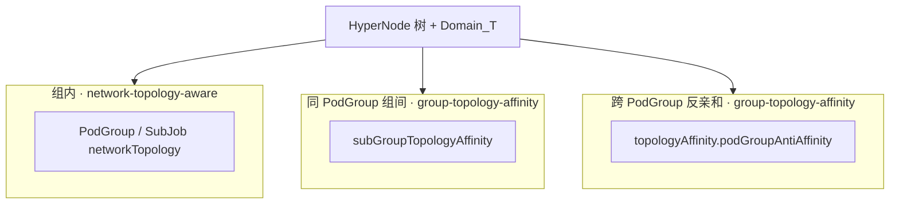

## 范围

### 目标内

- **PodGroup API**（作用域分离）：
  - `topologyAffinity.podGroupAntiAffinity`：**跨 PodGroup 反亲和**（`topologyGroup` / `podGroupSelector`）
  - `subGroupTopologyAffinity`：**同一 PodGroup 内、跨 `subGroupPolicy`（SubJob）** 的亲和与反亲和；**不**跨 PodGroup
- **插件**：`group-topology-affinity`（组间 hard gradient + soft order）+ 现有 `network-topology-aware`（组内 Gang / binpack）
- **Framework**：拓扑类 `HyperNodeGradient` 多插件 **集合交集 + 按 tier 重分层**（不含资源判断）
- **allocate**：`filterGradientsByMinResource`（与 `HyperNodeGradientFor*Fn` 解耦）
- **Admission Webhook** 校验
- **Phase 1**：hard（`required` → gradient 剪枝）+ soft（`preferred` + `weight` → order 打分）

### 目标外

| 项 | 说明 |
|----|------|
| 组内 Gang / 不跨 tier | 继续由 `PodGroupSpec.networkTopology`、`subGroupPolicy[].networkTopology` + network-topology-aware 承担 |
| SubJob 内逐 Pod spread | 使用组内 `networkTopology` 或 K8s Pod 拓扑，不在此设计扩展 |
| 跨 Namespace 的 SubGroup 对等 | 不支持 |
| 用 `topologyGroup` 表达同 PodGroup 内 prefill/decode | 应使用 `subGroupTopologyAffinity` |
| `preempt` / `backfill` 拓扑一致 | Phase 2+ |
| Batch Job API 与 `PartitionPolicy` 同步 | Phase 2+，可后续同路径接入 |
| PodGroup `TopologyUnsatisfiable` Condition | Phase 2（可选，见 [Status](#status-optional)） |
| **跨 PodGroup 亲和** `topologyAffinity.podGroupAffinity` | **不做**（无场景；共域用 `PodGroupSpec.networkTopology` 或 `subGroupAffinity`，见下节） |

### 跨 PodGroup：仅反亲和

| 能力 | Phase 1 | 说明 |
|------|---------|------|
| `topologyAffinity.podGroupAntiAffinity`（hard / soft） | **做** | 多 inference instance 等于不同 `Domain_T`（实例 2、5）；`TopologyOccupancyIndex` + Job 级 gradient |
| `topologyAffinity.podGroupAffinity` | **不做** | 见下文「为何不做跨 PodGroup 亲和」；CRD 字段保留、Webhook 拒绝写入 |
| `subGroupTopologyAffinity`（含 `subGroupAffinity`） | **做** | **仅同 PodGroup 内**；跨 PodGroup 共域 **不** 经 `topologyAffinity` |

#### 为何要做跨 PodGroup **反亲和**

**1. 有明确、可验证的生产场景**

- **实例 2 / 5**：同一模型（`topologyGroup` 相同）部署 **多个 inference instance**（多个 PodGroup），业务要求是 **故障域隔离**——任意 **单个超节点（或指定 tier）故障** 至多影响一个 instance，其余 instance 继续 serving。
- 这是 **「刻意拆开」** 诉求：在 `separationTier` 上要求 `Domain_T(本 PodGroup) ≠ Domain_T(已放置的 peer PodGroup)`，无法用组内 `networkTopology` 表达（组内 API 只约束 **一个** PodGroup 内部的 Pod/SubJob，不管其它 PodGroup）。
- 若仅靠运维手工把 instance 分到不同节点池/集群，调度器无法在 **Gang + 多级 HyperNode** 语义下 **声明式保证** 互斥，扩容新 instance 时也容易与已有 instance **撞域**。

**2. 与现有能力正交、且竞品普遍缺失**

- K8s Pod topology spread、Kueue TAS、Koordinator gather 等多为 **单工作组共域** 或 **Pod 级打散**，缺少「**多个 PodGroup 在 HyperNode 某 tier 上 hard 互斥**」的一等 API（见 [#竞品与标准对齐](#竞品与标准对齐)）。
- Volcano 用 `topologyGroup` + `podGroupAntiAffinity.required` 补齐该缺口，与 **同 PodGroup 内** `subGroupTopologyAffinity`（实例 4 Prefill-Decode）分工清晰。

**3. 实现成本可接受且边界清楚**

- 反亲和需要 `TopologyOccupancyIndex`（Session 内记录已占用 `Domain_T`）+ Job 级 `HyperNodeGradientForJobFn` 剪枝，成本 **高于** 仅 SubJob 路径，但 **只服务「互斥」一种谓词**，索引语义单一：「该 tier 上哪些域已被某 PodGroup 占用」。
- Phase 1 接受该成本，因为 **有实例 2/5 的硬需求**；preempt/backfill 与索引一致性放在 Phase 2+。

#### 为何不做跨 PodGroup **亲和**

**1. 当前无独立产品场景（共域已有更合适的 API）**

「跨 PodGroup 亲和」语义是：强制 **多个 PodGroup** 在某一 `separationTier` 上落在 **同一** `Domain_T`（例如两个 instance **必须** 挤在同一 supernode）。这与生产中的典型布局 **相反**，且与下列 **已有、更贴切** 的表达方式重复：

| 真实诉求 | 正确 API | 为何不用 `podGroupAffinity` |
|----------|----------|------------------------------|
| **一个** inference instance 整体不跨 supernode | `PodGroupSpec.networkTopology`（实例 4 方式一） | 作用域是 **本 PodGroup 内** 全部 workload，无需引用其它 PodGroup |
| 同一 instance 内 prefill + decode 共超节点 | `subGroupAffinity` 或 `networkTopology`（实例 4） | 关系在 **同 PodGroup、跨 SubGroup**，不是跨 PodGroup |
| 多个 Pod 副本共 rack（无多 PodGroup） | `subGroupPolicy[].networkTopology` + NTA | 组内 Gang，非 PodGroup 间关系 |
| 希望两个 **独立** instance 「尽量靠近」 | 无硬需求 | 属优化项；若未来需要可用 **soft** 反亲和的反面或运维 colocation，不构成 Phase 1 硬约束 |

历史上 **没有**「必须把两个独立 PodGroup 绑在同一 supernode 才能跑」的立项场景；若出现，应优先评估是否实为 **一个 PodGroup**（合并 instance）或 **同 PodGroup 的 subGroupAffinity**，而不是引入跨 PodGroup 共域。

**2. API 语义易混淆，增加误配与测试面**

- 容器名 `topologyAffinity` 同时挂 `podGroupAffinity` / `podGroupAntiAffinity` 时，用户易与 **`subGroupAffinity`（同 PodGroup 内共域）** 混淆，或误以为 `topologyGroup` 表示「多 PodGroup 共域」——而 `topologyGroup` 在 Phase 1 的设计意图是 **反亲和分组键**（实例 2：同组内 instance **互斥**）。
- 跨 PodGroup **共域** 与 **异域** 在调度器内部会走不同推理（共域需「与 peer 同域」、异域需「避开 peer 域」），实现两条路径但仅一条有需求，不利于 Phase 1 收敛。

**3. 实现与性能：不做亲和并不能省掉反亲和成本，但可避免无效扩张**

- **不做** `podGroupAffinity` **不会** 取消 `TopologyOccupancyIndex` / Job 级 gradient——反亲和仍需要它们。
- 若实现跨 PodGroup **亲和**，通常还需：共域 peer 已放置时的 **等待/顺序**、与反亲和同时配置时的 **冲突检测**、多 PodGroup **clique 共域**（N 个 PodGroup 同域）等，复杂度和 Session 状态维护 **不低于** 反亲和，却 **无对应场景** 验收。
- 因此 Phase 1 **刻意** 只实现 `podGroupAntiAffinity`；`podGroupAffinity` 在 CRD 中 **保留字段** 便于将来 additive 扩展，Webhook **拒绝非空**，避免用户误用。

#### 小结

```text
跨 PodGroup 拓扑：
  反亲和（podGroupAntiAffinity）→ 做：多 instance 故障域（实例 2/5），有场景、有索引、有 Job 级 gradient
  亲和（podGroupAffinity）     → 不做：无独立场景，共域由 networkTopology / subGroupAffinity 覆盖，且易混淆
同 PodGroup 内：
  subGroupAffinity + subGroupAntiAffinity → 做：Prefill-Decode 等（实例 4/6/7）
```

> 若后续出现「多 PodGroup 必须共域」的 **已落地** 业务（且无法合并为单 PodGroup），再以 **Phase 2+ additive** 方式实现 `podGroupAffinity`，并复用同一 `TopologyOccupancyIndex` 的共域查询路径；**不改变** Phase 1 反亲和语义。

# 分离层级：separationTierName 与 separationTier（tier 整数）

组间拓扑 term（`topologyAffinity` / `subGroupTopologyAffinity`）与组内 `networkTopology` 一样，在 HyperNode 树上指定 **在哪一层** 比较 `Domain_T`。每个 term 的 `TopologySeparationSpec` **必须二选一、不可同时填写**：

| 写法 | PodGroup 字段 | 对齐 HyperNode CR | 组内等价字段（域内 Gang） |
|------|---------------|-------------------|---------------------------|
| **字符串（tierName）** | `separationTierName: supernode` | `spec.tierName` | `highestTierName: supernode` |
| **整数（tier）** | `separationTier: 2` | `spec.tier` | `highestTierAllowed: 2` |

**示例集群约定（下文实例常用；以 `kubectl get hypernodes` 为准）：**

| 物理层 | `spec.tierName` | `spec.tier`（示例） |
|--------|-----------------|---------------------|
| 超节点 | `supernode` | `2` |
| 机柜 | `cabinet` | `1` |

**等价 YAML（跨 PodGroup 反亲和 @ 超节点，二选一）：**

```yaml
topologyAffinity:
  podGroupAntiAffinity:
    requiredDuringSchedulingIgnoredDuringExecution:
      # 写法 A：tierName（运维推荐）
      - topologyGroup: llama-70b-serving
        separationTierName: supernode
      # 写法 B：tier 整数（模板/控制器生成）
      # - topologyGroup: llama-70b-serving
      #   separationTier: 2
```

```yaml
subGroupTopologyAffinity:
  subGroupAntiAffinity:
    requiredDuringSchedulingIgnoredDuringExecution:
      # 写法 A
      - subGroupSelector:
          matchSubGroupPolicyNames: [prefill]
        antiSubGroupSelector:
          matchSubGroupPolicyNames: [prefill]
        separationTierName: cabinet
      # 写法 B（当 cabinet 对应 spec.tier == 1）
      # - subGroupSelector: { matchSubGroupPolicyNames: [prefill] }
      #   antiSubGroupSelector: { matchSubGroupPolicyNames: [prefill] }
      #   separationTier: 1
```

**规则摘要：**

- 同一 `TopologySeparationSpec` 内 **`separationTierName` 与 `separationTier` 互斥**；Webhook 校验 name 存在于 `HyperNodeTierNameMap`、整数存在于 `HyperNodeTierSet`。
- **推荐**：人工运维、多集群对齐用 **tierName**；由 tier 序号驱动的 Helm/Operator 用 **tier 整数**。
- 下文 **用户场景** YAML 为可读性多写 **tierName**；与 **`separationTier: <int>`** 等价关系见下表；HyperNode CR 示例、Domain_T 解析、填写步骤见 [API Design — HyperNode 层级](#hypernode-层级与-separationtier--separationtiername)。

| 业务说法 | `separationTierName` | `separationTier`（示例） | 常用 API |
|----------|----------------------|--------------------------|----------|
| 多 instance 不占同一超节点 | `supernode` | `2` | `topologyAffinity.podGroupAntiAffinity` |
| 分片彼此分机柜 | `cabinet` | `1` | `subGroupTopologyAffinity.subGroupAntiAffinity` |
| 整机共超节点（组内） | `highestTierName: supernode` | `highestTierAllowed: 2` | `PodGroupSpec.networkTopology` |

调度器在 Session 内维护 **`HyperNodeTierNameMap`**（`tierName → tier`）与 **`HyperNodeTierSet`**（集群出现过的 `spec.tier` 集合）；`network-topology-aware` 与 `group-topology-affinity` **共用** 上述映射，保证 `separationTierName: supernode` 与 `separationTier: 2`（当 supernode 对应 `spec.tier==2`）指向 **同一物理层**。

# 用户场景与能力对照

本章按 **场景 → 业务价值 → 配置能力 → HyperNode 调度结果** 组织，便于对照选型。所有图示使用同一套 **多级 HyperNode 树**（与集群 CR 一致；`tierName` 以实际为准，下文用 `supernode` / `cabinet` 作示例）。

## 三类能力与作用域

| 能力 | 配置位置 | 作用域 | 解决什么问题 |
|------|----------|--------|--------------|
| Job / PodGroup 级域内聚合 | `PodGroupSpec.networkTopology` | **整个 PodGroup（Job）** | 全 Job 不跨越某 tier（如共 **一个 supernode**） |
| SubJob 内 Gang | `subGroupPolicy[].networkTopology` | 同一 SubJob 内 Pod | 一组 Pod **聚在** 某层拓扑域（如单机柜） |
| 组间互斥 / 共域（同 PodGroup） | `subGroupTopologyAffinity` | 不同 `subGroupPolicy` 拆出的 SubJob 之间 | 分片 **互斥**、角色间 **共域**（见实例 4） |
| 跨 PodGroup | `topologyAffinity.podGroupAntiAffinity` | 不同 PodGroup（多 instance） | 多副本服务 **故障域** 隔离 |

> **分离层级双写法：** `separationTierName` ↔ `spec.tierName`，**或** `separationTier` ↔ `spec.tier` **整数**（二选一、互斥）。下文 YAML 示例多写 **tierName**；同一语义可用 **tier 整数**（示例：`supernode`↔`2`，`cabinet`↔`1`），见上一章 [#分离层级](#分离层级separationtiername-与-separationtier-tier-整数) 与 [API — HyperNode 层级](#hypernode-层级与-separationtier--separationtiername)。

## 如何阅读调度结果图

图中 **方框 = HyperNode**（按 `tierName` 分层），**最底层 = Node / Pod**；**虚线框 = 同一 `Domain_T`**（在该 tier 上被视为同一调度域）。

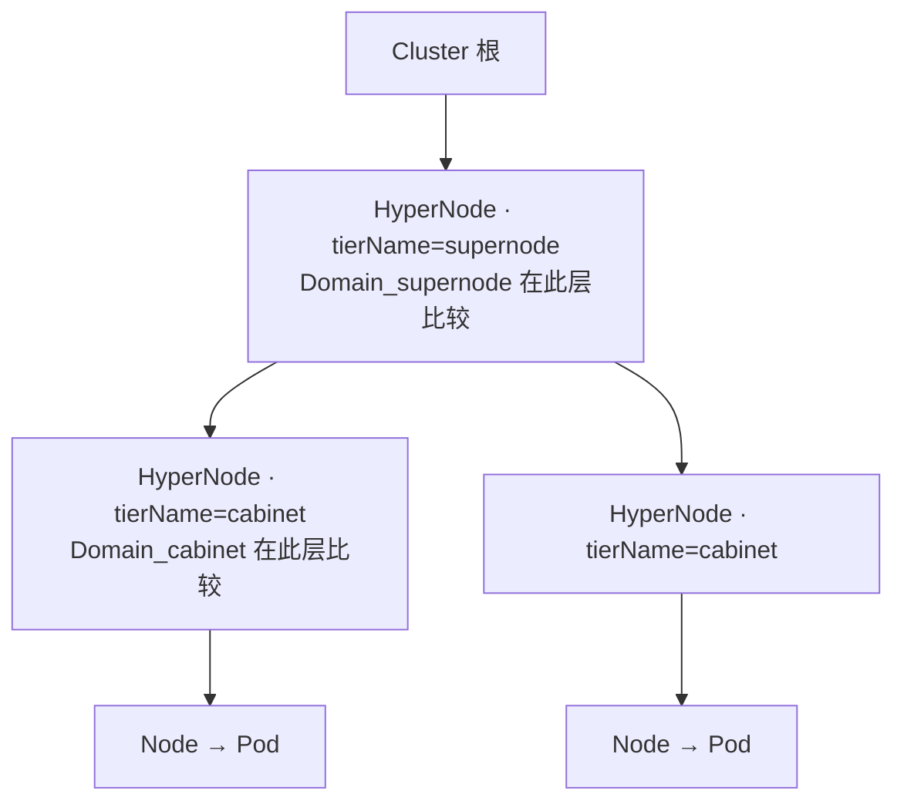

**图例：**

| 符号 | 含义 |
|------|------|
| 同色 cabinet 下多个 Pod | 组内 Gang（`networkTopology`） |
| 多个 cabinet 同属一个 supernode | 见 [实例 4](#实例-4分布式-prefill-decode-推理推荐)（方式一或方式二） |
| 同一 supernode 下不同 cabinet | `subGroupAntiAffinity` @ cabinet（policy 内分片互斥） |
| 两个 supernode 各放一个 PodGroup | `podGroupAntiAffinity` @ supernode（跨 instance） |

## 场景总览

| 编号 | 场景 | 业务价值 | 使用能力 | 默认推荐 |
|------|------|----------|----------|----------|
| [实例 1](#实例-1训练-job组内-gang) | 训练 / 同步训练 Worker Gang | 机内/柜内 NVLink 或高带宽域训练 | 仅 `networkTopology` | 训练默认 |
| [实例 2](#实例-2多-inference-instance故障隔离) | 多推理 instance 并行 | 单超节点故障不拖垮全部在线副本 | `podGroupAntiAffinity` | 多副本 serving |
| [实例 3](#实例-3单模板在线推理) | 无 Prefill-Decode 拆分 | 配置简单、整组 Gang | 仅 `networkTopology` | 小模型推理 |
| [实例 4](#实例-4分布式-prefill-decode-推理推荐) | 4×prefill + 2×decode 分片 | 分片故障隔离 + Prefill-Decode 低延迟（共超节点） | `subGroupPolicy` + `matchLabelKeys` + 分片反亲和；共超节点二选一（见实例 4） | **Prefill-Decode 生产默认** |
| [实例 5](#实例-5多-instance--pd-组合) | 实例 4 + 多 instance | 容量扩展 + 双层故障域 | `podGroupAntiAffinity` + 实例 4 | 生产全栈 |
| [实例 6](#实例-6可选prefill-与-decode-跨角色分机柜) | prefill 与 decode 强制分柜 | 角色级资源/故障硬隔离（牺牲局部性） | 跨 policy `subGroupAntiAffinity` | **仅特殊需求** |
| [实例 7](#实例-7subgroup-软性反亲和可选) | Prefill-Decode 分片 **尽量** 分机柜 | 资源紧时仍可调度 | `subGroupAntiAffinity.preferred` + `weight` | 非关键 SLO |

**不推荐作为 Prefill-Decode 默认：** prefill 与 decode **跨角色分机柜**（实例 6）——与「共超节点、降低 Prefill-Decode 通信代价」通常相反；**推荐** policy 内 prefill↔prefill、decode↔decode 分机柜（实例 4）。

---

## 场景实例

> 每个实例包含：**场景与价值** → **配置要点** → **调度结果（HyperNode 树）** → **与其它实例差异**。  
> **层级双写法（示例集群）：** `supernode` ↔ `spec.tier: 2`，`cabinet` ↔ `spec.tier: 1`。下文 YAML 在 `highestTierName` / `separationTierName` 旁用注释标出等价的 **`highestTierAllowed` / `separationTier` 整数**（二选一，勿同时启用）。

### 实例 1：训练 Job — 组内 Gang

**场景：** 单 PodGroup，多 Worker（如 4 组 × 8 GPU）在同一训练 Job 内 Gang 调度。  
**业务价值：** 同 SubJob 内 Pod 落在 **同一机柜（或更低 tier）**，提高机内/柜内通信带宽，满足 AllReduce 等集合通信。  
**能力：** `networkTopology`（**不**使用 `topologyAffinity` / `subGroupTopologyAffinity`）。

| 配置选择 | 适用 |
|----------|------|
| `subGroupPolicy[].networkTopology` @ cabinet | 多 SubJob / 分区，每区 8 Pod 聚柜 |
| `PodGroupSpec.networkTopology` @ supernode | 整 Job 共超节点（无分片互斥时） |

```yaml
spec:
  minMember: 32
  # 可选：整 Job 不跨 supernode
  # networkTopology: { mode: hard, highestTierName: supernode }
  # 或：networkTopology: { mode: hard, highestTierAllowed: 2 }
  subGroupPolicy:
    - name: workers
      subGroupSize: 8
      networkTopology:
        mode: hard
        highestTierName: cabinet
        # highestTierAllowed: 1   # 与 highestTierName: cabinet 二选一
```

**调度结果（HyperNode 树）：** 每个 SubJob（8 Pod）占 **一个** cabinet，组内 Pod 不跨柜。

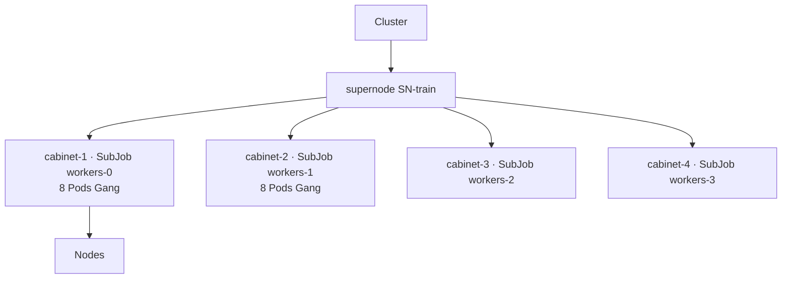

**差异：** 无组间拓扑 API；若需多 Job 互斥，另见实例 2。

---

### 实例 2：多 inference instance — 故障隔离

**场景：** 同一模型 `llama-70b` 起 3 个 PodGroup（instance-0/1/2），同时 serving。  
**业务价值：** 任意 **单个超节点故障** 只影响一个 instance，其余 instance 仍可服务。  
**能力：** `topologyAffinity.podGroupAntiAffinity` @ `supernode` + `topologyGroup` label。

```yaml
metadata:
  labels:
    volcano.sh/topology-group: llama-70b-serving
spec:
  topologyAffinity:
    podGroupAntiAffinity:
      requiredDuringSchedulingIgnoredDuringExecution:
        - topologyGroup: llama-70b-serving
          separationTierName: supernode
          # separationTier: 2   # 与 separationTierName: supernode 二选一
```

**调度结果（HyperNode 树）：** 比较在 **PodGroup 级** `Domain_supernode`；三个 instance 落在 **三个不同** supernode。

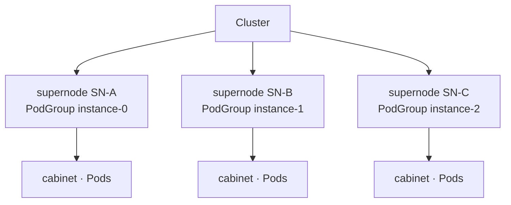

**差异：** 约束 **PodGroup 之间**；instance 内 Prefill-Decode 拓扑见实例 4。

---

### 实例 3：单模板在线推理

**场景：** 一种 Pod 模板，无 prefill/decode 拆分，整组副本 Gang。  
**业务价值：** 配置成本最低；适合无 PD、无分片的在线推理。  
**能力：** `PodGroupSpec.networkTopology` 和/或 `subGroupPolicy[].networkTopology`（二选一或组合）。

```yaml
spec:
  minMember: 8
  networkTopology:
    mode: hard
    highestTierName: cabinet
    # highestTierAllowed: 1   # 与 highestTierName: cabinet 二选一
  # 或 subGroupPolicy:
  #   - name: infer
  #     subGroupSize: 8
  #     networkTopology: { mode: hard, highestTierName: cabinet }
  #     # networkTopology: { mode: hard, highestTierAllowed: 1 }
```

**调度结果（HyperNode 树）：**

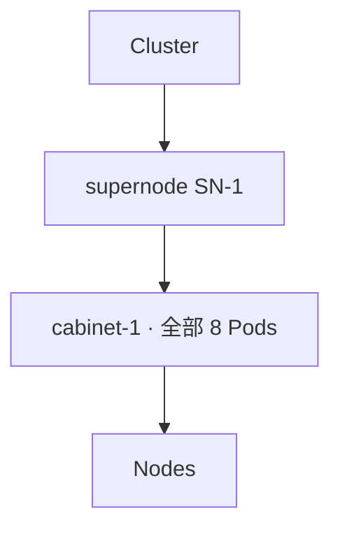

**差异：** 仅 1 条 policy 且无组间诉求时，**不要**配 `subGroupTopologyAffinity`。

---

### 实例 4：分布式 Prefill-Decode 推理（推荐）

**场景：** 一个 inference instance：4 个 prefill 分片（各 8 Pod）+ 2 个 decode 分片（各 6 Pod）；用 **`prefill` / `decode` 两条 `subGroupPolicy`** + **`matchLabelKeys`** 表达分片，**不要**为每个分片单独建 policy 名（不写 `prefill-0` 等）。

**业务目标（两种方式一致）：**

| 约束 | 对业务的意义 |
|------|----------------|
| 同角色各分片 **不同机柜** | 单柜故障不会打掉全部 prefill 或全部 decode |
| prefill + decode **落在同一超节点** | Prefill-Decode 跨阶段流量尽量在超节点内，降低时延 |
| prefill 与 decode **不强制分机柜** | 允许某 decode 与某 prefill 同柜，调度更灵活 |
| 每个分片内 Pod **同柜 Gang** | 分片内 8/6 Pod 仍走高速域 |

**共同配置（两种方式都要写）：** `subGroupPolicy`（含 `matchLabelKeys`、组内 `networkTopology` @ cabinet）+ **`subGroupAntiAffinity`**（prefill↔prefill、decode↔decode 分机柜）。  
**仅「共超节点」的写法二选一**（见下）。

---

#### 方式一：在 PodGroup 上声明「整个推理实例共超节点」

适合：按 **instance / PodGroup** 管理资源域，希望顶层 YAML 一眼看出「这一副本不跨超节点」。

```yaml
spec:
  minMember: 44
  networkTopology:
    mode: hard
    highestTierName: supernode
    # highestTierAllowed: 2   # 与 highestTierName: supernode 二选一
  subGroupPolicy:
    - name: prefill
      labelSelector:
        matchLabels: { volcano.sh/role: prefill }
      matchLabelKeys: [volcano.sh/shard-id]
      subGroupSize: 8
      minSubGroups: 4
      networkTopology: { mode: hard, highestTierName: cabinet }
      # networkTopology: { mode: hard, highestTierAllowed: 1 }
    - name: decode
      labelSelector:
        matchLabels: { volcano.sh/role: decode }
      matchLabelKeys: [volcano.sh/shard-id]
      subGroupSize: 6
      minSubGroups: 2
      networkTopology: { mode: hard, highestTierName: cabinet }
      # networkTopology: { mode: hard, highestTierAllowed: 1 }
  subGroupTopologyAffinity:
    subGroupAntiAffinity:
      requiredDuringSchedulingIgnoredDuringExecution:
        - subGroupSelector:
            matchSubGroupPolicyNames: [prefill]
          antiSubGroupSelector:
            matchSubGroupPolicyNames: [prefill]
          separationTierName: cabinet
          # separationTier: 1
        - subGroupSelector:
            matchSubGroupPolicyNames: [decode]
          antiSubGroupSelector:
            matchSubGroupPolicyNames: [decode]
          separationTierName: cabinet
          # separationTier: 1
```

---

#### 方式二：在组间拓扑里声明「prefill 与 decode 共超节点」

适合：习惯在 **`subGroupTopologyAffinity`** 里集中写 Prefill-Decode 的 **角色间关系**（分片互斥 + 共超节点都在同一节）。

```yaml
spec:
  minMember: 44
  subGroupPolicy:
    - name: prefill
      labelSelector:
        matchLabels: { volcano.sh/role: prefill }
      matchLabelKeys: [volcano.sh/shard-id]
      subGroupSize: 8
      minSubGroups: 4
      networkTopology: { mode: hard, highestTierName: cabinet }
      # networkTopology: { mode: hard, highestTierAllowed: 1 }
    - name: decode
      labelSelector:
        matchLabels: { volcano.sh/role: decode }
      matchLabelKeys: [volcano.sh/shard-id]
      subGroupSize: 6
      minSubGroups: 2
      networkTopology: { mode: hard, highestTierName: cabinet }
      # networkTopology: { mode: hard, highestTierAllowed: 1 }
  subGroupTopologyAffinity:
    subGroupAffinity:
      requiredDuringSchedulingIgnoredDuringExecution:
        - matchSubGroupPolicyNames: [prefill, decode]
          separationTierName: supernode
          # separationTier: 2
    subGroupAntiAffinity:
      requiredDuringSchedulingIgnoredDuringExecution:
        - subGroupSelector:
            matchSubGroupPolicyNames: [prefill]
          antiSubGroupSelector:
            matchSubGroupPolicyNames: [prefill]
          separationTierName: cabinet
          # separationTier: 1
        - subGroupSelector:
            matchSubGroupPolicyNames: [decode]
          antiSubGroupSelector:
            matchSubGroupPolicyNames: [decode]
          separationTierName: cabinet
          # separationTier: 1
```

---

#### 两种方式：业务上的相同点与不同点

| | 说明 |
|---|------|
| **相同点** | 目标拓扑一致：6 个分片占 6 个机柜，且 **同属一个超节点**；分片内 Gang、分片间互斥、prefill/decode 不强制分柜；**分片互斥与组内同柜的 YAML 完全相同**，与「共超节点」写法无关（见下图）。 |
| **不同点 · 配置意图** | **方式一**：整份 PodGroup（推理 instance）不跨超节点。**方式二**：仅 `matchSubGroupPolicyNames` 点名的 policy（本例 prefill + decode）共超节点。 |
| **不同点 · 适用范围** | **方式一** 约束 **本 PodGroup 内全部 workload**（若以后在同一 PodGroup 里增加其它 `subGroupPolicy`，默认也受「整实例不跨超节点」约束）。**方式二** 只约束 affinity term 里点名的 policy（本例为 `[prefill, decode]`）；未写进 term 的其它 policy **不受这条共超节点约束**。 |
| **不同点 · 配置习惯** | **方式一** 共超节点写在 `spec` 顶层，与实例 3 等「整组 Gang」风格一致。**方式二** 共超节点与分片互斥同在 `subGroupTopologyAffinity`，便于只维护一块「组间规则」。 |
| **选用建议** | 本场景仅 prefill/decode、且希望表达 **整实例边界** 时，**更推荐方式一**；若团队规范要求所有组间拓扑只写在 `subGroupTopologyAffinity`，可用 **方式二**，但 **不要与方式一重复配置** 同一超节点约束。 |

**预期部署形态（两种方式相同）：**

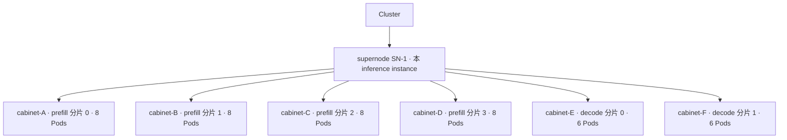

| 在集群里看到 | 配置含义 |
|--------------|----------|
| 每个机柜内 8 或 6 个 Pod | 各 `subGroupPolicy.networkTopology` @ cabinet（分片内 Gang） |
| 4 个 prefill 机柜互不相同 | `subGroupAntiAffinity`：两侧均为 `[prefill]` |
| 2 个 decode 机柜互不相同 | `subGroupAntiAffinity`：两侧均为 `[decode]` |
| 全部在 SN-1 下 | 方式一：`PodGroup.networkTopology`；方式二：`subGroupAffinity` `[prefill, decode]` @ supernode |
| decode 可与某 prefill 同柜 | **未配置** prefill 与 decode 之间的分机柜规则 |

**填写提醒：** `matchSubGroupPolicyNames` 只写 policy 名 **`prefill` / `decode`**，不要写 `prefill-0` 等分片后缀。

---

### 实例 5：多 instance + Prefill-Decode 组合

**场景：** 实例 4 × N 个 PodGroup。  
**业务价值：** 外层超节点故障隔离 + 内层分片机柜隔离与共超节点 PD。  
**能力：** `topologyAffinity.podGroupAntiAffinity` + 实例 4 全部配置。

```yaml
metadata:
  labels:
    volcano.sh/topology-group: llama-70b-serving
spec:
  topologyAffinity:
    podGroupAntiAffinity:
      requiredDuringSchedulingIgnoredDuringExecution:
        - topologyGroup: llama-70b-serving
          separationTierName: supernode
          # separationTier: 2
  # subGroupPolicy + 共超节点 + subGroupAntiAffinity：同实例 4（推荐方式一）
  # 组内/组间 tier 整数注释见实例 4
```

**调度结果（HyperNode 树）：**

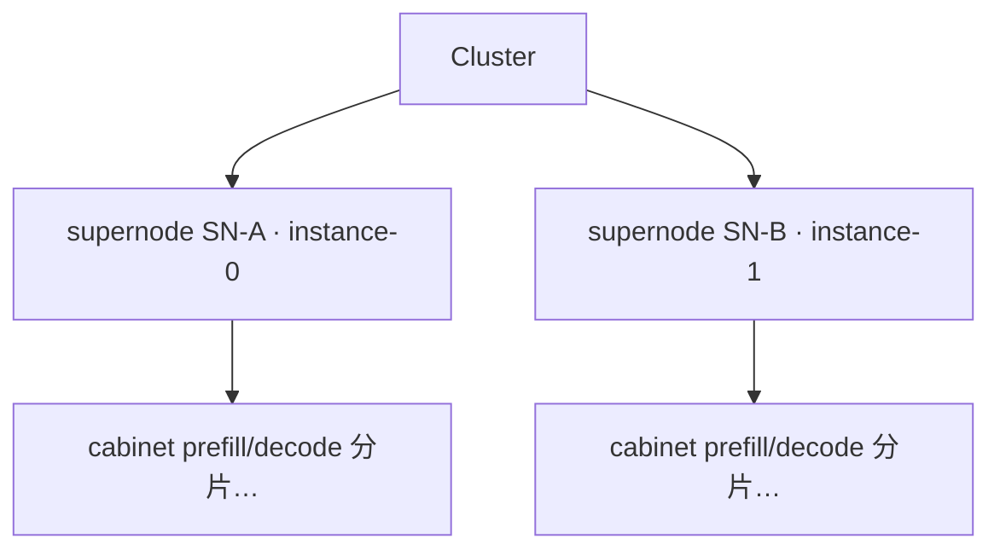

**差异：** `podGroupAntiAffinity` 保证 SN-A ≠ SN-B；**每个 supernode 内部** 复现实例 4 的六柜结构。

---

### 实例 6（可选）：prefill 与 decode **跨角色** 分机柜

**场景：** 在实例 4 之外，强制 prefill 柜组与 decode 柜组 **不相交**。  
**业务价值：** 角色级 GPU/TOR 硬隔离、合规分域；**代价**是跨角色通信更易跨柜。  
**何时用：** 运维明确要求；**非 Prefill-Decode 默认**（与降低 Prefill-Decode 延迟常冲突）。  
**能力：** 共 supernode 配置同 [实例 4](#实例-4分布式-prefill-decode-推理推荐)；另增跨角色 `subGroupAntiAffinity`（prefill vs decode 分机柜）。

```yaml
spec:
  networkTopology:
    mode: hard
    highestTierName: supernode
    # highestTierAllowed: 2
  subGroupTopologyAffinity:
    subGroupAntiAffinity:
      requiredDuringSchedulingIgnoredDuringExecution:
        - subGroupSelector:
            matchSubGroupPolicyNames: [prefill]
          antiSubGroupSelector:
            matchSubGroupPolicyNames: [decode]
          separationTierName: cabinet
          # separationTier: 1
  # 分片互斥、组内 @ cabinet 等同实例 4，省略
```

**调度结果对比（HyperNode 树）：**

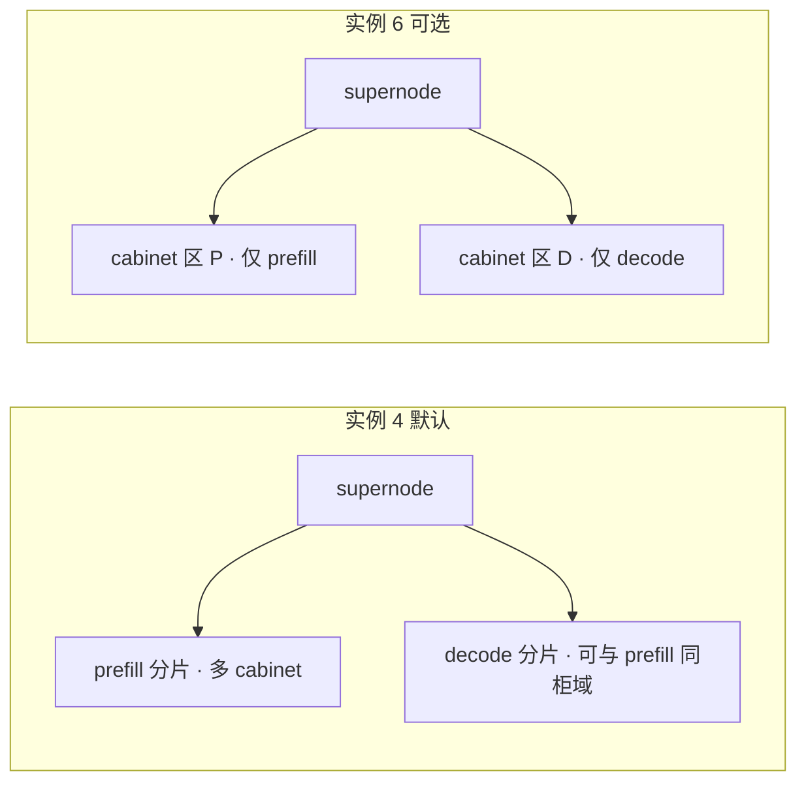

**差异：** 实例 6 **叠加**在实例 4 上；多数部署仅保留 policy 内 `[prefill]` / `[decode]` 互斥即可。

---

### 实例 7：SubGroup 软性反亲和（可选）

**场景：** 与 [实例 4](#实例-4分布式-prefill-decode-推理推荐) 相同的 4 Prefill 分片 + 2 Decode 分片 Prefill-Decode 布局，但机柜资源紧张：希望 prefill / decode **各分片尽量落在不同机柜**，**若做不到也不要阻塞调度**。  
**业务价值：** 在故障隔离与上线率之间折中——有柜可分时仍打散分片；无柜可分时允许临时同柜，避免 PodGroup 长期 Pending。

#### 与实例 4（`required` 反亲和）的对比

| | 实例 4（`requiredDuringSchedulingIgnoredDuringExecution`） | 实例 7（`preferredDuringSchedulingIgnoredDuringExecution` + `weight`） |
|---|-------------------------------------|--------------------------------------|
| **业务语义** | 分片 **必须** 分机柜，否则不满足 | 分片 **优先** 分机柜，不满足仍可调度 |
| **适用** | 生产默认、SLO 要求分片级故障域 | 灰度、扩容、机柜余量不足、非关键批推理 |
| **共超节点** | 仍建议方式一 `PodGroup.networkTopology` @ supernode（与实例 4 相同） | 同左 |

#### 配置示例

在实例 4 **方式一** 基础上，将 `subGroupAntiAffinity` 的 `required` 改为 `preferred`，并为 term 设置 `weight`（越大表示「避开同柜」的偏好越强）：

```yaml
spec:
  minMember: 44
  networkTopology:
    mode: hard
    highestTierName: supernode
    # highestTierAllowed: 2
  subGroupPolicy:
    - name: prefill
      labelSelector:
        matchLabels: { volcano.sh/role: prefill }
      matchLabelKeys: [volcano.sh/shard-id]
      subGroupSize: 8
      minSubGroups: 4
      networkTopology: { mode: hard, highestTierName: cabinet }
      # networkTopology: { mode: hard, highestTierAllowed: 1 }
    - name: decode
      labelSelector:
        matchLabels: { volcano.sh/role: decode }
      matchLabelKeys: [volcano.sh/shard-id]
      subGroupSize: 6
      minSubGroups: 2
      networkTopology: { mode: hard, highestTierName: cabinet }
      # networkTopology: { mode: hard, highestTierAllowed: 1 }
  subGroupTopologyAffinity:
    subGroupAntiAffinity:
      preferredDuringSchedulingIgnoredDuringExecution:
        - weight: 100
          term:
            subGroupSelector:
              matchSubGroupPolicyNames: [prefill]
            antiSubGroupSelector:
              matchSubGroupPolicyNames: [prefill]
            separationTierName: cabinet
            # separationTier: 1
        - weight: 100
          term:
            subGroupSelector:
              matchSubGroupPolicyNames: [decode]
            antiSubGroupSelector:
              matchSubGroupPolicyNames: [decode]
            separationTierName: cabinet
            # separationTier: 1
```

> **说明：** 软性反亲和 **仅** 通过 `preferredDuringSchedulingIgnoredDuringExecution` + `weight` 表达，**不要** 在 term 上再写 `mode: soft`（与 `required`/`preferred` 重复）。`term` 内只需 `subGroupSelector`、`antiSubGroupSelector`、`separationTierName`（或 `separationTier`）。

#### 预期行为（业务视角）

| 集群状况 | 典型结果 |
|----------|----------|
| 超节点内 **≥6 个可用机柜** | 与实例 4 相近：6 分片各占一柜（调度器优先选择「与已放置分片不同柜」的候选） |
| 可用机柜 **不足 6 个** | 仍可能调度成功：部分分片 **同柜** 放置，整体得分偏低；不满足 hard 失败条件 |
| 仅要求共超节点 | 由 `networkTopology` @ supernode 保证；soft 反亲和 **不替代** 共超节点 hard 约束 |

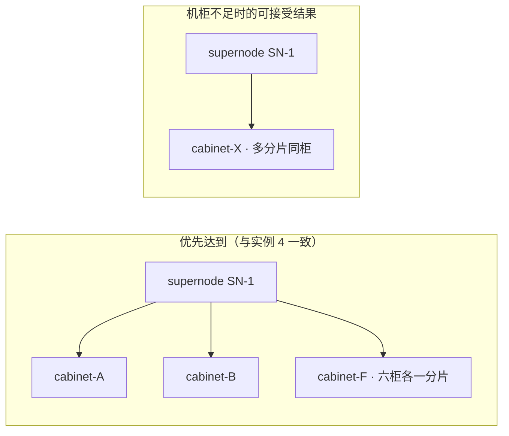

**填写提醒：**

- policy 内互斥：两侧 selector 仍写 **同名** `[prefill]` 或 `[decode]`（与实例 4 相同），**不要**写成 prefill vs decode。
- **勿** 将共超节点改为 soft：Prefill-Decode 低延迟路径通常仍对 supernode 使用 **hard** `networkTopology`（或实例 4 方式二 hard `subGroupAffinity`）。
- 可与 required 类约束 term **混用**（例如 supernode 用 `required` hard，分机柜仅用 `preferred` soft）；Webhook 校验 tier 关系时以 **required** 类 term 为准。

**跨 PodGroup 的 soft 反亲和**（多 instance 尽量分超节点、但不硬失败）可类比为 `topologyAffinity.podGroupAntiAffinity.preferred`，思路与上表相同，场景见 [实例 2](#实例-2多-inference-instance故障隔离)。

---

# API Design

本章定义 PodGroup API 与能力边界。场景 YAML 见 [#用户场景与能力对照](#用户场景与能力对照)；HyperNode 层级填写见 [#hypernode-层级与-separationtier--separationtiername](#hypernode-层级与-separationtier--separationtiername)。

## PodGroupSpec 新增字段

```go
type PodGroupSpec struct {
    // ... existing fields ...

    // TopologyAffinity expresses topology affinity/anti-affinity between THIS PodGroup and OTHER PodGroups
    // (selected by topologyGroup label or podGroupSelector). Evaluated at Job / HyperNodeGradientForJob scope.
    // Does NOT apply to relationships between subGroupPolicy entries within the same PodGroup;
    // use SubGroupTopologyAffinity for that.
    // +optional
    TopologyAffinity *PodGroupTopologyAffinitySpec `json:"topologyAffinity,omitempty"`

    // SubGroupTopologyAffinity expresses topology affinity/anti-affinity between SubGroupPolicies
    // defined in THIS PodGroup's subGroupPolicy list only. Evaluated per SubJob at
    // HyperNodeGradientForSubJob scope; peers are other SubJobs of the same JobInfo (same PodGroup UID).
    // Cannot reference PodGroups in other namespaces or other topologyGroups.
    // Requires subGroupPolicy; ignored (webhook reject) if subGroupPolicy is empty.
    // +optional
    SubGroupTopologyAffinity *SubGroupTopologyAffinitySpec `json:"subGroupTopologyAffinity,omitempty"`
}
```

## 核心类型

```go
// TopologySeparationSpec defines the HyperNode tier used as the separation/comparison boundary.
type TopologySeparationSpec struct {
    // SeparationTier: compare scheduling domains at HyperNode.spec.tier (integer).
    // Must match the numeric tier of a HyperNode layer in this cluster. Mutually exclusive with SeparationTierName.
    // +kubebuilder:validation:Minimum=0
    // +optional
    SeparationTier *int `json:"separationTier,omitempty"`

    // SeparationTierName: compare scheduling domains at HyperNode.spec.tierName (string).
    // The value MUST be identical to tierName configured on HyperNode CRs in the cluster (case-sensitive).
    // Scheduler resolves it via Session HyperNodeTierNameMap (same source as networkTopology.highestTierName).
    // Example: if cabinet HyperNodes use spec.tierName: cabinet, set separationTierName: cabinet here.
    // Mutually exclusive with SeparationTier.
    // +optional
    SeparationTierName string `json:"separationTierName,omitempty"`
    // Note: hard vs soft for topologyAffinity / subGroupTopologyAffinity is NOT expressed here.
    // Use requiredDuringSchedulingIgnoredDuringExecution (hard) vs
    // preferredDuringSchedulingIgnoredDuringExecution (soft), aligned with Kubernetes PodAffinity.
}

// NetworkTopologySpec (PodGroup / SubGroupPolicy): domain aggregation with explicit mode.
// +kubebuilder:validation:Enum=hard;soft
type NetworkTopologySpec struct {
    Mode               NetworkTopologyMode `json:"mode,omitempty"`
    HighestTierName    string              `json:"highestTierName,omitempty"`
    HighestTierAllowed *int                `json:"highestTierAllowed,omitempty"`
}
```

> `TopologySeparationSpec` 的层级字段与 HyperNode CR 的对应关系、填写步骤与示例树，见 [#hypernode-层级与-separationtier--separationtiername](#hypernode-层级与-separationtier--separationtiername)。

### 与 `networkTopology` 的 tier / tierName 对齐

组内 `NetworkTopologySpec` 与组间 `TopologySeparationSpec` 使用 **同一套 HyperNode 层级来源**，仅语义不同（组内「不跨越」vs 组间「在该层比 Domain 相同/不同」）：

| 用途 | 字符串（`spec.tierName`） | 整数（`spec.tier`） | 互斥 |
|------|---------------------------|---------------------|------|
| **组内** Gang / envelope | `networkTopology.highestTierName` | `networkTopology.highestTierAllowed` | 是 |
| **组间** affinity / antiAffinity term | `separationTier.separationTierName` | `separationTier.separationTier` | 是 |

调度器在 Session 内维护 **`HyperNodeTierNameMap`**（`tierName → tier`）与 **`HyperNodeTierSet`**（集群出现过的 `spec.tier` 集合）；`network-topology-aware` 与 `group-topology-affinity` **共用** 上述映射解析层级，保证同一 Job 上 `highestTierName: supernode` 与 `separationTierName: supernode`（或 `highestTierAllowed: 2` 与 `separationTier: 2`）指向 **同一物理层**。

**推荐：** 与现有 NTA 文档一致，运维侧优先 **`tierName`**（跨集群对照表友好）；自动化/模板生成可用 **`tier` 整数**（与 CR 中 `spec.tier` 一一对应，不依赖字符串命名）。

### `required` / `preferred` 与 `mode`（不重复）

| API | 如何表达 hard / soft | 是否在 term 上写 `mode` |
|-----|----------------------|-------------------------|
| `topologyAffinity` / `subGroupTopologyAffinity` | **`requiredDuringSchedulingIgnoredDuringExecution`** = 必须满足（hard）；**`preferredDuringSchedulingIgnoredDuringExecution`** = 尽量满足（soft，`weight` 越大偏好越强） | **否**（与 Kubernetes `PodAffinity` / `PodAntiAffinity` 一致） |
| `PodGroupSpec.networkTopology`、`subGroupPolicy[].networkTopology` | 字段 **`mode: hard \| soft`**（无 required/preferred 列表） | **是**（仅此两类配置使用 `mode`） |

**为何不在 term 上保留 `mode`：** 若同时在 `preferred` 列表里写 `mode: soft`，或在 `required` 里写 `mode: hard`，与列表语义重复，且可能出现 `required` + `mode: soft` 等矛盾。Webhook 对组间拓扑 term **拒绝或忽略** `separationTier` 内的 `mode` 字段。

**实现约定：** `ContainsHardCrossSubGroupTopology` / `ContainsHardCrossPodGroupTopology` 仅看是否存在 **非空 `required`** 列表；`preferred` 条目只注册 `HyperNodeOrderFn`。

### YAML 书写约定

- **组间 term**（`topologyAffinity` / `subGroupTopologyAffinity`）：下文示例为可读性常将 `separationTierName` 或 `separationTier` **与 selector 写在 term 同级**；与 Go 类型等价于嵌套对象 `separationTier: { ... }`，且 **`separationTierName` 与 `separationTier` 互斥**（同 `TopologySeparationSpec`）。
- **组内**（`networkTopology`）：`mode: hard | soft` + `highestTierName` **或** `highestTierAllowed`（互斥），**无** `required` / `preferred` 列表。

**组间 term：名称 vs 数字（等价示例，假设 supernode=`tier: 2`、cabinet=`tier: 1`）**

```yaml
# 跨 PodGroup：写法 A（tierName）与写法 B（tier 整数）二选一，勿同时写
topologyAffinity:
  podGroupAntiAffinity:
    requiredDuringSchedulingIgnoredDuringExecution:
      - topologyGroup: llama-70b-serving
        separationTierName: supernode   # A
        # separationTier: 2             # B（与 A 等价，当 supernode 对应 spec.tier==2）

# 跨 SubGroup：同样支持 separationTierName 或 separationTier
subGroupTopologyAffinity:
  subGroupAntiAffinity:
    requiredDuringSchedulingIgnoredDuringExecution:
      - subGroupSelector:
          matchSubGroupPolicyNames: [prefill]
        antiSubGroupSelector:
          matchSubGroupPolicyNames: [prefill]
        separationTierName: cabinet     # 或 separationTier: 1
```

```go
// PodGroupTopologyAffinitySpec: cross-PodGroup scope only.
type PodGroupTopologyAffinitySpec struct {
    // PodGroupAntiAffinity: Phase 1 — hard/soft anti-affinity vs other PodGroups (topologyGroup / podGroupSelector).
    PodGroupAntiAffinity *TopologyAntiAffinitySpec `json:"podGroupAntiAffinity,omitempty"`

    // PodGroupAffinity: RESERVED — not implemented in Phase 1; webhook MUST reject non-empty value.
    // Cross-PodGroup colocation is not a product requirement; use PodGroupSpec.networkTopology or
    // subGroupTopologyAffinity.subGroupAffinity within a single PodGroup instead.
    // +kubebuilder:validation:Schemaless
    PodGroupAffinity *TopologyAffinitySpec `json:"podGroupAffinity,omitempty"`
}

// SubGroupTopologyAffinitySpec: intra-PodGroup, cross-subGroupPolicy scope only.
type SubGroupTopologyAffinitySpec struct {
    SubGroupAntiAffinity *SubGroupAntiAffinitySpec `json:"subGroupAntiAffinity,omitempty"`
    SubGroupAffinity     *SubGroupAffinitySpec     `json:"subGroupAffinity,omitempty"`
}

// SubGroupAntiAffinitySpec / SubGroupAffinitySpec: term lists for SubGroup peers (not PodGroup selectors).
type SubGroupAntiAffinitySpec struct {
    RequiredDuringSchedulingIgnoredDuringExecution  []SubGroupTopologyAntiAffinityTerm `json:"requiredDuringSchedulingIgnoredDuringExecution,omitempty"`
    PreferredDuringSchedulingIgnoredDuringExecution []WeightedSubGroupTopologyAntiAffinityTerm `json:"preferredDuringSchedulingIgnoredDuringExecution,omitempty"`
}

type SubGroupAffinitySpec struct {
    RequiredDuringSchedulingIgnoredDuringExecution  []SubGroupTopologyAffinityTerm `json:"requiredDuringSchedulingIgnoredDuringExecution,omitempty"`
    PreferredDuringSchedulingIgnoredDuringExecution []WeightedSubGroupTopologyAffinityTerm `json:"preferredDuringSchedulingIgnoredDuringExecution,omitempty"`
}

type TopologyAntiAffinitySpec struct {
    RequiredDuringSchedulingIgnoredDuringExecution  []TopologyAntiAffinityTerm `json:"requiredDuringSchedulingIgnoredDuringExecution,omitempty"`
    PreferredDuringSchedulingIgnoredDuringExecution []WeightedTopologyAntiAffinityTerm `json:"preferredDuringSchedulingIgnoredDuringExecution,omitempty"`
}

type TopologyAffinitySpec struct {
    RequiredDuringSchedulingIgnoredDuringExecution  []TopologyAffinityTerm `json:"requiredDuringSchedulingIgnoredDuringExecution,omitempty"`
    PreferredDuringSchedulingIgnoredDuringExecution []WeightedTopologyAffinityTerm `json:"preferredDuringSchedulingIgnoredDuringExecution,omitempty"`
}

// Cross-PodGroup terms
type TopologyAntiAffinityTerm struct {
    PodGroupSelector    *metav1.LabelSelector `json:"podGroupSelector,omitempty"`
    TopologyGroup       string                `json:"topologyGroup,omitempty"`
    NamespaceSelector   *metav1.LabelSelector `json:"namespaceSelector,omitempty"`
    SeparationTier      TopologySeparationSpec `json:"separationTier"`
}

type TopologyAffinityTerm struct {
    PodGroupSelector  *metav1.LabelSelector `json:"podGroupSelector,omitempty"`
    TopologyGroup     string                `json:"topologyGroup,omitempty"`
    NamespaceSelector *metav1.LabelSelector `json:"namespaceSelector,omitempty"`
    SeparationTier    TopologySeparationSpec `json:"separationTier"`
}

// Cross-SubGroup terms (intra-PodGroup only).
// matchSubGroupPolicyNames ALWAYS refers to subGroupPolicy[].name (policy name), NOT shard suffixes in SubJobID.
type SubGroupTopologyAntiAffinityTerm struct {
    // SubGroupSelector: applies when the SubJob being scheduled belongs to one of these policy names.
    SubGroupSelector SubGroupSelectorSpec `json:"subGroupSelector"`
    // AntiSubGroupSelector: peer SubJobs to compare against (already placed in this PodGroup).
    AntiSubGroupSelector SubGroupSelectorSpec `json:"antiSubGroupSelector"`
    SeparationTier       TopologySeparationSpec `json:"separationTier"`
}

type SubGroupTopologyAffinityTerm struct {
    // MatchSubGroupPolicyNames: policy names (subGroupPolicy[].name). All SubJobs under ANY listed policy
    // must share Domain_T at SeparationTier (e.g. [prefill, decode] @ supernode covers 4+2 SubJobs).
    // Must list >= 2 distinct policy names.
    MatchSubGroupPolicyNames []string `json:"matchSubGroupPolicyNames"`
    SeparationTier           TopologySeparationSpec `json:"separationTier"`
}

// SubGroupSelectorSpec selects SubJobs by policy name (and optional pod labelSelector).
type SubGroupSelectorSpec struct {
    // MatchSubGroupPolicyNames: subGroupPolicy[].name. When matchLabelKeys splits one policy into multiple
    // SubJobs (SubJobID = <JobID>/<name>-<matchValues>), ALL such SubJobs match this selector.
    MatchSubGroupPolicyNames []string `json:"matchSubGroupPolicyNames,omitempty"`
    LabelSelector            *metav1.LabelSelector `json:"labelSelector,omitempty"`
}

type WeightedSubGroupTopologyAntiAffinityTerm struct {
    Weight int32                              `json:"weight"`
    Term   SubGroupTopologyAntiAffinityTerm   `json:"term"`
}

type WeightedSubGroupTopologyAffinityTerm struct {
    Weight int32                            `json:"weight"`
    Term   SubGroupTopologyAffinityTerm    `json:"term"`
}
```

### API 设计取舍：`subGroupSelector` 与 `antiSubGroupSelector` 为何不合并

`subGroupAntiAffinity` 的每条 term 使用 **两个** `SubGroupSelectorSpec`（`subGroupSelector`、`antiSubGroupSelector`），而不是像 `subGroupAffinity` 那样只用一个 `matchSubGroupPolicyNames` 列表。本节说明原因、与亲和的差异，以及曾考虑的替代方案。

#### 调度语义：有向规则，不是「列表内任意两两互斥」

实现上，一条反亲和 term 表达的是：

> 当 **当前待调度** 的 SubJob 属于 `subGroupSelector` 所匹配的 policy 集合时，为其选择的 `Domain_T(separationTier)` 必须与 **本 PodGroup 内已放置**、且属于 `antiSubGroupSelector` 所匹配集合的 **任意 peer SubJob** 的 `Domain_T` **不同**。

因此这是 **subject（谁在调度）→ peer（跟谁比）** 的有向关系；两侧集合可以相同，也可以不同。

| 写法 | subGroupSelector | antiSubGroupSelector | 业务语义 |
|------|------------------|----------------------|----------|
| 实例 4：分片互斥 | `[prefill]` | `[prefill]` | 仅在 **prefill 各 SubJob 之间** 两两分机柜；不涉及 decode |
| 实例 6：跨角色分柜 | `[prefill]` | `[decode]` | prefill SubJob 与 decode SubJob **异域**；两侧 policy 名 **不相交** |

#### 为何不合并为单个 `matchSubGroupPolicyNames`

曾讨论过在反亲和 term 上只保留一个 policy 名列表（与亲和 term 形状一致）。**未采用**，主要原因如下。

**1. 单列表语义无法同时覆盖「policy 内互斥」与「跨 policy 互斥」**

若写成：

```yaml
# 假设（未采用）的单一列表
matchSubGroupPolicyNames: [prefill, decode]
```

常见误解有两种，且都与 [实例 4](#实例-4分布式-prefill-decode-推理推荐) 默认诉求冲突：

| 若理解为 | 效果 | 问题 |
|----------|------|------|
| 列表内 **任意两个** SubJob（含 prefill×decode）都互斥 | 强制 prefill 与 decode 分机柜 | 实例 4 默认 **允许** 同柜，仅需分片间互斥 |
| 仅在 **各自 policy 内** 两两互斥 | 语义正确 | 单列表 **表达不清**，仍需额外 `scope: IntraPolicyOnly` 等枚举 |

为消歧就要引入 `antiAffinityScope`、`pairwiseMode` 等字段，配置与 Webhook 复杂度 **不低于** 双 selector，可读性更差。

**2. 与 `subGroupAffinity` 的「单列表」语义 deliberately 不同**

| | `subGroupAffinity`（共域） | `subGroupAntiAffinity`（异域） |
|---|---------------------------|--------------------------------|
| 列表含义 | 所列 policy 下 **全部** SubJob 落在 **同一** `Domain_T` | 需区分 **谁调度** 与 **跟谁比** |
| 典型写法 | `matchSubGroupPolicyNames: [prefill, decode]` | `subGroupSelector` / `antiSubGroupSelector` 可同可异 |
| 拓扑关系 | 无向、共域（clique 共一点） | 有向、成对异域 |

亲和用单列表表示「大家一起挤进同一个域」是自然且无歧义的；反亲和若强行共用同一形状，容易与亲和 **配反**（例如误把 `[prefill, decode]` 写成反亲和列表）。

**3. 对齐 Kubernetes PodAffinity / PodAntiAffinity 的双端建模**

K8s `PodAntiAffinityTerm` 通过 `labelSelector`（及可选 `namespaceSelector`）指明 **要避免的 Pod 集合**；**当前待调度 Pod** 作为 subject 隐含存在。Volcano 在 SubJob / `subGroupPolicy.name` 粒度上显式写出 subject 与 peer，便于：

- Webhook 校验：跨 policy 时两侧 `matchSubGroupPolicyNames` **不相交**；policy 内互斥时 **允许相同**（见 [Validation Rules](#validation-rules-webhook) 规则 7）；
- 调度顺序：`subGroupSelector` 侧 policy 对应 SubJob **优先** 调度，再调度依赖其 peer 域信息的 SubJob（见架构章 §10.1）；
- 后续扩展单向规则（仅 A 避开 B，不要求 B 避开 A）时，无需改 term 顶层形状。

#### 曾考虑的替代方案

| 方案 | 说明 | 结论 |
|------|------|------|
| **A. 维持双 selector（当前）** | `subGroupSelector` + `antiSubGroupSelector` | **采用**；policy 内 / 跨 policy 统一表达 |
| **B. 改名为 `from` / `to`** | 语义与 A 相同，仅改名 | 可读性更好，可作为文档别名说明；CRD 字段名仍可与 K8s「selector」族一致 |
| **C. 单 policy 简写** | 仅写一个 policy 名时，Webhook/控制器展开为两侧相同 | **可选语法糖**（实现阶段）；YAML 仍允许显式写两遍 `[prefill]` 以保持清晰 |
| **D. 单列表 + `scope` 枚举** | 如 `IntraPolicyPairwise` / `CrossPolicyOnly` | **不采用**；枚举难记，且 D 仍无法简洁表达「prefill 互斥 + decode 互斥」需 **两条 term** 的常见写法 |

#### 配置建议（减少重复感）

**policy 内两两互斥（实例 4、7）** — 两侧写 **相同** policy 名即可；若实现支持方案 C，下列等价：

```yaml
subGroupAntiAffinity:
  requiredDuringSchedulingIgnoredDuringExecution:
    # 显式（推荐在文档/评审中保留，语义一目了然）
    - subGroupSelector:
        matchSubGroupPolicyNames: [prefill]
      antiSubGroupSelector:
        matchSubGroupPolicyNames: [prefill]
      separationTierName: cabinet
```

**跨 policy 互斥（实例 6）** — **必须** 区分两侧，不可合并为单列表：

```yaml
    - subGroupSelector:
        matchSubGroupPolicyNames: [prefill]
      antiSubGroupSelector:
        matchSubGroupPolicyNames: [decode]
      separationTierName: cabinet
```

**小结：** 双 selector 不是为了「多写一个字段」，而是为了在 **不引入歧义枚举** 的前提下，同时支持 **policy 内分片互斥** 与 **跨 policy 角色互斥**；与 `subGroupAffinity` 单列表共域形成对称、互补的 API 面。若后续 CRD 演进，优先考虑 **方案 C 简写** 或 **方案 B 文档别名**，而不是去掉 peer 侧选择能力。

### API 设计取舍：`subGroupTopologyAffinity` 为何在 PodGroup 顶层，而非挂在每条 `subGroupPolicy` 上

有人提出：把组间拓扑（尤其反亲和）写到 **各 `subGroupPolicy` 条目内**，会更像 K8s 在 **每个 Pod（模板）** 上声明 `affinity` / `antiAffinity`。当前设计把 **同 PodGroup、跨 SubGroup** 的关系集中在 **`PodGroupSpec.subGroupTopologyAffinity`**。对比如下。

#### 与 K8s 原生模型的相似与不同

| 维度 | K8s `podAffinity` / `podAntiAffinity` | Volcano 本设计 |
|------|--------------------------------------|----------------|
| 声明位置 | **Pod spec**（每个副本一份相同规则） | **PodGroup spec** 顶层 `subGroupTopologyAffinity` |
| 比较对象 | **Pod** ↔ 已调度 Pod（labelSelector） | **SubJob**（由 `subGroupPolicy` + `matchLabelKeys` 拆出）↔ 已分配 `Domain_T` |
| 拓扑域 | `topologyKey`（Node label） | HyperNode 树 `separationTier` / `separationTierName` |
| 组内共域 | PodGroup TAS **一条** `schedulingConstraints.topology` | `subGroupPolicy[].networkTopology` **按 policy 一条**（已类似「分角色模板」） |

因此：**仅把字段挪到 `subGroupPolicy` 并不会更接近 K8s 语义**，因为 K8s 的粒度是 **Pod**；Volcano Gang/SubJob 的粒度是 **一组 Pod 的调度单元**。更接近 K8s 体验的是 **Pod 级** spread/affinity（本设计 **不替代**，见范围「SubJob 内逐 Pod spread」）。

#### 若挂在 `subGroupPolicy` 上，YAML 可能长什么样

```yaml
# 假设（未采用）— 每条 policy 自带「对外」拓扑边
subGroupPolicy:
  - name: prefill
    networkTopology: { mode: hard, highestTierName: cabinet }
    subGroupTopologyAntiAffinity:
      - peerSubGroupPolicyNames: [prefill]   # 分片互斥
        separationTierName: cabinet
      - peerSubGroupPolicyNames: [decode]    # 实例 6 时才需要
        separationTierName: cabinet
  - name: decode
    networkTopology: { mode: hard, highestTierName: cabinet }
    subGroupTopologyAntiAffinity:
      - peerSubGroupPolicyNames: [decode]
        separationTierName: cabinet
```

这与 K8s「每个工作负载模板带自己的 antiAffinity」**形式相似**，但会带来下面问题。

#### 为何仍采用 PodGroup 顶层的 `subGroupTopologyAffinity`

**1. 组内 vs 组间字段已按作用域拆开**

| 作用域 | 配置位置 | 语义 |
|--------|----------|------|
| **同一 SubJob 内** Pod 聚在同一拓扑域 | `subGroupPolicy[].networkTopology` | 与 KAI SubGroup `topologyConstraint`、Koordinator 组内 gather **同层** |
| **不同 SubJob / policy 之间** | `subGroupTopologyAffinity` | 分片互斥、跨角色共域/异域 |

`networkTopology` **已经在每个 policy 上**；再加一层 per-policy 的「组间」字段，会与 `networkTopology` 并列，用户需记住两个块都在 policy 内、职责不同，**并不更简单**。

**2. 许多约束是「一条边」或「多方共域」，天然不属于单一 policy**

| 场景 | 为何不适合只写在一侧 policy |
|------|------------------------------|
| `subGroupAffinity`：`[prefill, decode]` @ supernode（实例 4 方式二） | 一条约束涉及 **两个** policy 的 **并集**；写在 prefill 或 decode 任一侧都不完整，写两侧则 **重复且易漂移** |
| 实例 4：prefill 分片互斥 | 可写成仅 prefill policy 上 `peer: [prefill]`（**per-policy 可行**） |
| 实例 6：prefill ↔ decode 异域 | 需 prefill→decode **或** 两侧各写一条；对称配置 **冗余** |

顶层 `subGroupTopologyAffinity` 把 **所有 SubJob↔SubJob 的边** 收在一处，Webhook 可统一做 tier 一致性、与 `topologyAffinity`（跨 PodGroup 反亲和）对称。

**3. `matchLabelKeys`：一个 policy 名 → 多个 SubJob**

实例 4 用 **一条** `name: prefill` + `matchLabelKeys` 得到 `prefill-0…3`。互斥发生在 **这些 SubJob 之间**，不是「prefill 这条 policy 配置块」与「decode 块」之间的键值对。  
在顶层用 `subGroupSelector` / `antiSubGroupSelector` 均为 `[prefill]`，表达的是 **「任意 prefill SubJob 与任意其它 prefill SubJob」**；若写在 prefill policy 内，也需额外语义：`peerSubGroupPolicyNames: [prefill]` == **同 policy 下其它 SubJob**，与 K8s「同 label 的其它 Pod」类似，但 Volcano 仍要在实现里按 **SubJobID / policyName** 解析，**并不会少实现复杂度**。

**4. 与 KAI「每条 SubGroup 一个 topologyConstraint」的差异**

KAI Hierarchical PodGroup 在 **每个 SubGroup** 上挂 `topologyConstraint`（多为 **该子组内部** 不跨 rack/block），跨子组关系靠 **父层 constraint** 或分层树表达，**并非** 完整的 pairwise `antiAffinity` Term。  
Volcano 用 **顶层 `subGroupTopologyAffinity`** 显式表达 **policy 间边**（含 policy 内两两互斥），是为 Prefill-Decode **实例 4/6** 准备的；若改为 per-policy，更接近 KAI **组内** 约束风格，反而弱化 **跨 policy 边** 的一等表达。

**5. 调度实现与顺序**

组间 hard 规则需要 **SubJob 调度顺序**（如先调度 `subGroupSelector` 侧）。规则集中在 PodGroup 顶层时，`organizeJobWorksheet` / GTA 插件只需读 **一处**；分散在各 policy 上要 **合并** 成同一有向图，避免循环依赖（prefill 依赖 decode、decode 又依赖 prefill）。

#### 何时 per-policy 写法更合适（本设计不排斥未来扩展）

下列情况 **适合** 挂在 `subGroupPolicy` 上（可作为将来 **optional 语法糖**，由控制器 **展开** 为顶层 term，而非第二套语义）：

- 仅 **「本 policy 下的 SubJob 彼此互斥 @ tier」**（实例 4 的单边写法）；
- 仅 **「本 policy 的 SubJob 避开 policy X @ tier」** 且 **无** 多方 `subGroupAffinity`。

Phase 1 不引入该糖，是为避免 **两套配置面** 与 Webhook 重复校验；**不表示** per-policy 模型更「正确」。

#### 小结

```text
subGroupPolicy[].networkTopology     → 组内 Gang（像「这个角色模板内的 Pod 聚在一域」）
PodGroupSpec.subGroupTopologyAffinity → 组间边（SubJob↔SubJob，含同 policy 多分片互斥 + 跨 policy）
PodGroupSpec.topologyAffinity         → 跨 PodGroup 反亲和（仅 podGroupAntiAffinity）
```

与 K8s **最像** 的是 Pod 级 `affinity`/`topologySpread`；与 Volcano Gang **最像** 的是 **PodGroup/SubJob 级** 声明。把 `subGroupTopologyAffinity` 放在 PodGroup 顶层，是为了表达 **边（关系）** 而非 **点（单个 policy 的属性）**，并与 `topologyAffinity`、Webhook 分层一致。

---

## subGroupPolicy.name 与 SubJob（`matchLabelKeys`）

一条 `subGroupPolicy` 可对应 **多个 SubJob**，无需为每个分片单独建 policy。规则与 [Network Topology Aware Scheduling](./Network%20Topology%20Aware%20Scheduling.md#SubJobID) 一致：

| 配置 | 效果 |
|------|------|
| `name: prefill` + `labelSelector`（角色） | 选中所有 prefill Pod |
| `matchLabelKeys: [volcano.sh/shard-id]` | 按 shard 标签值拆成多个 SubJob |
| `subGroupSize: 8` | 每个 SubJob 内 8 Pod 为一组 Gang |
| `minSubGroups: 4` | 至少 4 个这样的 SubJob 才触发 prefill 侧调度 |

**SubJobID 示例：** `my-job/prefill-0`、`my-job/prefill-1`、…（`PolicyName` = `prefill`，`MatchValues` 来自 label）。

**`subGroupTopologyAffinity` 中的名字：** 只写 **`prefill` / `decode`**（policy name），**不要**写 `prefill-0` 等 SubJobID 后缀。

| Term 写法 | 语义 |
|-----------|------|
| `matchSubGroupPolicyNames: [prefill, decode]`（affinity） | 所有 prefill SubJob **与** 所有 decode SubJob 共 `Domain_supernode` |
| `subGroupSelector` / `antiSubGroupSelector` 均为 `[prefill]`（antiAffinity） | **同一 policy 下任意两个不同 SubJob**（如 `prefill-0` vs `prefill-1`）`Domain_cabinet` 互异 |
| 同上，写入 `preferred` + `weight`（**不写** `mode`） | **优先** 分机柜，无法满足仍可调度（[实例 7](#实例-7subgroup-软性反亲和可选)） |
| `subGroupSelector: [prefill]`、`antiSubGroupSelector: [decode]` | **跨 policy** 的两个 SubJob 互异（实例 6） |

**实现（group-topology-affinity）：** 将 `SubJobInfo` 映射到 `policyName`（解析 `SubJobID` 或 Job 内索引）；selector 按 policyName 匹配；affinity term 对 listed policies 的 SubJob 集合求并集后比较 `Domain_T`。

> **API 可扩展性：** `SubGroupTopologyAffinitySpec` 采用 `subGroupAffinity` / `subGroupAntiAffinity` **独立子容器**；后续新组间语义应 **additive** 增加 optional 子字段或新 Term 类型，**不修改** 既有 Term 字段语义（实现与 CRD 须保持向前兼容）。

## API 命名约定

不确定用哪个字段时，先看 [#用户场景与能力对照](#用户场景与能力对照)。

组间拓扑的外层容器字段统一使用 **`*TopologyAffinity`** 后缀，对齐 Kubernetes `affinity` / `antiAffinity`（required / preferred、hard / soft）；内层子字段用作用域前缀区分对象：

| 作用域 | `PodGroupSpec` 字段 | 内层子字段 |
|--------|---------------------|------------|
| 跨 PodGroup | `topologyAffinity` | **`podGroupAntiAffinity` only**（Phase 1）；`podGroupAffinity` 保留字段、拒绝写入 |
| 跨 SubGroup（**仅同 PodGroup**） | `subGroupTopologyAffinity` | `subGroupAffinity` / `subGroupAntiAffinity` |

> 详细能力范围、非目标与 Webhook 规则见 [#subgrouptopologyaffinity-能力范围同-podgroup跨-subgroup](#subgrouptopologyaffinity-能力范围同-podgroup跨-subgroup)。

与已有字段的边界：

| 字段 | 语义 |
|------|------|
| `PodGroupSpec.networkTopology` | **Job 级别** 域内聚合（整 Job 不跨 tier） |
| `subGroupPolicy[].networkTopology` | **组内** Gang：不跨越 `highestTierAllowed`（域内聚合） |
| `topologyAffinity.podGroupAntiAffinity` | **跨 PodGroup**：在 `separationTier` 上 **异域** |
| `subGroupTopologyAffinity` | **同 PodGroup 跨 SubGroup**：在 `separationTier` 上同域或异域 |

Go 类型：`SubGroupTopologyAffinitySpec`（容器）与 `SubGroupTopologyAffinityTerm`（单条亲和 term）并存，与 K8s `PodAffinity` / `PodAffinityTerm` 命名方式一致。

> 曾用名 `subGroupTopologyConstraints` 已废弃，统一为 `subGroupTopologyAffinity`，与 `topologyAffinity` 对称。

## 能力边界：多层级拓扑关系

Volcano 在本特性下将拓扑关系划分为 **四个互不替代的作用域**。配置时必须先确认需求落在哪一层，再选用对应字段。

| 层级 | API | 比较对象 | 典型场景 | 调度锚点 |
|------|-----|----------|----------|----------|
| **PodGroup（Job）内** | `PodGroupSpec.networkTopology` | 整个 Job 全部 Pod / SubJob | Job 级别 envelope（如不跨 supernode） | `HyperNodeGradientForJobFn`（network-topology-aware）→ `allocateForJob` |
| **SubGroup 内** | `subGroupPolicy[].networkTopology` | 同一 SubJob 内 Pod / Task | 组内 Gang、不跨机柜 | `HyperNodeGradientForSubJobFn`（network-topology-aware）+ `subGroupSize` |
| **同 PodGroup、跨 SubGroup** | `subGroupTopologyAffinity` | 不同 policy 的 **SubJob** | **互斥** / **共域**（`subGroupAntiAffinity` / `subGroupAffinity`） | `HyperNodeGradientForSubJobFn`（group-topology-affinity） |
| **跨 PodGroup** | `topologyAffinity.podGroupAntiAffinity` | 其它 PodGroup | 多 instance **互斥**占不同超节点 | `HyperNodeGradientForJobFn`（group-topology-affinity）+ `TopologyOccupancyIndex` |

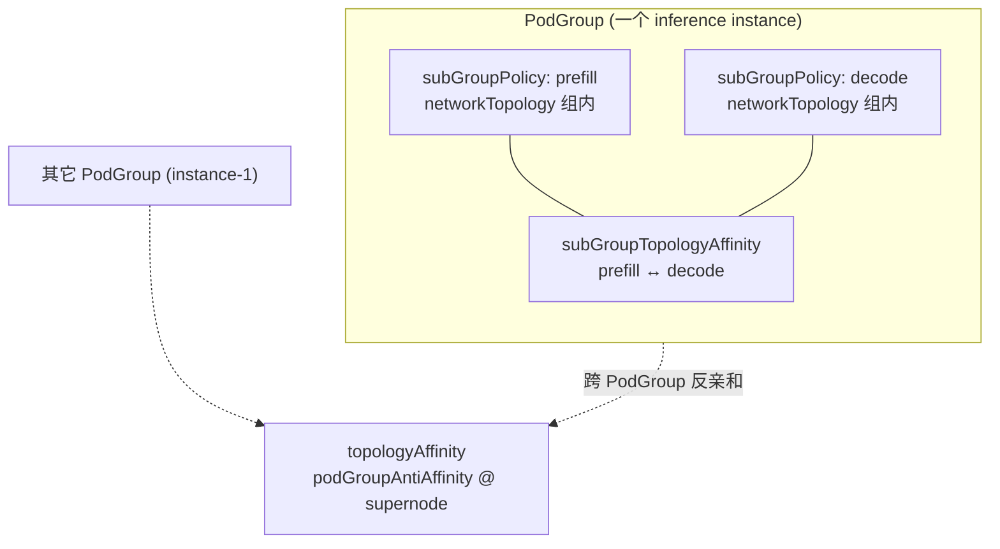

---

## `topologyAffinity` 能力范围（跨 PodGroup）

**Phase 1 仅实现 `podGroupAntiAffinity`。** 容器名仍为 `topologyAffinity`（与 K8s `affinity` / `antiAffinity` 并列命名），但 **不实现、不接受** `podGroupAffinity`。

**做什么（In scope）：** 描述 **本 PodGroup** 与 **集群内其它 PodGroup** 在 `separationTier` 上 **必须或优先异域**（`podGroupAntiAffinity`）。

- 通过 `metadata.labels[volcano.sh/topology-group]` 或 `podGroupSelector` / `namespaceSelector` 选中对端 PodGroup；
- Hard / soft（`required` / `preferred` + `weight`）；
- `TopologyOccupancyIndex` 记录已调度 PodGroup 占用的 `Domain_T`；
- 在 **Job 级别** `allocateForJob` 之前参与 `HyperNodeGradientForJobFn` 剪枝。

**明确不做（Out of scope for `topologyAffinity`）：**

| 诉求 | 应使用 |
|------|--------|
| 跨 PodGroup **共域**（多 PodGroup 挤同一 supernode） | **不支持** `podGroupAffinity`；单 instance 用 `PodGroupSpec.networkTopology`；同 PodGroup 角色共域用 `subGroupAffinity` |

原因说明见 [#跨-podgroup仅反亲和](#跨-podgroup仅反亲和)（「为何不做跨 PodGroup 亲和」）。

| 其它诉求 | 应使用 |
|----------|--------|
| 同 PodGroup 内 prefill / decode 等 SubGroup 关系 | `subGroupTopologyAffinity` |
| SubGroup 内 Gang / `highestTierAllowed` | `subGroupPolicy[].networkTopology` |

---

## `subGroupTopologyAffinity` 能力范围（同 PodGroup、跨 SubGroup）

**做什么：** 描述 **当前 PodGroup 内**，由 `subGroupPolicy` 划分的 **多个 SubGroup（SubJob）之间** 在 HyperNode 树 `separationTier` 上的拓扑亲和或反亲和。

**核心语义：** 调度器为每个 `subGroupPolicy` 生成一个 **SubJob**；`subGroupTopologyAffinity` 约束的是这些 SubJob 的 `AllocatedHyperNode` 在 `Domain_T(·)` 上的关系，**不是** Pod 级 `podAffinity`，也 **不是** 跨 PodGroup 关系。

### 能力范围（In scope）

| 能力 | 说明 |
|------|------|
| 多个 SubJob 共超节点 | `PodGroupSpec.networkTopology` 或 `subGroupAffinity`（见 [实例 4](#实例-4分布式-prefill-decode-推理推荐)） |
| 同角色多分片机柜互斥 | `subGroupAntiAffinity` @ `cabinet`，selector 两侧为 **同名** policy（如均为 `[prefill]`） | [实例 4](#实例-4分布式-prefill-decode-推理推荐) |
| 两 **不同 policy** 的 SubJob 异域 | `subGroupAntiAffinity` + `subGroupSelector` / `antiSubGroupSelector`（policy 名 **不相交**） | [实例 6](#实例-6可选prefill-与-decode-跨角色分机柜) |
| 同一 policy 内 Pod 分机柜（非 SubJob 间） | **非本字段** | `matchLabelKeys` 拆 SubJob + policy 内 anti，或 Pod spread |
| prefill 与 decode 无要求 | 不写跨角色 `subGroupAntiAffinity` | 实例 4 仅 prefill↔prefill、decode↔decode |
| Hard / soft | Hard → `HyperNodeGradientForSubJobFn` 剪枝；Soft → `HyperNodeOrderFn`（见 [实例 7](#实例-7subgroup-软性反亲和可选)） |
| 与组内 Gang 叠加 | 各 SubGroup 仍可独立配置 `networkTopology.highestTierAllowed` |
| SubJob 调度顺序 | Hard `subGroupAntiAffinity` 时，被引用为 `subGroupSelector` 的 policy 对应 SubJob **优先** 调度（见 §10.1） |
| 部分调度 | 一方 SubJob 已分配 `AllocatedHyperNode` 后，另一方须满足 `Domain_T` 关系再选 HyperNode |

### 非目标（Out of scope）

| 非目标 | 应使用的 API / 机制 |
|--------|---------------------|
| 跨 PodGroup / 跨 instance **互斥** | `topologyAffinity.podGroupAntiAffinity` |
| 跨 PodGroup **共域** | **不支持**（用 `networkTopology` / `subGroupAffinity`） |
| 同一 SubGroup 内 Pod 不跨 tier | `subGroupPolicy[].networkTopology` |
| 选择「任意其它 PodGroup」的 SubGroup | **不支持**；selector 仅解析本 PodGroup 的 `subGroupPolicy` |
| 跨 Namespace 的 SubGroup 对等 | **不支持** |
| 无 `subGroupPolicy` 时定义 SubGroup 间关系 | **无效**；Webhook 拒绝 |
| 用 `topologyGroup` 表达同 PodGroup 内 prefill/decode | **错误**；`topologyGroup` 仅用于跨 PodGroup |

### 前置条件

1. `spec.subGroupPolicy` **非空**，且至少 **2 条** `subGroupPolicy`（单 SubGroup 无「组间」对象，配置 `subGroupTopologyAffinity` 无意义）。
2. Term 中的 `matchSubGroupPolicyNames` / `matchSubGroupPolicyNames`（selector 内）必须 **全部出现在本 PodGroup** 的 `subGroupPolicy[].name` 中。
3. 对应 SubGroup 的 Pod 须能通过各 policy 的 `labelSelector`（及可选 `matchLabelKeys`）正确归属到 SubJob。

### 调度语义与实现锚点

| 项 | 行为 |
|----|------|
| 比较主体 | `JobInfo.SubJobs`（按 `subGroupPolicy.name` 区分），非 `JobInfo` 与其它 Job |
| Gradient 注册 | 仅当 `ContainsHardCrossSubGroupTopology(job)` 为真时，group-topology-affinity 注册 `HyperNodeGradientForSubJobFn` |
| 与 Job 级别 PodGroup 约束 | 先 `HyperNodeGradientForJobFn`（含跨 PodGroup hard）→ `allocateForJob` 选定 Job 级别 HyperNode 域 → 再对各 SubJob 应用 `subGroupTopologyAffinity` |
| Occupancy 索引 | **不**写入跨 PodGroup 索引；仅在同 PodGroup 的 SubJob 已分配域上在 Session 内做 peer 查询 |
| 忽略执行期变更 | `*IgnoredDuringExecution`：已放置 SubJob 不因 PodGroup Spec 变更被驱逐（与 PodAffinity 一致） |

### 设计考量与限制

1. **Peer 依赖与顺序：** Hard `subGroupAffinity` 要求 peer SubJob 已有 `AllocatedHyperNode`（或同轮内先调度方）；因此 `organizeJobWorksheet` 需保证至少一个 peer 先进入 `allocateForSubJob`。
2. **Tier 一致性：** 若同时配置 hard `subGroupAffinity` @ supernode 与 hard `subGroupAntiAffinity` @ cabinet，Webhook 要求 affinity 的 tier **不低于** antiAffinity 的 tier（数值更大或 tierName 更靠近根），避免逻辑矛盾。
3. **与 `topologyAffinity` 并用：** 可同时配置实例级 `topologyAffinity`；`subGroupTopologyAffinity` 仅在有 **角色间** 需求时添加（实例 6），与「角色内副本打散」（实例 4）正交。
4. **仅 HyperNode 域：** 约束在 HyperNode 树 `Domain_T` 上表达；SubJob 选定 HyperNode 后，组内 Pod 仍由 `networkTopology` + Node `predicate` 落位。
5. **Phase 1：** `preempt` / `backfill` 不保证重算 SubGroup 间拓扑；Occupancy 以 Session 内已运行 Job 为准。

### 配置反例

```yaml
# 错误：用 subGroupAntiAffinity(prefill, decode) 表达「4 个 prefill 彼此分机柜」
subGroupTopologyAffinity:
  subGroupAntiAffinity:
    requiredDuringSchedulingIgnoredDuringExecution:
      - subGroupSelector:
          matchSubGroupPolicyNames: [prefill]
        antiSubGroupSelector:
          matchSubGroupPolicyNames: [decode]   # ❌ 这是角色间，不是副本内

# 正确：prefill 与 decode 无要求 → 不配上述 term
# 正确：prefill 副本间 → 见实例 4（policy 内 `[prefill]` antiAffinity + matchLabelKeys）
```

---

## Label 常量

```go
const TopologyGroupLabelKey = GroupName + "/topology-group" // volcano.sh/topology-group
```

## HyperNode 层级与 separationTier / separationTierName

组间亲和/反亲和与组内 `networkTopology` 一样，基于 **HyperNode CR** 树，**不**使用任意 Node label。用户在 term 的 `TopologySeparationSpec` 中必须指定 **且仅能指定一种** 分离层级：`separationTierName`（对齐 `spec.tierName`）或 `separationTier`（对齐 `spec.tier` 整数），与 `highestTierName` / `highestTierAllowed` 的对偶关系一致。

### HyperNode 上定义什么

每个 HyperNode 资源（`topology.volcano.sh/v1alpha1`）在 `spec` 中描述自己处于哪一层：

| HyperNode 字段 | 含义 | 与 PodGroup 的对应 |
|----------------|------|-------------------|
| `spec.tier` | 层级 **序号**（非负整数，集群内统一递增约定，越大越靠近根） | `separationTier: <int>` |
| `spec.tierName` | 层级 **可读名称**（集群内约定，如 `cabinet`、`supernode`、`rack`） | `separationTierName: "<string>"` |

示例（集群侧，与 PodGroup 无关）：

```yaml
apiVersion: topology.volcano.sh/v1alpha1
kind: HyperNode
metadata:
  name: supernode-sn-1
spec:
  tier: 2
  tierName: supernode          # ← PodGroup 里 separationTierName 必须写 supernode
  members:
    - type: HyperNode
      selector:
        exactMatch:
          name: cabinet-a
    - type: HyperNode
      selector:
        exactMatch:
          name: cabinet-b
---
apiVersion: topology.volcano.sh/v1alpha1
kind: HyperNode
metadata:
  name: cabinet-a
spec:
  tier: 1
  tierName: cabinet            # ← separationTierName: cabinet 时，Domain 在机柜层比较
  members:
    - type: Node
      selector: { ... }
```

调度器在 Session 启动时扫描全部 HyperNode，构建：

- **`HyperNodeTierNameMap`**：`tierName → tier`（`network-topology-aware` 解析 `highestTierName`、`group-topology-affinity` 解析 `separationTierName` 共用）；
- **`HyperNodeTierSet`**：集群内出现过的 `spec.tier` 整数值集合（用于校验 `highestTierAllowed` / `separationTier`）。

Webhook：未知 `separationTierName` 或不在 `HyperNodeTierSet` 中的 `separationTier` **拒绝**。

### 用户如何填写分离层级

1. **先查集群**：`kubectl get hypernodes -o custom-columns=NAME:.metadata.name,TIER:.spec.tier,TIERNAME:.spec.tierName`（维护「tier ↔ tierName」对照表，与组内 `networkTopology` 填法相同）。
2. **二选一（每个 term 的 `TopologySeparationSpec`）**：
   - **`separationTierName`**：与目标层 HyperNode 的 `spec.tierName` **完全一致**（区分大小写）；
   - **`separationTier`**：与目标层 HyperNode 的 `spec.tier` **整数相等**。
3. **勿混用**：同一 `TopologySeparationSpec` 内 `separationTier` 与 `separationTierName` **互斥**（与 `highestTierAllowed` / `highestTierName` 规则相同）。
4. **推荐**：人工运维、多集群对齐 → **tierName**；由 tier 序号驱动的模板/控制器 → **tier 整数**。
5. **与组内区别**：`highestTier*` 限制 **组内** Pod 不跨层；`separationTier(*)` 定义 **组间** 在该层上 `Domain_T` 相同或不同。

| 用户写法 | 调度器解析为 | 组内等价字段 |
|----------|--------------|--------------|
| `separationTierName: supernode` | 沿父链取第一个 `spec.tierName == "supernode"` 的祖先 `metadata.name` 为 `Domain_T` | `highestTierName: supernode` |
| `separationTier: 2` | 沿父链取第一个 `spec.tier == 2` 的祖先为 `Domain_T` | `highestTierAllowed: 2` |
| `separationTierName: cabinet` | 机柜层域 | `highestTierName: cabinet` |
| `separationTier: 1` | 机柜层域（当集群约定 cabinet=1） | `highestTierAllowed: 1` |

无效配置示例：`separationTierName: foo`（无 HyperNode 使用该 tierName）；`separationTier: 99`（`HyperNodeTierSet` 中不存在）。

### 与示例拓扑的对应

**tierName / tier 以本集群 HyperNode CR 为准**（下表两列可任选其一填写）。

| 业务说法 | `separationTierName` | `separationTier`（示例） | API |
|----------|----------------------|--------------------------|-----|
| 不同 inference instance 不占同一超节点 | `supernode` | `2` | `topologyAffinity.podGroupAntiAffinity` |
| 4 个 prefill（或 decode）彼此分机柜 | `cabinet` | `1` | 实例 4：policy 内 anti |
| prefill 与 decode **无**拓扑要求 | — | — | 不配跨角色 term |
| （可选）prefill 与 decode 分机柜且共超节点 | `cabinet` + `supernode` | `1` + `2` | 实例 6 |

---

## 语义：分离域 Domain_T

对候选 HyperNode `H` 与用户配置的分离层级（`separationTier` 或 `separationTierName`）：

```
Domain_T(H) = 从 H 沿 HyperNode 父链向上，第一个满足下列之一的祖先 HyperNode 的 metadata.name：
              · spec.tier == separationTier（整数模式）
              · spec.tierName == separationTierName（字符串模式，与 HyperNode CR 配置一致）
```

| 约束 | Hard 语义 |
|------|-----------|
| 反亲和 | `Domain_T(A) ≠ Domain_T(B)` |
| 亲和 | `Domain_T(A) == Domain_T(B)`（一方未分配时，后分配方须落入已分配域） |

与现有 `NetworkTopologySpec` 的区别：

| 字段 | 语义 | 层级来源 |
|------|------|----------|
| `highestTierAllowed` / `highestTierName`（已有） | **组内** Gang：整组 Pod 不跨越该层 | 同上 HyperNode `tier` / `tierName` |
| `separationTier` / `separationTierName`（本设计） | **组间**：在该层比较 Domain 相同或不同 | 同上，**必须与集群 HyperNode 定义一致** |

## Hard 约束优先级

1. PodGroup hard antiAffinity（跨 instance）
2. SubGroup hard antiAffinity（**SubJob 之间**，含实例 4 policy 内分片互斥）
3. SubGroup hard affinity（**不同 policy / SubJob 之间** 共域，如实例 6）
4. SubGroup / Job hard `networkTopology`（组内 Gang，已有）
5. Soft → `HyperNodeOrderFn` 加权

## 配置示例（多 Instance + Prefill-Decode 角色内打散）

组间拓扑见实例 4；此处仅示 **跨 instance 互斥** + 两条角色 policy（**无** prefill↔decode 组间 term）。

```yaml
apiVersion: scheduling.volcano.sh/v1beta1
kind: PodGroup
metadata:
  name: pd-instance-0
  labels:
    volcano.sh/topology-group: llama-70b-serving
spec:
  minMember: 8
  queue: default

  topologyAffinity:
    podGroupAntiAffinity:
      requiredDuringSchedulingIgnoredDuringExecution:
        - topologyGroup: llama-70b-serving
          separationTierName: supernode

  subGroupPolicy:
    - name: prefill
      labelSelector:
        matchLabels:
          volcano.sh/role: prefill
      # 分片与组间拓扑：见实例 4（matchLabelKeys + subGroupTopologyAffinity）
    - name: decode
      labelSelector:
        matchLabels:
          volcano.sh/role: decode
      subGroupSize: 1

  # 角色内 prefill-0..3 / decode-0..3 互斥 @ cabinet：subGroupTopologyAffinity（省略）
  # 若需 prefill 与 decode 整机柜分离：另见实例 6
```

# Plugin Architecture

## 职责划分

| 插件 / 模块 | Hard（gradient） | Soft（order） | 资源预筛 |
|-------------|------------------|---------------|----------|
| `allocate` action（新增职责） | — | — | **HyperNode `minResource` vs idle/futureIdle**（与 Node predicate 前资源判断同级） |
| `network-topology-aware`（现有） | BFS 梯度、`highestTierAllowed`（**不含**资源判断） | HyperNode binpack、LCA tier 打分 | 仅维护 Session 级 HyperNode 资源账面（供 allocate 读取） |
| `group-topology-affinity`（新增） | Job 级别：跨 PodGroup **反亲和** hard；SubJob 级别：同 PodGroup、跨 SubGroup hard | 上述 soft 打分 | — |
| `framework`（聚合） | **仅拓扑插件**：集合交集 + 统一按 tier 重分层 | 多插件分数累加（已有） | **不参与** |

Hard / Soft 分工：

- **Hard 拓扑**（`topologyAffinity` / `subGroupTopologyAffinity` 的 **`required`** 列表，或 `networkTopology.mode: hard`）：各拓扑插件独立计算 `HyperNodeGradient`，Framework **求候选 HyperNode 集合交集** 后 **统一分层**。
- **Hard 容量**：在 **`allocate.go`** 对 gradient 候选做 **`minResource` 预筛**（**不**放入 `HyperNodeGradientForJobFn` 聚合逻辑）。
- **Soft 拓扑**（上述 API 的 **`preferred`** 列表 + `weight`，或 `networkTopology.mode: soft`）：仅 `HyperNodeOrderFn` 加权，不进入 gradient 交集。

## 框架约束：HyperNode Gradient 多插件聚合

### 现状与目标

| 项 | 现状 | 本设计 |
|----|------|--------|
| `HyperNodeGradientForJobFn` / `HyperNodeGradientForSubJobFn` | **仅第一个注册插件生效** | **所有启用 `enabledHyperNodeGradient` 的插件均参与** |
| 多 hard 约束组合 | 无法组合 | **集合交集（AND）** |
| `HyperNodeOrderFn` | 多插件分数累加 | 不变 |

### 聚合流程（拓扑插件交集 + allocate 资源预筛）

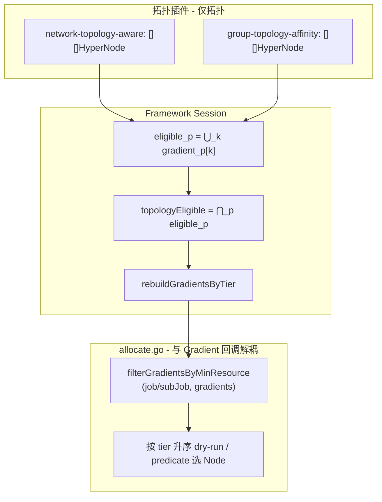

**Framework 侧（仅拓扑，不含资源）：**

1. 各拓扑插件返回 `[][]*HyperNodeInfo`（满足「插件不变式」）。
2. `topologyEligible = ⋂_p ⋃_k gradient_p[k]`，再 `rebuildGradientsByTier`。
3. **不在此阶段做** `minResource` 判断。

**allocate 侧（容量预筛，类比 Node predicate 前资源判断）：**

4. `allocateForJob` / `allocateForSubJob` 在拿到 `hyperNodeGradients` 之后、进入 dry-run 循环之前，调用 **`filterGradientsByMinResource`**，剔除资源不足的 HyperNode。
5. 仅对过滤后的 HyperNode 做 subJob dry-run；进入 `allocateResourcesForTasks` 后，仍由现有 **`alloc.predicate`** 对 Node 做 `FutureIdle` 检查（双层：HyperNode 整组容量 → Node 单 Pod 容量）。

**与 Node 路径对照：**

| 层级 | 容量预筛位置 | 细粒度调度 |
|------|--------------|------------|
| Node | `allocate.predicate`：`InitResreq` vs `node.FutureIdle()` | `PredicateForAllocateAction` |
| HyperNode | **`allocate.filterGradientsByMinResource`**：`GetMinResources()` vs HyperNode idle/futureIdle | 其下对每个 Node 仍走 `predicate` |

**空结果：**

- 拓扑交集为空 → 拓扑不可满足；
- 资源过滤后为空 → 容量不可满足（可与 `NotEnoughResources` 等原因区分记录）。

**为何不采用「按 gradient 下标逐层交集」：**

各插件 BFS/剪枝路径不同，同一 HyperNode 可能落在不同下标层。按下标对齐交集会产生假阴性（某轮为空但并集交集非空）。**先集合交集、再统一分层** 语义稳定，且与 allocate「先低 tier、后高 tier」一致。

### 插件返回 gradient 的不变式

每个注册 `HyperNodeGradientFor*Fn` 的插件应保证：

1. `len(gradients) >= 1`；若无可行 HyperNode，返回空 slice 或 `nil`（Framework 视为 `eligible_p = ∅`）。
2. **层间 tier 单调**：对任意 `i < j`，`gradients[i]` 中任意 HyperNode 的 `tier` ≤ `gradients[j]` 中任意 HyperNode 的 `tier`（tier 越小表示域越贴近、越优先尝试）。
3. 同一 gradient 层内 HyperNode 名称不重复。

Framework **不**假设各插件 tier 分桶完全一致；最终以 **Session 统一重分层** 为准。

### 未注册 gradient 的插件

- 未注册 `HyperNodeGradientFor*Fn` 的插件：**不参与交集**（对该插件无 hard gradient 约束）。
- 某 Job/SubJob **无任何** required 组间拓扑约束时，可仅 `network-topology-aware` 注册；`group-topology-affinity` 在无 required 类约束 term 时可不注册 gradient，仅注册 Order（或整插件跳过）。

### Framework API（`session_plugins.go`）

```go
// 各插件仍通过 AddHyperNodeGradientForJobFn / AddHyperNodeGradientForSubJobFn 注册。

// HyperNodeGradientForJobFn 聚合逻辑（伪代码）：
func (ssn *Session) HyperNodeGradientForJobFn(job *api.JobInfo, root *api.HyperNodeInfo) [][]*api.HyperNodeInfo {
    var perPlugin [][]*api.HyperNodeInfo
    for _, plugin := range ssn.enabledGradientPlugins() {
        g, err := ssn.hyperNodeGradientForJobFns[plugin](job, root)
        if err != nil { /* 记录错误，该插件视为 ∅ 或整 Job 失败，策略可配置 */ }
        perPlugin = append(perPlugin, g)
    }
    if len(perPlugin) == 0 {
        return [][]*api.HyperNodeInfo{{root}}
    }
    if len(perPlugin) == 1 {
        return perPlugin[0]
    }
    eligible := intersectHyperNodeSets(perPlugin) // ⋂_p ⋃_k gradient_p[k]
    if len(eligible) == 0 {
        return nil
    }
    return rebuildGradientsByTier(ssn.HyperNodes, eligible)
}
```

辅助函数（建议放在 `pkg/scheduler/api` 或 `pkg/scheduler/framework`）：

```go
func unionGradientHyperNodeNames(gradients [][]*api.HyperNodeInfo) sets.Set[string]
func intersectHyperNodeSets(perPlugin [][]*api.HyperNodeInfo) sets.Set[string]
func rebuildGradientsByTier(hyperNodes api.HyperNodeInfoMap, eligible sets.Set[string]) [][]*api.HyperNodeInfo
```

`HyperNodeGradientForSubJobFn` 使用相同聚合逻辑；SubJob 上下文需传入 `hyperNodeForJob`（父域），各插件在子树内计算 gradient。

### Hard / Soft 与 Order 的配合

```text
拓扑 Hard:  HyperNodeGradient（多拓扑插件）→ Framework 交集 → rebuildGradientsByTier
容量 Hard:  allocate.filterGradientsByMinResource（不经过 HyperNodeGradientFor*Fn 聚合）
调度:       allocate 逐层 dry-run → allocateResourcesForTasks → predicate(Node)
Soft:       HyperNodeOrderFn（多插件分数相加）→ selectBestHyperNodeForSubJob
```

`group-topology-affinity`：**`required` term** → `HyperNodeGradientFor*Fn`；**`preferred` term** → `HyperNodeOrderFn`（term 内 **无** `mode` 字段）。

## allocate Action：HyperNode 资源预筛（与 Gradient 回调解耦）

### 设计原则

- **资源是否够 Gang / SubGroup**：属于 **allocate action** 的调度路径决策，与「拓扑插件如何产 gradient」正交。
- **不**在 `HyperNodeGradientForJobFn` / `HyperNodeGradientForSubJobFn` 的 Framework 聚合里做 `minResource` 过滤，避免 group-topology-affinity、network-topology-aware 在 BFS 中对资源不足 HyperNode 重复计算，也避免与回调生命周期耦合。
- 判断逻辑从 `network-topology-aware.isEligibleHyperNode` **迁出容量分支**，改为 allocate 内显式调用；network-topology-aware **仅保留 tier / `highestTierAllowed`** 等拓扑条件。

### 调用位置

在 `allocateForJob` 中（`allocateForSubJob` 同理，使用 `subJob.GetMinResources()`）：

```go
// 1. 拓扑：仅通过 Framework 插件回调（多插件交集 + 重分层）
hyperNodeGradients := ssn.HyperNodeGradientForJobFn(job, hyperNodeToAllocate)

// 2. 容量：allocate 本地过滤，与 HyperNodeGradientForJobFn 无关
hyperNodeGradients = alloc.filterGradientsByMinResource(job, nil, hyperNodeGradients)

for gradient, hyperNodes := range hyperNodeGradients {
    for _, hyperNode := range hyperNodes {
        // 3. dry-run subJobs（内部 allocateResourcesForTasks → predicate(Node)）
    }
}
```

SubJob 级别在 `allocateForSubJob` 内、调用 `HyperNodeGradientForSubJobFn` 之后同样执行 `filterGradientsByMinResource(job, subJob, gradients)`。

### `filterGradientsByMinResource` 语义

```go
// pkg/scheduler/actions/allocate/hypernode_resource.go（建议新文件或 allocate.go 内）

func (alloc *Action) filterGradientsByMinResource(
    job *api.JobInfo,
    subJob *api.SubJobInfo, // nil 表示 Job 级别过滤
    gradients [][]*api.HyperNodeInfo,
) [][]*api.HyperNodeInfo
```

| 规则 | 行为 |
|------|------|
| `minResource` | `subJob != nil` → `subJob.GetMinResources()`；否则 `job.GetMinResources()` |
| 比较口径 | 与现 `isEligibleHyperNode` 一致：`minResource.LessEqual(idle)` **或** `minResource.LessEqual(futureIdle)` 则保留 |
| 部分已调度 | `job.AllocatedHyperNode != ""`（Job 级别）或 `subJob.AllocatedHyperNode != ""`（SubJob 级别）时 **跳过** 资源过滤，与现网「partial 不预筛资源」一致 |
| 数据来源 | 读取 **Session 级** HyperNode 资源账面（见下），allocate **不**实现 cache 更新 |

过滤实现：对 `gradients` 每层 `hyperNodes` 原地剔除不满足的项；若某层为空则跳过该层（与现 BFS 不产出该层效果一致）。

### Session 级 HyperNode 资源账面

将 `network-topology-aware` 中的 `hyperNodeResourceCache` **提升为 Session 可读**（名称示例 `ssn.HyperNodeResourceStatus`），仍由 network-topology-aware 在 `OnSessionOpen` + `Allocate`/`Deallocate` EventHandler 维护；allocate 只读。

```go
// api 或 framework.Session
type HyperNodeResourceStatus struct {
    Allocatable, Used, Idle, FutureIdle *api.Resource
}

func (ssn *Session) HyperNodeSatisfiesMinResource(
    hyperNodeName string,
    minResource *api.Resource,
) bool
```

便于单测：对 `filterGradientsByMinResource` 注入 mock Session 账面，无需拉起 gradient 插件。

### `network-topology-aware` 配套改动

```go
// isEligibleHyperNode：删除 minResource / hyperNodeResourceCache 分支，仅保留：
// - tier <= highestAllowedTier
// - （不再在此处做 idle/futureIdle 判断）

func (networkTopologyAware *networkTopologyAwarePlugin) isEligibleHyperNode(
    hn *api.HyperNodeInfo,
    highestAllowedTier int,
    allocatedHyperNode string,
) bool {
    if hn.Tier() > highestAllowedTier {
        return false
    }
    if allocatedHyperNode != "" {
        return true
    }
    return true // 拓扑 BFS 默认展开；资源由 allocate 预筛
}
```

`hyperNodeGradientFn` 签名可去掉 `minResource` 参数；`HyperNodeGradientForJobFn` / `HyperNodeGradientForSubJobFn` 注册函数不再传入 `job.GetMinResources()`。

### 为何放在 allocate 更合适

| 点 | 说明 |
|----|------|
| 与 Node 一致 | 容量先筛、再 predicate，都在 **action** 层，而非 scheduler plugin 回调聚合 |
| 解耦 | Framework `HyperNodeGradientFor*Fn` 只表达 **拓扑可行域**；容量是 Job/SubJob 调度上下文 |
| 性能 | group-topology-affinity / network-topology-aware 的 BFS 不再遍历「注定容量不够」的 HyperNode；过滤在 gradient 列表上 **O(n)** 一次完成 |
| 可测 | allocate 单测覆盖资源过滤，无需 mock 多插件 gradient |

## 推荐 Scheduler 配置

```yaml
actions: "enqueue, allocate, backfill"
tiers:
- plugins:
  - name: gang
  - name: predicates
  - name: group-topology-affinity
    arguments:
      group-topology-affinity.weight: 10
  - name: network-topology-aware
    arguments:
      weight: 10
```

两者均开启 `enabledHyperNodeGradient` 与 `enabledHyperNodeOrder`（与现有 e2e 配置一致）。tier 内插件顺序不影响交集交换律，但影响 **Order 分数相加顺序**（加法可交换，无影响）。

## group-topology-affinity 扩展点

| 扩展点 | 用途 |
|--------|------|
| `OnSessionOpen` | 构建 `TopologyOccupancyIndex` |
| `AddHyperNodeGradientForJobFn` | Hard 跨 PodGroup 约束下的 Job 级别梯度 |
| `AddHyperNodeGradientForSubJobFn` | Hard 跨 SubGroup 约束下的 SubJob 级别梯度（含同 Job 已分配 SubJob 域） |
| `AddHyperNodeOrderFn` | Soft 跨组拓扑亲和/反亲和偏好 |
| `AddJobValidFn`（可选 P2） | 全局域耗尽预检 |

## network-topology-aware 改动（最小）

- **保留** `hyperNodeGradientFn` BFS；`isEligibleHyperNode` **仅拓扑**（tier / partial 场景），**移除** `minResource` 判断。
- **保留** `hyperNodeResourceCache` 维护，但升级为 **Session 可读**，供 allocate 使用。
- 与 `group-topology-affinity` 通过 Framework **拓扑 gradient 交集**协作；**不**在插件内做容量预筛。

## allocate Action（其它）

- `RequiresHyperNodeAllocate()`：`ContainsHardTopology() \|\| ContainsSubJobPolicy() \|\| ContainsHardCrossPodGroupTopology() \|\| ContainsHardCrossSubGroupTopology()`
- `ContainsHardCrossPodGroupTopology(job)`：存在非空 `topologyAffinity.podGroupAntiAffinity` 的 **`required`** 列表（**不含** `podGroupAffinity`）
- `ContainsHardCrossSubGroupTopology(job)`：非空 `subGroupTopologyAffinity` 且存在 hard `subGroupAffinity` / `subGroupAntiAffinity` term
- `organizeJobWorksheet`：含 hard subGroup antiAffinity 的 SubJob 稳定排序（被依赖方先调度）
- 主路径：`allocateForJob` →（`HyperNodeGradientForJobFn` → **`filterGradientsByMinResource`**）→ `allocateForSubJob` →（`HyperNodeGradientForSubJobFn` → **资源过滤**）→ `selectBestHyperNodeForSubJob` → `allocateResourcesForTasks` → `predicate(Node)`

## 实现文件（Phase 1）

| 路径 | 说明 |
|------|------|
| `staging/.../scheduling/v1beta1/types.go` | API |
| `pkg/scheduler/api/topology_constraint.go` | 解析结构 |
| `pkg/scheduler/api/topology_occupancy.go` | 占用索引 |
| `pkg/scheduler/api/hyper_node_info.go` | `GetAncestorAtTier` |
| `pkg/scheduler/api/hyper_node_gradient.go` | `union` / `intersect` / `rebuildGradientsByTier` |
| `pkg/scheduler/api/hyper_node_resource.go` | HyperNode 资源账面类型 + `SatisfiesMinResource` |
| `pkg/scheduler/plugins/group-topology-affinity/` | 新插件（topology gradient + order） |
| `pkg/scheduler/plugins/network-topology-aware/` | 去掉 gradient 内资源预筛；Session 资源 cache |
| `pkg/scheduler/framework/session.go` | 暴露 HyperNode 资源账面 |
| `pkg/scheduler/framework/session_plugins.go` | **仅拓扑** Gradient 多插件交集 + 重分层 |
| `pkg/scheduler/actions/allocate/allocate.go` | `filterGradientsByMinResource`；Job/SubJob 调用点 |
| `pkg/scheduler/actions/allocate/hypernode_resource_test.go` | 资源过滤单测 |
| `pkg/webhooks/.../validate_podgroup.go` | 校验 |
| `pkg/scheduler/framework/session_plugins_test.go` | 拓扑交集/重分层单测 |

---

# 架构与时序图

本章给出端到端调度路径的**流程图**与**时序图**，便于实现与评审时对齐模块边界。图中 **Framework** = Framework Session；**network-topology-aware**、**group-topology-affinity**、**allocate** 均使用插件/模块全称。时序图里 `allocateAction` 的**自环**表示 allocate 模块内部步骤，不是跨参与者的递归调用。

**阅读顺序建议：** 图例与分层 → §4 Framework gradient 聚合 → §5 `allocateForJob` → §6–§8 SubJob / 跨 PodGroup 示例。

## 图例与分层

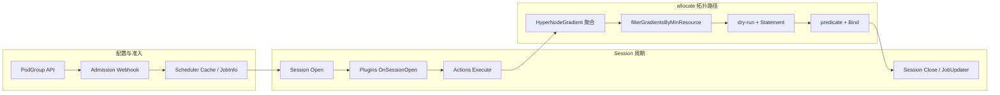

| 符号 | 含义 |
|------|------|
| 实线箭头 | 同步调用 / 顺序执行 |
| 虚线箭头 | 可选路径或条件分支 |
| `Domain_T(H)` | HyperNode H 在分离 tier T 上的祖先域 |

---

## 1. 调度周期总览

Volcano 一个 scheduling cycle 内，与本文相关的组件协作关系如下。

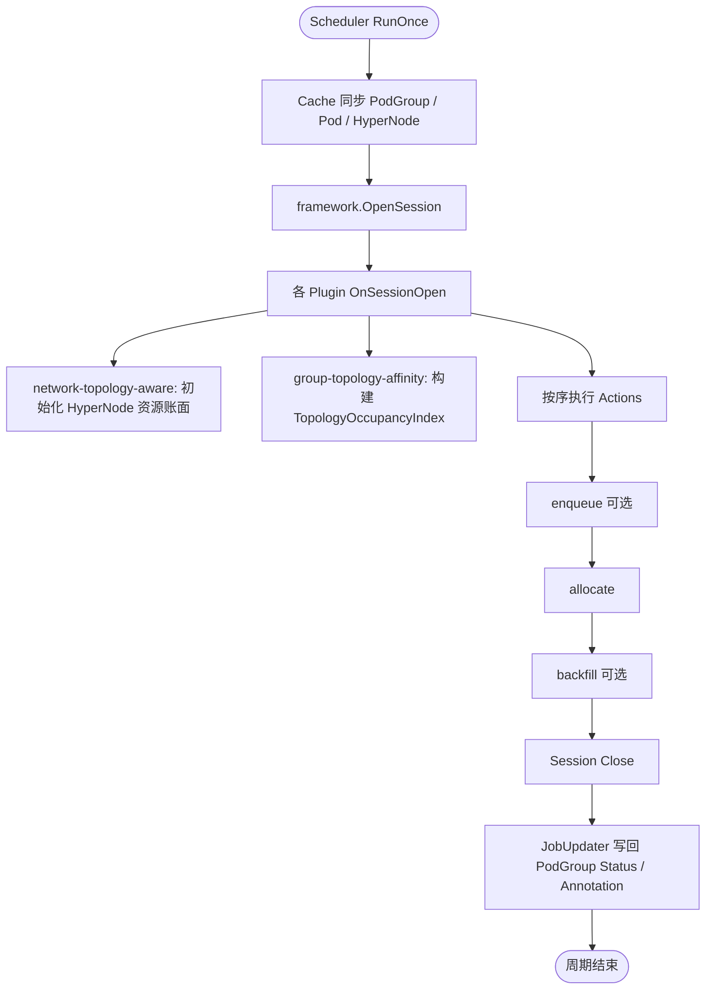

---

## 2. Session Open 时序图

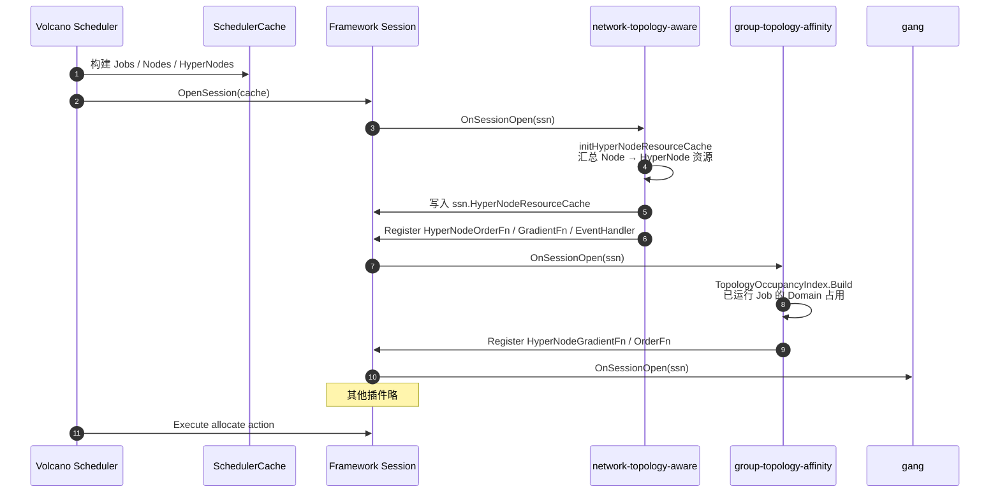

---

## 3. allocate Action 总流程

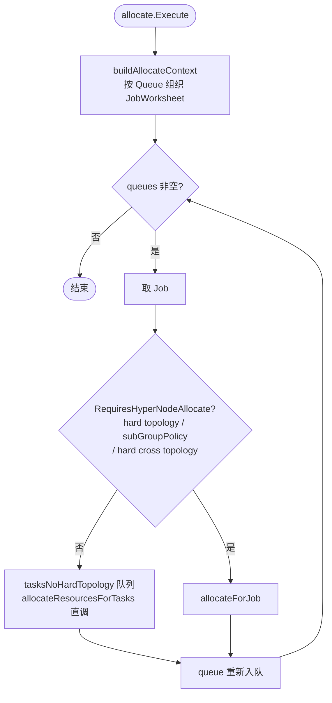

**`RequiresHyperNodeAllocate()` 判定（流程图）：**

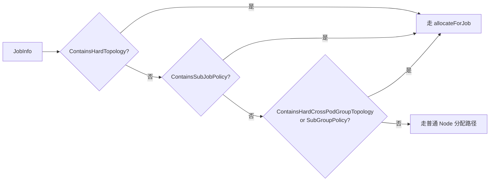

---

## 4. Framework：HyperNodeGradient 聚合

### 4.1 聚合流程图

```mermaid
flowchart TB
    Entry([HyperNodeGradientForJobFn<br/>或 ForSubJobFn]) --> LoopP[遍历 enabledHyperNodeGradient 插件]
    LoopP --> CallP[调用 plugin.gradientFn<br/>得到 gradients_p]
    CallP --> UnionP["eligible_p = ⋃_k gradients_p[k]"]
    UnionP --> MoreP{还有插件?}
    MoreP -->|是| LoopP
    MoreP -->|否| OneP{仅 1 个插件?}
    OneP -->|是| RetSingle[直接返回该 gradients]
    OneP -->|否| Intersect["topologyEligible = ⋂_p eligible_p"]
    Intersect --> Empty{交集为空?}
    Empty -->|是| RetNil[返回 nil / 空 gradient]
    Empty -->|否| Rebuild[rebuildGradientsByTier<br/>按 tier 升序分层]
    Rebuild --> RetGrad[返回 [][]HyperNode]
```

### 4.2 聚合时序图（Job 级别示例）

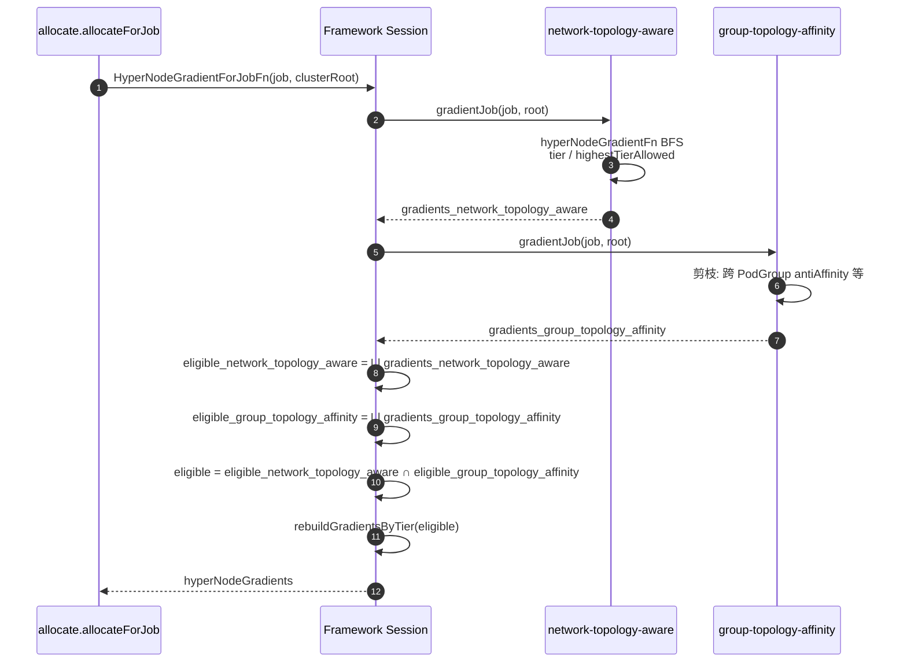

---

## 5. allocateForJob 完整流程

### 5.1 流程图

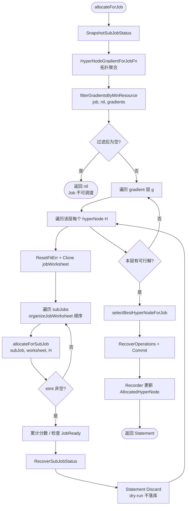

### 5.2 时序图

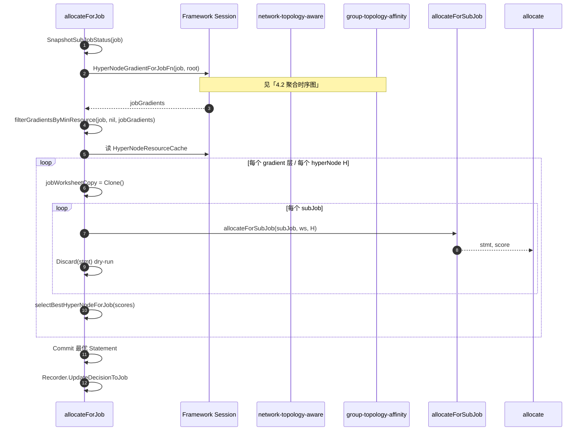

---

## 6. HyperNode 最小资源预筛（allocate）

与 `HyperNodeGradientFor*Fn` **解耦**，在 allocate 内完成。

### 6.1 流程图

```mermaid
flowchart TB
    Start([filterGradientsByMinResource]) --> Partial{job/subJob 已有<br/>AllocatedHyperNode?}
    Partial -->|是| Skip[跳过资源过滤<br/>返回原 gradients]
    Partial -->|否| MinR[minResource = job 或 subJob<br/>.GetMinResources]
    MinR --> LoopG[遍历每层 gradient]
    LoopG --> LoopH[遍历层内每个 hn]
    LoopH --> Read[读 ssn.HyperNodeResourceCache hn]
    Read --> Check{minResource <= idle<br/>OR <= futureIdle?}
    Check -->|是| Keep[保留 hn]
    Check -->|否| Drop[剔除 hn]
    Keep --> LoopH
    Drop --> LoopH
    LoopH --> PruneEmpty[剔除空层]
    PruneEmpty --> Ret([返回过滤后 gradients])
```

### 6.2 时序图

```mermaid
sequenceDiagram
    autonumber
    participant allocateAction as allocate action
    participant Framework as Framework Session
    participant Cache as HyperNodeResourceCache

    allocateAction->>allocateAction: 若 AllocatedHyperNode 非空则直接返回
    allocateAction->>allocateAction: minResource = GetMinResources()
    loop 每个 hyperNode hn in gradients
        allocateAction->>Framework: HyperNodeResourceCache[hn]
        Framework->>Cache: idle / futureIdle
        Cache-->>allocate: 资源账面
        allocateAction->>allocateAction: HyperNodeSatisfiesMinResource?
    end
    allocate-->>allocate: 返回过滤后的 gradients
```

---

## 7. allocateForSubJob 与选优

### 7.1 流程图

```mermaid
flowchart TB
    Start([allocateForSubJob]) --> G2[HyperNodeGradientForSubJobFn<br/>subJob, hyperNodeForJob]
    G2 --> R2[filterGradientsByMinResource<br/>job, subJob, gradients]
    R2 --> LoopG2[遍历 gradient / hyperNode 候选]
    LoopG2 --> ARF[allocateResourcesForTasks<br/>tasks, hyperNode]
    ARF --> HasStmt{有分配操作?}
    HasStmt -->|是| Backup[stmtBackup + worksheetBackup]
    HasStmt -->|否| LoopG2
    Backup --> Discard2[Discard dry-run]
    Discard2 --> LoopG2
    LoopG2 --> Select[selectBestHyperNodeForSubJob<br/>HyperNodeOrderMapFn 分数累加]
    Select --> LCA[更新 subJob.AllocatedHyperNode<br/>LCA 合并]
    LCA --> Ret([返回 bestStmt, score])
```

### 7.2 时序图（含 HyperNodeOrder）

```mermaid
sequenceDiagram
    autonumber
    participant AFSJ as allocateForSubJob
    participant Framework as Framework Session
    participant network-topology-aware as network-topology-aware
    participant group-topology-affinity as group-topology-affinity
    participant ARF as allocateResourcesForTasks

    AFSJ->>Framework: HyperNodeGradientForSubJobFn(subJob, parentHN)
    Framework-->>AFSJ: subJobGradients
    AFSJ->>AFSJ: filterGradientsByMinResource(job, subJob, ...)
    loop 每个候选 hyperNode
        AFSJ->>ARF: allocateResourcesForTasks(subJob, tasks, hn)
        ARF-->>AFSJ: stmt / empty
        AFSJ->>AFSJ: stmt.Discard()
    end
    AFSJ->>Framework: HyperNodeOrderMapFn(subJob, candidateNodes)
    Framework->>network-topology-aware: HyperNodeOrderFn → scores_network_topology_aware
    Framework->>group-topology-affinity: HyperNodeOrderFn → scores_group_topology_affinity
    Framework->>Framework: 分数相加
    Framework-->>AFSJ: bestHyperNode, score
    AFSJ->>AFSJ: RecoverOperations(bestStmt)
```

---

## 8. Task 级：allocateResourcesForTasks 与 Node predicate

HyperNode 选定后的 **Node 级**路径（与 HyperNode 资源预筛分层）。

```mermaid
flowchart TB
    Start([allocateResourcesForTasks]) --> Nodes[RealNodesList hyperNode]
    Nodes --> PopT{tasks 非空?}
    PopT -->|否| RetStmt([返回 Statement])
    PopT -->|是| PopTask[Pop Task]
    PopTask --> QueueOK{ssn.Allocatable?}
    QueueOK -->|否| PopT
    PopTask --> PrePred[PrePredicateFn]
    PrePred --> PredRes[predicate: InitResreq vs<br/>node.FutureIdle]
    PredRes --> PredPlugins[PredicateForAllocateAction<br/>各插件]
    PredPlugins --> HasNode{有可行 Node?}
    HasNode -->|否| FitErr[记录 FitErrors]
    HasNode -->|是| Order[prioritizeNodes / NodeOrderFn]
    Order --> Pipeline[Statement.Pipeline / Commit op]
    Pipeline --> SubReady{SubJobReady?}
    SubReady -->|是| PopT
    SubReady -->|否| PopT
```

```mermaid
sequenceDiagram
    autonumber
    participant ARF as allocateResourcesForTasks
    participant Framework as Framework Session
    participant Pred as predicates 等

    loop 每个 Task
        ARF->>Framework: Allocatable(queue, task)
        ARF->>Framework: PrePredicateFn(task)
        ARF->>ARF: predicate(task, node)
        Note over ARF: 先 FutureIdle 资源判断
        ARF->>Framework: PredicateForAllocateAction(task, node)
        Framework->>Pred: 插件 Predicate
        ARF->>Framework: prioritizeNodes
        ARF->>ARF: allocateResourcesForTask → Pipeline
    end
```

---

## 9. group-topology-affinity：占用索引与跨 PodGroup 反亲和

### 9.1 OccupancyIndex 构建（Session Open）

```mermaid
flowchart LR
    subgraph Input
        Jobs[Running/Inqueue Jobs]
        Ann[job.AllocatedHyperNode]
        PGSpec[topologyAffinity terms]
    end
    subgraph Build
        TierMap[解析 separationTier]
        Domain[Domain_T AllocatedHN]
        Idx[topologyGroup → domain → Set JobUID]
    end
    Jobs --> Ann --> Domain --> Idx
    PGSpec --> TierMap --> Idx
```

### 9.2 跨 PodGroup 反亲和判定（hard）

```mermaid
flowchart TB
    Start([候选 HyperNode H<br/>调度 Job J]) --> TG{J 配置了<br/>topologyGroup / selector?}
    TG -->|否| Pass[eligible]
    TG -->|是| DomH[计算 Domain_T(H)]
    DomH --> Lookup[OccupancyIndex 查询<br/>同 topologyGroup 已占用 domain]
    Lookup --> Conflict{存在其他 Job<br/>且 domain 相同?}
    Conflict -->|是| Reject[从 gradient 剔除 H]
    Conflict -->|否| Pass
```

```mermaid
sequenceDiagram
    autonumber
    participant group-topology-affinity as group-topology-affinity
    participant Idx as TopologyOccupancyIndex
    participant Framework as HyperNodes

    group-topology-affinity->>Framework: gradientJob(job, root)
    loop BFS 每个候选 hn
        group-topology-affinity->>group-topology-affinity: Domain_T(hn) at separationTier
        group-topology-affinity->>Idx: IsDomainOccupied(topologyGroup, domain, job.UID)
        Idx-->>group-topology-affinity: occupied / free
    end
    group-topology-affinity-->>group-topology-affinity: 输出剪枝后 gradients_group_topology_affinity
```

---

## 10. 跨 SubGroup 约束（SubJob 之间）

> **作用域提醒：** 约束在 **SubJob** 之间；同一 `subGroupPolicy.name` 下可有多个 SubJob（`matchLabelKeys`）。**policy 内**互斥：selector 同名（实例 4）；**跨 policy**互斥：selector 不同名（实例 6）。**不**涉及 `topologyAffinity`。

### 10.1 SubJob 调度顺序（organizeJobWorksheet）

含 hard `subGroupAntiAffinity` 时，**被依赖方先调度**（如先 prefill，再 decode）。

```mermaid
flowchart LR
    WS[JobWorksheet.subJobs 优先队列] --> Req[未满足 minSubGroups 的 GID 优先]
    Req --> Anti[antiAffinity 中作为 SubGroupSelector<br/>的 policy 对应 subJob 优先]
    Anti --> Order[SubJobOrderFn gang ready]
```

### 10.2 跨 SubGroup 亲和 / 反亲和判定

```mermaid
flowchart TB
    Start([SubJob S 候选 hn]) --> Aff{hard subGroupAffinity?}
    Aff -->|是| PeerA[取 peer subJobs 已分配<br/>AllocatedHyperNode]
    PeerA --> SameDom{Domain_T(hn) ==<br/>Domain_T(peer)?}
    SameDom -->|否| RejA[剔除]
    SameDom -->|是| Anti
    Aff -->|否| Anti{hard subGroupAntiAffinity?}
    Anti -->|是| PeerB[取 antiSubGroupSelector<br/>对应已分配 peer]
    PeerB --> DiffDom{Domain_T(hn) !=<br/>Domain_T(peer)?}
    DiffDom -->|否| RejB[剔除]
    DiffDom -->|是| OK[保留]
    Anti -->|否| OK
```

### 10.3 时序示例：实例 6（prefill 与 decode 跨角色分机柜）

仅当配置了 prefill↔decode 的 `subGroupTopologyAffinity` 时适用。

```mermaid
sequenceDiagram
    autonumber
    participant allocateAction as allocateForJob
    participant AFSJ as allocateForSubJob
    participant group-topology-affinity as group-topology-affinity

    allocateAction->>AFSJ: allocateForSubJob(prefill)
    AFSJ->>AFSJ: 选定 SubJob prefill，Domain_cabinet=A
    allocateAction->>AFSJ: allocateForSubJob(decode)
    group-topology-affinity->>group-topology-affinity: subGroupAntiAffinity: Domain_cabinet(decode) != A
    group-topology-affinity->>group-topology-affinity: subGroupAffinity: Domain_super(decode) == Domain_super(prefill)
```

### 10.4 拓扑结构对照

**实例 4（Prefill-Decode 默认）：** prefill 分片占不同 cabinet，decode 分片占不同 cabinet，prefill 与 decode 无柜级约束。

```mermaid
flowchart TB
    subgraph PF[prefill 副本]
        P0[prefill-0 @ cabinet-1]
        P1[prefill-1 @ cabinet-2]
        P2[prefill-2 @ cabinet-3]
        P3[prefill-3 @ cabinet-4]
    end
    subgraph DC[decode 副本]
        D0[decode-0 @ cabinet-5]
        D1[decode-1 @ cabinet-6]
    end
```

**实例 6（可选）：** prefill 柜组与 decode 柜组分离，仍共 supernode。

```mermaid
flowchart TB
    subgraph SN[supernode S]
        CA[cabinet A — prefill SubJob 4 Pods]
        CB[cabinet B — decode SubJob 4 Pods]
    end
```

| 场景 | 约束 |
|------|------|
| 实例 4：prefill 分片互斥 | `subGroupAntiAffinity` @ cabinet，selector 均为 `[prefill]` |
| 实例 4：prefill vs decode | **无** |
| 实例 6：prefill vs decode | `Domain_cabinet` 互异且 `Domain_super` 相同 |

---

## 11. 多 Instance：跨 PodGroup 反亲和

```mermaid
flowchart TB
    subgraph Cluster
        subgraph SN1[超节点 SN-1]
            PG1[PodGroup instance-0]
        end
        subgraph SN2[超节点 SN-2]
            PG2[PodGroup instance-1]
        end
        subgraph SN3[超节点 SN-3]
            PG3[PodGroup instance-2]
        end
    end
    PG1 -.->|topologyGroup 相同<br/>Domain 互斥| PG2
    PodGroup2 -.->|Domain 互斥| PG3
```

```mermaid
sequenceDiagram
    autonumber
    participant PodGroup1 as PodGroup inst-0
    participant PodGroup2 as PodGroup inst-1
    participant group-topology-affinity as group-topology-affinity
    participant Idx as OccupancyIndex

    PodGroup1->>group-topology-affinity: 调度完成 Domain_T=SN-1
    group-topology-affinity->>Idx: Register(inst-0, SN-1)
    PodGroup2->>group-topology-affinity: gradient 候选
    group-topology-affinity->>Idx: SN-1 occupied by inst-0
    group-topology-affinity->>group-topology-affinity: 仅尝试 SN-2, SN-3, ...
    PodGroup2->>PodGroup2: 落入 SN-2
    group-topology-affinity->>Idx: Register(inst-1, SN-2)
```

---

## 12. Hard 约束综合决策（单候选 HyperNode）

对单个候选 `hn` 在进入 dry-run 前的逻辑合并视图（实现可分散在 group-topology-affinity / network-topology-aware / allocate，语义如下）。

```mermaid
flowchart TB
    H[候选 HyperNode hn] --> R1{allocate:<br/>minResource 满足?}
    R1 -->|否| X[剔除]
    R1 -->|是| R2{network-topology-aware:<br/>tier / highestTierAllowed?}
    R2 -->|否| X
    R2 -->|是| R3{group-topology-affinity:<br/>跨 PodGroup antiAffinity?}
    R3 -->|冲突| X
    R3 -->|否| R4{group-topology-affinity:<br/>跨 SubGroup affinity / antiAffinity?}
    R4 -->|不满足| X
    R4 -->|满足| OK[进入 dry-run]
```

---

## 13. 失败路径与 Status 回写

```mermaid
sequenceDiagram
    autonumber
    participant allocateAction as allocate action
    participant Framework as Framework
    participant Gang as gang OnSessionClose
    participant JU as JobUpdater
    participant PodGroupAPI as PodGroup API

    allocateAction->>allocateAction: gradient 交集为空 / 资源过滤为空
    allocate-->>Framework: 本周期未 Commit
    Framework->>Gang: OnSessionClose
    Gang->>PodGroupAPI: 可选 Unschedulable Condition
    Framework->>JU: UpdateAll
    JU->>PodGroupAPI: Phase / Conditions<br/>TopologyUnsatisfiable 等
    JU->>PodGroupAPI: Annotation job-allocated-hypernode
```

---

## 14. 与现有实现对齐说明

| 图中步骤 | 代码锚点（当前/目标） |
|----------|----------------------|
| allocate.Execute | `pkg/scheduler/actions/allocate/allocate.go` |
| HyperNodeGradientForJobFn | `pkg/scheduler/framework/session_plugins.go`（目标：多插件交集） |
| filterGradientsByMinResource | `allocate.go`（**待实现**） |
| hyperNodeGradientFn BFS | `pkg/scheduler/plugins/network-topology-aware/network_topology_aware.go` |
| isEligibleHyperNode 资源分支 | 同上（**待迁出**至 allocate） |
| allocateResourcesForTasks + predicate | `allocate.go` |
| HyperNodeOrderMapFn | `session_plugins.go` + `util.PrioritizeHyperNodes` |

---

# 竞品与标准对齐

本章从 **友商产品用法**、**与本设计的能力差距**、**字段映射** 三方面展开，便于对外沟通、迁移评估与 API 对齐。各小节均附 **官方资料链接**；文中 YAML 为从文档摘录的 **示意配置**（层级名、label 需与目标集群一致）。

## 能力总览

| 能力维度 | kube-scheduler | Kueue | KAI Scheduler | Koordinator | Volcano（现状） | Volcano（本设计） |
|----------|----------------|-------|---------------|-------------|-----------------|-------------------|
| Gang / PodGroup | PodGroup `gang.minCount` | Workload + PodSet 准入 | PodGroup + pod-grouper | Coscheduling PodGroup | PodGroup + gang | 不变 |
| 组内拓扑共域 | `schedulingConstraints.topology` | PodSet 注解 `podset-required-topology` | `TopologyConstraint` / Job 注解 | PodGroup 注解 `network-topology-spec` | `networkTopology` + HyperNode | 不变 |
| 组内 SubGroup | 无（Workload 多模板） | `podset-group-name` 多 PodSet | Hierarchical `subGroups[]` | 多 PodGroup + `groups` 注解 | `subGroupPolicy` | 不变 |
| 跨 PodGroup / 多 instance 打散 | Pod `topologySpreadConstraints` | 多 Workload / 多 PodSet 组 | 多 PodGroup + 各 constraint | 多 PodGroup `groups` + gather | 无 | `topologyAffinity.podGroupAntiAffinity` |
| 同 PodGroup 内分片互斥 | Pod spread | slice 注解（单层/多层） | 多 SubGroup + 各层 constraint | 单 PodGroup gather | `matchLabelKeys` + policy 内 anti | 实例 4 |
| 同 PodGroup 跨角色拓扑 | Pod affinity 组合 | 多 PodSet 同域注解 | 父/子 SubGroup 层级共域 | `groups` + MustGather | 无 | `subGroupTopologyAffinity` |
| 拓扑数据源 | Node label | Node label 层级 | Topology CRD 树 | `ClusterNetworkTopology` + Node label | HyperNode CRD | HyperNode CRD |
| 组间 hard 反亲和 API | 无（Pod 级 spread） | 无 | 无一等字段 | 无（gather 语义） | 无 | `required` + `separationTierName` 或 `separationTier` |

---

## 友商洞察（详细）

### Kubernetes（kube-scheduler）

**定位：** 在 **标准 PodGroup Gang** 上增加 **Workload 级拓扑共域**；跨副本打散仍主要依赖 **Pod 级** `topologySpreadConstraints` / `podAffinity`，**没有** PodGroup 级「拓扑组互斥」或「同 PodGroup 内 SubGroup 互斥」API。

| 资料 | 链接 |
|------|------|
| Topology-Aware Workload Scheduling（TAS 概念） | https://kubernetes.io/docs/concepts/workloads/workload-api/topology-aware-scheduling/ |
| PodGroup API（`scheduling.k8s.io/v1alpha2`） | https://kubernetes.io/docs/reference/kubernetes-api/workload-resources/pod-group-v1alpha2/ |
| Pod Topology Spread | https://kubernetes.io/docs/concepts/scheduling-eviction/topology-spread-constraints/ |
| Pod Affinity / Anti-Affinity | https://kubernetes.io/docs/concepts/scheduling-eviction/assign-pod-node/#affinity-and-anti-affinity |
| Gang 调度算法（placement-based） | https://kubernetes.io/docs/concepts/scheduling-eviction/scheduling/pod-group-scheduling/ |

#### 用法 1：PodGroup Gang + 单条拓扑共域（TAS）

**适用：** 分布式训练等「整组必须落在同一 rack/zone label 域」。

**要点（v1.36 alpha）：**

- `schedulingPolicy.gang.minCount`：整组 **一次性模拟** 放置，满足 `minCount` 才 commit。
- `schedulingConstraints.topology`：**每个 PodGroup 仅允许一条** topology；`key` 为 **Node label**（非 CRD 树）。
- 语义是 **共域（colocation）**，不是「子组互斥」或「多 PodGroup 互斥」。
- TAS **不支持** 为拓扑触发抢占；无可行域则整组 Unschedulable。

```yaml
apiVersion: scheduling.k8s.io/v1alpha2
kind: PodGroup
metadata:
  name: example-podgroup
spec:
  schedulingPolicy:
    gang:
      minCount: 4
  schedulingConstraints:
    topology:
      - key: topology.example.com/rack   # 全部 Pod 共享同一 rack label 值
```

**与本设计：** 近似 Volcano `PodGroupSpec.networkTopology`（Job 级 envelope），但 Volcano 用 HyperNode `tierName` 而非任意 node label；且 Volcano 可叠加 **组间** `topologyAffinity` / `subGroupTopologyAffinity`。

#### 用法 2：Pod Topology Spread（副本打散）

**适用：** Deployment / 无 Gang 的副本 **尽量均匀** 分布在 zone/rack。

```yaml
spec:
  topologySpreadConstraints:
    - maxSkew: 1
      topologyKey: topology.kubernetes.io/zone
      whenUnsatisfiable: DoNotSchedule
      labelSelector:
        matchLabels:
          app: llama-70b
```

**局限：**

- **Pod 级**、逐 Pod 调度；与 PodGroup Gang **混用困难**（先绑定的 Pod 会锁定 spread 域）。
- 无 `topologyGroup` 概念；多 **独立 PodGroup instance** 的「各占不同超节点」需靠 label + spread **间接** 表达，运维成本高。

#### 用法 3：Pod Affinity / Anti-Affinity

**适用：** 细粒度「跟某 Pod 同节点/同 hostname」。

**局限（Gang 场景）：** KAI 拓扑设计文档明确指出：带 PodAffinity 的 PodGroup 在调度第一个 Pod 后会把 label 域 **锁死**，后续 Pod 无法回退尝试其它节点，易导致 **整组无解**。Volcano / KAI 均倾向 **PodGroup 级拓扑插件 + 整组模拟**，而非 Pod 级 affinity 链式锁定。

#### 与本设计差距（摘要）

| 本设计诉求 | Kubernetes 常见写法 | 差距 |
|------------|---------------------|------|
| 多 inference instance 各占不同超节点 | spread + 统一 app label | Pod 级；无 PodGroup `topologyGroup` |
| Prefill-Decode 分片分机柜 + 共超节点 | 多条 Pod 规则或无法表达 | 无 SubGroup / 无组间 Term |
| 同 PodGroup 内 prefill-0 vs prefill-1 互斥 | 需自建 label + spread | 无 `subGroupAntiAffinity` |

---

### Kueue

**定位：** **队列 + 准入（admission）** 阶段的拓扑感知；用 **Node label 层级** 描述数据中心结构，用户通过 **Job PodTemplate 注解** 声明 PodSet 共域/偏好，**不是** Volcano 式 HyperNode CRD，也 **没有** PodGroup 级跨 Workload 反亲和 API。

| 资料 | 链接 |
|------|------|
| Topology Aware Scheduling（概念与注解） | https://kueue.sigs.k8s.io/docs/concepts/topology_aware_scheduling/ |
| `Topology` / `ResourceFlavor` API | 同上（Admin-facing APIs） |
| TAS 与 Cluster Autoscaler | 同上（Provisioning AdmissionCheck） |
| v0.17 多层 slice（alpha） | 同上（`TASMultiLayerTopology`） |

#### 管理员：定义拓扑层级

```yaml
apiVersion: kueue.x-k8s.io/v1beta2
kind: Topology
metadata:
  name: default
spec:
  levels:
    - nodeLabel: cloud.provider.com/topology-block
    - nodeLabel: cloud.provider.com/topology-rack
    - nodeLabel: kubernetes.io/hostname
---
apiVersion: kueue.x-k8s.io/v1beta2
kind: ResourceFlavor
metadata:
  name: tas-flavor
spec:
  topologyName: default
  nodeLabels:
    cloud.provider.com/node-group: tas-group
```

调度前 Kueue 按层级计算各域 **空闲容量**（扣除已准入 TAS Workload 与其它 Pod 占用）。

#### 用户：PodSet 拓扑注解（Job `template.metadata.annotations`）

| 注解 | 语义 |
|------|------|
| `kueue.x-k8s.io/podset-required-topology` | **Hard**：该 PodSet 全部 Pod 必须在注解值所指 **同一拓扑域**（如 rack）；放不下则不准入 |
| `kueue.x-k8s.io/podset-preferred-topology` | **Soft**：优先共域；不行则向上一层扩散，最终可跨域准入 |
| `kueue.x-k8s.io/podset-unconstrained-topology` | 参与 TAS 容量计算，但不强制共域（减碎片） |
| `kueue.x-k8s.io/podset-group-name` | 多个 PodSet **共享** 同一 flavor 与拓扑域（类似「绑在一起准入」） |
| `kueue.x-k8s.io/podset-slice-required-topology-constraints` | 多层 slice（最多 3 层，需 feature gate） |

**示例（preferred @ block）：**

```yaml
apiVersion: batch/v1
kind: Job
metadata:
  generateName: tas-sample-preferred
  labels:
    kueue.x-k8s.io/queue-name: tas-user-queue
spec:
  parallelism: 40
  template:
    metadata:
      annotations:
        kueue.x-k8s.io/podset-preferred-topology: cloud.provider.com/topology-block
    spec:
      containers:
        - name: worker
          image: registry.k8s.io/e2e-test-images/agnhost:2.53
          resources:
            requests:
              cpu: "1"
              memory: 200Mi
```

**多层 slice 示例（64 Pod：block 内 32、rack 内 16）：**

```yaml
metadata:
  annotations:
    kueue.x-k8s.io/podset-slice-required-topology-constraints: |
      [
        {"topology": "cloud.provider.com/topology-block", "size": 32},
        {"topology": "cloud.provider.com/topology-rack", "size": 16}
      ]
```

#### 与本设计关系

| 维度 | Kueue | Volcano 本设计 |
|------|-------|----------------|
| 调度阶段 | **准入前** 选域，再交给 kube-scheduler 绑 Node | Volcano Session 内 HyperNode gradient + allocate |
| 多 PodGroup 互斥 | 靠多个 Workload / 运维约定，**无** `podGroupAntiAffinity` | `topologyAffinity` + `topologyGroup` |
| 同 PodGroup 内 prefill/decode | `podset-group-name` 绑多个 PodSet **共域**；**无** policy 内 pairwise 反亲和 | `subGroupTopologyAffinity` + `matchLabelKeys` |
| 拓扑模型 | Node label 链 | HyperNode 树 + `separationTierName` |

KAI 拓扑插件 **显式参考 Kueue Topology CRD**（见下节），Volcano 与 Kueue **路径不同**（HyperNode vs label），但 **required/preferred 分层思想** 与 Volcano `networkTopology.mode` / 组间 `required`·`preferred` 可对齐理解。

---

### KAI Scheduler（NVIDIA）

**定位：** AI 训练/推理场景下的 **Gang + 独立 topology 插件**；**分层 PodGroup（SubGroups）** 表达组件差异；拓扑通过 **Job 注解 → PodGroup.TopologyConstraint** 注入。与 Volcano 本设计 **架构最接近**，但 **缺少** 跨 PodGroup hard 反亲和、同 PodGroup 内显式 `subGroupAntiAffinity` Term。

| 资料 | 链接 |
|------|------|
| Topology Aware Scheduling 设计 | https://github.com/kai-scheduler/KAI-scheduler/blob/main/docs/developer/designs/topology-awareness/README.md |
| Hierarchical PodGroup / SubGroups | https://github.com/kai-scheduler/KAI-scheduler/blob/main/docs/developer/designs/hierarchical-podgroup/README.md |
| PodGroup CRD 类型（v2alpha2） | https://github.com/kai-scheduler/KAI-scheduler/blob/main/pkg/apis/scheduling/v2alpha2/podgroup_types.go |
| 跨 Workload 手写 PodGroup 讨论 | https://github.com/kai-scheduler/kai-scheduler/issues/1420 |
| Run:ai 用户文档（TAS 概念） | https://run-ai-docs.nvidia.com/saas/platform-management/aiinitiatives/resources/topology-aware-scheduling |
| Kueue Topology（KAI 对齐参考） | https://kueue.sigs.k8s.io/docs/concepts/topology_aware_scheduling/ |

#### 用法 1：Job 注解 → PodGroup 拓扑约束

`pod-grouper` 从 **顶层 Owner** 读取注解并写入 PodGroup：

| 注解 | 含义 |
|------|------|
| `kai.scheduler/topology` | 使用的 Topology CRD 名称 |
| `kai.scheduler/topology-required-placement` | **Hard**：整 Job 不得跨越该层级（如 `zone`） |
| `kai.scheduler/topology-preferred-placement` | **Soft**：优先该层级（如 `rack`） |

```yaml
apiVersion: batch/v1
kind: Job
metadata:
  name: topology-aware-job
  annotations:
    kai.scheduler/topology: network
    kai.scheduler/topology-required-placement: zone
    kai.scheduler/topology-preferred-placement: rack
```

对应 PodGroup 字段（设计草案）：

```yaml
spec:
  topologyConstraint:
    topology: network
    requiredTopologyLevel: zone
    preferredTopologyLevel: rack
```

**调度实现（两阶段）：**

1. **Stage 1**：维护 `TopologyInfo` 树，按域汇总资源；`NodeOrder` / `Predicate` 按距离排序（解决 PodAffinity 在 Gang 下锁死问题）。
2. **Stage 2**：`FeasibleNodes(PodGroup) [][]Node` **枚举**可行拓扑域并 simulation（精度高、大集群成本高）。

#### 用法 2：分层 SubGroup（Prefill / Decode 等）

**资料：** [Hierarchical PodGroup README](https://github.com/kai-scheduler/KAI-scheduler/blob/main/docs/developer/designs/hierarchical-podgroup/README.md)

Pod 通过 label `kai.scheduler/subgroup-name` 归属 **叶子 SubGroup**；父 SubGroup 可设 `minSubGroup` 与 **自己的** `topologyConstraint`。

**示例（User Story 3：decode / prefill 各在 block 内，rack 上 Gang）：**

```yaml
spec:
  minSubGroup: 2
  subGroups:
    - name: decode
      minSubGroup: 2
      topologyConstraint:
        topology: cluster-topology
        requiredTopologyLevel: block
    - name: decode-workers
      parent: decode
      minMember: 4
      topologyConstraint:
        requiredTopologyLevel: rack
    - name: prefill
      minSubGroup: 2
      topologyConstraint:
        requiredTopologyLevel: block
    - name: prefill-workers
      parent: prefill
      minMember: 4
      topologyConstraint:
        requiredTopologyLevel: rack
```

**表达力对比：**

| 诉求 | KAI 典型写法 | Volcano 本设计 |
|------|--------------|----------------|
| prefill 与 decode **可** 不同 block | 父 SubGroup 各 `requiredTopologyLevel: block` | 默认 **不** 配跨角色 anti；共超节点用 Job `networkTopology` 或 `subGroupAffinity` |
| 4 个 prefill **分片** 各在不同 rack | 需 **多个叶子 SubGroup** 或副本 SubGroup 集（见 Example 3/4） | **一条** `subGroupPolicy` + `matchLabelKeys` + policy 内 `[prefill]` anti（实例 4） |
| 多 instance 各占不同超节点 | **多个 PodGroup**，各自 topology；无 `topologyGroup` | `topologyAffinity.podGroupAntiAffinity` @ `supernode` |
| prefill vs decode **强制分机柜** | 无 `antiSubGroupSelector`；靠层级与 placement 间接实现 | 实例 6：`subGroupAntiAffinity` 跨 policy |

#### 与本设计差距（摘要）

- **有：** 拓扑树、`required`/`preferred` level、分层 SubGroup、独立 topology 插件、Gang 整组模拟。
- **无：** `topologyGroup`；`podGroupAntiAffinity`；`subGroupAntiAffinity` 的 **policy 内两两互斥** Term；`separationTierName` 与 HyperNode 统一（KAI 用 Topology CRD level 字符串）。

---

### Koordinator

**定位：** 在 **scheduler-plugins Coscheduling** 上扩展 **网络拓扑感知**；通过 **`ClusterNetworkTopology` CR** + **PodGroup/Pod 注解 JSON** 配置 **PreferGather / MustGather**；支持 **多 PodGroup 编组**（`groups` 注解）做联合 gather，仍 **不是** 声明式「A 与 B 在 tier T 上必须异域」。

| 资料 | 链接 |
|------|------|
| Network Topology Aware Scheduling（用户手册） | https://koordinator.sh/docs/user-manuals/network-topology-aware-scheduling |
| Coscheduling 插件（scheduler-plugins） | https://github.com/kubernetes-sigs/scheduler-plugins/blob/master/site/content/en/docs/plugins/coscheduling.md |
| `ClusterNetworkTopology` API（v1alpha1） | https://koordinator.sh/docs/user-manuals/network-topology-aware-scheduling#configure-network-topology |

**启用条件（文档要求）：**

- `koord-scheduler` 启动参数：`--enable-network-topology-manager=true`
- Coscheduling 插件配置：`awareNetworkTopology: true`（可选 `enablePreemption: true`）

#### 管理员：拓扑 CR + Node label

```yaml
apiVersion: scheduling.koordinator.sh/v1alpha1
kind: ClusterNetworkTopology
metadata:
  name: default
spec:
  networkTopologySpec:
    - labelKey:
        - network.topology.nvidia.com/spine
      topologyLayer: SpineLayer
    - labelKey:
        - network.topology.nvidia.com/block
      parentTopologyLayer: SpineLayer
      topologyLayer: BlockLayer
    - parentTopologyLayer: BlockLayer
      topologyLayer: NodeTopologyLayer
```

Node 示例：`network.topology.nvidia.com/block`、`.../spine` 等 label（可用 NVIDIA topograph 等工具打标）。

#### 用户：PodGroup `network-topology-spec`（gather 策略）

**PreferGather（尽量聚合，资源紧时仍可调度）：**

```yaml
apiVersion: scheduling.sigs.k8s.io/v1alpha1
kind: PodGroup
metadata:
  name: topology-demo-job
  annotations:
    gang.scheduling.koordinator.sh/network-topology-spec: |
      {
        "gatherStrategy": [
          { "layer": "BlockLayer", "strategy": "PreferGather" },
          { "layer": "SpineLayer", "strategy": "PreferGather" }
        ]
      }
spec:
  minMember: 4
```

Pod 需：`schedulerName: koord-scheduler`、label `pod-group.scheduling.sigs.k8s.io: <pg名>`、注解 `gang.scheduling.koordinator.sh/network-topology-index: "0"`…（建立组内通信序号）。

**MustGather（硬共域，不满足则 Pending / 拓扑感知抢占）：**

```yaml
annotations:
  gang.scheduling.koordinator.sh/network-topology-spec: |
    {
      "gatherStrategy": [
        { "layer": "SpineLayer", "strategy": "MustGather" }
      ]
    }
```

文档场景：4 Pod 训练 Job 必须落在 **同一 Spine**；资源不足时 **按拓扑约束抢占** 低优先级 Pod，并用 `nominatedNodeName` 预留节点。

| 策略 | 语义 | 近似 Volcano |
|------|------|--------------|
| `PreferGather` | 优先聚合到同一 layer 域 | `networkTopology.mode: soft` |
| `MustGather` | 必须整组落在同一 layer 域 | `networkTopology.mode: hard` 或 Job 级 envelope |
| `podCountMultiple` | Block 层按 Pod 数倍聚集（TP 训练） | 组内 `subGroupSize` + Gang |

#### 用法：多 PodGroup 联合拓扑（`groups`）

适用于 **master + worker** 等多 PodGroup 必须 **一起** MustGather 到同一 Spine：

```yaml
apiVersion: scheduling.sigs.k8s.io/v1alpha1
kind: PodGroup
metadata:
  annotations:
    gang.scheduling.koordinator.sh/groups: |
      ["default/llm-master", "default/llm-worker"]
    gang.scheduling.koordinator.sh/network-topology-spec: |
      {
        "gatherStrategy": [
          { "layer": "SpineLayer", "strategy": "MustGather" }
        ]
      }
```

**与本设计：** `groups` 表达 **多个 PodGroup 共域**（MustGather）；Volcano Phase 1 **仅实现** 共享 `topologyGroup` + **`podGroupAntiAffinity`（异域）**，跨 PodGroup 共域 **不做**（由单 PodGroup `networkTopology` / `subGroupAffinity` 承担）。Koordinator **无** policy 内 pairwise 分机柜 API。

---

### scheduler-plugins（Kubernetes SIG）

**定位：** 提供 **Coscheduling**（PodGroup `minMember` + Permit），**不包含** 拓扑亲和/反亲和 CRD；拓扑能力在 **Koordinator 发行版** 中通过 Coscheduling 扩展实现。

| 资料 | 链接 |
|------|------|
| Coscheduling 插件文档 | https://github.com/kubernetes-sigs/scheduler-plugins/blob/master/site/content/en/docs/plugins/coscheduling.md |
| 仓库首页 | https://github.com/kubernetes-sigs/scheduler-plugins |

**典型用法（仅 Gang）：**

```yaml
apiVersion: scheduling.x-k8s.io/v1alpha1
kind: PodGroup
metadata:
  name: pg1
spec:
  minMember: 3
  scheduleTimeoutSeconds: 10
```

拓扑需另接 Koordinator 注解或 kube-scheduler TAS / Pod spread。

---

### Volcano（现状与本补丁）

| 资料 | 链接 |
|------|------|
| Network Topology Aware Scheduling（组内） | [Network Topology Aware Scheduling](./Network%20Topology%20Aware%20Scheduling.md) |
| Preempt 与拓扑 | [Preempt Action Support Topology](./preempt-action-support-topology.md) |
| 本设计（组间） | 本文档 |

**已有（`network-topology-aware`）：** HyperNode 树、`PodGroupSpec.networkTopology`、`subGroupPolicy` + `matchLabelKeys`、`subGroupPolicy[].networkTopology`、`allocateForJob` / SubJob 两级 Gang。

**本设计新增（`group-topology-affinity`）：** `topologyAffinity`（跨 PodGroup）、`subGroupTopologyAffinity`（同 PodGroup 跨 SubGroup）；Framework 拓扑 gradient **交集**；allocate **资源预筛** 与拓扑解耦。

---

## 场景对照：友商写法 vs 本设计

| 业务场景 | Kubernetes | Kueue | KAI | Koordinator | Volcano 本设计 |
|----------|------------|-------|-----|-------------|----------------|
| 训练 Job 整组同 rack | PodGroup `topology.key=rack` | `podset-required-topology: rack` | `topology-required-placement: rack` | MustGather @ BlockLayer | `networkTopology` @ cabinet/rack tier |
| 40 副本尽量同 block | Pod spread | `podset-preferred-topology` | `preferredTopologyLevel` | PreferGather | `networkTopology.mode: soft` |
| 多 inference instance 分超节点 | spread + label | 多 Job / 运维隔离 | 多 PodGroup | 多 PodGroup + 不同 gather | `topologyGroup` + `podGroupAntiAffinity` |
| PD：分片分机柜 + 共超节点 | 难 | `podset-group-name` 仅共域 | 多 SubGroup + 父级 block | 单 PG gather + 多 PG groups | **实例 4** |
| PD：prefill/decode 强制分柜 | Pod anti-affinity | 难 | 层级 constraint 组合 | 多 layer gather | **实例 6** |
| 分片尽量分柜、可降级 | spread `ScheduleAnyway` | `podset-preferred-topology` | preferred level | PreferGather | **实例 7** `preferred` + `weight` |

---

## Volcano 差异化（相对友商）

1. **组间与组内 API 分离：** `networkTopology`（组内 Gang）vs `topologyAffinity` / `subGroupTopologyAffinity`（组间），避免 Koordinator 式「全写进注解 JSON」或 K8s 式「只有共域一条 topology」。
2. **HyperNode 层级双写法：** 组间 `separationTierName` / `separationTier` 与组内 `highestTierName` / `highestTierAllowed` 共用同一 HyperNode 映射；对齐运维 CR，而非 node label。
3. **同 PodGroup 内 policy 级 Term：** `subGroupSelector` / `antiSubGroupSelector` 支持 **policy 内两两互斥**（实例 4），无需 KAI 式为每个分片复制 SubGroup 树。
4. **跨 PodGroup 显式反亲和（不做跨 PodGroup 亲和）：** `topologyGroup` + `podGroupAntiAffinity.required`，补 KAI/Koordinator/Kueue 在「多 instance 互斥」上的缺口。
5. **插件分工：** `network-topology-aware` + `group-topology-affinity`；hard 拓扑 gradient **多插件交集**（借鉴 KAI 多约束思想，接口与 Volcano Framework 一致）。

---

## 字段映射表

### 表 1：组内拓扑共域（Colocation / Gang 域内）

| 语义 | Volcano（已有） | Volcano（本设计，不变） | K8s PodGroup TAS | KAI PodGroup |
|------|-----------------|-------------------------|------------------|--------------|
| 约束模式 | `networkTopology.mode` hard/soft | 同左 | 隐含 hard（共域） | required + preferred |
| 不跨越的 tier 上限 | `highestTierAllowed` / `highestTierName` | 同左 | `topology[].key`（node label） | `requiredTopologyLevel`（最大层级） |
| 拓扑数据源 | HyperNode CRD | 同左 | Node labels | Topology CRD |
| 组内 Gang | `minMember` + `subGroupSize` / `minSubGroups` | 同左 | `gang.minCount` | `minMember` / SubGroup `minMember` |

**映射说明：**

- K8s `topology[].key` ≈ 在某一 **label 域** 内共域；Volcano `highestTierAllowed` ≈ 在 HyperNode 树 **某 tier 祖先** 内共域。
- KAI `requiredTopologyLevel: rack` ≈ Volcano `highestTierAllowed` 指向 tierName=`rack` 的 HyperNode 层（需集群 tier 命名一致）。

### 表 2：跨 PodGroup / 多 Instance（组间拓扑 **反亲和**）

| 语义 | Volcano（本设计） | K8s 近似 | KAI 近似 |
|------|-------------------|----------|----------|
| 逻辑分组 | `topologyGroup` 或 `podGroupSelector` | `topologySpreadConstraints.labelSelector` + 工作负载 label | 多个 PodGroup + 相同 queue/label |
| 分离边界 | `separationTier` / `separationTierName` | `topologySpreadConstraints.topologyKey` | 各 PodGroup 的 `requiredTopologyLevel`（共域式，非互斥） |
| Hard 互斥（**跨 PodGroup，Phase 1 仅此**） | `podGroupAntiAffinity.required[]` | `whenUnsatisfiable: DoNotSchedule` + skew | **无直接等价** |
| Soft 互斥偏好 | `podGroupAntiAffinity.preferred[]` + weight | `ScheduleAnyway` + skew | `preferredTopologyLevel` |
| 跨 PodGroup 共域 | **不支持** `podGroupAffinity` | N/A | 多 PodGroup 各自 topology / gather |

**迁移示例（概念）：**

K8s 多副本跨 zone 打散（Deployment）：

```yaml
topologySpreadConstraints:
  - maxSkew: 1
    topologyKey: topology.kubernetes.io/zone
    whenUnsatisfiable: DoNotSchedule
    labelSelector:
      matchLabels:
        app: llama-70b
```

Volcano 多 PodGroup instance（Gang + 超节点互斥）：

```yaml
metadata:
  labels:
    volcano.sh/topology-group: llama-70b
spec:
  topologyAffinity:
    podGroupAntiAffinity:
      requiredDuringSchedulingIgnoredDuringExecution:
        - topologyGroup: llama-70b
          separationTierName: supernode
```

### 表 3：跨 SubGroup（**仅同 PodGroup 内**，Prefill-Decode 等）

> API 容器：`subGroupTopologyAffinity`。**不**跨 PodGroup；多 instance 互斥见表 2 `topologyAffinity`。

| 语义 | Volcano（本设计） | KAI Hierarchical PodGroup | K8s |
|------|-------------------|---------------------------|-----|
| 子组识别 | `subGroupPolicy[].name` + `matchSubGroupPolicyNames` | `subGroups[].name` + `kai.scheduler/subgroup-name` label | 无 |
| 组间拓扑 API 容器 | `subGroupTopologyAffinity` | 无（各 SubGroup 独立 constraint） | 无 |
| 子组间共域（亲和） | `subGroupAffinity` 或 `PodGroupSpec.networkTopology`（见实例 4） | 父 SubGroup `topologyConstraint.requiredTopologyLevel`（如 block） | Pod affinity |
| 子组间互斥（反亲和） | `subGroupTopologyAffinity.subGroupAntiAffinity` + `subGroupSelector` / `antiSubGroupSelector` | **无显式字段**；Story 3 靠不同子树 placement | `podAntiAffinity` |
| 子组内 Gang | `subGroupPolicy.networkTopology` + `subGroupSize` | SubGroup `minMember` + `topologyConstraint` | 单条 PodGroup topology |

**Prefill-Decode 场景映射：**

| 诉求 | Volcano | 说明 |
|------|---------|------|
| 4+2 分片、2 条 policy、共超节点 | **实例 4** | 共超节点写法见实例 4 方式一/二；分片反亲和 |
| 多 instance + 实例 4 | **实例 5** | `topologyAffinity` @ supernode |
| 仅需分机柜、无共超节点 | 省略 Job 级别 `networkTopology` 与 `subGroupAffinity` | 仅 subGroupPolicy 内反亲和 |
| 分片尽量分机柜、允许降级 | **实例 7** | `subGroupAntiAffinity.preferred` + `weight` |
| prefill 与 decode 无要求 | 省略跨角色 antiAffinity | 实例 4 仍可用 Job 级别 `networkTopology` 共 supernode |
| 仅 2 条 policy 整块角色分机柜+共超节点 | 实例 6 | |

> **结论**：`subGroupTopologyAffinity` 表达 **SubJob（policy）之间** 关系；推荐 **一条 policy + matchLabelKeys**（实例 4），无需按分片拆多条 policy。

### 表 4：插件与调度路径

| 语义 | Volcano | KAI | kube-scheduler |
|------|---------|-----|----------------|
| 域内 Gang + gradient | `network-topology-aware` | topology 插件 Stage 2 simulation | PodGroup placement algorithm |
| 域间组间拓扑亲和 | `group-topology-affinity`（新） | topology 插件 Stage 1 filter/order | `PodTopologySpread` plugin |
| 占用索引 | `TopologyOccupancyIndex` | `TopologyInfo` 树 | `PodTopologySpread` PreFilter 状态 |
| HyperNode 候选 | 拓扑：多插件 gradient 交集 + 重分层；容量：**allocate 资源预筛**（非 Gradient 回调） | `FeasibleNodes(PodGroup)` 规划 | N/A |

### 表 5：tier / level 命名对齐（运维配置）

**前提：** 组内 `highestTierName` / `highestTierAllowed` 与组间 `separationTierName` / `separationTier` 均来自本集群 HyperNode，**不是** Volcano 内置枚举。见 [#hypernode-层级与-separationtier--separationtiername](#hypernode-层级与-separationtier--separationtiername)。

建议流程：部署 HyperNode → 维护 **tier ↔ tierName** 对照表 → PodGroup 组内/组间 **各选一种** 写法（name 或 int）→ Webhook 校验映射存在。

| 物理含义（示例） | `spec.tierName` | `spec.tier`（示例） | 组内 | 组间 |
|------------------|-----------------|---------------------|------|------|
| 超节点 | `supernode` | `2` | `highestTierName` / `highestTierAllowed` | `separationTierName` / `separationTier` |
| 机柜 | `cabinet` | `1` | 同上 | 同上 |
| 节点 | （常为叶子层） | `0` | 组内常用；组间一般用更高层 | 同上 |

| KAI `requiredTopologyLevel` | 对齐 Volcano `separationTierName`（需集群 tier 命名一致） |
|-----------------------------|--------------------------------------------------------|
| `block` / `zone` | `supernode` 等 |
| `rack` | `cabinet` / `rack` |

> 复制文档 YAML 前执行：`kubectl get hypernodes -o custom-columns=NAME:.metadata.name,TIER:.spec.tier,TIERNAME:.spec.tierName`，确认 `TIERNAME` 列与 PodGroup 中填写一致。

---

## 标准对齐建议

1. **术语**：`separationTierName` / `separationTier` 分别对齐 HyperNode `spec.tierName` / `spec.tier`，与组内 `highestTierName` / `highestTierAllowed` 同源；`topologyGroup` 对齐 topology spread 的 “同一 spread 组”。
2. **硬/软**：组间拓扑用 **`required` / `preferred`** 对齐 K8s PodAffinity；`networkTopology.mode` 对齐 K8s `whenUnsatisfiable` 与域内 Gang 的 hard/soft。
3. **IgnoredDuringExecution**：与 PodAffinity / KAI 一致，已调度 Pod 不因约束变化驱逐（与现有 Volcano 拓扑调度一致）。
4. **后续可选**：提供转换工具或文档，将 KAI 注解 `kai.scheduler/topology-required-placement` 映射为 Volcano `TopologySeparationSpec`（只读文档即可，非必须代码）。

---

## 竞品结论（摘要）

| 问题 | 结论 |
|------|------|
| 是否有完全相同的 API？ | **无**。K8s：PodGroup 单条 topology 共域 + Pod spread；Kueue：准入阶段 PodSet 注解；KAI：SubGroup `topologyConstraint`；Koordinator：gather/MustGather 注解。均 **无** Volcano 式 `subGroupAntiAffinity` policy 内互斥 + `topologyGroup` 跨 PodGroup hard 反亲和。 |
| 最接近方案？ | **KAI Scheduler**（拓扑树 + 分层 SubGroup + 独立 topology 插件 + Gang 模拟）。其次 **Koordinator**（Gang + 多级 gather，偏共域与抢占）。 |
| 迁移时优先对照谁？ | 组内 Gang → K8s TAS / Kueue required / Koordinator MustGather / KAI required level；多 instance → Kueue 多 Workload 或本设计 `topologyAffinity`；PD 分片 → KAI 多 SubGroup 或本设计 **实例 4**。 |
| Volcano 差异化？ | 见 [Volcano 差异化（相对友商）](#volcano-差异化相对友商)。 |
| 插件拆分是否合理？ | **是**；与 KAI 多 topology 插件思路一致；Framework **Gradient 交集 + 统一分层**，与 `HyperNodeOrderFn` 累加对称。 |

## 外部参考资料索引

按产品分类，便于评审时跳转（与上文 [友商洞察（详细）](#友商洞察详细) 一致）。

**Kubernetes**

- [Topology-Aware Workload Scheduling](https://kubernetes.io/docs/concepts/workloads/workload-api/topology-aware-scheduling/)
- [PodGroup API (v1alpha2)](https://kubernetes.io/docs/reference/kubernetes-api/workload-resources/pod-group-v1alpha2/)
- [Pod Topology Spread Constraints](https://kubernetes.io/docs/concepts/scheduling-eviction/topology-spread-constraints/)
- [Assign Pods to Nodes — Affinity](https://kubernetes.io/docs/concepts/scheduling-eviction/assign-pod-node/#affinity-and-anti-affinity)

**Kueue**

- [Topology Aware Scheduling](https://kueue.sigs.k8s.io/docs/concepts/topology_aware_scheduling/)

**KAI Scheduler**

- [Topology Awareness Design](https://github.com/kai-scheduler/KAI-scheduler/blob/main/docs/developer/designs/topology-awareness/README.md)
- [Hierarchical PodGroup Design](https://github.com/kai-scheduler/KAI-scheduler/blob/main/docs/developer/designs/hierarchical-podgroup/README.md)
- [Issue #1420 — Cross-workload PodGroup](https://github.com/kai-scheduler/kai-scheduler/issues/1420)
- [Run:ai — Topology Aware Scheduling](https://run-ai-docs.nvidia.com/saas/platform-management/aiinitiatives/resources/topology-aware-scheduling)

**Koordinator / scheduler-plugins**

- [Koordinator — Network Topology Aware Scheduling](https://koordinator.sh/docs/user-manuals/network-topology-aware-scheduling)
- [scheduler-plugins — Coscheduling](https://github.com/kubernetes-sigs/scheduler-plugins/blob/master/site/content/en/docs/plugins/coscheduling.md)

**Volcano**

- [Network Topology Aware Scheduling](./Network%20Topology%20Aware%20Scheduling.md)
- [Preempt Action Support Topology](./preempt-action-support-topology.md)

---

# Validation Rules (Webhook)

**通用**

1. 每个组间 term 的 `TopologySeparationSpec`：`separationTier`（int）与 `separationTierName`（string）**互斥**，且 **至少配置其一**（与 `networkTopology` 的 `highestTierAllowed` / `highestTierName` 规则对称）。`separationTierName` 须存在于 `HyperNodeTierNameMap`；`separationTier` 须存在于 `HyperNodeTierSet`（至少一个 HyperNode 的 `spec.tier` 等于该值）。**禁止** 在 `TopologySeparationSpec` 内写 `mode`（hard/soft 由 `required` / `preferred` 决定，见 [#required--preferred-与-mode不重复](#required--preferred-与-mode不重复)）。

**`topologyAffinity`（跨 PodGroup）**

2. **`podGroupAffinity` 必须为空**（Phase 1 未实现；写入则 Webhook **拒绝**）。
3. 配置 `podGroupAntiAffinity` term 时，`topologyGroup` 与 `podGroupSelector` 至少其一。
4. `podGroupSelector` 不得仅匹配本 PodGroup 自身来模拟 SubGroup 关系（应使用 `subGroupTopologyAffinity`）。

**`subGroupTopologyAffinity`（同 PodGroup、跨 SubGroup）**

5. 若 `subGroupTopologyAffinity` 非空，则 `subGroupPolicy` 非空且 `len(subGroupPolicy) >= 2`。
6. 所有 `matchSubGroupPolicyNames` 必须是 **本 PodGroup** `subGroupPolicy[].name`（**禁止**写 SubJobID 分片后缀如 `prefill-0`）。
7. `subGroupTopologyAffinity` term 中 **禁止** 出现 `topologyGroup`、`podGroupSelector`、`namespaceSelector`（跨 PodGroup 字段仅属于 `topologyAffinity.podGroupAntiAffinity`）。
8. `subGroupAntiAffinity`：**跨 policy** 时 `subGroupSelector` 与 `antiSubGroupSelector` 的 policy name 集合 **不相交**；**policy 内两两互斥** 时允许两侧填写 **相同** policy name（如均为 `[prefill]`，实例 4）。
9. `subGroupAffinity.required` 中每条 `matchSubGroupPolicyNames` 至少包含 **2 个不同** policy name（如 `[prefill, decode]`，覆盖其下全部 SubJob）。
10. 使用 policy 内互斥时，该 policy 应配置 `matchLabelKeys` 且运行时 SubJob 数量 ≥ 2（否则 Webhook 警告）。
11. hard `subGroupAffinity` 的 tier ≥ hard `subGroupAntiAffinity` 的 tier（数值比较，或 tierName 映射后比较）。

**组合**

12. `topologyAffinity`（仅 anti）与 `subGroupTopologyAffinity` 可同时存在；Webhook 分别校验，调度时 **AND**。
13. `subGroupTopologyAffinity` 与 `subGroupPolicy[].networkTopology` 同时存在时，在文档/Condition 中说明组间 + 组内语义；Webhook 检测明显矛盾的 tier 组合（可选告警）。
14. 若 `PodGroupSpec.networkTopology`（`mode: hard`）与 `subGroupAffinity` 的 **`required`** term 在 **同一 separation tier**（如均为 `supernode`）表达「共域」，Webhook **警告** 冗余（见 [实例 4](#实例-4分布式-prefill-decode-推理推荐)，方式一与方式二勿重复配置）。

---

# Status (Optional)

```go
const PodGroupTopologyUnsatisfiable PodGroupConditionType = "TopologyUnsatisfiable"
```

| Reason | 场景 |
|--------|------|
| `PodGroupAntiAffinityUnsatisfiable` | 无可用 supernode 域 |
| `SubGroupAntiAffinityUnsatisfiable` | Prefill-Decode 分机柜失败 |
| `SubGroupAffinityUnsatisfiable` | 无法与 peer 共超节点 |

---

# Implementation Phases

| Phase | 内容 |
|-------|------|
| P1 | API、Framework **拓扑** gradient 交集/重分层、allocate **资源预筛**、group-topology-affinity、webhook、e2e |
| P2 | preempt/backfill、enqueue 预检、SubJob annotation |
| P3 | Node 级 Predicate 兜底、动态 occupancy、gradient 聚合错误策略可配置 |

---

# References

完整分类索引见 [#外部参考资料索引](#外部参考资料索引)。以下为常用入口：

- Kubernetes: [Topology-Aware Workload Scheduling](https://kubernetes.io/docs/concepts/workloads/workload-api/topology-aware-scheduling/) · [PodGroup Scheduling](https://kubernetes.io/docs/concepts/scheduling-eviction/scheduling/pod-group-scheduling/)
- Kueue: [Topology Aware Scheduling](https://kueue.sigs.k8s.io/docs/concepts/topology_aware_scheduling/)
- KAI: [Topology Awareness](https://github.com/kai-scheduler/KAI-scheduler/blob/main/docs/developer/designs/topology-awareness/README.md) · [Hierarchical PodGroup](https://github.com/kai-scheduler/KAI-scheduler/blob/main/docs/developer/designs/hierarchical-podgroup/README.md)
- Koordinator: [Network Topology Aware Scheduling](https://koordinator.sh/docs/user-manuals/network-topology-aware-scheduling)
- Volcano: [Network Topology Aware Scheduling](./Network%20Topology%20Aware%20Scheduling.md)
