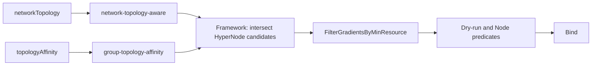
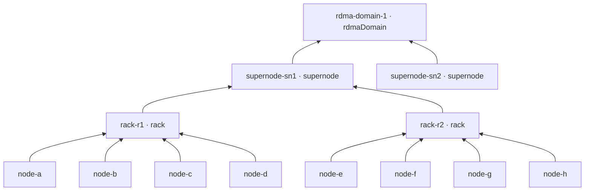
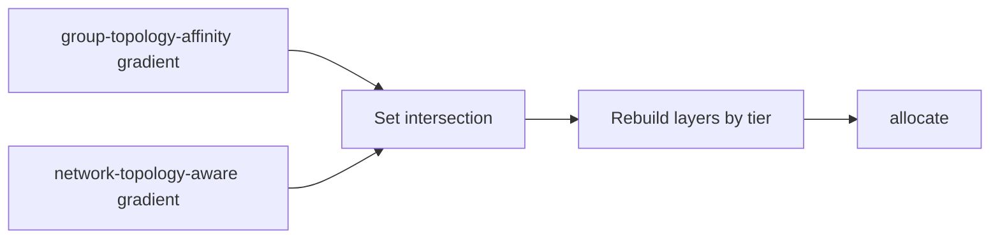
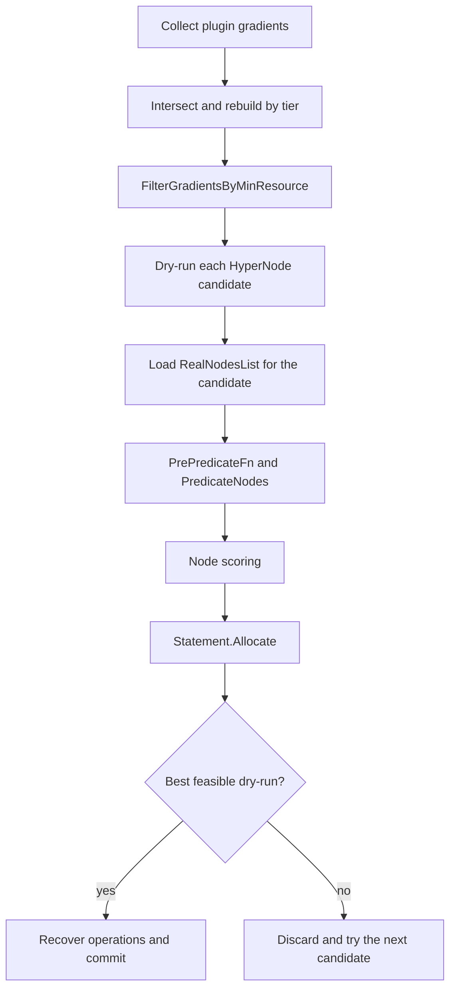

# PodGroup Topology Affinity Design

Author: wangyang0616 · May 28, 2026

---

## 1. Overview

Volcano can already schedule workloads on a HyperNode tree through `networkTopology`. That API defines the topology boundary within which a PodGroup or subGroup should be consolidated—for example, Gang-scheduling a workload within one rack or keeping an entire inference instance within one supernode.

This design adds group-level topology affinity and anti-affinity to the PodGroup API ([volcano-sh/volcano#5347](https://github.com/volcano-sh/volcano/issues/5347)). The new fields describe relationships between groups on the same topology tree rather than the placement of individual Pods within a subGroup.

It supports two classes of policy:

- **Across PodGroups:** separate multiple workload instances at a selected topology tier, such as placing inference replicas in different supernodes for fault isolation.
- **Within one PodGroup:** colocate or separate subGroups, such as spreading Prefill and Decode shards across racks while keeping a complete inference instance in one supernode.

These policies compose with `networkTopology`. They do not replace Pod-level `podAffinity` or `podAntiAffinity` in Pod templates.

## 2. Background and Motivation

[Network Topology Aware Scheduling](./Network%20Topology%20Aware%20Scheduling.md) allows a workload to be Gang-scheduled within a HyperNode domain. It answers the question: **where should this group be consolidated on the topology tree?**

Inference workloads also need to express **how multiple groups relate to one another**. These relationships exist at two levels:

- between different PodGroups
- between subGroups in the same PodGroup

Pod-level affinity is not sufficient for these cases because it evaluates individual Pods rather than Volcano scheduling groups and does not operate on HyperNode domains.

A common example is a model service with multiple inference instances, each represented by one PodGroup. Operators may require every instance to use a different supernode so that a single hardware failure cannot affect all replicas. Without a PodGroup-level policy, multiple instances may be placed in the same failure domain.

Another example is a Prefill–Decode workload. Shards of each role may need to spread across racks, while all Prefill and Decode subGroups belonging to the same instance must remain under one supernode. Without group topology affinity, users must split the workload into multiple PodGroups or maintain duplicate Pod-level rules that are not aligned with HyperNode Gang scheduling.

The `topologyAffinity` field introduced by this design provides a single declarative entry point for these relationships. It builds on the existing HyperNode model and remains separate from both `networkTopology` and Pod-level affinity.

## 3. Goals

1. **Cross-PodGroup fault-domain isolation:** allow users to select PodGroups by label and namespace selectors and place them in distinct domains at a specified HyperNode tier.
2. **Intra-PodGroup subGroup placement:** allow subGroups to be colocated or separated at a specified tier, covering shard spreading, role colocation, and cross-role isolation.
3. **Required constraints and preferred policies:** support mandatory placement rules as well as best-effort placement preferences.
4. **Composition with existing topology scheduling:** allow `topologyAffinity` and `networkTopology` to be used together to express group relationships and workload consolidation boundaries independently.
5. **Tier-based policy expression:** allow users to target fault domains such as racks and supernodes through `topologyTierName` or `topologyTier`, which refer to HyperNode `spec.tierName` and `spec.tier`, without enumerating Kubernetes Nodes.
6. **Stable, understandable scheduling outcomes:** keep a workload Pending when required rules cannot be satisfied and report whether the failure occurred at the HyperNode or Node dimension.

## 4. Non-Goals

| Item | Treatment |
| --- | --- |
| Topology consolidation or Gang scope | Continue to use `networkTopology` and `network-topology-aware`. |
| Pod-level affinity within one subGroup | Continue to use Pod template `podAffinity` and `podAntiAffinity`. |
| Cross-PodGroup or cross-namespace `subGroupAffinity` / `subGroupAntiAffinity` | Not supported. Peer SubJobs always belong to the same PodGroup UID. |
| Cross-PodGroup `podGroupAffinity` | Not supported. Use `networkTopology` or `subGroupAffinity` for colocation within one PodGroup. |
| Group topology constraints for backfill or optional members | Not covered. Workloads that rely on this feature must not use backfill to place those members. |
| Topology-driven preemption | The scheduler does not evict a matching PodGroup solely to clear a conflicting domain. Gang actions may reclaim resources only inside an already legal domain. |
| A new `TopologyUnsatisfiable` PodGroup condition | Reuse existing Events, Pod conditions, and fit summaries. |
| Batch Job or `PartitionPolicy` alignment | Not covered by this design. |

## 5. Proposal

### 5.1 Capability Model

Users may express placement intent at different tiers of the same HyperNode tree:

- **`networkTopology`** defines a consolidation boundary or Gang scope. It specifies where a PodGroup or subGroup may be placed, such as keeping all shards within one rack or an entire instance within one supernode.
- **`topologyAffinity.subGroupAffinity`** and **`subGroupAntiAffinity`** define relationships between SubJobs generated by `subGroupPolicy` entries in the same PodGroup.
- **`topologyAffinity.podGroupAntiAffinity`** separates the current PodGroup from other PodGroups selected by `podGroupSelector` and `namespaceSelector`.

The `network-topology-aware` and `group-topology-affinity` plugins participate in the same HyperNode scheduling path. Each plugin produces a topology-only HyperNode gradient. The Framework intersects all registered gradients. The allocate action then filters the result by minimum resources, performs placement dry-runs, evaluates Node predicates, and binds Pods.



Gradient callbacks follow a two-state contract:

- a non-empty gradient represents constrained candidates or an explicit pass-through search space
- a non-nil empty gradient represents rejection, including fail-closed behavior after an internal error

`nil` is not a third, no-op state. A registered callback that unexpectedly returns `nil` is treated as rejection and logged as an error. Only when no gradient callback is registered may the Framework fall back to the input root HyperNode.

### 5.2 PodGroup API

`PodGroupSpec` gains an optional `topologyAffinity` field. Existing `networkTopology`, `subGroupPolicy`, and Pod-level affinity fields remain unchanged.

`topologyAffinity` may contain the following blocks. Every block supports `required` and `preferred` terms. Each preferred term must set `weight` to a value from 1 to 100.

- **`podGroupAntiAffinity`:** separates the current PodGroup from other selected PodGroups. A `PodGroupAffinityTerm` contains a mandatory `podGroupSelector`, an optional `namespaceSelector`, and exactly one of `topologyTierName` or `topologyTier`. The current PodGroup is always excluded by UID.
- **`subGroupAffinity`:** requires all SubJobs generated by the listed `subGroupPolicy` entries in the current PodGroup to share one topology domain.
- **`subGroupAntiAffinity`:** spreads or isolates SubJobs generated from the listed `subGroupPolicy` entries in the current PodGroup.

The `subGroups` field always contains `subGroupPolicy[].name` values, not runtime SubJob identifiers.

#### SubGroup semantics

| Concept | Meaning | API location |
| --- | --- | --- |
| Policy name | A `subGroupPolicy[].name`, such as `prefill` or `decode` | `SubGroupAffinityTerm.subGroups` |
| SubJob | A schedulable unit generated by a policy, for example a group of Pods that share the same tuple of `matchLabelKeys` values | Runtime scheduler state only |

For `subGroupAffinity`, all SubJobs generated by the listed policies must share the same domain at the term's comparison tier.

For `subGroupAntiAffinity`, the number of policy names determines peer selection:

- **A single policy name**, such as `[prefill]`, selects intra-policy spreading. Every `prefill` SubJob must use a different domain from every other `prefill` SubJob.
- **Two or more policy names**, such as `[prefill, decode]`, select cross-policy isolation only. SubJobs generated by different listed policies may not share a domain, but SubJobs generated by the same policy may share a domain unless a separate single-policy term forbids it.

Multiple required terms are combined with AND. Adding a second policy name changes a term from intra-policy spreading to cross-policy isolation. Users that need both behaviors must declare separate terms.

#### PodGroup selection semantics

`podGroupAntiAffinity` is directional. A term is evaluated only from the PodGroup currently being scheduled. An existing PodGroup does not retroactively constrain a later PodGroup that has no matching rule of its own. Users must configure equivalent rules on all participants when bidirectional isolation is required.

Namespace selection follows Kubernetes affinity conventions:

- an omitted `namespaceSelector` selects only the current namespace
- an empty selector `{}` selects all namespaces
- a non-empty selector matches Namespace labels

`podGroupSelector` is then evaluated against PodGroup `metadata.labels` in the selected namespaces. The current PodGroup is excluded by UID. Selector parsing or Namespace lookup failures make a required term fail closed.

If a matching PodGroup occupies multiple domains at the comparison tier, all of those domains are excluded. Anti-affinity never reduces a multi-domain placement to a single LCA.

#### Constraint lifetime

Required and preferred policies affect new placement decisions. Updating a PodGroup, PodGroup label, Namespace label, or HyperNode tree does not evict running Pods. Subsequent allocations and retries use the latest Session snapshot.

A group may occupy more than one domain at a comparison tier. Occupancy is therefore derived as a set of domains from task placement rather than from a single Job or SubJob least common ancestor (LCA).

Tasks in `Allocated`, `Binding`, `Bound`, or `Running` state occupy a domain. A `Pipelined` task with a `NodeName` reserves its planned domain. `Releasing`, `Succeeded`, and `Failed` tasks do not occupy a domain. Persisted allocated-HyperNode information is used only as a conservative fallback when task placement is temporarily unavailable.

Required affinity and anti-affinity for the same pair of SubJobs are valid only when the affinity tier is strictly coarser than the anti-affinity tier. Using the same tier would require that pair to be both colocated and separated.

### 5.3 Scheduling Flow

`network-topology-aware` evaluates `networkTopology`. `group-topology-affinity` evaluates `topologyAffinity` and derives occupied domains from Jobs and Tasks in the current Session. The Framework intersects all enabled plugin gradients. The allocate action aggregates resources from Session Nodes, runs `FilterGradientsByMinResource`, and then performs HyperNode dry-runs and Node binding.

`JobInfo.RequiresHyperNodeAllocate()` determines whether this path is required. A hard `networkTopology` rule, a SubJob policy, required PodGroup anti-affinity, or preferred PodGroup anti-affinity causes the Job to enter `allocateForJob`. A PodGroup with preferred terms only must still receive a full-subtree gradient so that `HyperNodeOrderFn` can score candidates. If a supported topology policy is declared before the HyperNode cache is ready, the Job waits instead of falling back to ordinary Node scheduling. An empty `topologyAffinity: {}` is a no-op.

The Framework passes a `SearchPurpose` to every topology callback so that allocation and eviction planning preserve their respective ordering and capacity semantics.

### 5.4 Representative Scenarios

#### Example 1: Multi-instance fault isolation

When applied consistently to all replicas, the following policy places PodGroups with the same service label in different supernodes:

```yaml
apiVersion: scheduling.volcano.sh/v1beta1
kind: PodGroup
metadata:
  name: llama-70b-instance-0
  namespace: default
  labels:
    topology.volcano.sh/group: llama-70b-prod
spec:
  minMember: 8
  queue: default
  topologyAffinity:
    podGroupAntiAffinity:
      required:
      - podGroupSelector:
          matchLabels:
            topology.volcano.sh/group: llama-70b-prod
        topologyTierName: supernode
```

#### Example 2: Prefill–Decode shard spreading and instance colocation

Each unique tuple of values for the configured `matchLabelKeys` creates one SubJob. Prefill and Decode SubJobs are colocated in one supernode, while SubJobs of each role are spread across racks.

```yaml
apiVersion: scheduling.volcano.sh/v1beta1
kind: PodGroup
metadata:
  name: llama-70b-prefill-decode
  namespace: default
spec:
  minMember: 44
  queue: default
  subGroupPolicy:
  - name: prefill
    labelSelector:
      matchLabels:
        volcano.sh/role: prefill
    matchLabelKeys:
    - volcano.sh/shard-id
    subGroupSize: 8
    minSubGroups: 4
    networkTopology:
      mode: hard
      highestTierName: rack
  - name: decode
    labelSelector:
      matchLabels:
        volcano.sh/role: decode
    matchLabelKeys:
    - volcano.sh/shard-id
    subGroupSize: 6
    minSubGroups: 2
    networkTopology:
      mode: hard
      highestTierName: rack
  topologyAffinity:
    subGroupAffinity:
      required:
      - subGroups: [prefill, decode]
        topologyTierName: supernode
    subGroupAntiAffinity:
      required:
      - subGroups: [prefill]
        topologyTierName: rack
      - subGroups: [decode]
        topologyTierName: rack
```

PodGroup-level `networkTopology.highestTierName: supernode` may be used instead of `subGroupAffinity` when the entire PodGroup must share the same supernode. The two forms describe different scopes: the former covers the whole PodGroup, while the latter covers only the listed policies.

Cross-policy rack isolation can be added with a separate term:

```yaml
subGroupAntiAffinity:
  required:
  - subGroups: [prefill]
    topologyTierName: rack
  - subGroups: [decode]
    topologyTierName: rack
  - subGroups: [prefill, decode]
    topologyTierName: rack
```

The first two terms spread each role internally. The third prevents a Prefill SubJob from sharing a rack with a Decode SubJob.

#### Example 3: Preferred shard spreading

The following policy keeps the instance within one supernode but treats rack spreading as a preference:

```yaml
apiVersion: scheduling.volcano.sh/v1beta1
kind: PodGroup
metadata:
  name: llama-70b-soft-shard
  namespace: default
spec:
  minMember: 44
  queue: default
  networkTopology:
    mode: hard
    highestTierName: supernode
  subGroupPolicy:
  - name: prefill
    labelSelector:
      matchLabels:
        volcano.sh/role: prefill
    matchLabelKeys: [volcano.sh/shard-id]
    subGroupSize: 8
    minSubGroups: 4
  - name: decode
    labelSelector:
      matchLabels:
        volcano.sh/role: decode
    matchLabelKeys: [volcano.sh/shard-id]
    subGroupSize: 6
    minSubGroups: 2
  topologyAffinity:
    subGroupAntiAffinity:
      preferred:
      - subGroups: [prefill]
        weight: 100
        topologyTierName: rack
      - subGroups: [decode]
        weight: 100
        topologyTierName: rack
```

#### Example 4: Combined PodGroup and subGroup topology

A workload may use all three blocks together. Using the `subGroupPolicy` definitions from Example 2, the combined configuration fragment is:

```yaml
metadata:
  labels:
    topology.volcano.sh/group: llama-70b-prod
spec:
  topologyAffinity:
    podGroupAntiAffinity:
      required:
      - podGroupSelector:
          matchLabels:
            topology.volcano.sh/group: llama-70b-prod
        topologyTierName: supernode
    subGroupAffinity:
      required:
      - subGroups: [prefill, decode]
        topologyTierName: supernode
    subGroupAntiAffinity:
      required:
      - subGroups: [prefill]
        topologyTierName: rack
      - subGroups: [decode]
        topologyTierName: rack
```

This policy has the following effects:

- `podGroupAntiAffinity` at `supernode` separates service replicas.
- `subGroupAffinity` at `supernode` keeps the current instance together.
- `subGroupAntiAffinity` at `rack` spreads shards within each role.

The supernode affinity tier is coarser than the rack anti-affinity tier, so the rules are compatible.

## 6. Detailed Design

### 6.1 API Types

The serialized API contract is defined in `staging/src/volcano.sh/apis/pkg/apis/scheduling/v1beta1/types.go`. Field names, nesting, and term types must remain unchanged.

```go
type PodGroupSpec struct {
    // Existing fields omitted.
    TopologyAffinity *TopologyAffinitySpec `json:"topologyAffinity,omitempty"`
}

type TopologyAffinitySpec struct {
    PodGroupAntiAffinity *PodGroupAntiAffinity `json:"podGroupAntiAffinity,omitempty"`
    SubGroupAffinity     *SubGroupAffinity     `json:"subGroupAffinity,omitempty"`
    SubGroupAntiAffinity *SubGroupAntiAffinity `json:"subGroupAntiAffinity,omitempty"`
}

type PodGroupAntiAffinity struct {
    Required  []PodGroupAffinityTerm `json:"required,omitempty"`
    Preferred []PodGroupAffinityTerm `json:"preferred,omitempty"`
}

type PodGroupAffinityTerm struct {
    Weight            int32                 `json:"weight,omitempty"`
    PodGroupSelector  *metav1.LabelSelector `json:"podGroupSelector"`
    NamespaceSelector *metav1.LabelSelector `json:"namespaceSelector,omitempty"`
    TopologyTierName  string                `json:"topologyTierName,omitempty"`
    TopologyTier      *int32                `json:"topologyTier,omitempty"`
}

type SubGroupAffinity struct {
    Required  []SubGroupAffinityTerm `json:"required,omitempty"`
    Preferred []SubGroupAffinityTerm `json:"preferred,omitempty"`
}

type SubGroupAntiAffinity struct {
    Required  []SubGroupAffinityTerm `json:"required,omitempty"`
    Preferred []SubGroupAffinityTerm `json:"preferred,omitempty"`
}

type SubGroupAffinityTerm struct {
    SubGroups        []string `json:"subGroups"`
    Weight           int32    `json:"weight,omitempty"`
    TopologyTierName string   `json:"topologyTierName,omitempty"`
    TopologyTier     *int32   `json:"topologyTier,omitempty"`
}
```

`weight` is meaningful only in a `preferred` list. It must be omitted from a `required` list and therefore deserializes to zero. A preferred term must use a value in `[1, 100]`. The same term types are intentionally shared by both lists, so this contextual rule is enforced by CRD or Admission validation.

Preferred scoring never weakens a required constraint. Candidate scores start at `1.0`. Every conflicting preferred term subtracts `term.weight / 100`, with the result clamped to zero. The plugin then multiplies the value by its configured weight and `MaxNodeScore`. Job-level selection sums the allocation scores of its SubJobs.

The tier fields align with the existing `networkTopology` API:

| Purpose | Named tier | Numeric tier |
| --- | --- | --- |
| Consolidation boundary (`networkTopology`) | `highestTierName` | `highestTierAllowed` |
| Affinity or anti-affinity term | `topologyTierName` | `topologyTier` |

### 6.2 Topology Domain Semantics

Rules compare **topology domain names**, not Kubernetes Node hostnames. For a candidate HyperNode and a term comparison tier, the scheduler considers the candidate itself and then walks toward the root until it finds a HyperNode at that tier. That HyperNode's name is the domain identifier, denoted `Domain_T`.

A candidate at or below the comparison tier maps to exactly one `Domain_T`. A coarser candidate spans multiple domains and is not a legal final candidate for a required term. A required term fails closed if its tier cannot be resolved or the candidate has no ancestor at that tier.

Required affinity must match every established peer anchor. If peer SubJobs already occupy more than one domain at the affinity tier, no new candidate can satisfy the rule; existing Pods continue running, while new placement remains Pending. Required anti-affinity excludes every domain occupied by an applicable peer.

A preferred term applies its penalty only when the candidate resolves to an occupied domain at the term tier. Failure to map `topologyTierName` or `topologyTier` to a known tier is an error. If the tier is valid but neither the candidate nor any ancestor belongs to that tier, the candidate receives no penalty. Neither case allows a preferred rule to weaken a required rule.

The following reference topology uses increasing tier values toward the root:



`topologyTier` maps to HyperNode `spec.tier`: a larger value denotes a coarser domain closer to the root. In the reference topology, `supernode > rack`.

### 6.3 Occupancy and Placement State

The source of truth for occupancy is Session task placement. The scheduler does not require a separately maintained `TopologyOccupancyIndex`.

For every task in an occupying state, the scheduler resolves:

```text
NodeName -> finest HyperNode -> ancestor at the term tier -> Domain_T
```

This produces an exact set of occupied domains even when one Job spans sibling domains. Expanding a single LCA would incorrectly mark unoccupied siblings as occupied.

If a task cannot temporarily be mapped to a HyperNode, the scheduler resolves the recorded `AllocatedHyperNode` at the term tier. When the recorded HyperNode is coarser than the term tier, `ResolveHyperNodesAtTier` expands it to all term-tier domains below that subtree. This fallback may conservatively block extra domains, but it never relaxes a required rule. Exact placement replaces the fallback as soon as it becomes available.

The scheduler cache recalculates allocated-HyperNode placement when assigned tasks are added, deleted, or moved. `JobUpdater` persists changes to the PodGroup annotation, providing a conservative fallback after a scheduler restart or whenever a Session temporarily lacks complete task placement.

Statement operations update task state and `NodeName` transactionally. A placement scan therefore sees earlier decisions in the same dry-run. Discarding a candidate restores task state, Node state, and Job/SubJob placement. A performance optimization may add a Session-local index derived from task placement, but that index must remain rebuildable and must not become an independent source of truth.

Placed peer SubJobs establish affinity anchors and anti-affinity exclusion domains. If no peer has been placed, the first feasible SubJob establishes the anchor. SubJobs must be evaluated in a deterministic order. Tentative placements selected for an earlier SubJob remain visible while later SubJobs are evaluated, and abandoning a Job-level candidate rolls back the complete trial. Preferred scores never make an empty required candidate set schedulable.

### 6.4 Plugin Gradient Composition

`group-topology-affinity` registers Job and SubJob gradient callbacks. Required PodGroup terms are evaluated at both levels so that an allocated Job or SubJob search root cannot escape the policy. SubGroup terms are evaluated only for SubJob callbacks and only against peer SubJobs from the same PodGroup.

When no required term applies, the plugin returns the full subtree below the current search root. This explicit pass-through behavior supports preferred-only scoring and preserves correct intersection with other plugins.

The Framework intersects gradients by HyperNode name, not by layer index:



| Callback result | Meaning | Framework behavior |
| --- | --- | --- |
| Non-nil empty slice | Required constraints have no legal candidate, or evaluation failed closed | Participate in statistics and make the final intersection empty |
| Non-empty gradient | Constrained candidates or explicit pass-through candidates | Intersect names with every other plugin, then rebuild layers by tier |

The Framework treats an unexpected `nil` result from a registered callback like an empty result and logs a contract violation. It never skips that plugin. If no callbacks are registered at all, the input root HyperNode is returned as the compatibility fallback.

After intersection, `rebuildGradientsByTier` sorts HyperNodes by name within a tier to keep tests and victim selection deterministic. Tier order depends on `SearchPurpose`:

- `PurposeAllocate`: fine to coarse
- `PurposeEvict`: coarse to fine

Eviction candidates are intersected before `GetCandidateDomains(maxDomains)` applies its single global limit. No plugin may independently truncate its candidate set before intersection.

### 6.5 HyperNode Selection and Node Binding

HyperNode scheduling uses two levels:

1. **HyperNode selection** chooses a topology subtree that satisfies `networkTopology`, `topologyAffinity`, and, when a resource lower bound is available, minimum aggregate capacity.
2. **Node selection** chooses a Kubernetes Node for each task within that subtree by running the existing predicate and scoring plugins.



Node-level behavior remains unchanged. Taints, resources, ports, volumes, DRA, queue overuse, and Node scoring are still evaluated by the existing Node path. Passing all topology checks does not guarantee that a member Node passes predicates.

The resource filter removes empty layers from the gradient. Allocate iterates the remaining HyperNodes, then proceeds to the next surviving layer. If a legal HyperNode fails its Node dry-run, allocate tries the next candidate. A candidate is committed only when the corresponding Job or SubJob dry-run satisfies the existing Gang readiness or pipelining rules. If no candidate remains, the workload stays Pending and the collected HyperNode and Node reasons are reported together.

#### HyperNode resource pre-filter

Gradient callbacks answer **where topology permits placement**. `FilterGradientsByMinResource` answers **which of those domains can provide the minimum aggregate resources** before an expensive dry-run.

The filter runs after plugin intersection because a topology-only plugin does not own a resource ledger, and intersection may produce candidates that were never checked by another plugin's internal traversal.

For Job allocation, the filter uses `job.GetMinResources()`. If the PodGroup does not declare `minResources`, existing semantics are preserved and no new inferred Job-wide resource threshold is introduced.

For SubJob allocation, the filter uses `subJob.GetMinResources()`, which sums `InitResreq` for Pending tasks in the current Session. This value is recalculated for every scheduling attempt.

For each candidate, resources are aggregated from Session Nodes in `RealNodesSet[hyperNode]`:

```text
idle       = sum(node.Idle)
futureIdle = sum(node.FutureIdle())

eligible if minResource <= idle OR minResource <= futureIdle
```

The filter is skipped when placement is already established, when `minResource` is absent, or when no reliable real-Node membership is available. In the last case, the candidate is conservatively retained. The Node dry-run remains the final authority.

This filter applies only to `PurposeAllocate`. Gang preemption and reclaim use total allocatable capacity for `PurposeEvict`, because those actions are evaluating whether resources could become available after eviction.

### 6.6 Gang Preemption, Reclaim, and Nomination

Gang preemption and reclaim reuse the aggregated HyperNode gradient callbacks to choose legal candidate domains. They may reclaim resources inside a domain that already satisfies every required topology rule, but they do not evict a matching PodGroup solely to remove an anti-affinity conflict.

The following rules apply:

1. `GetCandidateDomains` evaluates Job gradients with `PurposeEvict`. An empty required result produces no eviction plan and never falls back to the cluster root.
2. Required `podGroupAntiAffinity` filters Job-level eviction domains. If any required HyperNode constraint exists, Gang simulation must also evaluate SubJob gradients.
3. `network-topology-aware` checks total allocatable capacity for eviction planning. Group topology continues to filter legal domains even when no hard `networkTopology` is present.
4. The Framework intersects complete plugin results, orders them from coarse to fine, and only then applies `maxDomains`.
5. Statement operations applied to victims are transactional. A victim in `Releasing` no longer occupies a domain during that simulation; discarding the simulation restores the occupancy.
6. Preferred policies do not make a domain illegal and are not, by themselves, a reason to select eviction victims.
7. `NominatedHyperNode` is a planning hint, not an authorization to bypass current constraints. `allocateFromNomination` re-evaluates required Job and SubJob gradients with `PurposeAllocate`. A stale nomination is cleared before normal gradient search resumes.
8. A successful nomination path updates task, SubJob, and Job placement consistently and clears the fulfilled nomination.

### 6.7 Failure Handling and Diagnostics

Scheduling failures are aggregated independently at the HyperNode and Node dimensions:

```text
Plugin gradients
  -> HyperNodeGradientStats
  -> HyperNodeMinResourceFilterStats
  -> FormatHyperNodeFitSummary
  -> JobInfo.JobFitErrors

Node dry-run and predicates
  -> JobInfo.NodesFitErrors

JobFitErrors + NodesFitErrors
  -> FormatSchedulingDimensions / JobInfo.FitError()
  -> PodGroup Unschedulable condition and Warning Event
  -> Pod PodScheduled=False and FailedScheduling Event
```

The HyperNode summary records candidate counts by plugin and tier, the post-intersection count, resource-filter exclusions, and stable exclusion labels. The group topology plugin must report the rule that caused an exclusion rather than exposing its plugin name. User-facing labels are:

- `podGroupAntiAffinity`, `subGroupAffinity`, or `subGroupAntiAffinity` for the corresponding group topology rule
- `networkTopology` for `network-topology-aware`
- `minResource` for aggregate resource filtering

Unknown plugins fall back to their plugin name. Reasons and tier names are sorted to keep messages deterministic.

`allocateForJob` stores a HyperNode summary even when the intersection is non-empty so that a later Node predicate failure retains the topology context. Job-level errors form the dry-run baseline. Candidate retries clear only Node errors; SubJob HyperNode failures are merged with a `subJob <id>:` prefix instead of replacing the Job-level reason.

Example:

```text
HyperNode: 1/4 hyperNodes available (minResource: cpu 8):
supernode 1/2 (1 podGroupAntiAffinity); rack 0/2 (1 networkTopology, 1 minResource);
Node: worker-0: In hyperNode sn-b: 0/3 nodes are unavailable: 2 Insufficient cpu, 1 node(s) pod number exceeded
```

The scheduler reuses existing conditions and Events:

- PodGroup: `Warning/Unschedulable` Event and the existing `Unschedulable` condition
- Pod: `PodScheduled=False` and `Warning/FailedScheduling` Event

Pod status is updated only when the condition reason, message, or nominated Node changes, preventing duplicate updates.

Logging uses the following levels:

- V(3): Session tier inventory, gradient evaluation, filtering summaries, candidate dry-runs, and final selection
- V(4): preferred-score details
- V(5): no-solution details for a tier or Job
- Error: internal construction, lookup, or restore failures

Internal errors retain full detail in logs while user-facing summaries report a fail-closed unschedulable result.

### 6.8 Admission Validation

Validation applies to both CREATE and UPDATE. UPDATE validates the new topology specification but must not repeat create-only checks, such as requiring the current Queue state to be Open, for unrelated metadata or status changes.

Admission validates structure and static semantics:

1. Every term must set exactly one of `topologyTierName` and `topologyTier`. A numeric tier must be non-negative. Admission does not require a live HyperNode informer to prove that a tier currently exists.
2. Every `subGroups` entry names an existing `spec.subGroupPolicy[].name`, and a term contains no duplicates.
3. Every `subGroupAffinity` term contains at least two distinct policy names.
4. Every `subGroupAntiAffinity` term contains at least one policy name. A single-name term must reference a policy capable of producing multiple SubJobs; with the current grouping model, that requires non-empty `matchLabelKeys`. A multi-name term contains at least two distinct policies.
5. Every `podGroupAntiAffinity` term contains a valid `podGroupSelector`. If present, `namespaceSelector` must also be a valid Kubernetes label selector.
6. A required term must omit `weight` or set it to zero. A preferred term must set `weight` to a value in `[1, 100]`.
7. If the same SubJob pair is constrained by both required affinity and required anti-affinity, the affinity tier must be strictly coarser than the anti-affinity tier. Obvious same-tier contradictions are rejected.
8. An empty `topologyAffinity` object or empty term list is a no-op. Malformed terms are rejected rather than interpreted as unconstrained requests.

Admission cannot determine which scheduler action will eventually place an optional Pod. Backfill compatibility must therefore be enforced through scheduler configuration until backfill supports the same required filtering and preferred scoring semantics.

At runtime, an unknown or changed tier in a required term returns a non-nil empty gradient. A preferred-tier resolution failure returns an error from `HyperNodeOrderFn`. Neither path silently ignores the term.

### 6.9 Scheduler Configuration

Both HyperNode plugins must enable their gradient and order hooks:

```yaml
actions: "enqueue, allocate, gangreclaim, gangpreempt"
tiers:
- plugins:
  - name: gang
  - name: predicates
  - name: group-topology-affinity
    enabledHyperNodeGradient: true
    enabledHyperNodeOrder: true
    arguments:
      weight: 10
  - name: network-topology-aware
    enabledHyperNodeGradient: true
    enabledHyperNodeOrder: true
    arguments:
      weight: 10
```

The action list is illustrative and must follow the deployment's supported configuration. A scheduler that serves workloads using group topology rules must route them through `allocate` and must not place their optional members through backfill. If actions cannot be isolated by workload, that scheduler instance must omit `backfill`.

Installing the API without enabling `group-topology-affinity` causes `topologyAffinity` to have no scheduling effect. CRDs, Admission configuration, and scheduler plugin configuration must therefore be deployed consistently. User documentation must call out this requirement.

### 6.10 Code Mapping

| Area | Location |
| --- | --- |
| API types | `staging/src/volcano.sh/apis/pkg/apis/scheduling/v1beta1/types.go` |
| Term helpers, selectors, task-placement occupancy, and placement predicates | `pkg/scheduler/api/topology_affinity_info.go`, `pkg/scheduler/api/job_info.go` |
| HyperNode ancestry, tier resolution, and tier logging | `pkg/scheduler/api/hyper_node_info.go` |
| Plugin and registration | `pkg/scheduler/plugins/group-topology-affinity/`, `pkg/scheduler/plugins/factory.go` |
| Gradient contract, intersection, and statistics | `pkg/scheduler/framework/session_plugins.go`, `pkg/scheduler/api/unschedule_info.go` |
| Resource pre-filter and allocate dry-runs | `pkg/scheduler/actions/allocate/allocate.go`, `pkg/scheduler/actions/allocate/recorder.go` |
| Placement synchronization and annotation persistence | `pkg/scheduler/cache/event_handlers.go`, `pkg/scheduler/framework/job_updater.go` |
| PodGroup and Pod Events and conditions | `pkg/scheduler/cache/cache.go`, `pkg/scheduler/plugins/gang/gang.go` |
| Gang domain planning and simulation | `pkg/scheduler/actions/utils/`, `pkg/scheduler/actions/gangpreempt/`, `pkg/scheduler/actions/gangreclaim/` |
| Admission validation | `pkg/webhooks/admission/podgroups/validate/validate_podgroup.go` |

### 6.11 Validation Strategy

Validation covers API behavior, scheduling semantics, plugin composition, state lifecycle, and observability:

| Area | Required coverage |
| --- | --- |
| API and CRD | Published manifests preserve all fields; contextual weight validation; selector validation; tier one-of; CREATE and UPDATE |
| Domain resolution | Named and numeric tiers; candidates below, at, or above the comparison tier; heterogeneous trees and missing ancestors; one Job occupying multiple domains |
| PodGroup rules | Same namespace; `namespaceSelector: {}`; Namespace-label selection; self-exclusion; directional rules; required fail-closed behavior; preferred scoring; preferred-only routing; HyperNode cache readiness |
| SubGroup rules | Single-name intra-policy spreading; multi-name cross-policy isolation; combined terms; affinity anchors; partial placement; deterministic SubJob order; dry-run rollback |
| Plugin composition | Pass-through plus constrained; multiple constrained plugins; non-nil empty result; unexpected `nil`; no-callback root fallback; empty intersection; stable ordering; Job and SubJob gradients; exact preferred scores |
| Resource pre-filter | Explicit Job minimum; absent Job minimum; Pending SubJob requests; rescheduling after membership changes; idle and future-idle; existing placement bypass; missing real-Node membership; statistics |
| Diagnostics | Job baseline plus SubJob summaries; HyperNode and Node dimensions; stable labels and tier order; PodGroup and Pod Events; status-update deduplication; log levels |
| Placement lifecycle | Task add and delete; annotation write-back; Pipelined task with NodeName; releasing and terminal tasks; Statement rollback; restart fallback; sibling-domain occupancy |
| Gang eviction | Reclaim inside legal domains; total-allocatable pruning; no root fallback; intersection before ordering and limit; simulation visibility and rollback; nomination acceptance, invalidation, and normal search |
| Combined lifecycle | PodGroup plus SubGroup plus `networkTopology`; scheduler restart; release and deletion; label changes; HyperNode topology changes; scale and performance regression |

## 7. Future Extensions

The following capabilities require separate designs but can be added without invalidating the API semantics defined here:

| Topic | Description |
| --- | --- |
| Topology-driven preemption | Evict matching lower-priority PodGroups specifically to clear a conflicting domain. |
| Backfill support | Apply required filtering and preferred scoring consistently to optional members placed by backfill. |
| Enqueue pre-check | Optionally detect global domain exhaustion before allocate. |
| API-level observability | Add a resolved topology-domain annotation for subGroups or a `TopologyUnsatisfiable` PodGroup condition. |
| Cross-PodGroup affinity | Add `podGroupAffinity` for colocation between PodGroups. |
| Cross-PodGroup subGroup rules | Extend subGroup relationships beyond a single PodGroup UID or namespace. |
| Training workloads | Align group topology semantics with Batch Job and `PartitionPolicy`. |

## 8. References

- [Network Topology Aware Scheduling](./Network%20Topology%20Aware%20Scheduling.md)
- [Topology Support for the Preempt Action](./preempt-action-support-topology.md)
