# Volcano Repack 技术设计

## 1. 文档定位

本文是 Repack 的唯一技术设计文档，描述当前实现的架构、模块交互、基础模型、详细算法、执行协议、可靠性、性能和测试策略。

文档边界如下：

- 社区评审所需的背景、动机、目标和概要方案见 [Repack Proposal](./repack-runtime-defragmentation.md)；
- 用户场景、开启方式、渐进示例、FAQ 和完整 CR 字段说明见 [Repack 用户指南](../user-guide/how_to_use_repack.md)；
- 本文以当前代码为事实来源，不保留已经废弃的 API、双算法草案或历史修订过程。

## 2. 设计目标与核心不变量

Repack 的技术目标是在在线集群中及时生成一个可执行、可解释且影响范围受控的资源整理计划。实现必须长期保持以下不变量：

| 不变量 | 要求 |
|---|---|
| 调度一致性 | 每个计划迁移都通过 Volcano Scheduler 的完整过滤语义验证 |
| 授权边界 | 不驱逐 `scope.podGroups` 之外的工作负载，不腾空 `scope.nodes` 之外的节点 |
| 执行预算 | 完整计划不突破 `maxPerRun.podGroups` 和目标资源迁移量 |
| 收益门槛 | 计划至少释放一个完整目标资源节点，并满足碎片改善阈值 |
| 计划可审计 | Execute 不用实际结果覆盖原始 `status.plan` |
| 调度单一写入者 | Repack 不 bind Pod；Volcano Scheduler 是最终调度与绑定者 |
| 不预留资源 | nomination 只提供软性节点建议，不形成资源锁定 |
| Execute 串行 | 单集群同一时刻最多一个 Execute，并保留完成后的冷却窗口 |
| 幂等恢复 | 驱逐意图、替身认领和终态写入可在组件重启后恢复 |

## 3. 总体架构

### 3.1 组件关系


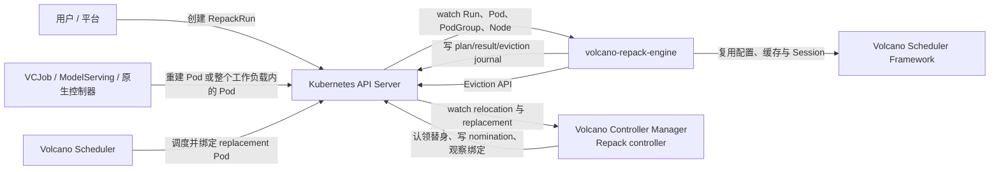

组件职责：

- **API Server**：保存 Run 和运行对象；CRD/CEL 校验 `mode`、单目标资源和 spec 不可变等规则；
- **Repack Engine**：Run 生命周期驱动者，负责快照、规划、计划持久化、Eviction、实时接收节点选择和结果度量；
- **Repack controller**：默认内置于 Volcano Controller Manager，负责 TTL、PodGroup placement lease、替身 Pod 认领、gate 释放、nomination 和实际绑定观察；
- **Volcano Scheduler**：对重建 Pod 执行真实调度和绑定；
- **工作负载控制器**：在 Pod 被驱逐后负责重建业务 Pod，Repack 不直接创建业务实例。

Engine 和 controller 只通过 Kubernetes 对象协作，不建立私有 RPC。controller 也可作为独立模块构建，但标准部署不得同时启动内置和独立实例。

### 3.2 分层架构

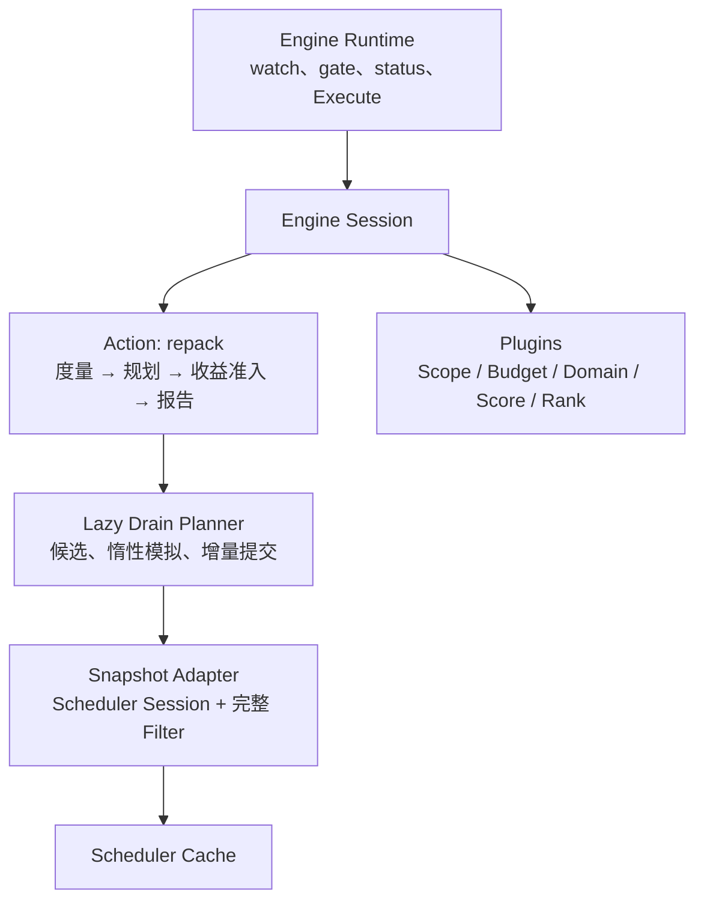

各层职责必须保持清晰：

- Engine Runtime 管理外部副作用、工作队列与持久状态；
- Action 表达稳定业务流程；
- Plugin 表达可组合的场景策略；
- Planner 只负责通用搜索和增量状态；
- Adapter 将 Scheduler Session 暴露为 Repack 所需的只读快照与可行性接口；
- API 包保存无框架依赖的碎片、移动和中断聚合模型。

## 4. 端到端交互

### 4.1 DryRun

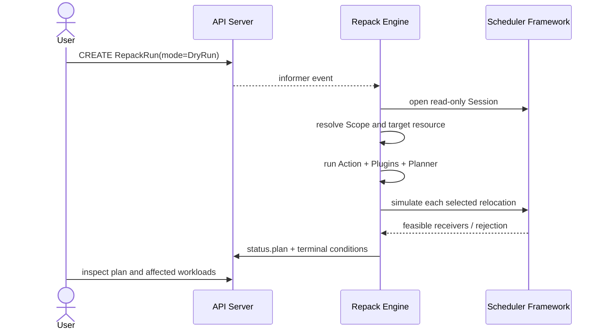

DryRun 无 Eviction、relocation journal 和 replacement placement。Run 成功不等于一定有迁移计划：`NoFragmentation` 和 `InsufficientImprovement` 都是正常终态结果。

### 4.2 Execute

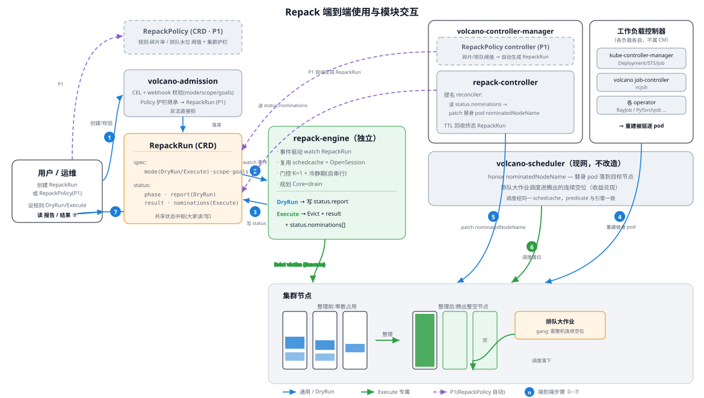

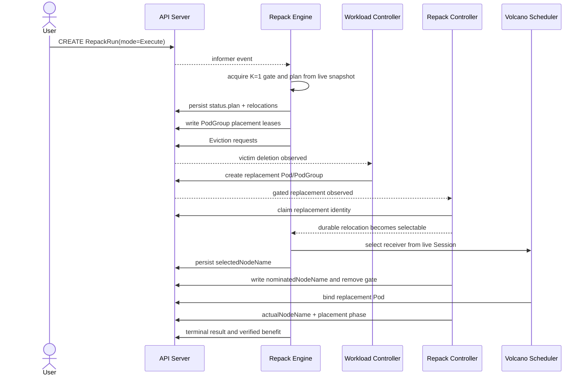

Execute 不执行历史 DryRun 的 plan，而是重新规划。这样避免将已经过期的快照决策直接用于驱逐。

### 4.3 CR 写入所有权

| 状态区域 | 写入者 | 说明 |
|---|---|---|
| `status.phase/conditions/message/time` | Engine；TTL 删除由 controller | Conditions 是权威状态，phase 是投影 |
| `status.plan` | Engine | DryRun/Execute 均写；生成后保持计划事实不变 |
| `status.result` | Engine | Execute 实际接受量和终态收益 |
| `relocations[].eviction` | Engine | Eviction 请求和恢复 journal |
| replacement identity / PodGroup generation | controller | 认领具体替身及新一代 PodGroup |
| `placement.selectedNodeName` | Engine | 基于实时 Scheduler Session 选择 |
| nomination、gate 释放、`actualNodeName` | controller | 写 Pod 建议节点并观察最终绑定 |

所有状态更新使用冲突重试。终态投影在写失败时保存在 Engine 内存中，重试只重新写状态，不重新执行驱逐副作用。

## 5. RepackRun API 设计

### 5.1 Spec

`RepackRun` 是 cluster-scoped、一次性且 spec 不可变的资源。

| 字段 | 语义 | 关键约束 |
|---|---|---|
| `mode` | `DryRun` 或 `Execute` | 两种独立执行模式 |
| `scope.podGroups` | 允许驱逐的工作负载范围 | include 为 selector 与 names 并集，exclude 优先 |
| `scope.nodes` | 允许作为腾空源的节点范围 | 不限制 receiver |
| `goals[0].resource` | 目标扩展资源 | 最多一个；必须为带 `/` 的扩展资源 |
| `goals[0].minFragImprovementPercent` | 最低碎片改善百分点 | `0～100` |
| `maxPerRun.podGroups` | 最大受影响工作负载数量 | 指针区分省略与显式 0 |
| `maxPerRun.resources` | 最大目标资源迁移量 | 当前按目标资源读取 |
| `eviction.gracePeriodSeconds` | Eviction 请求的优雅终止秒数 | 不影响候选选择 |
| `ttlSecondsAfterFinished` | 终态后自动删除时间 | 类似 Job TTL |

Scope 省略表示在全集群评估，但不代表所有 Pod 都可移动；movability 仍要求目标资源、Volcano Scheduler、PodGroup、控制器可重建性和其他插件规则成立。

业务用户通常只需维护工作负载标签。VCJob、ModelServing 或通用 pg-controller 应将稳定业务标签继承到 PodGroup，Scope 的 label selector 最终匹配 PodGroup 标签。

### 5.2 Status

```text
status
├── phase / conditions / message / startTime / completionTime
├── plan                         # 计划事实，DryRun/Execute 共用
│   ├── summary                  # 碎片率、释放节点数、迁移卡数、解析后 Scope
│   ├── moves[]                  # 按工作负载聚合的计划迁移
│   └── freedNodes[]             # 预计腾空节点
├── result                       # Execute 实际结果
└── relocations[]                # Execute 逐 Pod journal
    ├── eviction                 # Engine-owned
    └── placement                # Engine + controller 分工
```

`plan` 和 `result` 必须分离：

- `plan` 回答规划时决定了什么；
- `result` 回答实际接受了多少驱逐、最终释放了哪些节点以及收益是否来自一致快照；
- `relocations` 回答每个 Pod 在驱逐和重建链路中发生了什么。

`metricsVerified=false` 表示终态无法从替身绑定后的同一 Scheduler 快照可靠计算收益。此时结果仍保留已经接受的驱逐量，但碎片率和释放节点数据不能作为已验证收益。

### 5.3 生命周期

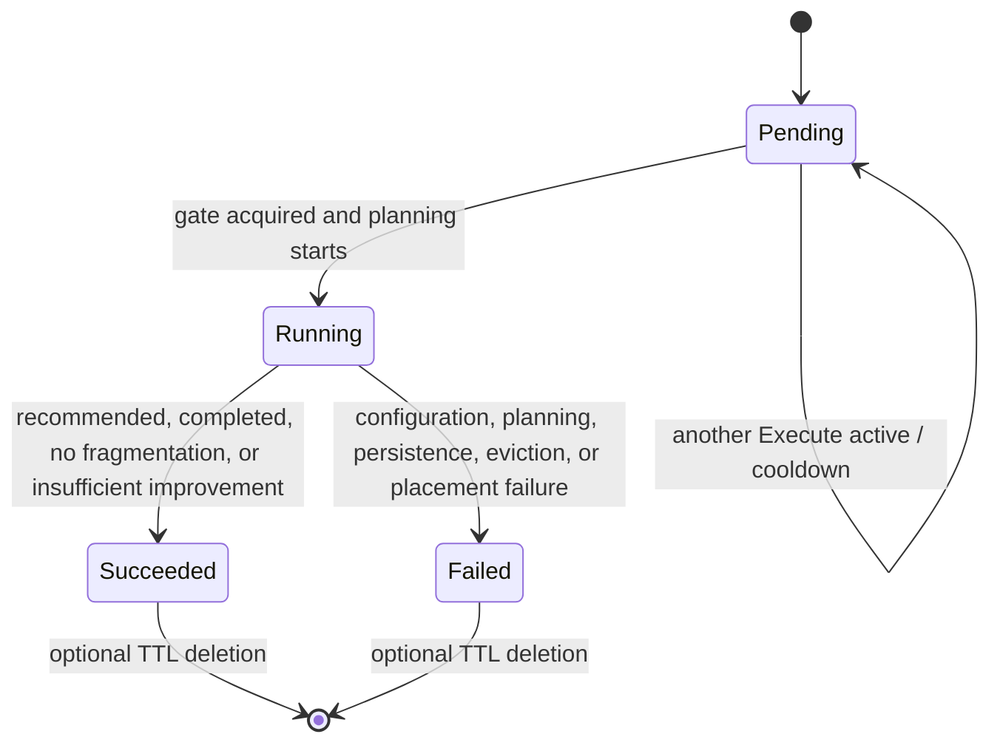

Conditions 是权威状态：

- `Progressing=True` 表示正在规划或执行；
- `Progressing=False` 可解释等待 gate/cooldown；
- `Complete=True` 表示正常终态，其 reason 区分 `RepackRecommended`、`ExecutionCompleted`、`NoFragmentation` 和 `InsufficientImprovement`；
- `Failed=True` 表示非预期失败。

## 6. 基础模型

### 6.1 目标资源与节点分类

当前只支持单一 scalar extended resource。节点按 `Used[R]` 与 `Allocatable[R]` 分类：

| 分类 | 条件 | 源节点 | 接收节点 |
|---|---|---:|---:|
| 空节点 | `Used[R] == 0` | 否 | 否 |
| 部分占用 | `0 < Used[R] < Allocatable[R]` | 是 | 有 scheduler-visible slack 时是 |
| 满卡节点 | `Used[R] >= Allocatable[R]` | 否 | 否 |

空节点不作为 receiver，避免为了腾空一个节点而点亮另一个完整空节点；满卡节点已经完成装箱，不进入源候选或接收排序。该边界在 Plugin 运行和评分之前由 Planner 统一保证，关闭某个可选 Plugin 不会改变。

### 6.2 Movability

目标资源 Pod 同时满足以下条件才可进入 victim 集合：

- 请求目标扩展资源；
- `schedulerName` 属于 Engine 复用的 Volcano Scheduler；
- 能映射到 Scheduler `JobInfo`/PodGroup；
- 位于 `scope.podGroups` 授权范围；
- 不是不可重建或其他 Movable Plugin 否决的对象。

不请求目标资源的 DaemonSet、系统 Pod 和普通 Pod 不参与迁移，也不会因为自身存在阻止目标资源腾空。请求目标资源但不可移动的 Pod 会使所在 Unit 不可腾空。

### 6.3 Scope

Scope 在两个轴上独立解析：

- PodGroup Scope 决定哪些工作负载允许被驱逐；
- Node Scope 决定哪些节点允许作为腾空目标。

Node Scope 不约束 receiver。接收范围由快照、目标资源和 Pod 原生调度约束决定。若业务必须留在某个节点池，应在工作负载上声明 node affinity、taint/toleration 等调度约束，而不是依赖 Repack Scope。

### 6.4 碎片度量

对目标资源 `R`：

```text
FragmentationRate(R)
  = (OccupiedNodeCount(R) - OptimalOccupiedNodeCount(R))
    / ProvidingNodeCount(R)
```

- `ProvidingNodeCount`：`Allocatable[R] > 0` 的节点数；
- `OccupiedNodeCount`：正在使用 `R` 的节点数；
- `OptimalOccupiedNodeCount`：保持当前请求不变、按节点容量紧凑放置的理论最少节点数。

该指标衡量节点占用紧凑度，不声明某个未来作业一定可调度。Scope 只限制动作范围，不改变集群级碎片率分母。计划前后差值用于收益门控，并限制在 `0～100%`。

### 6.5 Gang 中断模型

对 PodGroup `g`：

```text
slack(g) = max(Running(g) - MinAvailable(g), 0)
breached(g) = movedPods(g) > slack(g)

damagedResource(g) = movedResource(g),  if not breached
                   = footprint(g),      if breached
```

这是一种阶跃式业务影响模型：在弹性副本范围内迁移按实际资源计损；一旦低于 `MinAvailable`，按整个工作负载目标资源规模计损。

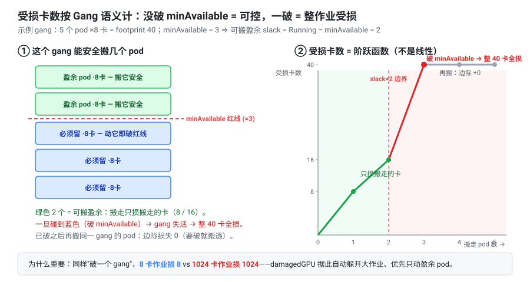

## 7. Action 与 Plugin 框架

### 7.1 Action 主流程

当前实现只有 `repack` Action：

1. 计算整理前碎片；
2. 调用 Lazy Drain Planner；
3. 通过 Session constraint 检查完整计划收益；
4. 汇总工作负载影响与迁移成本；
5. 生成 plan/report 交给 Engine Runtime 持久化。

Action 不直接调用 Eviction。Execute 副作用只在 plan 和 relocation journal 持久化后由 Engine Runtime 提交。

### 7.2 Session 扩展点

| 回调 | 聚合方式 | 用途 |
|---|---|---|
| `MovableFn` | AND | 任一 Plugin 可否决 Pod 移动 |
| `DomainFn` | Union | 贡献 Node、未来 HyperNode 等 FreeableUnit |
| `CandidateFilterFn` | 规范化顺序短路 | 评分前硬过滤预算等条件 |
| `DisruptionScoreFn` | 逐维归一化加权 | 候选软排序 |
| `VictimOrderFn` | 字典序比较器链 | 调度模拟中的 Pod 顺序 |
| `ReceiverPoolFn` | 链式交集裁剪 | 构造 receiver universe |
| `ReceiverRankFn` | 分阶段字典序 | 接收节点排序 |
| `ConstraintFn` | AND | 完整计划收益和最终硬约束 |

Plugin 配置顺序不表达策略优先级。Framework 复制配置并按插件名规范化后打开 Session，确保 YAML 重排不改变结果。

### 7.3 内置 Plugin

| Plugin | 责任 | 关闭后的影响 |
|---|---|---|
| `workloadscope` | 工作负载授权边界 | 不应用用户工作负载 Scope |
| `repackbudget` | `maxPerRun` 候选过滤 | 不应用对应预算 |
| `nodeconsolidation` | 提供部分占用 Node Unit | 当前无 Domain，Action 配置校验失败 |
| `workloaddisruption` | 工作负载数、迁移资源、Pod 数评分 | 关闭通用中断偏好 |
| `gangdisruption` | Gang breach、受损资源和未来 receiver Gang 成本 | 关闭 Gang 偏好 |
| `binpack` | 大 Pod 优先、稳定节点优先和 best-fit | 关闭装箱质量策略 |

空/满节点裁剪、接收总容量预检和完整 Scheduler 校验是 Planner 不可关闭的正确性边界。

### 7.4 Engine 配置

Repack 使用独立 ConfigMap 挂载 `repack-engine.conf`，同时读取 Scheduler 配置：

```yaml
actions: "repack"
plugins:
  - name: workloadscope
  - name: repackbudget
  - name: nodeconsolidation
  - name: workloaddisruption
    arguments:
      affectedPodGroupsWeight: 10
      movedResourceWeight: 3
      movedPodsWeight: 1
  - name: gangdisruption
    arguments:
      gangBreachesWeight: 8
      damagedResourceWeight: 6
  - name: binpack
```

权重必须为非负整数，`0` 关闭对应评分项。未知字段、未知参数、小数和负数在启动阶段失败。命令行显式指定的 actions/plugins 优先于配置文件。

## 8. Lazy Drain Planner 详细设计

### 8.1 为什么采用惰性启发式搜索

在 `N` 个源候选、`R` 个 receiver、`P` 个 victim 的集群中，对每个候选预先执行完整 Scheduler 模拟会产生接近 `N × P × R` 的过滤开销，并在每个步骤重复。4000 节点场景中，这种实现会让单步耗时达到分钟级。

当前 Planner 将低成本、单调的检查提前，只对按策略排序后真正可能胜出的候选执行完整模拟，并在找到首个可行候选后停止。

### 8.2 初始化

规划开始时一次性完成：

1. 节点分类，建立源节点和 receiver 集合；
2. Domain Plugin 枚举 FreeableUnit；
3. 为每个 Unit 缓存 victim、目标资源量、节点集合和稳定 key；
4. 计算 receiver slack、总接收容量和节点静态属性；
5. 建立 `drained`、`filled`、`stuck`、已放置资源等增量状态。

Domain 输出仍经过防御性校验；空节点、满卡节点或不含节点的 Unit 被拒绝。

### 8.3 单步循环

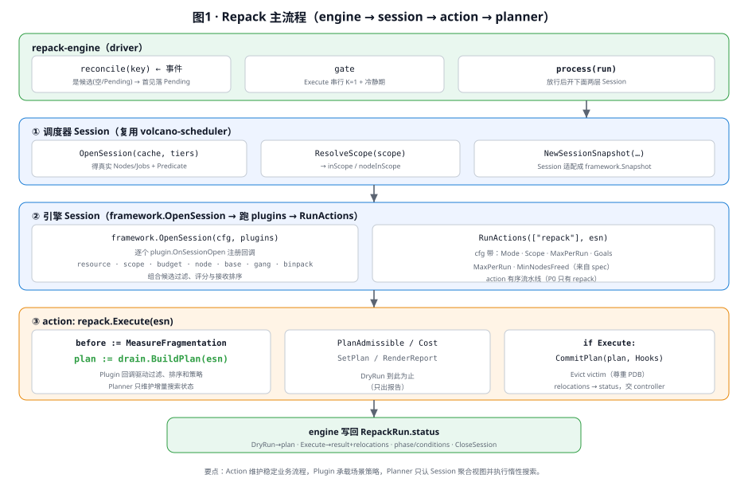

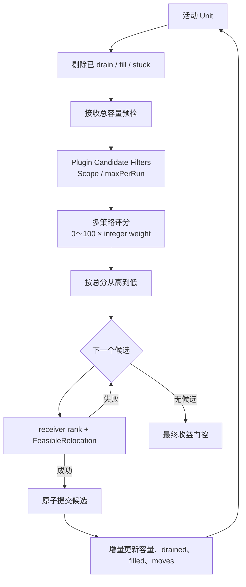

接收总容量预检发生在评分之前：若 Unit 需要迁移的目标资源总量大于 Unit 外可用 receiver slack，则无需计算评分或调用 Scheduler Filter。

### 8.4 多策略候选评分

每个 Plugin 返回可解释的原始中断成本。Framework 在当前步骤的活动候选集合内反向 Min-Max 归一化：

```text
strategyScore(i,k) = 100,  if max(raw(*,k)) == min(raw(*,k))

strategyScore(i,k)
  = 100 - floor(100 × (raw(i,k)-min(raw(*,k)))
                      / (max(raw(*,k))-min(raw(*,k))))

totalScore(i) = Σ strategyScore(i,k) × weight(k)
```

语义约束：

- 单项和总分都是整数；
- 单项原始成本越低，策略得分越高；
- 综合总分越高，候选越优先；
- 某项全部相同时所有候选均得 100 分，不改变相对顺序；
- `weight=0` 时不调用该评分函数；
- 分数仅在当前步骤内可比，不能跨步骤或跨 Run 解释为绝对风险。

当前五个维度：

| 维度 | 默认权重 | 原始成本 |
|---|---:|---|
| `affectedPodGroups` | 10 | 完整计划影响的 distinct PodGroup 数 |
| `gangBreaches` | 8 | 完整计划使其低于 `MinAvailable` 的 PodGroup 数 |
| `damagedResource` | 6 | 按 Gang 阶跃模型计算的受损目标资源 |
| `movedResource` | 3 | 完整计划迁移的目标资源量 |
| `movedPods` | 1 | 完整计划迁移的 Pod 数 |

排序相同时，先比较 `FreeableUnit.Weight`，再按 Unit key 字典序，保证结果稳定。Weight 表示释放收益的同分决策，不是绕过中断评分的硬优先级。

### 8.5 Receiver 构造与排序

Receiver 首先满足基础边界：

- 不属于当前待腾空 Unit；
- 目标资源部分占用且有 scheduler-visible slack；
- 未被前序提交标记为 drained 或不可再接收；
- 通过 ReceiverPool Plugin 的链式裁剪。

ReceiverRank 使用固定的三阶段字典序，配置顺序不影响阶段：

1. **Stability**：优先填充确定会继续占用的节点，避免破坏未来可腾空候选；
2. **Disruption**：优先使用未来腾空会造成更高 Gang 成本的节点，把低成本节点留给后续整理；
3. **Packing**：按 best-fit 选择迁入后余量更小的节点。

Rank 对每个节点、每个 Plugin 只计算一次，之后使用缓存值稳定排序，避免比较器产生 `O(R log R)` 次昂贵聚合。

### 8.6 完整调度模拟

`Snapshot.FeasibleRelocation` 为每个候选构造克隆节点状态和 cycle state，按 victim 顺序逐个模拟放置：

1. 从克隆状态移除 victim；
2. 按 receiver rank 遍历节点；
3. 调用 Scheduler Session 的完整模拟过滤栈；
4. 找到可行节点后把 Pod 加到克隆节点并扣减容量；
5. 任一 Pod 无落点则丢弃整个候选克隆。

模拟不会修改 Scheduler 的权威 Session。它不只检查目标资源，还继承 CPU、内存、taint/toleration、affinity、拓扑分布和已配置调度插件的约束。

当前使用 first-fit，不为前面 Pod 的接收节点做回溯。该取舍控制了搜索复杂度，但可能错过需要联合重新映射的可行方案。

### 8.7 原子提交与循环终止

候选通过完整模拟后一次性写入 Planner 内存状态：

- 添加全部 moves；
- 将源节点标记为 drained；
- 将使用过的 receiver 标记为 filled；
- 扣减 receiver slack 和总容量；
- 更新已影响工作负载、已迁移资源和候选活动集合。

若候选模拟失败，则标记为 infeasible/stuck，后续不重复执行相同昂贵模拟。没有候选可提交时结束，并对完整计划执行收益门控。

### 8.8 启发式边界

当前算法不回溯已提交候选，也不搜索空节点中转、多跳交换或任意节点组合。以下情况可能得到可行但非全局最优的计划：

- 当前高分候选提前消耗关键预算；
- first-fit 使用了受限 Pod 的唯一 receiver；
- best-fit 填充了未来本可腾空的节点；
- 同分候选对后续搜索空间的影响不同；
- 每轮候选集合变化导致归一化基准变化；
- 缓存的不可行候选在非单调调度条件变化后可能重新可行；
- 规划与执行间的集群变化使实际收益降低。

这些边界是有界规划时延的明确取舍。Scope、预算、完整调度校验和最终收益门槛仍是硬保证。

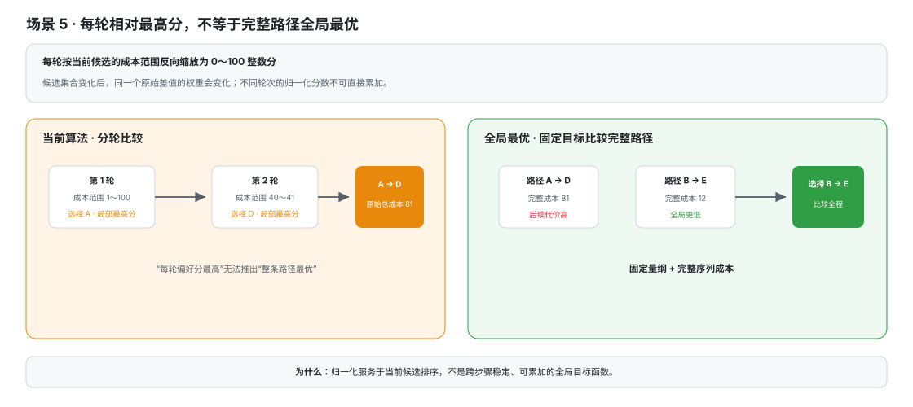

## 9. Execute 详细设计

### 9.1 Prepare Barrier

任何 Eviction 前必须按顺序持久化：

1. 完整 `status.plan`；
2. 每个 victim 对应的 `status.relocations[]`；
3. 原 PodGroup 的 placement lease；
4. Run 的 active placement 索引。

只有这些信息对 controller 和 admission webhook 可见后，Engine 才允许驱逐。这样替身 Pod 即使立即出现，也能被识别并暂停在 placement gate。

### 9.2 Eviction Journal

逐 Pod eviction phase：

```text
Pending → InProgress → Accepted
                    ├→ IndirectlyRemoved
                    └→ Rejected
```

`victimPodUID` 是幂等边界。Engine 重启后观察原 UID：

- UID 仍存在时可安全恢复或重试；
- 同名但 UID 不同表示已经是 replacement，不能再次驱逐；
- 同一 PodGroup 的其他 eviction 触发级联删除时，未直接获得成功响应的 victim 记为 `IndirectlyRemoved`。

Eviction 请求使用 Run context，Engine shutdown 能取消尚未完成的 API 调用。PDB 由 API Server 在实时状态下校验，Repack 不伪造或绕过。

### 9.3 Replacement Matching

替身匹配顺序：

1. 已持久化的 `replacementPodUID`，用于幂等恢复；
2. `victimPodName` 同名快路径；
3. 显式 SubGroup 场景使用 `schedulingRequirementsHash` 匹配调度等价类；
4. 未配置 SubGroup 的 PodGroup 按组内同构处理。

匹配不依赖某种业务 CRD 的私有 label，也不要求业务 controller 生成 Repack 专用 identity。对于会重建整个工作负载内所有 Pod 的控制器，controller 使用 workload owner 和新一代 PodGroup 映射继续承接未完成 relocation。

### 9.4 Placement Lease、Gate 与 Nomination

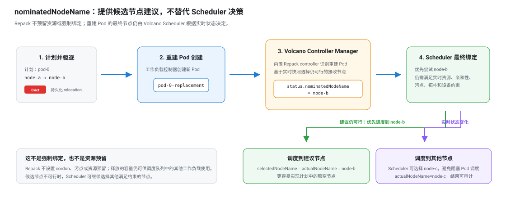

placement 协议：

1. Engine 在原 PodGroup 写入带 Run name/UID 的 lease；
2. admission webhook 为对应 replacement Pod 注入 scheduling gate 和 owner annotation；
3. controller 认领一个与 relocation 匹配的 Pod；
4. Engine 基于实时 Scheduler Session 选择 `selectedNodeName`；
5. controller 将该节点写入 `pod.status.nominatedNodeName` 并移除 gate；
6. Scheduler 按实时状态调度，controller 观察并写入 `actualNodeName`。

`selectedNodeName` 是 Repack 的实时建议，`actualNodeName` 是最终事实。Nomination TTL/`expirationTime` 限制牵引持续时间；超时后 placement 进入 `TimedOut`，controller 清理 gate，避免 Pod 永久被 Repack 阻塞。

### 9.5 终态收益

Engine 在所有可观察 placement 结束后从一致 Scheduler 快照重新度量：

- `freedNodes`：计划节点中实际不再使用目标资源的节点；
- `freedNodeCount`：上述节点数量；
- `fragAfterPercent`：终态集群碎片率；
- `movedCardCount`：Eviction 被接受的目标资源量；
- `metricsVerified`：这些收益是否来自替身绑定后的可靠快照。

即使 Execute 最终失败，只要已经接受部分驱逐，result 也应据实呈现已完成部分；不能简单回填 0 或覆盖 plan。

## 10. 并发、HA 与恢复

### 10.1 Execute Gate

Engine 采用单 worker 和 K=1 Execute gate：

- DryRun 可正常排队，不持有 Execute slot；
- Execute 以互斥方式检查并认领 active Run；
- 一旦进入可能产生 Eviction 的阶段，暂时失败也不释放 slot，重试继续恢复 journal；
- Execute 终态后记录 cooldown anchor，窗口内的新 Execute 保持 Pending。

当前 Engine Deployment 可使用主备副本，但 active/standby 正确性依赖 Kubernetes leader election 和持久状态；不得让多个无选主实例同时处理 Run。controller-manager 侧沿用其既有选主机制。

### 10.2 崩溃恢复

恢复按持久状态而不是进程内步骤号判断：

- Running 且 plan 未持久化：允许重新规划；
- plan/relocations 已持久化：禁止重算并覆盖，恢复 eviction journal；
- concrete replacement 消失：清除失效 claim，允许新 Pod 接续；
- replacement PodGroup 重建：推进 generation mapping；
- Run 已终态或删除：清理 lease、gate 和 active index；
- terminal status 写失败：重试相同终态投影，不重新执行副作用。

### 10.3 优雅退出

目标 shutdown 顺序：

1. 取消根 context；
2. 停止接收新 work item；
3. 让进行中的 API 请求感知取消；
4. 关闭 scheduler cache、informers 和 workqueue；
5. 调用 event broadcaster `Stop()`；
6. 等待 worker 退出。

当前实现已使用根 context 停止 Engine 主循环、scheduler cache、informers 和 workqueue，但仍有两项需要继续收敛：`hooksFor` 内的 Eviction 请求使用 `context.Background()`，不能响应 Engine shutdown；Engine 和 leader-election 创建的 event broadcaster 没有保存为可停止的生命周期成员。实现这两项前，不能把“进行中 Eviction 可取消”和“broadcaster goroutine 已回收”作为现有保证。

锁只保护 Execute gate、冷却锚点和极少量跨回调共享状态；单 worker 所有的 map 不重复加锁，避免无效同步开销。

## 11. 性能设计

### 11.1 大规模集群瓶颈

4000 节点场景的主要成本不是读取 Node，而是候选数、receiver 数和完整 Scheduler Filter 调用的乘积。若每一步对所有候选做完整模拟，且每次重新扫描所有 receiver，规划时间会随已提交步骤快速累积。

### 11.2 当前优化

- 初始化阶段一次性分类空、部分占用、满卡和不可用节点；
- 评分前排除没有 receiver 总容量的候选；
- 缓存 Unit victim、资源量和静态节点数据；
- receiver rank 每节点每 Plugin 单次求值；
- Gang receiver 影响按真正进入排序的节点惰性缓存；
- 沿评分顺序惰性执行 `FeasibleRelocation`，首个成功即停止；
- 提交后只增量维护容量、drained、filled 和活动候选；
- 失败候选在满足单调性假设时缓存，避免重复模拟；
- V3/V4 日志限制首尾候选数量，但始终包含被选中的中间候选。

### 11.3 性能目标与观测量

面向 4000 节点以上集群，规划目标为典型可行场景 1 分钟内给出计划。基准必须同时记录：

- 总规划耗时和每步耗时；
- 初始/活动/过滤/模拟候选数；
- receiver 数和 rank 计算次数；
- `FeasibleRelocation` 调用次数；
- Scheduler Filter 调用量；
- 分配内存和峰值 RSS。

该目标不以移除完整 Scheduler 校验为代价。若受调度约束影响大量高分候选不可行，模拟次数会等于首个可行候选的排序位置，这是惰性模型的可解释退化路径。

## 12. 可观测性

### 12.1 日志层级

- V3：Run 级运维叙事，包括 gate、计划摘要、选择目标、驱逐和终态；
- V4：候选首尾明细、被选中的中间候选、过滤原因和 retry；
- V5：单项原始成本、`0～100` 策略分、整数权重、加权贡献和 receiver rank。

候选评分日志使用 `higher-is-better`，并输出：

```text
rawValue=<原始成本>
strategyScore=<0..100>
weight=<整数权重>
weightedContribution=<strategyScore*weight>
totalScore=<各项贡献之和>
```

### 12.2 Events 与 Metrics

Engine 对 plan computed、execute prepared、eviction accepted/rejected 和 terminal result 产生 Kubernetes Event。Metrics 至少覆盖 Run 数量、终态原因、规划耗时、候选裁剪原因、迁移量、实际释放节点和 placement 漂移。

### 12.3 Status 可解释性

用户应能只通过 `kubectl get/describe` 和 status 回答：

- 整理哪种资源、在哪个 Scope；
- 为什么没有计划；
- 计划影响哪些工作负载和节点；
- 哪些 eviction 被接受或拒绝；
- replacement Pod 被建议到哪里、实际落到哪里；
- 最终释放了哪些节点，收益是否已验证。

## 13. 安全与失败处理

| 失败点 | 行为 |
|---|---|
| 配置或目标资源非法 | 创建/启动或 Run 早期快速失败，不进入规划 |
| Scope 解析失败 | Run Failed，不驱逐 |
| 无可行候选 | 正常以 `InsufficientImprovement` 完成 |
| plan 状态写失败 | 不进入 Eviction，重试持久化 |
| lease 或 active index 写失败 | 不驱逐，清理已准备 lease |
| Eviction 被 PDB 拒绝 | relocation 记 Rejected；根据接受情况汇总最终结果 |
| replacement 未出现 | 等待至 expirationTime，随后 TimedOut 并释放 gate |
| Scheduler 选择其他节点 | 记录 selected/actual 差异并验证计划源节点是否真正释放 |
| 快照无法一致验证 | `metricsVerified=false`，不把推测值表示为已验证收益 |

Repack 的 RBAC 遵循最小权限：Engine 只获取规划所需资源、更新 RepackRun status、管理 placement lease 并创建 Eviction；controller 只管理 Run TTL、replacement placement 相关状态和 Pod gate/nomination。

## 14. 测试策略

### 14.1 单元与契约测试

- API：碎片率、计划聚合、Gang 受损模型和字段转换；
- Framework：Plugin 顺序无关、AND/Union/短路、Capability、整数权重和评分范围；
- Plugin：Scope、预算、Node Domain、中断评分、Gang、binpack；
- Planner：节点预分类、容量预检、候选顺序、完整模拟、增量状态和规模 benchmark；
- Engine：gate、status、Eviction journal、规划与驱逐的 context cancellation、worker 优雅退出和终态收益；
- Controller：replacement 匹配、PodGroup 代际、gate、nomination、TTL 和重启恢复。

### 14.2 组合测试

固定 Domain provider 后遍历可选 Plugin 组合，验证：

- 关闭某个 Plugin 只关闭对应策略；
- Plugin YAML 顺序变化不改变结果；
- 空/满节点和完整调度校验始终生效；
- 缺少 Domain capability 在启动阶段失败。

### 14.3 E2E

E2E 覆盖 DryRun、Execute、Scope、`maxPerRun`、PDB、VCJob、原生工作负载、整个工作负载 Pod 重建、replacement gate、Engine/controller 重启、TTL、selected/actual placement、部分执行结果和重复 DryRun 确定性。

## 15. 代码结构

```text
cmd/volcano-repack-engine/                 # Engine 进程入口
pkg/repackengine/
  repackengine.go                          # 稳定对外门面，仅暴露 Config、Engine、NewEngine
  conf/                                    # 独立配置模型、默认值、严格解析与能力校验
  cache/                                   # Scheduler Cache 构建、运行和只读 Session 生命周期
  actions/repack/                          # Action 主流程
  planner/drain/                           # Lazy Drain Planner 与性能基准
  plugins/                                 # 场景策略
  framework/                               # Session、Action、Plugin、回调聚合
  adapter/                                 # Scheduler Session/Snapshot 适配
  api/                                     # 纯模型、碎片度量、中断聚合
  executor/eviction/                       # Eviction API 请求构造和错误归一化
  executor/placement/                      # replacement 落点判定、终态收益判定和 identity
  status/                                  # status 投影、用户消息、冲突合并与持久化
  metrics/                                 # Engine 指标
  internal/engine/                         # 不对外暴露的 Engine 运行时实现
    runtime.go                             # Engine 结构、构造、Informer 接线与 Run 生命周期
    configuration.go                       # Scheduler/Repack 配置加载
    reconcile.go                           # Workqueue、候选状态机与单 Run 协调入口
    recovery.go                            # 终态写入恢复与异常 Running Run 恢复
    planning.go                            # 打开 Session、执行 Action、持久化计划准备屏障
    gate.go                                # Execute K=1 与 cooldown
    eviction_reconcile.go                  # Eviction journal 的执行和逐 Pod 持久化
    eviction_journal.go                    # journal 查询、汇总和恢复辅助逻辑
    placement_lease.go                     # PodGroup placement lease 的准备、修复和清理
    placement_reconcile.go                 # replacement Pod 接收节点选择与 nomination 写入
    placement_result.go                    # actualNode、最终收益和超时结果校验
    status_persistence.go                  # status 写入编排、终态重试与指标事件
    owner_resolution.go                    # PodGroup 上层工作负载解析
    events.go                              # Kubernetes Event 记录与 broadcaster 生命周期
staging/src/volcano.sh/apis/pkg/apis/repack/v1alpha1/
                                            # RepackRun API
staging/src/volcano.sh/repack-controller/   # TTL、replacement placement
pkg/scheduler/                              # 复用的 cache/framework/filter
test/e2e/repack/                            # 全量 E2E
```

根包不承载规划、驱逐或状态机实现，`cmd` 和外部调用方只依赖稳定门面。`internal/engine` 只编排 Run 生命周期、持久化屏障、工作队列和 Kubernetes 写操作；可复用的 Eviction、placement 与 status 逻辑分别由 `executor` 和 `status` 承载。新增规划策略优先扩展 Plugin，同一文件只维护同一类状态与副作用，避免再次形成同时包含配置、缓存、规划和执行的大型入口文件。

## 16. 演进边界

新增能力时按决策点选择扩展面：

- 新的不可移动条件 → `MovableFn`；
- HyperNode 或其他释放单元 → `DomainFn`；
- 新预算或硬规则 → `CandidateFilterFn`/`ConstraintFn`；
- 新的业务中断偏好 → `DisruptionScoreFn`；
- 新 receiver 偏好 → `ReceiverRankFn`；
- 只有改变一次 Run 的业务阶段时才增加 Action；
- 只有现有 Lazy Drain 搜索无法表达时才考虑新的 Planner。

HyperNode 整理不能简单以“腾空整个超节点”为收益。后续 Domain 需要根据训练 TP/EP 或推理 Prefill/Decode 单 role 所需卡数的倍数定义有效容量，并解决重叠 Unit 的增量消费与收益度量后再接入。

## 17. 相关文档

- [Repack Proposal](./repack-runtime-defragmentation.md)
- [Repack 用户指南](../user-guide/how_to_use_repack.md)
- [Repack 部署清单说明](../../installer/repack/README.md)
