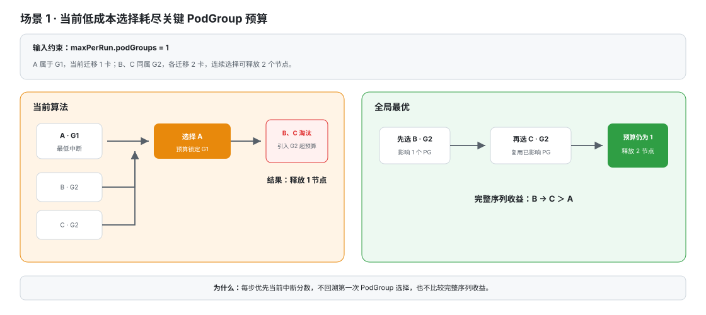
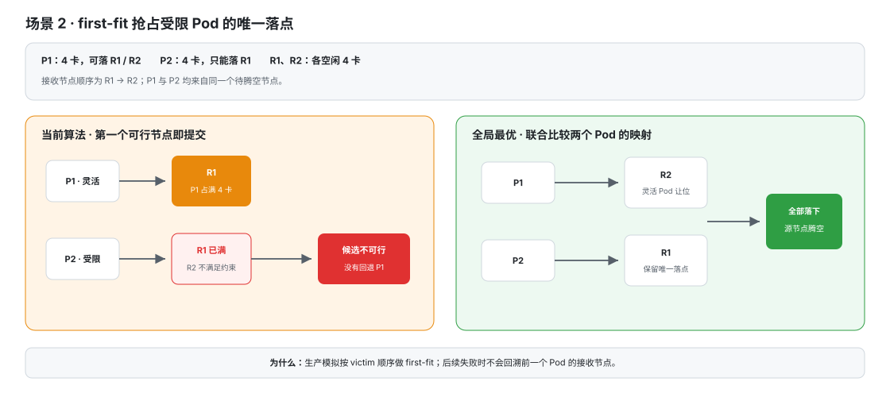
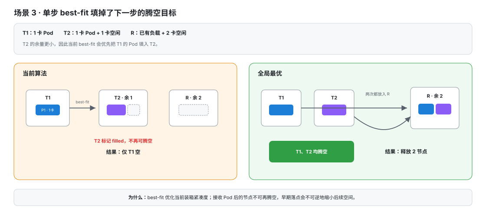
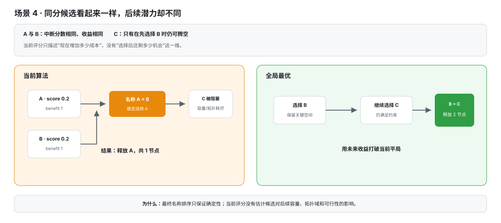
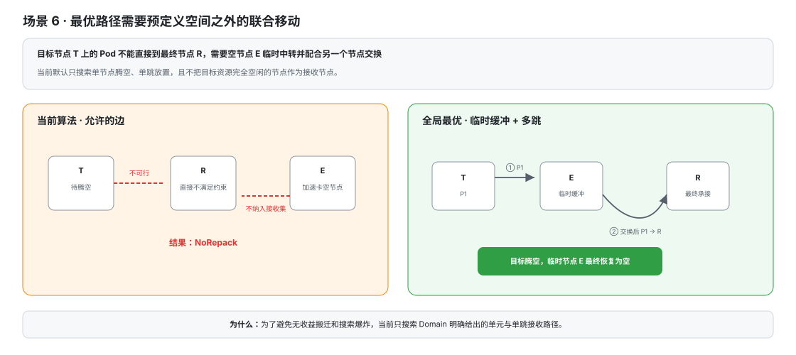
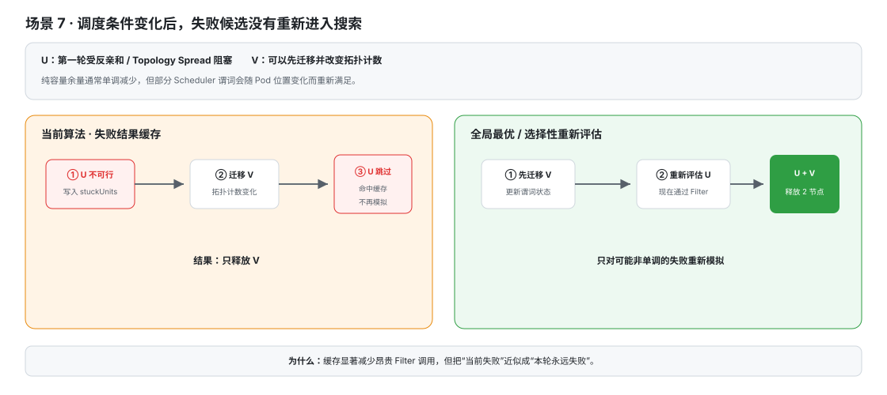
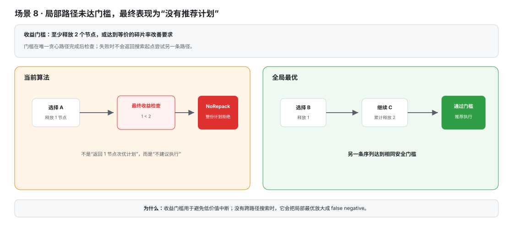
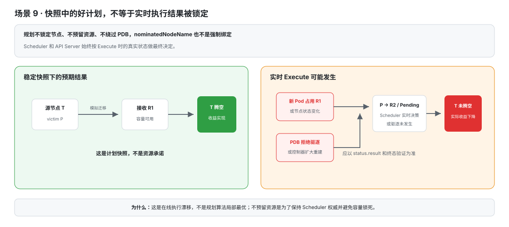

# Repack 启发式规划的约束、非全局最优场景与设计取舍

## 1. 文档目的

本文用于解释 Volcano Repack 为什么采用启发式碎片整理，而不是求解一个全局最优方案，主要回答以下问题：

- Repack 当前如何生成碎片整理计划；
- “不保证全局最优”具体意味着什么；
- 哪些集群状态和调度约束容易使启发式结果偏离全局最优；
- 为什么当前实现仍然是合理的生产选择；
- 用户可以依赖哪些保证，又需要接受哪些边界；
- 如何通过 DryRun、Scope、执行预算和重复规划降低这些边界带来的风险。

本文讨论的是当前 `drain` 核心算法和生产调度快照适配器。代码入口主要包括：

- `pkg/repackengine/planner/drain/drain.go`
- `pkg/repackengine/adapter/snapshot_session.go`
- `pkg/repackengine/framework/session.go`
- `pkg/repackengine/plugins/workloaddisruption/workload_disruption.go`
- `pkg/repackengine/plugins/gangdisruption/gang_disruption.go`

## 2. 先说结论

Repack 的首要目标不是在任意时间内找到数学意义上的最优布局，而是在在线集群中及时生成一个：

1. 能够释放完整目标资源节点；
2. 在当前调度快照下能够完成模拟放置；
3. 不突破 Scope 和单次执行预算；
4. 尽量减少受影响工作负载、Gang 破坏、迁移卡数和迁移 Pod 数；
5. 可以解释、审核和执行的计划。

当前实现采用“动态贪心选择腾空单元 + 惰性可行性评估 + 启发式接收节点装箱”：规划开始时一次性准备候选和节点资源缓存；每轮先用低成本规则对活动候选评分排序，再按顺序执行完整调度模拟，提交第一个可行候选，然后继续下一轮。系统只保留这一套惰性流程，不提供全量候选模拟模式。

这种方法可以稳定地产生有明确收益的安全计划，但不会枚举全部候选组合、执行顺序和 Pod 到节点的映射，因此不承诺：

- 释放节点数最多；
- 碎片率改善最大；
- 总迁移量最小；
- 总中断影响最小；
- 只要存在可行计划就一定能发现。

这些指标本身也可能互相冲突。例如，多释放一个节点可能需要迁移更多 Pod 或影响更多 PodGroup。因此，“全局最优”只有在明确目标优先级和权重以后才有唯一含义。

### 2.1 非全局最优场景速览

以下场景可能使 Repack 找到可行但非全局最优的计划，或者在实际存在其他可行组合时没有推荐计划：

1. **局部低成本候选消耗关键预算**：当前中断最小的候选可能先占满 PodGroup 或迁移资源预算，导致后续收益更高的候选组合无法进入计划。
2. **first-fit 占用受限 Pod 的唯一接收节点**：灵活 Pod 先落到关键节点后，后续受型号、亲和性或拓扑限制的 Pod 可能无处可放；换一种 Pod—Node 映射其实可以完成整体迁移。
3. **best-fit 提前填充未来可腾空节点**：把 Pod 放入当前最紧凑的接收节点虽然有利于单步装箱，但该节点会失去后续腾空资格，可能减少最终释放节点数。
4. **同分候选的后续潜力不同**：当前成本和收益相同的候选最终只能按名称稳定排序，但不同选择可能为后续步骤保留完全不同的容量和拓扑条件。
5. **每轮归一化评分不是全局效用函数**：各项中断成本只在本轮候选集合内相对比较，不同步骤的分数不可直接累加，因此每轮最低分不等于整条迁移路径的总成本最低。
6. **预定义腾空单元限制了搜索空间**：当前不会搜索任意多节点联合腾空、Pod 交换、多跳迁移或使用空闲加速卡节点临时中转等“先调整、再获益”的组合路径。
7. **惰性评估改变了评分基准集合**：扰动指标在完整调度模拟前归一化，候选集合中可能包含随后被 Scheduler 判为不可行的单元；不可行候选的极值可能改变各评分维度的相对贡献，使顺序不同于“仅在可行候选中重新归一化”。
8. **不可行缓存可能错过后来可行的候选**：纯容量通常只会随迁移减少，但亲和性、反亲和性和 Topology Spread 等非单调条件可能因其他 Pod 移动而改变；提前缓存失败结果可能阻止再次评估。
9. **最终收益门槛放大局部路径影响**：贪心路径没有达到最低释放节点数或碎片率改善时会被整体拒绝，即使另一条未搜索路径可以达到收益门槛。
10. **在线状态变化使实际结果低于计划**：规划后发生的资源竞争、PDB 拒绝、控制器重建和 Scheduler 重新选点可能使 Execute 偏离计划；这属于在线执行不确定性，而不是规划算法自身的局部最优。

## 3. 如何理解“全局最优”

### 3.1 优化目标不是单一指标

一个完整的碎片整理方案至少包含以下目标：

- 最大化释放的完整节点或拓扑单元；
- 最大化碎片率改善；
- 最小化受影响 PodGroup 数；
- 最小化低于 `MinAvailable` 的 PodGroup 数；
- 最小化受损目标资源量；
- 最小化迁移目标资源量；
- 最小化迁移 Pod 数；
- 满足用户配置的 Scope、预算和收益门槛。

例如，方案 A 可以释放 3 个节点但影响 3 个训练任务，方案 B 只释放 2 个节点但只影响 1 个训练任务。除非产品明确规定“节点收益永远优先于中断成本”或给出统一权重，否则不能简单判断哪一个是绝对最优。

因此，本文将“全局最优”定义为：

> 在固定集群快照、固定 Scope、固定迁移预算和固定目标函数下，联合搜索所有可迁移 Pod、腾空目标、执行顺序和接收节点映射后得到的最优可行方案。

当前 Repack 求取的是这个定义下的一个可行启发式解。

### 3.2 整个集群的最优不等于约束范围内的最优

以下约束会有意缩小搜索空间：

- `scope.podGroups`：只有授权的工作负载可以被驱逐；
- `scope.nodes`：只有选定节点可以作为腾空目标；
- `maxPerRun.podGroups`：限制单次影响的工作负载数量；
- `maxPerRun.resources`：限制单次迁移的目标资源量；
- 可迁移性规则：排除无法安全重建或不由 Volcano 调度的 Pod；
- 单目标资源：一次 Run 只整理一种扩展资源。

如果集群级最优方案需要移动 Scope 外工作负载或突破预算，Repack 不选择它是遵守用户意图，而不是算法错误。真正需要关注的是：在相同约束下，启发式搜索仍可能错过更好的可行方案。

## 4. 当前规划流程

### 4.1 构造候选腾空单元

Domain 插件产生 `FreeableUnit`：

- 当前内置 Node Domain，为每个节点产生一个单节点单元；
- Framework 允许其他 Domain 插件提供多节点拓扑单元，例如未来的 HyperNode Domain；
- 每个单元具有收益权重，例如释放一个节点的权重为 1。

核心算法只会搜索插件明确提供的单元，不会自动枚举任意节点组合。当前默认配置下，搜索单元就是单个节点。

### 4.2 准备活动候选

规划开始时只扫描一次 `FreeableUnit`，缓存成员节点、victim Pod、工作负载集合和目标资源迁移量，并永久剔除以下单元：节点不存在、没有目标资源 Pod、包含不可移动目标资源 Pod，或者没有可迁移 victim。后续每轮只遍历活动候选；已经腾空、接收过迁移 Pod、被证明不可行或确定会突破单次预算的单元会退出活动集合，不再重复扫描任务和执行静态判断。

每轮对活动候选执行的低成本检查包括：

1. 单元尚未被腾空，也没有在本轮接收过迁移 Pod；
2. 新增工作负载数和迁移目标资源量不突破 `maxPerRun`；
3. 剔除候选自身后，接收节点的目标资源总余量足以承载全部 victim。

这些检查只负责快速排除必然失败的候选，不代替 Scheduler 可行性校验。

### 4.3 选择接收节点

对于一个候选腾空单元，接收节点按以下偏好排序：

1. 优先填充确定不会再被腾空的节点，例如有不可迁移 Pod、位于腾空 Scope 外或已经接收过迁移 Pod 的节点；
2. 在仍可能腾空的节点中，优先填充未来腾空代价更高的节点；
3. 其余情况使用 best-fit，优先选择目标资源剩余量更小的节点。

规划开始时先按目标资源分类节点：空节点和满卡节点不进入接收池，只有部分占用且具有 scheduler-visible 余量的节点参与后续处理。节点余量只计算一次；每次提交迁移后增量更新本轮新增占用。构造具体候选的接收节点列表时，再排除已腾空节点、候选源节点以及连最小 victim 都无法容纳的节点，避免把显然不可用的节点送入评分和完整调度模拟。

这个顺序的目标是尽量把 Pod 放到本来就会保持占用的节点，并保护更容易在后续腾空的节点。

生产适配器随后：

1. 按目标资源请求量从大到小处理 victim Pod；
2. 对每个 Pod 遍历已排序的接收节点；
3. 选择第一个通过资源检查和完整 Scheduler Filter 的节点；
4. 将该放置加入当前模拟状态，继续处理下一个 Pod。

这里采用 first-fit，不会在后续 Pod 放置失败时回溯前面 Pod 的接收节点。

### 4.4 扰动预排序与惰性可行性评估

所有通过低成本检查的活动候选会按照当前累计计划计算中断影响，包括：

- 受影响 PodGroup 数；
- 低于 `MinAvailable` 的 PodGroup 数；
- 受损目标资源量；
- 迁移目标资源量；
- 迁移 Pod 数。

各指标在本轮活动候选集合内做 min-max 归一化，再乘以对应权重。总分越低，预期中断影响越小。只有总分相同时，才优先选择收益权重更高的单元；收益和分数都相同时，使用候选名称保证结果稳定。

排序阶段使用 victim 构造的预期迁移记录，不需要提前确定接收节点。排序完成后，算法从第一名开始构造接收节点并调用 `Snapshot.FeasibleRelocation`：

1. 第一个候选通过完整 Scheduler Filter 后立即提交，本轮停止继续模拟；
2. 候选失败时将其记为不可行，再尝试下一名；
3. 全部候选失败时结束规划。

因此，最终计划中的每次迁移仍经过完整 Scheduler 校验，但算法不再为了比较候选而预先模拟本轮所有节点。正常情况下，每轮完整模拟次数由数千次降为一次；存在调度约束冲突时，模拟次数等于首个可行候选的排序位置。

### 4.5 提交并继续下一轮

选中的候选立即加入计划：

- victim Pod 的放置被记为已提交迁移；
- 接收节点被标记为 `filled`，本轮不再作为腾空目标；
- 源节点被标记为 `drained`；
- 已影响 PodGroup 和已迁移资源量计入后续预算；
- 下一轮基于更新后的状态重新评分剩余活动候选。

算法不会撤销已经提交的候选，也不会比较“如果第一轮选择另一个候选，最终收益会怎样”。

### 4.6 应用最终收益门槛

当没有更多候选可提交后，完整计划还需要满足：

- 至少释放要求数量的节点或加权单元；
- 达到 `minFragImprovementPercent`；
- 通过其他计划级硬约束。

不满足门槛时，整个计划被拒绝，不执行部分迁移。

### 4.7 规模性能与复杂度

旧流程每一步先对全部候选执行完整调度模拟，再选择一个候选，核心成本近似为 `步骤数 × 候选数 × 接收节点数 × Scheduler Filter`。4000 节点、4 个整理步骤的容量模型基准需要约 15991 次完整模拟、47.8 秒，并产生约 64.3 GB 临时分配；真实 Scheduler Filter 的成本更高，因此可能表现为每步数分钟。

惰性流程把计算拆成两层：候选预评分仍为低成本线性扫描，完整 Scheduler 模拟只沿排序结果执行到首个可行候选。相同 4000 节点、4 步基准下降到 4 次完整模拟、约 28 毫秒和 56 MB 临时分配；第一候选可行的单步场景只执行 1 次模拟。该数据来自 Apple M3 上的容量模型基准，用于比较算法复杂度，不代表生产环境绝对时延。

性能验收以 4000 节点在 1 分钟内生成计划为目标，同时重点观测 `candidateEvaluations`、`feasibilitySimulations`、各类预检淘汰数量和总规划时延。完整调度模拟仍是最终判断来源，性能优化不得通过跳过 Scheduler Filter 获得。

## 5. 导致非全局最优的主要场景

### 5.1 当前最低中断候选消耗了关键预算



假设 `maxPerRun.podGroups: 1`，有三个可腾空节点：

| 候选 | victim 所属 PodGroup | 当前迁移量 | 可形成的后续收益 |
|---|---|---:|---:|
| A | G1 | 1 卡 | 只能释放 A，共 1 个节点 |
| B | G2 | 2 卡 | 选择 B 后还可以继续释放同属 G2 的 C |
| C | G2 | 2 卡 | 与 B 组合后共释放 2 个节点 |

如果 A 的当前中断分数最低，贪心算法会先选择 A。此时 PodGroup 预算被 G1 占满，B 和 C 都因为会引入 G2 而被过滤，最终只释放 1 个节点。

全局搜索会比较完整序列并选择 B、C：虽然第一步迁移量更大，但两步只影响 G2，一个 PodGroup 预算内可以释放 2 个节点。

当前算法已经具备“优先复用已受影响 PodGroup”的动态评分能力，但它只能优化第一次选择之后的路径，不能撤销第一次选错的 PodGroup。

### 5.2 first-fit 占用了受限 Pod 的唯一接收节点



假设需要腾空一个节点，其中有两个 Pod：

| Pod | 请求 | 可接受节点 |
|---|---:|---|
| P1 | 4 卡 | R1、R2 |
| P2 | 4 卡 | 只能是 R1 |

R1、R2 各有 4 卡空闲，接收节点顺序为 R1、R2。

当前 first-fit 过程：

```text
P1 → R1
P2 → 没有可行节点
结论：候选不可行
```

实际存在以下完整映射：

```text
P1 → R2
P2 → R1
结论：候选可行
```

这种情况在以下环境更容易出现：

- 不同 GPU/NPU 型号或设备拓扑；
- 节点选择器和节点亲和性；
- Pod 亲和性或反亲和性；
- Topology Spread；
- 本地卷、CSI、DRA 或其他设备约束；
- CPU、内存和目标加速卡之间存在不对称余量。

完整 Scheduler Filter 能确保已经找到的放置真实可接受，但 first-fit 返回失败并不能证明不存在其他 Pod—Node 映射。

### 5.3 best-fit 提前填充了本来可以腾空的节点



假设：

```text
T1：运行 1 个 1 卡 Pod
T2：运行 1 个 1 卡 Pod，剩余 1 卡
R ：已经较满，但仍剩余 2 卡
```

腾空 T1 时，T2 的剩余空间比 R 更小。best-fit 可能选择：

```text
T1 的 Pod → T2
```

T2 一旦接收 Pod，就会被标记为 `filled`，本轮不再允许作为腾空目标，最终只能释放 T1。

更好的完整路径可能是：

```text
T1 的 Pod → R
T2 的 Pod → R
```

这样可以同时释放 T1 和 T2。

当前的“未来腾空影响”排序会尽量保护便宜的未来目标，因此能够减少此类情况，但它仍然是单步估值，不能覆盖所有后续序列。

### 5.4 同分候选具有不同的后续潜力



两个候选可能具有相同的：

- 受影响 PodGroup 数；
- Gang 破坏情况；
- 迁移资源量；
- 迁移 Pod 数；
- 腾空收益。

当前会使用候选名称作为最终稳定排序。名称顺序保证了确定性，却不知道哪个候选会为后续步骤保留更合适的容量或拓扑域。

因此，即使第一步的可观测成本完全相同，不同选择仍可能产生不同最终收益。

### 5.5 每轮归一化评分不等于全局效用函数


中断指标是在当前候选集合中做 min-max 归一化。候选集合变化后，同一个原始成本差值可能得到不同的归一化贡献。

例如：

```text
第一轮 movedResource 范围：1～100
第二轮 movedResource 范围：40～41
```

第二轮中 1 卡的差异可能被归一化为完整的 `0～1` 差异，而第一轮中同样的 1 卡差异影响很小。这样做适合在每轮不同量纲之间进行相对排序，但不同轮次的分数不可直接相加，也不是对整条迁移序列定义的固定全局目标函数。

惰性流程在完整调度模拟前完成归一化，因此本轮评分集合还可能包含随后被 Scheduler 判为不可行的候选。若这些候选形成某个维度的最大值或最小值，会改变该维度对其余候选的相对贡献。系统仍按这个确定性预排序选择首个可行候选，但不会在排除不可行候选后重新归一化和重排。

### 5.6 搜索空间只包含预定义腾空单元



当前算法只考虑 Domain 插件明确产生且所有成员节点均为目标资源部分占用状态的单元。当前内置实现只产生 Node 单元；即使后续启用 HyperNode 等多节点 Domain，搜索范围仍仅限于插件明确给出的拓扑单元。以下方案不会被自动搜索：

- 任意多个普通节点需要同时腾空才可行；
- 一个不属于任何已注册拓扑单元的跨域节点组合；
- 先迁移接收节点上的 Pod，再腾空目标节点；
- 需要 Pod 交换、循环移动或多跳迁移的布局；
- 需要临时占用一个加速卡空节点作为中转站的方案。
- 迁移满卡节点上的全部 Pod、再利用其他部分占用节点释放该满卡节点的方案。

特别是，当前不会把目标资源完全空闲的节点作为接收节点，也不会把满卡节点作为待腾空源节点。空节点保持空闲，满卡节点视为已经完成装箱；即使全局算法可能通过中转或重排找到其他方案，Repack 也有意不搜索这种高扰动路径。

### 5.7 不可行缓存依赖单调性假设



候选因目标资源总容量不足或 Scheduler 模拟失败后，会在本轮规划中缓存为不可行。设计假设是：随着更多迁移被提交，可用余量只会减少，因此失败候选不需要重复执行昂贵模拟。

这个假设对纯容量约束通常成立，但部分调度谓词并不严格单调。例如：

- 其他 Pod 被移走后，反亲和性条件可能解除；
- Topology Spread 计数变化后，原来不满足的节点可能重新满足；
- 关联 Pod 的位置变化可能改变亲和性结果。

在这类边缘场景中，一个候选可能在后续状态下变得可行，但缓存会阻止再次评估。另一方面，关闭缓存会显著增加大集群中的 Scheduler 模拟次数，因此当前实现选择了性能更可控的保守策略。

### 5.8 最终收益门槛可能放大局部最优影响



假设引擎级收益门槛 `MinNodesFreed=2`（当前默认至少为 1）：

- 贪心路径最终只能释放 1 个节点，完整计划被拒绝；
- 另一条未搜索的路径可以释放 2 个节点并达到门槛。

用户看到的结果会是“没有推荐计划”，而不是“发现了一个次优计划”。收益门槛本身是必要的，因为它避免为了不足够的收益制造中断；真正的问题仍是前面的启发式路径没有找到满足门槛的替代组合。

### 5.9 并发状态变化导致实际结果低于计划



这一类情况需要与规划非最优分开理解。

Repack 基于某一时刻的 Scheduler 快照规划，但不会：

- 锁定节点资源；
- 暂停新 Pod 创建和调度；
- cordon 计划腾空节点；
- 为接收节点预留容量；
- 绕过 PDB；
- 强制 Scheduler 绑定到 `nominatedNodeName`。

因此，即使计划在快照上已经是最优方案，Execute 期间的资源竞争、PDB、控制器重建和调度变化仍可能使实际结果偏离计划。这属于在线执行的不确定性，不是启发式搜索本身造成的局部最优。

## 6. 为什么不直接求全局最优

### 6.1 搜索规模呈组合爆炸

设：

- `U` 为候选腾空单元数；
- `P` 为可能迁移的 Pod 数；
- `R` 为接收节点数。

全局搜索至少需要同时决定：

1. 选择哪些腾空单元；
2. 以什么顺序处理这些单元；
3. 每个 victim Pod 放到哪个接收节点；
4. 哪些工作负载允许被影响；
5. 如何在收益和多种中断成本之间取舍。

仅 Pod 放置组合的粗略上界就可能达到 `R^P`。候选单元还存在子集和顺序组合。问题中包含装箱、广义分配和带约束调度等组合优化子问题；集群规模增加后，精确枚举无法提供稳定的在线规划时延。

当前动态贪心在外层最多提交 `U` 次，每次评估剩余候选，候选评估次数的上界大致为 `O(U²)`。预算预检、容量预检和不可行缓存还会在执行完整 Scheduler 模拟前淘汰大量候选。

### 6.2 Scheduler 可行性不是简单容量方程

如果只考虑“每个节点有多少张空闲卡”，可以使用整数规划或装箱求解器。但 Repack 需要与真实调度语义一致，还要考虑：

- CPU、内存和多种标量资源；
- taint/toleration；
- node selector 和 node affinity；
- inter-pod affinity/anti-affinity；
- topology spread；
- volume、CSI、DRA 和设备插件约束；
- Volcano Scheduler 插件维护的 CycleState。

这些规则由 Scheduler 插件代码执行，不都能直接转换成静态线性约束。精确求解器如果简化这些规则，可能得到数学上最优但 Scheduler 无法执行的方案；如果把 Scheduler 当作黑盒可行性 Oracle，则需要进行大量昂贵的状态克隆和谓词调用。

当前实现优先复用完整 Scheduler Filter，选择“可执行性可信”而不是“简化模型上的最优”。

### 6.3 在线快照的最优解会快速过期

规划期间集群仍在发生：

- Pod 创建、删除和调度；
- 作业完成和重试；
- 推理服务扩缩容；
- 节点状态和设备健康变化；
- PDB 和控制器状态变化。

精确算法多花费的计算时间会增加快照过期概率。一个几分钟后才得到的最优方案，可能不如几秒内得到并重新验证的可行方案有实际价值。

Repack 因此更强调：短时间内完成规划、Execute 时重新基于实时状态选点、执行后验证实际收益。

### 6.4 全局最优通常意味着更大的扰动范围

为了多释放少量节点，全局方案可能需要：

- 移动 Scope 更广的工作负载；
- 使用临时中转节点；
- 对同一个 Pod 进行多跳迁移；
- 先制造短期碎片，再换取最终收益；
- 同时重建更多 PodGroup。

这些操作会增加恢复时间、控制器级联重建和故障半径。生产碎片整理的价值不是单纯追求理论利用率，而是在收益和中断风险之间取得可审核的平衡。

### 6.5 精确模型的维护成本较高

Volcano Scheduler 和设备生态会持续新增过滤规则和拓扑语义。独立的全局优化模型需要同步实现并验证这些约束，否则会产生两套不一致的调度语义。

当前架构将调度可行性留给 Scheduler，自身只负责候选生成、收益判断和中断控制，职责边界更清晰，也更容易随 Scheduler 演进。

## 7. 当前实现为什么是合理的生产取舍

### 7.1 每次提交都有直接、可验证的容量收益

`drain` 以完整 `FreeableUnit` 为原子收益单位；当前内置单元是节点，Framework 也允许扩展为多节点拓扑单元。只有单元中的全部目标节点都能腾空，候选才会被提交。它不会为了提高一个抽象集中度分数而执行不能释放完整单元的迁移。

用户可以直接审核：

- 要腾空哪些节点；
- 要迁移哪些 Pod；
- 每个 Pod 计划放到哪里；
- 影响哪些 PodGroup；
- 预计改善多少碎片率。

### 7.2 安全性优先于搜索上限

当前设计首先保证：

- 不移动 Scope 外工作负载；
- 不突破用户设置的单次预算；
- 不提交存在无落点 victim Pod 的候选；
- 使用 Scheduler Filter 验证已选择的放置；
- 一个腾空单元要么完整加入计划，要么完全不加入；
- 最终收益不足时不执行任何迁移。

对于会重启训练或推理实例的操作，一个收益略低但边界明确的方案，通常比搜索时间不确定、扰动范围更大的全局方案更适合默认启用。

### 7.3 规划时延和资源消耗可控

Repack 可能运行在数千节点的 AI 集群中。规划不仅消耗 CPU，还会重复克隆 Scheduler 状态并执行过滤插件。启发式流程提供了：

- 静态候选、节点余量和工作负载聚合信息的一次性缓存；
- 预算、总容量和单节点最小容纳能力的低成本预检；
- 单调收缩的活动候选集合；
- 按确定性扰动顺序执行的惰性完整调度模拟；
- 已失败候选缓存和无跨步骤回溯的执行路径；
- 可通过指标观察的候选数和可行性模拟次数。

在常见的“低扰动候选可以直接迁移”场景中，每轮只运行一次完整模拟，使昂贵计算不再随集群候选数量线性放大。

### 7.4 结果稳定且容易解释

相同快照和配置下，候选收益、干扰分数和名称排序能够产生稳定结果。日志可以说明：

- 候选为什么被预算或容量过滤；
- Scheduler 为什么判定不可行；
- 当前候选的各项原始分数、归一化值和权重；
- 为什么最终候选胜出。

确定性对于 DryRun 审核、故障复盘和用户支持非常重要。

### 7.5 符合目标生产场景

Repack 当前主要面向：

- 周期性、批量碎片整理；
- 大规格任务提交前的容量准备；
- 计划性推理扩容；
- 节点维护前的目标资源腾空。

这些场景通常更关注“在维护窗口内安全释放足够节点”，而不是持续在线地重写整个集群布局。动态节点腾空方案可以直接生成运维可理解的结果，并通过执行预算控制单次影响。

### 7.6 多层防线补偿了最优性不足

当前流程不是把启发式结果直接作为强制操作，而是包含：

1. DryRun 展示计划；
2. Scope 和 `maxPerRun` 限制影响范围；
3. Scheduler 模拟验证计划放置；
4. 收益门槛拒绝低价值计划；
5. Execute 重新规划；
6. Eviction API 实时检查 PDB；
7. `nominatedNodeName` 仅提供软引导；
8. 重建完成后验证实际腾空节点和收益。

因此，启发式搜索的职责是提出一个值得尝试的安全计划，而不是代替 Scheduler 或声明未来集群布局已经被锁定。

## 8. 约束及其合理性

| 约束 | 放弃的搜索机会 | 合理性 |
|---|---|---|
| 只移动目标资源 Pod | 不做 CPU/内存工作负载的联合重排 | 控制问题规模和故障半径，聚焦加速卡碎片 |
| 只移动可识别、可重建的 PodGroup | 可能无法腾空含普通或不可管理 Pod 的节点 | 避免驱逐后无控制器恢复或无法评估 Gang 影响 |
| Scope | Scope 外可能存在更优目标或接收策略 | 把工作负载授权和节点维护边界交给用户 |
| `maxPerRun` | 更大迁移方案可能释放更多节点 | 限制单次中断和恢复压力，支持逐步放量 |
| 不使用空加速卡节点作为接收节点 | 无法搜索临时中转和多跳方案 | 避免仅搬移碎片或先扩大占用节点数 |
| 接收节点 first-fit | 可能错过另一种完整映射 | 避免指数级 Pod—Node 回溯和大量 Filter 调用 |
| 惰性候选可行性评估 | 不在排除 Scheduler 不可行候选后重新归一化评分 | 按扰动预评分顺序选择首个通过完整 Scheduler 校验的候选，显著降低大规模集群规划时延 |
| 候选贪心提交 | 可能选错顺序并进入局部最优 | 保证时延、确定性和每步直接收益 |
| 不可行缓存 | 非单调谓词下可能错过后来可行的候选 | 显著减少重复 Scheduler 模拟 |
| 不锁定、不预留资源 | 实际布局可能偏离计划 | 保持 Scheduler 为唯一绑定决策者，避免资源长期闲置和死锁 |
| 最终收益门槛 | 可能拒绝一个有小幅收益的计划 | 避免为低价值改善制造工作负载中断 |

## 9. 对用户的保证与不保证

### 9.1 可以依赖的保证

在生成计划所使用的快照和配置下，Repack 保证或明确约束：

- 只选择 Scope 允许的工作负载和腾空目标；
- 计划不突破配置的 PodGroup 数和目标资源迁移预算；
- 每个被接受的腾空单元都找到了完整的模拟迁移路径；
- 模拟放置通过 Volcano Scheduler 的资源和过滤规则；
- 活动候选按配置的中断维度进行预排序，并选择排序中首个通过完整调度校验的候选；
- 计划达到配置的最低收益门槛才会被推荐；
- DryRun 不执行驱逐；
- Execute 通过 Eviction API 执行并记录逐 Pod 状态；
- 最终状态会记录实际释放节点和收益验证结果。

### 9.2 不应向用户承诺

Repack 不保证：

- 当前方案是所有可行方案中释放节点最多的；
- 当前方案是所有可行方案中中断成本最低的；
- 若只对通过 Scheduler 校验的候选重新归一化，仍会得到完全相同的候选顺序；
- 返回“无推荐计划”代表不存在任何数学上的可行方案；
- DryRun 与稍后创建的 Execute 产生完全相同的计划；
- `plannedNodeName`、`selectedNodeName` 和 `actualNodeName` 必然相同；
- PDB 必然允许驱逐；
- 被驱逐 Pod 必然在本次 Run 内恢复调度；
- 已释放容量不会被其他工作负载占用；
- 上层控制器不会放大实际重建范围。

### 9.3 推荐的用户说明口径

可以使用以下表述：

> Repack 会基于当前 Volcano Scheduler 快照，在您授权的工作负载范围和单次迁移预算内，快速寻找一个能够释放完整加速卡节点且中断影响较低的可执行方案。规划采用启发式搜索，因此不承诺枚举所有迁移组合或获得数学意义上的全局最优。系统优先保证调度可行性、影响范围可控和结果可审核；实际执行仍受实时资源竞争、PDB 和控制器行为影响，应以 Execute 的最终结果为准。

更简短的口径：

> Repack 保证“找到的方案经过约束和调度校验”，不保证“找到所有方案中的最好一个”。

## 10. 用户如何降低启发式边界的影响

### 10.1 先运行小范围 DryRun

首次使用时建议：

1. 用 `scope.nodes` 限制一个节点池；
2. 用 `scope.podGroups` 限制明确允许重建的工作负载；
3. 设置较小的 `maxPerRun`；
4. 检查 `status.plan.freedNodes`、moves、受影响 PodGroup 和碎片率改善；
5. 再创建独立 Execute。

### 10.2 根据目标调整 Scope，而不是盲目扩大预算

如果未找到计划，优先检查：

- 是否有不可迁移 Pod 阻塞候选节点；
- Scope 是否排除了必要的工作负载或目标节点；
- 接收节点是否满足型号、亲和性、拓扑和其他资源要求；
- `maxPerRun` 是否小于任何有收益候选的最小迁移成本；
- `minFragImprovementPercent` 是否高于当前范围可实现收益。

扩大 Scope 和预算可能增加方案机会，也会同步扩大故障半径，应结合维护窗口和 SLA 决定。

### 10.3 在不同时间重新规划

启发式结果依赖当前快照。作业完成、推理缩容或资源释放后，新的 DryRun 可能发现之前不存在的迁移路径。对于非紧急整理，重复小范围规划通常比一次大规模全局重排更稳妥。

### 10.4 关注规划指标和详细日志

可重点观察：

- 评估候选数量；
- Scheduler 可行性模拟次数；
- 按 `max_pod_groups`、`max_resource`、容量或 Scheduler 不可行分类的淘汰数量；
- 每一步候选中断分数及最终选择原因；
- 计划和实际释放节点差异。

这些信息可以区分“没有资源容量”“调度约束不允许”“预算过小”和“贪心路径受限”等不同原因。

## 11. 为什么暂不采用其他方案

### 11.1 整数规划或约束求解器

优点：在模型完整、规模可控和时间足够时，可以提供最优解或最优性差距。

暂不作为默认方案的原因：

- 很难完整表达动态 Scheduler 插件语义；
- 模型构建和求解时延在大集群中不稳定；
- 需要引入新的运行时依赖和运维能力；
- 求解期间快照可能快速过期；
- 数学可行不等于 Kubernetes Execute 阶段可执行。

### 11.2 全量回溯搜索

优点：可以探索候选顺序和 Pod 落点组合，减少 false negative。

暂不作为默认方案的原因：

- Pod—Node 映射空间随 Pod 和节点数指数增长；
- 每个分支需要执行昂贵的 Scheduler Filter；
- 最坏规划时间难以限制；
- 大量状态克隆可能影响调度组件资源使用。

### 11.3 持续爬山或全局集中度优化

优点：可以通过连续小步提高全局集中度，并有机会逃出部分节点腾空法的局部最优。

暂不作为默认方案的原因：

- 单步分数改善不一定立即释放完整节点；
- 需要额外防止无收益迁移和反复搬迁；
- 迁移可能分散到更多节点和工作负载；
- 权重治理、路径回放和运维解释成本更高；
- 当前目标场景更需要批量、可审核的完整节点收益。

## 12. 可演进方向

不承诺全局最优不代表算法不能继续改进。后续可以在保持时延和故障半径可控的前提下逐步增加搜索能力：

1. **有限候选前瞻**：对当前 Top-K 候选各向前模拟 1～2 步，再选择预计最终收益更高的路径；
2. **有界 Pod 放置回溯**：first-fit 失败后，只对少量受限 Pod 和候选节点尝试有限回溯；
3. **多起点搜索**：使用不同稳定排序运行少量贪心路径，从结果中选择更优计划；
4. **Beam Search**：每一步保留固定数量的最佳中间状态，限制内存和时延；
5. **显式收益/成本词典序**：先最大化最低收益目标，再在同收益计划中最小化中断；
6. **可行性失败诊断**：识别“可能因 first-fit 导致失败”的候选，按需触发二次搜索；
7. **最优上界和差距报告**：计算基于容量的理论上界，向用户展示当前计划与上界的差距，但不把上界误认为可调度方案；
8. **离线精修模式**：为小 Scope 或维护窗口提供计算预算更高的可选规划器，默认仍使用快速启发式；
9. **按谓词安全控制缓存**：区分容量单调失败与可能非单调的调度谓词失败，决定是否重新评估。

这些增强应继续满足以下原则：

- 搜索时延有明确上限；
- 可以随时回退到当前安全基线；
- 仍使用 Scheduler 作为最终可行性判断来源；
- 不扩大用户未授权的 Scope；
- 不突破单次执行预算；
- 计划仍然可解释、可审核和可验证。

## 13. 评审和沟通时的关键结论

1. **这是在线受约束重调度，不是静态装箱。** 调度谓词、Gang、PDB、控制器和并发状态使问题远比卡数相加复杂。
2. **全局最优首先需要一个唯一目标函数。** 释放更多节点和减少中断可能冲突，不能只用一个“最优”概念覆盖。
3. **当前算法以惰性评估降低完整调度模拟数量。** 候选先按扰动成本排序，再选择首个通过 Scheduler 校验的方案，不保留全量模拟模式。
4. **调度校验保证成功路径可信，但不证明当前路径是全局最优。** first-fit、惰性选择或贪心失败时，可能仍有未搜索的组合。
5. **Scope 和预算是安全边界，不是算法缺陷。** 它们允许用户把故障半径控制在可接受范围。
6. **DryRun、Execute 重规划和结果验证共同组成安全闭环。** 用户应以最终执行结果判断收益，而不是把规划快照当成资源承诺。
7. **未来优化应优先采用有界前瞻和有限回溯。** 在保持可预测性的前提下提高方案质量，比直接引入无界全局搜索更符合当前架构。

## 14. 相关文档

- [Repack 用户指南](../user-guide/how_to_use_repack.md)
- [Repack 运行时碎片整理设计](repack-runtime-defragmentation.md)
- [Repack Policy 设计](repack-policy-design.md)
- [Repack 模块架构](repack-module-architecture.md)
- [Repack 算法比较](repack-algorithms-summary.md)
