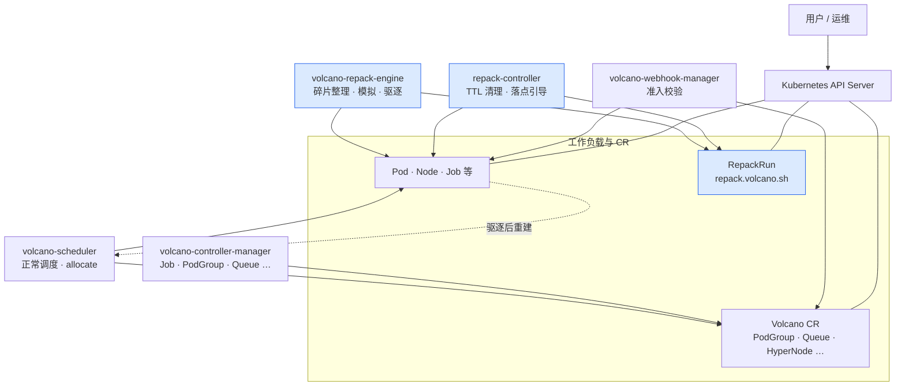
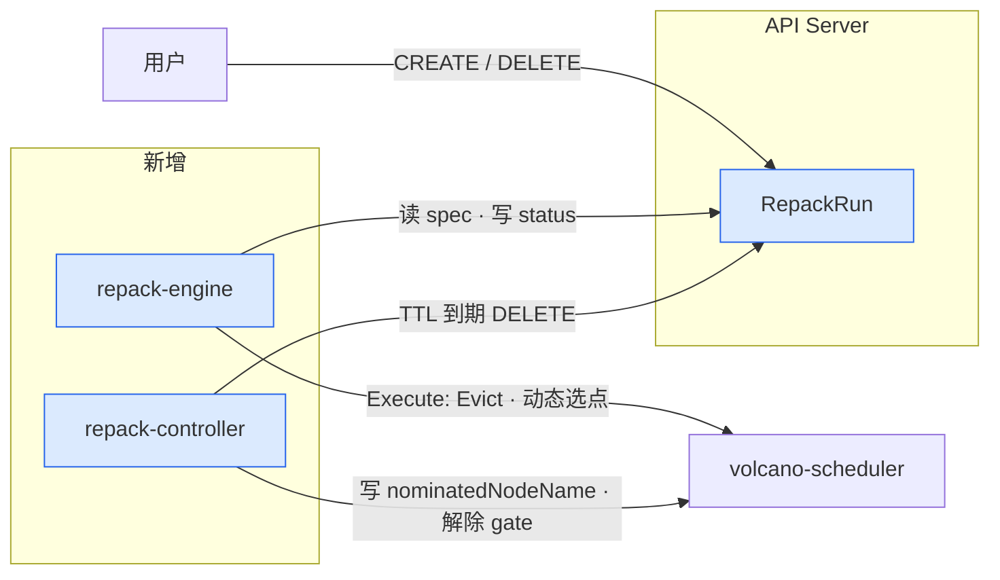
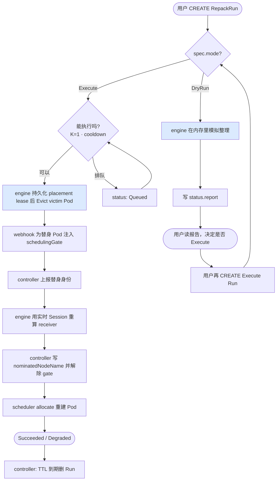

# Volcano + Repack 架构（简版）

> **推荐预览（手绘风格架构图）**：浏览器打开 [`volcano-topology.html`](./volcano-topology.html)（Rough.js · 类似 K8s 官方技术架构图布局）  
> **端到端生命周期旅程**：浏览器打开 [`repack-lifecycle-journey.html`](./repack-lifecycle-journey.html)  
> Markdown Mermaid 备选：Cursor 打开本文件 → `Cmd+Shift+V`

---

## 1. 顶层：Volcano 里多了什么

一张图看全貌。**实线 = 已有组件**；**蓝色 = 本次新增**。



**三句话记住边界：**

1. **scheduler 不读 RepackRun** — 只管 Pending Pod 的 bind。
2. **repack-engine 只管 RepackRun** — 模拟（DryRun）或驱逐（Execute），不 bind Pod。
3. **repack-controller 辅助收尾** — 终态 Run 到期删除；报告替身 Pod、写入 `nominatedNodeName` 并解除 placement gate；真正的选点仍由 engine 基于实时 scheduler Session 完成。

| 组件 | 干什么 | 碰 RepackRun 吗 |
|------|--------|:---------------:|
| volcano-scheduler | 调度、绑定 Pod | 否 |
| volcano-repack-engine | 读 Run，写 report/result，Execute 时 Evict | **是（核心）** |
| repack-controller | TTL 删 Run；引导重建 Pod 落点 | 读 + 删 |
| volcano-controller-manager | 其它 Volcano 业务 | 内嵌 repack-controller |
| RepackRun（CRD） | 一次整理任务的单据 | — |

> **P1 预留**：`RepackPolicy`（自动触发、集群默认策略）尚未实现，P0 用户手动 CREATE `RepackRun` 即可。

---

## 2. Repack 核心：RepackRun 怎么被处理

用户只和 **RepackRun** 打交道；三个进程通过 API Server 协作，**彼此不直连**。



### 2.1 两条主路径



| 步骤 | 谁做 | 做什么 |
|:----:|------|--------|
| 1 | 用户 | `kubectl create` RepackRun |
| 2 | API | CEL 校验（spec 不可改、Execute 必须带 scope） |
| 3 | **engine** | DryRun 出报告，或 Execute 驱逐 |
| 4 | **webhook + controller** | webhook 给有 placement lease 的替身打 gate；controller 上报替身、写 nomination 并只移除该 gate |
| 5 | **engine** | 以新的 scheduler Session 计算当前可行 receiver；无可行节点则重试至 deadline |
| 6 | **scheduler** | gate 解除后给替身选 Node；controller 核验实际绑定是否与 selected receiver 一致 |

`eviction.gracePeriodSeconds` 只控制提交给 Kubernetes Eviction API 的
`deleteOptions.gracePeriodSeconds`，不等待 Pod 终止或替身 Ready。Eviction API 始终受
PDB 约束；未来 PDB 的预检和被阻塞后的处理策略统一演进到 `spec.eviction.pdb`。

### 2.2 placement gate：并发扰动下的闭环

普通 `nominatedNodeName` 只是软提示；在 victim 仍处于 Terminating 时，装箱评分可能把刚创建的替身立即调回待腾空节点。Execute 在驱逐前给相关 PodGroup 写入带 RepackRun UID 的 placement lease。Pod mutating webhook 仅对持有该 lease 的替身注入 `repack.volcano.sh/placement` scheduling gate，并同时在 Pod 写入同值的 `repack.volcano.sh/placement-gate-owner`。后者是 gate 的精确归属记录，因此不会识别或依赖任何原生工作负载类型。

替身出现后，controller 根据 Pod 上的 gate owner 只读取对应的 RepackRun，记录具体 Pod 的 name/UID 和 `Gated` 状态，不扫描或猜测其它 Run。Engine 再使用最新 scheduler Session 重算 receiver：排除本次要腾空的节点，要求当前 `Idle` 已足够，并通过完整 predicate 模拟验证；原计划 receiver 仍是首选。选点持久化为 `selectedNodeName` 后，controller 才写 `nominatedNodeName` 并解除 gate，但保留 owner 直到实际绑定被观察；绑定完成后回写 `Placed` 或 `Degraded`，再清除 owner。

这不是 scheduler 的永久硬约束，也不保留节点。若并发任务抢占了可行容量，gate 会在 nomination deadline 前保持并定期重算；到期将 nomination 标记为 `Expired`，controller 据此只移除本机制添加的 gate，让 Pod 恢复正常调度，同时 Run 标记为 `Failed` / `PlacementDegraded`。原生负载在此窗口扩容时，新 Pod 可能短暂带 gate；对 Deployment 这类无单 Pod 稳定 identity 的负载，扩容 Pod 与替身在旧 victim 仍 Terminating 时不可区分，必须保持 gate 至 victim 消失后完成匹配、已有 nomination 被其它 Pod 认领，或 Run 终态统一放行。

职责边界固定为：engine 创建、校验并回收 PodGroup lease，controller 独占 Pod gate/owner 的认领、放行与异常清理。Run 终态或被删除时，controller 通过 owner 索引唤醒所有相关 Pod；controller 重启时，Pod informer 的初始 Add 事件也会重新清理孤儿 gate。Webhook 只对配置给 Volcano scheduler 的 Pod 生效，并在 lease 对应 Run 不存在、UID 不一致或已终态时忽略 stale lease。下一 Run 仍会在写 lease 时回收残留值。

自动 PodGroup 的更新不能把 `metadata.annotations` 整体替换。pg-controller 对 `volcano.sh/*` 和 `*.volcano.sh/*` 域采用“旧值为基线、新计算值覆盖”的合并：负载更新提供新值时同步新值，未提供时保留已有值；`scheduling.volcano.sh/group-min-member` 等专用调度字段仍按既有逻辑更新 PodGroup Spec。这样滚动更新不会误删 `repack.volcano.sh/placement-lease`，而 lease 的删除权始终属于 Repack engine。

### 2.3 RepackRun 上你要关心的字段

```text
spec（创建后不能改）
  mode     DryRun = 只看报告；Execute = 真驱逐
  scope    哪些 PodGroup / Node 可以动（可省略；省略即整个集群）
  goals    整理哪种资源，例如 nvidia.com/gpu
  eviction.gracePeriodSeconds
           Execute 的优雅终止请求秒数；不填沿用 Pod 自己的 terminationGracePeriodSeconds
  ttl…     跑完后多久自动删

status（组件写，用户读）
  report   DryRun 结果：建议动哪些、能腾出多少
  result   Execute 结果：实际动了哪些
  nominations[].selectedNodeName / actualNodeName
           运行时选定的 receiver 与实际绑定节点；phase 为 Gated、AwaitingCapacity、Nominated、Placed、Degraded 或 Expired
  phase    Pending → Running → Succeeded / Failed
```

---

## 3. 代码在哪

| 是什么 | 路径 |
|--------|------|
| RepackRun CRD | `config/crd/.../repack.volcano.sh_repackruns.yaml` |
| 引擎 | `cmd/volcano-repack-engine/` · `pkg/repackengine/` |
| Controller | `staging/.../repack-controller/`（默认编进 controller-manager） |
| 部署 | `installer/repack/` |
