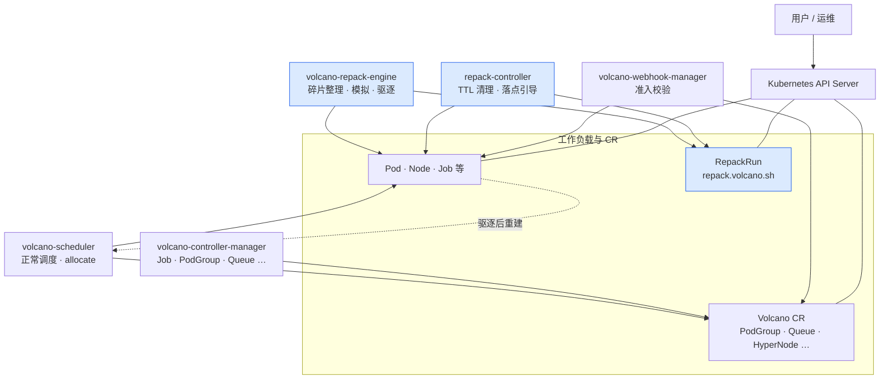
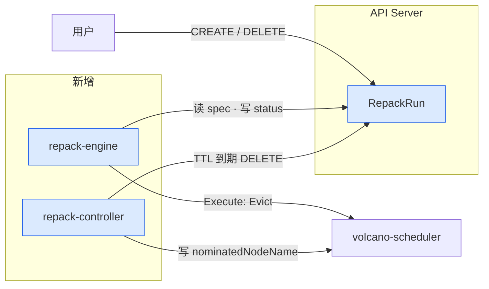
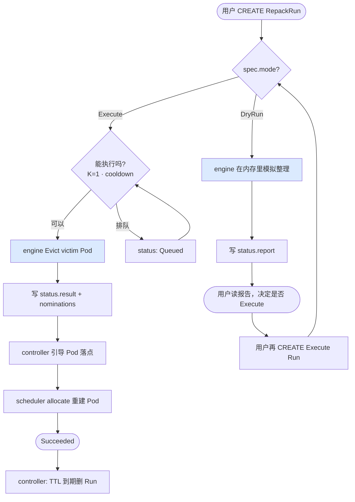

# Volcano + Repack 架构（简版）

> **推荐预览（手绘风格架构图）**：浏览器打开 [`volcano-topology.html`](./volcano-topology.html)（Rough.js · 类似 K8s 官方技术架构图布局）  
> **端到端生命周期旅程**：浏览器打开 [`repack-lifecycle-journey.html`](./repack-lifecycle-journey.html)  
> Markdown Mermaid 备选：Cursor 打开本文件 → `Cmd+Shift+V`

---

## 1. 顶层：Volcano 里多了什么

一张图看全貌。**实线 = 已有组件**；**蓝色 = 本次新增**。



**三句话记住边界：**

1. **scheduler 不读 RepackRun** — 只管 Pending Pod 的 bind。
2. **repack-engine 只管 RepackRun** — 模拟（DryRun）或驱逐（Execute），不 bind Pod。
3. **repack-controller 辅助收尾** — 终态 Run 到期删除；把 Execute 结果写到 Pod 的 `nominatedNodeName`，帮 scheduler 落子。

| 组件 | 干什么 | 碰 RepackRun 吗 |
|------|--------|:---------------:|
| volcano-scheduler | 调度、绑定 Pod | 否 |
| volcano-repack-engine | 读 Run，写 report/result，Execute 时 Evict | **是（核心）** |
| repack-controller | TTL 删 Run；引导重建 Pod 落点 | 读 + 删 |
| volcano-controller-manager | 其它 Volcano 业务 | 内嵌 repack-controller |
| RepackRun（CRD） | 一次整理任务的单据 | — |

> **P1 预留**：`RepackPolicy`（自动触发、集群默认策略）尚未实现，P0 用户手动 CREATE `RepackRun` 即可。

---

## 2. Repack 核心：RepackRun 怎么被处理

用户只和 **RepackRun** 打交道；三个进程通过 API Server 协作，**彼此不直连**。



### 2.1 两条主路径



| 步骤 | 谁做 | 做什么 |
|:----:|------|--------|
| 1 | 用户 | `kubectl create` RepackRun |
| 2 | API | CEL 校验（spec 不可改、Execute 必须带 scope） |
| 3 | **engine** | DryRun 出报告，或 Execute 驱逐 |
| 4 | **controller** | 把落点写到 Pod；Run 完成后按 TTL 删除 |
| 5 | **scheduler** | 给被删后重建的 Pod 选 Node（可 honor nomination） |

### 2.2 RepackRun 上你要关心的字段

```text
spec（创建后不能改）
  mode     DryRun = 只看报告；Execute = 真驱逐
  scope    哪些 PodGroup / Node 可以动（Execute 必填）
  goals    整理哪种资源，例如 nvidia.com/gpu
  ttl…     跑完后多久自动删

status（组件写，用户读）
  report   DryRun 结果：建议动哪些、能腾出多少
  result   Execute 结果：实际动了哪些
  phase    Pending → Running → Succeeded / Failed
```

---

## 3. 代码在哪

| 是什么 | 路径 |
|--------|------|
| RepackRun CRD | `config/crd/.../repack.volcano.sh_repackruns.yaml` |
| 引擎 | `cmd/volcano-repack-engine/` · `pkg/repackengine/` |
| Controller | `staging/.../repack-controller/`（默认编进 controller-manager） |
| 部署 | `installer/repack/` |
