# Repack 平台治理设计

> **实现一致性说明（2026-07-27）**：本文同时保留设计取舍与后续演进构想。
> 当前 `RepackRun` API 以
> `staging/src/volcano.sh/apis/pkg/apis/repack/v1alpha1/repackrun_types.go`
> 和生成的 CRD
> `config/crd/volcano/bases/repack.volcano.sh_repackruns.yaml` 为准；§4.5、
> §4.6 和 §12 已按实现对齐。§15 是历史修订记录，其中的旧字段名不代表当前 API。
>
> **当前能力**：只交付 cluster-scoped `RepackRun`；每个 Run 整理一种扩展资源。
> `scope` 在 DryRun/Execute 中都可省略；Execute 使用 Kubernetes Eviction API，
> 并通过 `status.relocations` 持久化逐 Pod 的 eviction/placement 进度。
> `RepackPolicy`、relief-driven 目标和可配置 `disruptionPolicy` 仍是后续设计，
> 不是当前 CRD 字段。
>
> **状态模型**：`conditions` 是权威事实，`phase` 是派生投影；两种 mode
> 共用不可变 `status.plan`，Execute 另写 `status.result` 和
> `status.relocations`。完整字段与写入所有权见 §4.6 和
> [proposal §5.2](./repack-runtime-defragmentation.md#52-repackrun-api)。
>
> **落点引导**：replacement Pod 先由 scheduling gate 暂停，控制器认领，
> 引擎依据最新调度快照选择 receiver，控制器再写 soft nomination 并释放 gate；
> 不做 Reservation/资源占位。
>
> **API 版本**：`repack.volcano.sh/v1alpha1`。
>
> **组件**：`volcano-repack-engine` 负责规划、驱逐、结果验证和实时选点；
> controller-manager 负责 replacement 认领、nomination/binding 观测与 RunGC；
> `volcano-scheduler` 保持常规调度职责。
> **关联文档**：[gpu-defragmentation-requirements.md](./gpu-defragmentation-requirements.md)（碎片整理总体需求与 FR/NFR）  
> **命名**：对外能力称 **Repack**（重排/整理）；CRD Kind 为 `RepackPolicy`（策略）与 `RepackRun`（单次执行）。

---

## 1. 摘要

Repack 面向 AI 负载在 **Node 级 + 多层 HyperNode 级** 的运行期碎片治理：在集群总资源充足、但因碎片分布导致作业 pending 时，通过模拟调度选出可搬迁的 victim，原子提交搬迁计划，腾出可承接分布式任务的连续容量。

本设计聚焦 **平台如何用 CRD 表达策略**，而非重复展开引擎实现细节（引擎、度量、部署形态见需求文档 §4.4b、§4.5）。

核心结论：

1. **分期：P0 只交付 `RepackRun`（自洽手写、手动 CREATE）；`RepackPolicy` 推迟到 P1**（模板生成，§3.3）。P0 把字段直接写在 Run 上；P1 的 Policy 内嵌 `RepackRunSpec` 作模板、按触发生成 Run，引擎契约不变。Run **一次性且用户不可修改**（仅 CREATE/READ/DELETE，§4.5.4），用 **CEL transition rule** 强制不可变。**准入=CEL（apiserver），无控制器 Admit、无继承补全。**
2. **Run 归属 Policy** 用标准 **`metadata.ownerReferences`** 表达（P1，Policy 生成 Run 时打），**不在 spec 放 `policyRef`**。两者均 **Cluster-scoped**；Repack 为 **平台级特权能力**，CREATE 权限限平台 SA（§4.5.1）。
3. **Policy 复用 Run 的 spec**：`RepackPolicy.runTemplate.spec` 就是一份 `RepackRunSpec`（单一事实来源）；**易写、可手写**；**常用只 `mode`+`scope`**（§4.5.2）；无隐藏的 `repackContext`。
4. Run 由用户**一次性 CREATE**（或 P1 Policy 自动生成）；**准入全部在 apiserver 由 CEL 完成**（校验 + spec 不可变），**无控制器 Admit、无补全**。受保护对象直接写 `scope.podGroups.exclude`（本轮护栏，执行时叠加 PDB 守卫，§4.13.4）。
5. **`volcano-repack-engine`（独立 Pod，§4.7）** 只读 `RepackRun.spec`，不读 Policy；**`volcano-scheduler` 不碰 Repack CR**；Execute 在 `scope` 内**重算**——审批粒度=scope 非具体方案。
6. DryRun → 用户读 `status.plan` → 新建 Execute Run；**DryRun 与 Execute 共用同一 `status.plan`**（`summary` + `moves[]` + `freedNodes[]`，`moves[].pods[]` 带 `fromNode→toNode` 计划落点；顶层 `status.message` 提供一句话摘要）。
7. RepackRun 对齐 **Job 一次性语义**：`ttlSecondsAfterFinished` 终态自动清理；**不设运行超时字段**——「卡在 Running」由引擎启动时**崩溃孤儿回收**兜底；P1 Policy 有扁平 `successfulRunsHistoryLimit`/`failedRunsHistoryLimit` 历史上限。
8. **并发模型**：Execute 全局 **K=1 + 引擎级 `executeCooldown`**，**DryRun 不占 Execute 槽**；长期规划 scope 不相交并行（§4.5.5）。
9. **`status.phase` + `conditions`**：**conditions 权威、phase 派生**；参考 Job 的 Complete/Failed/Progressing，结合排队、DryRun/Execute 划分 Succeeded/Failed（**准入=CEL，无 `Admitted` 条件**，§4.6.1）。
10. **引擎三件套（§4A）共用一个可调度性检查**（`Snapshot.FeasibleRelocation`：克隆 node + cycle-state、`ssn.SimulatePredicateFn` 跑完整过滤栈模拟重落）：**碎片整理指数**（§4.12）、**收益门控**（碎片改善达阈值才整理，否则 `NoRepackNeeded`，§4.13）、**模拟匹配**（沙箱里把被挪 gang 填进碎片、逐个重落，§4.14）。**硬不变量 INV-RESCHED**：repack 是搬家非抢占——**每个被挪的 pod 都必须能重新落下**，否则方案不可行、不驱逐（§4.14.2）。**P0 为 consolidation-driven**；relief-driven 的"目标落点（相位1）"为 **P1**。全部建立在 Volcano 现有引擎之上。
11. **PDB 兼容（P0，§4.13.4）**：当前执行期通过 **Eviction 子资源**由
    apiserver/PDB 服务端兜底；模拟期提前过滤仍是待完善项，因此计划可能在执行时
    被 PDB 拒绝并以 `EvictionFailed` 结束。
12. **P1 扩展已预留方案（§4.15）**：多级 HyperNode 拓扑、队列配额感知、最优成本整理（最少作业/卡）、单作业抗反复中断；spec 注释占位、引擎扩展点接入，不改 P0 契约。
13. **策略可插拔（§4.16）**：repack 全程沿用 Volcano **action+plugin** 范式，关键策略点（碎片度量 `FragmentScoreFn`、收益门控 `RepackBenefitFn`、中断代价 `DisruptionCostFn`、目标画像 `TargetProfileFn`、P1 plan 择优 `RepackPlanScoreFn`）暴露为 **`ssn.AddXxxFn` 扩展函数**，核心库只编排、不写死口径。
14. **主 KPI 定稿（§4.12.2a）**：`WeightedFragRate` = **空节点整合**，**逐目标资源** `FragRate(R)=(B_R−A_R)/M_R` 经 `FragWeightFn` 合成；§4.13 门控对其求差；`(B_R−A_R)/B_R` 为辅助视角；与「画像可调度」口径互补。
15. **加速资源整理，单资源/Run（P0/P1，§4.12）**：面向 GPU/NPU 等通用整理，整理哪类资源 = **`spec.goals[0].resource`**（每个 Run **至多一条**，`omitempty` + CRD `maxItems:1`；留空则回落引擎 `--repack-default-resource`，两者皆空或默认值非法时以 `InvalidConfiguration` 失败，解析优先级见 §4.12.2b）。**一个 Run 同时整理多类资源 = P2+**；`goals[]` 的列表形状仅为演进留槽，当前 status 没有逐资源结果层，不能只放开 `maxItems` 就宣称完成支持。

---

## 2. 背景与动机

### 2.1 问题

装箱（`binpack`、`network-topology-aware` 等）只在任务**入场时**生效。负载结束、抢占、缩容后，集群会出现 node / HyperNode 多层碎片空洞。典型症状：

- 集群总 GPU/拓扑容量足够；
- 正常 `allocate` 无法放置 pending 作业；
- 经 Repack 模拟后**可以**放置。

这与 KAI Scheduler 的 **Consolidation**（pending 驱动、总量够但放不下时自动整理）场景一致，但 Volcano Repack 定位为 **平台级**：多触发源、范围/预算/审计、多租户策略，而非调度器内部单一开关。

### 2.2 与相近能力的关系

| 能力 | 驱动 | 平台策略 | 关系 |
|------|------|----------|------|
| `gangpreempt` | `JobStarving`、队列优先级 | 无 CRD | 同模拟引擎，不同触发与 victim 规则 |
| `gangreclaim` | 队列超用、公平性 | 无 CRD | 同上 |
| KAI Consolidation | pending + 碎片 | 集群配置 | 可借鉴 `onPendingFragmentation` 检测逻辑 |
| Repack（本设计） | 多触发 + CRD | `RepackPolicy` | 碎片治理专用，平台可编排 |

Repack **不等于** gang 抢占：优化目标是 **降低碎片、解开 pending**，不是队列饥饿或公平性回收。

---

## 3. 目标与非目标

### 3.1 目标（P0）

- **交互层（P0）**：`RepackRun` 以 **`spec.mode: DryRun | Execute`** 区分预整理与真实执行；当前 spec 由 `mode`、`scope`、`goals`、`maxPerRun`、`eviction` 和 `ttlSecondsAfterFinished` 组成。
- **DryRun（P0）**：模拟并终态，输出 `status.plan`（`summary`/`moves`/`freedNodes`）。
- **Execute（P0）**：用户新建 Run；`scope` 可选，省略时按全集群重新规划，再经 Eviction API 与 replacement placement 闭环执行。
- **策略层（P1）**：`RepackPolicy` 只作为模板化 Run 的生产者；其 schema 尚未落地，不属于当前 CRD。
- **Scheduler/engine 始终仅读 Run.spec**（与 Policy 无关，故分期不影响引擎）。
- Gang / 拓扑语义与 `gang-aware-eviction`、现有 bundle 模型对齐。

### 3.2 非目标

- **P2 不做**：多 Policy 合并、`RepackConfig` 系统级配置、跨 Policy 冲突仲裁。
- 不替代 `allocate` / `preempt` / `reclaim` 的常规调度语义。
- P0 收益门控走**阈值式**（解开 pending / 碎片改善，§4.13）；**加权收益函数调参面板**与**多层 HyperNode 整理顺序优化**留 P1/P2（见需求文档 §6）。
- 不绑定 `rescheduling` 插件或 descheduler 原型。
- **不做 Reservation / 占位**：不引入预留 pod、不在调度器全局资源视图里扣住容量。预留对 allocate 侵入大、会外溢影响无关 job（误伤排队、与 autoscaler/preempt 争抢、死锁风险），负面影响不可控。落点一致性改用 **soft nomination**（§4.7.1），最坏退化为现网自由重排。
- P1：`triggers.schedule`、`fragRate`、路径 C 全自动 Execute。

### 3.3 交付范围与 CRD 分期（权威，覆盖全文 P0/P1 标注）

> **本节为定稿口径，权威覆盖全文。** 本文为「推演与取舍记录」，成文早于最终定稿；**§4 中若干旧机制已被取代**，一律以本节 + [proposal](./repack-runtime-defragmentation.md) 为准。

> **⚠️ 相对本文旧稿的关键变更（已定稿）**：
>
> 1. **准入 = CEL（apiserver），无控制器 Admit**：`RepackRun` 的校验（mode 枚举、`goals≤1`、spec 不可变）全部由 CRD 上的 CEL/marker 在创建期完成。scope 两种 mode 均可省略（=全集群），迁移规模由引擎计划兜底。**没有控制器 Admit 步骤、没有 Admit 继承补全、没有 `Admitted` 条件**。后文凡「Controller Admit / 从 Policy 继承补全 / `conditions[Admitted]`」均已废弃。
> 2. **`RepackPolicy` = 纯模板生成（CronJob→Job 式），只做 P1**：Policy 内嵌一份 `RepackRun` 模板（`runTemplate.spec` = `RepackRunSpec` 本体），按 `trigger` 生成 Run。**不承担集群级默认/硬护栏**（那是治理，另议）。字段为 `trigger`(`cronSchedule`/`onPendingBlocked`/`onFragmentation`) · `runTemplate` · `suspend` · 扁平 `successfulRunsHistoryLimit`/`failedRunsHistoryLimit`。**已删除 `triggers`/`approval`/`concurrencyPolicy`/`runRetention` 及「继承补全/护栏下发」。**
> 3. **万物皆 PodGroup 的 scope**：`scope.podGroups.include/exclude`（`selector` 匹配 PG 标签 ∪ `names`）；非 vcjob 负载靠 **pg-controller 把 pod 模板标签继承到 PodGroup**（配套增强）使 selector 生效。**已删除 `excluded*` 独立字段与「Policy 级硬红线实时下发」。**
> 4. **删除 `activeDeadlineSeconds`**：不再设运行超时字段；「卡在 Running」由引擎启动时的**崩溃孤儿回收**（Running 孤儿标 Failed + 交 TTL）兜底。
>
> 后文 §4.2/§4.3/§4.4/§4.4.1/§4.4.2/§4.5.1/§4.5.4/§4.6.1/§4.7 中与上述冲突的叙述，以本节为准。

> **能力分期（权威，覆盖全文）**：
>
> - **P0**：`mode`(DryRun/Execute) · 可选 `scope`(podGroups/nodes 两轴 include/exclude) · `goals` **至多一条**(省略时回落引擎默认资源) · `maxPerRun`(规模上限) · `eviction.gracePeriodSeconds` · `ttlSecondsAfterFinished`；**consolidation-driven**（为腾空节点而整理）；INV-RESCHED 硬约束 + 引擎内部扰动择优 + 整 gang 完整搬迁（默认）。
> - **P1**：`RepackPolicy`（模板生成）；解救 pending gang、可配置扰动策略和 PDB 规划/阻塞处理；以及多级拓扑 / 队列配额 / 成本整理 / 防饿死等。上述 relief/disruption/PDB 的 API、类型与字段均待后续讨论，当前不在 `RepackRun` 中声明。
> - **P2+**：单个 Run **多资源整理**（`goals` 多条 + 跨资源合成）。
>
> 即 **P0 = 单资源、consolidation-driven、无 relief、无可配扰动/PDB API**；扰动控制在 P0 仅靠引擎内部评分 + `scope` 划片 + `maxPerRun` + INV-RESCHED 保底。

**关键设计前提：Policy 复用 Run 的 spec**——`RepackPolicy.runTemplate.spec` 就是一份 `RepackRunSpec`（单一事实来源、零 schema 漂移）。因此分期很自然：

| 维度 | **P0（仅 RepackRun）** | **P1（引入 RepackPolicy）** |
|------|------------------------|------------------------------|
| **触发方式** | **仅手动** `kubectl create` Run（DryRun / Execute） | + Policy `trigger`（`cronSchedule`/`onPendingBlocked`/`onFragmentation`）自动生成 Run |
| **spec 来源** | Run **完全自洽、手写全量**：`mode`/`scope`（含 exclude）/`goals`(至多一条)/`maxPerRun`/`eviction`/`ttlSecondsAfterFinished` | Policy 用 `runTemplate.spec` **生成** Run（模板即 RepackRunSpec）；**不做继承补全/护栏钳制**。P1 增量 API 待后续设计 |
| **归属** | **无** ownerReferences（无 Policy）；Run 独立对象 | 生成的 Run 经 `ownerReferences` 归属 Policy（随 Policy 级联删除） |
| **护栏** | Run 自带 `scope.podGroups.exclude`（划片）+ `maxPerRun` + INV-RESCHED；Execute 始终由 Eviction API 执行并受 PDB 服务端约束 | 同 P0；PDB 模拟期预检/阻塞策略与可配置 disruption policy 属后续设计 |
| **并发** | 引擎内置 **Execute K=1**（+ 启动参数 cooldown） | 同上（Policy 不加并发字段；控制器默认「上个派生 Run 未结束不新建」） |
| **回收** | Run 自带 `ttlSecondsAfterFinished` | + Policy `successfulRunsHistoryLimit`/`failedRunsHistoryLimit` 历史上限 |
| **引擎能力** | 碎片度量 / 收益门控 / 模拟匹配 / nomination **全部 P0**；**单资源 · consolidation-driven** | + **relief-driven** + **disruptionPolicy 整块（含 PDB）**；**多资源/Run = P2+** |

**为什么能这样切**：`volcano-repack-engine` 本就**只读 `RepackRun.spec`、从不读 Policy**（§4.7、§5.3）。P0 让用户**直接写全 Run.spec**；P1 加 Policy 只是「按触发生成 Run」的生产者，引擎、状态机、plan/result/relocations、模拟与度量**完全不变**。

---


## 4. 场景驱动 API 设计（v9）

### 4.1 场景陈述

| 步骤 | 谁 | 做什么 |
|------|-----|--------|
| **配置策略** | 平台/运维 | 声明节点池或集群级规整范围：何时触发、整理哪些 Job/节点、排除哪些 |
| **预整理** | 系统 | 模拟搬迁，输出 **预期方案**：动哪些任务、离开/迁入哪些节点、碎片率变化、pending 是否可解 |
| **用户筛选** | 用户 | 在方案中 **勾选部分 move**（按 Job 或节点粒度） |
| **正式执行** | 系统 | 仅对用户选中项做真实驱逐与重排 |

### 4.2 两个 CRD：均用户向，分工不同

```text
RepackPolicy  = 「按触发生成 RepackRun」的生产者（CronJob→Job 式；P1）
RepackRun     = 「这一次整理任务」（DryRun 或 Execute，跑完即终态）
```

| | RepackPolicy（P1） | RepackRun |
|--|--------------|-----------|
| **生命周期** | 长期存在 | 一次性 |
| **谁常写** | 平台/运维（**可 UPDATE**） | 用户 **仅 CREATE**；Policy 自动 CREATE；**均不可 UPDATE** |
| **spec 块** | `trigger`(`cronSchedule`/`onPendingBlocked`/`onFragmentation`) · **`runTemplate`**(内嵌 `RepackRunSpec`) · `suspend` · `successfulRunsHistoryLimit`/`failedRunsHistoryLimit` | **`mode`** · `scope` · `goals` · `maxPerRun` · `eviction` · **`ttlSecondsAfterFinished`** |
| **metadata** | — | 生成时：**`ownerReferences` → RepackPolicy** |
| **独有** | `trigger` / `runTemplate` / `suspend` / history limits | **`mode`** · **一次性生命周期（§4.5.3）** |
| **复用** | `runTemplate.spec` **就是一份 `RepackRunSpec`**（单一事实来源，零 schema 漂移） |

**设计原则**：

- Run.spec **不要求**用户理解「编译产物」；用户手写 YAML 与 Policy 生成的 Run **同一套字段**（Policy 直接内嵌 `RepackRunSpec` 作模板）。
- **归属关系**走 K8s 惯例：Policy 生成的 Run 带 **`metadata.ownerReferences`** 指向父级 `RepackPolicy`（随 Policy 级联删除）。
- **准入 = CEL（apiserver）**：Run 的校验在创建期由 CRD 上的 CEL/marker 完成；**无控制器 Admit、无从 Policy 继承补全**。DryRun/Execute 由 `mode`（或 Policy 模板的 `runTemplate.spec.mode`）决定。
- `status.plan`（DryRun/Execute 同一字段）仅在 Run 上，Policy 不承载方案详单。

### 4.3 交互总览

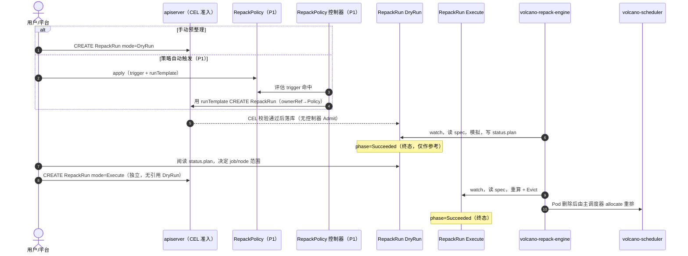
```mermaid
sequenceDiagram
    autonumber
    actor User as 用户/平台
    participant API as apiserver（CEL 准入）
    participant Policy as RepackPolicy（P1）
    participant PC as RepackPolicy 控制器（P1）
    participant Dry as RepackRun DryRun
    participant Live as RepackRun Execute
    participant RS as volcano-repack-engine
    participant VS as volcano-scheduler

    alt 手动预整理
        User->>API: CREATE RepackRun mode=DryRun
    else 策略自动触发（P1）
        User->>Policy: apply（trigger + runTemplate）
        PC->>Policy: 评估 trigger 命中
        PC->>API: 用 runTemplate CREATE RepackRun（ownerRef→Policy）
    end
    API-->>Dry: CEL 校验通过后落库（无控制器 Admit）
    RS->>Dry: watch，读 spec，模拟，写 status.plan
    Note over Dry: phase=Succeeded（终态，仅作参考）
    User->>Dry: 阅读 status.plan，决定 job/node 范围
    User->>API: CREATE RepackRun mode=Execute（独立，无引用 DryRun）
    RS->>Live: watch，读 spec，重算 + Evict
    RS->>VS: Pod 删除后由主调度器 allocate 重排
    Note over Live: phase=Succeeded（终态）
```

### 4.4 RepackPolicy — 规整策略（**P1**）

> **分期（§3.3）**：本节为 **P1**。P0 无 Policy——`RepackRun.spec` 手写全量即可（§4.5）；P1 引入 Policy 作为「按触发生成 Run」的生产者（内嵌 `RepackRunSpec` 作模板）。Cluster-scoped。

> **本节旧稿（Policy 承载集群级默认+护栏、Admit 继承补全、`excluded*` 实时下发、`triggers`/`approval`/`concurrency`/`runRetention`）已被取代。** 定稿见 [proposal §5.6.1](./repack-runtime-defragmentation.md#561-自动触发repackpolicy模板生成cronjobjob-式)。以下为定稿摘要。

**RepackPolicy = 纯模板生成（CronJob→Job 式，P1）**，职责单一：按 `trigger` 生成 `RepackRun`。

| Policy 字段 | 职责 |
|-----------|------|
| `trigger` | 三种触发源，命中任一即触发：`cronSchedule`（定时 cron）/ `onPendingBlocked`（有 gang 因碎片调度不下去）/ `onFragmentation`（碎片率超阈值） |
| `runTemplate` | 内嵌一份 `RepackRun`（`runTemplate.spec` = `RepackRunSpec` 本体）；DryRun/Execute 由模板 `spec.mode` 决定 |
| `suspend` | 暂停触发 |
| `successfulRunsHistoryLimit` / `failedRunsHistoryLimit` | 派生 Run 历史上限（扁平，对齐 CronJob） |

- **不承担集群级默认/硬护栏**：护栏（`scope.podGroups.exclude`、`maxPerRun`）仍写在 **Run** 上；「集群级默认 + 跨 Run 强制保护」属**治理**语义，另议（CEL `ValidatingAdmissionPolicy` 或后续单开 CRD），不在 Policy 内。
- **无 Admit 继承补全**：准入=CEL（apiserver）；Policy 只是「用模板 CREATE Run」的生产者，生成的 Run 带 `ownerReferences→Policy`（级联删除）。
- 反应式条件（`onPendingBlocked`/`onFragmentation`）的评估周期是**控制器级配置**（启动 flag，性质同 Execute 冷静期），不进 CRD。
- **受保护对象（P0）**：直接在 `RepackRun.spec.scope.podGroups.exclude` 按标签排除（本轮护栏，静态圈选 + 执行时 PDB 守卫，§4.13.4）；引擎只读 `RepackRun.spec`，不读 Policy。

### 4.5 RepackRun — 用户向 spec（P0 主体）

> **P0 自洽**：无 Policy 时，Run.spec 直接写
> `mode`/`scope`/`goals`/`maxPerRun`/`eviction`/`ttlSecondsAfterFinished`。
> **准入=CEL/CRD marker（apiserver）**：校验 mode 枚举、`goals≤1`、资源名、
> 数值范围和 spec 不可变；**无控制器 Admit、无从 Policy 继承补全**。
> `scope` 可选（省略=全集群），P0 Run 无 ownerReferences。

#### 4.5.1 Run 归属 Policy：`ownerReferences`（**P1**）

> P0 无 Policy，Run 为独立对象、**无 ownerReferences**；下列归属/级联 GC 随 Policy 在 P1 引入（Policy 生成 Run 时按 CronJob→Job 惯例打 ownerReferences）。

对齐 K8s **`CronJob` → `Job`**、**`Pipeline` → `PipelineRun`** 惯例：子对象用 **`metadata.ownerReferences`** 声明父级，**不用 spec 内嵌 ref**。

```yaml
metadata:
  name: pool-a100-dryrun-202606091000
  labels:
    repack.volcano.sh/repack-policy: pool-a100      # 必填：Policy 名，便于 list
    repack.volcano.sh/repack-mode: DryRun           # 推荐：DryRun | Execute
  ownerReferences:
    - apiVersion: repack.volcano.sh/v1alpha1
      kind: RepackPolicy
      name: pool-a100
      uid: "8f3c9a2e-..."                               # Policy 生成 Run 时填（P1）
      controller: true
      blockOwnerDeletion: false                         # 删 Policy 不阻塞；活跃 Run 由控制器收尾
```

| 机制 | 约定 |
|------|------|
| **ownerReferences** | **有且仅有 1 条** `kind=RepackPolicy`、`controller=true`。**Policy 与 Run 均为 Cluster-scoped**（无 namespace），cluster→cluster 归属合法；**不存在「同 namespace」约束**（早期措辞已废弃） |
| **labels** | **`repack.volcano.sh/repack-policy`** = Policy `metadata.name`（必填）；**`repack.volcano.sh/repack-mode`** = `spec.mode`（推荐，与 spec 一致） |
| **归属** | Policy 生成 Run 时（P1）打好 `ownerReferences[].name`/`uid`；准入=CEL，无控制器 PATCH 补全 |
| **查询** | `kubectl get repackrun -l repack.volcano.sh/repack-policy=pool-a100` |
| **GC** | `controller=true` 时，删除 Policy 可级联清理其 Run（与 TTL / RunGC 并存）；历史 Run 仍可由 `successfulRunsHistoryLimit`/`failedRunsHistoryLimit` / `ttlSecondsAfterFinished` 控制 |

**volcano-repack-engine 只读 `RepackRun.spec`、从不读 Policy**；P0 Run 无 owner，P1 生成的 Run 带 `ownerReferences→Policy` 仅供 GC/审计。

**RBAC 与跨 namespace 定位（重要）**：RepackRun 是 **Cluster-scoped**，而
`scope.podGroups.include.names` 使用 `namespace/name`，可跨多个 namespace。
因此一条 Run 等价于「**可对任意 namespace 的 Pod 发起 Eviction**」的平台级特权操作。P0 定位：

- **Repack 是平台/运维能力，非租户自助**：创建 RepackRun 的 **CREATE 权限**只授予平台 SA / 运维 ClusterRole；普通租户**不直接建 Run**。
- 租户表达「希望我的 Job 被整理 / 受保护」走 **pod/PodGroup 标签**（`repack-eligible` / 保护标签命中 `scope.podGroups.exclude`），由平台在 Run 的 scope 里统一收敛，而非靠 Run 的 namespace 权限边界。
- 若后续需要按 namespace 收敛权限，可演进为 **namespaced RepackRun**（每 namespace 一条、owner 为 namespaced 投影），P0 不做。

#### 4.5.2 spec 字段（Policy 用 runTemplate 复用同一 RepackRunSpec）

**选择单元 = PodGroup（更通用）**：scope 圈选的对象是 **PodGroup**，而非特指 Volcano Job（vcjob）。理由是 **Volcano 调度引擎本身就以 PodGroup 为单元**——`api.JobInfo.UID = "<podgroup.namespace>/<podgroup.name>"`（`cache/event_handlers.go::getJobID(pg)`），`FeasibleRelocation` / gang 判定 / victim 选择全在 PodGroup 粒度。

- **覆盖面更广**：vcjob、原生 Deployment/StatefulSet（带 PodGroup）、Kubeflow/其他 operator —— 凡是被 gang 调度的负载都有 PodGroup，统一以 PodGroup 圈选即可，不被 vcjob 局限。
- **引用即调度键**：`scope.podGroups.include.names` 的 `namespace/name` 就是引擎的 `JobID`，无 vcjob-name ≠ podgroup-name 的歧义。
- **selector 匹配 PodGroup 标签**：`podGroupSelector` 作用在 `PodGroup.metadata.labels` 上。
- 方案详单同口径：`plan.moves[].{namespace,podGroupName}`（§4.6）。

**一条 RepackRun = 「这一次整理任务」的工单。** **P0 顶层 5 个功能块**（`mode`/`scope`/`goals`/`maxPerRun`/`eviction`）+ 1 个生命周期字段（`ttlSecondsAfterFinished`）；**常用的只有 `mode` 和 `scope`**，其余可选、有默认。

| 顶层块 | 回答 | 必填? | 阶段 |
|--------|------|-------|------|
| **`mode`** | 只出方案(`DryRun`) 还是 真整理(`Execute`) | ✅ | P0 |
| **`scope`** | **在哪儿整理**：哪些运行中作业可被搬走、哪些节点可作为腾空目标；省略=全集群 | 否 | P0 |
| **`goals`** | **单资源碎片目标（P0/P1 至多一条）**：该类加速资源的碎片改善门槛；`resource` 必须是**扩展资源**（CEL `self.contains('/')`，如 `nvidia.com/gpu`；cpu/memory 等 native 资源被 apiserver 拒）；省略=回落引擎 `--repack-default-resource`，两者皆空或默认值非法均以 `conditions[Failed].reason=InvalidConfiguration` 失败（§4.12.2b）。多条=多资源 **P2+** | 否（有默认） | P0 |
| **`maxPerRun`** | **单轮规模封顶**：podGroups + resources(ResourceList，异构) | 否（有默认） | P0 |
| **`eviction`** | **如何提交已选 move**：`gracePeriodSeconds` 覆盖本次 Eviction 的优雅终止时间 | 否 | **P0** |
| `ttlSecondsAfterFinished` | 终态后多久自动清理（不设运行超时字段，卡 Running 由崩溃孤儿回收兜底） | 否 |

> **`scope.podGroups` = 可以被搬走的运行中作业**——腾地方的对象，会被**驱逐重排**。它圈的是「候选范围」不是「victim 名单」——引擎在范围内模拟、自己挑出真正要搬的。解救排队作业的目标语义不属于当前 P0 API，留待 P1 讨论。

**`scope` 按两个维度组织，每维 `include`/`exclude` 同构**（都用 `selector`+`names` 这一种 matcher）：

```text
scope:
  podGroups:                                  # 维度一：候选被搬迁的运行中作业
    include: { selector, names }              # 纳入：标签 ∪ 点名
    exclude: { selector, names }              # 排除：标签 ∪ 点名（护栏，可点名！）
  nodes:                                      # 维度二：限定/排除节点
    include: { selector, names }
    exclude: { selector, names }
```

- `include`/`exclude` **结构完全相同**——都是 `selector`(标签) ∪ `names`(枚举：PodGroup=`namespace/name`、Node=节点名)；**排除侧同样能按名字点名**。
- 单维有效集 = **`include` ∪ \ `exclude` ∪**（先并入 include，再减去 exclude）。
- **作业维 ∩ 节点维**：候选 = 「属于作业维有效集」**且**「有 pod 落在节点维有效集上」的 PodGroup。

**空值语义：遵循 K8s LabelSelector，并补充空 matcher 约定**

| 写法 | 含义 | 说明 |
|------|------|------|
| **省略整块**（不写 `include`/`exclude`/某维） | include 省略→全部纳入；exclude 省略→不排除；某维省略→该维不约束 | 与 `ScopeMatcher` 的默认行为一致 |
| `selector: {matchLabels}` / `names: [...]` | **标准命中** | 完全 K8s 标准语义 |
| `selector: {}` | 匹配全部 | 标准 K8s 空 LabelSelector 语义；用于 exclude 时会排除全部 |
| 空 `include: {}` / `exclude: {}` | include 全部 / exclude 无匹配 | 当前 CRD 不拒绝，运行时按空 matcher 处理 |

> 引擎判定：`S(m)=selector(标准 K8s 语义) ∪ names`；`included = include 省略 ? 全部 : S(include)`；`excluded = exclude 省略 ? ∅ : S(exclude)`；`有效 = included \ excluded`。

- 两维都省略：DryRun/Execute 都使用默认全集群可整理域。
- 例：`podGroups.include.names:[A,B]` + `podGroups.exclude.names:[A]` → 只剩 B；再 ∩ 节点维。

**最小示例（从简到全）**

```yaml
# A. 最简：只看全局建议（除 mode 外什么都不填）
apiVersion: repack.volcano.sh/v1alpha1
kind: RepackRun
metadata: { name: look-1 }
spec: { mode: DryRun }
---
# B. 真正执行：允许动 a100 池里带 repack-eligible 标签的作业来腾地方
spec:
  mode: Execute
  scope:
    podGroups: { include: { selector: { matchLabels: { repack.volcano.sh/repack-eligible: "true" } } } }
    nodes:     { include: { selector: { matchLabels: { volcano.sh/node-pool: a100 } } } }
```

**P0 完整字段参考（RepackRun 自洽，手写全量；无 Policy/无 ownerReferences，§3.3）**：

```yaml
apiVersion: repack.volcano.sh/v1alpha1
kind: RepackRun
metadata:
  name: pool-a100-dryrun-202606091000
  # P0 无 ownerReferences / repack-policy label（Policy 是 P1，§4.5.1）
spec:
  mode: DryRun                              # DryRun | Execute

  # ① 在哪儿整理：两个维度，每维 include/exclude 同构（都含 selector 标签 + names 点名）
  scope:
    podGroups:                              # 候选被搬迁的运行中作业
      include:
        selector: { matchLabels: { workload-type: training } }
        names:    [ ml/debug-job-1, ml/sidecar-x ]               # namespace/name；与 selector 并集
      exclude:                              # 护栏：标签或点名都可（另叠加 PDB，§4.13.4）
        selector: { matchLabels: { workload-type: inference } }
        names:    [ ml/infer-canary ]
    nodes:                                  # 限定/排除节点（可选）
      include:
        selector: { matchLabels: { volcano.sh/node-pool: a100 } }
        names:    [ node-3, node-7 ]
      exclude:
        selector: { matchLabels: { repack.volcano.sh/repack-protected: "true" } }
        names:    [ node-guard-1 ]

  # ② 单资源碎片目标（P0/P1：至多一条，CEL maxItems:1；可选，省略=回落引擎 --repack-default-resource，见 §4.12.2b）
  goals:
    - resource: nvidia.com/gpu              # 这一个 Run 整理哪类资源（GPU/NPU…）
      minFragImprovementPercent: 5          # 碎片率至少下降 5 个百分点（0-100）
  # 多资源（goals 多条、一个 Run 同时整理 GPU+NPU）= P2+；列表形状已预留，P2 放开 maxItems

  # ③ Execute 的 Eviction 请求参数（P0）；不填沿用每个 Pod 自己的终止宽限期
  eviction:
    gracePeriodSeconds: 30

  # ④ 单轮规模封顶（可选，有默认；区别于 K8s 资源 limits）
  maxPerRun:
    podGroups: 10                           # 单轮最多搬几个 PodGroup（跨资源计数）
    resources:                              # 逐资源单轮上限（ResourceList，异构/可演进）
      nvidia.com/gpu: 64
      huawei.com/Ascend910: 32              # 长期可加 cpu: "2000" / memory: "4Ti"

  # ⑤ 生命周期（不设运行超时字段；卡 Running 由崩溃孤儿回收兜底）
  ttlSecondsAfterFinished: 86400            # 终态后 24h 自动 DELETE
```

> 读完 DryRun `status.plan` 后，用户可把认可的条目抄进
> `scope.podGroups.include.names` / `scope.nodes.include.names`，再建 Execute Run；
> 也可省略 scope 执行全集群重算（§4.5.4）。

> **以本块为 P0 字段示例**。Execute 同结构，仅将 `mode` 改为 `Execute`；
> 是否填写 scope 取决于期望授权范围。精确 schema 以 §12 列出的 Go API/生成 CRD 为准。

#### 4.5.3 一次性任务生命周期（对齐 Job）

RepackRun 是 **跑完即终态** 的工单，生命周期能力 **定义在 Run.spec**。

> **P0 只看 `RepackRun.spec.ttlSecondsAfterFinished`**（终态后自动删）。**不设运行超时字段**——「卡在 Running」由引擎启动时**崩溃孤儿回收**（Running 孤儿标 Failed）兜底。下表中带 **`Policy` 历史上限**的裁剪**是 P1**（依赖 Policy）；P0 不做历史裁剪、TTL 未写即不自动删。

**与 `batch/v1 Job` 对照**：

| Job / CronJob | RepackRun / RepackPolicy | 说明 |
|---------------|--------------------------|------|
| `Job.spec.ttlSecondsAfterFinished` | **`RepackRun.spec.ttlSecondsAfterFinished`** | 终态后多久 **自动 DELETE** Run CR |
| `Job.spec.activeDeadlineSeconds` | **不实现**（崩溃孤儿回收兜底 stuck-Running） | — |
| — | **`status.startTime` / `completionTime`** | 进入 Running / 到达终态时由执行方写入 |
| `CronJob.spec.successfulJobsHistoryLimit` | **`Policy.successfulRunsHistoryLimit`**（P1，扁平） | 按 Policy **裁剪** 过多 Succeeded Run |
| `CronJob.spec.failedJobsHistoryLimit` | **`Policy.failedRunsHistoryLimit`**（P1，扁平） | 按 Policy **裁剪** 过多 Failed Run |

**`ttlSecondsAfterFinished` 语义**（与 Job 一致）：

| 值 | 行为 |
|----|------|
| **未写** | **不自动删**（P0；P1 也不由 Policy 补全，历史仅受 historyLimit 约束） |
| **`> 0`** | 到达终态（`Succeeded` / `Failed`）且 `status.completionTime` 已设后，**`completionTime + TTL`** 到期由 **RunGC** DELETE |
| **`0`** | 终态后 **尽快** DELETE（仍建议等 `completionTime` 写入后再删，避免丢审计） |

**phase 定义**见 **§4.6.1**（参考 Job `conditions` 模型，结合排队 / DryRun·Execute 能力；准入=CEL，无 Admit）。

**RunGC（Controller）职责**：

1. **TTL**：watch 终态 Run，按 `spec.ttlSecondsAfterFinished` + `status.completionTime` 调度 DELETE。
2. **History**：按 `ownerReferences` / label `repack-policy` 列出该 Policy 下 Run，超出 `successfulRunHistoryLimit` / `failedRunHistoryLimit` 的 **更旧** 终态 Run 主动 DELETE（与 TTL **并存**，先触达者先删）。
3. **activeRun 指针**：Run 终态后更新 `Policy.status.activeRun` → 空，写入 `lastSuccessfulRun` / `lastRun`。

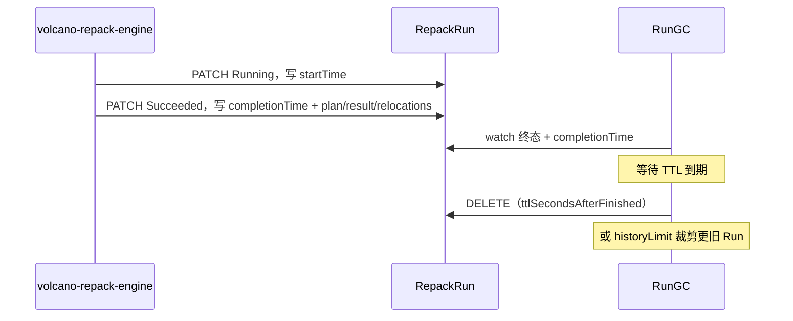
```mermaid
sequenceDiagram
    participant V as volcano-repack-engine
    participant R as RepackRun
    participant G as RunGC

    V->>R: PATCH Running，写 startTime
    V->>R: PATCH Succeeded，写 completionTime + plan/result/relocations
    G->>R: watch 终态 + completionTime
    Note over G: 等待 TTL 到期
    G->>R: DELETE（ttlSecondsAfterFinished）
    Note over G: 或 historyLimit 裁剪更旧 Run
```

**P0 字段必填/可选一览**（Run 自洽，全部手写在 Run 上）：

| 字段 | P0 | 说明 |
|------|----|------|
| `mode` | **必填** | `DryRun` / `Execute` |
| `scope.{podGroups,nodes}.include` | 可选；两种 mode 均可空（=默认可整理域） | 纳入范围（§4.5.2 语义） |
| `scope.{podGroups,nodes}.exclude` | 可选 | 本轮硬护栏（同样支持 selector/names）；另叠加 PDB（§4.13.4） |
| `goals` | 可选，最多一条 | `resource` 必填；`minFragImprovementPercent` 为 0-100 整数百分点。省略整个列表时回落引擎默认资源 |
| `maxPerRun` | 可选（有默认） | 单轮规模封顶（podGroups + resources ResourceList） |
| `eviction.gracePeriodSeconds` | 可选 | Execute Eviction 请求的优雅终止覆盖值；DryRun 忽略 |
| `ttlSecondsAfterFinished` | 可选 | 终态后多久清理（未写=不自动删，§4.5.3）；不设运行超时字段 |
| `metadata.ownerReferences` / `labels[repack-policy]` | **P0 不需要** | 归属 Policy 是 **P1**（§4.5.1） |

> **P1 起**：引入 Policy 后，用 `runTemplate.spec` 复用同一套 `RepackRunSpec` 生成 Run（无继承补全），并通过 `ownerReferences` 归属 Policy（§4.4）。**P0 一律手写。**

**最小手写示例**（枚举本轮要整理的 PodGroup 与 Node）：

```yaml
apiVersion: repack.volcano.sh/v1alpha1
kind: RepackRun
metadata: { name: exec-1 }                 # P0 无 ownerReferences
spec:
  mode: Execute
  scope:
    podGroups: { include: { names: [ ml/debug-job-1 ] } }   # 本轮要纳入整理的 PodGroup
    nodes:     { include: { names: [ node-3, node-7 ] } }   # 本轮要纳入整理的 Node
  # goals / maxPerRun / eviction / ttl 可省略
```

#### 4.5.4 不可变约束：用户不得修改 RepackRun

对齐 **`batch/v1 Job`**：工单提交后 **不可改 spec**；要调整范围 **新建一条 Run**，不 PATCH 旧 Run。

| 操作 | 用户/运维（人类身份） | Repack Controller | volcano-repack-engine |
|------|----------------------|-------------------|----------------|
| **CREATE** | ✅ 可提交初始 spec | ✅ 自动触发时 CREATE | — |
| **UPDATE / PATCH** spec 或 metadata | ❌ **禁止**（CEL `self==oldSelf`） | ❌（P1 仅 CREATE 时打 ownerReferences） | ❌ |
| **UPDATE / PATCH** status | ❌ **禁止** | ❌（除 GC 相关不经过 status） | ✅ |
| **DELETE** | ✅ 可取消执行中 Run | ✅ TTL / history GC | — |
| **READ** | ✅ | ✅ | ✅ |

**冻结时点**：**spec 自创建起即不可变**（apiserver CEL transition rule `self == oldSelf`，与调用方身份无关）；准入=CEL，无控制器 Admit 窗口、无 `excluded*` 同步例外。CEL 校验失败的对象根本不落库。

**与 RepackPolicy 对比**

| | RepackPolicy | RepackRun |
|--|--------------|-----------|
| 生命周期 | 长期 | 一次性 |
| 用户 UPDATE spec | ✅ 改规则 | ❌ **禁止** |
| 改意图的方式 | 直接改 Policy | **DELETE + 新建** 或 **再建一条 Execute Run** |

**不可变的实现：优先 CEL，webhook 仅做跨字段语义校验（P0）**

不可变**不靠**「webhook 比对 `userInfo` 是不是系统 SA」——那种方式对豁免用户、impersonation 脆弱。改用 apiserver 原生的 **CRD CEL 校验（`x-kubernetes-validations`，transition rule）**，与调用方身份无关：

```yaml
# CRD schema 片段（spec 顶层）：创建后逐字段不可变（整块 self==oldSelf）
x-kubernetes-validations:
  # 整个 spec 创建后冻结
  - rule: "self == oldSelf"
    message: "RepackRun.spec is immutable; create a new RepackRun to change it"
  # P0/P1：单资源/Run —— goals 至多一条（多资源整理 = P2+）
  - rule: "!has(self.goals) || size(self.goals) <= 1"
    message: "P0/P1 supports a single resource per RepackRun; multi-resource goals is P2+"
```

准入**全部由 apiserver 的 CEL/marker 完成**（无控制器 Admit、无 Validating Webhook）：

```text
CRD CEL / marker（创建期校验）：
On CREATE RepackRun:
  require mode ∈ {DryRun,Execute}                    // enum marker
  // scope 可选（DryRun/Execute 均可省略=全集群）；迁移规模由引擎计划
  // (maxPerRun/cooldown/K=1/PDB) 兜底，不再强制 Execute 带 scope include
  require size(goals) <= 1                            // maxItems
On UPDATE:
  reject（spec 冻结，CEL self==oldSelf）
// status 子资源仅执行方可写；无控制器 spec 补全、无 excluded* 同步。
```

**UX 提示**：`kubectl edit repackrun` / `kubectl apply` 更新应返回 **Invalid/Forbidden**；控制台不展示 Run spec 编辑表单，仅 **克隆为新 Run** 或 **从 `status.plan` 生成 Execute CREATE 草稿**。

**`mode` 语义**：

| mode | volcano-repack-engine 行为 | 终态 status |
|------|-------------------------------|-------------|
| **DryRun** | 在解析后的 scope 域内模拟，**不驱逐**（scope 全空 = 默认全集群可整理域） | `Succeeded` + **`plan`** |
| **Execute** | 在解析后的 scope 域内 **重新规划**，经 Eviction API 驱逐，并闭环替身 placement | `Succeeded/Failed` + `plan`；进入执行后另有 `result` / `relocations` |

**人工闭环（无 CR 间引用）**：

```text
RepackRun(A)  mode=DryRun   scope={…}  →  status.plan（建议迁哪些 job、哪些 node、碎片率）
        │
        │ 用户阅读 status.plan，自行决定范围（控制台 / CLI / 工单）
        ▼
RepackRun(B)  mode=Execute  scope={可选；selector 和/或列表}  →  引擎重算 → status.plan
        （与 A 无 spec 级关联；集群状态可能已变，故必须重算；省略 scope=全集群）
```

**审批粒度 = scope，而非具体方案（重要语义）**：因为 Execute **在最新集群状态上重算**，用户确认/批准的是 **本轮整理的范围（哪些 Job、哪些 Node）**，**不是** DryRun `status.plan` 里那份具体的 Pod 搬迁方案。Execute 实际驱逐的 Pod 可能与 DryRun plan 所示不同（集群已变）。

- 合规/审批语境下，应将其理解为「**授权在该 scope 内整理**」，而非「逐条批准这些搬迁」。
- 若需要「所见即所执行」的强一致（按 DryRun plan 执行、否则失败），列入 **P1：受约束 Execute** —— Execute 携带 DryRun 的 **plan 指纹 / planRef + 期望前置状态哈希**，引擎重算后若与指纹不一致则拒绝提交。P0 不做。

**不变量**（准入 / webhook）：

- DryRun / Execute 的 `scope` 都可省略；省略整块或某一轴表示该轴不筛选，`exclude` 仍优先。
- 单维 include 的匹配结果是 `selector ∪ names`；再减去 `exclude` 的匹配结果。
- RepackRun **用户不得 UPDATE**（§4.5.4）；**spec 自创建起冻结**（CEL `self==oldSelf`）；**禁止**跨 Run 引用字段。
- 改 scope / mode / maxPerRun → **新建** RepackRun，不修改已有 Run。
- **P1（有 Policy 时）**：`ownerReferences` 唯一指向 `RepackPolicy`、label 与之一致；解析后有效域须 **⊆ Policy.scope**。

**Execute 示例 A — 显式枚举**（读完 `status.plan` 后，把要整理的 PodGroup/Node 写入 include.names）：

```yaml
spec:
  mode: Execute
  scope:
    podGroups: { include: { names: [ ml/debug-job-1 ] } }
    nodes:     { include: { names: [ node-3, node-7 ] } }
```

**Execute 示例 B — labelSelector + 排除点名**（批量整理一类 PodGroup，但点名放掉某个）：

```yaml
spec:
  mode: Execute
  scope:
    podGroups:
      include: { selector: { matchLabels: { repack.volcano.sh/repack-batch: "2026-q2" } } }
      exclude: { names: [ ml/keep-running ] }     # 排除侧也能点名
    nodes:     { include: { selector: { matchLabels: { volcano.sh/node-pool: a100 } } } }
```

**Execute 示例 C — 混用**（节点池标签圈选 + 额外枚举 PodGroup）：

```yaml
spec:
  mode: Execute
  scope:
    nodes:     { include: { selector: { matchLabels: { volcano.sh/node-pool: a100 } } } }
    podGroups: { include: { names: [ ml/debug-job-1, ml/sidecar-x ] } }   # 节点池范围内再点名
```

#### 4.5.5 并发与冷静期（Execute K=1 + cooldown；DryRun 自由排队）

> **分期（§3.3）**：**P0 由 `volcano-repack-engine` 内置 Execute K=1**（DryRun 不计入），冷静期可选**引擎启动参数**；**P1 引入 `RepackPolicy.spec.concurrency`** 做 per-policy 冷静期与并发放宽。K=1 是引擎属性、与 Policy 无关，故 P0 即生效。

并发语义在 **P1** 由 **`RepackPolicy.spec.concurrency`（集群/策略级）** 定义，**不放在 Run.spec**（Run 不可变，不应承载全局调度策略）：

| 字段 | 类型 | P0 行为 | 长期方向 |
|------|------|---------|----------|
| **`maxConcurrentRuns`** | int | 固定 **`1`**：全局同时仅 **一个** `mode=Execute` 的 Run 处于 `Running`（K=1） | 放宽为 **scope 不相交即可并行**（按节点池/不相交 Node 集），见 §9 |
| **`executeCooldown`** | `metav1.Duration` | 上一条 Execute 到达终态后，**冷静期内不认领新的 Execute**；用于抑制集群被连续驱逐持续动荡 | 与并发上限组合，按 scope 维度分别计冷静期 |

**关键区分：冷静期与 K=1 只约束 `Execute`，不约束 `DryRun`。**

- **DryRun**：纯模拟、不写集群，**不占用 K=1 名额、不受冷静期约束**，可一直排队执行（仅受 worker 吞吐与 P1 Policy 历史上限影响）。
- **Execute**：受全局 K=1 与 `executeCooldown` 门控。被门控时 Run 停在 `phase=Pending`，
  `conditions[Progressing].status=False`；reason 为 `AnotherRunActive` 或
  `ExecuteCooldownActive`。

```text
Execute 认领判定（volcano-repack-engine）：
  if mode == DryRun:        立即认领（不计 K、不看 cooldown）
  if 已有活跃 Execute:       Pending(Progressing=False, reason=AnotherRunActive)
  if now < lastExecuteFinish + engine.executeCooldown:
                            Pending(Progressing=False, reason=ExecuteCooldownActive)
  else:                     原子认领 Execute 槽 → Running
```

> 当前 `executeCooldown` 是引擎启动参数，计时锚点为全局最近一条 Execute 的
> `status.completionTime`；终态 Run 在冷静期结束前不会因较短 TTL 而丢失该锚点。
> per-policy/per-scope 冷静期属于后续能力。

### 4.6 RepackRun.status

`status` 分为四个互补部分：**phase + conditions**（生命周期）、**plan**（两种 mode
共享的不可变计划）、**result**（Execute 的实际聚合结果）以及 **relocations**
（Execute 逐 Pod 的 eviction/placement journal）。权威字段树见
[proposal §5.2](./repack-runtime-defragmentation.md#52-repackrun-api)；本文不再使用旧的
`report`、`nominations`、`status.mode` 或 `status.triggerReason`。

> **权威性约定**：**`conditions` 为权威事实**，**`phase` 是其派生投影**（便于 `kubectl wait` / 列表展示）。写入方先更新 `conditions`，再据此推导 `phase`；二者若出现瞬时不一致，**以 `conditions` 为准**。这与新版 K8s API 约定「淡化 phase、以 conditions 为真相」一致——保留 phase 仅为可用性，不作为逻辑判定依据。

#### 4.6.1 `phase` 与 `conditions`（参考 Job，结合 Repack 能力）

**设计原则**

| 来源 | RepackRun 取舍 |
|------|----------------|
| **`batch/v1 Job`** | 借鉴 **`conditions`**（`Complete` / `Failed` / `Progressing`）表达终态与原因；**不**照搬 Job 的 `active/succeeded/failed` Pod 计数（Repack 无 Pod 副本） |
| **Pod `phase`** | 借鉴 **少量枚举 phase**（Pending / Running / 终态），便于一眼判断进度 |
| **Repack 实际流程** | 增加 **CEL 准入**、**全局 K=1 排队**、**DryRun 仅模拟 / Execute 驱逐** 等语义，落在 **conditions.reason**，**不**拆过多 phase |

**`status.phase` 枚举（P0）**

| phase | 设置方 | 含义（Repack 语境） |
|-------|--------|---------------------|
| **`Pending`** | volcano-repack-engine（首见 Run、phase 空时 ack） | Run 已过 CEL 准入，**等待 volcano-repack-engine 认领**；可能长时间停留（另一 Run `Running`、Leader 切换、worker 未就绪） |
| **`Running`** | volcano-repack-engine | 已被认领，**引擎执行中**（`spec.mode=DryRun` 模拟；`Execute` 模拟 + Eviction API） |
| **`Succeeded`** | volcano-repack-engine | 本轮 **正常结束**（见下表「Succeeded 判定」） |
| **`Failed`** | volcano-repack-engine | **异常终态**（引擎/驱逐硬错误、崩溃孤儿回收）；准入非法对象由 CEL 在创建期拒绝、根本不落库 |

**刻意不采用的 phase**

| 不采用 | 原因 | 替代 |
|--------|------|------|
| `Queued` 独立 phase/condition | 与 Pending 边界模糊 | phase 保持 **`Pending`**，`Progressing=False` 的 reason 说明等待原因 |
| `Suspended`（Run 级） | P0 暂停入口在 **`RepackPolicy.spec.suspend`**，只阻止 **新 Run**，不挂起执行中 Run | Policy.suspend |
| `Unknown` | P0 无对应能力 | — |

**状态机**

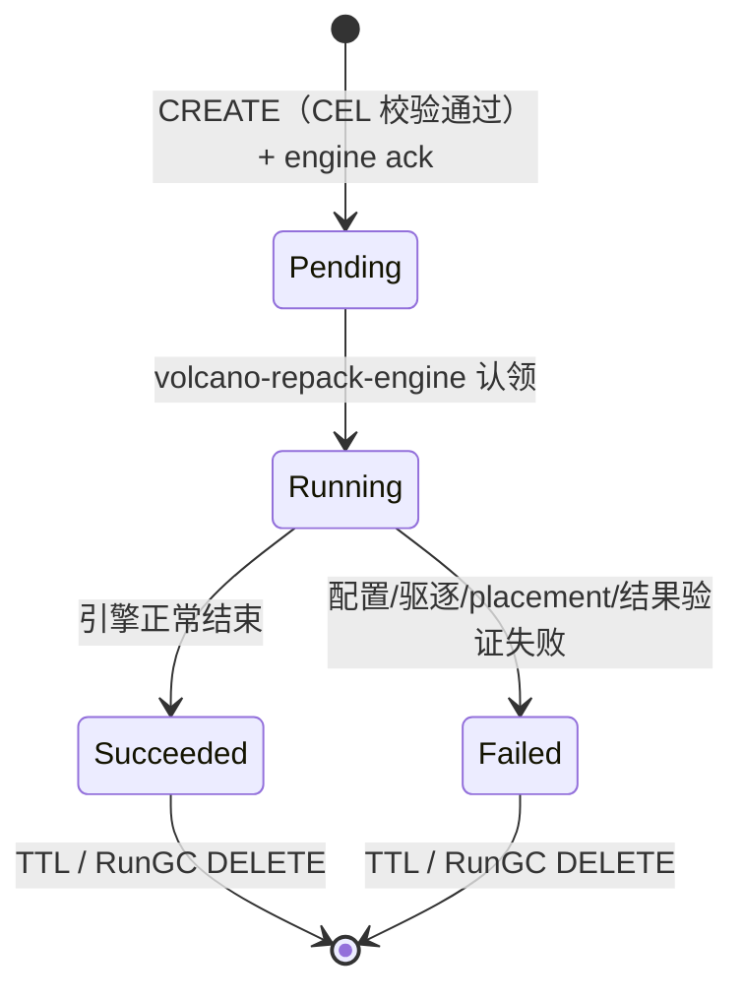
```mermaid
stateDiagram-v2
    [*] --> Pending: CREATE（CEL 校验通过）+ engine ack
    Pending --> Running: volcano-repack-engine 认领
    Running --> Succeeded: 引擎正常结束
    Running --> Failed: 配置/驱逐/placement/结果验证失败
    Succeeded --> [*]: TTL / RunGC DELETE
    Failed --> [*]: TTL / RunGC DELETE
```

**谁写 `phase`（P0 硬规则）**

| 迁移 | 写入方 | 机制 |
|------|--------|------|
| `→ Pending` | **volcano-repack-engine** | 首见 Run（phase 空）ack 初始化（CEL 已在创建期校验） |
| `Pending → Running` | **volcano-repack-engine** | 通过进程内原子槽 + 已持久化 Run 扫描实现 Execute K=1；DryRun 不受该 gate 限制 |
| `Running → 终态` | **volcano-repack-engine** | 引擎结束；写 `completionTime` + `plan/result/relocations` |

**Succeeded / Failed 判定（结合业务能力）**

| 场景 | phase | 典型 `conditions.reason` |
|------|-------|--------------------------|
| DryRun 模拟完成 | **Succeeded** | `RepackRecommended`（有方案）/ `NoFragmentation` / `InsufficientImprovement`（无收益） |
| Execute 完成且驱逐流程正常结束（含 **0 条** `plan.moves`） | **Succeeded** | `ExecutionCompleted` / `ExecutionCompletedWithAlternativePlacement`（有搬迁）/ `NoFragmentation` / `InsufficientImprovement`（空操作） |
| spec 非法（goals>1 等） | **CEL 创建期拒绝**（对象不落库，非 Failed） | — |
| 崩溃恢复无法继续 | **Failed** | `ExecutionInterrupted` |
| 配置、scope 解析或执行准备失败 | **Failed** | `InvalidConfiguration` / `ScopeResolutionFailed` / `ExecutionPreparationFailed` |
| Eviction API 硬失败（权限、冲突不可恢复） | **Failed** | `EvictionFailed` |
| 替身超时、结果无法验证或收益未实现 | **Failed** | `PlacementTimedOut` / `ResultVerificationFailed` / `BenefitNotRealized` |
| reconcile 持续失败 | **Failed** | `ReconcileFailed` |

> **与 Job 的差异**：Job 以 Pod 失败计数判 Failed；Repack **无副本**，「scope 内无可行搬迁」仍算 **Succeeded**（结果写在 `status.plan`，`moves` 可能为空，`conditions[Complete].reason` 为 `NoFragmentation`/`InsufficientImprovement`），避免把「业务上无可做」误标成系统故障。

**`status.conditions`（对齐 Job 风格）**

| type | 何时 True | 典型 reason | 备注 |
|------|-----------|-------------|------|
| **`Progressing`** | phase=`Pending` 时为 False，phase=`Running` 时为 True | Pending：`AnotherRunActive` / `ExecuteCooldownActive`；Running：`Planning` / `Evicting` / `ReconcilingPlacements` | 一个条件同时表达“尚未开始”和“正在执行”，避免 `Queued` 与 Pending 重复 |
| **`Complete`** | phase=`Succeeded` | `RepackRecommended` / `ExecutionCompleted` / `ExecutionCompletedWithAlternativePlacement` / `NoFragmentation` / `InsufficientImprovement` | 对齐 Job `Complete`；reason 兼任「值不值得整理」收口 |
| **`Failed`** | phase=`Failed` | 见上表 | 对齐 Job `Failed` |

**其它 status 字段**

| 字段 | 写入方 | 说明 |
|------|--------|------|
| **`message`** | volcano-repack-engine | 当前一步的一句话人读摘要；Pending/Running/终态都会刷新 |
| `startTime` | volcano-repack-engine | 首次进入 `Running` |
| `completionTime` | volcano-repack-engine | 首次进入终态；Controller 只把它作为 **RunGC TTL 起点** |

**Pending 示例（排队中）**

```yaml
status:
  phase: Pending
  message: "Waiting to execute: another Execute RepackRun is active; this run will be retried when the active run finishes."
  conditions:
    - type: Progressing
      status: "False"
      reason: AnotherRunActive
      message: "Waiting to execute: another Execute RepackRun is active; this run will be retried when the active run finishes."
      observedGeneration: 1
      lastTransitionTime: "2026-07-27T10:00:00Z"
```

**Running 示例（Execute 驱逐中）**

```yaml
status:
  phase: Running
  message: "Executing repack for nvidia.com/gpu: evicting 2 Pods from 1 PodGroups and moving 8 cards to free 1 nodes."
  startTime: "2026-06-09T10:00:05Z"
  conditions:
    - type: Progressing
      status: "True"
      reason: Evicting
      message: "Executing repack for nvidia.com/gpu: evicting 2 Pods from 1 PodGroups and moving 8 cards to free 1 nodes."
      observedGeneration: 1
      lastTransitionTime: "2026-06-09T10:00:05Z"
```

**`kubectl wait` 建议**

```bash
# 准入=CEL：创建成功即已准入（无 Admitted 条件可等）

# 等待完成（对齐 Job Complete）
kubectl wait repackrun/$NAME --for=condition=Complete

# 或直接用 phase
kubectl wait repackrun/$NAME --for=jsonpath='{.status.phase}'=Succeeded
```

#### 4.6.2 终态：`status.plan`（不可变计划）与 `status.result`（Execute 实际结果）

> **权威 schema**：见 [proposal §5.2](./repack-runtime-defragmentation.md#52-repackrun-api) 与本文 §12。本节示例已对齐封版口径。

DryRun 与 Execute **共用同一 `status.plan`**，且它始终是驱逐前的完整计划和预期收益，不因部分驱逐失败或最终落点变化而改写。Execute 额外写 `status.result` 表示实际接受量和替身绑定后的复测结果。「值不值得整理」不放 summary，由 `conditions[Complete].reason` 收口。

> 1. **`kubectl get` 列**（一行结论，§4.6.2.0）：MODE / RESOURCE / PHASE / PLAN-FREED / ACTUAL-FREED / AGE。
> 2. **`status.message`（一句话）+ `plan.summary`（扁平看板）**：人/告警/UI 列表页只读这两个。
> 3. **`plan.moves[] / freedNodes[]`（明细）**：要点选 Execute 范围或深查时才展开。

DryRun 终态示例：

```yaml
status:
  phase: Succeeded
  message: "Repack recommended for nvidia.com/gpu: move 3 PodGroups and 35 cards to free 2 nodes; cluster fragmentation is expected to improve from 42% to 28%."
  startTime: "2026-06-09T10:00:05Z"
  completionTime: "2026-06-09T10:02:18Z"
  conditions:
    - { type: Progressing, status: "False", reason: RepackRecommended, message: "Repack recommended for nvidia.com/gpu.", observedGeneration: 1, lastTransitionTime: "2026-06-09T10:02:18Z" }
    - { type: Complete, status: "True", reason: RepackRecommended, message: "Repack recommended for nvidia.com/gpu.", observedGeneration: 1, lastTransitionTime: "2026-06-09T10:02:18Z" }
  plan:
    summary:                          # 第2层：扁平看板（纯度量，无 verdict）
      fragBeforePercent: 42           # 整数百分点 0-100
      fragAfterPercent: 28            # 改善 = before-after（自减）
      freedNodeCount: 2               # 主收益：腾出整机数；printer 列取此
      movedCardCount: 35              # 搬走卡数合计
      resolvedScope: { podGroupCount: 12, nodeCount: 4 }
    moves:                            # 第3层：每个 PodGroup 一条，pods[] 逐 pod 计划落点
      - namespace: ml
        podGroupName: train-a
        owner: { apiVersion: batch.volcano.sh/v1alpha1, kind: Job, name: train-a }
        cards: 12
        pods:
          - { name: train-a-worker-3, fromNode: node-3, toNode: node-7, cards: 4 }
          - { name: train-a-worker-4, fromNode: node-5, toNode: node-9, cards: 4 }
          - { name: train-a-worker-5, fromNode: node-5, toNode: node-9, cards: 4 }
      # …其余 PodGroup 略（summary 为全量聚合）
    freedNodes: [ node-3, node-5 ]    # 计划腾空的节点名
```

> **空结论也清晰**：无收益时 `moves: []`、`summary.freedNodeCount: 0`、`message: "无需整理：…"`，`conditions[Complete].reason` 为 `NoFragmentation`（本就干净）或 `InsufficientImprovement`（有碎片但低于目标门控，`fragBeforePercent` 仍照填）——一眼区分「没碎片 / 整不动 / 系统出错(phase=Failed)」。

##### 4.6.2.0 `kubectl get` 一行结论（additionalPrinterColumns）

CRD 定义 **printer columns**，`kubectl get repackrun` 不展开 YAML 就能看懂：

```text
$ kubectl get repackrun
NAME                       MODE      RESOURCE         PHASE       PLAN-FREED   ACTUAL-FREED   AGE
pool-a100-dryrun-202606..  DryRun    nvidia.com/gpu  Succeeded   2                           5m
pool-a100-exec-202606..    Execute   nvidia.com/gpu  Succeeded   2            2              2m
batch-b-dryrun-..          DryRun    nvidia.com/gpu  Succeeded   0                           1m
```

| 列 | jsonPath | 含义 |
|----|----------|------|
| MODE | `.spec.mode` | DryRun / Execute（spec 不可变，直接取 spec） |
| RESOURCE | `.spec.goals[0].resource` | 显式目标资源；使用引擎默认资源时该列为空 |
| PHASE | `.status.phase` | Pending/Running/Succeeded/… |
| PLAN-FREED | `.status.plan.summary.freedNodeCount` | 完整计划预计腾出的节点数 |
| ACTUAL-FREED | `.status.result.freedNodeCount` | Execute 实际腾出的节点数；DryRun/执行前失败为空 |
| AGE | `.metadata.creationTimestamp` | |

> 「值不值得整理」看 `conditions[Complete].reason`（`RepackRecommended`/`NoFragmentation`/`InsufficientImprovement`/`ExecutionCompleted`），不再有 VERDICT 列；FRAG「前→后」需拼两字段，printer JSONPath 取不了，交 UI/`vcctl` 侧合成。

##### 4.6.2.1 结构体树（封版 · 版本随 CRD apiVersion）

权威 Go 类型见 §12；概览：

```text
status (RepackRunStatus)
├── phase / conditions / message / startTime / completionTime
│       terminal status 同时保留 Progressing=False 与 Complete=True/Failed=True
│       conditions[Complete].reason ∈ {RepackRecommended, ExecutionCompleted, ExecutionCompletedWithAlternativePlacement, NoFragmentation, InsufficientImprovement}
├── plan (RepackPlan)          DryRun/Execute 均为不可变完整计划
    ├── summary                【第2层】纯度量
    │   ├── fragBeforePercent / fragAfterPercent   int32 0-100
    │   ├── freedNodeCount     int32   预计腾出整机数
    │   ├── movedCardCount     int64   计划搬走卡数
    │   └── resolvedScope      {podGroupCount, nodeCount}
    ├── moves[]                【第3层】每个 PodGroup 一条
    │   ├── namespace / podGroupName          结构化引用（非 "ns/name" 串）
    │   ├── owner              {apiVersion, kind, name}   用户可见拥有者（透传 PG ownerRef）
    │   ├── cards              int64   = Σ pods[].cards
    │   └── pods[]             {name, fromNode, toNode, cards}   逐 pod 计划落点；只列被迁移的 pod
    └── freedNodes[]           []string  计划腾空的节点名
├── result (RepackResult)      Execute 独有
│   ├── fragAfterPercent       int32   实际复测值
│   ├── freedNodeCount         int32   实际腾空数
│   ├── freedNodes[]           []string 已验证腾空的计划节点名
│   ├── movedCardCount         int64   已接受驱逐对应卡数
│   └── metricsVerified        bool    指标是否来自一致快照
└── relocations[]             Execute 独有，每个被迁移 Pod 一条
        PodRelocationStatus{namespace, podGroupName, replacementPodGroupName,
                            victimPodName/UID, schedulingRequirementsHash,
                            plannedNodeName,
                            eviction{phase,message},
                            placement{phase,selectedNodeName,replacementPodName/UID,
                                      actualNodeName,expirationTime}}
```

**设计约束（便于解析）**：

| 原则 | 说明 |
|------|------|
| **三层渐进** | `status.message`（看一眼）→ `summary`（看板/告警）→ `moves`/`freedNodes`（点选 Execute / 深查） |
| **计划不可变、结果分离** | `plan` 是完整纯计划，DryRun/Execute 同结构；Execute 的逐 Pod 执行过程看 `relocations`，实际聚合收益看 `result` |
| **逐 pod 明细** | `moves[].pods[]` 逐 pod 表达 `fromNode→toNode`（一个 gang 的 pod 可散落多源、迁往多目标）；只列被迁移的 pod，没搬的不出现 |
| **结构化引用** | PodGroup 用 `namespace`+`podGroupName`（move 顶层共享 ns），不用 `"ns/name"` 拼接串；并列 `owner` 供用户认领 |
| **整数百分比** | 碎片率用 int32 百分点（0-100），避免 JSON/YAML float 跨语言差异 |
| **值不值得进 conditions** | `conditions[Complete].reason` 收口，不设 `summary.verdict` |
| **数组封顶（`maxItems`）** | `moves`/`pods`/`freedNodes`/`relocations` 在 CRD 中有明确上限。当前实现依赖规划规模不越界，尚无自动截断/外部导出协议；越界会导致 status 校验失败，需在扩大规模前补齐防护 |

**plan → Execute scope 映射**（用户闭环）

| 用户意图 | 从 plan 取 | 写入 Execute `spec.scope` |
|----------|-----------|---------------------------|
| 点名建议搬迁的 PodGroup | `moves[].{namespace, podGroupName}` | `podGroups.include.names: [ns/name, …]` |
| 点名将腾空的节点 | `freedNodes[]` | `nodes.include.names: [...]` |
| 批量同类 PodGroup | 给相关 PodGroup 打临时 label 后 | `podGroups.include.selector` |
| 节点池 | 已有 pool label 时 | `nodes.include.selector` |

##### 4.6.2.2 用户解析示例（CLI / 控制台）

```bash
# 0. 一行结论（最常用，无需 jq）
kubectl get repackrun                       # printer columns（§4.6.2.0）
kubectl get repackrun $NAME -o jsonpath='{.status.message}'

# 1. 看板摘要
kubectl get repackrun $NAME -o jsonpath='{.status.plan.summary}' | jq .

# 2. 建议搬迁的 PodGroup → 贴进 Execute scope.podGroups.include.names
kubectl get repackrun $NAME -o json | \
  jq -r '.status.plan.moves[] | "\(.namespace)/\(.podGroupName)"'

# 3. 整理后将腾空的节点
kubectl get repackrun $NAME -o jsonpath='{.status.plan.freedNodes}'

# 4. 值不值得整理（看 Complete 条件的 reason） / 碎片改善
kubectl get repackrun $NAME -o jsonpath='{range .status.conditions[?(@.type=="Complete")]}{.reason}{end}'
kubectl get repackrun $NAME -o jsonpath='{.status.plan.summary.fragBeforePercent}{"→"}{.status.plan.summary.fragAfterPercent}'

# 5. Execute 实际收益及其可信度
kubectl get repackrun $NAME -o jsonpath='{.status.result}' | jq .
```

**控制台 / UI 建议**：列表页只读 `status.message` + `summary`（`freedNodeCount`/`movedCardCount`）+ `conditions[Complete].reason`；详情页展开 `moves`（列：`namespace/podGroupName`、`owner`、`cards`、`pods`(node-3→node-7)）与 `freedNodes`；导出 Execute 草稿时生成 `spec.scope.podGroups.include.names` / `spec.scope.nodes.include.names`。`vcctl describe repackrun` 可把三层渲染成一页人读报告。

##### 4.6.2.3 API 演进策略

> **不设内部 `formatVersion`**：`plan` 是**类型化 status 子结构**，schema 演进由 **CRD apiVersion 单一治理**（`v1alpha1`→`v1beta1`→…）。当前能力尚未投产，`v1alpha1` 阶段允许直接收敛字段和枚举，不保留旧别名或双写逻辑。

| 层级 | 机制 |
|------|------|
| **唯一版本源 = CRD apiVersion** | 破坏性改 plan 形状 = 升 CRD 版本（走转换 webhook），不在 status 内自管版本 |
| **投产前直接收敛** | 未投产的 `v1alpha1` 直接修改 schema、生成代码与 CRD，避免兼容分支永久增加维护成本 |
| **投产后按版本治理** | 对外稳定后，破坏性变更升级 CRD 版本并使用转换 webhook |
| **核心字段（同版本内稳定）** | `summary`、`moves`、`freedNodes`；它们均属于可选 `plan`，空结论时数组可为空或省略 |
| **终态不变性** | `Succeeded` 后不再 PATCH plan；升级集群后旧 Run 保留当时 snapshot |

#### 4.6.3 Execute 终态：`status.plan` + `status.result` + `relocations`

Execute 与 DryRun **同一 `status.plan` 结构**，且 Execute 不覆盖原始计划。额外写 **`status.result`**（实际接受卡数、实际碎片率、实际腾空节点集合及指标可信度）和 **`status.relocations[]`**（逐 Pod 的 durable 驱逐与替身放置记录）。实际落点/绑定看 `relocations[].placement`，实际聚合收益看 `result`。成功要求所有替身完成调度，且 `result.freedNodes[]` 与 `plan.freedNodes[]` 集合完全一致；存在替代放置但收益完整实现时以 `ExecutionCompletedWithAlternativePlacement` 成功结束。

```yaml
status:
  phase: Succeeded
  message: "Repack completed for nvidia.com/gpu: moved 1 PodGroups and 8 cards, actually freed 1 nodes; cluster fragmentation changed from 42% to 31%."
  startTime: "2026-06-09T10:05:00Z"
  completionTime: "2026-06-09T10:08:42Z"
  conditions:
    - { type: Progressing, status: "False", reason: ExecutionCompleted, message: "Repack completed for nvidia.com/gpu.", observedGeneration: 1, lastTransitionTime: "2026-06-09T10:08:42Z" }
    - { type: Complete, status: "True", reason: ExecutionCompleted, message: "Repack completed for nvidia.com/gpu.", observedGeneration: 1, lastTransitionTime: "2026-06-09T10:08:42Z" }
  plan:
    summary:
      fragBeforePercent: 42
      fragAfterPercent: 28            # 完整计划预测值
      freedNodeCount: 1               # 完整计划预计值
      movedCardCount: 8
      resolvedScope: { podGroupCount: 1, nodeCount: 2 }
    moves:
      - namespace: ml
        podGroupName: train-a
        owner: { apiVersion: batch.volcano.sh/v1alpha1, kind: Job, name: train-a }
        cards: 8
        pods:
          - { name: train-a-worker-3, fromNode: node-3, toNode: node-7, cards: 4 }
          - { name: train-a-worker-4, fromNode: node-5, toNode: node-9, cards: 4 }
    freedNodes: [ node-3 ]
  result:
    fragAfterPercent: 31              # 替身绑定后的实际复测
    freedNodeCount: 1
    freedNodes: [ node-3 ]            # 已验证腾空，成功时与 plan.freedNodes 集合一致
    movedCardCount: 8                 # 实际被接受的驱逐对应卡数
    metricsVerified: true
  relocations:                        # 每搬一个 pod 一条（Execute 独有）
    - namespace: ml
      podGroupName: train-a
      victimPodName: train-a-worker-3
      victimPodUID: 9062...
      schedulingRequirementsHash: Gx4...Qw # §5.2.2：仅显式使用 SubGroup 时记录
      plannedNodeName: node-7
      eviction:
        phase: Accepted
        message: "Eviction API accepted the victim Pod."
      placement:
        phase: Placed
        selectedNodeName: node-7
        replacementPodName: train-a-worker-3
        replacementPodUID: 4ca3...
        actualNodeName: node-7
        expirationTime: "2026-06-09T10:18:42Z"
    # 另一条 Accepted relocation 省略；result 仍是完整执行聚合
```

**用户 UI / CLI 流程**：读 DryRun `status.plan` → 人工选定 job/node → 新建 Execute
Run，并按需填写 `spec.scope` 收窄授权范围 → 对比 Execute `status.plan`（原始预期）
与 `status.result`（实际收益），用 `relocations` 深查逐 Pod 驱逐与落点。

### 4.7 三进程分工：Controller · volcano-repack-engine · volcano-scheduler（定稿）

Repack 相关能力由 **独立 Pod `volcano-repack-engine`** 承担，**不与** 现有 **`volcano-scheduler`** 同进程、同 Deployment。

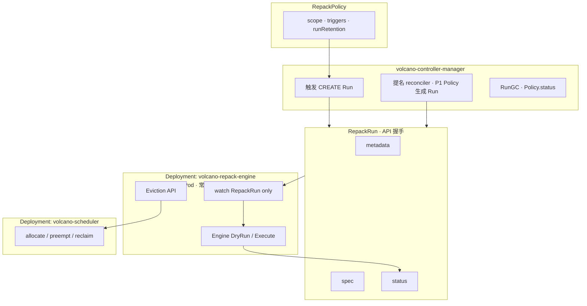
```mermaid
flowchart TB
    subgraph Policy["RepackPolicy"]
        PS[scope · triggers · runRetention]
    end

    subgraph CM["volcano-controller-manager"]
        C1[触发 CREATE Run]
        C2[提名 reconciler · P1 Policy 生成 Run]
        C4[RunGC · Policy.status]
    end

    subgraph RR["RepackRun · API 握手"]
        RM[metadata]
        RSpec[spec]
        RSt[status]
    end

    subgraph VRS["Deployment: volcano-repack-engine<br/>（独立 Pod · 常驻）"]
        S1[watch RepackRun only]
        S2[Engine DryRun / Execute]
        S3[Eviction API]
    end

    subgraph VS["Deployment: volcano-scheduler<br/>（现网 · 不扩 Repack）"]
        A1[allocate / preempt / reclaim]
    end

    PS --> C1
    C1 --> RR
    C2 --> RR
    RR --> S1
    S1 --> S2
    S2 --> RSt
    S3 --> A1
```

| | volcano-controller | **volcano-repack-engine** | **volcano-scheduler** |
|--|-------------------|------------------------------|----------------------|
| **部署** | controller-manager | **独立 Deployment / 独立 Pod** | 现网 scheduler Deployment |
| **RepackPolicy** | watch、触发生成 Run（P1） | **不访问** | **不访问** |
| **RepackRun** | 生成（P1）、TTL/RunGC、提名、读 status | **watch + 写 status**；读 spec 执行 | **不 watch** |
| **集群工作负载** | — | informer 只读（热 cache） | Pod/Job/Node 正常调度 |
| **驱逐 / 模拟** | — | **Engine + Eviction** | — |
| **重排落子** | — | — | **allocate**（驱逐后） |

> **命名**：组件名 **`volcano-repack-engine`**；实现路径建议 `cmd/volcano-repack-engine`；与主调度器 **`volcano-scheduler`** 区分，避免「在 scheduler 里加 repack action」。
>
> **命名定稿（v9.8）**：执行组件定名 **`volcano-repack-engine`**。理由：该组件**只做模拟 + 驱逐、不 bind Pod**，避免 `-scheduler` 后缀与真正负责 allocate 的 `volcano-scheduler` 混淆；`-engine` 更贴合「在热 cache 上跑模拟引擎」的职责。实现入口 `cmd/volcano-repack-engine`，核心库仍为 `pkg/repackengine`。

#### 4.7.0 复用 scheduler 框架与插件（独立部署，但不重复造）

> **架构决策（定稿）**：`volcano-repack-engine` **独立部署、独立进程**，但**复用 `volcano-scheduler` 的框架与插件**，**不**自建一套 node/job 缓存或重写 predicate——避免重复开发，更避免与调度器**演进不兼容**（插件升级、predicate 语义变化能自动跟随）。

具体复用点（均为 scheduler 现成构件）：

| 复用构件 | 作用 | repack-engine 怎么用 |
|---|---|---|
| **`--scheduler-conf` + `UnmarshalSchedulerConf`** | 解析**与 `volcano-scheduler` 完全相同的插件配置文件**（tiers/plugins/arguments）→ `tiers`/`configurations` | engine **指向同一个 ConfigMap**、用**同一个解析函数**，保证 predicate 过滤原则与调度器**逐字一致**；同 watch ConfigMap 热加载 |
| `schedcache.New(...)` + `cache.Run` | 与调度器**同一套** informer 热 cache（Node/Pod/PodGroup/PV…） | engine 进程内建一份自己的 cache（独立 Pod，不共享内存，但代码同源） |
| `framework.OpenSession(cache, tiers, conf)` | 用**上面解析出的同一套插件 tiers** 打开 `Session`，得到真实 `Nodes`/`Jobs` + `SimulatePredicateFn`/`PrePredicateFn` | 每个整理周期开一个 Session，复用与调度器**同名同义**的 predicate（亲和/污点/拓扑/设备/NUMA…） |
| `ssn.SimulatePredicateFn` + 克隆式重排可行性检查 | `PrePredicateFn` 建 cycle-state，克隆 node + state 后用 `SimulatePredicateFn` 跑**完整过滤栈**模拟"驱逐 victim → 逐个重落"，只读不碰真集群 | 可行性判定（INV-RESCHED），DryRun/Execute 同源；取代早期设计的 `framework.Statement` 沙箱（后者 `unPipeline` 置空 `NodeName`，不能用于 repack） |
| `framework.CloseSession` | 收尾 | 周期结束关闭（只读，不回写 PodGroup/Queue 状态） |

> **插件过滤一致性（关键诉求）**：repack-engine **读取 `volcano-scheduler` 的同一份插件配置**（默认指向同一个 `volcano-scheduler-configmap`，`--scheduler-conf` 同值），用**同一个 `UnmarshalSchedulerConf`** 解析、喂给**同一个 `OpenSession`**。于是「一个 pod 能不能放到某节点」的判定（亲和/反亲和、污点容忍、拓扑/NUMA、设备、节点资源…）与调度器**完全同源、同演进**——调度器升级插件或改 predicate 语义，repack **自动跟随**，不会出现"整理算出的落点调度器又拒掉"的不一致。
>
> **只复用 tiers/configurations，不复用 actions**：`UnmarshalSchedulerConf` 还返回调度器的 `actions`（allocate/preempt/backfill 主循环），repack **忽略**之——它有自己的"action"（§4.16.6）。即**插件（过滤/打分能力）全盘复用，调度主循环不复用**。repack 只调用 `SimulatePredicateFn`/`PrePredicateFn`（克隆式重排模拟），不用 `Statement`；纯 allocate/order 类插件函数不会被 repack 触发，故复用同一配置安全无副作用。

> **与本设计的衔接**：引擎主体已对 **`Snapshot` 接口**编程；生产实现为包装 scheduler Session 的 `SessionSnapshot`。独立部署路径复用 `schedcache` + scheduler `OpenSession`，再打开 repack Session 注册策略 Plugin 并运行 Repack Action。**无需自建 NodeInfo/JobInfo 模型、无需重写 predicate**；调度过滤语义随 scheduler 演进。

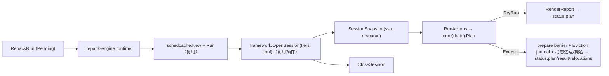
```mermaid
flowchart LR
    RUN["RepackRun (Pending)"] --> RT["repack-engine runtime"]
    RT --> C["schedcache.New + Run（复用）"]
    C --> OS["framework.OpenSession(tiers, conf)（复用插件）"]
    OS --> SS["SessionSnapshot(ssn, resource)"]
    SS --> PR["RunActions → core(drain).Plan"]
    PR -->|DryRun| RP["RenderReport → status.plan"]
    PR -->|Execute| ST["prepare barrier + Eviction journal + 动态选点/提名 → status.plan/result/relocations"]
    OS --> CL["CloseSession"]
```

#### 4.7.1 落点引导（Nomination，非预留）

**问题**：repack-engine 驱逐 victim 后，pod 由负载控制器**重建**，再由 **volcano-scheduler** 重新调度。由于 pod 入队/创建先后顺序与集群状态变化，即便用同一算法模拟，pod 也**不一定**落到 repack 期望的节点——空位可能被无关 pod 抢走、victim 可能弹回原节点，使本轮整理白做。

**方案**：复用 Volcano **已有的 nominate 机制**引导落点，**不引入 Reservation/占位**（§3.2 非目标）。

##### 现有 nominate 链路（preempt 同源，repack 复用）

| 环节 | 代码位置 | 作用 |
|------|----------|------|
| Pipeline | `framework/statement.go::Pipeline()` | session 内把 task pin 到节点，置 `EvictionOccurred=true`，被驱逐资源计入节点 `releasing`/`FutureIdle` |
| 导出提名 | `api/job_info.go::TaskSchedulingReason()` | `Pipelined` 且 `EvictionOccurred` 时返回 `nominatedNodeName=ctx.NodeName` |
| **持久化** | `cache/cache.go::taskUnschedulable()` | 写 **`pod.status.NominatedNodeName`**（durable；不被空值覆盖） |
| **消费** | `actions/allocate/allocate.go` | 读 `pod.status.NominatedNodeName`：通用 honor 路径（L772-783）在 `FutureIdle` 够、predicate 过、节点在本轮 leaf 集内时**优先尝试该节点**，否则**静默回退**正常分配 |

> 跨进程关键事实：`subJob.NominatedHyperNode` 与 Pipeline 都是**调度器进程内存态**，不跨进程；**唯一 durable 通道是 `pod.status.NominatedNodeName`**。repack-engine 据此引导落点，无需与 volcano-scheduler 共享 session。

##### 定位：开环驱逐 + 软提名引导 + 结果导向

repack 是 **advisory steering**，不是强约束。**但要分清两件事**：
- **可行性（硬，§4.14.2 INV-RESCHED）**：模拟必须确认 relief 与**所有 victim 都能落下** —— 这是**驱逐前的硬门槛**，放不下就不驱逐。
- **落点引导（软，本节）**：在「能落下」的前提下，用 nomination **尽量**让真实 allocate 落到模拟期望的节点；落点漂移可接受，可行性不可让步。

1. **提名是主引导（驱逐后 patch 替身 pod）**：repack-engine 在驱逐前把每个 Pod move 持久化为 `RepackRun.status.relocations[]`；驱逐后，**提名 reconciler** watch 该 gang 的**替身新 pod**，认领对应记录并 **patch 新 pod 的 `pod.status.NominatedNodeName`=建议节点**，告诉 volcano-scheduler「尽量往这放」。详见 §4.7.1.2 问题1。
   - 注：对**已存在的 pending 目标**（relief 场景），可"提名先于驱逐"（先 patch 已在的 pending pod 再驱逐）；但**整理场景里被搬的就是 victim 自己**，旧 pod 随驱逐消亡，必须 patch **替身新 pod**，故走 reconciler。
2. **自稳定方案 = 兜底（非主路径）**：模拟时**偏好 volcano-scheduler allocate 也会复现的 plan**（目标本就是 binpack 最优落点），即便提名一时未命中也大概率落对；**提名为主、自稳定兜底**。腾出的空间**不保留**，交还调度器排队队列填充（§4.7.1.2 问题2）。
3. **repack 只 own 自己写的提名，不与调度器对抗**：调度器回退时会 `invalidateSubJobNomination` 清掉 `NominatedNodeName`（`allocate.go` L693-694）——这是系统在说「plan 已不可行」。repack **不重写、不进循环**，本轮 Run 据实收尾、报漂移，下一轮重新模拟。
4. **结果导向**：Execute 完成后核对实际落点 vs plan，替代放置由 `relocations[].placement.selectedNodeName/actualNodeName` 如实呈现，**不强行纠正**。成败看计划腾空节点集合是否实现，而非落点逐一吻合。

##### 风险与边界（放弃预留后的取舍）

| 维度 | 结论 |
|------|------|
| **最坏情况** | nominate 校验不过 → 静默回退正常分配，**不劣于现网自由重排**，不误伤无关 job |
| **诚实代价** | 开环下可能**白付驱逐代价**：空位被抢/plan 失效时，victim 已重启却无收益。由 `maxPerRun`（封顶规模）+ `executeCooldown`（防抖动）约束 |
| **victim 重建身份** | 新 pod `status` 为空、与旧 pod 无直接链接。**P0：提名 reconciler 按 replacement UID / victim 名称 / `schedulingRequirementsHash` / 同构 PodGroup 的顺序认领持久化 nomination，并 patch 替身 Pod 的 `NominatedNodeName`**（§4.7.1.2 问题1，主引导）；自稳定兜底 |
| **明确不做** | Reservation / 占位 / 改 allocate 全局资源视图 |

##### Execute 落子链（更新）

```text
repack-engine: patch target.pod.status.NominatedNodeName（提名先行）
            → Eviction API（驱逐 victim）
            → victim 进入 releasing，节点 FutureIdle 释放
volcano-scheduler allocate: 读 NominatedNodeName → honor 路径优先落 target，否则回退
            → repack-engine 核对落点 → 写 Run.status.plan
```

##### 4.7.1.1 Execute apply 的早期契约（历史设计）

> **实现差异**：下方 `CommitHooks`/`CommitPlan` 是早期编排草图，不是当前
> status/API 契约。当前 Execute 在准备阶段先持久化 `status.plan` 与
> `status.relocations`，再按 relocation 的 eviction journal 调用 Eviction API；
> replacement placement 由 scheduling gate、controller 认领、engine 实时选点和
> controller nomination/binding 观测协作完成。权威流程见
> [proposal §5.4](./repack-runtime-defragmentation.md#54-执行与落点引导)。

**契约（`apply.go`，纯编排 + 注入副作用，CRD/framework 无关）**：

```go
type CommitHooks struct {
    Evict    func(m *Move) error      // 必填：驱逐 victim（Eviction API）
    Nominate func(n Nomination) error // P1：写 pod.status.NominatedNodeName（pending 目标）
}
func CommitPlan(plan *RepackPlan, h CommitHooks) (CommitResult, error)
```

**P0 提交算法（`CommitPlan`）**：

1. **提名先行（P1，P0 为空）**：先写所有 `Nomination`（pending 目标的 `NominatedNodeName`），让释放出的容量遇到「已就位的提名」。**P0 纯整理只搬运行中 pod、无 pending 目标 → `pendingNominations` 返回空**；故 P0 这步是 no-op，提名真正生效在 relief（P1）。
2. **驱逐（开环）**：按 **"先腾空节点的源 → 再按 task 名稳定排序"** 遍历 moves，逐个 `Evict`；**失败只记录不回滚**（开环 advisory，blast radius 由 `maxPerRun`+`executeCooldown` 上游封顶），继续后续。
3. **结果（历史草图）**：`CommitResult{Evicted, Failed, Nominated}` 交还调用方；
   当前实现不使用该结果形状，实际接受量写入 `status.result`，逐 Pod 进度和实际落点
   写入 `status.relocations`，`status.plan` 始终保持驱逐前的不可变计划。

**确定性**：`orderedMoves` 用「腾空源优先 + task 名稳定序」，使 DryRun 预览顺序 == Execute 提交顺序。

**当前落地**：Eviction API、durable eviction journal、replacement scheduling gate、
实时 receiver 选择和 nomination/binding 闭环均已接线；不再以本草图中的
`CommitHooks` 作为待办项。

##### 4.7.1.2 重建 pod 的 nominate 归属 + 优雅删除窗口（两个硬问题，诚实结论）

> 两个尖锐问题：(1) 整理时 victim 被**驱逐→重建**（新 pod、新 name/uid、`status` 为空），**谁来、对谁写 `NominatedNodeName`**？(2) 驱逐有**优雅删除窗口**（几秒～10 分钟），提名/空位**覆盖得住吗**？

**问题 1：提名要写在"替身新 pod"上 —— 靠 pod 身份匹配，分两种情况**

- **为什么不能预打在 victim 上**：调度器 preempt 提名的是**已存在的 pending 抢占者 pod**（活的）；而 repack 的"目标"就是 victim 自己，驱逐后由工作负载控制器**重建成新 pod**，旧 pod 的 patch 随之消亡。所以**必须 patch 替身新 pod**，由 repack-engine 的**提名 reconciler**（watch→patch→重申）来做。

- **关键：替身怎么认出来？——两种身份匹配（这是你问的核心）**：

  | 场景 | 重建后的 pod 名 | 匹配方式 | 适用 |
  |---|---|---|---|
  | **同名重建（主路径）** | **与被驱逐的完全同名** | reconciler 按 **`namespace/name` 精确匹配**替身，直接 patch | **Volcano vcjob**(`<job>-<task>-<index>`，`MakePodName` 确定性命名)、**StatefulSet**(`<sts>-<ordinal>`)——即 gang/AI 主场景 |
  | **随机名重建（同构 PodGroup）** | 新随机名（带 hash 后缀） | reconciler 在原组或已记录的 replacement PodGroup 中消费下一条未认领记录 | Deployment/RS/裸 Job |
  | **随机名重建（SubGroup PodGroup）** | 新随机名（带 hash 后缀） | reconciler 按归一化的 **`schedulingRequirementsHash`** 等值匹配，不依赖 workload 类型或私有 role 标签 | 显式使用 SubGroup 的异构 PodGroup |

  > 对**主场景（Volcano gang 作业）这一步是确定的、无歧义的**：被驱逐的 `train-worker-3` 重建后仍叫 `train-worker-3`，reconciler 一看到同名 pending pod 立刻 patch `NominatedNodeName=计划节点`。随机名控制器才退化到 gang+role 的"可互换"匹配。

- **迁移记录（durable，每个被搬 pod 一条）**：Execute 直接把 plan move 转换为 `RepackRun.status.relocations[]`。`victimPodName` 供同名精确匹配；显式使用 SubGroup 时记录 `schedulingRequirementsHash` 供改名后的等价调度需求匹配；空 hash 明确表示同构 PodGroup；`plannedNodeName` 是计划目标。状态持久化而不只放内存，以跨引擎重启和优雅删除窗口；`placement.expirationTime` 超时后进入 `TimedOut`。

- **reconciler 流程**：watch 受影响 namespace/gang 的 **Pending 且未绑定** pod → 按“已有 replacement UID → victim 名称 → schedulingRequirementsHash → 同构 PodGroup”匹配一条未认领记录 → 持久化具体替身 → 等引擎基于实时容量选择 receiver → `patch status.NominatedNodeName` 并解除 SchedulerGate → 重申至绑定或 TTL。替身在绑定前被删除时，先持久化释放旧认领，再允许新 Pod 接续。

- **自稳定 = 兜底**：整理目标本就是 binpack 友好落点，提名偶有未命中也大概率落对；但**主引导是上面的同名/gang+role 提名**。

- **诚实的小竞态**：替身刚 Pending 到被 patch 之间有极短窗口，可能调度器先调度了它 → 记漂移、下轮重规划（软引导本性，可接受）；reconciler 用 informer 事件即时 patch 把窗口压到最小。

**问题 2：优雅删除窗口——重新理解：腾空的空间本就是"留给排队作业"的，不需要保留**

> 先纠正一个根本性误解（早期版本把它当成 `kubectl drain`「腾空并保持空」来处理，加了 cordon/软保留——**方向反了**）。**整理出空间的最终目的，就是让因碎片一直排队的作业能调度下来。** 所以：

- **"空位被无关 pending 抢走"不是失败，是目标**：被驱逐 pod 腾出的容量被排队作业填上 = repack 正在产生价值（减少排队）。**因此 repack 绝不 cordon / 打污点 / 预留腾空节点**——那会挡住我们真正想要的"排队作业涌入"。
- **优雅删除窗口本身不破坏正确性**：可行性在驱逐前已硬保证（INV-RESCHED）；窗口期长只是"收益兑现得慢一点"（victim 真正退出 + 替身重建需要时间），并非要去"保留空位"。`Releasing`/`FutureIdle` 仍让调度器在 victim 退出前就能规划落子。
- **唯一真实的"白干"**：被搬走的 pod 的**替身没落到计划目标节点**（比如目标位被别的作业先占了）。此时它由 binpack 落到别处、记漂移、下轮重规划即可——**不需要保留、不需要 cordon**。`maxPerRun`+`executeCooldown` 已封顶单轮代价。
- **长优雅期作业的处理**：可选护栏 `maxGracePeriodForRepack`——`terminationGracePeriodSeconds` 超阈值的 victim 本轮**不选**（搬它收益兑现太慢、性价比低），叠加 `minRunDuration`。这是"挑 victim"的策略，**不是**对节点做任何保留。

**结论与边界**：

| 问题 | P0 | P1 | 不做 |
|---|---|---|---|
| 重建 pod 谁打提名 | **提名 reconciler（持久化 nomination + watch/gate 替身 pending pod → 实时选择 receiver → patch `nominatedNodeName` → 重申）= 主引导**；自稳定兜底 | 重申退避与更多调度等价字段演进 | — |
| 腾出的空间归谁 | **归调度器的排队作业**（这就是整理目的）；repack 不保留、不 cordon | — | **不**对腾空节点做任何 hold/taint/Reservation |
| 替身没落到目标 | binpack 落别处 + 记漂移 + 下轮重规划；`maxPerRun`/cooldown 封顶 | 提名命中率精修 | — |
| 长优雅期作业 | 可选 `maxGracePeriodForRepack` 挑 victim 时规避 | — | — |

> 一句话：**repack 只负责"驱逐 + 把搬走的 pod 提名到目标节点"，腾出来的空间交还给调度器的排队队列去填——这正是减少碎片排队的目的。绝不给节点打污点/保留空位。**

##### 阶段裁剪

| 能力 | 阶段 |
|------|------|
| `CommitPlan` 编排（腾空源优先序、开环部分失败、结果汇总；**不 hold/不 taint**） | **P0**（已落地+单测） |
| **提名 reconciler（持久化 `status.relocations[]` + watch/gate 替身 pending pod → 实时选择 receiver → patch `nominatedNodeName` → 重申，`nominationTTL`）= 主引导** | **P0**（§4.7.1.2 问题1；已落地并覆盖冲突重试、替身删除恢复和 PodGroup 重建） |
| 自稳定落点（模拟偏好 binpack 可复现的 plan）= **兜底** | **P0** |
| 腾出空间交还调度器排队队列（不保留、不 cordon） | **P0**（即整理目的，调度器原生完成） |
| 落点核对 + 实际结果写入 `status.result` / `status.relocations` | **P0** |
| Eviction API + durable eviction journal + replacement placement 闭环 | **P0 已落地** |
| 长优雅期作业护栏 `maxGracePeriodForRepack`（挑 victim 时规避，可选） | **P0** |
| relief：pending target 提名（patch 已存在的 pending pod） | **P1**（`Nominate` 钩子） |
| 节点 cordon / 污点 / drain-hold / Reservation / 占位 | **不做**（与"腾空给排队作业"目的相悖） |

### 4.8 用户交互路径

每条 RepackRun **完全独立**；DryRun 的 `status.plan` 是只读参考，Execute
在最新快照上重新规划。用户可填写 `spec.scope` 收窄授权范围，也可省略为全集群。

#### 4.8.1 两条路径对照

| | 路径 A 手动（**P0**） | 路径 B 自动 + 人工确认（**P1**，依赖 Policy triggers） |
|--|------------|------------------------|
| **DryRun 谁 CREATE** | 用户 | Controller |
| **用户如何执行** | 读 `status.plan` → 按需填写 `scope` → 新建 Execute | 同上 |
| **Run 间关系** | **无引用** | **无引用** |

```text
RepackRun #1  mode=DryRun   spec.scope={宽范围}
       → status.plan（moves / freedNodes / summary）

用户决策（人工，不通过 CR 引用）

RepackRun #2  mode=Execute  spec.scope={podGroups/nodes 各 selector 或 names}
       → 引擎在 scope 内重算 → status.plan
```

#### 4.8.2 命令速查

```bash
# 1. 预整理
kubectl apply -f repackrun-dryrun.yaml
kubectl wait repackrun/pool-a100-dryrun-... --for=condition=Complete
# 或：--for=jsonpath='{.status.phase}'=Succeeded

# 2. 阅读报告（仅供参考）
kubectl get repackrun pool-a100-dryrun-... -o jsonpath='{.status.plan}' | jq .

# 3. 按报告自行填写 scope，新建独立 Execute Run（P0：自洽 spec，无需 ownerReferences；P1 才挂 Policy）
kubectl apply -f repackrun-execute.yaml   # mode: Execute, scope（selector 或列表）
kubectl wait repackrun/pool-a100-exec-... --for=jsonpath='{.status.phase}'=Succeeded

# 列出 Run（P1 起可按 Policy label 过滤：-l repack.volcano.sh/repack-policy=pool-a100）
kubectl get repackrun

# 终态 Run 会在 ttlSecondsAfterFinished 后由 Controller 自动删除
# 需长期留存 plan/result/relocations 时，请在 DELETE 前导出或对接 watch 事件
```

**路径 C — 全自动**（P1 构想）：Controller 根据 DryRun `status.plan` **新建**
Execute Run，并按策略决定是否把建议的 PodGroup/node 收窄到新 Run 的
`spec.scope`（仍是新对象新 spec，非 CR 引用）。具体 Policy/approval schema 尚未落地。

### 4.9 阶段裁剪

> **CRD 分期（§3.3）**：**P0 仅 `RepackRun`（自洽手写、手动）**；**`RepackPolicy`（含 triggers/approval/concurrency/runRetention/继承补全/ownerReferences）整体 P1**。下表「能力」均以 RepackRun + 引擎为载体。

| 能力 | 阶段 |
|------|------|
| **RepackRun 自洽 spec**（mode/scope/goals/maxPerRun/eviction/ttl） | **P0** |
| Run DryRun + status.plan | **P0** |
| Run Execute + spec.scope（独立重算） | **P0** |
| 落点引导 soft nomination：**提名 reconciler(驱逐后 patch 替身 pod 的 nominatedNodeName, 主)** + 自稳定兜底 + 漂移上报（§4.7.1/§4.7.1.2） | **P0** |
| 碎片度量（Node/HyperNode/Weighted，§4.12）+ 目标画像 PendingAndDefault/Explicit | **P0** |
| **加速资源整理，单资源/Run**（GPU/NPU/…，`goals` 至多一条；省略时使用引擎默认资源，§4.12） | **P0/P1** |
| 一个 Run 同时整理多类资源（`goals` 多条 + 跨资源合成） | **P2+** |
| 空节点整合口径 `(B_R−A_R)/M_R` + `/B_R`（§4.12.2a） | **P0** |
| 策略扩展框架：关键策略点 plugin 化（`FragmentScoreFn`/`RepackBenefitFn`/`DisruptionCostFn`/`TargetProfileFn`，§4.16） | **P0** |
| 收益门控（解开 pending / 碎片改善阈值，§4.13）+ disruptionScore 排序 | **P0** |
| 模拟匹配 + INV-RESCHED 重落校验（`Snapshot.FeasibleRelocation`：克隆 + `SimulatePredicateFn`，§4.14） | **P0** |
| relief 的"目标落点（相位1）"双向匹配 | **P1** |
| **PDB 兼容**（执行期 Eviction 子资源兜底；模拟期提前过滤待完善，§4.13.4） | **P0/P1** |
| 引擎内置 Execute **K=1**（+ 可选启动参数 cooldown，§4.5.5） | **P0** |
| **RepackPolicy CRD**（§4.4）：纯模板生成（`runTemplate` 内嵌 RepackRunSpec）+ ownerReferences | **P1** |
| Policy `trigger.onPendingBlocked` 自动生成 Run（路径 B） | **P1** |
| Policy `trigger.cronSchedule` / `suspend` / 扁平 history 上限 | **P1** |
| 集群级默认/硬护栏 / 跨 Run 强制保护（治理，CEL VAP 或单开 CRD） | **待定** |
| 收益效率项 `minEvictionEfficiency`、画像 `Learned` | P1 |
| 多级 HyperNode 拓扑：逐层 metrics + 整理顺序 + 跨层代价（§4.15.1） | P1 |
| 队列配额感知 victim 选择（§4.15.2） | P1 |
| 最优成本整理（最少作业/最少卡，有界搜索，§4.15.3） | P1 |
| 单作业抗反复中断（per-job 预算/冷却，§4.15.4） | P1 |
| `triggers.schedule`、HyperNode 分层 metrics | P1 |
| 路径 C 全自动 Execute | P1 |
| 受约束 Execute（plan 指纹 / planRef，所见即所执行） | P1 |
| 并发整理（放宽 K=1，scope 不相交并行） | P1 |
| 重建 victim 显式 pin（注解载体 + 调度侧翻译） | P1 |
| 多 Policy 合并 | P2 |
| Reservation / 占位 | **不做** |

### 4.10 已删除字段（勿再实现）

以下字段在 v6～v7 草案中出现，**v8 起一律删除**，不保留兼容位：

| 已删除 | 原因 | v8 替代 |
|--------|------|---------|
| `previewRunRef` | Run 互不引用 | 无；用户新建 Execute + `scope` |
| `approvedJobRefs` | 同上 | `scope.podGroups.include.names` / `.selector` |
| `dryRunRef` | 同上 | 无 |
| `selection` / `moveIDs` | 不继承模拟方案 | `scope` |
| `status.proposedJobs` | Plan 预埋 | **`status.plan`** |
| `spec.phase` / `operation`（Preview/Apply） | 阶段 PATCH 模型 | **`spec.mode`**（DryRun/Execute） |
| `preview` / `apply` spec 分块 | 结构重复 | 统一 **`scope`** |
| **`repackContext`**（调度向隐藏块） | 用户不可写、双套字段 | **删除**；Run.spec 即执行契约 |
| **`spec.policyRef`**（v9 草案） | 非 K8s 惯例；与 spec 执行契约混杂 | **`metadata.ownerReferences` + labels**（§4.5.1） |

### 4.11 与旧版差异摘要

| 旧思路 | v8 |
|--------|-----|
| Run 间引用 / 继承方案 | **完全独立**，Execute 在 `scope` 内重算 |
| DryRun 输出 | **`status.plan`**（人读，非机器引用） |
| 范围表达 | **`scope`**：selector + 列表双形式 |

---

## 4A. 引擎设计：碎片度量 · 收益门控 · 模拟匹配

> 本章补齐功能思路里尚未展开的三块**算法核心**，全部建立在 Volcano 现有引擎上（见需求文档 §2 可复用地基）。三块共用**同一个可调度性检查**，避免两条链路口径打架。
>
> **一个可行性检查贯穿三块**：`ok := Snapshot.FeasibleRelocation(committed, victims, receivers)`（repack 包 `adapter/snapshot_session.go`，克隆 node + cycle-state、`ssn.SimulatePredicateFn` 模拟重落，§4.14.1）
> （repack 包 `pkg/repackengine/`）。它用**真实完整过滤栈**（`ssn.SimulatePredicateFn`：亲和/污点/拓扑/设备）+ 资源 `FutureIdle` 回答「这批 pod 能不能在该域放下」；P1 relief 再叠加 gang 目标落点（`JobPipelined`）。
> - **碎片度量**（§4.12）：`victims=nil` 时，画像放不下的空闲容量即碎片。
> - **收益评估**（§4.13）：整理前后 `Feasible` 翻转的画像数 = relief；前后碎片率差 = 改善。
> - **模拟匹配**（§4.14）：`victims≠nil` 时返回的 plan 即 PodGroup↔Node 的落点方案。

### 4.12 碎片整理指数（Fragmentation Index）

#### 4.12.1 以「目标画像」为参照定义碎片（对齐需求 §1.1）

碎片**不是**「空闲资源」，而是**「装不进任何目标画像的空闲资源」**。一块空闲 GPU 若因配套 CPU/Mem 不足、或整卡数不够、或拓扑不连续而无法承接任何目标副本，即为碎片。

**目标画像集合 `P`**（每个画像 = 单副本规格 + 副本数 + 拓扑层）来源（`Policy.spec.goals[].profiles.source`）：

| source | P0/P1 | 说明 |
|--------|-------|------|
| `PendingAndDefault` | **P0 默认** | 由 `scope` 内（及 `relief.podGroupRefs`）pending 作业规格 + 一组**默认画像**构成 |
| `Explicit` | P0 | 运维显式列举画像（规格/副本/tier） |
| `Learned` | P1 | 从历史已运行分布式作业规格分布学习 |

#### 4.12.2 三层口径（与需求 §1.2 KPI 对齐）

| 指标 | 层级 | 定义（数值用十进制字符串，§4.6.2.1） |
|------|------|--------------------------------------|
| **`NodeFragRate(n, R)`** | Node × 资源 | 对每类**目标加速资源 R**（GPU/NPU/…）：`(freeDom(n,R) − usableDom(n,R,P)) / capDom(n,R)`。`freeDom`=节点 R 的 `Idle`；`usableDom`=在**全维约束**（CPU/Mem/拓扑）下能真正拼成目标副本的 R；差额=被搁浅的空闲 R |
| **`HyperNodeFragRate{tier}(H)`** | 每层 HyperNode | `H` 的 `realNodesSet` 总空闲足够、但无法承接任何**分布式画像**（`R 副本 × 规格 + 该 tier 拓扑亲和`）的空闲容量占比。判据即 `Feasible(d, H, nil)==false` 的画像所占空闲 |
| **`WeightedFragRate`** | 集群 | **P0 主 KPI = 空节点整合口径 `(B−A)/M`（§4.12.2a）**；落到 `summary.fragBeforePercent/fragAfterPercent`、§4.13 门控对它求差。（可插拔 `FragWeightFn` 可改为多层/多画像加权，§4.16）。**注**：此为"整 node × 全局最大"特例；NVLink island / 超节点 per-域 k-配额等其他目标见 §4.15.5 泛化框架（P1） |
| `SchedulableDomains{d}` | 容量 | 当前 `Feasible(d, H, nil)==true` 的 HyperNode 数（容量视角，relief 的反面） |

> **P0/P1 单资源/Run、整理目标可配置**：`spec.goals` **至多一条**（`omitempty` + CEL `MaxItems=1`，可留空），`goals[0].resource` 指定该 Run 整理的资源类，如 `nvidia.com/gpu`、`huawei.com/Ascend910`。**留空时的目标资源解析见 §4.12.2b（回落到引擎默认资源，而非自动探测）**。引擎把 GPU/NPU 统一当作 `Resource.ScalarResources[R]`（`resource_info.go`），算法对资源名无感——只需 R 的每节点容量与 `Idle`。`usableDom` 用「整卡可拼副本数 × 单副本卡数」单维近似 + 一次全维 predicate 复核；完整多维背包留 P1。`capDom(n,R)` 取节点 R 的 `Allocatable`。

> **§4.12.2b 目标资源解析（`goals` 可选时"整理哪类资源"）**
>
> `spec.goals` 为可选（0 或 1 条）。引擎在每次 Run 开跑时用 `resolveResource(run)` 按**固定优先级**确定唯一目标资源 R，之后**所有**判断——碎片率、节点是否满配、集中率、空节点（仅看是否有 pod 申请该类卡）——**一律以 R 为准**：
>
> 1. **`spec.goals[0].resource` 非空** → 用它（Run 级显式指定，最高优先级）。
> 2. **`goals` 为空** → 回落到引擎的 `--repack-default-resource` flag（Helm `custom.repack_default_resource`，默认 `nvidia.com/gpu`）——**运营方在部署时配置的集群级默认**。
> 3. **两者皆空** → **不做整理**：该 Run 直接判失败，
>    `conditions[Failed].reason = InvalidConfiguration`，message 提示填写
>    `spec.goals[0].resource` 或配置 `--repack-default-resource`。
>
> **为何不自动探测**（扫节点挑唯一有 `Allocatable` 的加速卡）：混合集群（同时有 GPU 与 NPU）自动挑会**静默选错**，且用户难以察觉。管理员在部署时显式配一个默认值是**可预测、可审计**的——集群装什么卡运营方最清楚。故 P0 采用"显式默认 + 缺失即快速失败"，而非自动探测。（早期草案曾写"留空=自动探测唯一加速资源"，**未实现**，已按本节纠正。）
>
> **仅支持异构加速卡，cpu/memory 等 native 资源被拒**：引擎只整理**标量扩展资源**（存放在 `Resource.ScalarResources[R]`，如 GPU/NPU）。cpu/memory/ephemeral-storage/pods/hugepages-* 是 native compute 资源，存放在 `Resource` 的专用字段而非 `ScalarResources`——`Scalar(node,R)` 对它们恒读 0，若放行会让每个节点都算"空"、Run 静默退化成 `NoFragmentation` 假成功。故**两层校验**拦在前面：
>
> - **CEL（创建时，apiserver）**：`spec.goals[0].resource` 上加 `x-kubernetes-validations: self.contains('/')`——目标必须是**完全限定的扩展资源**（带域名前缀，含 `/`）。`nvidia.com/gpu`、`huawei.com/Ascend910` 通过；`cpu`、`memory`、`ephemeral-storage`、`pods`、`hugepages-2Mi`（均无 `/`）被 apiserver 直接打回，`kubectl apply` 即报错。
> - **引擎运行时兜底**：CEL 只管 CR 的 `goals` 字段，**管不到
>   `--repack-default-resource` flag**。故 `resolveResource` 拿到 R 后再过一遍
>   `supportedTarget(res)`（同为“含 `/`”判据）；不通过同样以
>   `conditions[Failed].reason = InvalidConfiguration` 失败，具体错误由
>   `status.message` 区分“缺少目标资源”和“默认资源类型不受支持”。
>
> 判据用"含 `/`"而非黑名单：引擎对资源名无感、把任意扩展资源统一当 `ScalarResources[R]` 处理，真正要挡的只有 native compute 资源；`example.com/foo` 这类非加速卡的扩展资源虽非典型用法，但放行也无害。
>
> **当前局限**：`goals` 至多一条，一次 Run 只整理**一种**资源；多资源加权整理（`perResource`/`WeightedFragRate`）算法层已预留、驱动层仍单资源，跨资源合成 = P2+。
>
> **多资源 = P2+**：下文的逐资源 `FragRate(R)`、`perResource` map、`WeightedFragRate`/`FragWeightFn` 跨资源**合成**机制**均已预留**；P0/P1 单资源时**退化**——`perResource` 只一条，顶层 `fragRate*` **恒等于**该唯一资源的值（合成是恒等映射），门控直接对该资源求差。P2 一个 Run 同时整理多类资源时，这些机制原样生效、不必改 schema。

#### 4.12.2a 空节点口径（节点整合 KPI · P0 默认实现）

**主 KPI（定稿）**：**逐目标资源 R** 的 **`FragRate(R) = (B_R − A_R) / M_R`**

- 对本 Run 的目标加速资源 `R`（GPU/NPU/…，由 `goals[].resource` 指定）：`M_R` = **全集群提供 R 的节点数**（`Allocatable[R]>0`）；`B_R` = 其中当前被 R 任务占用的节点数；`A_R` = 承接同一批 R 任务的理论最优节点数（下见闭式）。`scope` 只限制本轮允许腾空的节点和允许迁移的 PodGroup，不改变该集群健康指标的分母。值越小，该资源碎片越少。
- **集群 `WeightedFragRate` = 各资源 `FragRate(R)` 经 `FragWeightFn` 合成**（默认按各资源节点规模加权）；`summary.fragBeforePercent/fragAfterPercent` 取合成值，§4.13 门控对其求差；逐资源明细（`perResource`）为 P2+，P0/P1 单资源不分列。
- **异构隔离**：GPU 碎片与 NPU 碎片**互不混淆**，各自 `M_R/B_R/A_R` 仅在提供该资源的节点上计算。

**评估结论：合理，作为「节点整合 / 空节点」主 KPI 很贴合 AI 集群**——它直接度量「能腾出多少整节点」，与「承接整机/多机 gang + autoscaler 缩容降本」目标一致，且天然捕捉「任务被摊在过多节点上」的 node 级碎片。**但有三点必须落实，否则会失真**：

| 注意点 | 说明 | P0 处理 |
|--------|------|---------|
| **A 是 NP-hard（装箱最优）** | 一般尺寸下精确最优不可解 | **在产品前提（C1–C3）下退化为 O(n) 闭式精确解**（见下）；前提不满足时回退「逐维体积下界取 max」，A 仍为合法下界 |
| **必须尊重 gang + 拓扑** | 纯装箱最优可能把 gang 拆跨节点/跨 HyperNode，不可达 | ≥整机的多机任务（16/32 卡）按 `⌈g/C⌉` **占整数个整节点**计入，天然不碎片；子节点任务（1/2/4）才参与共享装箱 |
| **低利用率下 /M 偏小（已知特性，不改主 KPI）** | 集群大半空时 `(B−A)/M→0` | **主 KPI 仍用 `/M`**（集群级口径，跨时间/跨集群可比、对 autoscaler 友好）；`(B−A)/B`（占用节点中冗余占比）作**辅助指标**并列进 report，供「装箱效率」视角排查局部碎片 |

**产品前提下 A_R 精确且 O(n) 可解（推荐，结合 AI 负载特征 · 资源无关）**

AI 负载对加速卡（GPU **与** NPU 同理）的申请天然是 **2 的幂**，据此对每类目标资源 R 加三条产品约束：

- **C1**：单 Pod 对 R 的申请 ∈ `{1,2,4,8,16,…}`（2 的幂）。
- **C2**：节点 R 容量为 2 的幂、pool 内同构（GPU/NPU 典型 `C=8`）。
- **C3**：CPU/Mem 随 R 按固定比例供给（使 **R 成为绑定维度**）。

**数学性质**：2 的幂构成「整除链」（`1│2│4│8│…`），能**无碎片地铺满** 2 的幂容量的节点；尺寸可整除时 **FFD（大到小）必达最优、且等于体积下界**。于是体积下界 `⌈Σ_R / C⌉` 从「松下界」变成**紧的精确值**，NP-hard 搜索消失（之前"5 卡装 8 卡节点"的虚高碎片，在 C1 下根本不存在）。**该性质与具体是 GPU 还是 NPU 无关**——只要满足 C1/C2。

**闭式（按目标资源 `R` × pool `p`，容量 `C_p`）**：

```text
A_{R,p} = Σ_{g ≥ C_p} ⌈g / C_p⌉          // ≥整机的任务(8/16/32…)各占整数个整节点
        + ⌈ ( Σ_{g < C_p} g ) / C_p ⌉    // 1/2/4 子节点任务按体积装箱，2 的幂下精确
A_R     = Σ_p A_{R,p}                     // 异构节点池按 pool 求和；不同资源 R 各自独立
```

O(任务数)、纯求和+向上取整、**无搜索、结果即真实最优**；GPU、NPU 各跑一遍同样的闭式。

**多维兜底**：若个别 Pod CPU/Mem 偏重、C3 不成立，按维取下界再取 max：`A_R = max(A_R_exact, ⌈ΣCPU/cap_cpu⌉, ⌈ΣMem/cap_mem⌉)`，仍是合法下界，仅 CPU/Mem 真正绑定的罕见情形略松。加速卡 AI 集群中加速卡绑定为常态，基本都走精确路径。

> **与 §4.12.2 的关系（互补，非替代）**：`(B−A)/M` 是 **node 级整合视角**（擅长「腾整机 + 降本」）；`HyperNodeFragRate{tier}` + `SchedulableDomains` 是 **拓扑/可调度视角**（擅长「这个分布式 gang 到底放不放得下」）。二者口径不同、各有盲区，**都保留**；**主 KPI 定稿为 `(B−A)/M`（node 整合率）**，`HyperNodeFragRate{tier}`/`SchedulableDomains` 作并列诊断指标；如何加权仍由 `FragWeightFn` 可插拔（§4.16），平台可换主轴。

#### 4.12.3 计算位置与复用

- 度量在 `volcano-repack-engine` 的**热 cache / Session 快照**上算，**不阻塞主调度**（需求 NFR）。
- 节点空闲取 `NodeInfo.Idle`；模拟「整理后」用 `FutureIdle()`（已计入 releasing），与 `FeasibleRelocation` 同源。
- 度量**可独立开关、DryRun 友好**：DryRun 只算度量 + 模拟，不驱逐（§4.5.4 `mode` 语义）。
- 产出写入 `status.plan.summary.fragBeforePercent/fragAfterPercent`（聚合）与 `plan.freedNodes[]`（腾空节点名）（结构见 §4.6.2.1；逐资源 `perResource` 为 P2+）。

### 4.13 收益评估与整理门控（"效果有限就不整理"）

模拟出可行 plan **不等于值得整理**。在 `FeasibleRelocation` 返回可行（INV-RESCHED：被挪 pod 都能重落）之上，再过一道**收益门控**；不达标则**不整理**——DryRun 出空 `plan.moves`、`conditions[Complete].reason` 为 `NoFragmentation`/`InsufficientImprovement`；Execute 直接终态 `Succeeded`、`plan.moves` 为空。

#### 4.13.1 收益与代价信号

| 类别 | 信号 | 来源 |
|------|------|------|
| **收益** | `pendingRelievedCount` | 整理后由 `Feasible` 翻成可调度的 pending 画像数（最硬指标：解开 pending） |
| 收益 | `−ΔWeightedFragRate` | 整理前后集群碎片率改善（§4.12） |
| 收益 | `SchedulableDomainsGain{d}` | 可承接画像的 HyperNode 增量 |
| **代价** | `Σ disruptionScore(victim)` | 每 victim 中断代价（§4.13.3，对齐需求 FR-4） |
| 代价 | `evictedPods` / `evictedResources`（逐资源 ResourceList） | plan 中实际驱逐规模 |

#### 4.13.2 门控判定 + `relief`/`goals` 的主次

**`relief` 与 `goals` 不是同层竞争目标**——`relief` 回答「这次要达成什么」（主，驱动方向），`goals` 回答「每类资源怎么算值得」（逐资源、彼此平行的辅）。组合语义：

| 设了谁 | 优化方向（谁为主） | 主门控（怎么算成功/值得） |
|--------|---------------------|---------------------------|
| **relief（±goals）** | **relief 主**：以「让 `relief.podGroupRefs` 可调度」为方向，它们需要哪类资源就整理哪类 | **必须解开 ≥ `relief.minRelieved` 个**；`goals[R]` 退为「逐资源值不值得/偏好」的辅助门槛 |
| **仅 goals** | **goals 主（frag-driven）**：把目标资源碎片降向门槛 | `fragBeforePercent - fragAfterPercent ≥ goals[0].minFragImprovementPercent` |
| **都没设** | 对探测到的所有加速资源 frag-driven，用默认门槛 | 同上，用默认 |

> **goals 多条规则之间无主次**：每条只管自己的 `resource`（GPU 一条、NPU 一条），针对不同资源、互不冲突、并行评估；不存在「哪条优先」。

```text
Commit / recommend  iff
  (G1) 可行性（§4.14.2）：
         INV-RESCHED（恒查，所有模式）：所有被驱逐 pod 都有可行落点（能重新调度）
         且（relief-driven 时）：relief 目标被 Pipelined
         （任一被驱逐 pod 调不回去 = 不可行 → 换 victim/换域；都不行 → NoRepackNeeded，不驱逐）
  (G2) 主收益达标：
         若设了 relief → pendingRelievedCount ≥ relief.minRelieved        （relief 主）
         否则          → fragBeforePercent - fragAfterPercent ≥ goals[0].minFragImprovementPercent
  (G3) 效率达标（P1）：∃R 满足效率阈值
  (G4) 预算内：Σ disruptionScore、evicted* 不超 disruptionPolicy/maxPerRun
否则 → 不整理（NoRepackNeeded / recommended:false）
```

> 注：relief 主时，goals 仍参与——用于「逐资源碎片改善值不值得这次驱逐」的辅助判定与**择优**（多个能解开 relief 的 plan，优先选 frag 改善更接近 goals 的），但**不**因某个无关资源的 goals 未达成而否决一个已解开 relief 的 plan。

- 门控**全程在引擎内**，DryRun 与 Execute **同一套判据**——保证「DryRun 说值得 / 不值得」与 Execute 实际行为一致。
- 与 §4.7.1 呼应：Execute 即便 G1 可行，若 G2/G3 不达标也**不驱逐**，从源头减少「白付中断代价」。

#### 4.13.3 中断代价分 `disruptionScore`（FR-4）

每个候选 victim（按 Job/Bundle 粒度）打分，作为 victim 排序与 `maxDisruptionScore` 红线的依据：

| 因子 | 方向 | 信号来源 |
|------|------|----------|
| 规模（副本数 × 单副本规格） | 越大越高 | `JobInfo` / `SubJob` |
| 已运行时长 | 越长越高（checkpoint 重算贵） | Pod `startTime` / `minRunDuration` |
| 历史被整理次数 | 越多越高（防反复搬迁，需退避计数） | Job 注解计数 |
| 负载类型 | 在线推理最高（默认尽量不动）→ 训练中高 → 可中断批处理低 | `workload-type` 标签 |
| 预估恢复耗时 | 越长越高 | 画像/注解 |

> 原则（需求 FR-4）：只迁「低代价、可中断、收益高」的负载；高代价负载优先作为**被保护对象**而非 victim。`disruptionScore > maxDisruptionScore` 的 Bundle 直接出局；其余按分**升序**优先选作 victim。

#### 4.13.4 PDB 兼容（P1 规划扩展）

repack 通过驱逐腾挪负载，必须兼容 **PodDisruptionBudget**（PDB）——不能把某 pod 集合的可用副本驱逐到低于 `minAvailable` / 超过 `maxUnavailable`。实际执行已经且始终使用 Kubernetes `policy/v1 Eviction`，因此 PDB 由 API Server 强制执行；**不存在关闭或绕过 PDB 的开关**。

**两个实证前提（决定方案形态）**：

1. Volcano 已有 **`pdb` 插件**（`plugins/pdb/pdb.go`）：按 PDB `Status.DisruptionsAllowed` **累计扣减**过滤候选 victim。但它只注册了 **`VictimTasksFn`/`Preemptable`/`Reclaimable`**（旧接口），**未注册 `UnifiedEvictableFn`** —— 而 repack/gangpreempt 走的是 **`ssn.UnifiedEvictable`**。**故现状下 PDB 过滤不会自动流入 repack 的 victim 路径。**
2. Volcano 主调度器的 `defaultEvictor.Evict` 用 **裸 `Pods().Delete()`**（`cache.go`），**执行期不触发 apiserver 的 PDB 校验**。

**P1 两层防护**：

| 层 | 做法 | 价值 |
|----|------|------|
| **模拟/规划层** | `spec.eviction.pdb.preflight: Require`（P1）时，扩展 `pdb` 插件注册 `UnifiedEvictableFn`，以当前 `Status.DisruptionsAllowed` 累计过滤候选 victim | 减少“规划成功、提交时被 PDB 拒绝”；PDB 状态会变化，因此不是最终保证 |
| **执行层（backstop）** | repack-engine 的 **Committer 用真正的 Eviction 子资源（`policy/v1 Eviction`）**，**不复用**主调度器的裸 delete —— **apiserver 服务端强制 PDB**；被拒（429 TooManyRequests）→ 该 victim 跳过、计划部分失败 | 即便快照与真实状态有偏差，**服务端兜底**不破 PDB；这是 repack 区别于主调度 delete 路径的关键收益 |

**语义细节**：

- PDB `minAvailable` 与 gang `MinAvailable`/`MinSubJobs` **各自独立、都要满足**：前者保护任意 PDB 选中的 pod 集，后者保护 PodGroup gang。victim 过滤先过 gang/Bundle（`BundleSafe`/`BundleWhole`），再过 PDB `UnifiedEvictableFn`，**取交集**。
- 被 PDB 挡住后的行为由未来 `spec.eviction.pdb.onBlocked` 表达：`Continue`（保持当前开环行为）、`Fail`、`Retry`（配合 `retryTimeoutSeconds`）。PDB 兼容整体 P1，未完整实现前不在 CRD 暴露空对象。

### 4.14 模拟匹配：PodGroup ↔ Node（引擎流程）

回答「整理时怎么模拟各 PodGroup 与 Node 的匹配关系」。整理算法的总体编排见 §4.14.0；单 task 在域内的落点判定复用调度器过滤栈（§4.14.1）；被驱逐 pod 的可行性硬校验由 `Snapshot.FeasibleRelocation`（**克隆** node + cycle-state、`ssn.SimulatePredicateFn` 模拟驱逐+重落）落地（§4.14.2）。

#### 4.14.0 整理算法总览：节点定收益 · PodGroup 定动作

> 本节是整理算法的**权威骨架**。一句话：**用「节点」度量与提交收益，用「PodGroup」做安置动作**——两个维度各司其职，不是二选一。

**为什么是两个维度。**

- **节点 = 收益的度量与提交单位。** KPI 是「空节点数」（碎片率 `(B−A)/M`，§4.12），这是个**按节点二值**的量：一个节点要么空、要么不空。所以「这次整理有没有收益、要不要提交」必然落在节点上——任何思路最终都得靠「有没有节点被清空」兑现收益。
- **PodGroup = 动作与代价的单位。** 「动谁、动到哪、留原地还是填碎片、影响几个作业几张卡」全部以 gang 为单位决策与排序：整 gang 作为整体评估（含 `minAvailable` gang 完整性），大 gang 先落（FFD），代价按作业/卡数计（扰动评分见 §4.13.3 / §4.16，归一化加权、策略可插拔）。

**与「朴素节点维度」的区别（关键，别混淆）。** 朴素节点维度把节点当**动作单位**：盯上一个节点就把其上所有 pod 当**散装个体**驱逐，gang 被随意切开、无人从整作业视角算账。本算法里节点只是**收益单位**，动作仍是 gang 维度——例如某节点上有大作业 gangX 的 1 个 pod，本算法会把「动这 1 个 pod」记为「触碰整个 gangX」并核查其 gang 完整性，从而可能判定「腾该节点代价太大、不腾」——这种判断朴素节点维度做不出来。

**为什么不用「纯 PodGroup 外层循环、完全不提节点」。** 因为收益按节点二值：纯按 gang 循环，很可能把某节点 3 个 gang 搬走 2 个、第 3 个无处可放——节点没清空、KPI 零收益，却白白 churn。**节点锚定保证「要么整个清空、要么一个都不动」，每次提交都换来一个实打实的空节点。**

**算法骨架（drain 锚定的 PodGroup-FFD 重排）。**

```text
输入：scope（可动 PodGroup 划片）、目标资源 R、disruption 预算（maxPerRun 等）

1. 划片与度量
   movable   ← scope 解析的可动判定 Movable（§4.5 include/exclude）
   (M,B,A)   ← MeasureResource(域内节点, R)         # 碎片度量，§4.12
   收益上界  ← B−A                                  # 理论最多可腾空节点数

2. 一次性准备活动候选与接收池
   active    ← { n | 0 < Used[n,R] < Allocatable[n,R] ∧ NodeFreeable(n, movable) }
   receivers ← { n | 0 < Used[n,R] < Allocatable[n,R] ∧ FutureIdle[n,R] > 0 }
   # 空节点保持空闲；满卡节点已完成装箱，不作为源节点或接收节点
   缓存每个候选的 victims、工作负载集合、迁移资源量
   缓存接收节点目标资源余量和工作负载聚合信息

3. 动态 drain（外层循环 = 整理步骤）
   while active 非空:
       preliminary ← 对 active 执行状态、maxPerRun、接收总容量预检
       ordered     ← 按 CommittedMoves + ProspectiveMoves 的多策略扰动评分排序

       for candidate in ordered（成本低 → 高）:
           receivers ← 排除源节点/已腾空节点/无法容纳最小 victim 的节点
           receivers ← 保持占用优先、未来腾空代价高优先、best-fit 排序
           # INV-RESCHED：仅沿候选顺序惰性执行完整调度校验
           moves, ok ← FeasibleRelocation(committed, candidate.victims, receivers)
           if not ok: 将 candidate 标记为不可行；continue

           原子提交首个可行 candidate
           更新接收容量、预算、已影响工作负载和 active；break

       本轮没有可行 candidate → 结束

4. 收益门控（§4.13）
   ΔFragRate = −nodesFreed / ΣM
   达标且在预算内 → 生成 plan；否则 NoRepackNeeded（不驱逐）
```

**「留原地 vs 填碎片」落点规则（第 3 步内层）。** 对每个待安置 gang 的每个 pod：

1. 只把 **drain 目标节点上**的 pod 往外挪；已落在 retained 节点、动了无收益的 pod **留原地不动**（零扰动）。
2. 落点用 **best-fit**：优先填**已被占用**的 retained 节点的碎片（剩余越紧越好），**绝不点亮空节点**——否则刚腾空一个又点亮一个，等于搬运碎片、净收益为 0。
3. 整 gang 作为整体落，受 `bundlePolicy` 约束（`SurplusPodsOnly` 只动盈余 pod，不破 `minAvailable`；`EntireJobPermitted` 整 job 搬迁）。

**三块积木对应（已实现，`pkg/repackengine/`）：**

| 步骤 | 能力 | 实现 |
|------|------|------|
| 第 1 步 | 碎片度量、理论最优 A、收益上界 B−A | `api/fragmentation.go`：`MeasureResource` / `OptimalNodes` / `WeightedFragRate`（后者多资源聚合，P1 预留） |
| 第 2/3 步划片 | 可动判定、可腾空判定、victim 提取 | `api/movability.go`：`Movable` / `NodeFreeable` / `VictimsOf` |
| 第 3 步落点+硬校验 | 克隆 node + cycle-state、`SimulatePredicateFn` 跑完整过滤栈模拟重落（INV-RESCHED） | `adapter/snapshot_session.go`：`FeasibleRelocation`。（纯 FFD+回溯求解器 `api/schedulability.go`：`Domain.Feasible` 保留为参考模型，仅单测 fake 复用） |
| 第 5 步择优 | 归一化加权扰动预排序；沿排序惰性执行完整调度校验，首个可行候选胜出（§4.13.3/§4.16） | `framework/session.go`：`DisruptionScores`；`planner/drain/drain.go`：`firstFeasibleCandidate`；评分项由 `plugins/workloaddisruption`、`plugins/gangdisruption` 注册 |

**整理前后效果（同一批作业拢紧、腾出 2 个整空节点、作业全程不停）：**

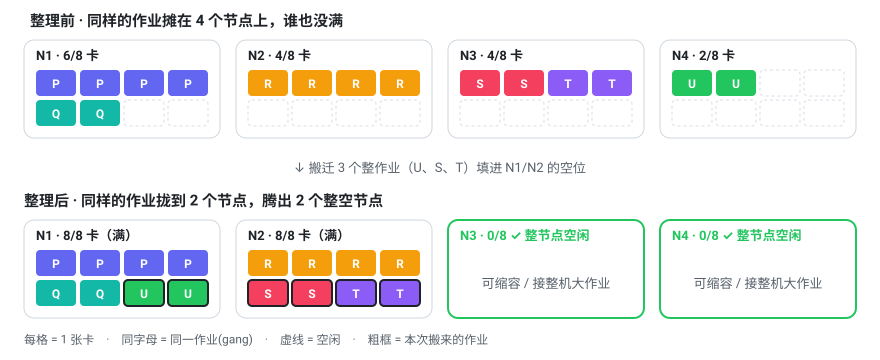

**配图：4 节点 ×8 卡的一轮 drain（理论最优 = 2 个空节点）。**

```text
初始        N1: P(4) Q(2) 空2   N2: R(4) 空4   N3: S(2) T(2) 空4   N4: U(2) 空6
            总用 16 卡 → A=⌈16/8⌉=2，B=4 → 收益上界 = 2 个空节点

腾空成本排序  N4(1 gang,2卡) < N3(2 gang,4卡) < N2(1 gang) < N1(2 gang)

drain N4:  U(2) best-fit 填 N1 的空2 → N1 满(8)；FeasibleRelocation ok；N4 清空 ✔ nodesFreed=1
drain N3:  S(2)→N2空4, T(2)→N2 → N2 满(8)；FeasibleRelocation ok；N3 清空 ✔ nodesFreed=2
drain N2:  已满 → 跳过      drain N1: 已满 → 跳过

结果：腾出 2 个空节点（达到理论最优）；动作 = 3 个 gang(U,S,T)/6 卡；
      ΔFragRate = −2/4。全程只碰被选中腾空的节点，gang 整体迁移、未劈开。
```

> 与 §4.14.1/4.14.2 的关系：4.14.1 描述**单 task 在域内**的落点判定（复用调度器过滤栈，落点不反向制造碎片）；4.14.2 给出 **INV-RESCHED** 硬不变量及其 `FeasibleRelocation` 实现。本节（4.14.0）是把两者**编排**成「逐节点 drain、逐 gang FFD 安置、原子提交」的总流程。

#### 4.14.1 「模拟匹配」是什么：沙箱事务心智模型

**一句话**：模拟匹配 = 在一份集群状态的**沙箱副本**上，把一次候选整理「试做一遍」——确认所有被挪的 pod 都能重新落下、且够本，才采纳；否则原样回滚、换方案重试。跟数据库事务 `BEGIN … COMMIT / ROLLBACK`、或下棋前在脑子里走一遍子，是同一回事。

**为什么要模拟（而不是直接动手）**：

1. **DryRun 不能碰真集群**：出方案阶段只在内存副本上推演。
2. **一次整理要试很多候选**：腾哪个节点、victim 怎么搬，会枚举出多个候选方案，绝大多数被丢弃，只有**最优且达标**的那个才落地。
3. **驱逐前必须确认能落回去**：这正是 INV-RESCHED（§4.14.2）——副本上先验证「人人有家」，真集群才不会被打出新的 pending。

**实现方式：克隆隔离，不是 `Statement`。** 早期设计想复用 gangpreempt 的 `framework.Statement`（Evict/Pipeline/Commit/Discard 沙箱事务），但 `Statement.unPipeline` 会把 `task.NodeName` 置空——对同一 pod evict+pipeline+discard 会污染真实状态，无法用于 repack。故改为**克隆隔离**：每次判定都克隆候选 node 副本 + `cycle-state` 副本，只在副本上推演，丢弃即天然回滚，从不触碰共享 Session。这正是 preempt 的 `SimulatePredicateFn` 依赖的同款隔离。

| 副本原语 | 在克隆副本里做什么 |
|------|----------------|
| `node.Clone()` + `state.Clone()` | 起一份沙箱：候选节点与其 cycle-state 的独立副本 |
| `SimulateAddTaskFn` + `nodeCopy.AddTask` | 「假装放置」：把已落 pod 加进副本，占用其 `FutureIdle`、并更新拓扑/亲和的 cycle-state |
| `SimulatePredicateFn` | 「校验落点」：在副本上跑**完整过滤栈**（亲和/污点/拓扑/设备…）+ `InitResreq ≤ FutureIdle` |
| 丢弃克隆 | 整笔回滚（**DryRun/Execute 判定期都不碰真集群**）；真正落地由 Execute 的 Eviction API 完成 |

**到底「匹配」什么**：把每个要安置的 task（被挪 gang 的 pod），在**保留节点**里找一个落点——既要**放得下**（`InitResreq ≤ FutureIdle`），又要**通过完整过滤栈**（亲和/污点/拓扑/设备约束，`ssn.SimulatePredicateFn`）。整段「驱逐全部 victim → 逐个重落 → 是否全部成功」由 `Snapshot.FeasibleRelocation` 串起来（`api/schedulability.go` 的 `Domain.Feasible` 是等价的纯 FFD+回溯参考求解器，仅测试 fake 复用）；全程只在克隆副本上进行、不碰真集群。

#### 4.14.2 硬不变量 INV-RESCHED：被挪的 pod 都要有新家

> **核心不变量（INV-RESCHED）**：repack 是**搬家**，不是抢占。**每个被挪动的 pod，都必须在整理后的集群里有可行落点（能重新调度）**。做不到 → 该方案**直接判不可行**（不是降级偏好），引擎换节点/换 victim 重试；都不行就 `NoRepackNeeded`、**不动**。

**为什么是硬前提**：驱逐了却放不回去，等于把一个在跑作业打成新的 pending——净收益 ≤ 0，还白白中断了业务。所以它是「够不够本」之前就要过的**可行性闸门**。

**与 preempt 的区别**：preempt 是**单向**的（腾出 victim 接住 pending，victim 被牺牲、留作 pending 也无妨）；repack 必须保证**所有被挪的 pod 都重新落下**，一个都不能掉。

**怎么验证**：就是 §4.14.1 的 `Snapshot.FeasibleRelocation`——在克隆副本上把全部 victim 视作已驱逐 → 用 `ssn.SimulatePredicateFn` 给全部被挪 pod 逐个找落点 → **全部成功才算可行** → 丢弃克隆。等价表述：**repack 永不降低集群整体可调度性**。

- 与 §4.7.1 区分：victim「能否落下」是**硬**可行性（驱逐前必查）；nomination「落到**哪个**节点」是**软**引导（实际调度漂移可接受）。

> **P1 注（relief 的"相位1"）**：P0 是 consolidation-driven，只有上面这一项「victim 重落」校验。**relief-driven（P1）会多一个正向校验**——被解开的那个 pending gang 能否真的 pipeline 进腾出的域（"目标落点/相位1"）；届时可行性 = 目标落点 ok **且** victim 重落 ok。详见 §3.3 分期。`bundlePolicy`（只动盈余 pod vs 整 job 搬）也属 P1（disruptionPolicy）；**P0 默认整 gang 完整搬迁**，靠 INV-RESCHED 保证整 gang 有新家。

#### 4.14.3 端到端流程（P0：consolidation-driven）

对应 §4.14.0 骨架。**外层逐节点 drain（收益单位）、内层逐 gang FFD 安置（动作单位）、沙箱验证后原子提交**：

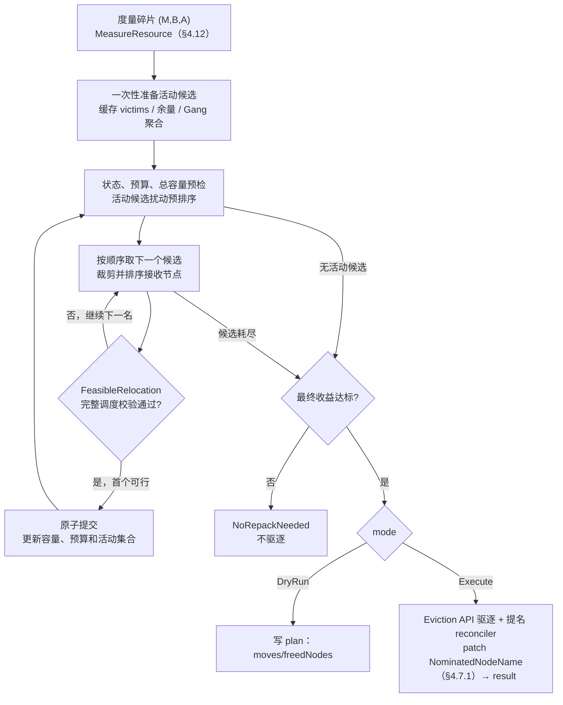
```mermaid
flowchart TB
    A["度量碎片 (M,B,A)<br/>MeasureResource（§4.12）"] --> B["一次性准备活动候选<br/>缓存 victims / 余量 / Gang 聚合"]
    B --> C["状态、预算、总容量预检<br/>活动候选扰动预排序"]
    C --> D["按顺序取下一个候选<br/>裁剪并排序接收节点"]
    D --> E{"FeasibleRelocation<br/>完整调度校验通过?"}
    E -->|否，继续下一名| D
    E -->|是，首个可行| F["原子提交<br/>更新容量、预算和活动集合"]
    F --> C
    C -->|无活动候选| G{"最终收益达标?"}
    D -->|候选耗尽| G
    G -->|否| X["NoRepackNeeded<br/>不驱逐"]
    G -->|是| H{mode}
    H -->|DryRun| R1["写 plan：moves/freedNodes"]
    H -->|Execute| R2["Eviction API 驱逐 + 提名 reconciler<br/>patch NominatedNodeName（§4.7.1）→ result"]
```

> 注：图中省略了 relief 的"目标落点（相位1）"——那是 P1（§4.14.2 P1 注）。P0 的"模拟匹配"就是 D→E 这两步：克隆副本上把 gang 填进碎片、`FeasibleRelocation` 确认人人有家。

#### 4.14.4 victim 选择映射（repack 复用现有 Bundle 模型）

| repack 概念 | 引擎实现 | 位置 |
|-------------|----------|------|
| 搬迁单元（**P0 默认整 gang 完整搬迁**） | 直接整 gang 重落，靠 INV-RESCHED 保证有新家 | `core/drain/drain.go` |
| `disruptionPolicy.bundlePolicy: SurplusPodsOnly`（**P1**） | **`BundleSafe`**（只动 gang 盈余 Pod，不破 `MinAvailable`/`MinSubJobs`） | `actions/utils/bundle.go` |
| `disruptionPolicy.bundlePolicy: EntireJobPermitted`（**P1**） | **`BundleWhole`**（整 Job 原子搬迁） | 同上 |
| `scope` 划片（谁能动/冻结） | **`Movable`/`NodeFreeable`/`VictimsOf`**（§4.14.0）；P1 叠加 `ssn.UnifiedEvictable` 插件门控 | `api/movability.go` / `framework/scope.go` |
| 触发来源标识 | Eviction 子资源驱逐（无需自定义 EvictionKind；开环、走标准 Eviction API） | `process.go`（`hooksFor` 注入 Eviction 提交器） |
| 模拟 / 校验 / 回滚 | **克隆 node + cycle-state → `SimulatePredicateFn` 逐个重落**（`FeasibleRelocation`）；DryRun/Execute 判定期均只读，丢弃克隆即回滚 | `adapter/snapshot_session.go` |
| 落点提名 | `pod.status.NominatedNodeName`（§4.7.1，软引导） | `actions/utils/util.go` |

> **多层 HyperNode 整理顺序**（需求开放问题 §6.2）：P0 按目标画像所需 tier、沿 `HyperNodeGradientForSubJobFn` 的梯度自底向上搜索（与 gangpreempt 一致）；「按最严重层优先 / 跨层迁移代价计入收益」留 P1。

#### 4.14.5 与 gangpreempt 的异同（对照）

| 维度 | gangpreempt | repack |
|------|-------------|--------|
| 驱动 | `JobStarving` + 队列优先级 | 碎片 + pending（`triggers.onPending`），按需/手动 |
| victim 范围 | 同队列、低优 | `scope` 内、`disruptionScore` 低、非 excluded |
| 被挪 pod 是否要重落 | 否（victim 被抢占即可） | **是**（INV-RESCHED，所有被挪 pod 都要有新家，§4.14.2） |
| 提交判据 | `JobPipelined` 即提交 | INV-RESCHED 可行 **且** 收益门控达标（§4.13） |
| 落子 | 同进程 Statement.Commit | 跨进程：Eviction + 主调度 allocate + nomination 引导（§4.7.1） |
| 模拟原语 | `Statement` Evict/Pipeline/Discard（进程内） | **克隆 node + cycle-state**，用 `ssn.SimulatePredicateFn` 跑完整过滤栈（不用 `Statement`：其 `unPipeline` 置空 `NodeName`，会污染真实状态），§4.14.1 |

#### 4.14.6 整理精修：势函数局部搜索（**P1**，思路记录）

> **本节为 P1 精修思路，非 P0 契约**。P0 用 §4.14.0 的 drain-anchored 构造式贪心即可；本节记录一个可叠加的**局部搜索精修器**（拟实现 `pkg/repackengine/refine.go`），用于捡起构造式贪心因定序错过的多节点协同 consolidation，并天然支持**在线/增量**整理。

##### 一句话讲清（对外讲解版，不必出现"势函数"三个字）

> **给整个集群打一个「集中度分数」= 每个节点用量的平方和；只做能让分数变大的搬迁。分数越大 = 负载越扎堆 = 空出来的节点越多。**

- **要解决什么**：集群里一堆节点都半满——卡没用完、剩的又装不下大作业。整理就是把零散负载往更满的节点上**并**，把某些节点彻底腾空（缩容 / 接整机大作业），作业全程不停、只换节点。
- **怎么决策每一步**：给集群打「集中度分数」=Σ(每节点用量²)，**只做能让分数变大的搬迁**。
- **为什么平方（点睛）**：平方让"扎堆"比"摊平"值钱——同样 8 张卡，`(8,0)` 得 **64**，`(4,4)` 只得 **32**。所以"把分数做大"自动等于"逼负载往一起凑、把节点腾空"。
- **怎么搬 / 何时停**：每次把一个负载搬到它放得下的**最满**节点（best-fit）；只要分数涨幅 > 这次搬迁的打扰代价就搬，否则不动。分数只增不减又有上限 ⇒ **必然停**，停下即整理完。
- **防瞎搬**：别搬半天没真空出节点（纯折腾，业界叫 *migration thrashing*）——**最后只采纳"真能多腾出节点"的那批动作**。
- **配图直觉**：4 个节点用量 `6/4/4/2`（分数 72、空 0）→ 并成 `8/8/0/0`（分数 **128**、空 **2**）；同样 16 张卡没增没减，"扎堆"后分数涨、凭空多出 2 个空节点。

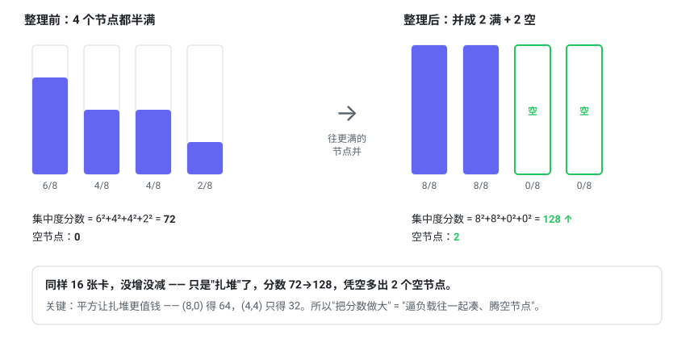

> 讲解建议：从"半满节点并箱子"的画面讲起，"平方那句"留作点睛；名字就叫**「集中度分数」**，最后再轻点一句"这其实是博弈论里的**势博弈**、也是云厂商**虚拟机整合**的标准做法"给可信度。下面是它的严格依据。

**动机与定位**：drain-anchored（§4.14.0）是**构造式**基线——自顶向下选节点、原子腾空、KPI 直达、扰动可界，但贪心定序可能卡在局部最优。精修器换**自底向上、以负载为决策单元**的视角（正是"满节点冻结、稀疏节点负载逐个决定 stay/fill"的直觉），作为基线之上的**爬山**。二者是**构造 + 精修**互补，不是二选一。

**势函数（potential function）**：给整个集群状态记一个标量

$$\Phi=\sum_{\text{node } i}\text{used}_i^2$$

设计成"每个负载的一次有利移动 = 全局 Φ 的等量变化"（exact potential）。把大小 g 的负载从源 S 搬到目标 D：

$$\Delta\Phi = (\text{used}_S-g)^2+(\text{used}_D+g)^2-\text{used}_S^2-\text{used}_D^2 = 2g\big(g+\text{used}_D-\text{used}_S\big)$$

两条性质治好"平梯度"：① 挪走源的**最后一块**（a=g，源归零）⇒ ΔΦ=2g·used_D>0，清空动作恒被奖励；② 中间块 ΔΦ>0 ⟺ 目标比"源的剩余"更满 ⟺ **best-fit 填更满的节点恒增势**。由凸性/majorization（Hardy–Littlewood–Pólya）：固定总负载下 **maximize Σused² ≈ minimize 占用节点数 B**，是 KPI 的合理光滑代理（直接拿"空节点数"当逐负载判据梯度是平的、会卡死）。

**逐负载决策（扰动当摩擦）**：负载 L（大小 g，源 S，best-fit 目标 D）

$$\text{移动 } L \iff \underbrace{2g\,(g+\text{used}_D-\text{used}_S)}_{\text{势能收益 }\Delta\Phi} \;>\; \lambda\cdot\underbrace{\text{disruption}(L)}_{\S 4.16\ \text{WeightedDisruption}}$$

否则**留原地**；λ 调"多动换紧凑 vs 少动"。

**理论背书**：此即在 **potential / congestion game** 上的 **best-response dynamics**——每个负载轮流做对 Φ 最优的移动，**有限步收敛到局部最优**（Nash 均衡 = Φ 局部极值）；偶发两点振荡加微扰打破。与摊还分析的"势能法"、控制论的 Lyapunov 函数同源。

**必备守卫**（否则退化为 churn）：① **filled 守卫**——接收过搬入的节点不再作腾空候选（orchestrator 已有）；② **收益闸门**——一轮精修后**只提交"净增 nodesFreed"的 move 子集**，Σused² 升了但没多空出节点则整批回滚（与 §4.13 "够本才动" 一致）。这两点对应业界 VM 整合里命名的 **migration thrashing**（搬来搬去停不下来）的防治。

**锚定满节点**：高分配率节点**冻结为"源"**（不从它搬出）但**仍可作"汇"**（小碎片可被填），把问题规模从全集群缩到稀疏节点负载——对 drain-anchored 与精修器都适用。

**同构领域**：这整套 = 云里的 **dynamic VM consolidation**（带迁移代价的 bin repacking）；本设计的 λ·扰动摩擦 = 文献中的 *migration cost*，FFD/best-fit、thrashing 防治均有成熟对照。

**参考**：Tarjan, *Amortized Computational Complexity* (1985)；Rosenthal (1973) / Monderer & Shapley, *Potential Games* (1996)；Hardy–Littlewood–Pólya, *Inequalities* (1934)；dynamic VM consolidation / server consolidation 综述（bin repacking + migration cost + thrashing）。

### 4.15 P1 扩展方向（思路记录，字段未定稿）

> **本节为 P1 演进思路，非 P0 契约**。下列 YAML/字段名（`topology`、`queueAware`、`goals[].optimize`、`perJobRepackBudget` 等）**均为示意，尚未定稿**，**P0 不引入这些字段**；待 P1 真正设计时再逐一定稿、并入 CRD。记录于此只为说明扩展点已预留、不会回改 P0 主干契约（引擎只读 Run.spec、策略点已 plugin 化，§4.16）。

#### 4.15.1 多级拓扑兼容（多级 HyperNode）

**现状**：引擎已支持 tier 梯度（`HyperNodeGradientForSubJobFn`，`hyperNodesSetByTier`/`realNodesSet`），P0 沿梯度自底向上取首个可行域。

**P1 扩展**：

| 能力 | 方案 | 接入点 |
|------|------|--------|
| 逐层碎片度量 | `HyperNodeFragRate{tier}`（§4.12.2 已定义）逐 tier 输出到 `report.summary.perTier[tier]`（P1 扩展槽） | FragmentationDetector |
| 整理顺序策略 | `topology.consolidationOrder: BottomUp \| MostFragmentedFirst`（P1 字段，位置未定；P0 隐式 BottomUp） | 域枚举器 |
| 跨层迁移代价 | victim 若需跨更高 tier 迁移，`disruptionScore` 加 `crossTierPenalty`（拓扑亲和破坏越大代价越高） | §4.13.3 打分 |
| 目标层选择 | 按画像 `topologyTier` 选整理层；多画像跨层时按收益/代价择优 | 收益门控 §4.13 |

```yaml
# 字段示意（P1 未定稿，位置待定）
topology:
  consolidationOrder: BottomUp        # P1：BottomUp | MostFragmentedFirst
  crossTierPenalty: "10"              # P1：跨 tier 迁移在 disruptionScore 上的附加权重
```

#### 4.15.2 队列配额感知

**现状**：落点判定可**部分**配额感知——在 `Fit`/predicate 阶段对每个 task 调 `ssn.Allocatable(queue, task)`，placement 不会越过队列 `capability`（capacity/proportion 插件口径）。

**P1 扩展**（victim 侧与跨队列）：

| 能力 | 方案 |
|------|------|
| victim 不破队列保障 | 驱逐后该队列 `allocated` 不得跌破 `Queue.Spec.guarantee`；低于保障的队列内任务**不作 victim** |
| 偏好超配队列 | 优先驱逐 `allocated > deserved` 的队列内任务（把超用资源让出），`disruptionScore` 减项 |
| 跨队列核算 | victim 与 target 跨队列时，模拟须同时满足两队列 `Allocatable`；复用 `Queue.Spec.{deserved,capability,guarantee}` + `Status.allocated` |

```yaml
# 字段示意（P1 未定稿）
disruptionPolicy:
  queueAware: true                    # P1：victim 选择感知队列配额与保障
```
> 注：gangpreempt 限定 victim 同队列；repack `queueAware` 允许跨队列但须双侧配额校验，避免「整理把另一队列顶爆」。

#### 4.15.3 最优成本整理（影响作业最少 / 卡数最少）

**现状**：P0 贪心取**首个可行** plan（gangpreempt 同款，快但非最优）。

**P1 扩展**：在可行解集合上做**有界搜索 + 成本择优**：

```text
candidatePlans = 枚举（域 × victim Bundle 组合，受 maxCandidatePlans 上限）
  每个 plan 仍由 FeasibleRelocation 验证可行（INV-RESCHED）
cost(plan) = α·|victimJobs| + β·evictedResources(按资源加权) + γ·Σ disruptionScore
选择 argmin cost(plan)；再过 §4.13 收益门控
```

```yaml
# 字段示意（P1 未定稿）
goals:
  optimize: MinAffectedJobs           # P1：MinAffectedJobs | MinAffectedGPUs | Weighted
  costWeights: { jobs: "1.0", gpus: "0.5", disruption: "0.2" }  # optimize=Weighted 时生效
  maxCandidatePlans: 32               # 搜索上限，保证可控开销（NFR 性能）
```
- `MinAffectedJobs` → α≫β,γ；`MinAffectedGPUs` → β≫α,γ；`Weighted` → 用 `costWeights`。
- 搜索上限封顶，超限退化为 P0 贪心，保证大集群开销可控。

#### 4.15.4 单作业抗反复中断（victim 公平/退避）

**现状**：`disruptionScore` 已含「历史被整理次数」软因子（§4.13.3）；P1 增**硬约束**，避免同一作业被反复搬迁。

**方案**：

| 机制 | 做法 |
|------|------|
| 计数与时间戳 | 引擎 Commit 驱逐某 Job 后，写回 Job 注解 `repack.volcano.sh/repack-count`（滚动窗口计数）与 `repack-last-time` |
| 硬退避 | 作业处于 `perJobCooldown` 内、或窗口内 `repack-count ≥ maxRepacks` → **该作业本轮不作 victim**（作为 `UnifiedEvictableFn` 过滤项注入，与 PDB 同路径） |
| 与集群冷静期区分 | `executeCooldown`（§4.5.5）是**两次 Run 之间**的集群级；`perJobRepackBudget` 是**单个作业**维度的，二者正交 |

```yaml
# 字段示意（P1 未定稿）
disruptionPolicy:
  perJobRepackBudget:                 # P1
    maxRepacks: 3                     # 滚动窗口内最多被整理次数
    window: 24h
    cooldown: 2h                      # 同一作业两次被整理的最小间隔
```
> 体验保证：长训练作业不会因多轮整理被反复打断；超预算的作业自动晋升为「被保护对象」，与 §4.13.3「高代价负载优先保护」一致。

#### 4.15.5 碎片整理目标的泛化框架（三轴；P0 是特例）

> AI 场景下"整理目标"不止"清空整节点"一种。把目标抽象成**三根正交的轴**，现有 P0 只是其中一个取值组合，其余取值即 P1 的 NVLink / 超节点等需求，**无需改主干**，只换扩展函数（§4.16）。

| 轴 | 含义 | **P0 取值** | P1 取值（本节后续） |
|----|------|-------------|---------------------|
| **① 目标粒度**（要腾空的"bin"） | 整理后追求空出来的最小单元 | **整 node** | **NVLink island**（节点内）、**HyperNode 内的 k-node 块**（超节点） |
| **② 目标形状**（怎样算达标） | 收益/门控的判据 | **全局最大化空 node 数** `(B−A)/M` | **每域配额**（每 HyperNode 腾 k 或其倍数）、**拓扑相干块可用性** |
| **③ 整理域**（在多大范围内重排） | 模拟匹配的 domain | **scope 全域** | **逐 HyperNode**、**逐 NVLink island** |

落到已有扩展点（§4.16）：①→`TargetProfileFn`（定义 bin 粒度）+ `FragmentScoreFn`（在该粒度度量碎片）；②→`RepackBenefitFn`（按形状判定达标）；③→域枚举器（按 tier 切 domain）。**P0 = 〈整 node × 全局最大 × 全域〉**；下面两节是另外两组取值，算法 A/B 都能承载。

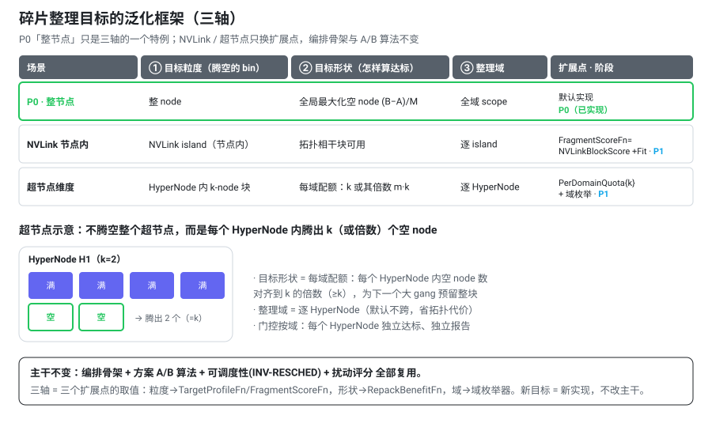

#### 4.15.6 NVLink 节点内拓扑碎片整理（**P1**）

**目标**：节点内 GPU 经 NVLink 分成若干 island（如 8 卡 = 2×4 卡 island）。一个要 4 卡的作业希望拿到**同一 island 的 4 张 NVLink 互联卡**(性能)。碎片 = 卡空着但散落在多个 island、拼不出一个相干块。整理目标 = 重排使空闲卡**在 island 内聚拢**、腾出整 island（甚至整节点的对称 island 结构）。

**与 P0 的差异**：资源不再是"每节点一个标量计数"，而是**带节点内拓扑结构**（每 island 的占用）；落点判定要 **NVLink 感知**（复用 Volcano device-plugin / `resource-strategy-fit` 的拓扑能力）。

**算法如何泛化**：本质是"**把同一套整理下沉一层**"——把 NVLink island 当作子节点级 bin，碎片指数 / 集中度势函数在 **island 粒度**上再跑一遍。
- **方案 A**：drain 的单元从"node"变为"island"——腾空一个 island（把其上卡作业整组重排到其他 island 的相干空位）。
- **方案 B**：势函数改为 **island 粒度的 Σused²**，或换成"NVLink 相干块可用数"的拓扑势；Fit 加 NVLink 约束。
- 注意：节点内 GPU↔pod 绑定由 device-plugin 管，"island 整理"在实现上仍是**驱逐+重调度 pod**让 device-plugin 重新相干打包，不是调度器直接搬卡。

**落点**：新增 `FragmentScoreFn=NVLinkBlockScore` + NVLink 感知 `Fit`；P1 实现。

#### 4.15.7 超节点（HyperNode）维度碎片整理（**P1**）

**目标**：超节点（如 NVL 域 / 一个 HyperNode 含多台 node 高带宽互联）场景下，**不是腾空整个超节点**，而是**在每个 HyperNode 内腾出固定 k 个空 node（或其倍数 m·k）**——为承接下一个大 gang 预留"对齐的整块空位"。

**与 P0 的差异（关键）**：
- **目标形状从"全局最大化"变为"每域配额"**：成功 = 每个目标 HyperNode 内空 node 数达到 k 的倍数（≥k、且按 k 对齐），而非全局尽可能多。
- **整理域 = 逐 HyperNode**：重排限定在 HyperNode 内（跨 HyperNode 搬迁破坏拓扑亲和、代价高，默认不跨）。
- **门控按域**：`RepackBenefitFn` 判"该 HyperNode 是否达到 k·m"，每个 HyperNode 独立达标/独立报告。

**算法如何泛化**：
- **域枚举**：按 HyperNode tier 把 scope 切成多个 per-HyperNode domain（复用 `hyperNodesSetByTier`/`RealNodesList`，§4.15.1）。
- **方案 A**：在每个 HyperNode 域内,按"腾空成本低优先"drain,**drain 到该域空 node 数达 k 的倍数即停**（而非尽可能多）。
- **方案 B**：在每个 HyperNode 域内跑集中度爬山,**收益门控改为"freedInDomain ≥ k 且对齐到 k 的倍数"**（`MinNodesFreed` 泛化为 per-domain 的 `k`/对齐约束）。
- 报表：`report.summary.perTier[hyperNode]` 输出每超节点腾出的空 node 数（k 的几倍），对运维直观。

**落点**：`TargetProfileFn` 产出 per-HyperNode 目标 + `RepackBenefitFn=PerDomainQuota{k}` + 域枚举器；P1 实现。P0 的全局口径是其"域=全域、k=1、不要求对齐"的退化特例。

### 4.16 策略扩展框架（Action + Plugin，关键策略点可插拔）

**设计原则**：repack **完全沿用 Volcano 既有 action+plugin 框架**——核心库不写死策略，把关键决策点暴露成**可注册的扩展函数**（与 `JobOrderFn`/`NodeOrderFn`/`UnifiedEvictableFn` 同款 `ssn.AddXxxFn(name, fn)` 注册、按 tier 组合的范式），平台/后续需求以**插件**接入，不改主干。

> **当前实现口径（2026-08）**：架构已收敛为 **Engine → Action → Planner** 的稳定主流程，以及 Plugin → Session 回调的策略扩展面；不再保留 `Core` 接口、注册表和算法选择参数。权威设计与代码映射见 [Repack Action + Plugin 架构设计](./repack-action-plugin-architecture.md)。本章后续标注“早期设计”的 Core/双算法内容仅保留为历史推演，不代表当前实现。

#### 4.16.1 复用 Volcano 框架的方式

- repack-engine 用 **`framework.OpenSession(ownCache, tiers, conf)`** 构建自己的 Session（独立进程、自有 cache，§4.5b/需求 §4.5），**直接复用全部既有插件**：`predicates`/`nodeorder`/`binpack`/`resource-strategy-fit`/gang(`SubJobReady`…)/`hypernode`/`pdb` —— 模拟与落点打分天然与主调度一致。
- 在此之上，repack 插件用 `OnSessionOpen` 注册 **repack 专属扩展函数**；repack 核心库（`pkg/repackengine`）只负责**编排**（度量 → 选 victim → 模拟 → 门控 → 提交），具体口径全走扩展函数的组合结果。
- 启停与顺序走 **scheduler 配置的 tiers/plugins**（与主调度一致），未启用即零开销。

#### 4.16.2 关键策略点 → 扩展函数 → 默认实现

> **落地口径（权威）**：插件在八个正交决策面注册回调；Action 负责业务编排，Planner 负责搜索机制。本表为准。

**① 插件维度（`ssn.AddXxxFn`，搜索的输入面，AND/union/加权聚合）**

| 维度 | 注册函数 | 语义 | 现有/预留实现 |
|------|----------|------|----------------|
| **可动性** | `AddMovableFn(task)→bool` | 某 task 能不能被搬（AND 否决） | `workloadscope`（P0）；PDB / `minRunDuration`（P1） |
| **可腾空单元** | `AddDomainFn(snap)→[]FreeableUnit` | 什么算一个可腾空单元 | `nodeconsolidation`（P0，单节点）；hypernode/多级拓扑（P1，更大单元） |
| **候选硬过滤** | `AddCandidateFilterFn(name,fn)` | 评分和调度模拟前低成本否决候选 | `repackbudget` maxPerRun（P0）；接收总容量预检为 Planner 内置必要条件 |
| **扰动软打分** | `AddDisruptionScoreFn(name,w,fn)` | 给候选计划的某个扰动维度打分（**只用于排序**，min-max 归一加权） | `workloaddisruption`(affectedPodGroups/movedCards/movedPods) + `gangdisruption`(gangBreaches/damagedGPU)（P0）；权重由 Repack Engine config 配置 |
| **Victim 顺序** | `AddVictimOrderFn(name,fn)` | 决定完整调度模拟中的 Pod 尝试顺序 | `binpack` 大请求优先（P0） |
| **接收集合** | `AddReceiverPoolFn(fn)` | 在 Planner 已排除空节点、满卡节点和无可调度余量节点后，继续链式裁剪 receiver universe | 预留给场景插件；`binpack` 不负责基础合法性（P0） |
| **接收排序** | `AddReceiverRankFn(name,priority,fn)` | 按显式优先级组成字典序 rank | `binpack` 保持占用/best-fit + `gangdisruption` 未来腾空成本（P0） |
| **计划硬约束闸** | `AddConstraintFn(plan)→bool` | 给**成品计划**的硬否决（AND，任一 false 即丢弃） | 内置收益门控 `MinNodesFreed`/`MinFragImprovementPercent`（P0）；`disruptionPolicy.maxDisruptionScore`（P1） |

**② 策略注册表（不是插件维度）**

| 维度 | 机制 | 现有/预留 |
|------|------|-----------|
| **业务流水线** | `Action.Execute(ssn)`（`RegisterAction`，有序） | `repack`(P0)；未来独立阶段可新增 Action |
| **搜索机制** | Action 直接调用 `planner/drain.BuildPlan` | 候选准备、增量状态、惰性 `FeasibleRelocation`；不承载场景策略 |

> **为什么这么分**：`AddCandidateFilterFn` 在昂贵评分/模拟前做硬过滤，`AddDisruptionScoreFn` 对候选做软排序，`AddConstraintFn` 对成品计划做最终硬否决；三者分别对应不同成本和生命周期。Action 保持清晰的业务主流程，Planner 只维护高性能增量搜索，具体场景语义全部由 Plugin 注入。
>
> **能力完整性**：Action 通过 Capability 而不是插件名声明最低要求。`repack` 至少需要一个 `domain` provider；当前 `nodeconsolidation` 提供该能力。其余策略插件可独立关闭，未提供 Domain 时 Engine 在加载配置阶段直接报错，不进入静默空规划。
>
> **P1 目标泛化方式**：多级拓扑通过新的 `AddDomainFn` 贡献 HyperNode Unit；TP/EP 或推理 Role 卡数倍数通过候选过滤/成品计划约束表达；新的接收偏好通过 `AddReceiverRankFn` 表达，不修改 Drain 主循环。

#### 4.16.3 编排骨架（核心库只编排，策略全可插拔）

> **当前实际编排**：`repack Action` 度量整理前碎片 → `drain.BuildPlan` 调用 Plugin 候选过滤/评分/接收排序并惰性执行 `FeasibleRelocation` → Action 调用 `PlanAdmissible`、计算成本并渲染 Report。下图仅存档早期概念意图。

```text
RepackEngine.Run(ssn, scope):                      // pkg/repackengine
  profiles  = ssn.TargetProfileFn(snapshot, scope)            // 可插拔
  before    = ssn.FragmentScoreFn(snapshot, scope, profiles)  // 可插拔（默认空节点口径）
  for domain in HyperNodeGradientForSubJobFn(...):            // 可插拔（拓扑顺序）
    victims = pick by AddDisruptionCostFn 升序 ∩ UnifiedEvictable // 可插拔（代价+资格）
    plan    = FeasibleRelocation(...)                         // repack 可调度性检查
    after   = ssn.FragmentScoreFn(plan 应用后快照, ...)        // 可插拔
    if ssn.RepackBenefitFn(before, after, planCost).worth:     // 可插拔（门控）
        (P1) 收集候选 plan，AddRepackPlanScoreFn 取 argmin
        commit / recommend
    else: NoRepackNeeded
```

- **复用既有引擎**：`Snapshot.FeasibleRelocation`（克隆 node + cycle-state、`ssn.SimulatePredicateFn` 完整过滤栈）+ predicate / nodeorder；扩展点只包在它**外围**的策略层，风险可控。
- **组合语义**对齐 Volcano：多插件注册同一 Fn 时，按 tier 顺序组合（打分类取加权/累加，bool 类取与/短路），与 `JobOrderCompareFn`/`UnifiedEvictable` 既有组合方式一致。

#### 4.16.4 与 action 形态的关系

- **形态 A（合并）**：repack 作为与 `gangpreempt` 并列的 in-tree action，上述扩展函数由插件在主调度 Session 注册（需求 §4.5 形态 A）。
- **形态 B（独立，定稿）**：repack-engine 独立进程、自建 Session，**注册同一组扩展函数**——「合/拆」只换入口与 cache，策略插件代码不分叉（需求 §4.5「一套核心库 + 两个入口」）。

#### 4.16.4.1 repack-engine 的 action 架构：P0 单 action，多 action 可演进（已落地骨架）

> **诉求**：P0 只跑一个 action，但 repack-engine 的架构**从一开始就是"多 action 可插拔、有序流水线"**——镜像 `volcano-scheduler` 的 `action + registry + 有序执行`，后续加 `relief`、调度模拟器等**只注册新 action + 进配置顺序**，不动主干。已落地为 `actions.go`。

**接口与注册表**（与 scheduler `framework.Action` 同形 `Name()`+`Execute`，且**跑在同一个 `framework.Session` 黑板上**——Session 既持有只读 `Snapshot` 与各插件注册的回调，也承载阶段间的 in-flight `Plan`/`Report`/`Commit`，与 scheduler 的 action 经 Session 传状态完全同构；落地在 `framework/action.go` + `framework/session.go`）：

```go
// framework/action.go
type Action interface {
    Name() string
    Execute(ssn *Session)   // Session = 共享黑板
}

func RegisterAction(name string, factory func() Action)   // 注册
func RunActions(names []string, ssn *Session)             // 有序执行；未知 action 名跳过并告警
func DefaultActions() []string { return []string{ActionRepack} } // P0 流水线

// framework/session.go —— Session 承载 action 的输入与输出
//   输入: Snapshot() / Run() / Scope() / Resource() / Mode()
//   输出: SetPlan()·Plan() / SetReport()·Report() / SetCommit()·Commit()
//   提交副作用经 Hooks()（CommitHooks{Evict, Nominate}）注入，DryRun 为 nil。
```

**P0 唯一 action `repack`** = 度量碎片 → 调用 Lazy Drain Planner → 收益准入 → 扰动成本与 Report。Execute 由 Engine 在计划持久化后经 Eviction API 提交，Action 不直接产生副作用。

**演进示例（无需改 runner）**：

| action | 职责 | 阶段 | 怎么接入 |
|---|---|---|---|
| **`repack`** | 碎片整理主流程（度量→A/B 规划→report/apply） | **P0** | 已注册（内置） |
| `relief` | 为解开 pending gang 反向找落点（§4.14.2 相位1）；victim 选择口径不同 | P1 | `RegisterAction("relief", …)` + 配置顺序加 `relief` |
| `simulate` | 任务调度 **what-if 模拟器**：给定 pending 负载，模拟能否/落在哪，产出可调度性报告 | P1+ | 同上，独立 action，复用同一 `Snapshot`/predicate |

> **关键解耦**：`framework.Session` 对 `Snapshot` 接口编程，不直接依赖 scheduler framework；Plugin 只注册策略回调，Planner 只消费聚合视图。Execute 提交仍走 Engine 注入的 Hook，生产为 Eviction 子资源、测试为 fake。Action 之间通过 Session 传递 Plan/Report；独立 `repack-conf` 中采用与 Scheduler 一致的字符串形式，例如 `actions: "repack"`，多个 Action 以逗号分隔。

#### 4.16.5 集中度精修的可插拔策略 + config 权重（对接 §4.14.6）

> **⚠️ 本节属方案 B（集中度爬山）的历史策略/权重设计，方案 B 未实现**。当前 Lazy Drain Planner 使用增量扰动评分预排序，并沿排序惰性校验首个可行候选，不涉及下面的 λ/净分调参。

集中度精修（§4.14.6）的"搬不搬、搬哪个"决策完全由**可插拔策略 + config 权重**驱动，平台改配置即可调出不同效果，核心库不写死。单步净分：

```text
net(move) = Σ_g wᵍ · gainFn_g(move)   −   λ · Σ_c wᶜ · costFn_c(move)
            \___ 收益侧（默认仅集中度）___/        \___ 摩擦侧（优先级/规模/gang…）___/
```

- **收益侧** = `AddConsolidationGainFn`，默认仅 `ConcentrationGain`(ΔΣused²)。可叠加/替换（如换成"空节点 lookahead"或别的凸势）。
- **摩擦侧** = **复用已实现的 `WeightedDisruption`**（`disruption.go`）——`priority`(任务优先级)/`movedGPU`·`movedPods`(实际迁移量)/**`damagedGPU`(gang 语义受损卡量)**/`gangBreaches`(破 minAvailable)/`affectedPodGroups`，每项 `Use(name, weight, fn)` 注册，**改权重即调效果**（已有"调权重翻转赢家"单测佐证）。
  - **`damagedGPU` 按 gang 语义精确计损（核心）**：损失是**阶跃函数**,不是线性。对每个 gang（含 sub-group），`slack = Running − MinAvailable`：
    - **没突破 minAvailable**（搬走 pod 数 ≤ slack）：只有被搬的 pod 受损 = **搬走的卡**（可控损失）；
    - **一旦突破 minAvailable**：**整个 PodGroup 所有 pod 皆受损** = 整 gang `Footprint`；
    - **已突破后再搬该 gang 的 pod**：边际损失 = **0**（gang 已废，鼓励"要破就把它搬透"，与 `bundlePolicy` 语义一致）。
  - 与 `movedGPU`（只算搬走的卡，看不出 8 卡 vs 1024 卡作业）、`affectedGPU`（悲观：一碰就算整 gang）相比，`damagedGPU` 是**最贴 gang 语义的"真实损失"**。集中度精修(B)里实现为**边际计费 `WDamagedGPU`**：within-slack 的 move 只计自身卡、破 minAvailable 的那一步跳到 footprint−已搬卡、已破后计 0（边际累计 == 平面 `ScoreDamagedGPU`，已单测+Python 验证）。于是 B 倾向"要么只动 gang 盈余 pod（不破 gang）、要么不碰大 gang"。

> **一句话评审版**：搬一个作业的损失**不是线性的，是阶跃的**——没碰到 `minAvailable` 红线时只赔"搬走的那几张卡"（可控）；一旦越线，整个作业（含 sub-group）判定失活，**整作业的卡全赔**；已经越线后再搬同一作业则边际为 0（"要破就搬透"）。所以 8 卡作业破了赔 8、1024 卡作业破了赔 1024，算法据此**优先只动盈余 pod、自动躲开大作业**。A、B 两方案用的是同一套定义。


- **λ** = 收益 vs 摩擦的总松紧旋钮。
- **选择**：steepest-ascent 按 `net` 降序；平局再按"摩擦升序"(更该动便宜的)→稳定 ID（§determinism）。
- **硬护栏（复用既有机制）**：`freezePriorityAbove`(优先级≥阈值的作业进 `Movable` frozen 集、永不搬，等同满节点锚定)、`maxMovesPerJob` / 大作业上限（对接 §4.15 `perJobRepackBudget`）。软成本是默认，硬护栏是可选。

##### 配置归属：集群级评分权重走 Repack Engine config，执行预算走 RepackRun

Repack Engine 通过独立 `repack-conf`（由 ConfigMap 挂载的普通组件配置，不是 CR）选择 Action、Plugin，并为 `workloaddisruption`、`gangdisruption` Plugin 设置集群级中断成本权重：

```yaml
actions: "repack"
plugins:
  - name: workloadscope
  - name: repackbudget
  - name: nodeconsolidation
  - name: workloaddisruption
    arguments:
      affectedPodGroupsWeight: 1.0
      movedResourceWeight: 0.3
      movedPodsWeight: 0.1
  - name: gangdisruption
    arguments:
      gangBreachesWeight: 0.8
      damagedResourceWeight: 0.6
  - name: binpack
```

候选评分先对每个维度做当轮 min-max 归一化，再计算 `Σ(normalized × weight)`，总分越低越优。省略字段采用内置默认值，`0` 表示关闭该项；非法数值和未知参数会在 Engine 加载配置时被拒绝，运行时也保留防御性校验。该权重只决定可腾空候选的中断成本排序，不改变接收节点固定的 `Stability → Disruption → Packing` 字典序。

配置文件给出集群级默认策略；单轮允许影响的工作负载数量和目标资源迁移量仍由 `RepackRun.spec.maxPerRun` 控制。若未来引入 Run 级 `disruptionPolicy`，其定位是覆盖单次执行策略，而不是替代组件默认配置。

##### 受影响 PodGroup 的判断与控制（**方案 A、B 通用**）

整理过程对"影响了哪些 PodGroup、影响多少"有一套**两方案共用**的判断+控制逻辑（一个 PodGroup 只要被搬动 ≥1 个 pod 即记为"受影响"）：

- **判断（识别 + 度量）**：受影响集合 = 计划内 moves 的 distinct `Job`。
  - 度量：`ScoreAffectedPodGroups`（受影响 gang **数**）/ **`ScoreDamagedGPU`（gang 语义受损卡量：未破 minAvailable 只算搬走卡、破了算整 gang footprint；区分 8 卡 vs 1024 卡作业）** / `CostOf().AffectedPodGroups`（§4.16.5 扰动评分项）；
  - 清单：`RepackPlan.AffectedPodGroups() []JobID`（排序去重，权威列表，供 DryRun 审计；`plan.moves[]` 即据此渲染）。
- **控制（硬约束 + 软成本，A/B 都生效）**：

| 控制手段 | 含义 | A（`PlanOptions`） | B（`ConsolidateOptions`） |
|---|---|---|---|
| **受影响 PodGroup 数上限** | `maxPerRun.podGroups`，超额不再开新 gang | `MaxPodGroups` | **`MaxPodGroups`**（本次补齐，与 A 对齐） |
| **受损卡数（gang 语义，阶跃）软成本** | 未破 minAvailable=搬走卡；破了=整 gang footprint；躲开大作业 | `ScoreDamagedGPU` 权重 | `WDamagedGPU`（边际：内 slack 计卡、破 minAvail 跳 footprint、已破计 0） |
| 可动性划片（冻结） | scope 外/受保护作业绝不碰 | `Movable` | `Movable` |
| 优先级硬地板 | ≥阈值的高优作业永不搬 | （Movable 注入） | `FreezePriorityAbove` |
| 单作业搬迁上限 | 防反复中断 | （§4.15.4 P1） | `MaxMovesPerJob` |
| 软成本 | 影响越多/越重要代价越高，择优时压制 | WeightedDisruption | WeightedDisruption + λ |

> 即：**判断**用同一套 `WeightedDisruption` + `AffectedPodGroups()`；**控制**用同一组旋钮（`MaxPodGroups` 硬上限 + 划片/冻结/优先级地板 + 软成本权重），两方案一致。超额时——A 跳过会超预算的整节点 drain，B 跳过会开启新 gang 的 move——都保证最终受影响 PodGroup 数 ≤ `MaxPodGroups`。
>
> **当前实现的配置来源**：`MaxPodGroups` ← `spec.maxPerRun.podGroups`；可移动工作负载边界 ← `spec.scope`；五个软成本权重 ← `repack-conf` 中 `workloaddisruption`/`gangdisruption` 的 `arguments`。`FreezePriorityAbove`、`MaxMovesPerJob`、λ 和 Run 级 `disruptionPolicy` 仍属于后续能力，不应作为当前可用字段。

#### 4.16.6 历史设计：算法级 Core 注册表（当前未采用）

> **⚠️ 历史存档**：本节以下 `PlanRun`、双 Planner、`Core` 注册表和算法配置均未采用。当前生产路径为 `repack Action → planner/drain.BuildPlan`，场景差异经 Plugin 回调扩展；不存在 `RegisterCore`、`GetCore`、`CoreName` 或 `repack.algorithm` 配置。下文仅保留早期方案推演。

整理算法本身也是**可插拔的**——方案 A（`core/drain/drain.go`，已实现）与方案 B（集中度，未实现、P1）都实现同一 `Core` 接口 `Plan(ssn) → (*RepackPlan, bool)`，**共用同一执行底座**（碎片度量 §4.12 / 可调度性 §4.14.2 `Snapshot.FeasibleRelocation` / 扰动评分 §4.16.5；即 §4.17.0 两张时序图"外层逐字相同"那部分）。差别只在内层搜索范式，故抽一层 **`Core` 接口 + 注册表**，**配置选名即换算法，核心算法零改动**。

**两层"可插拔"要分清（不冲突、相互正交）**：

| 层级 | 插什么 | 选择方式 | 章节 |
|---|---|---|---|
| **算法级**（本节，外层） | **整个搜索范式**：A 节点腾空 / B 集中度爬山 | `repack.algorithm: drain \| concentration` | §4.16.6 |
| **评分级**（§4.16.5，某 planner 内层） | 当前 `workloaddisruption`/`gangdisruption` 的中断成本评分项及权重 | `repack-conf` 的 Plugin 列表与 `arguments` | §4.16.5 |

**接口与注册表**（对齐 Volcano 插件 `Registry` 风格；`PlanInput` = 算法无关入参，全部由 §4.5.2 Run.spec 翻译而来）：

```go
// 算法无关的统一入参（引擎接线时从 RepackRun.spec 翻译填入）
type PlanInput struct {
    Resource      v1.ResourceName                   // ← goals[0].resource
    Movable       Movable                           // ← scope(含exclude)+PDB
    Fit           Fit                               // ← EngineFit(ssn)
    Free          func(*api.NodeInfo) *api.Resource // 默认 NodeInfo.FutureIdle
    PodGroup      func(api.JobID) PodGroupView
    Disruption    *WeightedDisruption               // ← disruptionPolicy 权重(P1)
    MaxPodGroups  int                               // ← maxPerRun.podGroups
    MaxResource   int64                             // ← maxPerRun.resources[R]
    MinNodesFreed int
    Tuning        ConsolidateTuning                 // B 专属(λ/W*/freeze/maxMovesPerJob)；A 忽略
}

type Planner interface {
    Name() string
    Plan(nodes []*api.NodeInfo, in PlanInput) (*RepackPlan, bool)
}

// 两个插件是薄适配器，包住现有函数（核心算法一行不改）
type drainPlanner struct{}          // 方案 A
func (drainPlanner) Name() string { return "drain" }
func (drainPlanner) Plan(n []*api.NodeInfo, in PlanInput) (*RepackPlan, bool) {
    return BuildPlan(n, in.toPlanOptions())          // orchestrator.go
}
type concentrationPlanner struct{}  // 方案 B
func (concentrationPlanner) Name() string { return "concentration" }
func (concentrationPlanner) Plan(n []*api.NodeInfo, in PlanInput) (*RepackPlan, bool) {
    return Consolidate(n, in.toConsolidateOptions()) // consolidate.go
}

var planners = map[string]func() Planner{}
func RegisterPlanner(name string, f func() Planner) { planners[name] = f }
func init() {
    RegisterPlanner("drain",         func() Planner { return drainPlanner{} })
    RegisterPlanner("concentration", func() Planner { return concentrationPlanner{} })
}
```

**config（只多一个选名项；与 §4.16.5 的"启用哪些评分插件"同属插件 `arguments`）**：

```yaml
repack:
  algorithm: drain          # drain（方案A，默认）| concentration（方案B）
  consolidate:              # 仅当 algorithm=concentration 时生效（评分级，§4.16.5）
    gainPlugins:        [ concentration ]
    disruptionPlugins:  [ affectedPodGroups, damagedGPU, priority, movedGPU, movedPods, gangBreaches ]
```

**历史草图中的接线**：`OpenSession` 后按名选择 planner，再把 Run.spec 翻译为
`PlanInput`。当前实现已经收敛为 `repack Action → planner/drain.BuildPlan`；DryRun 写
`status.plan`，Execute 经 Eviction API 和 replacement placement 状态机推进，
不使用 `Statement.Evict/Pipeline/Commit`。

**白送的能力**：两 planner 都产出可比的 `RepackPlan`（`FreedNodes`/`Cost`），故 **DryRun 可同一快照跑两遍并排比**——既是线上 A/B 灰度/回退手段，也直接产出本次 §4.17 选型评审要的实测对照数据。

**落地改动量**：仅新增 `planner.go`（接口+注册表+两适配器+`PlanInput`/`toXxxOptions()` 翻译），`BuildPlan`/`Consolidate` 主体与现有单测不动；另补一个"按名选 planner、对同一集群跑出各自 plan"的单测。

##### 引擎接线落点：`Snapshot` + `RepackRun.spec` → `PlanInput`（`engine.go`，已落地）

外层接线收敛在 `engine.go` 一处：`PlanRun(snap Snapshot, algorithm, EngineParams) → (*RepackPlan, ok, err)`——按 `algorithm` 选 planner、用 `EngineParams` 把 spec 翻译成 `PlanInput`、对 `snap` 跑出 plan；DryRun 再经 `RenderReport(plan)` 渲染 `status.plan`。

> **装配入口 `runtime.RunOnce(ssn, run, apply, opts)`（已落地）**：把一个 `RepackRun` 在已开 Session 上跑完——`BuildEngineParams`(从 spec 取 `goals[0]→Resource`、`scope→ResolveScope→InScope/NodeInScope`、`maxPerRun→MaxPodGroups/MaxResource`，纯函数可测) → `NewSessionSnapshot(ssn,res)` → 组 `ActionContext` → `RunActions`(§4.16.4.1)。DryRun 出 `Report`；Execute 经注入的 `apply`(Statement 提交器，调用方提供，与驱逐/nominate 机制 §4.7.1 解耦)落子。`BuildEngineParams` 与 Session 解耦、用 fake `GangInfo` 单测。

> **关键解耦（对接「独立 engine 组件」部署，§4.7）**：引擎**不直接依赖 scheduler `framework.Session`**，而是依赖一个轻量只读接口 **`Snapshot`**（`Nodes()` / `PodGroupView(JobID)` / `Predicate(task,node)`）。`framework.Session` 只是其**一个适配器** `SessionSnapshot`（`snapshot_session.go`，把 framework 依赖隔离在单文件）；**独立 `volcano-repack-engine` 用自建 informer 缓存实现另一个 `Snapshot`** 即可，引擎主体（`engine.go` / 两个 planner）与 scheduler 无耦合。单测用 `fakeSnapshot`。

| `RepackRun.spec` / 来源 | → `PlanInput`/`EngineParams` 字段 | 翻译实现 | 分期 |
|---|---|---|---|
| `goals[0].resource` | `Resource` | 直传 | P0 |
| `scope.podGroups`(include−exclude·selector+names) | `Movable`(via `InScope`) | `runtime.ResolveScope` 编译 selector/names → `InScope(JobID)`，再 `MovableInScope(InScope, …)` | P0 |
| `scope.nodes`(include−exclude·selector+names) | 域内 `nodes`(via `NodeInScope`) | `runtime.ResolveScope` → `NodeInScope(*NodeInfo)`，再 `NodesInScope(snap.Nodes(), NodeInScope)`（稳定名序） | P0 |
| `Snapshot.Predicate` | `Fit` | 包 `Snapshot.Predicate`（亲和/污点/拓扑/设备）；`SessionSnapshot` 委托 `ssn.PredicateFn` | P0 |
| （引擎内置） | `Free` | `NodeInfo.FutureIdle`（默认；可覆盖供 relief/测试） | P0 |
| `Snapshot.PodGroupView` | `PodGroup` view | `SessionSnapshot` 从 `ssn.Jobs` 取 MinAvailable/Running/Priority/Footprint | P0 |
| `maxPerRun.podGroups` / `.resources[R]` | `MaxPodGroups` / `MaxResource` | 直传 | P0 |
| `eviction.pdb`（尚未暴露） | PDB 规划预检 / Eviction 被阻塞后的处理 | 将来在执行编排层实现；实际 Eviction 始终由 API Server 按 PDB 裁决 | **P1 接缝** |
| `disruptionPolicy`(λ/权重/freeze) | `Disruption` / `Tuning` | 直传（P0 留零=引擎默认评分） | **P1** |

> 这正是 §4.17.0 两张时序图"外层逐字相同"的代码化：`PlanRun` 之上（CR watch / 落盘）与之下（`planner.Plan`）都不分 A/B，**切 `algorithm` 即换算法**；且整条链对 `Snapshot` 编程，**换部署形态（scheduler 内 vs 独立组件）只换 `Snapshot` 实现**。`eviction.pdb` 的预检/重试编排与 `Disruption`/`Tuning` 都是后续 P1 接缝。

---

### 4.17 整理算法方案对比与选型（评审决策材料）

> 本节系统对比两个候选整理算法，供方案评审**做选型抉择**。两者**目标一致**（把负载拢紧、腾出整空节点，KPI=空节点数 `(B−A)/M`），**共享同一套底座**（可调度性 INV-RESCHED §4.14.2、扰动评分 WeightedDisruption §4.16.5、收益门控 §4.13、单资源 §4.12）；差别**只在"怎么搜索这个目标"**。

> **评审一页图**（可直接投屏）：

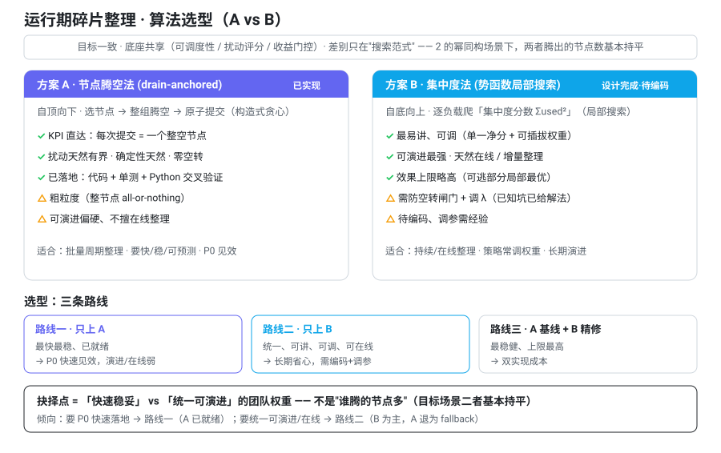

#### 4.17.0 两方案的流程图与时序图（结合 Volcano 现有机制）

> **⚠️ 本节 4 张图为早期两方案（A/B）设计示意，仅作方案对比存档**：当前生产实现只有 `planner/drain`，采用单趟动态增量贪心并产出唯一 plan；场景差异由 Plugin 回调注入，不存在 Core 选择。可行性使用克隆式 `Snapshot.FeasibleRelocation`，Execute 使用 Eviction API 与提名机制。下方 `Consolidate`、`EngineFit`、`Statement`、`Domain.Feasible`、`pickBest` 等均为旧标签。

**① 方案 A · 节点腾空法 — 流程图**（对应 `orchestrator.go`）

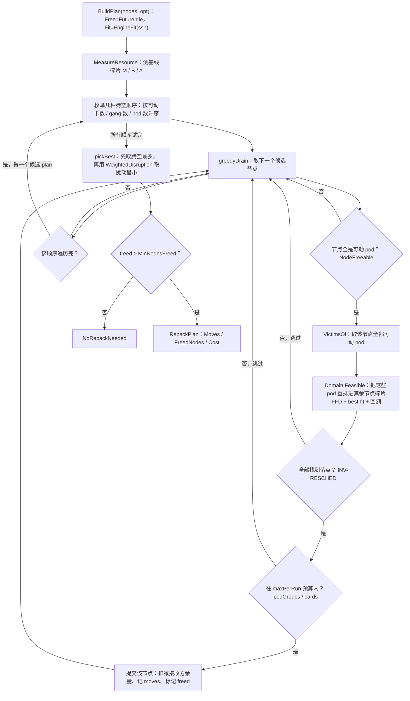
```mermaid
flowchart TD
    A0["BuildPlan(nodes, opt)：Free=FutureIdle，Fit=EngineFit(ssn)"] --> A1["MeasureResource：测基线碎片 M / B / A"]
    A1 --> A2["枚举几种腾空顺序：按可动卡数 / gang 数 / pod 数升序"]
    A2 --> A3["greedyDrain：取下一个候选节点"]
    A3 --> A4{"节点全是可动 pod？ NodeFreeable"}
    A4 -- 否 --> A3
    A4 -- 是 --> A5["VictimsOf：取该节点全部可动 pod"]
    A5 --> A6["Domain.Feasible：把这些 pod 重排进其余节点碎片<br/>FFD + best-fit + 回溯"]
    A6 --> A7{"全部找到落点？ INV-RESCHED"}
    A7 -- 否，跳过 --> A3
    A7 -- 是 --> A8{"在 maxPerRun 预算内？ podGroups / cards"}
    A8 -- 否，跳过 --> A3
    A8 -- 是 --> A9["提交该节点：扣减接收方余量、记 moves、标记 freed"]
    A9 --> A3
    A3 --> A10{"该顺序遍历完？"}
    A10 -- 否 --> A3
    A10 -- 是，得一个候选 plan --> A2
    A2 -- 所有顺序试完 --> A12["pickBest：先取腾空最多，再用 WeightedDisruption 取扰动最小"]
    A12 --> A13{"freed ≥ MinNodesFreed？"}
    A13 -- 否 --> A14["NoRepackNeeded"]
    A13 -- 是 --> A15["RepackPlan：Moves / FreedNodes / Cost"]
```

**② 方案 B · 集中度法 — 流程图**（对应 `consolidate.go`）

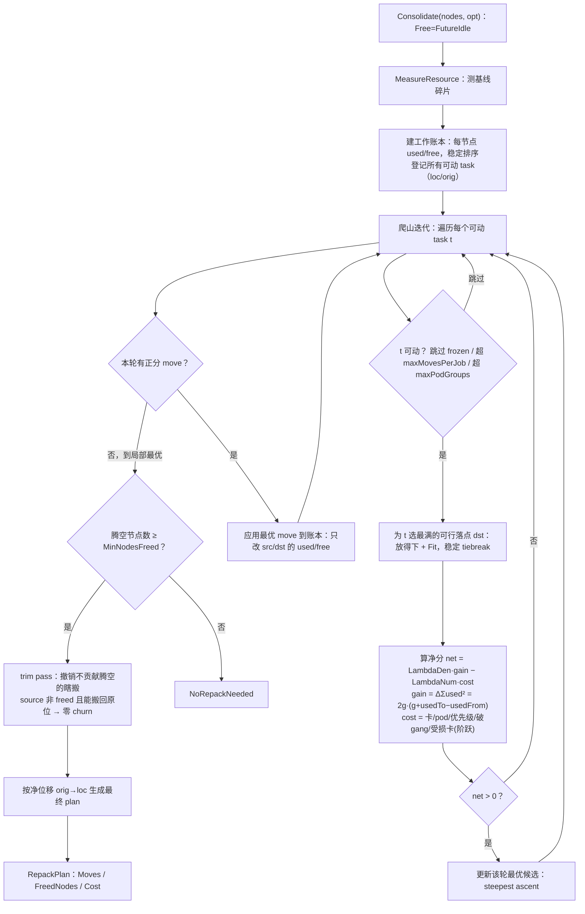
```mermaid
flowchart TD
    B0["Consolidate(nodes, opt)：Free=FutureIdle"] --> B1["MeasureResource：测基线碎片"]
    B1 --> B2["建工作账本：每节点 used/free，稳定排序<br/>登记所有可动 task（loc/orig）"]
    B2 --> B3["爬山迭代：遍历每个可动 task t"]
    B3 --> B4{"t 可动？ 跳过 frozen / 超 maxMovesPerJob / 超 maxPodGroups"}
    B4 -- 跳过 --> B3
    B4 -- 是 --> B5["为 t 选最满的可行落点 dst：放得下 + Fit，稳定 tiebreak"]
    B5 --> B6["算净分 net = LambdaDen·gain − LambdaNum·cost<br/>gain = ΔΣused² = 2g·(g+usedTo−usedFrom)<br/>cost = 卡/pod/优先级/破gang/受损卡(阶跃)"]
    B6 --> B7{"net > 0？"}
    B7 -- 否 --> B3
    B7 -- 是 --> B8["更新该轮最优候选：steepest ascent"]
    B8 --> B3
    B3 --> B9{"本轮有正分 move？"}
    B9 -- 是 --> B10["应用最优 move 到账本：只改 src/dst 的 used/free"]
    B10 --> B3
    B9 -- 否，到局部最优 --> B11{"腾空节点数 ≥ MinNodesFreed？"}
    B11 -- 否 --> B12["NoRepackNeeded"]
    B11 -- 是 --> B13["trim pass：撤销不贡献腾空的瞎搬<br/>source 非 freed 且能搬回原位 → 零 churn"]
    B13 --> B14["按净位移 orig→loc 生成最终 plan"]
    B14 --> B15["RepackPlan：Moves / FreedNodes / Cost"]
```

**③ 方案 A — 时序图**（CR → 引擎 → Session → planner → Statement）

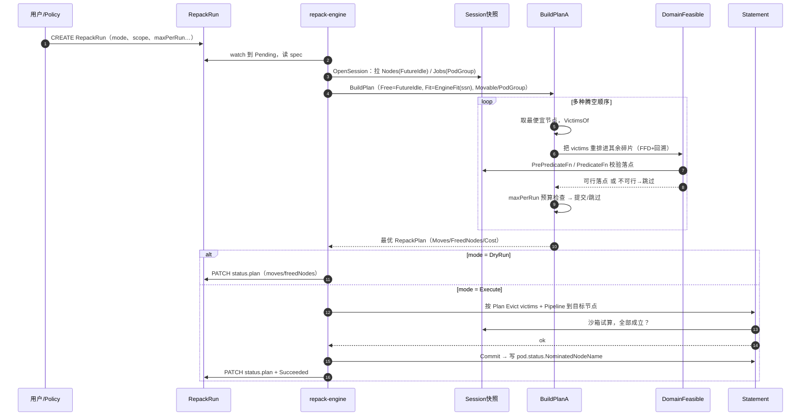
```mermaid
sequenceDiagram
    autonumber
    participant U as 用户/Policy
    participant R as RepackRun
    participant E as repack-engine
    participant S as Session快照
    participant O as BuildPlanA
    participant D as DomainFeasible
    participant St as Statement

    U->>R: CREATE RepackRun（mode、scope、maxPerRun…）
    E->>R: watch 到 Pending，读 spec
    E->>S: OpenSession：拉 Nodes(FutureIdle) / Jobs(PodGroup)
    E->>O: BuildPlan（Free=FutureIdle, Fit=EngineFit(ssn), Movable/PodGroup）
    loop 多种腾空顺序
        O->>O: 取最便宜节点，VictimsOf
        O->>D: 把 victims 重排进其余碎片（FFD+回溯）
        D->>S: PrePredicateFn / PredicateFn 校验落点
        D-->>O: 可行落点 或 不可行→跳过
        O->>O: maxPerRun 预算检查 → 提交/跳过
    end
    O-->>E: 最优 RepackPlan（Moves/FreedNodes/Cost）
    alt mode = DryRun
        E->>R: PATCH status.plan（moves/freedNodes）
    else mode = Execute
        E->>St: 按 Plan Evict victims + Pipeline 到目标节点
        St->>S: 沙箱试算，全部成立？
        St-->>E: ok
        E->>St: Commit → 写 pod.status.NominatedNodeName
        E->>R: PATCH status.plan + Succeeded
    end
```

**④ 方案 B — 时序图**（外层同 A，内层换爬山）

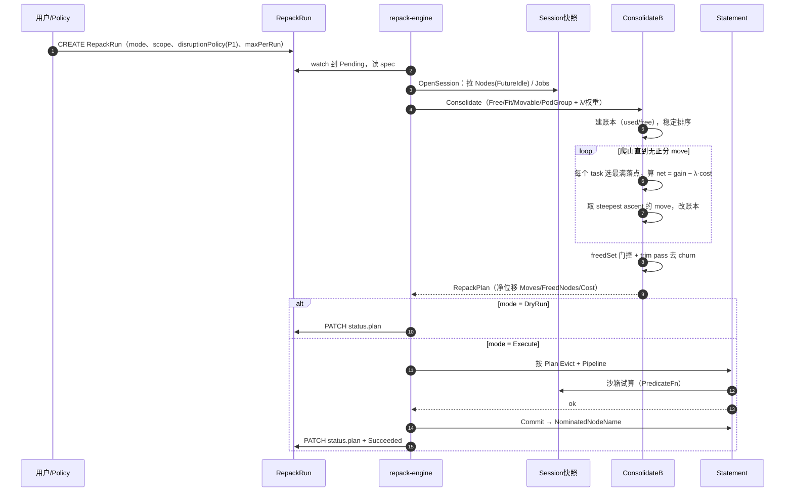
```mermaid
sequenceDiagram
    autonumber
    participant U as 用户/Policy
    participant R as RepackRun
    participant E as repack-engine
    participant S as Session快照
    participant C as ConsolidateB
    participant St as Statement

    U->>R: CREATE RepackRun（mode、scope、disruptionPolicy(P1)、maxPerRun）
    E->>R: watch 到 Pending，读 spec
    E->>S: OpenSession：拉 Nodes(FutureIdle) / Jobs
    E->>C: Consolidate（Free/Fit/Movable/PodGroup + λ/权重）
    C->>C: 建账本（used/free），稳定排序
    loop 爬山直到无正分 move
        C->>C: 每个 task 选最满落点，算 net = gain − λ·cost
        C->>C: 取 steepest ascent 的 move，改账本
    end
    C->>C: freedSet 门控 + trim pass 去 churn
    C-->>E: RepackPlan（净位移 Moves/FreedNodes/Cost）
    alt mode = DryRun
        E->>R: PATCH status.plan
    else mode = Execute
        E->>St: 按 Plan Evict + Pipeline
        St->>S: 沙箱试算（PredicateFn）
        St-->>E: ok
        E->>St: Commit → NominatedNodeName
        E->>R: PATCH status.plan + Succeeded
    end
```

> 两张时序图的 `alt mode` 段、Session/Statement 交互**逐字相同**——这正是 §4.17 的核心结论：**A、B 共享同一执行底座，可同一套引擎接线、按策略切换内层 planner**。

#### 4.17.1 两个方案一句话定性

- **方案 A · 节点腾空法（drain-anchored，§4.14.0）**：**自顶向下、以节点为决策单元**。按"腾空成本"挑节点，把负载搬进已有碎片，**整空才提交**。当前已实现于 `planner/drain`，场景策略由 Plugin 注入。
- **方案 B · 集中度法（势函数局部搜索，§4.14.6）**：**自底向上、以负载为决策单元**。从当前态出发，逐 Gang 挪到更满的节点，只走集中度上涨的步骤。该方案未实现，也未预留 Core 注册槽位。

> 深层关系：**A 是 B 的"批量特例"**——"腾空一个节点"就是集中度分数的一次大跳变。所以不是两个目标，是**同一目标的两种搜索范式**（构造 vs 局部搜索）。

#### 4.17.2 多维对比（核心表）

| 维度 | 方案 A · 节点腾空法 | 方案 B · 集中度法 |
|------|---------------------|-------------------|
| **决策单元 / 范式** | 节点；构造式贪心 | 负载(gang)；局部搜索(爬山) |
| **对 KPI** | **直达**——每次提交=一个整空节点 | 间接——靠 Σused² 代理 + "净腾空才提交"闸门 |
| **效果上限** | 受贪心定序限，偶尔卡局部最优 | **略高**——可逃 A 的部分局部最优(多节点协同) |
| **2 的幂同构场景实际差距** | — | **通常可忽略**(best-fit 近最优、局部最优罕见) |
| **扰动可控** | **天然有界**(只动被腾节点的负载) | 靠 λ 摩擦 + 闸门调，理论上能调出更优收益/扰动比 |
| **确定性** | **天然**(固定排序、单次扫描) | 需额外控制(稳定排序+严格涨分+整数)，可达 |
| **空转风险(thrashing)** | **无**(原子、不空转) | 有——**必须**加"只提交净腾空子集"闸门 |
| **可解释性(对外讲)** | 好("腾哪几个节点") | **最好**(单一"集中度分数"叙事，§4.14.6 讲解版) |
| **在线/增量整理** | 弱(批量重算) | **强**(集群一变只重判受影响负载) |
| **INV-RESCHED 复杂度** | 中(多 victim 协同重落) | **低**(单 gang 移动天然有家) |
| **实现状态** | **已实现 + 验证** | 设计完成，待编码 |

#### 4.17.3 收益性分析（效果 / ROI）

- **理论上限相同**：两者都被同一理论最优 `A` 卡住（最多腾 `B−A` 个节点，§4.12）。**A 不是算法选择能突破的**。
- **在目标场景(AI 负载 2 的幂、节点同构)**：divisible-chain 性质让 best-fit 近最优、局部最优极少——**两方案腾出的节点数通常相同**。这与"闭式 A 精确"同源（§4.12.2a）。差距主要出现在**非 2 的幂 / 异构**实例，那里两者都非最优、需更重搜索（P1）。
- **收益/扰动比**：A 扰动天生有界、收益直达，ROI 稳；B 可通过 λ 与权重**调出更高的收益/扰动比**，但需调参经验。
- **结论**：**纯"腾出节点数"维度，二者收益基本持平**；B 的收益优势体现在"可调"与"在线持续整理累积收益"，A 的收益优势体现在"零空转、每步必有收益"。

#### 4.17.4 实现复杂度对比

| | 方案 A | 方案 B |
|---|---|---|
| 代码量 | 已完成(~250 行核心 + 测试) | 相近或略多(待写) |
| 难点 | 主要难点在可调度性求解器——**已复用**(`schedulability.go`) | 单步净分统一、但**确定性 + 防 thrashing 闸门 + 平梯度**是易错点(设计已给解法) |
| 调参 | 几乎无(排序固定) | 需调 λ / 权重(配置化，§4.16.5) |
| 验证成本 | 低(已 Python 交叉验证 6 场景) | 中(需确定性测试 + 与 A 交叉对照) |
| 风险 | **低**(已落地、可预测) | 中(已知坑已设计解法，但需实现正确) |

#### 4.17.5 可演进性对比（**B 明显占优**）

- **方案 A**：加新策略(优先级/拓扑/成本)要塞进"victim 选择 + 节点排序 + 多候选择优"多个点，范式偏硬。
- **方案 B**：决策是**单一净分** `net = Σwᵍ·gainFn − λ·Σwᶜ·costFn`。加任何新维度 = **注册一个打分函数 + 配权重**（§4.16.5），不碰主循环；且：
  - 天然支持**在线/增量**整理；
  - 未来 **P1 relief**(解开 pending)可作为**一个 gain 项**接进同一爬山，无需第二套算法；
  - 多目标(碳/成本/拓扑亲和)都是"再加一项"。
- **结论**：B 的"统一插件化净分"在长期演进上显著更优。

#### 4.17.6 风险与适用场景

| | 适合选 A | 适合选 B |
|---|---|---|
| 整理节奏 | 批量、周期性 | **持续 / 在线** |
| 团队取向 | 要"快、稳、可预测、已落地" | 要"统一、可讲、可调、长期演进" |
| 策略变更频率 | 低 | **高**(频繁调权重达不同效果) |
| 评审通过难度 | **低**(已实现、风险小) | 中(需认可势函数 + 调参) |

#### 4.17.7 选型建议（三条路线，供评审抉择）

1. **路线一：只上 A（最快、最稳）**。P0 直接用已实现的 drain-anchored，风险最低、最易评审通过、快速见效。代价：可演进性/在线性弱，后续加策略略硬。
2. **路线二：只上 B（最统一、最可演进）**。集中度作主算法，A 退为可选 fallback。一个能讲清、能调权重的算法贯穿始终，长期最省心。代价：需编码 + 调参，有已知坑（设计已给解法）。
3. **路线三：A 作基线 + B 作精修 pass（最稳健、上限最高）**。先 A 出安全解，再 B 爬山精修，"只采纳净增空节点"。鲁棒性与上限最好，代价是两套都要维护。

> **倾向性建议**（非定论，交评审）：若目标是**P0 快速落地见效 / 大规模商用且重运维**，选**路线一**（A 已就绪，运维友好见 §4.17.9）；若团队更看重**统一、可演进、可在线持续整理**，选**路线二**（B 为主）。两者收益在目标场景基本持平，**抉择点是"快速稳妥+可运维" vs "统一可演进"的团队权重**，而非"谁腾的节点多"。路线三适合对效果上限和鲁棒性要求最高、且能接受双实现成本的场景。

#### 4.17.8 复杂度与性能（大规模集群）

记 **N**=域内节点数，**P**=可动 pod 数（≈C·N，C=每节点 pod 数，常数），**R**=实际搬迁步数（≈O(P)）。

| 维度 | 方案 A（drain，`core/drain/drain.go`，已实现） | 方案 B（集中度，未实现） |
|------|-----------------------------------|------------------------------------|
| **核心计算** | 3 排序 × 逐节点 drain，每候选 O(N) 建域 + Feasible → **O(N²)** | steepest-ascent 每步全扫 P×N，共 R 步 → **O(P²·N)=O(C²·N³)** |
| **最坏情况** | Feasible 回溯**理论指数**（对抗性非 2 幂），常态 ≈O(1) | **纯多项式、无指数爆炸**，但次数高 |
| **内存/分配** | 每候选克隆账本 → **O(N²) 次 `Resource` 分配**（GC 压力，A 的短板） | 账本**原地改**，全程 O(N) 分配（GC 友好） |
| **终止** | 单遍 ×3，步数确定有界 | 迭代到局部最优，R 步（Φ 单调有界保证终止） |
| **增量/在线** | 不支持，全量重算 | **天然增量**（集群一变只重判受影响 pod） |

**实测增长形状**（Python 原型、碎片化半满集群；Go 绝对值约快 50–100×，看**斜率**）：

| N | pods | A | B | B/A |
|---|------|-----|-----|-----|
| 50 | 108 | 0.3ms | 10ms | 37× |
| 100 | 223 | 0.7ms | 97ms | 136× |
| 200 | 479 | 2.2ms | 647ms | 298× |
| 400 | 929 | 9.1ms | 5.5s | 602× |

A≈O(N²)，B（朴素）≈O(N³)，B/A 每翻倍再 ×2。

**优化路径（都非根本性墙）**：
- **B → 增量重评分 + 最大堆**：一次 move 仅改 2 节点，只重算其上及"以它们为最佳落点"的 pod（O(C) 个）+ 堆 O(log P)，把 B 从 O(N³) 降到 **≈O(R·N) 甚至 O(R·log P)**，追平/优于 A（势博弈 best-response 标准加速）。
- **A → 账本 save/recover 复用**替代每候选克隆，把 O(N²) 分配降到 O(N)。
- 两者均加 `MaxIters`/`maxPerRun` 兜底。

**实践判断**：repack 是**离线/周期**任务、且按**节点池/HyperNode 域分片**跑，N 通常几百~一两千 → **两者 Go 里都 sub-second**。仅"整集群 1 万+ 单次跑"时：A 原型可撑（O(N²)，注意 GC），**B 朴素原型到分钟级、需先做增量优化**。

#### 4.17.9 可运维性与可定位性（大规模商用，**A 更优**）

| 运维维度 | 方案 A（节点腾空） | 方案 B（集中度） |
|------|--------------------|------------------|
| **单步"为什么"** | 自明：每个 move 挂在"为腾空节点 X" | 抽象："这步让集中度分 +Δ"，因果间接 |
| **SRE 心智模型** | **直接对应 cordon/drain**（现成肌肉记忆） | "为涨分搬 pod"，无对应运维动作 |
| **故障定位** | 决策点少、按"腾哪个节点"线性可追 | 决策点多（R 步爬山），需回放轨迹复盘 |
| **故障半径** | 原子、按节点有界；报表天然"将腾空 X" | move 散在全集群，靠预算+trim 收口，较弥散 |
| **配置面/误配** | 几乎无旋钮，难配错 | λ+多权重+阈值，灵活但多团队多集群下误配风险高 |
| **变更管理** | 批量、可排进维护窗口，契合变更冻结 | 天生在线/持续，后台漂移不易排进窗口 |
| **报表/审计** | 节点视角，"将腾空 N3/N4"直接可签核 | 扁平 move 列表+分数，"腾哪些"需派生 |

**结论**：**一线可运维、可定位性 A 显著更好**——动作单元（节点）即运维动作单元（cordon/drain），每个 move 自带"为腾哪个节点"的理由，零配置、故障半径有界、契合维护窗口。B 的运维优势是**平台级**的（统一打分易讲、按集群调权重不改代码、在线增量），更利于平台团队，但抽象分数+大配置面+弥散 churn 对一线 SRE 是负担。

> **商用倾向**：**P0 大规模商用、重运维 → 选 A**（路线一）；**B 留作 P1 演进引擎**，待平台侧可观测/权重治理/回放调试工具成熟后，再评估切换或"A 可见提交 + B 内部精修"的混合（路线三）。

---

### 4.18 可靠性、并发与可维护性设计

> repack-engine 是一个**单活（leader-elected）+ 单 worker + 事件驱动**的迷你控制器,和 volcano-scheduler 共享 cache/插件、和 repack-controller 共写同一个 RepackRun。本节把这套的**失败模型、并发不变量、崩溃恢复、可观测性、优雅退出、测试策略**成文,作为后续维护的契约。

#### 4.18.1 并发模型与不变量（务必维护）

| 不变量 | 保证机制 | 破坏后果 |
|--------|----------|----------|
| **全局至多一个活跃引擎** | leader election（Lease，`RunOrDie`；失去租约 `klog.Fatalf` 退出让位） | 多写、双执行 |
| **一次至多处理一个 Run** | 单 worker（一个 goroutine `for processNext`）,`process()` 同步阻塞 | 并发 session、cache 竞争 |
| **Execute 全局 K=1 串行** | `executeGateState` = 内存态(`execActive`/`lastExecFinish`,mutex 保护) OR-合并 cache 扫描;**权威、不依赖 informer 新鲜度**,故 Workers 若>1 也安全 | 两个 Execute 同时驱逐 |
| **DryRun 不占 Execute 槽** | gate 对非 Execute 直接 `Admit`;但单 worker 下仍与 Execute **串行**(不并发,§4.5) | — |
| **引擎不写 PodGroup/Queue 状态** | `CloseSessionReadOnly`(跳过 gang OnSessionClose / JobUpdater / updateQueueStatus) | 与 scheduler 抢写、条件抖动 |
| **引擎与 controller 不互相 clobber 生命周期字段** | `stampLifecycle` 对 `StartTime`/`CompletionTime` **nil-guard**,谁先到谁写 | TTL/cooldown 锚点错乱 |
| **目标资源必为异构卡** | CEL(`goals[0].resource` 含 `/`) + 运行时 `supportedTarget` 兜底 | 静默 NoFragmentation 假成功 |

> **并发升级路径**：当前单 worker。若未来要让 DryRun 与 Execute **真并发**,需把 worker 数调>1——gate 已按并发安全设计,但要先验证并发多个 `schedframework.OpenSession` 读同一 cache 的安全性(只读规划,大概率安全,未验证)。

#### 4.18.2 失败模型与崩溃恢复

| 失败场景 | 处理 |
|----------|------|
| **单个 Run 处理 panic**（插件/快照 bug） | `reconcileSafely` 每 work-item `recover`,转成 error,打栈;`process` 的 defer(放 K=1 槽/关 session)在 unwind 时照常执行——**一个坏 Run 不拖垮引擎** |
| **Run 永久失败**（毒丸） | workqueue 重试 `maxReconcileRetries`(5) 次后放弃，标 `Failed`（reason `ReconcileFailed`），不无限重试 |
| **引擎崩溃在 Execute 中途**（已发部分驱逐、未写终态） | 重启后 `recoverOrphans` 把无法安全继续的残留 `Running` Run 标 `Failed`（reason `ExecutionInterrupted`）——**保守、不盲目重发驱逐**；已持久化的逐 Pod 进度用于恢复或诊断 |
| **终态写丢失**（冲突/重启） | `updateStatusTerminal` 用 `RetryOnConflict` 重读重写;彻底失败也有 `recoverOrphans` 兜底 |
| **被 K=1 挡住的 Execute 饿死** | Execute 释放槽时 `requeueGatedRuns` 重新入队所有未终态 Execute(事件驱动唤醒,不靠轮询) |
| **cooldown 锚点被 TTL GC 提前删** | controller 的 `CooldownRetained`:终态 Execute 在 `completionTime+cooldown` 前不删 |
| **watch 掉线漏事件** | `--resync-period`(默认 10m)安全网 relist;`requeueGatedRuns` 覆盖 gate 唤醒 |
| **全局 `ServerOpts` 未初始化** | `NewEngine` 起始自初始化(sharding 关闭)+ cmd `ensureSchedulerServerOpts` 双保险 |

#### 4.18.3 可观测性

- **Conditions（权威状态面）**:`Progressing`/`Complete`/`Failed` + reason；`phase` 为派生投影。
- **Prometheus 指标**（`/metrics`,`pkg/repackengine/metrics`）:`volcano_repack_runs_total{mode,outcome}`、`_evictions_total{result}`、`_cycle_duration_seconds{mode}`、`_gate_rejections_total{reason}`。
- **Kubernetes 事件**:每个 Run 到终态时在其对象上打事件(Normal/Warning + reason),便于 `kubectl describe` 定位。
- **健康探针**:`/healthz`(liveness);Deployment 配 livenessProbe,K8s 可重启卡死实例。
- **结构化日志（分级约定，面向人工运维/定位）**:klog,统一走结构化 `InfoS`(带 `run`/`mode`/`outcome` 等键值),panic 带完整栈。**级别约定**——
  - **Error/Warning**:始终打印,真实失败与配置错误(load conf 失败、写状态失败、panic、未知 plugin/action)。
  - **V(3) 运维叙事(默认开,`--v=3`)**:每个 Run 的"故事"——引擎启停、被 gate 推迟(带 reason)、plan 算出(freedNodes/movedCards/frag 前后%)、发出驱逐(evicted/rejected)、Run 终态(outcome)、孤儿恢复、GC 删除、提名写入。看默认日志即可跟踪一个 Run 全过程。
  - **V(4) 排障细节**:reconcile 进入、抢到 execute 槽、重试次数、gated 唤醒数、cooldown 保留。
  - **V(5) 深度调试**:gate 内部态、无匹配/跳过决策、逐项细节。

#### 4.18.4 优雅退出

`signals.SetupSignalContext()` → ctx;`Run` 里 `defer queue.ShutDown()`,worker 在队列关闭后退出。**注意(已知不足)**:`reconcile` 目前忽略 ctx、`process` 用 `context.Background()` 做 API 调用,长驱逐不会被退出信号取消——退出时靠 worker 循环自然收尾。P1 可把 ctx 透传进 process 以支持中途取消。

#### 4.18.5 测试策略

- **基础功能单测**:碎片度量(`MeasureResource`/`OptimalNodes`,含暴力最优交叉校验)、可行性求解(`Feasible`,含暴力交叉校验)、drain 核心(10+ 场景)、scope 解析、状态机(`DerivePhase`/`IsTerminal`/`EvaluateGate`/`CooldownRetained`/`TTLExpired`)、约束闸(`PlanAdmissible`)、状态渲染(`movesOf`/`summaryOf`/`nominationsOf`/`applyPlan`/`pct`/`terminalOutcome`)、spec 翻译(`resolveResource`/`maxPerRun`/`minFragImprovement`)、调度需求摘要归一化，以及提名匹配（已有 replacement UID、`victimPodName`、`schedulingRequirementsHash`、同构 PodGroup 兜底、过期/已绑定/跨 namespace 等分支）、扰动评分。
- **边界场景**:nil/空 plan、多 pod 分散跨节点的 gang、`pct` 越界钳制、系统 DaemonSet pod 不阻塞腾空、frozen 节点、预算封顶、非同构容量、无目标资源快速失败。
- **可靠性/并发**:K=1 gate 内存态并发压测(`TestExecuteGateState_ConcurrentAccess`,配 `-race`)、饥饿唤醒(`requeueGatedRuns`)、构造/启动不 panic(含 nil `ServerOpts`)。
- **性能(核心算法基准)**:`BenchmarkOptimalNodes`(碎片打包界)、`BenchmarkFeasible`(INV-RESCHED 回溯求解)、`BenchmarkDrain`(端到端,25/100/250 节点规模)。
- **e2e**:DryRun 跑到终态 + CEL 拒 cpu(`test/e2e/repack`)。
- **待补(P1)**:崩溃恢复(recoverOrphans)、毒丸放弃、controller GC reconcile 的驱动级测试(需 fake clientset)。

---

## 5. 模块架构（框架图 & 时序图）

> **本章图已对齐定稿（v10.0）**：准入=CEL（apiserver），**无控制器 Admit / 「Admit PATCH 补全」**；RepackPolicy 为纯模板生成（`runTemplate` 内嵌 RepackRunSpec、按 `trigger` 生成 Run）。控制器职责=TTL/RunGC + 提名 reconciler（+ P1 Policy 生成 Run）。权威口径见 §3.3。

> v9 交互主路径见 **§4.3、§4.7**。**部署定稿**：Repack 以 **独立常驻容器**（`volcano-repack-engine`）运行，与 **volcano-scheduler 分开部署**；主调度器 **不 watch Repack CR**。

> 跨进程契约：**`RepackRun`**（API Server 握手）；`volcano-repack-engine` 与 `volcano-controller` **不直连**。

### 5.1 独立部署：集群进程与 CR 交互（定稿）

#### 5.1.1 部署框架图

**读图顺序**：自上而下四层直线——**用户 → API → 资源对象 → 三个 Deployment**；同一列上下直连，**无 subgraph 嵌套、无斜向跨层连线**。进程间 **无 RPC**。

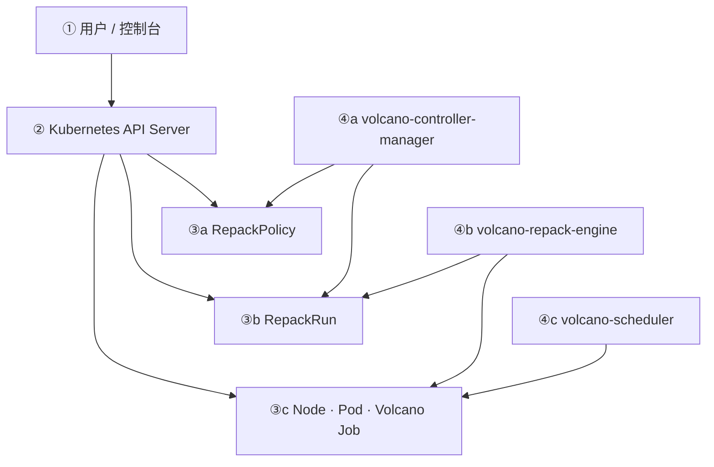
```mermaid
flowchart TB
    USER["① 用户 / 控制台"]

    API["② Kubernetes API Server"]

    RP["③a RepackPolicy"]
    RR["③b RepackRun"]
    OBJ["③c Node · Pod · Volcano Job"]

    CTRL["④a volcano-controller-manager"]
    REPACK["④b volcano-repack-engine"]
    SCHED["④c volcano-scheduler"]

    USER --> API
    API --> RP
    API --> RR
    API --> OBJ

    RP ~~~ RR ~~~ OBJ
    CTRL ~~~ REPACK ~~~ SCHED

    CTRL --> RP
    CTRL --> RR
    REPACK --> RR
    REPACK --> OBJ
    SCHED --> OBJ
```

```text
列对齐（与上图一致）：
  左列：controller-manager     ──↑──  RepackPolicy + RepackRun
  中列：volcano-repack-engine ──↑──  RepackRun only（✗ RepackPolicy）+ 集群对象
  右列：volcano-scheduler      ──↑──  集群对象 only（✗ 一切 Repack CR）
```

**各 Deployment 职责（对照上图）**：

| Deployment | 连哪些 API 对象 | 做什么 |
|------------|----------------|--------|
| **volcano-controller-manager** | RepackPolicy、RepackRun、Pod/PodGroup | P1 触发 CREATE、RunGC；替身认领、placement gate、提名和绑定观察 |
| **volcano-repack-engine** | RepackRun、PodGroup、Pod/Node/Job | 认领 Run、规划、写 lifecycle/plan/result/eviction/选点；Execute 时写 lease 并调用 Eviction API；建议 **Leader 单活** |
| **volcano-scheduler** | Node/Pod/Job（**不碰 Repack CR**） | 正常 allocate；驱逐后重排落子 |

**Execute 落子链**（仅 Execute；与上图 **④b→③b→④c** 对应，单列直线）：

```text
repack-engine 持久化 plan/relocations + PodGroup lease → Eviction API
            → replacement Pod 被 webhook gate → controller 认领替身
            → repack-engine 实时选择 selectedNodeName
            → controller patch nominatedNodeName 并解除 gate
            → volcano-scheduler bind → controller 记录 actualNodeName
            → repack-engine 验证计划腾空节点并写 Run.result
```

#### 5.1.2 CR 读写矩阵（跨进程）

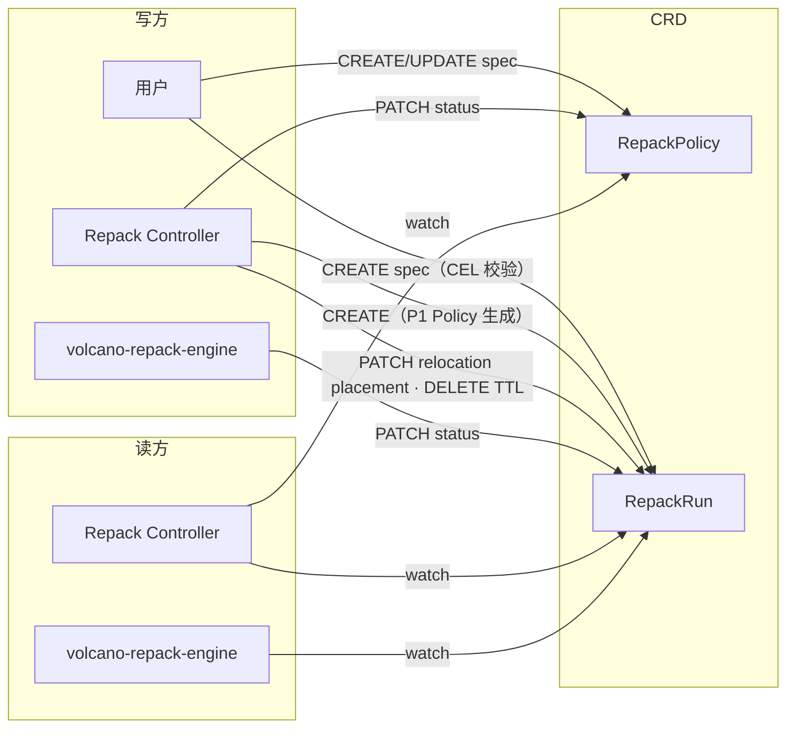
```mermaid
flowchart LR
    subgraph Writers["写方"]
        U2[用户]
        RC2[Repack Controller]
        VR2[volcano-repack-engine]
    end

    subgraph CR["CRD"]
        RP2[RepackPolicy]
        RR2[RepackRun]
    end

    subgraph Readers["读方"]
        RC3[Repack Controller]
        VR3[volcano-repack-engine]
    end

    U2 -->|CREATE/UPDATE spec| RP2
    U2 -->|CREATE spec（CEL 校验）| RR2
    RC2 -->|CREATE（P1 Policy 生成）| RR2
    RC2 -->|PATCH status| RP2
    RC2 -->|PATCH relocation placement · DELETE TTL| RR2
    VR2 -->|PATCH status| RR2

    RC3 -->|watch| RP2
    RC3 -->|watch| RR2
    VR3 -->|watch| RR2
```

| 资源 / 字段 | 用户 | Repack Controller | volcano-repack-engine | volcano-scheduler |
|-------------|------|-------------------|----------------|-------------------|
| **RepackPolicy.spec** | R/W | R（触发生成 Run，P1） | — | — |
| **RepackPolicy.status** | R | W | — | — |
| **RepackRun.spec** | **C only**（❌ UPDATE，CEL 冻结） | C（P1 Policy 生成，不改 spec） | R | — |
| **RepackRun.status** | R（❌ UPDATE） | W（relocations placement）· R（GC） | W（lifecycle/plan/result/eviction/选点） | — |
| **DELETE RepackRun** | ✅（取消） | ✅（TTL/history） | — | — |
| **Pod Eviction** | — | — | W（Execute） | R（感知 Pod 变化） |

#### 5.1.3 CR 握手时序（Policy → Run → 独立 Repack 容器）

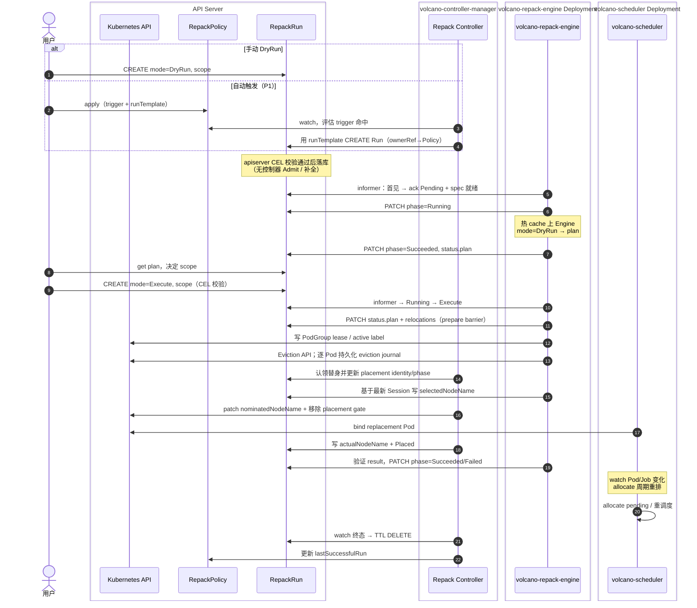
```mermaid
sequenceDiagram
    autonumber
    actor User as 用户
    box API Server
        participant K as Kubernetes API
        participant P as RepackPolicy
        participant R as RepackRun
    end
    box volcano-controller-manager
        participant C as Repack Controller
    end
    box volcano-repack-engine Deployment
        participant V as volcano-repack-engine
    end
    box volcano-scheduler Deployment
        participant S as volcano-scheduler
    end

    alt 手动 DryRun
        User->>R: CREATE mode=DryRun, scope
    else 自动触发（P1）
        User->>P: apply（trigger + runTemplate）
        C->>P: watch，评估 trigger 命中
        C->>R: 用 runTemplate CREATE Run（ownerRef→Policy）
    end
    Note over R: apiserver CEL 校验通过后落库<br/>（无控制器 Admit / 补全）

    V->>R: informer：首见 → ack Pending + spec 就绪
    V->>R: PATCH phase=Running
    Note over V: 热 cache 上 Engine<br/>mode=DryRun → plan
    V->>R: PATCH phase=Succeeded, status.plan

    User->>R: get plan，决定 scope
    User->>R: CREATE mode=Execute, scope（CEL 校验）
    V->>R: informer → Running → Execute
    V->>R: PATCH status.plan + relocations（prepare barrier）
    V->>K: 写 PodGroup lease / active label
    V->>K: Eviction API；逐 Pod 持久化 eviction journal
    C->>R: 认领替身并更新 placement identity/phase
    V->>R: 基于最新 Session 写 selectedNodeName
    C->>K: patch nominatedNodeName + 移除 placement gate
    S->>K: bind replacement Pod
    C->>R: 写 actualNodeName + Placed
    V->>R: 验证 result，PATCH phase=Succeeded/Failed

    Note over S: watch Pod/Job 变化<br/>allocate 周期重排
    S->>S: allocate pending / 重调度

    C->>R: watch 终态 → TTL DELETE
    C->>P: 更新 lastSuccessfulRun
```

**与主调度器的边界**：`volcano-repack-engine` 负责 **规划 + 驱逐**；Pod 删掉后的 **绑定与放置** 仍由 **volcano-scheduler** 的既有路径完成，Repack 不替代 allocate。

#### 5.1.4 为何独立容器仍用 RepackRun（而非 Job）

```text
volcano-repack-engine Deployment（常驻）
  └── informer 持续同步 → 热 cache（不随任务重建）
        └── 每来一条 RepackRun → 在现有 snapshot 上跑一轮
              （若用 K8s Job 每任务起 Pod，会反复冷启动 cache，apiserver 压力大）
```

---

### 5.2 逻辑分层图（模块依赖）

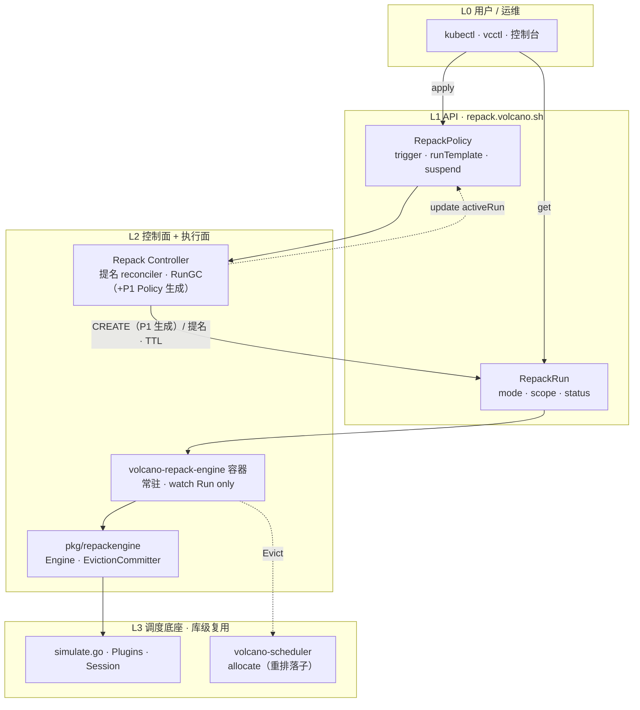
```mermaid
flowchart TB
    subgraph L0["L0 用户 / 运维"]
        U["kubectl · vcctl · 控制台"]
    end

    subgraph L1["L1 API · repack.volcano.sh"]
        RP["RepackPolicy<br/>trigger · runTemplate · suspend"]
        RR["RepackRun<br/>mode · scope · status"]
    end

    subgraph L2["L2 控制面 + 执行面"]
        CTRL["Repack Controller<br/>提名 reconciler · RunGC（+P1 Policy 生成）"]
        VR["volcano-repack-engine 容器<br/>常驻 · watch Run only"]
        LIB["pkg/repackengine<br/>Engine · EvictionCommitter"]
    end

    subgraph L3["L3 调度底座 · 库级复用"]
        BASE["simulate.go · Plugins · Session"]
        VS["volcano-scheduler<br/>allocate（重排落子）"]
    end

    U -->|apply| RP
    U -->|get| RR
    RP --> CTRL
    CTRL -->|CREATE（P1 生成）/ 提名 · TTL| RR
    CTRL -.->|update activeRun| RP
    RR --> VR
    VR --> LIB
    LIB --> BASE
    VR -.->|Evict| VS
```

**分层说明**：

| 层 | 组件 | 职责 |
|----|------|------|
| **L0** | 人 / 平台 | 配置 Policy；创建/查看 Run |
| **L1** | CRD | Policy = 长期规则；Run = 一次性工单 + status |
| **L2** | Controller | 触发生成 Run（P1）/ 提名 / GC（准入=CEL，无 Admit） |
| **L2** | **volcano-repack-engine** | 常驻执行；**只读 Run.spec** |
| **L3** | 核心库 + 主 scheduler | 模拟复用库；**落子 = Eviction + allocate** |

### 5.3 Controller ↔ volcano-repack-engine ↔ CRD（重点）

> **Controller 与 volcano-repack-engine 不直连**；通过 API Server 上的 **`RepackRun`** 握手。  
> **`RepackPolicy` 仅 Controller 消费**；**volcano-scheduler 不消费 Repack CR**。

#### 5.3.1 谁 Watch 谁、谁写谁（独立部署）

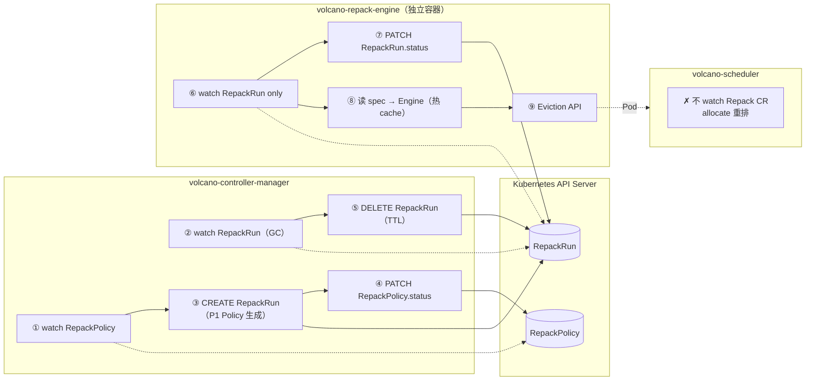
```mermaid
flowchart LR
    subgraph CM["volcano-controller-manager"]
        direction TB
        CM1["① watch RepackPolicy"]
        CM2["② watch RepackRun（GC）"]
        CM3["③ CREATE RepackRun（P1 Policy 生成）"]
        CM4["④ PATCH RepackPolicy.status"]
        CM5["⑤ DELETE RepackRun（TTL）"]
        CM1 --> CM3
        CM3 --> CM4
        CM2 --> CM5
    end

    subgraph API["Kubernetes API Server"]
        direction TB
        RP[("RepackPolicy")]
        RR[("RepackRun")]
    end

    subgraph VR["volcano-repack-engine（独立容器）"]
        direction TB
        VR1["⑥ watch RepackRun only"]
        VR2["⑦ PATCH RepackRun.status"]
        VR3["⑧ 读 spec → Engine（热 cache）"]
        VR4["⑨ Eviction API"]
        VR1 --> VR2
        VR1 --> VR3
        VR3 --> VR4
    end

    subgraph VS["volcano-scheduler"]
        VS0["✗ 不 watch Repack CR<br/>allocate 重排"]
    end

    CM1 -.-> RP
    CM2 -.-> RR
    CM3 --> RR
    CM4 --> RP
    CM5 --> RR
    VR1 -.-> RR
    VR2 --> RR
    VR4 -.->|Pod| VS
```

#### 5.3.2 读写矩阵

| 资源 / 字段 | volcano-controller | volcano-repack-engine | volcano-scheduler |
|-------------|-------------------|----------------|-------------------|
| **RepackPolicy.spec** | ✅ watch + 读 | ❌ | ❌ |
| **RepackPolicy.status** | ✅ 写 | ❌ | ❌ |
| **RepackRun.spec** | ✅ CREATE（P1 Policy 生成，不改 spec；CEL 冻结） | ✅ 只读 | ❌ |
| **RepackRun.status** | ✅ 写 relocation placement；读终态做 GC | ✅ 写 lifecycle/plan/result/eviction/选点 | ❌ |
| **Pod Eviction** | ❌ | ✅ Execute 时 | ❌（仅感知 Pod 变化） |
| **allocate 重排** | ❌ | ❌ | ✅ |

> **用户**：对 RepackRun **仅 CREATE / READ / DELETE**；**禁止 UPDATE** spec/status（§4.5.4）。

**握手规则**：

1. 准入=CEL（apiserver）：非法对象创建期拒绝、不落库；P1 由 Policy 用 `runTemplate` CREATE Run。无控制器 Admit / 无 `Admitted`。
2. **volcano-repack-engine**：首见 Run ack `Pending` → `Running`；Execute 被 gate
   挡住时保持 `Pending` 并写 `Progressing=False`；写 plan/result/relocations →
   终态 `Complete`/`Failed`。
3. **volcano-scheduler**：不碰 Repack CR；驱逐后 **allocate** 重排。
4. 无 RPC；`volcano-repack-engine` 建议 **Leader 单活** + **Execute** 全局 **K=1**（DryRun 不计入，§4.5.5）。

> 完整时序见 **§5.1.3**；下图 §5.3.3 为简化版。

#### 5.3.3 跨进程时序（简化）

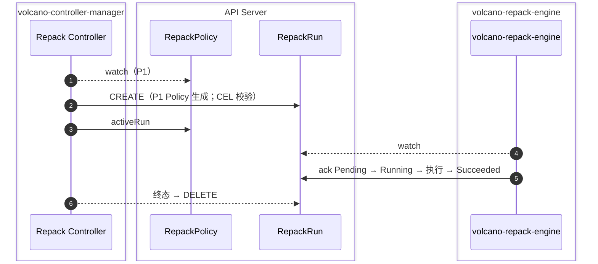
```mermaid
sequenceDiagram
    autonumber
    box volcano-controller-manager
        participant C as Repack Controller
    end
    box API Server
        participant P as RepackPolicy
        participant R as RepackRun
    end
    box volcano-repack-engine
        participant V as volcano-repack-engine
    end

    C-->>P: watch（P1）
    C->>R: CREATE（P1 Policy 生成；CEL 校验）
    C->>P: activeRun
    V-->>R: watch
    V->>R: ack Pending → Running → 执行 → Succeeded
    C-->>R: 终态 → DELETE
```

#### 5.3.4 常见误解

| 误解 | 实际 |
|------|------|
| Repack 与 scheduler 同进程 | **独立 `volcano-repack-engine` Deployment** |
| volcano-scheduler watch RepackRun | **否**；仅 allocate |
| Controller 调 volcano-repack-engine RPC | **否**；靠 Pending Run 触发 |
| 每 Run 起 Job Pod 重建 cache | **否**；常驻 informer + 热 cache |

### 5.4 组件依赖图

```mermaid
flowchart LR
    subgraph CRD["repack.volcano.sh"]
        RP[RepackPolicy]
        RR[RepackRun]
    end

    subgraph CM["controller-manager（P1 Policy · 提名 · GC）"]
        DET[Detector · trigger]
        GEN[生成 Run · P1]
        NOM[提名 reconciler]
        GC[RunGC / TTL]
    end

    subgraph LIB["pkg/repackengine"]
        FD[FragmentationDetector]
        ENG[Engine]
        EVC[EvictionCommitter]
        ENG --> EVC
    end

    subgraph VR["volcano-repack-engine 容器"]
        LOOP[worker loop]
    end

    subgraph VS["volcano-scheduler"]
        ALLOC[allocate]
    end

    subgraph BASE["共享库 · framework"]
        SIM[FeasibleRelocation]
        PLG[Plugins + HyperNode]
    end

    RP -->|watch| DET
    DET --> FD
    DET -->|hit| GEN
    GEN -->|CREATE runTemplate| RR
    GEN -->|activeRun| RP
    NOM -->|read/write relocations[].placement| RR
    GC -->|delete TTL| RR

    RR -->|watch| LOOP
    LOOP --> ENG
    ENG --> SIM
    ENG --> PLG
    EVC -->|Eviction API| ALLOC
    LOOP -->|patch status| RR

    FD -.->|P0-a 预检 API| CRD
```

### 5.5 Run 生成数据流（P1 Policy → Run；准入=CEL）

> **定稿（v10.0）**：准入=CEL（apiserver），**无控制器 Admit / 继承补全**。P1 的 RepackPolicy 是**纯模板生成**——`runTemplate.spec` 就是一份 `RepackRunSpec`，按 `trigger` CREATE Run，apiserver 的 CEL 在创建期校验；控制器不改 Run.spec。手动路径下用户直接 CREATE Run，同样只过 CEL。

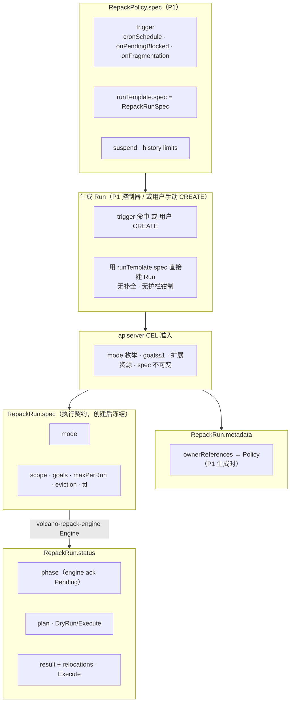
```mermaid
flowchart TB
    subgraph PolicySpec["RepackPolicy.spec（P1）"]
        P1[trigger<br/>cronSchedule · onPendingBlocked · onFragmentation]
        P2[runTemplate.spec = RepackRunSpec]
        P3[suspend · history limits]
    end

    subgraph Gen["生成 Run（P1 控制器 / 或用户手动 CREATE）"]
        G1[trigger 命中 或 用户 CREATE]
        G2[用 runTemplate.spec 直接建 Run<br/>无补全 · 无护栏钳制]
    end

    subgraph CEL["apiserver CEL 准入"]
        A1[mode 枚举 · goals≤1 · 扩展资源 · spec 不可变]
    end

    subgraph RunMeta["RepackRun.metadata"]
        M1[ownerReferences → Policy（P1 生成时）]
    end

    subgraph RunSpec["RepackRun.spec（执行契约，创建后冻结）"]
        R1[mode]
        R2[scope · goals · maxPerRun · eviction · ttl]
    end

    subgraph RunStatus["RepackRun.status"]
        S1[phase（engine ack Pending）]
        S2[plan · DryRun/Execute]
        S3[result + relocations · Execute]
    end

    PolicySpec --> Gen
    Gen --> CEL
    CEL --> RunMeta
    CEL --> RunSpec
    RunSpec -->|volcano-repack-engine Engine| RunStatus
```

### 5.6 时序图：P0 全链路（独立 volcano-repack-engine）

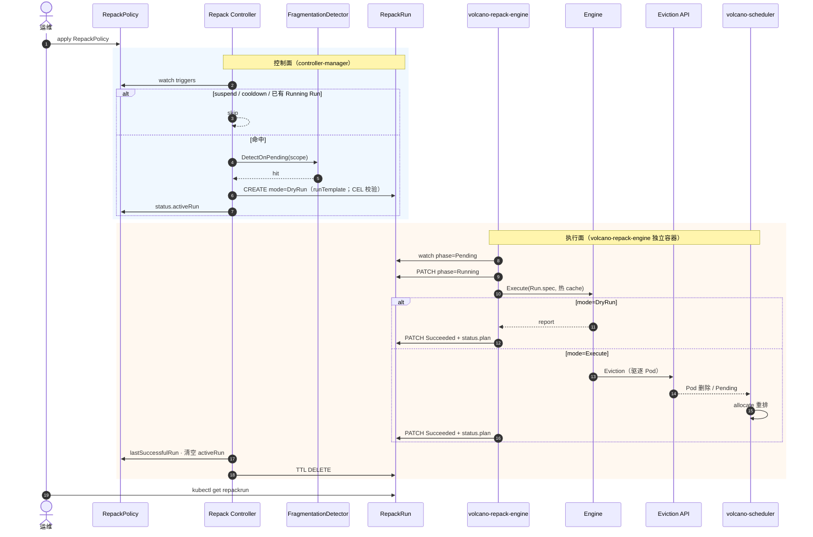
```mermaid
sequenceDiagram
    autonumber
    actor Ops as 运维
    participant Policy as RepackPolicy
    participant Ctrl as Repack Controller
    participant Det as FragmentationDetector
    participant Run as RepackRun
    participant VR as volcano-repack-engine
    participant Eng as Engine
    participant API as Eviction API
    participant VS as volcano-scheduler

    Ops->>Policy: apply RepackPolicy

    rect rgb(240, 248, 255)
        Note over Ctrl,Run: 控制面（controller-manager）
        Ctrl->>Policy: watch triggers
        alt suspend / cooldown / 已有 Running Run
            Ctrl-->>Ctrl: skip
        else 命中
            Ctrl->>Det: DetectOnPending(scope)
            Det-->>Ctrl: hit
            Ctrl->>Run: CREATE mode=DryRun（runTemplate；CEL 校验）
            Ctrl->>Policy: status.activeRun
        end
    end

    rect rgb(255, 248, 240)
        Note over VR,VS: 执行面（volcano-repack-engine 独立容器）
        VR->>Run: watch phase=Pending
        VR->>Run: PATCH phase=Running
        VR->>Eng: Execute(Run.spec, 热 cache)
        alt mode=DryRun
            Eng-->>VR: report
            VR->>Run: PATCH Succeeded + status.plan
        else mode=Execute
            Eng->>API: Eviction（驱逐 Pod）
            API-->>VS: Pod 删除 / Pending
            VS->>VS: allocate 重排
            VR->>Run: PATCH Succeeded + status.plan
        end
        Ctrl->>Policy: lastSuccessfulRun · 清空 activeRun
        Ctrl->>Run: TTL DELETE
    end

    Ops->>Run: kubectl get repackrun
```

### 5.7 时序图：Engine 内部（单轮 Execute）

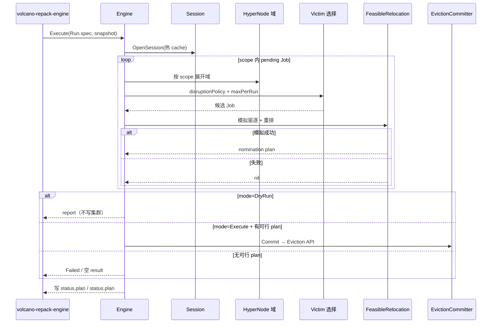
```mermaid
sequenceDiagram
    participant VR as volcano-repack-engine
    participant Eng as Engine
    participant SSN as Session
    participant Dom as HyperNode 域
    participant Vict as Victim 选择
    participant Sim as FeasibleRelocation
    participant EVC as EvictionCommitter

    VR->>Eng: Execute(Run.spec, snapshot)
    Eng->>SSN: OpenSession(热 cache)

    loop scope 内 pending Job
        Eng->>Dom: 按 scope 展开域
        Eng->>Vict: disruptionPolicy + maxPerRun
        Vict-->>Eng: 候选 Job
        Eng->>Sim: 模拟驱逐 + 重排
        alt 模拟成功
            Sim-->>Eng: nomination plan
        else 失败
            Sim-->>Eng: nil
        end
    end

    alt mode=DryRun
        Eng-->>VR: report（不写集群）
    else mode=Execute + 有可行 plan
        Eng->>EVC: Commit → Eviction API
    else 无可行 plan
        Eng-->>VR: Failed / 空 result
    end

    Eng-->>VR: 写 status.plan / status.plan
```

### 5.8 部署框架图（简版）

```mermaid
flowchart TB
    subgraph ETCD[(Kubernetes API / etcd)]
        RP[RepackPolicy]
        RR[RepackRun]
        JOB[Volcano Job / Pod / Node]
    end

    subgraph Deploy["定稿 · 独立容器"]
        CM[volcano-controller-manager]
        VR[volcano-repack-engine Deployment]
        VS[volcano-scheduler]
        CM --> RP
        CM --> RR
        VR --> RR
        VR -->|Evict| JOB
        VS --> JOB
    end

    CORE[pkg/repackengine]
    CM -.-> CORE
    VR -.-> CORE
    VS -.->|allocate only| CORE
```

| 组件 | 职责 | 与 Repack CR |
|------|------|--------------|
| **controller-manager** | P1 触发生成 Run / 提名 / GC（准入=CEL，无 Admit） | 读写在 Policy + Run |
| **volcano-repack-engine** | 常驻引擎 + 热 cache | **只** watch/write Run |
| **volcano-scheduler** | 正常调度 | **不** watch Repack CR |

> 详细框架图见 **§5.1.1**。

详见 [gpu-defragmentation-requirements.md](./gpu-defragmentation-requirements.md) §4.5。

### 5.9 模块职责速查

| 模块 | 路径 | 读 | 写 |
|------|------|----|----|
| Detector / trigger（P1） | `pkg/controllers/repack` | Policy | — |
| Run 生成（P1）| `pkg/controllers/repack` | Policy | CREATE Run（runTemplate） |
| 提名 reconciler | `pkg/controllers/repack` | Run.status.relocations | patch Pod nominatedNodeName |
| RunGC / TTL | `pkg/controllers/repack` | RepackRun | delete Run |
| volcano-repack-engine loop | `cmd/volcano-repack-engine` | RepackRun.spec | RepackRun.status |
| Engine | `pkg/repackengine` | RepackRun.spec | — |
| FragmentationDetector | `pkg/repackengine` | Session | — |

**边界**：Controller **不驱逐**；**volcano-repack-engine 不读 RepackPolicy**；**volcano-scheduler 不碰 Repack CR**。

---

## 6. API Review 与命名定稿（v5 历史 · 已废弃）

> 原 v5 的 API Review 评审理由与旧命名（`disruptionBudget` / `targets` /
> `automation` / `repackContext` / `policyRef` 等）已被 §4（场景驱动 API）
> + §12（已实现 API 索引）取代。命名演进脉络见 §15 修订记录。

## 7. RepackPolicy CRD（v5 历史 · 已废弃）

> 旧 RepackPolicy spec 已废弃。**P0 不含 Policy**；P1 Policy 的职责轮廓见 §4.4（不固化字段）。

## 8. RepackRun CRD（v5 历史 · 已废弃）

> 旧 RepackRun spec 与 Admit 规则已被取代：**当前字段见 §4.5 + §12**。
> 准入仅由 CRD marker/CEL 完成，不存在 P1 Admit 继承补全；生命周期见
> §4.5.3、§4.6.1。

## 9. 后续扩展

> 第一阶段 **不纠结多策略整合**，以下留作演进方向，避免阻塞主体能力（引擎 + 单 Policy + RepackRun）。

### 8.0 并发整理（放宽 K=1）

P0 为 **Execute 全局 K=1 + `executeCooldown`**（§4.5.5）。规划方向：

- `concurrency.maxConcurrentRuns > 1`，且仅允许 **scope 不相交** 的 Execute 并行（按节点池 / 不相交 Node 集），避免两条 Run 抢同一批 Node/Job。
- 冷静期从「全局」下沉到 **scope 维度**：每个节点池独立计时。
- Job 锁与 Node 锁升级为 **租约表 / 区间锁**，准入时校验候选域与在跑 Run 不相交。
- 仍保持 **DryRun 不占名额、不受冷静期约束**。

### 8.1 多 RepackPolicy 并存

- 平台护栏 CR + 各资源池 Initiator CR；`level` / `priority` 仲裁。
- Controller 合并 `disruptionBudget` → `RepackRun.repackContext`。
- 合并规则：protected* 并集、bundlePolicy 取严等（详见历史稿）。

### 8.2 系统级 RepackConfig

- 集群默认 `disruptionBudget` + `platformGuard`；Policy 仅写 targets 差异与加严项。

### 8.3 P0 已保留的并发语义

| 机制 | P0 行为 |
|------|---------|
| **`concurrency.maxConcurrentRuns`** | 固定 **1**：全局同时仅一个 `mode=Execute` 的 Run 处于 `Running`（K=1）；**DryRun 不计入** |
| **`concurrency.executeCooldown`** | 两次 **Execute** 之间的最小间隔（按上一条 Execute 的 `completionTime` 计），抑制集群持续动荡；**DryRun 不受约束** |
| **Job 锁** | Running Run 已选中的 Job，不得被新 Run 再选 |

**长期方向（规划）**：`maxConcurrentRuns` 放宽为「**scope 不相交即可并行**」——按节点池 / 不相交 Node 集允许多条 Execute 同时进行，冷静期也下沉到 scope 维度分别计时；K=1 仅作为 fallback。详见 §9「后续扩展」。

---

## 10. 配置示例

完整 YAML 见 **§4.4、§4.5、§4.8**。P0 最小路径：

1. `RepackPolicy`：配置 `scope` + `disruption` + `triggers`
2. `RepackRun` `mode=DryRun`：配置 `scope`（selector 或列表）
3. 阅读 `status.plan` 后，新建 `RepackRun` `mode=Execute`，填写 `scope`

---

## 11. 引擎对接（概念）

> **算法核心（碎片度量 / 收益门控 / 模拟匹配）见 §4A（§4.12～§4.14）**；本节仅列同构点与实现锚点。

### 10.1 与 gangpreempt 的同构点

| 步骤 | gangpreempt | Repack |
|------|-------------|--------|
| 驱动 | Job 饥饿、队列优先级 | 碎片 + pending（`triggers.onPending` / `relief.podGroupRefs`），按需/手动 |
| 搜索域 | HyperNode 梯度 | `scope` ∩ HyperNode 域（`GetCandidateDomains`） |
| 模拟 | `Statement` 沙箱（Evict/Pipeline，§4.14.1） | repack 自有：克隆 node + cycle-state、`SimulatePredicateFn` 做 INV-RESCHED victim 重落校验（§4.14.2） |
| 提交 | `Statement.Commit` | 克隆丢弃即回滚；达标经 Eviction 子资源落子，**外加收益门控**（§4.13） |
| 驱逐规则 | 插件 + 队列语义 | `disruptionPolicy.bundlePolicy`（→ Bundle 类型）+ `UnifiedEvictable` + `disruptionScore` |
| 提名 | `ApplySubJobNominations` | 同左 + 跨进程 `pod.status.NominatedNodeName`（§4.7.1） |

### 10.2 实现锚点

| 组件 | 路径 |
|------|------|
| Repack Controller（TTL） | `pkg/controllers/repack/` |
| Placement/Nominator + state | `staging/src/volcano.sh/repack-controller/pkg/` |
| **volcano-repack-engine** 入口 | `cmd/volcano-repack-engine` |
| 共享核心库 | `pkg/repackengine/`（Engine；与主 scheduler 库级复用） |
| 模拟计划 / 落点匹配 | `pkg/repackengine/adapter/snapshot_session.go::FeasibleRelocation`（克隆 node + cycle-state、`ssn.SimulatePredicateFn` 完整过滤栈；`api/schedulability.go::Domain.Feasible` 为仅单测复用的参考求解器） |
| 事务提交 / 回滚 | `pkg/scheduler/framework/statement.go`（`SaveOperations`/`RecoverOperations`/`Commit`/`Discard`） |
| Bundle 语义（SurplusPodsOnly/EntireJob） | `pkg/scheduler/actions/utils/bundle.go`（`BundleSafe`/`BundleWhole`） |
| victim 资格门控 | `framework`：`ssn.UnifiedEvictable` + 新增 `EvictionKindRepack`（`api/types.go`） |
| 候选域 / 提名 | `utils.GetCandidateDomains` / `utils.ApplySubJobNominations` |
| HyperNode 多层 | `api/hyper_node_info.go`（`hyperNodesSetByTier`/`realNodesSet`）；`ssn.HyperNodeGradientForSubJobFn` |
| 碎片度量 / 收益（新增） | `pkg/repackengine/`：`FragmentationDetector`（§4.12）+ 收益门控（§4.13） |
| 参考 action | `pkg/scheduler/actions/gangpreempt/gangpreempt.go` |
| Gang 设计 | [gang-aware-eviction-design.md](./gang-aware-eviction-design.md) |

### 10.3 部署形态（定稿）

| 进程 / Deployment | Watch 对象 | 说明 |
|-------------------|------------|------|
| **volcano-controller-manager**（+ repack controller） | `RepackPolicy`, `RepackRun`, Pod/PodGroup | P1 触发、RunGC、replacement placement 协调 |
| **`volcano-repack-engine`**（**独立 Pod**） | `RepackRun` + scheduler cache 对象；Execute 写 PodGroup lease/调用 Eviction API | DryRun/Execute 引擎、写 lifecycle/plan/result/eviction/选点 |
| **volcano-scheduler**（现网，**不扩展 Repack**） | Pod / Job / Node 等 | 正常调度；驱逐后 **allocate** 重排 |

一套核心库（`pkg/repackengine`）、**三个进程**（Controller / **volcano-repack-engine** / volcano-scheduler）；**跨进程契约是 `RepackRun`**。

---

## 12. 已实现 API 索引（单一事实来源）

P0 已落地后，本设计记录不再复制一份 Go 类型草图。重复定义曾导致
`relief`、`disruptionPolicy`、`profiles`、旧 phase 类型和旧 status 字段继续残留，
而实际 CRD 已不存在这些字段。

权威来源按优先级如下：

1. Go API：`staging/src/volcano.sh/apis/pkg/apis/repack/v1alpha1/repackrun_types.go`
2. 生成 schema：`config/crd/volcano/bases/repack.volcano.sh_repackruns.yaml`
3. 状态写入：`pkg/repackengine/status.go`、`pkg/repackengine/placement.go`、
   `pkg/repackengine/eviction.go`
4. lifecycle/condition：`staging/src/volcano.sh/repack-controller/pkg/state/state.go`
5. replacement placement：
   `staging/src/volcano.sh/repack-controller/pkg/nominate.go`

当前字段树：

```text
spec
├── mode: DryRun | Execute
├── scope
│   ├── podGroups.include/exclude.{selector,names}
│   └── nodes.include/exclude.{selector,names}
├── goals[]: {resource, minFragImprovementPercent}   # maxItems=1
├── maxPerRun: {podGroups, resources}
├── eviction: {gracePeriodSeconds}
└── ttlSecondsAfterFinished

status
├── phase / conditions / message / startTime / completionTime
├── plan: {summary, moves[], freedNodes[]}
├── result: {fragAfterPercent, freedNodeCount, freedNodes[],
│            movedCardCount, metricsVerified}
└── relocations[]
    ├── namespace / podGroupName / replacementPodGroupName
    ├── victimPodName / victimPodUID / schedulingRequirementsHash
    ├── plannedNodeName
    ├── eviction: {phase, message}
    └── placement: {phase, selectedNodeName, replacementPodName,
                    replacementPodUID, actualNodeName, expirationTime}
```

完整字段语义、双 journal 状态机、写入所有权和全字段 YAML 见
[proposal §5.2](./repack-runtime-defragmentation.md#52-repackrun-api)。P1 的
`RepackPolicy` 仍是后续能力，不得提前向当前 `RepackRunSpec` 添加占位字段。

## 13. 分阶段交付

> **CRD 分期（§3.3）**：P0 **只交付 `RepackRun`**（自洽、手动）；
> `RepackPolicy` 及其 trigger/template controller 整体在 **P1**。RepackRun
> 准入始终由 CRD marker/CEL 完成，没有 Controller Admit 阶段。

| 阶段 | 内容 | 与需求文档对应 |
|------|------|----------------|
| **P0-a** | 碎片度量 metrics（异构 GPU/NPU）+ 可调度性预检 | FR-1、FR-10 |
| **P0-b** | **`RepackRun` 单 CRD（自洽 spec）**；DryRun/Execute、scheduler-faithful 可行性、收益门控、Eviction API/PDB、replacement placement、Execute K=1 | FR-2、FR-3～5、FR-9 |
| **P0-c** | `status.plan`（两种 mode 同构）+ Execute `result/relocations` + Event；Run TTL 回收 | FR-6、FR-8 |
| **P1-a** | **`RepackPolicy` CRD**：纯模板生成（`trigger` + `runTemplate` 内嵌 RepackRunSpec + `suspend` + 扁平 history 上限）+ ownerReferences | FR-6 |
| **P1-b** | Policy `triggers.onPending` 自动建 DryRun（路径 B）；`approval`；per-policy `concurrency`/cooldown | FR-7 |
| **P1-c** | `triggers.schedule`/`fragRate`；路径 C 全自动 Execute；多级 HyperNode / 队列配额 / 最优成本 / 抗反复中断（§4.15） | FR-7 |
| **P2** | 多 Policy 合并、`RepackConfig` | 本文 §9 |

---

## 14. 开放问题

1. **Repack 与 gangpreempt 同周期互斥**：是否禁止同一 Session 内既抢占又 Repack？
2. ~~**谁认领 Run**~~ **已落地**：独立 `volcano-repack-engine` 通过进程内原子
   Execute 槽与已持久化 Run 扫描实现全局 K=1；scheduler 不认领 RepackRun。
3. ~~**收益函数默认值**~~ **P0 已落地**：可行计划还需满足
   `goals[0].minFragImprovementPercent` 与 `maxPerRun`；relief-driven 门控仍属 P1。
4. ~~**收益口径与 `WeightedFragRate` 对齐**~~ **已定稿（§4.12、§4.13）**：度量、收益、模拟共用同一可调度性检查（`Snapshot.FeasibleRelocation`），口径统一；待定：多维背包精度（P0 GPU 单维近似 → P1 全维）。
9. **目标画像冷启动**：`PendingAndDefault` 中 default 画像集如何取默认、是否随集群规格自适应（§4.12.1）。
10. **中断代价信号获取**：`disruptionScore` 依赖的运行时长 / checkpoint 友好度 / 恢复耗时，部分需业务侧注解配合（§4.13.3）。
11. **PDB 插件改造为上游前置**：§4.13.4 模拟期过滤依赖给 `pdb` 插件补注册 `UnifiedEvictableFn`——这是对 Volcano 主仓的改动（同时惠及 gangpreempt/gangreclaim），需作为独立 PR 推进；在其落地前 repack 仅靠执行期 Eviction 子资源兜底（功能正确但可能多一次"模拟通过却被 429"的浪费）。
12. **跨队列整理默认开关**：§4.15.2 `queueAware` 允许跨队列 victim，默认是否开放、是否需队列管理员授权，待评审（涉及多租户公平）。
13. ~~`(B−A)/M` vs `(B−A)/B` 主 KPI / A 下界紧度~~ **已定稿（§4.12.2a）**：主 KPI = **`(B−A)/M`**；在产品前提 **C1（GPU 申请为 2 的幂）+ C2（节点容量 2 的幂同构）+ C3（CPU/Mem 按比例供给）** 下，A 由 **O(n) 闭式精确求解**（整除链 → 体积下界即最优），"下界紧度"问题消解。剩余待定：C3 不成立（CPU/Mem 绑定）时的多维兜底是否够用、是否需对该类 Pod 单独建模。
14. **默认插件 vs 口径中立**：§4.16 默认 `FragmentScoreFn`=空节点口径；是否在核心库内置多套默认（节点整合 / 画像可调度）由配置择一，还是仅留接口由部署方提供，待评审。
5. **全局并发 K**：P0 定为 **Execute K=1 + `executeCooldown`**，DryRun 自由排队（§4.5.5 已定）；长期放宽为 scope 不相交并行（§9「后续扩展」§8.0）。剩余待定：冷静期默认值、放宽并发后 Job 锁与冷静期的 scope 维度计法。
6. **Run 快照变更**：Policy 更新后，进行中的 Run 是否允许热更新（建议：不允许）。
7. ~~**Job/Node 二维组合**~~ **已定稿（§4.5.2）**：维度内 selector∪names
   取并集，include 再减 exclude；PodGroup 轴限制可搬对象，Node 轴限制腾空目标。
   任一轴省略都表示该轴不过滤，DryRun/Execute 规则一致。
8. ~~**scope 全空语义**~~ **已定稿**：两种 mode 均等价于全集群；
   不依赖尚未实现的 Policy scope。

---

## 15. 修订记录

> 本节按时间保留当时的设计与字段名，例如 `report`、`nominations`、
> `relief`、`disruptionPolicy`、旧 condition reason 等；它们只用于解释演进，
> **不能作为当前 CRD/API 依据**。当前实现以 §4.5、§4.6、§12 为准。

| 版本 | 日期 | 说明 |
|------|------|------|
| **v11.8** | 2026-08-20 | **插件独立启停与节点基础边界收敛**：空目标资源节点禁止作为接收方，满卡节点禁止作为源节点或接收方；Planner 在任何候选评分和插件接收排序前一次性只保留部分占用且有可调度余量的接收节点，并对 Domain 输出做防御性源节点校验。`nodeconsolidation` 只贡献部分占用 Node Unit；`binpack` 删除接收池合法性过滤，只保留大 Pod 优先、稳定节点优先和 best-fit，因此关闭后只影响计划质量/性能，不影响正确性。Plugin 注册增加 Capability 元数据，`repack` Action 要求至少一个 `domain` provider，无 Domain 配置在启动阶段失败。补充节点分类、无 binpack、32 种可选插件组合和 Capability 校验测试。 |
| **v11.7** | 2026-08-20 | **Repack Plugin 命名与配置语义收敛**：按云原生“对象 + 能力”命名，`scope`→`workloadscope`、`budget`→`repackbudget`、`node`→`nodeconsolidation`、`disruption`→`workloaddisruption`、`gang`→`gangdisruption`，`binpack` 沿用 Volcano Scheduler 术语。`workloadscope`、`repackbudget` 保持可选，不配置时对应能力不生效；默认仍启用全部六个插件。Plugin 列表改为顺序无关的能力集合，`OpenSession` 按插件名规范化后注册回调，避免 YAML 重排改变过滤、评分或接收策略；Action 列表仍保持有序流水线语义。同步包路径、注册名、默认配置、部署样例、设计文档和顺序置换回归测试。 |
| **v11.6** | 2026-08-20 | **移除职责单薄的 `resource` Plugin**：接收总容量预检是所有整理场景都必须满足的性能与正确性不变量，收回 Planner 作为不可关闭的评分前 fast-fail；大资源 Pod 优先属于 First-Fit Decreasing 装箱策略，并入 `binpack` Plugin。删除 `resource` 注册、配置项和独立包，精简 `PlanningCandidate` 暴露字段；保留接收池裁剪后的精确容量复检和完整调度可行性模拟。同步默认配置、部署样例、架构文档及回归测试。 |
| **v11.5** | 2026-08-20 | **Repack Engine 独立配置与中断成本权重开放**：新增由 ConfigMap 挂载的 `repack-conf`，以 `actions: "repack"` 和有序 `name + arguments` Plugin 列表配置执行管线；命令行仅作为显式覆盖。原语义不清晰的 `base` Plugin 重命名为 `disruption`；`disruption`/`gang` 开放 `affectedPodGroups`、`movedResource`、`movedPods`、`gangBreaches`、`damagedResource` 五项集群级权重，沿用逐维 min-max 归一化后加权求和；省略取默认、0 关闭，负数、非有限数值、字符串值和未知键在配置加载时拒绝。接收节点仍按 Stability → Disruption → Packing 固定字典序，不受评分权重影响。同步 Helm/独立部署样例、配置校验和单元测试。 |
| **v11.4** | 2026-08-19 | **Action + Plugin 架构收敛**：移除仅有单实现且导致策略下沉的 Core 接口、注册表和算法参数；生产路径改为 `Engine → repack Action → planner/drain`。Action 统一负责碎片度量、计划构建、收益准入、扰动成本和 Report，Planner 只维护惰性搜索与增量状态。新增 `CandidateFilterFn`、`ReceiverPoolFn`、`VictimOrderFn`、`ReceiverRankFn`，将目标资源容量、maxPerRun、Scope、Gang 接收成本和 binpack 接收排序迁移到 `resource`/`budget`/`scope`/`gang`/`binpack` Plugin。接收 rank 每节点每插件只计算一次，保持 4000 节点惰性性能模型；目录由 `core/drain` 调整为 `planner/drain`，并补充 Framework、Action、Gang 和规模基准回归。 |
| **v11.3** | 2026-07-27 | **CRD 文档与实现整体对齐**：以 Go API、生成 CRD、engine/controller 实际 status 写入路径为事实来源，删除当前章节中已不存在的 `relief`/`disruptionPolicy`/`profiles`、旧 `report`/`nominations`/`status.mode`/`triggerReason`；修正 scope 在 DryRun/Execute 中都可省略、空 matcher 与标准 LabelSelector 语义、`minFragImprovementPercent` 字段和整数单位；status 明确为 conditions 权威、phase 派生，终态同时保留 `Progressing=False` 与 `Complete=True`/`Failed=True`，并补齐 plan/result/relocations 双 journal、写入所有权与全字段示例。历史修订条目保留旧名但与当前 API 明确隔离。 |
| **v11.2** | 2026-07-24 | **替身认领恢复与实现收敛**：已认领的 `Gated` / `AwaitingCapacity` / `Nominated` 替身在绑定前被删除或以新 UID 重建时，提名 reconciler 先通过冲突重试把旧 concrete claim 重置为 `Prepared`，再允许同一 PodGroup 内匹配调度等价类的新 Pod 接续；仍存活的认领者保持独占，并发扩容 Pod 不再因已占用 nomination 长时间持有 SchedulerGate。匹配入口收敛为 gate owner 指向的单个 RepackRun，potential-match 拆为明确的 PodGroup/workload-source 查询；未匹配 gate 仅在 patch 成功后产生一条原因事件。Execute 直接从 plan move 生成 nomination，SubGroup policy 查询从 disruption view 分离，victim Pod 缺失或 hash 生成失败在驱逐前终止；commit 后仅按 placement identity 过滤原 nomination，不重复生成 hash/TTL。补充同 PodGroup 替身删除恢复、并发扩容释放、SubGroup fail-closed、真实 SubGroup Execute hash 生产等 UT/E2E。 |
| **v11.1** | 2026-07-24 | **PodGroup/Pod 改名后的替身匹配收敛为调度等价契约**：删除 `repack.volcano.sh/pod-identity`、原生 pod-index/completion-index 适配及 `nominations[].identityLabels`，Repack 不再要求外部 workload controller 感知专用身份协议。`PodNomination` 新增 `schedulingRequirementsHash`：只对显式使用 SubGroup policy 的非同构 PodGroup 记录归一化 PodSpec 调度需求摘要；未配置 SubGroup 的 PodGroup 明确按组内同构、Pod 可互换处理。匹配顺序为已有 replacement Pod UID（幂等恢复）→ victimPodName（同名快路径）→ schedulingRequirementsHash（非同构等价类）→ 同构 PodGroup 兜底。保留 workload owner 映射、replacementPodGroupName、placement lease、SchedulerGate 和软 nomination；并发扩容 Pod 仅在与未完成 nomination 哈希兼容时保留 gate，其他 Pod 立即释放。 |
| **v11.0** | 2026-07-10 | **架构 pivot 定稿：可行性从 `Statement` 沙箱改为克隆式 `SimulatePredicateFn` 可行性检查**。早期设计想复用 gangpreempt 的 `framework.Statement`(Evict/Pipeline/Commit/Discard)做沙箱模拟,但 `Statement.unPipeline` 会把 `task.NodeName` 置空——对同一 pod evict+pipeline+discard 会污染真实状态,不能用于 repack。**实际落地**改为:`Snapshot.FeasibleRelocation` **克隆** node 副本 + cycle-state 副本,用调度器**完整过滤栈** `ssn.SimulatePredicateFn`(收编了原 preempt 精简版 `SimulatePredicateFn`,现跑全量 filter)逐个模拟重落,丢弃克隆即回滚。`schedulability_engine.go`(`ValidatePlan`/`EngineFit`)已成空壳(待 `git rm`);`api/schedulability.go` 的 `Domain.Feasible` 降为**仅单测 fake 复用的参考求解器**,不在生产路径。**同步刷新**:§4.7.0 复用表、§4.14 全段(沙箱心智模型/三原语/INV-RESCHED/端到端流程/victim 映射/与 gangpreempt 对照)、全文路径 `pkg/scheduler/repack`→`pkg/repackengine`、`session/`→`adapter/`、`orchestrator.go`→`core/drain/drain.go`,并纠正**算法 B(集中度/`consolidate.go`)"已实现"为事实错误→改标未实现(仅设计、`core/concentration` 留槽,P1)**。proposal(`repack-runtime-defragmentation.md`)机制段同批对齐。**§4.16/§4.17/§5 结构性对齐**:§4.16.4.1 按真实 `Action.Execute(ssn *Session)`+`CommitHooks` 重写(替换旧 `ActionContext`/`EngineParams`/`Apply`);§4.16.5(集中度权重)、§4.16.6(旧 `PlanRun`+双 planner 注册表)各加"实际落地为单 `Core`+`RunActions`、方案 B 未实现"的免责存档;§4.17.0 四图加统一免责(现 drain 为单趟动态出唯一 plan、可行性走克隆 `FeasibleRelocation`、落子走 Eviction+提名,`BuildPlan`/`EngineFit`/`Statement`/`Domain.Feasible`/`pickBest` 均旧标签,权威流程见 §4.14.3);§5 依赖图/时序图(§5.4/§5.7)与 §10 对照表的 `ValidatePlan`/`Statement.Save` 标签改为 `FeasibleRelocation`/克隆丢弃。**命名整改**:代码与文档去除 "oracle/预言机"(→"可行性检查")与 "reschedule" 标识符——接口方法 `FeasibleReschedule`→`FeasibleRelocation`(跨 9 文件),仅保留正文"不绑定 Volcano `rescheduling` 插件"一处正确引用。**遗留(P1 存档,不影响正确性)**:§4.17.0 四张 Mermaid 与 §4.16.6 双 planner 伪码块内部未逐字重画,已由各节顶部免责说明覆盖 |
| **v10.12** | 2026-07-08 | **移除「Execute 必须带非空 scope」CEL 约束**：原规则要求 `mode=Execute` 时 `scope.podGroups.include` 或 `scope.nodes.include` 至少一条非空(禁止全集群 Execute)。经评审,该约束与"空=全部"的统一语义相冲突、并造成 DryRun→Execute 转换摩擦(spec 不可变,需新建 CR 时被迫补 scope);而迁移规模本就由引擎计划兜底(`maxPerRun`/cooldown/K=1/PDB)。**决定直接去掉**:两种 mode 下 scope 均可省略=全集群。改动:①删 `RepackRunSpec` 的 XValidation marker;②从 4 份生成 CRD yaml(config + helm 的 repackruns/repackpolicies)剔除该 CEL,并清理 RepackPolicy 模板下遗留的空 `x-kubernetes-validations`;③同步 `state.go`/applyconfiguration/design 文档(§CEL 块 + 两处散文)注释。仅 `self==oldSelf` 不可变规则保留。**待用户本地 `make manifests` 复核生成一致** |
| **v10.11** | 2026-07-08 | **命名风格对齐 + 消除魔鬼数字**：① **魔鬼数字→具名常量**:扰动评分权重(`weightAffectedPodGroups/MovedResource/MovedPods=1.0/0.3/0.1`、`weightGangBreaches/DamagedGPU=0.8/0.6`)、drain 接收方偏好层(`preferDrainable=1`/`preferStaying=2`)、`defaultNominationTTL=10m`、cmd 侧 `defaultHealthzAddress/MetricsAddress/ExecuteCooldown/NominationTTL/ResyncPeriod`。② **命名对齐 Volcano/云原生风格**:引擎会话 `esn`→`engineSsn`(与 Volcano `ssn` 对齐,和调度器会话 `sched` 区分);布尔谓词 `candidate()`→`isCandidate()`(Go `is/has` 惯例)。`ssn`/短 receiver 等本就符合 Volcano 约定,保留;`supportedTarget` 保留(与既有单测一致)。评分权重加注释说明 P0 默认值语义(P1 由 disruptionPolicy 覆盖) |
| **v10.10** | 2026-07-08 | **全量代码检视（3+轮）修复**：① **关键 bug——`NodeFreeable` 全任务判定**：调度器 cache 把节点上**每个** pod(含系统 DaemonSet:kube-proxy/CNI)都加进 `NodeInfo.Tasks`,而它们无 PodGroup→不可迁移;原 `NodeFreeable` 要求"所有 task 可迁移"→**任何真实加速卡节点都不可腾空→生产环境 repack 恒空操作**。改为**只看申请目标卡的 task**(`NodeFreeable`/`VictimsOf` 加 `res` 参数,`Scalar(t.InitResreq,res)>0` 才计入);"腾空"=腾出加速卡而非清空节点,系统 pod 留在原地。加回归测试 `TestDrain_SystemPodDoesNotBlockFreeing`。② **`BelowGoalThreshold` 不可达**:nil plan 时 `RenderReport` 的 `FragRateBefore=0`,使"有碎片但无收益计划"被误判 `NoFragmentation`。加 `Session.CurrentFragRate()`,action 在无 plan 时补测当前碎片率→可区分。③ **死代码**:`adapter/schedulability_engine.go`(`ValidatePlan`/`EngineFit`)未被引用、与实际 drain 路径分叉→标注为 P1 保留(并记录其 `PrePredicateFn` 是 P0 drain 未覆盖的可行性缺口);`Report` 删 4 个无消费死字段(`RecommendedPodGroups`/`RecommendedNodes`/`Benefit`/`MovedPods`)+ `sort` import。④ 小整理:`process` 里 `esn.Commit()` 由 3 次取值合并为 1 次。检视亦确认可接受项:drain 候选 plan 重建/nominate 匹配的 O(N²)(P0 规模小、评分/匹配模型固有)、event broadcaster 不 Shutdown(随进程退出)、ctx 未透传 process(单 worker 同步、优雅退出靠循环收尾) |
| **v10.9** | 2026-07-08 | **可靠性/并发/可维护性设计成文 + 代码硬化落地（新增 §4.18）**：补齐此前缺失的可靠性章节——并发不变量表(单活/单worker/K=1/只读close/nil-guard)、失败模型与崩溃恢复表、可观测性(conditions/指标/事件/探针)、优雅退出、测试策略。**代码硬化**:①`reconcileSafely` 每 work-item panic `recover`(一个坏 Run 不拖垮引擎);②毒丸——`maxReconcileRetries=5` 后放弃并标 Failed(`ReconcileGaveUp`);③健康探针 `/healthz`(cmd `--enable-healthz` + helm livenessProbe);④Prometheus 指标(`pkg/repackengine/metrics`:runs/evictions/cycle/gate_rejections + `/metrics` 端点 + helm);⑤`--resync-period` 默认 0→10m(watch 掉线自愈安全网);⑥K8s 事件(RepackRun 终态打 Normal/Warning 事件,专用 scheme 注册 repack 类型)。指标/事件 emit 点集中在 `updateStatusTerminal`/`process`/`reconcile`。helm repack.yaml 加 healthz/metrics 端口 + livenessProbe + args |
| **v10.8** | 2026-07-08 | **扩展点对齐落地 + 补计划硬约束闸维度（§4.16.2 重写）**：文档 §4.16.2 原列的一组细粒度策略点扩展函数(`FragmentScoreFn`/`RepackBenefitFn`/`DisruptionCostFn`/`TargetProfileFn`/`RepackPlanScoreFn`…)与实际落地的插件维度对不上。据实重写为**五维插件面**(`AddMovableFn`/`AddPredicateFn`/`AddDomainFn`/`AddDisruptionScoreFn`/**新增 `AddConstraintFn`**) + **Core/Action 注册表**两层,并给出「预留特性 → seam」对应表。**代码侧新增 `PlanConstraintFn` 硬约束闸维度**(`framework/session.go`:类型 + `constraintFns` + `AddConstraintFn` + `PlanAdmissible` + `registerBuiltinConstraints`):把原本硬编码在 `drain.Plan` 里的收益门控 `MinNodesFreed`/`MinFragImprovementPercent` 收编成**内置 constraint**(行为不变),P1 的 `disruptionPolicy.maxDisruptionScore` 走同一 seam;`drain.Plan` 两处内联 gate 改为一句 `ssn.PlanAdmissible(plan)`。明确**目标方向(relief vs consolidation)与 `bundlePolicy` 不是插件维度、是 Core 职责**。加 `TestPlanAdmissible_BuiltinMinNodesFreed`/`_PluginConstraintVetoes`;`framework/plugin.go` 包注释列全五维 + Core/Action 边界;§4.16.3 伪代码加"早期草图"注、指向实际编排(Action→Core.Plan→PlanAdmissible→LeastDisruptive)。**目录整理**同批:775 行 `repackengine.go` 拆为 engine/gate/process/status/translate 五文件(纯挪动);`session/`→`adapter/`(消除与 `framework.Session` 撞名);`api` 包注释更正 |
| **v10.7** | 2026-07-07 | **目标资源解析据实纠正（新增 §4.12.2b）+ P0 检视修复对齐**：文档原写「`goals` 留空=自动探测唯一加速资源，多于一类则拒绝」，但实现从未做自动探测——`resolveResource(run)` 实际按固定优先级 `spec.goals[0].resource` → 引擎 `--repack-default-resource`(Helm `custom.repack_default_resource`,默认 `nvidia.com/gpu`) → 两者皆空即**快速失败** `conditions[Failed].reason=NoTargetResource`(P0-4)。新增 **§4.12.2b「目标资源解析」**权威定义此优先级链 + 「为何不自动探测」(混合集群自动挑会静默选错,显式默认可预测可审计) + 单资源局限;同步 §1 摘要 #15、§4.5.2 字段表(`goals`)/YAML 注释、§12 Go 类型注释,把「自动探测」措辞统一改为「回落默认资源 / NoTargetResource 失败」。`goals` 措辞「恰一条」→「至多一条」(`omitempty`,0 或 1)。**② 仅支持异构加速卡、cpu/memory 等 native 资源两层拦截**:cpu/memory 存于 `Resource` 专用字段而非 `ScalarResources`,`Scalar()` 恒读 0,放行会让 Run 静默退化成 `NoFragmentation` 假成功——(a) **CEL** 在 `RepackGoal.resource` 加 `self.contains('/')`(必须扩展资源,`nvidia.com/gpu` 通过、`cpu`/`memory`/`ephemeral-storage`/`pods`/`hugepages-*` 被 apiserver 拒);(b) **引擎运行时** `resolveResource` 后过 `supportedTarget(res)`(同判据),不过则失败 `reason=UnsupportedResource`,堵住 CEL 管不到的 `--repack-default-resource` 误配。判据用「含 `/`」而非黑名单(引擎对资源名无感)。加纯函数单测 `TestSupportedTarget`;§4.12.2b/§4.5.2 补两层校验说明。**修订记录中 v9.x/v10.x 历史条目按惯例保留原「自动探测」字样**(为当时草案事实)。配套 P0 两轮深度检视的代码修复(P0-1 minFragImprovementPercent 接入收益门控／P0-2 K=1 内存态权威门控／P0-3 终态 RetryOnConflict／P0-5 Execute 全驱逐失败判 `ExecuteFailed`／P0-6 删死常量+`ReasonAdmitted`→`ReasonSlotAcquired`) 与 Execute 冷却锚点 GC 保留(`state.CooldownRetained`,防 TTL<cooldown 丢锚点)已落代码 |
| **v10.6** | 2026-07-04 | **`scope.nodes.exclude` 语义落地：不腾空但可接收（#40 收尾）**——把「node scope 门控腾空目标、而非接收方全集」下沉到 core。①`framework.Snapshot` 接口加 `NodeInScope(n)`（是否可作腾空目标；nil scope=全可）；`SessionSnapshot.Nodes()` **不再按 nodeInScope 过滤**（返回全集=接收方宇宙），`NodeInScope` 单独暴露门控。② `node` 插件生成 FreeableUnit（腾空目标）时按 `snap.NodeInScope(n)` 过滤——**out-of-scope 节点不作目标**。③ drain 的 `prefer` 把 `!NodeInScope(n)` 也判为**首选接收方**（层 2，与 frozen/provenStuck 并列）——用户排除出腾空的节点确定留下,拿它当首选 sink,保住可腾节点。于是 `scope.nodes.exclude` = 「不腾空但可接收(且优先)」,与用户确认语义一致。加 `TestDrain_ExcludedNodeIsReceiverNotTarget`（排除节点不被腾、吸纳 victim、其余两节点腾空）；三处 fakeSnap 补 `NodeInScope`。注:PodGroup 标签匹配(`inScope`)本就完成、5 个 scope 测试覆盖 |
| **v10.5** | 2026-07-04 | **drain 接收方选择：收益导向的分层偏好（#39 增强）**——腾空某节点时，其 victim 的落点不再是纯 best-fit，而是**先按「是否确定留下」分层、层内再 best-fit**：① **确定留下的占用节点=首选接收方**（有不可迁移 pod／承载 `scope.podGroups.exclude` 的节点=腾不空；动态过程中「试过、证明腾不空」的节点缓存进来——腾空性单调不增，一旦腾不空即永久）——填它们的空隙零代价，不浪费可腾节点的腾空潜力；② **可腾碎片节点=次级接收方**（尽量别填，填了毁其腾空潜力）；③ **加速卡空节点排除出接收方与目标**（往空节点搬=净零 shuffle；「空」按**异构卡占用**判定——只跑 CPU/内存 pod、加速卡占用为 0 的节点也算空，`occupiesAccelerator(n,res)`）——而「满节点腾了净零」这条**自动达成**：满节点的 pod 只在能塞进现有空隙时才被搬（有益），只能靠空节点接收的（净零）因空节点被排除而自动不可行。落地：`api.Domain` 加 `Prefer(fn)` 接收方偏好（只改「先找到哪个可行解」、不改可行性/完整性）；drain 循环传入 `prefer`（`!NodeFreeable ∥ provenStuck → 首选`）+ 排除空节点接收 + 缓存 `provenStuck`。加 `TestDrain_PrefersStayingReceiver`（frozen 节点优先接收、保住可腾节点 → 多腾一个）。注：`scope.nodes.exclude` 节点作首选接收方需 node-scope 下沉到 core（#40）后补 |
| **v10.4** | 2026-07-04 | **落点身份契约引擎侧落地（#46）**：`framework/apply.go` 新增 `resolveIdentityLabels(pod)`——**只读 pod 自身的标准 label**、按优先级 `repack.volcano.sh/pod-identity`（Tier1 声明式）→ `apps.kubernetes.io/pod-index`（StatefulSet）→ `batch.kubernetes.io/job-completion-index`（Indexed Job），命中即记 `{key: value}`，否则 nil（fungible）；**不查 ownerRef、不硬编码各家 scheme**。`NominationIntent` 加 `IdentityLabels`（构造时解析 `t.Pod`），engine `nominationsOf` 透传至 `status.nominations[].identityLabels`。§5.2.2 相应改为「直接读 pod 标准索引 label」（原「按 ownerRef kind 适配」表述简化）。加 `TestResolveIdentityLabels`（Tier1 优先/pod-index/completion-index/空值/nil）。`identityLabels` 的实际填充自此生效（此前为空占位） |
| **v10.3** | 2026-07-04 | **封版落代码 + `nominations[].podIdentity`→`identityLabels`**：① 封版 status schema 落到代码——`repackrun_types.go`（status 段全重写）、`zz_generated.deepcopy.go`（手工同步）、engine 渲染（`movesOf` 嵌套逐 pod、`freedNodesOf`→[]string、`summaryOf` 出 `freedNodeCount`/frag 百分比、`nominationsOf`→PodNomination）、`report.go`（加 `FragRateBefore/After`，TODO 接测量）、state 包（Complete reason 常量 `RepackRecommended`/`Executed`/`NoFragmentation`/`BelowGoalThreshold`）、reconciler `nominate.go`（按落点身份契约重写匹配）；printcolumn `FREED`→`freedNodeCount`、删 `VERDICT` 列。生成的 clientset/applyconfiguration 待本地 `update-codegen.sh` 重生。② **`podIdentity string`→`identityLabels map[string]string`**——裸字符串不自解释（不知用哪个 label、什么约定），改为记「匹配替身用的身份标签」键值对（如 `{repack.volcano.sh/pod-identity: worker-3}`，原生适配器记 `{apps.kubernetes.io/pod-index: N}`）：status 自解释、reconciler 改为 label 超集匹配、新增身份来源零改代码。契约逻辑不变（引擎按固定规则解析身份），仅呈现形式从 string 改为 label map |
| **v10.2** | 2026-07-04 | **status 定义评审精简（§12 权威 + proposal §5.2 对齐）**：按「只保留 无法从其他 status 推导 / 对人或 reconciler 可操作 / P0 就有区分度 的字段」逐字段过筛，砍除一批派生/恒定/P1 字段——`moves[]` 删 **`role`**（可读性；身份匹配用的 role 只留在 `nominations[]`）/ **`pods`**（`cards` 已是资源口径）/ **`moveKind`**（镜像 P1 的 `bundlePolicy`，P0 恒 WholeGroup）/ **`disruptionScore`**（引擎内部打分、无对外量纲）；`FreedNode{nodeName,actuallyFreed}` 塌缩为 **`freedNodes []string`**（`actuallyFreed` 可从 `moves.outcome` 推导，且「节点保持空」并非成功判据、成功判据是 `relief`）；`summary` 删 **`fragDeltaPercent`**（=before−after）/ **`podGroupsToMove`**（=distinct moves）/ **`pendingRelieved`**（=len(relief)，relief 本身 P1）；`RepackPlan` 删 **`generatedAt`**（≈`completionTime`）；顶层 status 删 **`mode`**（spec 不可变、printer 用 spec.mode）/ **`observedGeneration`**（spec 被 CEL 冻结、generation 永不变）/ **`triggerReason`**（P0 恒 Manual，区分度要等 RepackPolicy/P1）。**新增**：`moves[]` 并列 **`owner *WorkloadRef{apiVersion,kind,name}`**——PodGroup 是 Volcano 内部对象、用户不直接编写，故除精确 `podGroupRef` 外再给用户可见的拥有者工作负载。取值**直接透传 PG 的 controller ownerReference、不上溯**（引擎零额外 informer 依赖；Deployment 场景呈现 ReplicaSet，用户可再经 RS 找 Deployment；ownerless 裸 pod 留空）。**结构调整**：`moves[]` 由「每 (podGroup,fromNode,toNode) 一条」改为「**每 PodGroup 一条 + 内含 `pods[]PodMove` 逐 pod 明细**」——因 `fromNode/toNode` 本质逐 pod（一个 gang 的 pod 可散落多源节点、迁往多目标节点，旧的 PodGroup 级单 fromNode/toNode 无法表达）；`PodMove{name,fromNode,toNode,cards}` 为**纯计划**——`pods[]` 只列被迁移的 pod（没搬的不出现，故 `Skipped` 无意义而删除），DryRun/Execute 同构，不逐 pod 记 `outcome`/`actualNode`（结果导向：漂移不纠正、成败看聚合腾空与 relief；Execute 实际落点/绑定交由 `nominations[].phase` + `summary`）。PodGroup 级 `RepackMove` 只留 `podGroupRef`/`owner`/合计 `cards`/`pods[]`。**`summary.verdict` 删除**（命名不 cloud-native，且基本是 `nodesFreed>0` 派生）——「值不值得整理」改由 **`conditions[Complete].reason`** 收口，取值 `RepackRecommended`/`Executed`/`NoFragmentation`/`BelowGoalThreshold`（后者表示有碎片但最优方案低于目标门控、未执行，`fragBeforePercent` 仍照填以暴露「有碎片整不动」）；「无需整理」为成功终态（`phase: Succeeded`，Execute 下安全空操作），`summary` 收敛为纯度量。**`nominations` 按 cloud-native 风格重命名**：类型 `NominationRecord`→`PodNomination`（去掉非惯用 Record 后缀）、`node`→`nodeName`（对齐 pod.spec.nodeName 词汇）、`expireAt`→`expirationTime`（对齐 startTime/completionTime 的 *Time 惯例），并补齐 `phase`(Pending/Bound/Expired) 字段。**新增「落点身份契约」(§5.2.2，P0)**：Execute 驱逐后替身可能改名（kthena role 级滚动更新会加随机后缀），提名 reconciler 认领替身按统一契约——`repack.volcano.sh/pod-identity` label(负载声明，PG 内唯一+跨重建稳定；vcjob=`<task>-<index>`、kthena=`<group>-<role>-<role-id>-<workerIndex>`) + 一张 K8s 原生 kind 适配表(StatefulSet→pod-index、Indexed Job→completion-index、Deployment/RS/裸 Job→fungible、DaemonSet→非迁移目标)，repack 只认一个 label + 一张适配表、不硬编码各家 label scheme。`nominations` 字段随之：删 `role`，改为 `victimPodName`(旧 pod 名，审计+同名重建快路径)+`podIdentity`(跨重建稳定身份，主匹配键)，匹配序 victimPodName→podIdentity→fungible，全程 soft nomination。DaemonSet 增列 §4 非目标。**status 里的 `podGroupRef`(`"ns/name"` 拼接串)拆为结构化 `namespace`+`podGroupName`**：`moves[]` 因 podGroup/owner/pods 同 ns，把 `namespace` 提升到 move 顶层共享（owner 只需 kind/name、pods 只需 name）；`nominations[]` 复用其已有的 `namespace`、`podGroupRef`→`podGroupName`（消除 ns 冗余）；`relief[]` 同拆。注：spec 侧 `scope.podGroups.include.names` / `relief.podGroupRefs` 为跨 namespace 的 `"ns/name"` 列表、无共享 ns 可提，保持字符串列表不变。**腾空节点/卡数字段按语义重命名**：`plan.freedNodes` 保持 []string 名字列表；`summary.nodesFreed`(计数)→`summary.freedNodeCount`、`summary.cardsMoved`→`summary.movedCardCount`（Count 后缀区分「计数 vs 列表」、与 `plan.freedNodes` 列表不撞名，并对齐 `resolvedScope.nodeCount/podGroupCount` 家族）。已改 §12 Go 类型块。**§4.6.2/§4.6.3 示例体及 §4.6.1 条件 reason、§4.7~§4.16 散见 `recommendedPodGroups`/`recommendedNodes`/`repackedPodGroups`/`status.report`/`status.result`/`fragRate*`/`perResource` 等旧格式引用已整体刷新为封版格式**（`status.plan` 三层：summary(int32 百分比)/moves(嵌套 pods[])/freedNodes；condition reason 统一 `RepackRecommended`/`Executed`/`NoFragmentation`/`BelowGoalThreshold`；逐资源 `perResource` 仅作 P2+ 预留说明保留）。至此两份文档结构体定义与 demo 示例全部对齐封版。代码（types.go/deepcopy/engine 渲染/printcolumn）待落地 |
| **v10.1** | 2026-07-03 | **status 合并 + 百分比/整数命名对齐（proposal §5.2/§12 为权威）**：三项定稿变更同步至本文——① **`status.report`/`status.result` 合并为单一 `status.plan`**（DryRun/Execute 同构：一个 Run 单模式，二者只会有其一，故并为一字段；`moves[]` 带 `fromNode→toNode` 计划落点，DryRun 也能看见规划目标节点；`RepackPlan{generatedAt,summary,moves[],freedNodes[],relief[]}`、`RepackMove{podGroupRef,role,fromNode,toNode,cards,pods,moveKind,disruptionScore,outcome,actualNode,reason}`、`FreedNode{nodeName,actuallyFreed}`、`MoveOutcome∈{Planned,Done,Drifted,Skipped}`，nominations 仅 Execute）；② **删除多资源 `perResource` 层**，summary 直挂 `cardsMoved` 等；③ **string 小数改 int32 百分比**——`fragBeforePercent`/`fragAfterPercent`/`fragDeltaPercent`（0-100）、`minFragImprovementPercent`、`fragAbovePercent`；扰动 `lambda`/`weights` 由 string 改 int32；`gpu→cards`、`gang→podGroupRef` 命名对齐。已刷新 §1 摘要、§4.2、§4.6.2/§4.6.3（加 banner 重命名为「终态：status.plan」）、§12 Go 类型块、§13 交付表。**修订记录中的 v9.x 历史条目按惯例保留原字样**（report/result/gpu/gang/string 权重为当时事实）；正文其余散见 `status.report`/`status.result` 措辞一律指向 `status.plan` |
| **v10.0** | 2026-07-02 | **对齐定稿（proposal `repack-runtime-defragmentation.md`）定向刷新**：本文成文早于最终定稿，§4 若干旧机制已被取代，统一以 §3.3（新增权威变更清单）+ proposal 为准。四项关键变更：① **准入=CEL（apiserver）**，删除控制器 Admit / Admit 继承补全 / `Admitted` 条件；② **`RepackPolicy`=纯模板生成（CronJob→Job）**，字段收敛为 `trigger`(cronSchedule/onPendingBlocked/onFragmentation)/`runTemplate`(内嵌 RepackRunSpec)/`suspend`/扁平 history limits，删除 `triggers`/`approval`/`concurrencyPolicy`/`runRetention` 与「集群级默认+护栏+继承补全」；③ **万物皆 PodGroup** 的 `scope.podGroups.include/exclude`（selector 匹配 PG 标签，靠 pg-controller 继承 pod 标签），删除 `excluded*` 独立字段与实时下发；④ **删除 `activeDeadlineSeconds`**（卡 Running 由崩溃孤儿回收兜底）。已刷新 §1 摘要、§3.3、§4.2/§4.3/§4.4、§4.5.1/§4.5.2/§4.5.3/§4.5.4、§4.6.1（含状态机）、§4.7/§4.9、§12 Go 类型，以及 §5.x 全部时序/矩阵/依赖图（§5.1.2/§5.1.3/§5.2/§5.3.x/§5.4/§5.5/§5.6/§5.9，Admit→CEL、Policy→模板生成、控制器=提名+GC）。修订记录中的历史条目按惯例保留原字样 |
| **v9.78** | 2026-06-25 | **钉死"提名写到替身新 pod"的身份匹配机制（§4.7.1.2 问题1）**（回应：被驱逐 pod 的 nominatedName 要对重建的同名/同作业同规格 pod 生效，怎么做）：查实 **Volcano vcjob 确定性命名 `MakePodName=<job>-<task>-<index>`、StatefulSet `<sts>-<ordinal>`→ 重建 pod 同名**，故主场景按 **`namespace/name` 精确匹配**替身、直接 patch(无歧义);随机名控制器(Deploy/RS/裸Job)退化按 **`PodGroup(group-name)+role(volcano.sh/task-spec)` 可互换匹配**消费一条意图。`NominationIntent` 由 `{Gang,Nodes多重集}` 改为**每搬一个 pod 一条** `{Namespace,PodName,Gang,Role,Node}`(`NominationIntents` 重写+单测改逐 pod);reconciler 流程=watch Pending 未绑定 pod→同名/或 gang+role 命中意图→patch `NominatedNodeName`→重申至绑定/`nominationTTL`;承认 patch 前被调度的极短竞态(记漂移) |
| **v9.77** | 2026-06-25 | **纠偏并移除"软保留/drain-hold"——它与整理目的相悖**（回应：整理不会给节点打污点；腾空的最终目的就是让排队作业调度下来）：早期把腾空节点当 `kubectl drain` 目标去 cordon/保留，**方向反了**——freed 空间本就是**留给调度器排队队列**的，cordon/保留会挡住"排队作业涌入"这个目的。**删除** §4.7.1.3 与 `apply.go` 的 `Hold`/`HoldNodes`/`CommitOptions.HoldTTL`/`CommitResult.Held`(及相关单测)，`CommitPlan` 回到 `(plan, hooks)`、只做 evict(+relief nominate)、**绝不 hold/taint**。重写 §4.7.1.2 问题2：优雅窗口不破坏正确性(可行性已硬保证)、"空位被排队作业抢=目标达成"、唯一真实白干=替身没落目标→记漂移重规划；`maxGracePeriodForRepack` 降为"挑 victim 时规避长优雅期作业"(非节点保留)。阶段裁剪表把 cordon/污点/drain-hold/Reservation 一律列 **不做** |
| **v9.76** | 2026-06-25 | **纠偏：nominatedNodeName 提名是 P0 主引导（不是 P1）**（回应：本意就是驱逐后用 `nominatedNodeName` 让 scheduler 尽量往建议节点调度）：把"提名 reconciler"从 P1 上提为 **P0 主路径**、自稳定降为兜底。落地纯契约 **`NominationIntents(plan)`**（按 gang 聚合目标节点多重集,gang/role 粒度因 pod 可互换;确定性排序)供 reconciler 消费——reconciler watch 受影响 gang 的**替身新 pending pod**→patch `pod.status.NominatedNodeName`=计划节点→重申至绑定/`nominationTTL`。保留唯一硬事实:旧 victim pod 不可预打(随驱逐消亡),故必须 patch 替身。`apply.go` 加 `NominationIntent`/`NominationIntents`+单测;§4.7.1 步骤1-2、风险表"victim 重建身份"、§4.7.1.2 问题1/结论表、阶段裁剪表、§4.9 全部改为"提名主、自稳定兜底" |
| **v9.75** | 2026-06-25 | **软保留（drain-hold）提到 P0（§4.7.1.3 + `apply.go`）**：Execute 期间对**要腾空的节点**(`HoldNodes`=`FreedNodes`)加**有时限自动释放**的"排空保留"，挡真空期回填——**"软"=相对硬 Reservation**(不预留具体容量、仅腾空节点、`holdTTL` 到期自动解)。机制两档:**P0 默认 A=时限 cordon(零调度器改动,复用原生 unschedulable)**;P1 B=共享 nodeorder 软打分降权(不饿死)。生命周期:`CommitPlan` 驱逐前 `Hold(FreedNodes, now+holdTTL)`,控制器终态/中止 `Release`,`holdTTL` 到期兜底自动恢复;Hold 失败则不进入驱逐。诚实边界:护"腾空不被回填"、不解决"重建 pod 精确接收落点"(P1 提名 reconciler)。已落地 `CommitHooks.Hold`/`CommitOptions.HoldTTL`/`HoldNodes`/`CommitResult.Held` + 单测(hold 先于驱逐/held=FreedNodes/TTL 截止/禁用不 hold);cordon patch 边缘随组件外壳接。§4.7.1.2 结论表、阶段裁剪表同步 |
| **v9.74** | 2026-06-25 | **补齐 nominate 两个硬问题（§4.7.1.2）**：(1) **谁给重建 pod 打提名**——点破"驱逐前给 victim 打提名零作用"(旧 pod 随驱逐消亡、新 pod 空 status 且身份无链接)，且 gang 内同 role pod 可互换→提名只能 **gang+role 意图级**；P1 方案=**durable 提名意图(`RepackRun.status.nominations[]` 或 PodGroup 注解)+ 引擎侧提名 reconciler(watch pending pod→patch `NominatedNodeName`→重申至绑定/`nominationTTL` 到期)**；P0 不打、靠自稳定。(2) **优雅删除窗口(秒～10min)**——`Releasing/FutureIdle` 只桥接 preempt(抢占者已存在)、桥接不了 recreate(重建 pod 窗口期不存在)→ 出现"空位真空期"，**无 Reservation 下长窗口覆盖不住**；缓解=`maxGracePeriodForRepack` 护栏(规避长优雅期作业)+ 限时意图 + 承认漂移 + P1 软保留窄化；根治需 Reservation(明确不做)。阶段裁剪表加护栏/reconciler/软保留行 |
| **v9.73** | 2026-06-25 | **Execute 落子（nominate/驱逐）提交契约落地（§4.7.1.1 + `apply.go`）**：把 §4.7.1 概念落成可实现契约——`CommitHooks{Evict(必填), Nominate(P1)}` + `CommitPlan(plan, hooks) → CommitResult{Evicted/Failed/Nominated}`；P0 算法=**提名先行(P0 为空,relief P1 才有 pending 目标)→ 开环驱逐(腾空源优先+task 名稳定序,失败只记不回滚)→ 结果交控制器渲染 status.result**;漂移由后续观测落点核对(结果导向)。纯编排、注入副作用,**CRD/framework 无关、fake 钩子可单测**(排序/部分失败/无提名/nil plan/缺 Evict 报错)。唯一剩边缘层=`Evict`/`Nominate` 钩子的真实实现(Eviction API+status patch)。`RunOnce` 的 `apply` 即包 `CommitPlan` |
| **v9.72** | 2026-06-25 | **装配入口 `RunOnce` 落地（`runtime/runonce.go`）**：把"一个 RepackRun 在已开 Session 上跑完"串起来——`BuildEngineParams`(纯函数:`goals[0]→Resource`/缺省回退、`scope→ResolveScope→InScope/NodeInScope`、`maxPerRun.{podGroups,resources[R]}→MaxPodGroups/MaxResource`) + `RunOnce`(`NewSessionSnapshot`→组 `ActionContext`→`RunActions`;DryRun 出 `Report`、Execute 经注入 `apply` 落子,与驱逐/nominate 机制解耦)。`BuildEngineParams` 与 Session 解耦、fake `GangInfo` 单测(goals/缺省/无资源报错/坏 scope 报错/maxPerRun 映射/InScope 生效)。§4.16.6 加"装配入口"说明 |
| **v9.71** | 2026-06-25 | **scope selector 解析落地（`runtime` 包）**：新增 `pkg/repackengine/runtime/scope.go` 的 **`ResolveScope`**——把 `RepackRun.spec.scope`(podGroups/nodes × include/exclude × **LabelSelector+names**) 编译成 `InScope(JobID)`/`NodeInScope(*NodeInfo)` 谓词喂 `EngineParams`；语义 `included(空=全)∪names∪selector AND NOT excluded`、**exclude 优先**、selector 一次编译(坏 selector=resolve 期报错)。节点标签取 `NodeInfo.Node.Labels`，gang 标签经 `GangInfo` 抽象(生产实现 `SessionGangInfo` 从 `ssn.Jobs[].PodGroup` 取 ns/name+labels，隔离单文件)。**核心 `scope.go` 纯净无 framework 依赖**，纯 fake 可测。单测 `scope_test.go`(nil=全域/节点 selector+exclude 优先/PG names/include 并集/坏 selector 报错)。§4.16.6 接线表 scope 行同步指向 `ResolveScope` |
| **v9.70** | 2026-06-25 | **repack-engine action 架构落地：P0 单 action、多 action 可演进（§4.16.4.1 + `actions.go`）**（回应：架构要支持多 action 演进，如 relief/调度模拟器）：镜像 scheduler `action+registry+有序流水线`——`Action` 接口(`Name`/`Execute`)、`ActionContext` 共享黑板(**CRD/framework 双解耦**：`EngineParams`/`Snapshot` + `Apply` 闭包)、`RegisterAction`/`RunActions`/`DefaultActions`；P0 注册唯一 `repack` action(度量→A/B 规划→report/Execute 经 Apply 落子)。未来 `relief`(§4.14.2 相位1)/`simulate`(调度 what-if) 只注册+进配置顺序,不动 runner。单测 `actions_test.go`(注册表/DryRun 不 Apply/Execute 落子/NoRepackNeeded/坏算法报错/未知 action 报错);零 framework 依赖、纯 `fakeSnapshot` 可测 |
| **v9.69** | 2026-06-25 | **repack-engine 读取 `volcano-scheduler` 同一份插件配置（保证过滤原则一致）**：§4.7.0 复用点表加 `--scheduler-conf`+`UnmarshalSchedulerConf` 行——engine 指向**同一个 `volcano-scheduler-configmap`**、用**同一解析函数**得到 `tiers`/`configurations` 喂 `OpenSession`，predicate 过滤（亲和/污点/拓扑/NUMA/设备）与调度器**同源同演进、自动跟随**；明确**只复用 tiers/configurations、忽略 actions**（repack 有自己的 planner，纯 allocate/order 插件函数不被触发，复用安全） |
| **v9.68** | 2026-06-25 | **架构定稿：独立部署但复用 scheduler 框架与插件（§4.7.0）**：明确 `volcano-repack-engine` 独立进程，但**复用 `schedcache.New`+`framework.OpenSession(tiers,conf)`+插件 tiers**（同名同义 predicate）+`framework.Statement`，**不自建 node/job 缓存、不重写 predicate**，避免重复开发与演进不兼容。生产 `Snapshot` 实现即 `SessionSnapshot`（包 `OpenSession` 得到的 Session）；repack-engine = "只跑 repack、不 allocate/bind 的迷你调度器"。新增 §4.7.0(复用点表 + 时序图)，修正 v9.67 中"自建 informer 快照"说法 |
| **v9.67** | 2026-06-25 | **引擎与 scheduler 解耦为 `Snapshot` 接口（对接「独立 engine 组件」部署决策）**：把 `engine.go` 从 `*framework.Session` 改为依赖轻量只读接口 **`Snapshot`**(`Nodes`/`PodGroupView`/`Predicate`)；`framework.Session` 降为适配器 **`SessionSnapshot`**(`snapshot_session.go`，framework 依赖隔离单文件)——**生产即用它包 `OpenSession` 的 Session**(见 v9.68/§4.7.0，非自建缓存)。`PlanRun`/`BuildPlanInput`/`NodesInScope` 改签名吃 `Snapshot`/slice；`engine.go` 不再 import framework。单测改用 `fakeSnapshot`(+ `Predicate` 拦截落点用例)，`SessionSnapshot` 测试独立成 `snapshot_session_test.go`。§4.16.6 接线表/说明同步 |
| **v9.66** | 2026-05-25 | **Repack API 独立成组**：CRD Go types 从 `scheduling/v1alpha1` 迁至 `repack/v1alpha1`，**API group `repack.volcano.sh`**（`RepackRun`/`RepackRunList` Kind 不变）；`pkg/controllers/repackrun/state` import 同步；Makefile `manifests` paths 改指向新包；设计文档 YAML `apiVersion`、架构图 CRD 层、Repack 专用 label/annotation 前缀（`repack.volcano.sh/repack-*`）对齐新 group |
| **v9.65** | 2026-06-25 | **RepackRun 控制器状态机核心落地（纯函数 + 单测）**：新增 `pkg/controllers/repackrun/state/`——`DerivePhase`(conditions→phase，优先级 Cancelled>Failed>Complete>Progressing>Pending，**conditions 权威**)、condition/reason 常量(Admitted/Queued/Progressing/Complete/Failed/Cancelled + AnotherRunActive/ExecuteCoolingDown 等)、`AdmitErrors`(Execute 必须有 scope include、goals≤1)、`EvaluateGate`(**DryRun 不排队、Execute 受 K=1+冷静期门控**，冷静期返回精确 RequeueAfter)、`TTLExpired`/`ActiveDeadlineExceeded`(对齐 Job)、`SetCondition`(带 observedGeneration)；全部纯函数。单测覆盖 phase 派生优先级、Execute 两 reason、DryRun 免队、TTL/deadline 边界。**Reconcile/informer/workqueue/RunGC/clientset 仍待接**(依赖生成的 clientset)。注：新包导入 `volcano.sh/apis/.../scheduling/v1alpha1`，需先 codegen+vendor sync 才编译 |
| **v9.64** | 2026-06-25 | **RepackRun CRD Go types 落地**：新增 API 包 `staging/src/volcano.sh/apis/pkg/apis/scheduling/v1alpha1/`（`doc.go`+`+groupName`/`+kubebuilder:object:generate`、`register.go` 仅注册 `RepackRun`/`RepackRunList`——RepackPolicy 仍 P1、`repackrun_types.go` 20 个结构 82 字段）。按 §4.5.2/§4.6 定义 `RepackRunSpec`(mode 必填枚举、scope 两轴 include/exclude selector+names、relief(P1)、goals `MaxItems=1`、disruptionPolicy(P1，含 lambda/weights/hardFloors)、maxPerRun、activeDeadline/ttl) 与 `RepackRunStatus`(phase 派生枚举、conditions 权威、message、report/result 三层 summary+明细数组带 MaxItems 封顶、observedGeneration/start/completionTime)。Cluster-scoped + `genclient:nonNamespaced` + `subresource:status` + 5 printcolumn；**spec 不可变用 CEL `XValidation: self==oldSelf`**(P1 再为控制器护栏字段开洞)。Makefile `manifests` 的 controller-gen `paths` 加该包→生成 CRD yaml。deepcopy/CRD 待用户跑 `update-codegen.sh`+`make manifests`(沙箱无 Go) |
| **v9.63** | 2026-06-25 | **引擎接线骨架落地为 Go（`engine.go` + 单测）**：实现 §4.16.6「引擎接线落点」——`PlanRun(ssn, algorithm, EngineParams)` 把 `RepackRun.spec` 翻译成 `PlanInput` 并按名选 planner 出 plan；`BuildPlanInput`/`EngineParams`(`Resource`←goals[0]、`Movable`←scope+`MovableInScope`、域内 `nodes`←`NodesInScope`、`Fit`←`EngineFit(ssn)`、`Free`←FutureIdle 可覆盖、`PodGroup`←`PodGroupViewFromSession`(MinAvailable/Running/Priority/Footprint from `ssn.Jobs`)、`MaxPodGroups`/`MaxResource`←maxPerRun)；`RenderReport(plan)→status.report`(recommendedPodGroups/Nodes/FragRateDelta)。**PDB(`PDBBlocks`)、disruptionPolicy(`Disruption`/`Tuning`) 留为 P1 接缝、P0 传零=引擎默认**。与未生成的 CRD 类型解耦故现可编译。单测 `engine_test.go`：PodGroupView 取数、scope 门控、`PlanRun` 两算法各腾 2 节点+未知名报错、RenderReport 投影；§4.16.6 增 spec→PlanInput 映射表 |
| **v9.62** | 2026-06-25 | **planner 插件层落地为 Go（`planner.go` + 单测）**：实现 §4.16.6 设计——`Planner` 接口、注册表(`RegisterPlanner`/`GetPlanner`/`PlannerNames`，内置 `drain`/`concentration`)、算法无关入参 `PlanInput` + `ConsolidateTuning`(B 专属 λ/权重/freeze) 及 `toPlanOptions()`/`toConsolidateOptions()` 翻译；薄适配器包 `BuildPlan`/`Consolidate`，**核心算法零改动**；另加 `ComparePlanners`(同快照并排跑 A/B，供 DryRun 选型实测)。单测 `planner_test.go`：注册表名/未知名、**按名选算法与直调结果逐字一致**、Tuning 经 PlanInput 流入(WDamagedGPU 仍躲大 gang)、ComparePlanners 两者各腾 2 节点+未知名 OK=false。括号/引号平衡校验通过；`go test` 待用户在仓库跑(沙箱无 Go 工具链) |
| **v9.61** | 2026-06-25 | **算法级可插拔：A/B 做成两个 planner 插件（§4.16.6）**（回应：能否把算法 A、B 做成两个插件、配置选名换算法）：新增 `Planner` 接口 + 注册表(`RegisterPlanner` drain/concentration) + 算法无关入参 `PlanInput`(由 §4.5.2 Run.spec 翻译)；A=`drainPlanner`(包 `BuildPlan`)、B=`concentrationPlanner`(包 `Consolidate`)，**薄适配器、核心算法零改动**；config 增 `repack.algorithm: drain\|concentration`。明确**两层正交**：算法级(本节，选整个搜索范式) vs 评分级(§4.16.5，某 planner 内层 gain/cost 权重)。白送 DryRun 同快照跑两遍并排比(A/B 灰度/回退 + 选型实测)。落地仅加 `planner.go`，现有单测不动 |
| **v9.60** | 2026-06-25 | **新增 A/B 流程图 + 时序图（§4.17.0，Mermaid 内嵌）**：结合 Volcano 现有机制把两套算法落到可运行引擎流程——① 方案 A 流程图(`orchestrator.go`：枚举腾空顺序→greedyDrain→`Domain.Feasible` 重排→maxPerRun 预算→pickBest)、② 方案 B 流程图(`consolidate.go`：建账本→steepest-ascent 爬 net=gain−λ·cost→freedSet 门控→trim 去 churn)、③④ A/B 时序图(CR→repack-engine→`Session`(FutureIdle/Jobs)→planner→`framework.Statement` Evict/Pipeline/Commit→`NominatedNodeName`，`alt mode=DryRun/Execute` 段两图逐字相同，凸显"共享执行底座、切换内层 planner")；4 图均过括号/引号平衡校验。顺手订正 §4.17.1 中"方案 B 未编码"为**已实现**(consolidate.go+单测) |
| **v9.59** | 2026-06-25 | **纠正扰动调参的配置归属**（回应：disruption 管理在 `RepackRun` 定义里，config 只管"用哪些插件"）：重写 §4.16.5——**config（插件 `arguments`）只声明启用哪些 `gainFn`/`costFn`**（`gainPlugins`/`disruptionPlugins` 列表，不含权重值）；**权重/λ/阈值/bundlePolicy/硬护栏 = 扰动管理，归 `RepackRun.spec.disruptionPolicy`（P1，P0 用 `DefaultWeightedDisruption` 默认）**；受影响作业数上限走 `spec.maxPerRun.podGroups`。§4.5.2 disruptionPolicy 块补 `lambda`/`weights`/`hardFloors`(P1) 子字段；受影响管理表加"旋钮的用户面来源"行（MaxPodGroups←maxPerRun.podGroups、Freeze/MaxMovesPerJob/权重/λ←disruptionPolicy、Movable←scope+PDB；PlanOptions/ConsolidateOptions 为引擎内部结构，接线时翻译填入） |
| **v9.58** | 2026-06-25 | **受损卡数阶跃模型补评审配图**：新增 `images/repack/gang-damage-stepfn.svg`（5 pod×8卡/minAvailable=3 的 gang：搬盈余 1~2 个只损 8/16 卡、动到第 3 个破红线整 40 卡全损、已破再搬边际 0 的阶跃曲线 + 8 卡 vs 1024 卡对比条），内嵌 §4.16.5 并加"一句话评审版"框注；images README 索引同步 |
| **v9.57** | 2026-06-25 | **受影响卡数按 gang 语义精化为"受损卡数"阶跃模型**（回应：突破 minAvailable 即整 PodGroup/sub-group 所有 pod 皆受损）：新增 **`ScoreDamagedGPU`**——每 gang `slack=Running−MinAvailable`,未破(搬走 pod≤slack)只算**搬走的卡**、破了算**整 gang footprint**、已破再搬计 **0**;取代 `affectedGPU` 进 `DefaultWeightedDisruption`(权重 0.6),`ScoreAffectedGPU` 保留为悲观变体。方案 B 改 `WAffectedGPU`→**`WDamagedGPU`** 边际计费(within-slack 计自身卡 / 破 minAvail 跳 footprint−已搬卡 / 已破计 0),`gangMovedCards` 跟踪;Python 验证**边际累计==平面 ScoreDamagedGPU**。单测加 `TestScoreDamagedGPU_SlackRegime`(safe gang 内 slack 计 8、breach gang 计 footprint 64);§4.16.5 摩擦项/config(`damagedGPU`)/受影响管理表同步;sub-group 同理(供 sub-group view 时,P1) |
| **v9.56** | 2026-06-25 | **新增"受影响卡数(gang 体量)"维度——区分 8 卡 vs 1024 卡作业**：原 `movedGPU` 只算实际搬走的卡，看不出"动 1024 卡大作业的 1 个 pod = 扰动整个 1024 卡 gang"。新增 **`ScoreAffectedGPU`**(= 受影响各 gang 的 `Footprint` 总卡量,`PodGroupView` 加 `Footprint` 字段),并入 `DefaultWeightedDisruption`(权重 0.6);方案 B 加 **`WAffectedGPU`**——首次触碰某 gang 按其 footprint 一次性计费,使动大作业的第一步极贵、自动躲开(`footprint=Footprint，缺省回退域内卡和`)。单测 `TestScoreFns` 加 affectedGPU、新增 `TestConsolidate_PrefersSmallGang`(WAffectedGPU 下 1024 卡 gang 不被碰);Python 验证(waff=1 只动小作业、waff=0 会动大作业)。§4.16.5 摩擦项/config YAML/受影响管理表同步加 affectedGPU 与 maxPodGroups |
| **v9.55** | 2026-06-25 | **受影响 PodGroup 的判断与控制补齐为 A/B 通用**：① 判断——新增 `RepackPlan.AffectedPodGroups() []JobID`(排序去重的权威受影响 gang 清单,供 report/审计;size = `Cost.AffectedPodGroups`),A、B 共用;② 控制——给方案 B(`consolidate.go`)补 **`MaxPodGroups`** 硬上限(超额不再开新 gang),与方案 A(`orchestrator.go`)对齐;两方案控制旋钮统一(MaxPodGroups + Movable 冻结 + FreezePriorityAbove + MaxMovesPerJob + 扰动软成本);新增单测 `TestConsolidate_MaxPodGroupsCaps`/`TestAffectedPodGroups_BothAlgorithms`,Python 验证 cap=1→受影响 1 个、freed 1。§4.16.5 增"受影响 PodGroup 的判断与控制(A/B 通用)"小节(判断+控制对照表) |
| **v9.54** | 2026-06-25 | **多目标泛化配图**：新增 `images/repack/multi-objective-framework.svg`（三轴矩阵 P0/NVLink/超节点 + 超节点 k-配额示意 + "主干不变只换扩展点"），内嵌 §4.15.5、补 images README 索引 |
| **v9.53** | 2026-06-25 | **补 AI 场景多目标碎片整理（泛化框架 + NVLink + 超节点，实现 P1）**：① §4.15.5 **三轴框架**——目标粒度(整node/NVLink island/HyperNode 内 k-node 块)×目标形状(全局最大/每域配额/拓扑相干块)×整理域(全域/逐HyperNode/逐island);P0=〈整node×全局最大×全域〉为特例;② §4.15.6 **NVLink 节点内拓扑整理**——资源带节点内拓扑、Fit NVLink 感知、把整理下沉到 island 粒度(A=drain island/B=island 粒度 Σused²);③ §4.15.7 **超节点维度整理**——不腾空整超节点,而是**每 HyperNode 内腾 k 或其倍数空 node**,目标形状=每域配额、域=逐HyperNode、门控按域(A=drain 到 k 倍数即停/B=per-domain k 对齐门控);均映射到既有 §4.16 扩展点(FragmentScoreFn/RepackBenefitFn/TargetProfileFn+域枚举),主干与 A/B 算法不变;§4.16.2、§4.12.2a KPI 表同步加"特例/泛化"注 |
| **v9.52** | 2026-06-25 | **§4.17 补"复杂度与性能"(§4.17.8) + "可运维性与可定位性"(§4.17.9)**：① 复杂度——A≈O(N²)(分配重、回溯尾险)、B 朴素≈O(N³)(计算重、GC 友好);附 Python 实测增长(N50→400,B/A 37×→602×) + 优化路径(B 增量重评分+堆→O(R·N);A 账本复用→O(N)分配);实践=离线周期+按域分片 N 小,两者亚秒,整集群单次大规模 B 需先优化;② **可运维/可定位:A 显著更优**——动作单元=节点=cordon/drain 心智模型、每 move 自带"为腾哪个节点"理由、零配置、故障半径有界、契合维护窗口;B 的统一打分/可调权重/在线是平台级优势但对一线 SRE 是负担。**商用倾向:P0 重运维选 A,B 留作 P1 演进引擎**。§4.17.7 倾向性建议同步加"大规模商用且重运维→路线一" |
| **v9.51** | 2026-06-25 | **方案B 补"提交前裁剪"消除无效腾挪**（回应评审场景：B用6→4卡pod挪A、C的4卡挪B 腾空C 但 B 的业务被无效搬迁）：`consolidate.go` 爬山收敛后新增 `trimRedundantMoves`——按每 task **净位移**(原节点→最终节点)重建，再贪心**撤销"源非腾空节点且能放回原处"的位移**(纯 Φ-churn、对腾空无贡献)，迭代到不动点；保证已腾空集合不变、无超分、**零冗余 move**。新增 `TestConsolidate_NoChurn`(fragCluster + 2000 随机碎片) 断言"非腾空源的 move 必不可放回";Python 交叉验证 4626 随机计划**残留冗余 churn=0**。注：steepest-ascent 的"腾空=最大增益"本就使常见场景不产生 churn，trim 是异构极端下的兜底，使 B 在"零无效腾挪"上与方案A(原子提交)持平 |
| **v9.50** | 2026-06-25 | **全文清除幽灵函数引用**：把正文中所有不存在的 `BuildNominationPlanInDomain`（§4.5 选择单元、§4.12.1 可行性检查、§4.13 门控、§4.15.3/§4.16.3 编排骨架、§5 时序/架构图、§9/§11 引擎对接表等共 12 处）统一改为真实实现 **`ValidatePlan` + `Domain.Feasible`（`Statement` 沙箱）**；并清掉另两处幽灵符号——`actions/utils/simulate.go`→`pkg/repackengine/`、`runSimulateTrialAtHyperNode`→`Fit`/predicate 阶段。仅修订记录里的历史描述保留原字样 |
| **v9.49** | 2026-06-25 | **集中度算法(方案B)初稿落地 `consolidate.go` + 单测；修正 ΔΦ 公式 typo**：① 实现 `Consolidate`(steepest-ascent 爬 Φ=Σused²、整数严格涨分、稳定排序+稳定 tiebreak 保确定性、防瞎搬 MinNodesFreed 闸门、frozen/优先级硬地板、λ+整数权重摩擦)；`ConcentrationGain(cards,usedFrom,usedTo)=2·cards·(cards+usedTo−usedFrom)`；复用 `RepackPlan`/`MeasureResource`/`CostOf`；② 单测：4 节点腾 2、**30 次打乱输入 moves 逐字节一致(确定性)**、无收益→NoRepackNeeded、frozen/优先级地板、**与方案A(`BuildPlan`)3000 例交叉对照腾出节点数持平**；Python 先行交叉验证(确定性/无收益/冻结/vs-A 全过)；③ **修 §4.14.6/§4.16.5 ΔΦ 公式**——原写成 `2g(g+used_D−(used_S−g))` 多了一个 g，正确为 **`2g(g+used_D−used_S)`**(代码实现时发现) |
| **v9.48** | 2026-06-24 | **配图落库并内嵌**：交流过程中的三张图存为独立 SVG（颜色内联、GitHub/浏览器/PPT 直接可渲染）置于 `docs/design/images/repack/`——`defrag-before-after.svg`(§4.14.0 整理前后效果)、`concentration-score.svg`(§4.14.6 集中度分数讲解)、`algorithm-selection.svg`(§4.17 评审一页图 A vs B)；三处章节内嵌 ``；加 `images/repack/README.md` 索引 |
| **v9.47** | 2026-06-24 | **新增 §4.17 整理算法方案对比与选型（评审决策材料）**：系统对比方案 A(节点腾空 drain-anchored，已实现) vs 方案 B(集中度/势函数局部搜索，设计完成待编码)——一句话定性 + 多维对比表(决策单元/对KPI/效果上限/2幂场景实际差距/扰动可控/确定性/thrashing/可解释/在线增量/INV-RESCHED复杂度/实现状态) + 收益性分析(理论上限同受 A 约束、目标场景差距可忽略、收益/扰动比) + 实现复杂度表 + 可演进性(B 统一插件化净分明显占优) + 风险与适用场景 + **三条选型路线(只A/只B/A基线+B精修)** 及倾向性建议(抉择点=快速稳妥 vs 统一可演进，非"谁腾的多")。点明 A 是 B 的批量特例、同一目标两种搜索范式 |
| **v9.46** | 2026-06-24 | **§4.16.5 集中度精修策略可插拔 + config 权重**：把"搬不搬/搬哪个"决策做成插件+配置——单步净分 `net=Σwᵍ·gainFn − λ·Σwᶜ·costFn`；收益侧 `AddConsolidationGainFn`(默认 `ConcentrationGain`=ΔΣused²)，摩擦侧**复用已实现 `WeightedDisruption`**(priority/movedGPU·movedPods/gangBreaches/affectedPodGroups，每项 name+weight 可调)，λ 总松紧旋钮；选择 steepest-ascent(净分降→摩擦升→稳定ID)；硬护栏 `freezePriorityAbove`(复用 frozen 锚定)/`maxMovesPerJob` 作 config 开关。给 Volcano 插件 `arguments` 风格 config YAML，`OnSessionOpen` 按配置权重 `Use(...)` 装配；§4.16.2 表加 `AddConsolidationGainFn`/`AddMoveScoreFn` 两行。确定性不受影响（权重固定输入、整数比较） |
| **v9.45** | 2026-06-24 | **§4.14.6 增"一句话讲清（对外讲解版）"引子**：把势函数精修去术语化为「**集中度分数=Σ(节点用量²)，只做涨分的搬迁，分数越大越扎堆、空节点越多**」；点睛例 `(8,0)=64 vs (4,4)=32` 说明"为什么平方"；4 节点 `6/4/4/2`(分数72,空0)→`8/8/0/0`(分数128,空2) 配图直觉；给讲解建议（从"半满节点并箱子"讲起、名字叫"集中度分数"、末尾再点势博弈/VM 整合）。原公式推导降为其后"严格依据"，不必出现"势函数"即可对外讲 |
| **v9.44** | 2026-06-24 | **新增 §4.14.6 整理精修：势函数局部搜索（P1 思路记录）**：把"满节点冻结、稀疏负载逐个 stay/fill"的自底向上思路沉淀为 drain-anchored 之上的**爬山精修器**（拟 `refine.go`）。核心：势函数 **Φ=Σused²**（凸/majorization 支撑，maximize≈minimize 占用节点 B，治"空节点数判据平梯度"问题）；移动增量 ΔΦ=2g(g+used_D−(used_S−g)) 证明 best-fit/清空恒增势；逐负载判据 **移动 ⟺ ΔΦ>λ·disruption**（扰动当摩擦，接 §4.16）；理论=potential/congestion game 上 best-response dynamics 有限步收敛局部最优（Rosenthal 1973 / Monderer–Shapley 1996，与 Tarjan 势能法、Lyapunov 同源）；必备 filled 守卫 + "净增 nodesFreed 才提交"闸门防 **migration thrashing**；标注与云 **dynamic VM consolidation** 同构（λ=migration cost）。列参考文献。纯 P1、不入 P0 契约 |
| **v9.43** | 2026-06-24 | **§4.14 模拟匹配按 P0 重写清爽（治"看不懂"）**：① §4.14.1 改为「**沙箱事务心智模型**」——模拟匹配 = 在集群状态副本上「试做一遍」(BEGIN→试→COMMIT/ROLLBACK)，给出 `Evict`/`Pipeline`/`Discard` 三原语表 + 「匹配什么」(放得下 ∧ 过 predicate = `Domain.Feasible`)；删原 `runSimulateTrialAtHyperNode`/`SubJobPipelined`/HyperNode 梯度等引擎细节；② §4.14.2 INV-RESCHED 化简为 P0 单项「victim 重落」，relief 的"目标落点/相位1"降为 **P1 注**，`bundlePolicy` 标 P1、P0 默认整 gang 搬；③ §4.14.3 mermaid 重画为 P0 consolidation-driven 主线（度量→挑节点→FFD 填碎片→ValidatePlan→够本→WeightedDisruption 择优→DryRun/Execute），去掉 relief 相位1 分支；④ §4.14.4/4.14.5 把不存在的 `BuildNominationPlanInDomain` 全部改为真实的 `ValidatePlan`+`Domain.Feasible`+`Statement`，bundle 行标 P1、补 `Movable/NodeFreeable/VictimsOf` 映射。配套对话给出 4 节点×8 卡「整理前后效果图」+ 7 条效果承诺，已与用户确认效果对齐 |
| **v9.42** | 2026-06-24 | **P0 进一步收敛：`relief` 与 `disruptionPolicy`（含 PDB）整体挪 P1**：① **relief-driven**（解开 pending gang、§4.14.2 相位1 目标落点）移 P1——P0 只保留 **goals/consolidation-driven**（为腾空节点而整理）；② **`disruptionPolicy` 整块**（`bundlePolicy`/`minRunDuration`/`maxDisruptionScore`/**`respectPDB`**）移 P1，**PDB 兼容随之 P1**（撤销早先 P0 PDB 决定，用户「后面单点看」）；P0 扰动控制仅靠**引擎内部 `WeightedDisruption` 评分 + `scope` 划片 + `maxPerRun` + INV-RESCHED 保底**，搬迁单元默认**整 gang 完整搬迁**。**P0 顶层收敛为 4 块**：`mode`/`scope`/`goals`(恰一条)/`maxPerRun` + 2 生命周期。§3.3 新增「能力分期（权威）」P0/P1/P2 清单；同步头部状态、§3.3 表（spec 来源/护栏/引擎能力行）、§4.5.2 字段表（relief/disruptionPolicy 标 P1、阶段列）。内联 PDB/relief/disruptionPolicy 细节段落保留但以 §3.3 分期为准 |
| **v9.41** | 2026-06-24 | **单资源/Run 收口（P0/P1 单资源，多资源 = P2+）**：每个 RepackRun 只整理一种资源——`goals` **恰一条**（CEL `x-kubernetes-validations: size(self.goals)<=1`），`goals[0].resource` 指定；留空=自动探测唯一加速资源（多于一类则拒绝、要求显式指定）。**保留 `goals[]` 列表形状**（不改 schema），P2 放开 `maxItems` 即支持「一个 Run 同时整理 GPU+NPU」。逐资源度量机制（`perResource` map / `WeightedFragRate` / `FragWeightFn` 跨资源合成）**全部预留**，P0/P1 退化为单条——`perResource` 仅一条、顶层 `fragRate*` 恒等于该资源值（合成为恒等映射）。同步：头部 §单资源、§1 摘要 #15、§3.3 分期表（引擎能力行 + 多资源 P2）、§4.5.2 字段表/YAML 示例/CEL schema、§4.12.2/2a、§4.6.2 聚合说明 |
| **v9.40** | 2026-06-23 | **§4.14.0 整理算法总览（权威骨架）**：定调「**节点定收益 · PodGroup 定动作**」两轴模型——节点是收益度量与原子提交单位（KPI=空节点二值），PodGroup 是动作与代价单位（整 gang 评估、FFD 大先落、按作业/卡数计代价）；澄清与「朴素节点维度」（pod 散装驱逐、劈开 gang）的本质区别、及为何不用「纯 PodGroup 外层循环」（partial-drain 零收益 churn）；给出 **drain 锚定的 PodGroup-FFD 重排**伪码（划片度量→腾空成本排序→逐节点 drain 内嵌 gang FFD+best-fit 填碎片→ValidatePlan 硬校验→原子提交→收益门控→WeightedDisruption 择优）、「留原地 vs 填碎片」落点规则、4 节点×8 卡配图，并映射到已实现三块积木（`fragmentation.go`/`schedulability.go`/`disruption.go`） |
| v0 | 2026-06-08 | 初稿：精简 spec、多 Policy 协同、`run` 语义、P0 API 裁剪 |
| v1 | 2026-06-08 | 分层架构：Controller → RepackRun ← Scheduler；RepackRun CRD；Policy status 瘦身 |
| v2 | 2026-06-08 | 用户向字段：`scope`/`protection`/`eviction`/`trigger`；弃用 `constraints`/`run` |
| v3 | 2026-06-08 | **P0 单策略**：仅一份 RepackPolicy；多 Policy / RepackConfig 后移 |
| v4 | 2026-06-08 | **Policy≠Run**：compile 非 copy |
| v5 | 2026-06-08 | **云原生 API Review**：`scope`/`disruptionBudget`/`automation`；Run 用 `repackContext` |
| v5.1 | 2026-06-08 | §4 模块架构图：分层框架 / 组件依赖 / Compile 数据流 / 时序 / 部署 |
| v5.2 | 2026-06-08 | §4 增补 Engine 内部时序、P1 Plan/Apply 时序；需求文档 §4.4b 同步 |
| v5.3 | 2026-06-08 | §4.2 专章：controller ↔ scheduler ↔ CRD 读写矩阵与跨进程时序 |
| v6 | 2026-06-09 | **场景驱动 API**：Preview/Apply、proposal.moves、selection、节点池 Policy |
| v6.1 | 2026-06-09 | 单 RepackRun + `spec.phase` + PATCH（已废弃） |
| v7 | 2026-06-09 | `spec.mode` + `dryRunRef`（已废弃） |
| v8 | 2026-06-09 | **Run 独立**：`scope` 同构，`status.report` 供参考，Execute 重算 |
| v8.1 | 2026-06-09 | **targets 双形式**：selector + 列表 |
| v8.2 | 2026-06-09 | **删除预埋字段**：`previewRunRef`、`approvedPodGroupRefs`、`proposedJobs` 等；§4.10 明示 |
| v8.3 | 2026-06-09 | RepackRun **`targets` → `scope`** |
| v9 | 2026-06-09 | **双 CRD 均用户向**；去掉 `repackContext`；Admit 补全；Run 与 Policy 同词汇 |
| v9.1 | 2026-06-09 | Run 归属改用 **`ownerReferences` + labels**；删除 `spec.policyRef` |
| v9.2 | 2026-06-09 | 明确 **`podGroupRefs`/`nodeNames` 为枚举列表**；示例统一 YAML list；补充 scope 字段语义表 |
| v9.3 | 2026-06-09 | **§4.5.3** 一次性任务生命周期：Run **`ttlSecondsAfterFinished`**、Policy **`runRetention`**（history + 默认 TTL）、RunGC 语义 |
| v9.4 | 2026-06-09 | **§4.6.1** `phase` + **`conditions`**：参考 Job，结合 Admit / K=1 排队 / DryRun·Execute / Succeeded·Failed 判定 |
| v9.5 | 2026-06-09 | **§4.6.2.1～3** DryRun **`report`** 结构树、`summary` 摘要层、`formatVersion` 兼容策略、解析示例 |
| v9.6 | 2026-06-09 | **§4.5.4** RepackRun **用户禁止 UPDATE**；Admit 单次补全后冻结；Validating Webhook |
| v9.7 | 2026-06-09 | 执行组件定名为 **`volcano-repack-engine` 独立 Pod**；§4.7 三进程分工；主 **volcano-scheduler 不承载 Repack** |
| v9.7.1 | 2026-06-09 | **§5.1.1** 部署框架图重写：分层收敛、三 Deployment 并列；Execute 数据面拆为独立时序图 |
| v9.7.2 | 2026-06-09 | **§5.1.1** 去 subgraph、列对齐直线排版；Execute 链改为单行文字 |
| v9.7.3 | 2026-06-09 | **§5.1.1** 拆分 Policy/Run；**repack-scheduler 仅连 RepackRun**，不感知 RepackPolicy |
| **v9.8** | 2026-06-18 | **API 评审一轮收口**：① §4.5.5 并发模型——Execute K=1 + `concurrency.executeCooldown`（集群/策略级），**DryRun 自由排队**，长期规划 scope 不相交并行；② §4.5.1 修正 Cluster-scoped 与 ownerReferences「同 namespace」矛盾，补 RBAC/平台特权定位；③ §4.4.1 `excluded*`/`protected*` 改为**执行时 live 求值** + Controller 同步 Pending Run（spec 冻结唯一例外）；④ §4.5.4 审批粒度=scope（非 plan），受约束 Execute 入 P1；不可变改用 **CEL transition rule**，webhook 仅做跨字段语义；⑤ §4.6.2 status 数组加 **`maxItems`** + `summary.truncated`；⑥ `pendingPodGroupRefs` 移出 `scope` 至 **`spec.unblock`**；钉死 **Job×Node 维度间取交集**语义（收口开放问题 #7）；⑦ §4.6.3 `result` 补 `formatVersion`；conditions 定为权威、phase 派生；⑧ API 版本 P0 降 **`v1alpha1`**；⑨ 执行组件**定名 `volcano-repack-engine`**（原 `volcano-repack-scheduler`，全文及 `cmd/` 路径同步替换，§4.7） |
| **v9.9** | 2026-06-18 | **§4.7.1 落点引导（Nomination，非预留）**：复用 Volcano 现有 `Pipeline → pod.status.NominatedNodeName → allocate honor` 链路引导落点；定位 **开环驱逐 + soft nomination + 结果导向**——nominate 先于驱逐、优先「自稳定」方案、repack 只 own 自身提名不与调度器对抗、漂移写入 `status.result`；**§3.2 明确不做 Reservation/占位**（对 allocate 侵入大、外溢影响无关 job、不可控）；重建 victim 显式 pin 列 P1 |
| **v9.34** | 2026-06-18 | **`limits` → `maxPerRun`，且规模上限资源无关**：① `limits` 在 K8s 专指容器资源限制，易混 → 改 **`maxPerRun`**（去冗余 max 前缀、点明「每轮」）；② 原 `gpus` 写死 GPU，但整理对象可为 NPU、长期 CPU/内存 → 改为 **`maxPerRun.resources` (K8s `ResourceList` map)**，天然异构、Quantity 兼容整数卡与 cpu/memory；保留 `podGroups`（跨资源计数）；Go `MaxPerRun{PodGroups, Resources v1.ResourceList}`；示例/字段表/Go 同步。report 侧 GPU 专用字段的泛化见 v9.35 |
| **v9.39** | 2026-06-18 | **瘦身：删除 v5 历史正文（§6/§7/§8）**：原「API Review / 旧 RepackPolicy CRD / 旧 RepackRun CRD」三节含已废弃旧字段（`disruptionBudget`/`targets`/`automation`/`limits.maxJobs` 等），与现行 §4+§12 重复且易混 → 正文删除（−280 行），各留一行「已废弃，见 §4/§12」存根；**保留章节号不重编**，仅修正 §4.5.3 指向 §8.1 的活引用 → §4.4，头部 §6~§8 标「已废弃勿读」 |
| **v9.38** | 2026-06-18 | **全文一致性 review**：① 头部 `§4（v9.11）`、`核心结论（v9.8）` 等**过时版本引用**改为泛指；② **「顶层 5 组」过时**（现为 6 功能块 `mode`/`scope`/`relief`/`goals`/`disruptionPolicy`/`maxPerRun` + 2 生命周期），§1/§4.5.2 修正计数；③ 核对 spec YAML ↔ Go `RepackRunSpec` 字段 1:1、report 结构树 ↔ Go `RepackReportSummary` 一致；确认无残留旧字段（criteria/constraints/unblock/timeout/gpus/targetResources 仅存于 changelog 与 v5 历史段） |
| **v9.37** | 2026-06-18 | **`timeout` → `activeDeadlineSeconds`**：直接采用 Job 同名字段，且**同型** `*int64`（秒），值由 `15m` 改为 `900`；与已对齐 Job 的 `ttlSecondsAfterFinished` 风格一致；示例/字段表/§4.5.3 对照/Go（`ActiveDeadlineSeconds *int64`）/§4.6.1 失败原因同步 |
| **v9.36** | 2026-06-18 | **明确顶层 `fragRate` 与 `perResource` 多资源聚合关系**（§4.6.2）：顶层非简单平均，是各资源 fragRate 经 `FragWeightFn` 合成；默认按节点数 `M_R` 加权，因各资源节点不相交 collapse 为 `Σ(B_R−A_R)/ΣM_R`；并给出 `fragRateDelta = −nodesFreed/ΣM_R` 的一致性核对；FragWeightFn 改权重时顶层为相应加权和 |
| **v9.35** | 2026-06-18 | **report 资源无关化（summary 用 `perResource`）**：① 顶层 summary 删 `gpusToMove`/`targetResource`/`nodesOccupiedBefore`，逐资源数字（碎片率/搬迁量 `moved`/腾出节点）收进 **`summary.perResource` map**（异构天然支持），顶层只留聚合 `fragRate*` + 跨资源计数；② `recommendedNodes[].freeGPU` → **`resource` + `free`**（一节点属一种加速池，无需 ResourceList，避免麻烦）；③ 收益代价信号 `evictedGPUs` → `evictedResources`（逐资源）；Go `ResourceSummary`/`RecommendedNodeEntry` 同步；Execute `result.summary` 同款 |
| **v9.33** | 2026-06-18 | **`constraints` 拆成 `disruptionPolicy` + `limits`（更内聚、更地道）**：原 `constraints` 把「搬迁策略+victim 资格+PDB」与「单轮规模上限」混装、且名字偏泛。拆为 **`disruptionPolicy`**（bundlePolicy/minRunDuration/maxDisruptionScore/respectPDB——disruption 是 K8s 标准域词 PDB/DisruptionTarget；用 `...Policy` 后缀避免与真 PDB 混淆）+ **`limits`**（maxPodGroups/maxGPUs）；Go 类型 `DisruptionPolicy`/`RepackLimits`；全文示例/字段表/共享词汇/门控/§4.15 P1 片段/Go 同步 |
| **v9.32** | 2026-06-18 | **INV-RESCHED 泛化为「全程通用」**（§4.14.2）：不变量不只针对 relief——**任何模式（relief-driven / goals-driven / 默认）下被驱逐的每个 pod 都必须能重新调度**；goals-driven 纯碎片优化里「挪 pod = 驱逐+重落」同样受约束，改善碎片率却让 pod 调不回去 = 不可行。§4.14.2 模拟表改为「目标落点(仅 relief) + victim 重落(所有模式恒查)」；§4.13.2 G1 拆为「INV-RESCHED 恒查 + relief 目标(relief 时)」；§1 摘要同步 |
| **v9.31** | 2026-06-18 | **硬不变量 INV-RESCHED：被驱逐 victim 必须能重新调度**（§4.14.2）：repack 是重排非抢占，relief 不能「放下 pending 却让在跑 victim 变回不去的新 pending」；把原「相位2 自稳定」从优选偏好**抬为可行性硬门槛**——合法 plan = relief 放下 **且** 所有 victim 都有可行落点，否则换 victim/换域，都不行则 `NoRepackNeeded` 不驱逐；纳入 §4.13.2 G1；§4.7.1 区分「可行性(硬)/落点引导(软)」；`bundlePolicy` 影响风险面（Surplus 小、Whole 必须整 job 有新家）；§1 摘要第 10 条同步 |
| **v9.30** | 2026-06-18 | **明确 `relief` 与 `goals` 的主次/组合语义**（§4.13.2）：二者非同层竞争——`relief` 回答「这次要达成什么」(主、驱动方向)，`goals` 回答「每类资源怎么算值得」(逐资源、平行的辅)。设 relief→relief 主、主门控=解开≥minRelieved，goals 退为逐资源辅助门槛+择优；仅 goals→frag-driven、∃资源达标；都没设→默认门槛。goals 多条规则各管各资源、无主次。门控伪码按「是否设 relief」分支 |
| **v9.29** | 2026-06-18 | **`pendingPodGroupRefs` + `minPendingRelieved` 整合为 `relief` 块**：二者强关联（缓解哪些 pending + 至少几个才值得），合成一个名词块 `relief { podGroupRefs, minRelieved }`；块名 `relief` 与 status 的 `relief[]`/`pendingRelieved`/`relievedPendingPodGroups` **同词，spec↔status 对称**。（注：早先因是单字段才去 wrapper，现有两个关联字段，分组正当。）§4.5.2/§4.13 门控/Go（`Relief` 类型）/共享词汇/§11 同步 |
| **v9.28** | 2026-06-18 | **`criteria` → 逐资源 `goals[]` 列表（可演进）+ 收益门槛按粒度归位**：收益目标天然多个、逐资源（GPU/NPU，将来 CPU/Mem），故把 `criteria`（扁平 targetResources+全局阈值）改为 **K8s 地道的具名条目列表 `goals[] = {resource, profiles, minFragRateImprovement}`**——新资源加条目、新字段加可选项，全向后兼容；`targetResources` 取消（=goals 里的 resource 集合）。**`minPendingRelieved` 与资源无直接关联**（pending 是整 job、跨资源），提到 **run 级 `spec.minPendingRelieved`**（与 `pendingPodGroupRefs` 配套）；§4.13 门控分「run 级解开 pending + 逐资源碎片改善」两层；§4.5.2/§4.12/§4.13、Go 类型（`ResourceGoal`）、共享词汇、§4.15 P1 片段同步 |
| **v9.27** | 2026-06-18 | **`unblock` → 扁平 `spec.pendingPodGroupRefs`**：`unblock` 是动词、不符合 K8s 名词式 spec 习惯；改为**去 wrapper 的顶层引用字段** `pendingPodGroupRefs`（`...Refs` 对齐 ownerReferences/scaleTargetRef 惯例，语义在 repack 语境自明=想被调度的 pending 受益者）；删除 `Unblock` 类型，`RepackRunSpec.PendingPodGroupRefs []string`；全文示例/字段表/共享词汇/§4.12-4.14 引用同步 |
| **v9.26** | 2026-06-18 | **scope 空值语义改为「不覆盖 K8s」**（纠正 v9.25 的反向不一致）：v9.25 为堵脚枪去改写 `{}`=Everything，反而让 K8s 用户意外。改为：① present 的 selector **一律走 K8s 标准语义**（`{}`=全部、matchLabels=命中），零覆盖；② 「不筛选」**只用省略整块**表达（nil，K8s 对 nil 无统一直觉，安全）；③ **显式空** `{}`/空块由 webhook **拒绝**，从源头消灭 nil-vs-`{}` 歧义。include/exclude 省略结果相反是白/黑名单固有语义、且只来自省略不来自选择器空值。§4.5.2 真值表 + 引擎判定式 + §4.5.4 校验 + Go（`Include/Exclude *Matcher`）同步 |
| **v9.25** | 2026-06-18 | **澄清 scope 空值语义，堵 K8s `{}` 脚枪**：明确「留空=这一维不筛选」为唯一规则（include 空=全部、exclude 空=不排除，是白/黑名单的天然单位元，非不一致）；**刻意不沿用 K8s `LabelSelectorAsSelector({})=Everything`**——Matcher 有效为空一律匹配 ∅，「全部纳入」只由 `include` 块空哨兵给出，避免 `exclude.selector:{}` 误清空候选集；补真值表 + 引擎判定式 + 准入告警；§4.5.2、Go `Matcher`/`ScopeDimension` 同步 |
| **v9.24** | 2026-06-18 | **scope 维度内 include/exclude 对称化**：解决「正向有 names、排除无法点名」的不对称——每维改为 `include{selector,names}` + `exclude{selector,names}` **同构**（复用 `Matcher` 类型），**排除侧同样支持按名字点名**；单维有效集 = `include∪ \ exclude∪`。全文 scope 示例/字段表/语义/CEL/report 映射/jq/Go 类型（`ScopeDimension{include,exclude}` + `Matcher{selector,names}`）同步 |
| **v9.23** | 2026-06-18 | **RepackRun spec 层次重构（更易理解/使用）**：顶层收敛为 **5 组**——`mode`/`scope`/`unblock`/`criteria`/`constraints`（+`timeout`/`ttl`），常用只 `mode`+`scope`。① **`scope` 按维度嵌套**：`scope.podGroups{selector,names,exclude}` + `scope.nodes{selector,names,exclude}`，两维一眼可见、include/exclude 配对、命名对称（去掉 `excluded*` 前缀与 `podGroupRefs`/`nodeNames` 不一致）；② `objective.pendingPodGroupRefs` → **`unblock.pendingPodGroups`**（更口语，且与 scope 解耦更醒目）；③ 4 个调参块收敛为 **`criteria`**（targetResources+收益门槛）+ **`constraints`**（bundlePolicy/PDB/maxDisruptionScore/maxPodGroups/maxGPUs）；④ `limits.timeout` 升为顶层 `spec.activeDeadlineSeconds`；⑤ 全文示例/Go 类型/report 映射/CEL/§3.3·§4.2·§4.4 共享词汇/§4.15 P1 片段同步改名 |
| **v9.22** | 2026-06-18 | **RepackRun CRD 语义可读性重构**：§4.5.2 改为**心智模型优先**——先给「用户意图→字段」对照表，再给**最小示例（从简到全）**，最后才放精确语义；突出**最易混的 `scope`(可被搬走的运行中作业) vs `objective`(想跑起来的排队作业) 区分**；`scope` 范围算法改成「候选作业(主)+节点过滤，作业维∩节点维」的直觉叙述 + P0 准确（去掉 P1 的 `Policy.scope` 交集）；§4.5.3/§4.5.4 把 Policy 继承/历史裁剪/⊆Policy.scope/ownerReferences 等标注为 **P1**，新增 **P0 字段必填/可选一览**；mode 语义与不变量去除对 Policy.scope 的误导引用 |
| **v9.21** | 2026-06-18 | **精简 Policy/预留字段，P0 以 RepackRun 字段为唯一权威**：① §4.5.2 RepackRun spec 补全为 **P0 自洽权威字段集**（含 fragmentation/goals/respectPDB，去 ownerReferences），明确「以此为 P0 唯一权威」；② §4.4 RepackPolicy 删除整段 speculative spec YAML 与字段表，改为 **P1 职责轮廓**（不固化字段）；③ 删除半成品预留字段（`queueAware`/`perJobRepackBudget`/`minEvictionEfficiency`/`topology`/`criteria.optimize` 等）出 CRD/Go 定义；④ §4.15 改标「P1 思路、字段未定稿、P0 不引入」；⑤ §12 Go 类型重排：P0 RepackRun 组权威 + DisruptionBudget 去 P1 字段，RepackPolicySpec/Concurrency/RunRetention/PerJobRepackBudget 降为 P1 占位注释；⑥ §4.4.1 excluded* 标注 P0 在 Run、P1 才到 Policy。**「后续需要再加」** |
| **v9.20** | 2026-06-18 | **删除内部 `formatVersion`**：`report`/`result` 是类型化 status 子结构，schema 演进由 **CRD apiVersion 单一治理**（v1alpha1→…），再设内部版本号属双重机制、且 K8s status 无此先例；§4.6.2.3 兼容策略改为「唯一版本源=CRD apiVersion + 只做加法 + 导出时盖 apiVersion」；同步示例/结构树/Go 类型（去 `FormatVersion`）/§1 摘要 |
| **v9.19** | 2026-06-18 | **多 pod PodGroup 迁移语义按节点对聚合**：一个 PodGroup 可达上百 pod，逐 pod `pods[]` 既爆 status 又淹没语义、且开环下旧 pod 名无意义。改为 `recommendedPodGroups[]` 用 **`moves[]={fromNode,toNode,pods}` 迁移流** + `podsTotal`/`podsToMove`/`moveKind`(SurplusPods\|WholeGroup) 表达——规模 **O(节点对)** 与 pod 数无关，清晰表达"从哪到哪搬几个"；`recommendedNodes[]` 加 `podsToEvict`；逐 pod `pods[]` 降为可选·默认省略（仅小 PG/审计，maxItems 封顶）；Execute `result.repackedPodGroups` 同款 `podsEvicted`+`moves`；同步结构树、设计约束、jq/UI 提示、maxItems、Go 类型（新增 `NodeMove`） |
| **v9.18** | 2026-06-18 | **status/report 可读性重构（易读不失详情）**：① 三层渐进披露——`kubectl get` **printer columns**（§4.6.2.0，一行看懂 FRAG/FREED/MOVE/VERDICT）+ **`status.message`** 一句话结论 + `summary` 扁平看板（增 `verdict`/`nodesFreed`）+ 明细数组；② **删除冗余 `metrics.before/after/delta` 块**——集群数字进 `summary`、按节点数字进 `recommendedNodes`（增 `fragRateBefore`/`freeGPU`/`willBeFreed`），少一层嵌套、消重复；③ `recommendedPodGroups` 字段 `sourceNodes/targetNodes→fromNodes/toNodes`；④ Execute `result` 同结构（summary+verdict+message）；⑤ 同步结构树、jq 示例、兼容伪代码、Go 类型（RepackReport 去 Metrics、Summary 重写、新增 RecommendedNodeEntry、Status.Message）；建议 `vcctl describe` 渲染人读视图 |
| **v9.17** | 2026-06-18 | **CRD 分期调整：P0 仅 `RepackRun`，`RepackPolicy` 推迟 P1**：新增权威 §3.3——P0 Run **自洽手写全量 spec**（scope/disruption/limits/fragmentation/goals/ttl/excluded*）、**手动 DryRun/Execute**、无 ownerReferences、引擎内置 Execute K=1；P1 引入 Policy 承载集群级默认+护栏+triggers+approval+concurrency+runRetention 与 Admit 继承补全。依据「字段块是 Policy/Run 共享词汇」+「引擎只读 Run.spec、从不读 Policy」，分期不回改引擎/状态机/report 契约。同步：§1 摘要#1、§3.1 目标、§4.4 标 P1、§4.5/§4.5.1/§4.5.5 P0 注记、§4.8 路径 A=P0/B=P1、§4.9 阶段裁剪、§13 分阶段交付（P0-a/b/c + P1-a/b/c） |
| **v9.16** | 2026-06-18 | **P0 面向异构加速资源**：碎片度量从 GPU 专用泛化为**逐目标资源**（GPU/NPU/…，`criteria.targetResources` 可配置、留空自动探测）；引擎统一以 `Resource.ScalarResources[R]` 建模，算法对资源名无感；主 KPI 改为逐资源 `(B_R−A_R)/M_R` 经 `FragWeightFn` 合成，GPU/NPU 互不混淆（各自 `M_R/B_R/A_R` 仅在提供该资源的节点上算）；2 的幂闭式 A 与资源类型无关；Go 类型 `DominantResource→TargetResources []`、`TargetProfile.Resource`；§4.4 配置、§4.12.2/2a、§4.9 阶段裁剪、§1 摘要 14/15 同步 |
| **v9.15** | 2026-06-18 | **A 精确化（产品前提）**：§4.12.2a 增「2 的幂申请」产品约束 C1–C3——AI 负载 GPU 申请为 2 的幂构成整除链，可无碎片铺满 2 的幂节点容量，**FFD 必达最优、体积下界即精确值**，A 退化为 **O(n) 闭式**（≥整机任务占整数节点 + 子节点任务体积装箱），NP-hard 消失、虚高碎片消除；C3 不成立时回退逐维下界取 max；开放问题 #13 据此收口 |
| **v9.14** | 2026-06-18 | **主 KPI 定稿**：`WeightedFragRate` = **空节点整合 `(B−A)/M`**（集群级、跨时间/集群可比、利好 autoscaler），`(B−A)/B` 降为辅助视角；§4.12.2/§4.12.2a、§4.13 门控求差对象、§1 摘要、开放问题 #13 同步收口（仅余 A 下界紧度待定） |
| **v9.13** | 2026-06-18 | **碎片率空节点口径 + 策略插件化**：① **§4.12.2a 空节点整合口径** `(B−A)/M`（A=理论最优占用节点数）——评估为合理的「节点整合/降本」KPI，落实三注意点：A 是 NP-hard 故取**约束感知下界 + FFD**、装箱须尊重 gang/拓扑（复用 `Feasible` 可行性检查）、低利用率稀释故并出 `(B−A)/B`；与画像/HyperNode 可调度口径**互补并存**；② **§4.16 策略扩展框架**——repack 全程沿用 Volcano **action+plugin**：关键策略点暴露为 `ssn.AddXxxFn`（`FragmentScoreFn`/`FragWeightFn`/`RepackBenefitFn`/`TargetProfileFn`/`DisruptionCostFn`/`RepackPlanScoreFn`），repack-engine 用 `framework.OpenSession(ownCache,tiers,conf)` 复用全部既有插件、核心库只编排不写死口径；「整理效果评估」=`FragmentScoreFn`+`RepackBenefitFn` 两个扩展点；③ 同步 §4.9 阶段裁剪、§1 摘要第 13/14 条 |
| **v9.12** | 2026-06-18 | **选择单元改为 PodGroup（更通用）**：scope 圈选对象从「Volcano Job」泛化为 **PodGroup**——依据引擎 `api.JobInfo.UID = "<pg.ns>/<pg.name>"`（`getJobID(pg)`），覆盖 vcjob/原生/Kubeflow 等所有 gang 负载，且 `podGroupRefs` 即引擎 `JobID` 无歧义。字段全量改名：`jobSelector→podGroupSelector`、`jobRefs→podGroupRefs`、`excludedJobSelector→excludedPodGroupSelector`、`objective.pendingJobRefs→pendingPodGroupRefs`、`limits.maxRepackedJobs→maxRepackedPodGroups`、report/result `recommendedJobs→recommendedPodGroups`/`repackedJobs→repackedPodGroups`/`jobRef→podGroupRef`/`relief[].pendingJobRef→pendingPodGroupRef`，及对应 Go 类型；§6/§7/§8 v5 历史段保留原字段名 |
| **v9.11** | 2026-06-18 | **P0 PDB 兼容 + P1 扩展规划**：① **§4.13.4 PDB 兼容（P0）**——实证两前提（现有 `pdb` 插件只挂旧 `VictimTasksFn` 不入 `UnifiedEvictable`；主调度 evictor 走裸 delete 不强制 PDB），定两层方案：扩展 `pdb` 插件注册 `UnifiedEvictableFn` 使模拟期过滤流入 repack/gangpreempt，执行期 Committer 用 **Eviction 子资源** 服务端兜底；Policy 增 `constraints.respectPDB`；② **§4.15 P1 扩展规划（设计预留）**——多级 HyperNode 拓扑（逐层 metrics/整理顺序/跨层代价）、队列配额感知（victim 不破 guarantee、偏好超配队列、跨队列双侧校验）、最优成本整理（有界搜索 + `criteria.optimize`/`costWeights`/`maxCandidatePlans`）、单作业抗反复中断（`perJobRepackBudget` 计数+冷却，注入 `UnifiedEvictableFn`，与集群 `executeCooldown` 正交）；③ 同步 Go 类型（`DisruptionBudget`/`PerJobRepackBudget`）、§4.9 阶段裁剪、§1 摘要第 11/12 条 |
| **v9.10** | 2026-06-18 | **新增 §4A 引擎设计（系统性补齐算法核心）**：① **§4.12 碎片整理指数**——以「目标画像」为参照，Node/HyperNode{tier}/Weighted 三层口径，复用同一可调度性检查；Policy 增 `criteria.profiles`/`dominantResource`；② **§4.13 收益门控**——「效果有限就不整理」，阈值式（解开 pending / 碎片改善）+ `disruptionScore` 中断代价分，不达标 `NoRepackNeeded`；Policy 增 `goals`；③ **§4.14 PodGroup↔Node 模拟匹配**——pipeline 落点本质、repack 双向匹配（相位 1 腾空 + 相位 2 自稳定）、端到端流程图、victim 选择映射到 `BundleSafe/BundleWhole`+`UnifiedEvictable`+`EvictionKindRepack`，与 gangpreempt 对照；全部 grounded 到 `simulate.go`/`statement.go`/`bundle.go`/`hyper_node_info.go`；④ 同步 Go 类型、§4.9 阶段裁剪、§11 锚点、开放问题 #3/#4 收口、§1 摘要第 10 条 |
