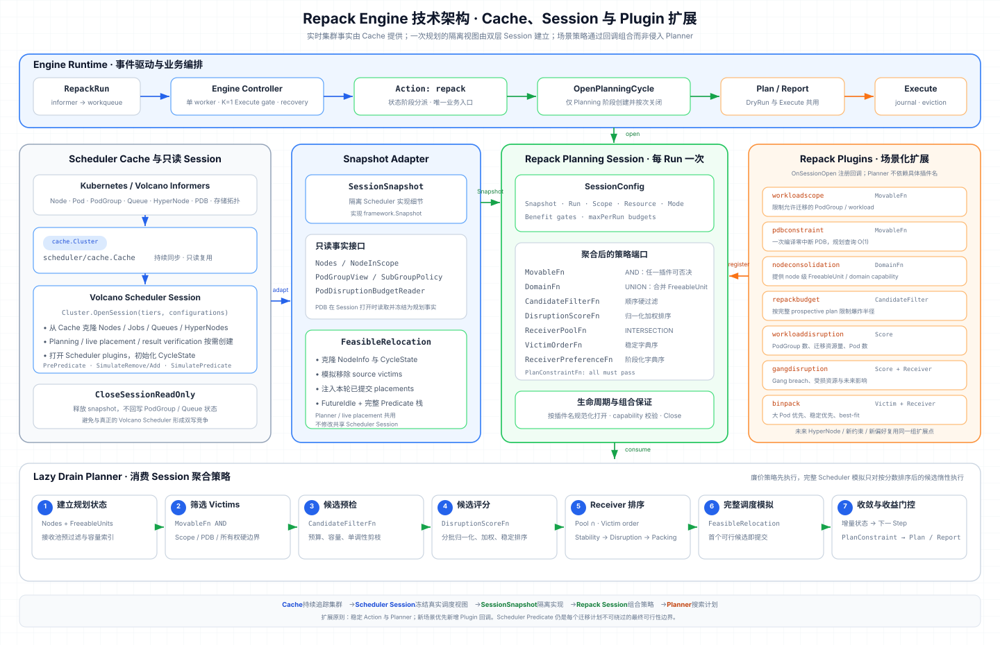
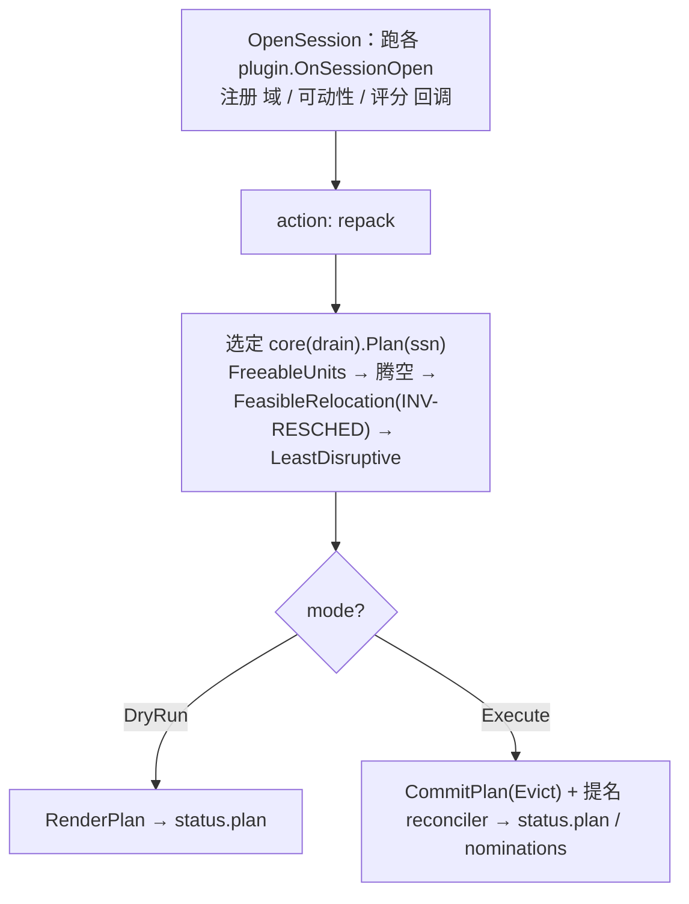

# Repack：运行期碎片整理设计

Author: wangyang0616 · 2026-06-27

> 状态：Proposal（征求意见）。本文是面向社区/开发者的方案说明；完整的推演与取舍记录见 [repack-policy-design.md](./repack-policy-design.md)。
>
> **范围说明**：本提案对 **P0 与 P1 的方案设计一并敲定**。文中的 **P0 / P1 仅表示"实现落地顺序"**——先实现并验证 P0，再推进 P1 的编码；**不代表 P1 尚未设计**。"非目标"只列**确定不做**的项，不含 P1。

---

## 1. 摘要（Summary）

在 GPU/NPU 等加速器集群中，作业反复创建与退出会让**空闲算力散落在很多节点上**：集群总空闲卡数明明够，但因为没有**连续的整机/整域空位**，需要整节点或跨节点 gang 调度的大作业**一直排队**。

本设计提出 **Repack（运行期碎片整理）**：通过一个**独立部署、复用 `volcano-scheduler` 框架与插件**的执行组件 `volcano-repack-engine`，在**保证被驱逐 Pod 都能重新调度**的前提下，把零散负载**就近拢紧**、**腾出整空节点**，使排队中的大作业能被调度下来。

用户通过一个一次性 CRD **`RepackRun`** 触发整理，支持两种模式：

- **DryRun**：只模拟、出"整理建议报告"，不动真实负载；
- **Execute**：在用户认可的范围内真实驱逐 + 落点引导。

Repack 是**建议式（advisory）、尽力（best-effort）重排**，不做资源预留：驱逐前先做**规划时刻的可行性预检**（保证"若此刻执行，被驱逐 Pod 都有处可落"），但因不预留，**不保证运行期一定成功**——执行期若资源状态变化、或有更高优先级作业插入抢走空位，被整理的作业可能最终调度不下去（如实记录、可重试）。落点是软引导，腾出的空间**交还给调度器的排队队列**去消化——这正是减少"碎片性排队"的目的。

## 2. 动机（Motivation）

典型现象（AI 推理/训练混部尤为常见）：

- 集群空闲 GPU 充足，但分散在几十个节点上，每个节点只剩 1~2 卡；
- 一个需要"整机 8 卡"或"跨机 64 卡 gang"的作业进入队列后，**找不到连续空位**，长期 Pending；
- 运维只能手动驱逐、迁移负载来"挤"出空位，过程易错、不可复现、缺乏收益评估。

Volcano 已有的 `networkTopology` / gang 调度解决的是"**新作业怎么放**"；但对"**已经在跑的负载怎么重排以消除碎片**"没有声明式能力。社区也缺少一个**带规划时可行性预检、可预览（DryRun）、可审计（CR 状态）**的碎片整理机制。

本设计补齐这一环：把"碎片整理"做成一等公民的、声明式、可灰度的能力。

### 2.1 与现有方案的关系：`descheduler`

Volcano 已有基于 [kubernetes-sigs/descheduler](https://github.com/kubernetes-sigs/descheduler) 原型的 **`descheduler`**（按 `LowNodeUtilization`、`RemoveDuplicates` 等策略周期性驱逐 Pod）。**为什么不在它之上演进，而为 AI 场景另起新方案？** 关键差异有四：

1. **调度一致性**：descheduler 用自带的调度/过滤模型，不复用 Volcano 的 `predicate`/`nodeorder`/HyperNode/队列配额——它判断的"能落下"未必等于 `volcano-scheduler` 实际怎么放，易出现"整理算的落点又被调度器拒掉"。Repack **复用调度器同一套 framework 与插件配置**，判断同源、同演进。
2. **gang 感知**：descheduler 以单 Pod 为单位，不理解 PodGroup/gang（`minAvailable`、整组完整性）；逐 Pod 驱逐易破坏 gang。Repack 以 **gang 为动作与代价单位**，按 gang 语义计代价、护 `minAvailable`。
3. **声明式整理**：descheduler 是按策略周期驱逐的 daemon，无"碎片整理"目标语义。Repack 用 **`RepackRun` CRD** 声明"整理什么/范围/多少/目标碎片率"并产出可读计划，把碎片整理作为一等目标。
4. **可交互**：Repack 提供 **DryRun 预览 → 人工确认 → Execute** 两段式，全过程经 CR `status` 可见、可审计、可灰度；descheduler 无此闭环。

故**新建独立组件**（寄生于 Volcano scheduler framework、不引入第二套调度语义），而非嫁接到 descheduler。

> **长期定位**：Repack 是"整理目标 + 算法 + action"可插拔的重排框架（§5.3 / §6）。descheduler 的各类策略（利用率再平衡、副本去重、规则违规清理）都可表达为 Repack 的"目标画像 + 扰动评分 + action"插件，并天然获得规划时可行性预检、gang 感知、DryRun/审计与调度一致性。因此长期看 descheduler 类能力可逐步纳管进 Repack；本提案先聚焦最迫切的一个——**AI 场景下的碎片整理**（GPU/NPU 因 gang 作业频繁起停产生的碎片）。

### 2.2 用户故事（User Stories）

聚焦两类直接使用者——**集群管理员**（对整集群负责）与**租户/队列负责人**（对本队列作业负责）；作业提交者多为透明受益方，不推荐其直接发起整理。每条标注实现阶段（P0/P1）。

**集群管理员**

- 作为集群管理员，我想要在真正执行前先预览一次整理计划（迁移哪些作业、腾出几台整机、扰动多大），以便于评估收益、确认无误后再动手，避免误操作影响线上。 [P0]
- 作为集群管理员，我想要一键把零散的 GPU/NPU 占用拢紧、腾出整机空节点，以便于让排队的大 gang 作业有连续空位，并释放整机用于维护、下线或节能。 [P0]
- 作为集群管理员，我想要用统一的标签选择器（或点名）圈定整理范围，即使 Deployment/StatefulSet/自定义负载也无需感知底层 PodGroup，以便于不了解 Volcano 内部结构也能配置整理。 [P0]
- 作为集群管理员，我想要限定参与整理的节点、并排除受保护对象，以便于把整理约束在安全边界内、按节点池分批推进。 [P0]
- 作为集群管理员，我想要限定单轮最多动几个作业/几张卡、且执行全局串行并带冷静期，以便于控制爆炸半径、避免整理风暴冲击集群稳定。 [P0]
- 作为集群管理员，我想要选择/配置不同的整理算法（节点腾空法、集中度法），以便于按场景选择最合适的整理目标。 [P0]
- 作为集群管理员，我想要整理的可行性判断复用 volcano-scheduler 同一套 framework/predicate，以便于"算出来能落"与调度器"实际能放"一致、计划不落空。 [P0]
- 作为集群管理员，我想要整理工单完成后按 TTL 自动清理，以便于不积压历史对象、保持集群整洁。 [P0]
- 作为集群管理员，我想要在碎片率或排队水位超阈值时自动触发整理，以便于无人值守地持续控碎片、减少人工巡检。 [P1]
- 作为集群管理员，我想要按周期定时发起整理，以便于在业务低峰窗口集中做碎片治理。 [P1]
- 作为集群管理员，我想要设置集群级默认与硬护栏（最大扰动、冷静期等）来统一约束**所有人手写**的整理动作、防止越界，以便于多租户下安全放权。 [治理机制，待定——不在 RepackPolicy 内]
- 作为集群管理员，我想要按 NVLink island / 超节点整域腾出连续空位，以便于满足大模型训练对拓扑连续算力的调度需求。 [P1]

**租户 / 队列负责人**

- 作为租户负责人，我想要只整理本命名空间/队列内的作业，以便于自助解决本队列碎片、不影响其他租户。 [P0]
- 作为租户负责人，我想要以"让我这个排队的大 gang 作业可调度"为目标反向整理出落点，以便于被碎片卡住的重要作业尽快跑起来。 [P1]
- 作为租户负责人，我想要把关键作业标记为受保护、整理时不被搬迁，以便于保障核心业务不因整理而中断。 [P0：单次可按保护标签 `scope.exclude`；跨 Run 强制保护见治理机制（待定）]
- 作为租户负责人，我想要为整理配置最小运行时长、最大中断分、PDB 兼容等扰动策略，以便于把对在跑作业的打扰控制在可接受范围。 [P1]

#### 故事 → RepackRun / RepackPolicy 映射

两个 CRD 分工：**`RepackRun`** 是"一次性工单"（人手动发起，或由 Policy 自动创建）；**`RepackPolicy`** 只做"**按触发条件生成 RepackRun**"（内嵌 RepackRun 模板，CronJob→Job 式；**不做集群级护栏**——那是治理，另议）。下表把上面每条故事落到具体载体与字段，字段名均与最终 CRD 一致（完整多路径示例见 §5.5 RepackRun、§5.6 RepackPolicy/relief/disruptionPolicy）。

| 故事（能力） | 载体 | 关键字段（与最终 CRD 一致） | 阶段 |
|---|---|---|---|
| 预览计划再决定 | RepackRun | `mode: DryRun` → 读 `status.plan` | P0 |
| 一键腾整机 | RepackRun | `mode: Execute` + `goals[].resource` | P0 |
| 统一标签圈定范围 | RepackRun | `scope.podGroups.include.selector` | P0 |
| 限定节点 / 排除受保护对象 | RepackRun | `scope.nodes` / `scope.podGroups.exclude` | P0 |
| 控爆炸半径 | RepackRun | `maxPerRun.podGroups` / `maxPerRun.resources`（+引擎串行/冷静期） | P0 |
| 选整理算法 | scheduler-conf | `repack.core: drain \| concentration` | P0 |
| 落点与调度器一致 | 引擎内建 | 复用 `scheduler-conf` / framework / predicate（无需配置） | P0 |
| 完成后自动清理 | RepackRun | `ttlSecondsAfterFinished` | P0 |
| 只整理本队列（租户自助） | RepackRun | `scope.podGroups.include.selector`（本 ns/队列标签） | P0 |
| 定时 / 排队受阻 / 碎片率触发 | RepackPolicy | `trigger.cronSchedule` / `trigger.onPendingBlocked` / `trigger.onFragmentation` | P1 |
| 生成 Run（模板） | RepackPolicy | `runTemplate.spec`（其 `mode` 决定 DryRun/Execute）；串行由引擎 K=1+冷静期兜底 | P1 |
| 排除受保护对象（单次） | RepackRun | `scope.podGroups.exclude`（按保护标签） | P0 |
| 拓扑整域腾空 | RepackRun | 拓扑目标画像插件（NVLink/超节点） | P1 |
| 解救排队 gang | RepackRun | `relief.podGroupRefs` / `relief.minRelieved` | P1 |
| 驱逐执行参数 | RepackRun（或经 RepackPolicy 的 `runTemplate`） | `eviction.gracePeriodSeconds` | P0 |
| 可配扰动策略 | RepackRun（或经 RepackPolicy 的 `runTemplate`） | `disruptionPolicy.minRunDuration` / `.maxDisruptionScore`；PDB 预检与阻塞策略后续放在 `eviction.pdb` | P1 |
| 集群级默认 + 硬护栏 / 跨 Run 强制保护 | 治理机制（另议） | CEL `ValidatingAdmissionPolicy` 或后续单开 CRD，**不在 RepackPolicy 内** | 待定 |

**示例 1 · 集群管理员：一键腾空 a100 节点池（P0，RepackRun）** — 对应故事"一键腾整机 / 统一标签圈定 / 限定节点排除保护 / 控爆炸半径 / 自动清理"

```yaml
apiVersion: repack.volcano.sh/v1alpha1
kind: RepackRun
metadata:
  name: a100-drain
spec:
  mode: Execute                     # 预览则改 DryRun，读 status.plan
  goals:
    - resource: nvidia.com/gpu
  scope:
    podGroups:
      include:                      # 统一按 PG 标签选，覆盖 vcjob/Deployment/自定义
        selector:
          matchLabels:
            workload-type: batch
      exclude:                      # 排除受保护对象
        selector:
          matchLabels:
            repack.volcano.sh/protected: "true"
    nodes:
      include:                      # 限定参与节点
        selector:
          matchLabels:
            volcano.sh/node-pool: a100
  maxPerRun:                        # 控爆炸半径
    podGroups: 10
    resources:
      nvidia.com/gpu: 64
  ttlSecondsAfterFinished: 86400    # 完成后自动清理
```

**示例 2 · 租户负责人：只整理本队列（P0，RepackRun）** — 对应故事"只整理本命名空间/队列内的作业"

```yaml
apiVersion: repack.volcano.sh/v1alpha1
kind: RepackRun
metadata:
  name: team-foo-repack
spec:
  mode: DryRun                      # 先预览，读 status.plan 评估
  goals:
    - resource: nvidia.com/gpu      # 整理 GPU 碎片
  scope:
    podGroups:
      include:                      # 只圈本租户的 gang（PG 标签 tenant=foo），不影响他人
        selector:
          matchLabels:
            tenant: foo
  ttlSecondsAfterFinished: 3600     # 报告留存 1h 后自动清理
```

**示例 3 · 自动触发（P1，RepackPolicy = 触发 + 内嵌 RepackRun 模板）** — 对应故事"碎片率/排队受阻自动触发 / 定时触发"

```yaml
apiVersion: repack.volcano.sh/v1alpha1
kind: RepackPolicy
metadata:
  name: a100-auto
spec:
  trigger:                          # 三种触发源，命中任一即触发（此处配了②③两种）
    onFragmentation:                # ③ 碎片率 > 0.35 触发
      fragAbovePercent: 35
    onPendingBlocked:               # ② ≥1 个 gang 因碎片卡住 >10min
      minPendingPodGroups: 1
      minBlockedDuration: 10m
  suspend: false                    # 可临时暂停触发
  successfulRunsHistoryLimit: 3     # 派生 Run 保留数（扁平字段，对齐 CronJob）
  runTemplate:                      # ← 内嵌一份 RepackRun（复用 RepackRunSpec）
    spec:
      mode: DryRun                  # DryRun=命中只自动出报告；改 Execute 则自动执行（引擎 K=1+冷静期兜底串行）
      goals:
        - resource: nvidia.com/gpu
          minFragImprovementPercent: 5   # 碎片率至少改善 0.05 才值得
      scope:
        nodes:
          include:
            selector:
              matchLabels:
                volcano.sh/node-pool: a100
      maxPerRun:
        podGroups: 10
        resources:
          nvidia.com/gpu: 64
      eviction:                     # P0：本次 Eviction 请求的执行参数
        gracePeriodSeconds: 30      # 可选：不填则使用 Pod.spec.terminationGracePeriodSeconds
      disruptionPolicy:             # P1 扰动策略
        minRunDuration: 30m
        maxDisruptionScore: 80
```

## 3. 目标（Goals）

> 逐条列出**支持的能力**；每项标注实现阶段（**P0** 先落地、验证后再做 **P1**，均在本提案敲定，P0/P1 仅表示落地顺序）。

**按触发方式**

- 支持**一次性（手动）碎片整理**：建 `RepackRun`，`DryRun` 预览计划 + `Execute` 执行的两段式流程（**P0**）
- 支持**定时触发的碎片整理**：`RepackPolicy` 按周期自动发起（**P1**）
- 支持**缓解 Pending 作业自动触发的碎片整理**：碎片率 / 排队水位超阈值自动触发，或以"让指定排队 gang 可调度"为目标的解救式整理（relief）（**P1**）

**按整理粒度**

- 支持**节点级碎片整理**：拢紧零散占用、腾出整节点（内置节点腾空法 / 集中度法两种等价目标算法）（**P0**）
- 支持 **HyperNode（拓扑）级碎片整理**：NVLink 节点内 island、超节点"整域空位"作为整理目标（**P1**）
- 支持**可插拔的整理算法 / 目标**：新算法、新整理目标以插件接入，不改主流程（**P0**）

**按整理语义与质量**

- 支持 **Gang 感知的碎片整理**：以 PodGroup（gang）为动作与代价单位，按 gang 语义计"受损卡数"（**P0**）
- 支持**任务中断成本感知的碎片整理**：扰动评分、单轮规模封顶、`Execute` 全局串行 + 冷静期（**P0**）；`eviction.gracePeriodSeconds` 可覆盖本次驱逐的优雅终止等待；可配 `disruptionPolicy`（`minRunDuration` / `maxDisruptionScore` / 权重）（**P1**）
- 支持**规划时可行性预检（尽力、非预留）**：驱逐前模拟"被驱逐 Pod 都有处可落"（INV-RESCHED），不过则不驱逐（**P0**）
- 支持**落点引导**：驱逐后用 `pod.status.nominatedNodeName` 把重建 Pod 引导到目标节点；空间不保留、交还排队队列（**P0**）
- 支持**复用调度器判断**：与 `volcano-scheduler` 同一份插件配置、同一 `framework`/`predicate`，判断同源、同演进（**P0**）

## 4. 非目标（Non-Goals）

> 明确**不支持**的能力（P1 项不在此列，见 §3 各 P1 能力、§5.6、§6）。

- **仅支持 GPU / NPU 资源的碎片整理**：以加速卡（GPU/NPU）为整理对象与收益口径，**不支持** CPU、内存等其他资源的碎片整理
- **不支持抢占（preemption）**：repack 只搬可迁移作业，不按优先级抢占正在运行的作业
- **不支持资源预留 / 占位（Reservation）**：腾出的空间交还调度器排队队列，不为某个未来 Pod 锁定容量
- **不支持新作业的拓扑放置**：由现有 `networkTopology` / gang 调度负责，repack 不改其行为
- **不支持跨资源联合整理**（一个 Run 同时整理 GPU+NPU 并跨资源合成收益）：P2+ 预留，schema 的 `goals[]` 形状已留，放开 `maxItems` 即可，本提案不展开
- **不迁移 DaemonSet pod**：DaemonSet pod 节点固定（每节点一个），搬走会立刻被重建回原节点，无整理意义；落点身份契约（§5.2.2）中 DaemonSet 直接列为非迁移目标

## 5. 方案（Proposal）

### 5.1 总体架构

Repack 由**三个进程**协作，职责清晰分离：

```mermaid
flowchart LR
    user["用户 / 运维"]
    subgraph API["apiserver"]
        cel["CEL/marker 校验<br/>（mode 枚举 / goals≤1 / spec 不可变 / Execute 需 scope）"]
    end
    subgraph CM["volcano-controller-manager"]
        ctrl["RepackRun 控制器<br/>TTL 回收 + 提名注入<br/>(+P1 RepackPolicy)"]
    end
    subgraph RR["RepackRun (CRD)"]
        spec["spec: mode/scope/goals/maxPerRun"]
        status["status: phase/plan/nominations"]
    end
    subgraph ENG["volcano-repack-engine (独立 Pod)"]
        eng["事件驱动 watch RepackRun<br/>复用 schedcache + OpenSession(同一插件配置)<br/>门控(K=1+冷静期) + 整理算法 + 驱逐 + 写状态"]
    end
    subgraph SCHED["volcano-scheduler (现网)"]
        alloc["allocate：honor nominatedNodeName<br/>排队作业调度进腾出的空间"]
    end

    user -->|CREATE| API -->|合法才落库| RR
    RR -->|watch(事件)| eng
    eng -->|写 status.plan/nominations + phase/conditions| RR
    RR -->|watch 终态| ctrl
    ctrl -->|TTL 删除 / patch 替身 Pod nominatedNodeName| SCHED
    eng -->|Evict victim| SCHED
    alloc -->|消费空位| SCHED
```

- **apiserver（CEL 准入）**：`RepackRun` 的基本校验全部在创建期由 CRD 上的 CEL/marker 完成（mode 枚举、`goals≤1`、spec 不可变）；scope 两种 mode 均可省略（=全集群，迁移规模由引擎计划兜底）；非法对象根本不落库。**没有控制器准入步骤。**
- **控制器**（在 controller-manager 内，轻量 client-go）：只做 **TTL/历史回收** 和 **提名注入**（提名 reconciler：watch 替身 Pod → patch `nominatedNodeName`）；P1 的 `RepackPolicy` 也演进在这里。**不写非终态 status。**
- **`volcano-repack-engine`**（独立 Deployment）：**事件驱动** watch `RepackRun`，**复用调度器框架**打开 Session;跑门控(Execute 全局 K=1 + 冷静期，谁干活谁串行)与整理算法;两种 mode 都写 `status.plan`（同一结构），Execute 额外驱逐 victim + 写 `status.nominations` + `phase/conditions`。**不 bind Pod、不打污点、不保留节点。**
- **`volcano-scheduler`**（现网，不改造）：照常调度；通过原生 `nominatedNodeName` honor 路径，把重建的 Pod 与排队作业落到腾出的空间。

> **关键设计：repack-engine = "只跑整理、不跑 allocate/bind 的迷你调度器"。** 它用 `schedcache.New` 建与调度器同源的缓存、用 `framework.OpenSession(tiers, conf)` 加载**同一份插件配置**，于是 predicate（亲和/污点/拓扑/NUMA/设备）与调度器**逐字一致、自动跟随演进**。

### 5.2 RepackRun API

新增一个 cluster-scoped、一次性、用户不可变（创建后 `spec` 冻结）的 CRD：**`RepackRun`**（group `repack.volcano.sh/v1alpha1`）。

**spec 核心字段**

| 字段 | 含义 | 必填 | 阶段 |
|---|---|---|---|
| `mode` | `DryRun`（模拟出报告）/ `Execute`（真实执行） | 是 | P0 |
| `scope.podGroups` | 候选被搬迁的作业范围（include/exclude，`selector` 按 PG 标签 + `names` 点名 PG 的 `ns/name`）——**万物皆 PodGroup**（见下方说明） | 可选；省略即全部 PodGroup | P0 |
| `scope.nodes` | 限定/排除参与整理的节点 | 可选 | P0 |
| `goals[0].resource` | 整理哪类加速资源（如 `nvidia.com/gpu`），**单资源、至多一条** | 可选（留空=回落引擎 `--repack-default-resource`，皆空即 `NoTargetResource` 失败） | P0 |
| `goals[0].minFragImprovementPercent` | 碎片率最小改善阈值（百分点 0–100 整数），达不到不整理 | 可选 | P0 |
| `maxPerRun.podGroups` / `.resources` | 单轮最多动几个作业 / 几张卡 | 可选 | P0 |
| `eviction.gracePeriodSeconds` | 本次 Eviction 请求的优雅终止等待秒数；不填沿用各 Pod 的 `terminationGracePeriodSeconds`，`0` 请求立即终止 | 可选，仅 Execute 生效 | P0 |
| `ttlSecondsAfterFinished` | 终态后自动清理（对齐 Job，由控制器执行） | 可选 | P0 |
| `relief` | 指定要"解救"的排队作业（反向整理出落点） | 可选 | **P1** |
| `disruptionPolicy` | 扰动策略：搬迁单元 / 最小运行时长 / 中断分红线 / 权重 | 可选 | **P1** |

#### Eviction 与 PDB 的职责边界

`eviction.gracePeriodSeconds` 是**执行请求参数**：引擎把它原样写入
`policy/v1 Eviction.deleteOptions.gracePeriodSeconds`。未设置时 API Server 使用
Pod 自己的 `spec.terminationGracePeriodSeconds`；显式 `0` 表示请求立即终止。它不表示
引擎等待 Pod 消失、替身 Ready，或节点真正腾空的超时；这些闭环等待若需要，后续另设
`terminationWaitTimeoutSeconds` / `replacementReadyTimeoutSeconds`，不得复用 grace period。

PDB 与优雅终止同属 Eviction API 的执行面，但解决的是不同问题：前者决定当前是否允许
中断，后者决定已获准中断后可保留多久。每一次实际驱逐都必须使用 Kubernetes Eviction API，
因此**始终受 PDB 约束，不能提供绕过 PDB 的开关**。现有
`disruptionPolicy.respectPDB` 仅是未实现的 v1alpha1 兼容占位，不应据此推断可关闭 PDB。

PDB 的后续 API 固定在 `eviction.pdb`，待完整行为确定后再暴露，而不是提前提供空字段：

```yaml
spec:
  eviction:
    gracePeriodSeconds: 30
    pdb:                         # P1，尚未进入 CRD
      preflight: Require          # None | Require：是否在规划阶段排除无 budget 的 victim
      onBlocked: Retry            # Continue | Fail | Retry：Eviction 被 PDB 拒绝后的行为
      retryTimeoutSeconds: 300    # 仅 Retry 时有效
```

`preflight` 只能减少“规划成功、提交时被 PDB 拒绝”的概率，因为 PDB 状态可在两者之间变化；
最终 Eviction API 仍是唯一权威。默认行为保持当前开环语义：不做 PDB 预检，逐个尝试
Eviction，继续其他 move；全部被拒绝时 Run 以 `ExecuteFailed` 结束。

> **万物皆 PodGroup：工作负载选择统一到 PodGroup 维度**
> repack 的动作/代价单位是 PodGroup（gang），因此**选择也统一表达在 PodGroup 上**：`selector`（PG 标签）与 `names`（PG 的 `ns/name`）指向同一种对象，语义自洽。这对三类负载一视同仁——Volcano 原生（vcjob）、K8s 原生（Deployment/StatefulSet…）、用户自定义 CRD。
>
> 关键前提是**让 PodGroup 携带业务标签**。Volcano 的 pg-controller 为非 vcjob 负载自动创建 PodGroup（`podgroup-<controller-owner-UID>`，如 Deployment 下即 ReplicaSet 的 UID，一个 RS 的所有 pod 共用一个 PG），原本标签为空。**配套增强**（见 §5.2.1）让 pg-controller 把 pod 模板标签**继承**到 PG 上（剔除 `pod-template-hash`、`controller-revision-hash` 等系统/控制器标签），于是 PG 的 `selector` 就能覆盖所有负载类型。
>
> 为什么不把选择锚点下沉到 Pod：因为本轴还有 `names` 点名列表，而 **`names` 天生是 PodGroup 维度**的（pod 名朝生暮死、无法稳定点名）；若 `selector` 去匹配 Pod、`names` 匹配 PodGroup，同一条轴两个字段指向两种对象，不自洽。统一到 PodGroup 后二者同源。
>
> 边界：`names` 对**自动建的 PG 不实用**（名字 UID 派生、滚动升级换 RS 即变），主要服务 vcjob 这类确定性命名；Deployment/自定义负载日常靠 `selector`。语义上 `include/exclude` 各支持 `selector`∪`names`，`exclude` 优先；命中即选中整组 PodGroup。

**status 核心字段**

- `phase`：`Pending` / `Running` / `Succeeded` / `Failed` / `Cancelled`（由 `conditions` 派生，`conditions` 为权威）。
- `plan`（**DryRun 与 Execute 同一字段、同一结构**）：整理计划的三层渐进披露——一句话 `message` + 扁平 `summary`（碎片率前后、腾出节点数、搬走卡数）+ 明细 `moves[]`（**每个 PodGroup 一条**，`namespace` 提升到条顶层共享，除精确 `podGroupName` 外并列 `owner` 用户可见工作负载引用——PodGroup 是内部对象，用户按 Deployment/vcjob/StatefulSet 认领；条内 `pods[]` 给**逐 pod** 的 `fromNode → toNode` 计划落点，因一个 gang 的 pod 可散落多源节点、迁往多目标节点，**DryRun 也能看到每个 pod 迁往哪个节点**；`pods[]` 只列被迁移的 pod，没搬的不出现）+ `freedNodes[]`（计划腾空的节点名列表）。`moves` 是**纯计划**、DryRun 与 Execute 同构；Execute 的实际落点/绑定情况交由 `nominations[].phase` + 聚合 `summary`（`freedNodeCount`/`fragAfterPercent`）表达，不在 `pods[]` 逐 pod 记漂移（结果导向：漂移不纠正、成败看聚合腾空与 relief）。
- `nominations`（**Execute 独有**）：durable 落点提名意图，交控制器的提名 reconciler 消费（引导重建 pod 落到 `toNode`）。

**RepackRun 结构体定义（Go，与 `types.go` 一致）**

```go
// group repack.volcano.sh/v1alpha1；cluster-scoped；一次性、spec 创建后不可变（CEL）
type RepackRun struct {
    metav1.TypeMeta   `json:",inline"`
    metav1.ObjectMeta `json:"metadata,omitempty"`
    Spec   RepackRunSpec   `json:"spec"`             // CEL: self == oldSelf（不可变）
    Status RepackRunStatus `json:"status,omitempty"`
}

type RepackRunSpec struct {
    Mode                    RepackMode        `json:"mode"`                              // DryRun | Execute（必填）
    Scope                   *RepackScope      `json:"scope,omitempty"`                   // 整理范围（可省略；省略即整个集群）
    Goals                   []RepackGoal      `json:"goals,omitempty"`                   // 单资源目标，maxItems=1
    MaxPerRun               *MaxPerRun        `json:"maxPerRun,omitempty"`               // 单轮规模封顶
    Eviction                *EvictionPolicy   `json:"eviction,omitempty"`                // Execute 的 Eviction 请求参数
    TTLSecondsAfterFinished *int64            `json:"ttlSecondsAfterFinished,omitempty"` // 终态后自动删
    Relief                  *RepackRelief     `json:"relief,omitempty"`                  // P1：解救式整理
    DisruptionPolicy        *DisruptionPolicy `json:"disruptionPolicy,omitempty"`        // P1：可配扰动策略
}

// scope：万物皆 PodGroup，两轴（podGroups / nodes）同构
type RepackScope struct {
    PodGroups *RepackSelectorTerm `json:"podGroups,omitempty"`
    Nodes     *RepackSelectorTerm `json:"nodes,omitempty"`
}
type RepackSelectorTerm struct { // exclude 优先
    Include *RepackSelector `json:"include,omitempty"`
    Exclude *RepackSelector `json:"exclude,omitempty"`
}
type RepackSelector struct { // selector ∪ names
    Selector *metav1.LabelSelector `json:"selector,omitempty"` // PG 标签（pg-controller 从 pod 继承）/ 节点标签
    Names    []string              `json:"names,omitempty"`    // PodGroup: "ns/name"；Node: 节点名
}

type RepackGoal struct {
    Resource               v1.ResourceName `json:"resource"`                         // 如 nvidia.com/gpu
    MinFragImprovementPercent int32        `json:"minFragImprovementPercent,omitempty"` // 碎片率最小改善阈值（百分点 0–100）
}
type MaxPerRun struct {
    PodGroups *int32          `json:"podGroups,omitempty"` // 单轮最多动几个 PodGroup
    Resources v1.ResourceList `json:"resources,omitempty"` // 单轮最多动几张卡（按资源）
}
type EvictionPolicy struct {
    GracePeriodSeconds *int64 `json:"gracePeriodSeconds,omitempty"` // nil=沿用 Pod.spec.terminationGracePeriodSeconds；0=立即终止
}

type RepackRunStatus struct {
    Phase          RepackPhase        `json:"phase,omitempty"`          // 由 conditions 派生
    Conditions     []metav1.Condition `json:"conditions,omitempty"`     // 权威事实（准入=CEL，无 Admitted 条件）
    Message        string             `json:"message,omitempty"`        // 终态一句话结论
    StartTime      *metav1.Time       `json:"startTime,omitempty"`
    CompletionTime *metav1.Time       `json:"completionTime,omitempty"` // TTL 锚点
    Plan           *RepackPlan        `json:"plan,omitempty"`           // 整理计划（两种 mode 同一字段：DryRun=预测 / Execute=已执行）
    Nominations    []PodNomination    `json:"nominations,omitempty"`    // Execute 独有：落点提名意图（每搬一个 pod 一条）
}
// 已精简（对齐 status 定义评审）：删除 mode（spec 不可变、恒可读，printer 用 spec.mode）、
// observedGeneration（spec 被 CEL 冻结、generation 永不变）、triggerReason（P0 恒为 Manual，
// 有区分度要等 RepackPolicy/P1）。三者均为「派生/恒定/P1」字段。

// PodNomination 引导一个被搬 pod 的替身落到目标节点（Execute 独有；每搬一个 pod 一条），
// 供提名 reconciler 消费（patch pod.status.nominatedNodeName）；durable 跨引擎重启。
// 替身认领按「落点身份契约」（§5.2.2）：victimPodName 精确快路径 → identityLabels 标签匹配 → fungible。
type PodNomination struct {
    Namespace      string            `json:"namespace"`                // 命名空间（PodGroup / victim pod 同此 ns）
    PodGroupName   string            `json:"podGroupName,omitempty"`   // 所属 PodGroup
    VictimPodName  string            `json:"victimPodName,omitempty"`  // 被驱逐的旧 pod 名：审计 + 同名重建时的精确快路径
    IdentityLabels map[string]string `json:"identityLabels,omitempty"` // 匹配替身的身份标签（键=用到的身份 label，值=其值；如 {repack.volcano.sh/pod-identity: worker-3}）；自解释；空=fungible
    NodeName       string            `json:"nodeName"`                 // 提名的目标节点（对齐 pod.spec.nodeName 词汇）
    ExpirationTime *metav1.Time `json:"expirationTime,omitempty"` // 重申截止，到期即 Expired（对齐 *Time 命名惯例）
    Phase          string       `json:"phase,omitempty"`          // Pending | Bound | Expired（重建 pod 是否已按提名落定）
}
// ---- status 子结构 ----
// RepackPlan：DryRun 与 Execute 同一结构。DryRun=预测计划；Execute=已执行计划。
type RepackPlan struct {
    Summary    *RepackSummary     `json:"summary,omitempty"`    // 扁平看板层
    Moves      []RepackMove       `json:"moves,omitempty"`      // 每段搬迁：带 fromNode→toNode 计划落点
    FreedNodes []string           `json:"freedNodes,omitempty"` // 计划腾空的节点名（Execute 实际腾空数见 summary.freedNodeCount）
    Relief     []RelievedPodGroup `json:"relief,omitempty"`     // P1：会被解救的排队 gang
}
// RepackMove：一个 PodGroup 的迁移信息。fromNode/toNode 本质逐 pod（一个 gang 的 pod
// 可散落多源节点、迁往多目标节点），故内含 pods[] 明细，PodGroup 级只留身份与合计。
type RepackMove struct {
    Namespace    string       `json:"namespace"`        // 本条所属命名空间（PodGroup/owner/pods 同此 ns）
    PodGroupName string       `json:"podGroupName"`     // PodGroup 名（精确调度维度、匹配 scope）
    Owner        *WorkloadRef `json:"owner,omitempty"`  // 用户可见拥有者（同 ns，故 WorkloadRef 只需 kind/name）
    Cards        int64        `json:"cards,omitempty"`  // 本 PodGroup 本轮搬走卡数合计（= Σ pods[].cards）
    Pods         []PodMove    `json:"pods,omitempty"`   // 逐 pod 迁移明细（各自 fromNode→toNode）
}
// PodMove：单个 pod 的迁移（纯计划：pods[] 只列被迁移的 pod，没搬的不出现）。
// DryRun 与 Execute 同构；Execute 的实际落点/绑定交由 nominations[].phase + summary 表达，
// 不在此逐 pod 记 outcome/actualNode（结果导向：漂移不纠正、成败看聚合腾空与 relief）。
type PodMove struct {
    Name     string `json:"name,omitempty"`     // pod 名（确定性命名精确对应；随机名为计划时快照）
    FromNode string `json:"fromNode,omitempty"` // 该 pod 当前节点
    ToNode   string `json:"toNode,omitempty"`   // ★ 该 pod 计划落点（DryRun 也有；软引导、不预留）
    Cards    int64  `json:"cards,omitempty"`    // 该 pod 占用的卡数（GPU/NPU）
}
// WorkloadRef：拥有该 PodGroup 的工作负载。**直接透传 PodGroup 的 controller
// ownerReference，不上溯**（引擎零额外 informer 依赖）——vcjob/StatefulSet/裸 Job
// 即顶层；Deployment 的 pod 其 PG owner 是 ReplicaSet，故此处呈现 ReplicaSet（用户可再
// 经 RS 的 ownerRef 找到 Deployment）。ownerless 裸 pod 留空。namespace 同本条 move，省略。
type WorkloadRef struct {
    APIVersion string `json:"apiVersion,omitempty"` // 如 apps/v1
    Kind       string `json:"kind,omitempty"`       // 如 ReplicaSet / StatefulSet / Job
    Name       string `json:"name,omitempty"`
}
// 单资源/Run（goals maxItems=1）：碎片率就是该资源的，无需按资源分列（多资源=P2+）
type RepackSummary struct { // 扁平看板层（列表/告警读它）——纯度量，无 verdict
    FragBeforePercent int32          `json:"fragBeforePercent,omitempty"` // 该资源碎片率（百分点 0–100）
    FragAfterPercent  int32          `json:"fragAfterPercent,omitempty"`  // 改善 = before − after（自行相减）
    FreedNodeCount    int32          `json:"freedNodeCount,omitempty"`    // 头条指标；printcolumn 数据源（对齐 resolvedScope.nodeCount 的 Count 家族）
    MovedCardCount    int64          `json:"movedCardCount,omitempty"`    // 搬走的卡数总量（反范式计数，省一次聚合）
    ResolvedScope     *ResolvedScope `json:"resolvedScope,omitempty"`     // 解析后的有效范围计数
}
// 「值不值得整理」不放 summary，改由 conditions[Complete].reason 收口（conditions 权威、机器可读）：
//   RepackRecommended  —— DryRun 找到划算方案（moves 非空）
//   Executed           —— Execute 已执行搬迁
//   NoFragmentation    —— scope 内无明显碎片，无需整理
//   BelowGoalThreshold —— 有碎片但最优方案低于目标门控，未执行（fragBeforePercent 仍照填，暴露「有碎片整不动」）
// 已精简（对齐评审）：moves 删 role/moveKind/disruptionScore/outcome/actualNode（可读性/常量/
// 内部打分/漂移不纠正；身份匹配的 role 只留在 nominations[]，Execute 落点看 nominations[].phase）；
// 逐 pod 明细收进 pods[]PodMove（纯计划）；freedNodes 由 []FreedNode 塌缩为 []string
// （actuallyFreed 可由 summary.freedNodeCount + nominations 表达，且「保持空」并非成功判据、成功判据是 relief）；
// summary 删 verdict（→ conditions.reason）/fragDeltaPercent（=before−after 派生）/
// podGroupsToMove（=distinct moves 派生）/pendingRelieved（=len(relief)，且 relief 本身 P1）。
type ResolvedScope struct {
    PodGroupCount int32 `json:"podGroupCount,omitempty"`
    NodeCount     int32 `json:"nodeCount,omitempty"`
}
type RelievedPodGroup struct { // P1
    Namespace    string `json:"namespace"`
    PodGroupName string `json:"podGroupName"`
    Relieved     bool   `json:"relieved,omitempty"`
}
// RepackRelief、DisruptionPolicy（均 P1，spec 子结构）完整字段见仓库
// staging/src/volcano.sh/apis/pkg/apis/repack/v1alpha1。
```

**status 示例**

DryRun 终态（`status.plan` = 预测计划，`moves[].toNode` 让你看到计划落点）：

```yaml
status:
  phase: Succeeded
  message: "可整理：迁移 3 个 PodGroup(35 GPU)，腾出 2 台整机；GPU 碎片率 42→28"
  startTime: "2026-07-02T10:00:00Z"
  completionTime: "2026-07-02T10:00:07Z"
  conditions:
    - type: Complete
      status: "True"
      reason: RepackRecommended       # ★「值不值得整理」的收口：找到划算方案
      message: "plan generated"
  plan:
    summary:                          # 扁平看板层（纯度量）
      fragBeforePercent: 42
      fragAfterPercent: 28            # 改善 14 个百分点，自行相减
      freedNodeCount: 2
      movedCardCount: 35             # 搬走的卡数（该资源）
      resolvedScope:                  # 解析后有效范围
        podGroupCount: 24
        nodeCount: 8
    moves:                            # 每个 PodGroup 一条，内含逐 pod 的 fromNode→toNode
      - namespace: ml                 # 本条 podGroup/owner/pods 同此 ns
        podGroupName: train-a
        owner:                        # 用户认得出的工作负载（此处为 vcjob，同 ns 故只需 kind/name）
          apiVersion: batch.volcano.sh/v1alpha1
          kind: Job
          name: train-a
        cards: 8                      # 本 PodGroup 搬走卡数合计
        pods:                         # 逐 pod：支持散落多源节点、迁往多目标节点
          - { name: train-a-worker-0, fromNode: node-a17, toNode: node-a08, cards: 4 }
          - { name: train-a-worker-1, fromNode: node-a19, toNode: node-a30, cards: 4 }
      - namespace: ml                 # 自动建的 PodGroup（Deployment 的 pod）
        podGroupName: infer-b
        owner:                        # 直接透传 PG ownerRef=pod 的 controller=ReplicaSet（不上溯）
          apiVersion: apps/v1
          kind: ReplicaSet
          name: infer-b-7d9f
        cards: 4
        pods:
          - { name: infer-b-7d9f-abcde, fromNode: node-a23, toNode: node-a05, cards: 4 }
    freedNodes:                       # 计划腾空的节点名
      - node-a17
      - node-a23
```

Execute 终态（`status.plan` = 已执行计划，`moves` 同构纯计划，落点绑定看 `nominations[].phase`）：

```yaml
status:
  phase: Succeeded
  message: "已整理：搬迁 3 个 PodGroup，腾空 2 台整机"
  startTime: "2026-07-02T11:05:00Z"
  completionTime: "2026-07-02T11:06:12Z"
  conditions:
    - type: Complete
      status: "True"
      reason: Executed                # Execute 已执行搬迁
  plan:
    summary:
      fragBeforePercent: 42
      fragAfterPercent: 29           # 实际略逊于 DryRun 预估（运行期状态变化）
      freedNodeCount: 2             # Execute 下即实际腾空数
      movedCardCount: 35
    moves:                            # 与 DryRun 同构（纯计划）；实际落点/绑定看 nominations[].phase
      - namespace: ml
        podGroupName: train-a
        owner: { apiVersion: batch.volcano.sh/v1alpha1, kind: Job, name: train-a }
        cards: 8
        pods:
          - { name: train-a-worker-0, fromNode: node-a17, toNode: node-a08, cards: 4 }
          - { name: train-a-worker-1, fromNode: node-a19, toNode: node-a30, cards: 4 }
      - namespace: ml
        podGroupName: infer-b
        owner: { apiVersion: apps/v1, kind: ReplicaSet, name: infer-b-7d9f }
        cards: 4
        pods:
          - { name: infer-b-7d9f-abcde, fromNode: node-a23, toNode: node-a05, cards: 4 }
    freedNodes:                       # 计划腾空节点名；实际腾空数看 summary.freedNodeCount，
      - node-a17                      # 落点绑定情况看 nominations[].phase
      - node-a23
  nominations:                        # 每搬一个 pod 一条，引导重建 pod 落到 nodeName
    - namespace: ml
      podGroupName: train-a
      victimPodName: train-a-worker-0 # 旧 pod 名：审计 + 同名重建时精确快路径
      identityLabels:                 # 匹配替身的身份标签（自解释：键=用哪个 label，值=其值）
        repack.volcano.sh/pod-identity: worker-0   # vcjob：<task>-<index>，见 §5.2.2
      nodeName: node-a30
      expirationTime: "2026-07-02T11:16:12Z"
      phase: Bound                    # Pending/Bound/Expired：重建 pod 是否已按提名落定
```

「无需整理」终态（成功、非失败；Execute 下为安全空操作）——「值不值得」由 `conditions[Complete].reason` 收口，不设 `verdict` 字段：

```yaml
status:
  phase: Succeeded                    # 计算跑完、结论是「不值得动」，仍是成功
  message: "碎片率 42%，最优方案仅腾 1 台/改善 5%，低于目标 minFragImprovementPercent=10%，未执行"
  conditions:
    - type: Complete
      status: "True"
      reason: BelowGoalThreshold      # NoFragmentation（本就干净）| BelowGoalThreshold（有碎片但够不着目标）
  plan:
    summary:
      fragBeforePercent: 42           # 照填 → 碎片率高却「无需整理」，一眼看出「有碎片整不动」
      fragAfterPercent: 42            # 未采纳任何方案，等于 before
      freedNodeCount: 0
    moves: []                         # 空
```

#### 5.2.1 配套增强：pg-controller 继承 pod 标签到 PodGroup

"万物皆 PodGroup"的选择模型依赖 PodGroup 携带业务标签。**现状盘点——PodGroup 有三条创建路径，标签继承情况各不相同**：

| PG 创建路径 | 谁创建 | 是否继承负载业务标签 | 结论 |
|-------------|--------|----------------------|------|
| **vcjob** | vcjob 控制器 | **✓ 全量继承** vcjob 自身 `metadata.labels`（代码 `pg.Labels = job.Labels`，`job_controller_actions.go`） | `scope.podGroups.selector` 按业务标签选 vcjob **已可用，无需改动** |
| **kthena（ModelServing）** | kthena Model Serving 控制器（自建 PG，不走通用 pg-controller） | **✗ 仅打内部身份标签** `modelinfer.volcano.sh/name`，**不继承** ModelServing 的业务标签 | 只能按 `modelinfer.volcano.sh/name`（=ModelServing 名）选中；按业务标签选需 **kthena 侧改动**（跨项目，同 pod-identity label） |
| **Deployment / RS / StatefulSet / 裸 Job / 自定义负载** | 通用 **pg-controller** 自动创建（`podgroup-<controller-owner-UID>`，如 Deployment 下即 ReplicaSet UID；一个 RS 的所有 pod 共用一个 PG） | **✗ 当前 PG 标签基本为空**（仅 pod 带 `preemptable`/`cooldown-time` 时拷这两个） | 需 **本增强（下述）** |

即：「按业务标签统一选中所有负载」需要 **本增强（通用 pg-controller）+ kthena 侧继承标签** 两处；vcjob 已完备。

**增强点**：让 pg-controller 在创建/更新自动 PodGroup 时，把 pod 模板标签**继承**到 `PodGroup.Labels`，采用**全量继承 + 剔除系统标签**策略：

- 继承 pod 上的业务标签（用户在负载模板里打的 `app` / `tier` / `tenant` 等）；
- 剔除易变的系统/控制器注入标签：`pod-template-hash`、`controller-revision-hash`、`statefulset.kubernetes.io/pod-name`、`apps.kubernetes.io/pod-index`、`controller-uid`、`batch.kubernetes.io/*` 等（维护一个排除集/前缀规则），避免噪声与滚动升级抖动；
- 防撞键：不覆盖 Volcano 自身或其他组件打在 PG 上、有语义的 label（保留既有 `preemptable`/`cooldown-time` 行为）；pod 模板标签变更时随 `createOrUpdateNormalPodPG` 同步。

**收益**：一次改动让 PodGroup 成为一等可选对象，`scope.podGroups.selector` 从此对所有负载类型统一生效——不止 repack，队列统计、策略、看板等 PG 消费方都受益。

**影响面与时序**：本增强是对**共享核心控制器**的改动，需单独社区评审与兼容性论证。因此 repack 的落地时序为：**vcjob 当天可用**（已全量继承）；**Deployment/自定义负载**的普适选择**依赖本增强合入**（存量集群需 pg-controller 升级 + pod 重新 reconcile 后 PG 才带上标签）；**kthena** 按业务标签选中需 **kthena 侧单独 PR**（在其 ModelServing 控制器建 PG 时继承 ModelServing 的业务标签，与 `repack.volcano.sh/pod-identity` label 同为跨项目对齐项）。三者可并行推进、互不阻塞。

#### 5.2.2 落点身份契约（landing-identity contract，P0）

Execute 驱逐 victim pod 后，工作负载控制器会重建一个替身 pod；提名 reconciler 要把 `nominatedNodeName` patch 到**正确的那个替身**上。难点：替身的 `metadata.name` 未必等于 victim（如 kthena 的 role 级滚动更新会给 pod 名加随机后缀），而各家负载的身份标签各不相同。为避免 repack 去硬编码每种负载的 label scheme，定义一套**统一契约**：repack 只认识**一个声明式 label + 一小组 K8s 标准索引 label**，负载来对齐。

**身份解析规则（按序）：**

身份**以 label 键值对的形式**记进 `nominations[].identityLabels`（自解释：一眼看到用哪个 label、值是什么），reconciler 按它对 pending pod 做 label 超集匹配。

1. **Tier 1 — 声明式身份 label（主契约）**：pod 若带 `repack.volcano.sh/pod-identity`，则记 `identityLabels: {repack.volcano.sh/pod-identity: <值>}`。约束：该值须**在所属 PodGroup 内唯一、且跨重建稳定**。Volcano 自家与自定义负载走这条：
   - vcjob → `<task>-<index>`（如 `worker-0`）；
   - kthena → `<group>-<role>-<role-id>-<workerIndex>`（如 `sample-0-decode-0-0`，把当前是 env 的 workerIndex 也纳入）。
2. **原生负载自动适配**：pod 未带上述 label 时，repack **直接读 pod 自身的标准索引 label**（K8s 官方既有约定，非猜测，无需查 ownerRef），命中即记入 `identityLabels`：

   | 原生负载 | 读取并记录的 label | 说明 |
   |----------|--------------------|------|
   | StatefulSet | `{apps.kubernetes.io/pod-index: <序号>}` | 也同名重建，victimPodName 快路径通常先命中 |
   | Indexed Job | `{batch.kubernetes.io/job-completion-index: <idx>}` | 完成索引稳定 |
   | Deployment / ReplicaSet / 裸 Job | 空（fungible） | 无索引 label、单角色、pod 可互换，按 PG 内任一 pending pod 命中 |
   | DaemonSet | —（**非迁移目标**，见 §4 非目标；根本不产生 nomination） | 节点固定，搬走即被重建回原节点，无意义 |

3. **兜底**：既不带 label、又非上述已知 kind 的未知自定义负载 → `identityLabels` 留空，退化为 fungible（PG 内任一 pending pod），best-effort。

**匹配策略（reconciler）**：对某条 nomination，先按 `namespace + victimPodName` 精确命中（同名重建的快路径）；不中则在 `namespace + podGroupName` 内命中 label 是 `identityLabels` 超集的 pending pod；`identityLabels` 为空（fungible）时命中该 PG 内任一未消费的 pending pod。**记的是哪个 label 就匹哪个，新增身份来源零改 reconciler 代码。** 全程 **soft nomination**：不预留、`expirationTime` 到期即弃，不追求逐一精确。

**为何这样能统一管理**：repack **只认识 `repack.volcano.sh/pod-identity` + 两个标准索引 label（`apps.kubernetes.io/pod-index`、`batch.kubernetes.io/job-completion-index`）这几个固定 key**，且都直接读 pod 自身的 label、不查 ownerRef、不认识任何具体负载的私有 label scheme；Volcano 自家负载（vcjob/kthena）实现 Tier 1 拿精确引导，StatefulSet/Indexed Job 由标准 label 自动兜住，其余自定义负载想精确就打这一个 label——**契约由 Volcano 定、负载来对齐**，新增负载类型 repack 一行不用改。

**配套 P0 待办**：kthena / vcjob 控制器给 pod 打 `repack.volcano.sh/pod-identity`（kthena 需把 workerIndex 纳入该值）——跨项目对齐项。

#### 5.2.3 全字段参考示例（必选 / 可选标注）

以下两例把 `spec` 与 `status` 的**全部字段**都赋值，行尾注明**必选 / 可选**（及 P1 标注），供使用者对照理解。实际使用时**只需填必选 + 按需可选**；`status` 全部由控制器/引擎写、用户只读。

**示例一：`RepackRun`（spec 全字段，Execute 模式）**

```yaml
apiVersion: repack.volcano.sh/v1alpha1        # 必选
kind: RepackRun                               # 必选
metadata:
  name: pool-a100-defrag-20260704             # 必选：Run 名（cluster-scoped，无 namespace）
  labels:                                     # 可选：自定义标签
    team: platform
spec:                                         # 必选；创建后整体不可变（CEL self==oldSelf）
  mode: Execute                               # 必选：DryRun | Execute
  scope:                                      # 可选整体；但 mode=Execute 时 include 必须非空（CEL）
    podGroups:                                # 可选：不填=全部 PodGroup
      include:                                # 可选：不填=全域
        selector:                             # 可选：PG 标签选择器（与 names 取并集）
          matchLabels: { tenant: research }
        names:                                # 可选：PodGroup "namespace/name" 列表
          - ml/train-a
          - ml/train-b
      exclude:                                # 可选：排除项（exclude 优先于 include）
        selector:
          matchLabels: { protected: "true" }
        names:
          - ml/critical-job
    nodes:                                    # 可选：节点维度，与 podGroups 同构
      include:
        selector:
          matchLabels: { pool: a100 }
        names:
          - node-a17
      exclude:
        names:
          - node-a01
  goals:                                      # 可选：maxItems=1（不填=回落引擎 --repack-default-resource，皆空即 NoTargetResource 失败）
    - resource: nvidia.com/gpu                # 必选（goals 内）：整理哪类资源
      minFragImprovementPercent: 10           # 可选：碎片率最小改善阈值（百分点 0-100）
  maxPerRun:                                  # 可选：单轮规模封顶（blast radius）
    podGroups: 20                             # 可选：单轮最多动几个 PodGroup
    resources:                                # 可选：单轮最多动几张卡（按资源）
      nvidia.com/gpu: 128
  eviction:                                   # 可选：仅 Execute 生效，控制 Eviction 请求
    gracePeriodSeconds: 30                    # 不填=沿用每个 Pod 的 terminationGracePeriodSeconds；0=立即终止
  ttlSecondsAfterFinished: 3600               # 可选：终态后自动回收（秒）；不填=不自动删
  relief:                                     # 可选（P1）：解救式整理
    podGroupRefs:                             # 必选（若配 relief）：想让其可调度的 pending PodGroup（"ns/name"）
      - ml/train-large
    minRelieved: 1                            # 可选：至少解开几个才值得（默认 1）
  disruptionPolicy:                           # 可选（P1）：可配扰动策略
    bundlePolicy: SurplusPodsOnly             # 可选：SurplusPodsOnly | EntireJobPermitted
    minRunDuration: 30m                       # 可选：运行不足此时长的作业不搬
    maxDisruptionScore: 80                    # 可选：中断代价红线（超则不选为 victim）
    lambda: 1                                 # 可选：收益 vs 扰动 总权重（整数，默认 1）
    weights:                                  # 可选：各扰动项整数权重（键须匹配启用的评分插件）
      priority: 3
      movedCards: 1
      gangBreaches: 5
    hardFloors:                               # 可选：硬护栏
      freezePriorityAbove: 100                # 可选：优先级 ≥ 此值的 gang 绝不搬
      maxMovesPerJob: 4                       # 可选：单个 PodGroup 单轮最多搬几次
```

**示例二：`status`（全字段，Execute 终态）** —— 全部由控制器/引擎写，用户只读

```yaml
status:
  phase: Succeeded                            # 由 conditions 派生（Pending/Running/Succeeded/Failed/Cancelled）
  message: "整理完成：搬迁 1 个 PodGroup(8 GPU)，腾出 1 台整机；GPU 碎片率 42→31"  # 可选：一句话人读结论
  startTime: "2026-07-04T10:05:00Z"           # 可选：进入 Running 的时刻
  completionTime: "2026-07-04T10:08:42Z"      # 可选：到达终态时刻（TTL 锚点）
  conditions:                                 # 权威事实（准入=CEL，无 Admitted 条件）
    - type: Complete                          # 必选（condition 内）
      status: "True"                          # 必选（condition 内）
      reason: Executed                        # 可选：兼「值不值得」收口（RepackRecommended/Executed/NoFragmentation/BelowGoalThreshold）
      message: "executed"                     # 可选
      lastTransitionTime: "2026-07-04T10:08:42Z"  # 必选（condition 内）
  plan:                                       # 可选整体：DryRun/Execute 同一字段（此处 Execute=已执行）
    summary:                                  # 可选：扁平看板（纯度量）
      fragBeforePercent: 42                   # 可选：碎片率整数百分点 0-100
      fragAfterPercent: 31                    # 可选
      freedNodeCount: 1                       # 可选：腾出整机数（printer 列取此）
      movedCardCount: 35                      # 可选：搬走卡数合计
      resolvedScope:                          # 可选：解析后有效范围
        podGroupCount: 2                      # 可选
        nodeCount: 2                          # 可选
    moves:                                    # 可选：每个 PodGroup 一条
      - namespace: ml                         # 必选（move 内）
        podGroupName: train-a                 # 必选（move 内）
        owner:                                # 可选：用户可见拥有者（ownerless 裸 pod 留空）
          apiVersion: batch.volcano.sh/v1alpha1  # 可选
          kind: Job                           # 可选
          name: train-a                       # 可选
        cards: 8                              # 可选：本 PodGroup 搬走卡数合计
        pods:                                 # 可选：逐 pod 明细（只列被迁移的 pod）
          - name: train-a-worker-3            # 可选：pod 名（随机名为计划时快照）
            fromNode: node-3                  # 可选
            toNode: node-7                    # 可选：★计划落点
            cards: 4                          # 可选
          - name: train-a-worker-4
            fromNode: node-5
            toNode: node-9
            cards: 4
    freedNodes:                               # 可选：计划腾空的节点名（[]string）
      - node-3
    relief:                                   # 可选（P1）：会被解救的排队 gang
      - namespace: ml                         # 必选（relief 项内）
        podGroupName: train-large             # 必选（relief 项内）
        relieved: true                        # 可选
  nominations:                                # 可选（Execute 独有）：落点提名意图，reconciler 消费
    - namespace: ml                           # 必选（nomination 内）
      podGroupName: train-a                   # 可选：所属 PodGroup
      victimPodName: train-a-worker-3         # 可选：旧 pod 名（审计 + 同名重建快路径；fungible 负载可空）
      identityLabels:                         # 可选：匹配替身的身份标签（自解释；fungible 负载留空）
        repack.volcano.sh/pod-identity: worker-3   # §5.2.2：键=用到的身份 label，值=其值
      nodeName: node-7                        # 必选（nomination 内）：提名目标节点
      expirationTime: "2026-07-04T10:18:42Z"  # 可选：重申截止，到期即 Expired
      phase: Bound                            # 可选：Pending | Bound | Expired
```

> **DryRun 与 Execute 的差异**：DryRun 的 `plan` 结构完全相同（预测计划），但 **无 `nominations`**、`conditions[Complete].reason` 为 `RepackRecommended`/`NoFragmentation`/`BelowGoalThreshold`。

#### 5.2.4 外部负载接入指导（llm-d / kubeflow 等自定义 operator 的推荐做法）

任何外部框架/operator 想让自己的负载被 repack 整理，需满足下面 **4 条**（repack **不感知具体负载类型**，全靠这几个通用契约点对齐）：

**① 有 PodGroup（gang 调度单元）。** 两种接法：
- **A. 依赖 Volcano 通用 pg-controller 自动建**：pod 用 `schedulerName: volcano` + 带 `scheduling.k8s.io/group-name` 注解，pg-controller 自动建 PG（一个 controller-owner 一个 PG）。最省，但**业务标签继承依赖 §5.2.1 增强合入**。
- **B. operator 自建 PodGroup**（vcjob / kthena 的做法，推荐给有自己 CRD 的框架）：完全可控。

**② PodGroup 带业务标签**（供 `scope.podGroups.selector` 选中）。
- 自建 PG（接法 B）→ 把负载自身的业务标签**拷到 `PodGroup.Labels`**（vcjob 即 `pg.Labels = job.Labels`）。
- 依赖 pg-controller（接法 A）→ 把业务标签打在 **pod 模板**上，§5.2.1 合入后自动继承。

**③ pod 带 `repack.volcano.sh/pod-identity`**（落点身份契约 §5.2.2，供驱逐后引导替身）。值须 **PG 内唯一 + 跨重建稳定**。
- **同名重建**的负载（StatefulSet 序号 / vcjob / kthena ordinal）→ 可省（`victimPodName` 精确快路径覆盖）；
- **随机名重建**的负载（Deployment 系、role 级滚动更新会加随机后缀）→ **务必打**，否则只能退化到 PodGroup 粒度 fungible 匹配；
- 也可复用 **K8s 标准索引 label**（StatefulSet `apps.kubernetes.io/pod-index`、Indexed Job `batch.kubernetes.io/job-completion-index`），repack 自动识别、无需额外打。

**④ pod 可被追溯到其 PodGroup**：pod 带 `scheduling.k8s.io/group-name` 注解（pg-controller 会打；自建 PG 的 operator 需自己打），提名 reconciler 靠它把重建 pod 归到对应 PG。

**常见框架映射（供参考）：**

| 框架 | PG 由谁建 | 业务标签继承 | 角色/身份标签 | 接入建议 |
|------|-----------|--------------|----------------|----------|
| **vcjob** | vcjob 控制器 | ✓ `job.Labels` | `volcano.sh/task-spec` | 已完备 |
| **kthena** | ModelServing 控制器（自建） | 需补继承 ModelServing 标签 | `modelserving.volcano.sh/{role,role-id}`；打 `pod-identity`=`<group>-<role>-<roleId>-<workerIndex>` | 自建路径，补 ② ③ |
| **kubeflow**（training-operator） | operator（自建 PG，已有 Volcano 集成） | 把 `training.kubeflow.org/*` 或用户业务标签拷到 PG | 角色 `training.kubeflow.org/replica-type`(chief/worker/ps)、`replica-index`；`pod-identity`=`<replica-type>-<replica-index>` | 自建路径，补 ② ③ |
| **llm-d**（P/D 分离） | 多为按 role 分独立 Deployment → 走 pg-controller | 业务标签打 pod 模板（靠 §5.2.1）；或 operator 聚合成 gang PG 时自拷 | 角色 `llm-d.ai/role`(prefill/decode)；随机名 → **务必打 `pod-identity`**=`<role>-<ordinal>` | 单角色 Deployment 走 fungible 即可；多角色同 PG 建议自建 PG + 打身份标签 |
| **通用 Deployment/RS/裸 Job** | 通用 pg-controller | 靠 §5.2.1 | 单角色，通常无需身份标签（fungible） | 打业务标签在 pod 模板即可 |

**一句话**：**vcjob 开箱即用；自建 CRD 的框架（kthena/kubeflow/llm-d-operator）按接法 B 补「PG 继承业务标签 + pod 打 `pod-identity`」两步；纯 Deployment 类走通用 pg-controller（依赖 §5.2.1）**。repack 侧不为任何框架写死代码，全靠这套通用契约。

### 5.3 扩展点：能力插件 / 动作 / 核心算法

repack-engine 复刻 scheduler 的扩展模型，分**三类扩展点**（在 `--scheduler-conf` 同款配置里选用）：

- **能力 plugin（多个、可组合）**：往引擎 Session 注册回调，刻画"场景/能力"。P0：`base`（通用扰动评分）、`node`（面向节点的整理域）、`gang`（gang 感知：受损卡数 / 破组评分）；后续 `hypernode`（面向超节点）、`pdb`、`priority`。多个域插件同开时，核心对其贡献的"可释放单元"做**综合最优**（node 与 hypernode 单元按权重并集权衡），而非二选一。
- **action（有序、可组合）**：流水线阶段，对应 scheduler 的 action。P0 仅 `repack`（跑核心算法 → 渲染报告 → Execute 时提交）；未来 `relief` / `simulate` 追加。
- **core（恰选其一）**：整体搜索策略——"怎么搜出迁移计划"。与 plugin/action 不同，**一次只跑一个**（互斥，不能像 allocate→backfill 那样串联）。

| core | 思路 | 阶段 |
|---|---|---|
| **A · 节点腾空法**（`drain`，默认） | 增量破组感知贪心：按"当前增量腾空成本"挑单元（已破组 gang 的 pod 记 0）、负载搬进别处碎片、整空才提交，破组后"搭便车"节点免费腾 | **P0** |
| **B · 集中度法**（`concentration`） | 逐 gang 往更满节点挪，沿集中度 Σused² 涨分爬山 | 接口预留、P0 不实现 |

经 `repack.core` 选择；详见 [§6 整理算法](#整理算法详解)。

### 5.4 执行与落点引导

Execute 的落子链（**无预留、无污点**）：

1. **规划时可行性预检**：驱逐前在内存 Session 中模拟——确认所有 victim 都能在域内其它节点重新落下（INV-RESCHED），预检不过则本轮不驱逐。**注意：这是规划时刻的判断，因不预留空间，不构成运行期保证**（见下方"诚实边界"）。
2. **驱逐 victim**：通过 Eviction API 驱逐计划内 Pod；其工作负载控制器会重建出**替身 Pod**。
3. **落点提名**：repack-engine 的"提名 reconciler"watch 替身 Pod，写 `pod.status.nominatedNodeName = 计划目标节点`，告诉调度器"尽量往这放"。
4. **空间交还队列**：腾出的连续空间**不保留**，由 `volcano-scheduler` 正常 allocate 让**排队作业**调度进来——这就是收益兑现。

> **诚实边界（无预留的代价）**：预检只保证"规划那一刻可行"。驱逐后到替身重新落下之间存在时间窗，期间若**资源状态变化**（如别的作业退出/扩容改变了可用量）或**更高优先级作业下发**抢走了目标空位，被整理的作业可能**最终调度不下去、停在 Pending**。这是 Repack 不做预留的固有取舍：通过 `maxPerRun`（限规模）+ `executeCooldown`（防抖）控制代价，落点绑定情况经 `status.plan.nominations[].phase`（Bound/Expired）体现、实际腾空看 `summary.freedNodeCount`；不引入 Reservation 来强行保证（§4 非目标）。

替身 Pod 的识别方式见 [§6 落点提名](#落点提名替身-pod-的识别)。

### 5.5 典型用法（多种路径）

`RepackRun` 是一次性工单，`mode` 与 `scope` 自由组合，支持以下几种运维路径——它们都基于同一套 CRD，不互相依赖：

| 路径 | 适用 | 流程 |
|---|---|---|
| **A. 预览→执行** | 不确定该动谁，先看建议 | 建 DryRun → 读 `plan` → 抄认可的范围建 Execute |
| **B. 直接执行** | 已按节点池/业务自行筛好范围 | 直接建 Execute（指定 `scope`，跳过 DryRun） |
| **C. 仅预览→人工处置** | 只想要"整理建议"，自己决定怎么落地 | 只建 DryRun → 读 `plan` → **人工删除/迁移作业**（repack 不动手） |

> 三条路径正交：DryRun 与 Execute 是独立的一次性 Run（DryRun 的 `plan` 仅作参考，Execute 在自己的 `scope` 内**重新规划**，不引用某次 DryRun）。

#### 路径 A — 预览→执行

**A-1 DryRun 预览**（宽范围探查）：

```yaml
apiVersion: repack.volcano.sh/v1alpha1
kind: RepackRun
metadata:
  name: a100-pool-dryrun
spec:
  mode: DryRun
  goals:
    - resource: nvidia.com/gpu
      minFragImprovementPercent: 5
  scope:
    nodes:
      include:
        selector:
          matchLabels:
            volcano.sh/node-pool: a100
  maxPerRun:
    podGroups: 10
    resources:
      nvidia.com/gpu: 64
```

读 `status.plan`（例：`message: "可整理：迁移 3 个 PodGroup(35 GPU)，腾出 2 台整机；GPU 碎片率 0.42→0.28"`；`plan.moves[]` 里能看到每个 gang 计划迁往哪个 `toNode`），把认可的 gang（`plan.moves[].namespace` + `podGroupName`）抄进下一步。

**A-2 认可后 Execute**：

```yaml
apiVersion: repack.volcano.sh/v1alpha1
kind: RepackRun
metadata:
  name: a100-pool-exec
spec:
  mode: Execute
  goals:
    - resource: nvidia.com/gpu
  scope:                            # Execute 必须指定范围（不允许整集群裸跑）
    podGroups:
      include:                      # 抄 DryRun 认可的 gang，按 PG 名点名
        names:
          - ns1/job-a
          - ns1/job-b
          - ns2/job-c
    nodes:
      include:
        selector:
          matchLabels:
            volcano.sh/node-pool: a100
  ttlSecondsAfterFinished: 86400
```

#### 路径 B — 直接执行（运维已自行筛好范围，无需 DryRun）

当运维已按**节点池 / 业务标签**圈定了要整理的对象，可跳过 DryRun 直接 Execute（仍有 INV-RESCHED 规划时预检：预检不过不驱逐；但不预留，非运行期保证）：

```yaml
apiVersion: repack.volcano.sh/v1alpha1
kind: RepackRun
metadata:
  name: tenant-foo-exec
spec:
  mode: Execute
  goals:
    - resource: nvidia.com/gpu
  scope:
    podGroups:
      include:                      # 按 PG 标签选（pg-controller 已从 pod 模板继承），覆盖 Deployment/STS/vcjob
        selector:
          matchLabels:
            workload-type: batch
      exclude:                      # 带此标签的 PodGroup 不动
        selector:
          matchLabels:
            repack.volcano.sh/protected: "true"
    nodes:
      include:
        selector:
          matchLabels:
            volcano.sh/node-pool: a100
  maxPerRun:
    podGroups: 5
  ttlSecondsAfterFinished: 86400
```

#### 路径 C — 仅 DryRun，人工处置

只想拿到"整理建议"、由人来决定如何落地（例如人工删除/迁移作业、或走自有运维流程）。建一个 DryRun，读 `plan` 后**自行处置**，repack **不执行任何驱逐**：

```yaml
apiVersion: repack.volcano.sh/v1alpha1
kind: RepackRun
metadata:
  name: a100-pool-advice-only
spec:
  mode: DryRun
  goals:
    - resource: nvidia.com/gpu
  scope:
    nodes:
      include:
        selector:
          matchLabels:
            volcano.sh/node-pool: a100
  ttlSecondsAfterFinished: 3600     # 报告留存 1h 后自动清理
```

`plan` 给出"建议迁哪些作业、腾出哪些节点"；运维据此**人工删除/迁移作业**完成整理。这条路径下 repack 纯粹是"碎片诊断 + 整理建议"工具。

### 5.6 P1 能力设计（方案已敲定，实现在 P0 验证后推进）

以下能力的**方案在本提案一并敲定**，仅实现顺序排在 P0 之后。它们都建立在 P0 同一套引擎/CRD 词汇之上，是**叠加**而非改写。

#### 5.6.1 自动触发：`RepackPolicy`（模板生成，CronJob→Job 式）

新增 cluster-scoped CRD **`RepackPolicy`**，职责**单一**：**按触发条件生成 `RepackRun`**。它**内嵌一份 `RepackRun` 模板**（`runTemplate.spec` 即 `RepackRunSpec` 本体，单一事实来源、零 schema 漂移，且 `RepackRunSpec` 上的 CEL/校验自动传导到模板路径），再叠加"何时触发 / 历史保留 / 暂停"这些**调度专属**字段。关系严格类比 `CronJob`→`Job`。

> **职责边界（定稿）**：RepackPolicy **只做模板生成**，不承担"钳制用户手写 RepackRun 的集群级默认/硬护栏"——那是**治理/准入**语义，作用对象不同，另行处理（K8s `ValidatingAdmissionPolicy`(CEL) 或后续单开 CRD），不混入本 CRD。

**字段级定义**

```go
type RepackPolicySpec struct {
    // Trigger 何时触发（三种触发源，命中任一即触发）。
    Trigger RepackTrigger `json:"trigger"`

    // RunTemplate 派生 RepackRun 的模板（复用 RepackRunSpec）。
    // 生成的 Run 是 DryRun 还是 Execute 完全由 runTemplate.spec.mode 决定
    // （只想自动出报告就设 mode: DryRun）；Execute 的串行/冷静期由引擎兜底。
    RunTemplate RepackRunTemplateSpec `json:"runTemplate"`

    // Suspend 暂停触发（不影响已生成的 Run）。默认 false。
    // +optional
    Suspend *bool `json:"suspend,omitempty"`

    // 保留最近多少个成功/失败的派生 Run（扁平，对齐 CronJob，默认各 3）。
    // +optional
    SuccessfulRunsHistoryLimit *int32 `json:"successfulRunsHistoryLimit,omitempty"`
    // +optional
    FailedRunsHistoryLimit *int32 `json:"failedRunsHistoryLimit,omitempty"`
}

type RepackRunTemplateSpec struct {
    // +optional
    ObjectMeta metav1.ObjectMeta `json:"metadata,omitempty"` // 派生 Run 的 labels/annotations
    Spec       RepackRunSpec     `json:"spec"`               // ← 内嵌 RepackRun 的 spec 本体
}

// RepackTrigger 三种触发源，配了哪个就启用哪个，命中任一即触发。
// 反应式条件（onPendingBlocked/onFragmentation）的评估周期是**控制器级配置**
// （启动 flag / 控制器配置文件，全局一份，性质同 Execute 冷静期），不在本 CRD 内。
// +kubebuilder:validation:XValidation:rule="has(self.cronSchedule) || has(self.onPendingBlocked) || has(self.onFragmentation)",message="trigger must set at least one of cronSchedule/onPendingBlocked/onFragmentation"
type RepackTrigger struct {
    // CronSchedule 定时触发：cron 表达式，到点即触发。
    // +optional
    CronSchedule string `json:"cronSchedule,omitempty"`

    // OnPendingBlocked 有作业因碎片调度不下去时触发（反应式）。
    // 判定为"因碎片"= 存在一个 repack 计划能让它调度下来（repack 真能帮上忙），
    // 而非集群真满；避免无效触发。
    // +optional
    OnPendingBlocked *PendingBlockedTrigger `json:"onPendingBlocked,omitempty"`

    // OnFragmentation 碎片率高于阈值时触发（反应式）。
    // +optional
    OnFragmentation *FragmentationTrigger `json:"onFragmentation,omitempty"`
}

type PendingBlockedTrigger struct {
    // MinPendingPodGroups 至少这么多 PodGroup（gang）因碎片被卡住才触发。默认 1。
    // +optional
    MinPendingPodGroups *int32 `json:"minPendingPodGroups,omitempty"`
    // MinBlockedDuration 且已持续卡住超过这么久才触发（去抖）。
    // +optional
    MinBlockedDuration *metav1.Duration `json:"minBlockedDuration,omitempty"`
}

type FragmentationTrigger struct {
    // FragAbovePercent 碎片率高于此百分比（0–100 整数）触发（FragRate 为本设计的碎片度量）。
    FragAbovePercent int32 `json:"fragAbovePercent"`
    // MinPendingPodGroups 可选附加门槛：同时至少这么多 PodGroup 在排队才触发。
    // +optional
    MinPendingPodGroups *int32 `json:"minPendingPodGroups,omitempty"`
}

// status：LastEvaluationTime / LastTriggerTime / Active([]ObjectReference) / Conditions
// （对齐 CronJob 的 active[]；LastTriggerTime 因触发源多样，未沿用 lastScheduleTime）
```

**示例**

```yaml
apiVersion: repack.volcano.sh/v1alpha1
kind: RepackPolicy
metadata:
  name: a100-auto
spec:
  trigger:                          # 三种触发源，命中任一即触发
    cronSchedule: "0 2 * * *"       # ① 定时：每天 02:00
    onPendingBlocked:               # ② 有作业因碎片调度不下去
      minPendingPodGroups: 1
      minBlockedDuration: 10m       #    且已卡住超过 10 分钟（去抖）
    onFragmentation:                # ③ 碎片率超阈值
      fragAbovePercent: 35
  successfulRunsHistoryLimit: 3
  failedRunsHistoryLimit: 3
  runTemplate:                      # ← 就是一份 RepackRun
    metadata:
      labels:
        origin: a100-auto
    spec:
      mode: DryRun                  # DryRun=只自动出报告；改 Execute 则自动执行（引擎 K=1+冷静期兜底串行）
      goals:
        - resource: nvidia.com/gpu
          minFragImprovementPercent: 5
      scope:
        nodes:
          include:
            selector:
              matchLabels:
                volcano.sh/node-pool: a100
      maxPerRun:
        podGroups: 10
        resources:
          nvidia.com/gpu: 64
      ttlSecondsAfterFinished: 86400
```

- 控制器评估 `trigger`（`cronSchedule` 到点、或反应式条件命中），用 `runTemplate` **CREATE 一个 `RepackRun`**（`ownerReferences` 指向 Policy，随 Policy 删除级联清理）。
- **生成的 Run 是 DryRun 还是 Execute 只看 `runTemplate.spec.mode`**（无独立审批开关）；Execute 的串行/去重由**引擎 K=1 + 冷静期**兜底，控制器默认"上个派生 Run 未结束不新建"，故无需 Policy 级并发字段。
- **反应式条件的评估周期是控制器级配置**：由 RepackPolicy 控制器的启动 flag / 配置文件设定（如 `--repack-policy-eval-interval`，全局一份），与引擎的 `--repack-execute-cooldown` 同属运维调优项，不进 CRD。
- **对 P0 引擎零改动**：引擎只认 `RepackRun.spec`；RepackPolicy 是纯粹的"Run 生产者"，全部逻辑在 Policy 控制器内。

#### 5.6.2 解救式整理：`relief`

P0 目标是"降碎片/腾空节点"（consolidation-driven）；relief 增加一种目标：**让指定排队 gang 能调度下来**（relief-driven）。

```yaml
spec:
  mode: Execute
  relief:
    podGroupRefs:                   # 想解救的 pending gang
      - ns/train-large
    minRelieved: 1                  # 至少解开几个才算值得
```

引擎模拟时把"目标排队 gang 的落点"纳入装箱：反向选 victim、腾出该 gang 需要的连续空位，可行才提交。复用 P0 的 INV-RESCHED 与提名（此时目标 gang 的 Pod 是**已存在的 Pending Pod**，可直接提名，比重建 Pod 更干净）。

#### 5.6.3 可配扰动策略与 PDB 兼容：`disruptionPolicy`

P0 用引擎内置默认扰动评分；P1 开放为可配：

```yaml
spec:
  disruptionPolicy:
    bundlePolicy: SurplusPodsOnly    # 只动 gang 盈余 Pod / 或 EntireJobPermitted 整组搬
    minRunDuration: 30m              # 运行不足此时长的作业不搬
    maxDisruptionScore: 80           # 中断代价红线
    lambda: 1                        # 收益 vs 扰动 总权重（整数）
    weights:                         # 各扰动项整数权重（相对值）
      damagedGPU: 6
      priority: 8
```

- **PDB 兼容**：Execute 选 victim 时叠加 PDB 资格判断（`UnifiedEvictableFn`），绝不把某 PDB 选中的 Pod 集驱逐到低于其 `minAvailable`。
- 权重/λ 走 `RepackRun.spec.disruptionPolicy`（每次 Run 维度），**不放插件 config**（config 只决定启用哪些评分插件）。

#### 5.6.4 AI 拓扑感知整理目标

把"整空节点"泛化为拓扑维度的整理目标（复用调度器 HyperNode/拓扑信息）：**NVLink 节点内 island** 拢紧、**超节点（HyperNode）"整域空位"**（每个超节点腾出 k 个整空节点或其倍数）。作为新的"整理目标画像（target profile）"插件接入算法层的收益/代价口径，不改主循环。

## 6. 设计细节（Design Details）

### API types

- **RepackRun** 完整结构体定义（spec + status）见 [§5.2](#52-repackrun-api)。
- **RepackPolicy** 结构体定义（P1，触发 + 内嵌 RepackRun 模板）见 [§5.6.1](#561-自动触发repackpolicy模板生成cronjobjob-式)。
- `RepackPlan` / `RepackMove` / `FreedNode` / `RepackSummary` / `RepackRelief` / `DisruptionPolicy` 等完整字段见仓库 `staging/src/volcano.sh/apis/pkg/apis/repack/v1alpha1`。

### 碎片度量（Fragmentation Index）

定义资源 R 的碎片率 `FragRate(R) = (B − A) / M`：

- `M`：域内提供 R 的节点数；
- `B`：当前承载现有负载实际占用的"节点份数"；
- `A`：在不改变各 gang 需求的前提下，理论最优打包所需的最少节点数。

`B − A` 即"因碎片多占用的节点数"。整理的收益 = 整理后 `FragRate` 的下降 / 腾出的整空节点数。`A` 在"请求与容量均为 2 的幂"时有闭式解，一般场景用 FFD 近似，二者均已用 Python 对暴力最优做过交叉校验。

### 可调度性兜底（INV-RESCHED）

**规划时判据**：在驱逐前确认"若此刻执行，每个被驱逐 Pod 都能在域内重新调度"。实现为一个**可调度性检查** `Snapshot.FeasibleRelocation`：在**克隆**出的节点副本 + cycle-state 上模拟驱逐这批 victim、再按接收方偏好逐个重落，落点用调度器**完整过滤栈** `ssn.SimulatePredicateFn`（亲和/污点/拓扑/设备…）+ 节点 `FutureIdle` 判定；全程只读、不碰真集群。任一 Pod 无解 → 本轮不驱逐。（纯 FFD + best-fit + 回溯的装箱求解器 `api.Domain.Feasible` 保留为**参考模型**，供 drain 单测 fake 复用，不在生产路径。）

它与 descheduler 的"纯策略驱逐"区别在于：repack **不会在'当前明显放不下'时还去驱逐**。但**这不是运行期保证**——因为不预留：

- **状态漂移**：驱逐到替身落下之间，集群可用量可能变化（其它作业退出/扩容/缩容），使原本可行的落点不再成立；
- **高优插队**：更高优先级作业在窗口内下发，可能抢走计划目标空位；

此时被整理作业会**停在 Pending**，由调度器后续在有空位时再调度；repack 据实记录漂移、`maxPerRun`+冷静期限代价、下一轮重新规划。**要真正消除该窗口需 Reservation——本设计明确不做（§4）。**

### 整理算法详解

核心算法对**引擎 Session**（持有只读 `Snapshot` + 各 plugin 注册的回调）编程，统一入口：

```go
type Core interface {
    Name() string
    Plan(ssn *framework.Session) (*api.RepackPlan, bool)  // 恰选其一
}
```

core 在 `Plan` 里只消费 Session 的聚合视图，不直接接触 CRD/调度器：`ssn.FreeableUnits()`（各域插件贡献的可释放单元）、`ssn.Movable()`（各 plugin 以 AND 合成的可动性）、`ssn.FeasibleRelocation()`（克隆式可调度性检查，见上"可调度性兜底"）、以及 gang/movecost 插件注册的扰动维度（见下方"增量代价"）。

- **A（drain，P0）**：**增量破组感知的贪心，单趟动态、产出唯一 plan**。每步挑"当前**增量代价最小**"的可释放单元腾空，把其 victim 用 `ssn.FeasibleRelocation`（克隆式 feasibility check）重排进其余碎片，单元成员节点**全空才提交**（原子：放不下则跳过、已提交的 moves 不受影响）；提交后更新状态、**动态重选**下一个单元，遍历到无可腾为止，再校验 `MinNodesFreed`。可释放单元来自 `node` 插件（一节点一单元）；`hypernode` 启用则并入超节点单元（权重更高），core 优化二者**综合收益**。

  **增量代价 = 字典序（关键）**：单元的腾空代价是一个**按维度排序的字典序键**，逐项比较、取最小：
  1. **增量破组受损卡**（gang 阶跃）——core 维护"**已破组 gang 集合**"，随每次提交更新；victim 若属于**已破组** gang，该部分**记 0**（破组后再搬同一 gang 影响性不变，见 §扰动控制阶跃函数）；未破组内按搬走卡、这一搬会破组则按 footprint；
  2. **搬走卡数**（movedGPU）；
  3. **搬走 pod 数**（movedPods）。

  用字典序而非加权和：直观、无需调权重、天然"gang 损伤优先"。因为是单趟动态搜索，**只产出一个 plan**——**不需要跨候选归一化择优**（旧的"多起始排序 + pickBest + `LeastDisruptive` 加权归一"随之退役）。一旦某 gang 注定被破，"只压着该 gang pod 的其它节点"增量降为可忽略、**免费可腾**，从而在**同等 gang 损伤下多腾节点**。
- **B（concentration，未实现）**：势函数 `Φ=Σusedᵢ²` 爬山（`ΔΦ=2g·(g+usedTo−usedFrom)` 最大步，整数严格涨分保证终止）；接口已留，P0 不构建。

> 跨"整体 plan"的对比只在 **DryRun 同时启用两个 core（A/B，P1）** 时才需要——那属于"并排展示、人工/配置择一"，不是执行期的自动挑选。

DryRun 在 B 落地后可并排跑两 core，对比腾出节点数与扰动，辅助选型。

### 引擎扩展模型与流水线

repack-engine 不复用调度器的 `actions`（allocate/preempt/backfill），而有自己镜像 `scheduler/framework` 的扩展模型：**plugin（能力）/ action（动作）/ core（核心搜索，单选）**。引擎 `Session` 由 plugin 在 `OnSessionOpen` 注册回调、由 action 与 core 消费——与 scheduler 的 Session+plugin 同构。

整体架构与扩展点（对照 volcano-scheduler 的经典架构图形式）：



P0 流水线只有一个 action `repack`：



新评分只加 plugin、新搜索只加 core、新阶段（`relief`/模拟器）只加 action——互不牵连。

### 复用 scheduler 框架与插件

| 复用构件 | 作用 |
|---|---|
| `--scheduler-conf` + `UnmarshalSchedulerConf` | 读取**与调度器同一份**插件配置（同一 ConfigMap），得到 `tiers`/`configurations` |
| `schedcache.New` + `cache.Run` | 与调度器同源的 informer 热缓存 |
| `framework.OpenSession(cache, tiers, conf)` | 用同一插件集打开 Session，得到真实 `Nodes`/`Jobs` + `SimulatePredicateFn`（模拟落点的完整过滤栈） |
| 克隆式重排可行性检查 `Snapshot.FeasibleRelocation` | 克隆 node + cycle-state，用 `ssn.SimulatePredicateFn` 跑完整过滤栈模拟"驱逐 victim → 逐个重落"；DryRun/Execute 同源，只读、不碰真集群（取代早期设计里的 `framework.Statement` 沙箱事务——后者因 `unPipeline` 置空 `NodeName` 无法用于 repack） |

只复用 `tiers/configurations`（过滤/打分能力），**忽略 `actions`**（repack 有自己的 action）。这样 predicate 语义与调度器同源同演进，避免"整理算出的落点被调度器拒掉"的不一致。

### 落点提名：替身 Pod 的识别

被驱逐的 victim 会消亡，提名必须写到工作负载重建出的**替身 Pod** 上。识别分两种：

| 场景 | 替身 Pod 名 | 匹配方式 |
|---|---|---|
| **同名重建（主路径）** | 与被驱逐者**完全同名** | 按 `namespace/name` 精确匹配后 patch。适用 Volcano vcjob（`<job>-<task>-<index>`，确定性命名）、StatefulSet（`<sts>-<ordinal>`）——即 gang/AI 主场景 |
| **随机名重建（兜底）** | 新随机名 | 按 `PodGroup(group-name) + role(volcano.sh/task-spec)` 匹配任一新 Pending Pod，消费一条意图（同 role 可互换）。适用 Deployment/RS/裸 Job |

**注入由谁做、在哪做**：注入动作放在 **repack-engine（提名 reconciler）**，**不放 PodGroup/workload controller**。原因：(1) 覆盖面——原生 Deployment/StatefulSet/Job 的替身 Pod 由 kube 控制器创建、改不了，repack-engine 用 watch+patch 对所有 workload 一视同仁；(2) 解耦——repack 是可选 add-on，不应把读取整理意图、注入提名的逻辑焊进核心 controller；(3) `nominatedNodeName` 是 `pod.status` 字段（非创建期 spec），即便由 controller 创建也得另发一次 status patch，并不省事；(4) repack-engine 本就持有意图、且复用了 informer，加这个控制环顺手。

流程：

1. Execute 产出 `NominationIntents` → 持久化到 **`RepackRun.status.nominations[]`**（每搬一个 Pod 一条：`{namespace, podGroupName, victimPodName, identityLabels, nodeName, expirationTime, phase}`，durable，跨引擎重启/优雅删除窗口）。
2. repack-engine 的**提名 reconciler** informer 监听受影响 gang 的 **Pending 且未绑定** Pod → 按**落点身份契约（§5.2.2）**认领替身：先按 `namespace/victimPodName` 精确命中（同名重建快路径）、否则在 `namespace+podGroupName` 内按 `identityLabels` 标签超集命中、`identityLabels` 为空（fungible）则命中 PG 内任一未消费意图 → `patch pod.status.nominatedNodeName = nodeName` → 标记 `phase: Bound`、重申至绑定或 `expirationTime` 到期（`phase: Expired`）。

提名是**软引导**：替身 Pod 刚 Pending 到被 patch 之间有极短竞态，调度器可能先调度它 → 记漂移、下轮重规划（用 informer 事件即时 patch 把窗口压到最小）。若要把竞态压到 0，可加 pod CREATE 的 mutating webhook 打 annotation + 调度侧识别（P1 可选，因 `nominatedNodeName` 是 status、webhook 创建期写不了它）。

### 生命周期与并发

- **准入**：全部在 apiserver 由 CEL/marker 完成（无控制器准入步骤、无 `Admitted` condition）。
- **状态机**：`conditions`（Queued/Progressing/Complete/Failed/Cancelled，对齐 Job 风格）为权威，`phase` 由其派生；引擎首次看到 Run 即落 `Pending`（可见性）。
- **并发（由引擎负责）**：**Execute 全局串行（K=1）**+ 可配**冷静期**；**DryRun 不排队**。引擎**事件驱动**、单 worker + leader 选举天然串行；被挡住的 Execute 记 `Queued` 稍后重试。"谁干活谁串行"——门控就在执行方，不再跨组件。
- **崩溃兜底**：引擎启动时把上个实例遗留的 `Running`（孤儿）标 `Failed`，释放 K=1 槽并交 TTL 回收（"卡在 Running"由此兜底，不设 `activeDeadlineSeconds` 超时字段）。
- **清理**：控制器按 `ttlSecondsAfterFinished` 终态后自动删除（对齐 Job）。

### 扰动控制

- **动作/代价单位 = PodGroup（gang），软感知（非硬原子）**：破组代价以整 gang 评估，但**不要求整组 pod 一起搬**——只搬"腾节点所需"的那些 pod，破组与否由下面的阶跃函数计价，`node` 域 + 逐 task 装箱负责实际搬运。
- **受损卡数按 gang 语义计（阶跃）**：搬走 Pod 未突破 `minAvailable` 时只计搬走的卡；一旦突破，整 gang 视为受损（按 footprint 计）。据此自动**优先只动盈余 Pod、避开大作业**。
- **破组后边际为 0**：阶跃在破组处是**平台**（定值 footprint，与"多搬了几个"无关）——即"破组后这些 pod 搬与不搬影响性无差"。drain core 据此做**增量破组感知贪心**：把"已破组 gang 的 pod"的搬动增量代价记 0，动态优先腾"搭便车"的节点，在同等 gang 损伤下多腾节点（见 §整理算法详解 A）。
- **封顶**：`maxPerRun.podGroups` / `.resources` 限定单轮规模；长优雅期作业可在挑 victim 时规避。

### 实现分期（设计已全部敲定，仅实现顺序不同）

> **方案设计 P0 + P1 一并敲定**（见 §3、§5、§6）。下表是**编码落地顺序**：先实现并验证 P0，再推进 P1。

| 能力 | 设计 | 实现 |
|---|---|---|
| `RepackRun`（DryRun/Execute）、单资源、节点腾空/集中度算法、INV-RESCHED、提名落点、K=1+冷静期、TTL | ✅ 敲定 | **P0** |
| `RepackPolicy`（自动触发 + 集群级默认/护栏，§5.6.1） | ✅ 敲定 | **P1** |
| `relief` 解救式整理（§5.6.2） | ✅ 敲定 | **P1** |
| `disruptionPolicy`（含 PDB 兼容、评分权重，§5.6.3） | ✅ 敲定 | **P1** |
| AI 拓扑感知整理目标（NVLink/超节点，§5.6.4）、提名 reconciler 软优先 | ✅ 敲定 | **P1** |
| 跨资源**联合**整理（一个 Run 同时整理多种加速资源、跨资源合成收益） | 🔒 schema 预留 | **P2+** |

### 代码结构（Code map）

| 路径 | 内容 |
|---|---|
| `staging/src/volcano.sh/apis/.../repack/v1alpha1` | `RepackRun` CRD 类型 |
| `staging/src/volcano.sh/repack-controller` | **独立模块**：RepackRun 控制器（**只做 TTL 回收**）+ 提名 reconciler（watch Pod → patch `nominatedNodeName`）+ 纯决策 `state` 包（仅依赖 apis，可单独编译；含 `EvaluateGate`，由引擎调用） |
| `pkg/controllers/repack` | 主模块 shim：`framework.Controller` 适配器，把上面的库注册进 volcano-controller-manager（默认随其编译运行） |
| `pkg/repackengine/api` | 纯模型与算法原语：`Move`、碎片度量、`RepackPlan`/`FreeableUnit`、可动性、扰动聚合，以及参考求解器 `Domain.Feasible`（仅单测 fake 复用，非生产路径）（零框架依赖） |
| `pkg/repackengine/framework` | 引擎契约：`Session`（plugin 注册 + 聚合消费）、`Plugin`/`Action`/`Core` 接口与注册表、`Report`、`CommitPlan`、scope 解析 |
| `pkg/repackengine/core/drain` | 核心算法 A（`drain`，P0）；`core/concentration` 为未来槽位 |
| `pkg/repackengine/plugins/{base,node,gang}` | 能力插件（init 自注册）；`hypernode`/`pdb` 后续 |
| `pkg/repackengine/actions/repack` | P0 动作 |
| `pkg/repackengine/adapter` | 唯一耦合 `scheduler/framework` 的适配层：`SessionSnapshot`（含 `FeasibleRelocation` 克隆 feasibility check，走 `ssn.SimulatePredicateFn`）/`SessionGangScopeLookup`/`NodeFreeCapacity` |
| `pkg/repackengine/repackengine.go` | 驱动：cache + `OpenSession`(tiers) + 跑 plugin/action/core + 写 status |
| `cmd/volcano-repack-engine` | 独立引擎二进制入口（leader + 周期驱动；提名 reconciler 在控制器模块内） |

### 未来考虑（Future considerations）

> P1 能力（`RepackPolicy`/`relief`/`disruptionPolicy`/拓扑感知）已在 §5.6 设计敲定，不在此列。本节仅列**尚未设计、待后续**的方向：

- **跨资源联合整理**（P2+）：一个 `RepackRun` 同时整理 GPU+NPU 并跨资源合成收益；`goals[]` schema 已预留列表形状，放开 `maxItems` 即可。
- **提名 reconciler 的调度侧软优先**：窗口内让调度器更偏好被提名 Pod 落到目标节点（不饿死、不预留），作为 P1 提名机制的命中率增强。
- **整理收益的在线度量与自适应触发**：用历史 Run 的实际腾空/漂移反馈调整 `RepackPolicy` 触发阈值。

## References

- 完整推演记录：[repack-policy-design.md](./repack-policy-design.md)
- 网络拓扑感知调度：[Network Topology Aware Scheduling](./Network%20Topology%20Aware%20Scheduling.md)
- kubernetes-sigs/descheduler：<https://github.com/kubernetes-sigs/descheduler>（含 [Policy and Strategies](https://github.com/kubernetes-sigs/descheduler#policy-and-strategies)）
- Issue: TBD（提交社区时补充）
