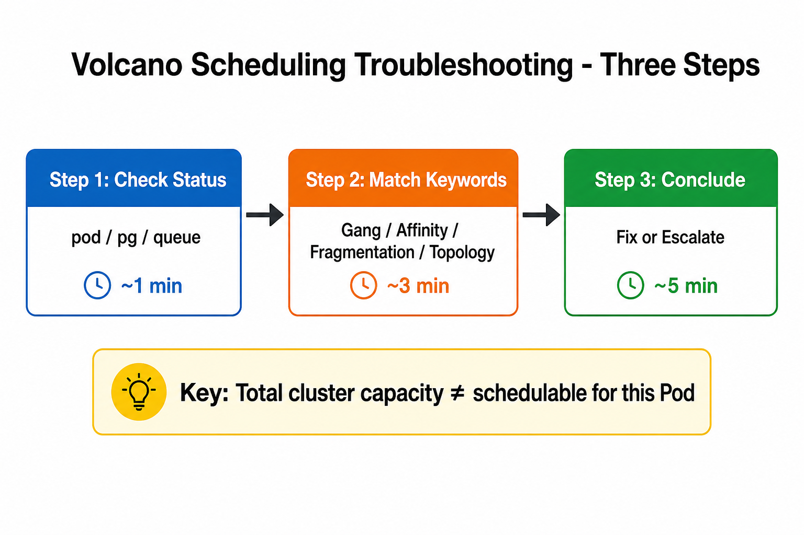
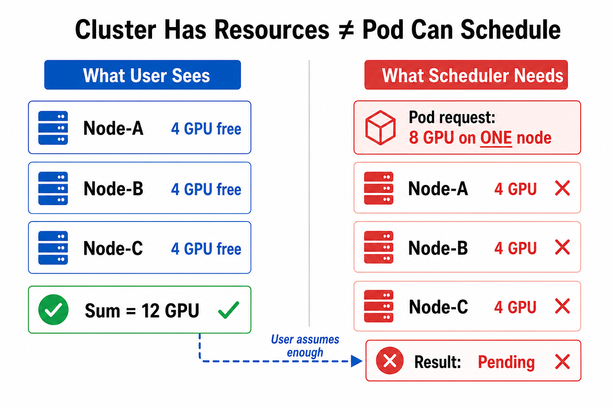
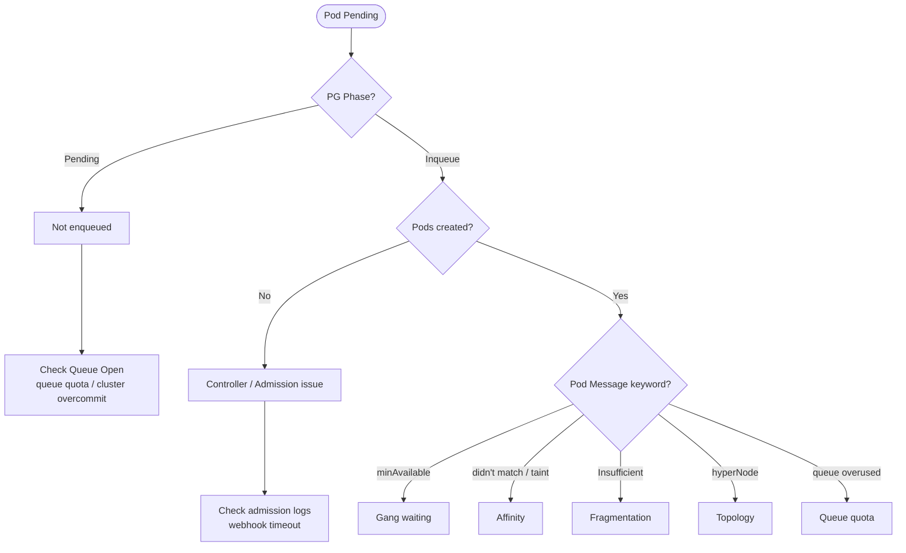
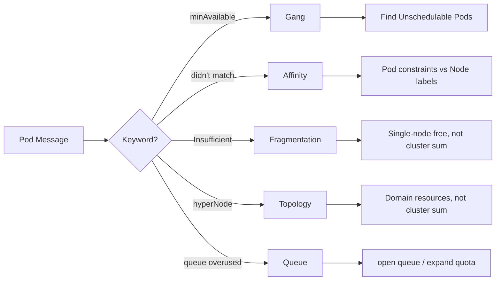
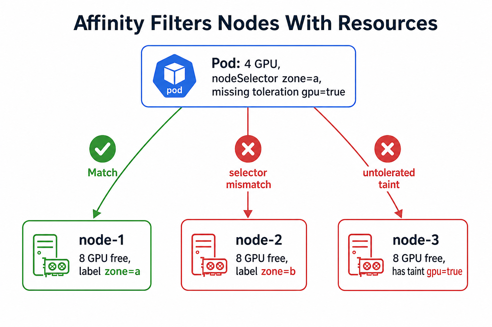
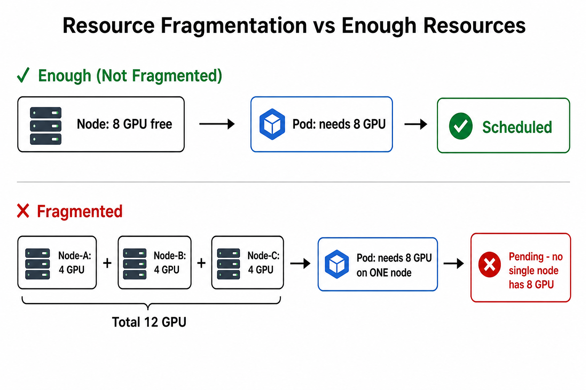
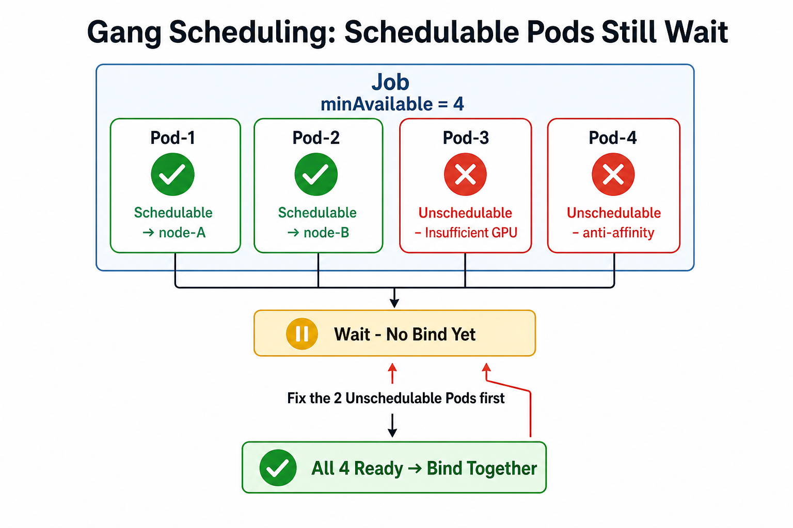
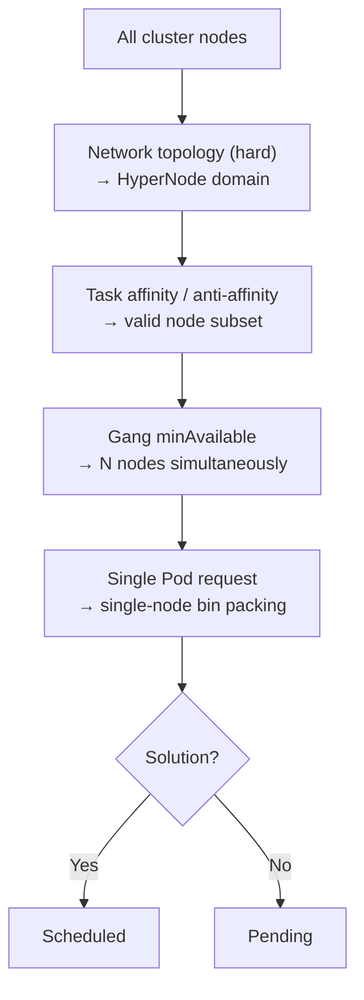
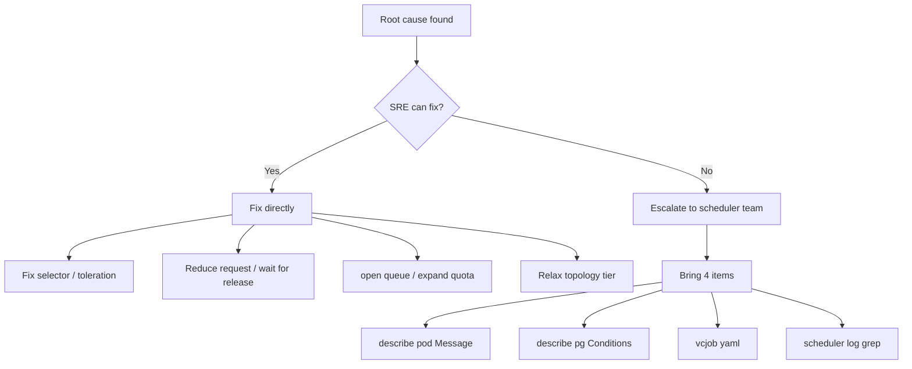

# Scheduling Pending Troubleshooting Guide

> **Most common user question**: "The cluster has available resources, why is my Pod still Pending?"

This guide uses a three-step approach (**三板斧**) for SRE teams to triage and resolve scheduling issues independently.

## Overview



| Step | Action | Time |
|------|--------|------|
| **Step 1: Check status** | Inspect Pod, PodGroup, Queue | ~1 min |
| **Step 2: Match keywords** | Route by PodScheduled Message | ~3 min |
| **Step 3: Conclude** | Fix or escalate with evidence | ~5 min |

> **Key insight**: Total cluster capacity ≠ schedulable for this Pod. Always read the Pod Message first, not node aggregate totals.



---

## Step 1: Check Status

Run these three commands in order:

```bash
kubectl describe pod -n <ns> <pod>      # ① Pod Event / PodScheduled Message
kubectl describe pg -n <ns> <pg>        # ② PodGroup Conditions
kubectl get queue <q> -o jsonpath='{.status.state}{"\n"}'  # ③ Queue Open?
```

### Decision Tree



### Quick Reference

| What you see | Problem | Go to |
|--------------|---------|-------|
| PG Phase = `Pending` | Not enqueued | Queue Closed / quota / overcommit |
| PG Phase = `Inqueue`, no Pods | Controller / Admission | admission logs |
| Message contains `once minAvailable is satisfied` | **Gang waiting** | [Gang](#gang-scheduling) |
| Message contains `didn't match` / `taint` | **Affinity** | [Affinity](#affinity--taints) |
| Message contains `Insufficient xxx` | **Fragmentation** | [Fragmentation](#resource-fragmentation) |
| Message contains `In hyperNode` | **Topology** | [Topology](#network-topology) |
| `queue overused` / `quota insufficient` | **Queue quota** | [Queue](#queue-quota) |

---

## Step 2: Match Keywords

Search the Pod `PodScheduled` Message for keywords and follow the matching section.



### Affinity / Taints



| Message fragment | Meaning | Fix |
|------------------|---------|-----|
| `didn't match node affinity/selector` | nodeSelector / nodeAffinity mismatch | Fix labels or relax selector |
| `didn't match pod anti-affinity` | Conflicting Pod on same node/domain | Check Pod distribution |
| `untolerated taint` | Missing toleration | Add toleration or remove taint |
| `pod number exceeded` | Node max Pods reached | Not a CPU/memory issue |

```bash
kubectl get pod <pod> -o yaml | grep -A30 "nodeSelector\|affinity\|tolerations"
kubectl describe node <node> | grep Taints
```

**Volcano task-topology** (if plugin enabled):

```yaml
volcano.sh/task-topology-affinity: "ps,worker"       # must co-locate
volcano.sh/task-topology-anti-affinity: "worker"      # must spread across nodes
volcano.sh/task-topology-task-order: "ps,worker"     # ps first, then worker
```

### Resource Fragmentation



```
Insufficient cpu/memory/gpu  →  no single node can fit this Pod
```

```bash
kubectl get pod <pod> -o jsonpath='{.spec.containers[*].resources.requests}'
kubectl describe node <node> | grep -A10 "Allocated resources"
```

**Typical false alarm**: cluster has 12 GPU free, but Pod needs 8 GPU on one node and max per-node free is 4 → **fragmentation**, not shortage.

### Gang Scheduling



```
can possibly be assigned to nodeX, once minAvailable is satisfied  →  Pod fits, waiting for Gang
X/Y tasks in gang unschedulable; Pending: A Schedulable, B Unschedulable  →  fix the B Pods
```

```bash
kubectl get vcjob <job> -o jsonpath='minAvailable={.spec.minAvailable}{"\n"}'
kubectl get pod -l volcano.sh/job-name=<job> -o jsonpath='{range .items[*]}{.metadata.name}{": "}{.status.conditions[?(@.type=="PodScheduled")].message}{"\n"}{end}'
```

**One-liner**: Gang = Bind only after `minAvailable` Pods are ready; schedulable Pods still wait.

### Network Topology

```
In hyperNode xxx: ... unavailable  →  insufficient resources within topology domain
```

```bash
kubectl get vcjob <job> -o jsonpath='{.spec.networkTopology}'
kubectl get hypernode
```

Compare resources **within the HyperNode domain**, not cluster-wide totals.

### Queue Quota

Not a physical resource issue — queue `capability` / `deserved` is exhausted.

```bash
kubectl get queue <q> -o yaml | grep -A20 "status:"
vcctl queue operate -a open -n <q>   # if Closed
```

---

## Constraint Stacking

Scheduling fails if **any** layer cannot be satisfied:



---

## Step 3: Conclude



| Root cause | SRE self-service | Escalate |
|------------|------------------|----------|
| Affinity / taint misconfiguration | Fix Pod spec | — |
| Fragmentation | Reduce request / add nodes / wait | Custom plugin behavior |
| Gang partial Unschedulable | Fix the slowest Pods | minAvailable policy disputes |
| Topology domain insufficient | Relax `highestTierAllowed` | Topology plugin logic |
| Queue Closed | `vcctl queue operate -a open` | — |
| Queue quota full | Adjust capability/weight | Capacity plugin customization |

### User Response Templates

| Scenario | Response |
|----------|----------|
| Cluster GPU enough but Pod Pending | Pod needs X GPU on **one node**; max free per node is Y — **fragmentation** |
| Pod shows Schedulable but not Running | Normal Gang behavior; waiting for minAvailable Pods |
| 3 Schedulable + 3 Unschedulable | Not a total resource issue; check the 3 Unschedulable Pods |
| Node labels look correct | Likely pod anti-affinity or networkTopology hard constraint |
| Queue has capacity but Job Pending | Queue quota vs cluster physical resources are different dimensions |

---

## Information Collection Template

Ask users to provide:

```bash
# 1. Pending Pod scheduling message
kubectl get pod -n <ns> <pod> -o jsonpath='{.status.conditions[?(@.type=="PodScheduled")]}' | jq .

# 2. PodGroup Conditions
kubectl get pg -n <ns> <pg> -o jsonpath='{.status.conditions}' | jq .

# 3. Pod resource requests
kubectl get pod -n <ns> <pod> -o jsonpath='{.spec.containers[*].resources.requests}'

# 4. Job config
kubectl get vcjob -n <ns> <job> -o jsonpath='{
  minAvailable: .spec.minAvailable,
  networkTopology: .spec.networkTopology
}' | jq .

# 5. Node allocation on a "free-looking" node
kubectl describe node <node> | grep -A15 "Allocated resources"

# 6. Queue status
kubectl get queue <q> -o jsonpath='{.status.state}{"\n"}{.status.allocated}'
```

---

## Related Docs

- [Configure Scheduler](../user-guide/how_to_configure_scheduler.md) — actions, plugins, tiers
- [Tune Performance](../user-guide/how_to_tune_volcano_performance.md) — webhook, large-scale tuning
- [Network Topology](../user-guide/how_to_use_network_topology_aware_scheduling.md)
- [Task Topology](../user-guide/how_to_use_task_topology_plugin.md)
- [PodGroup Status](../design/podgroup-status.md)
- [Scheduling Reason](../design/scheduling-reason.md)
