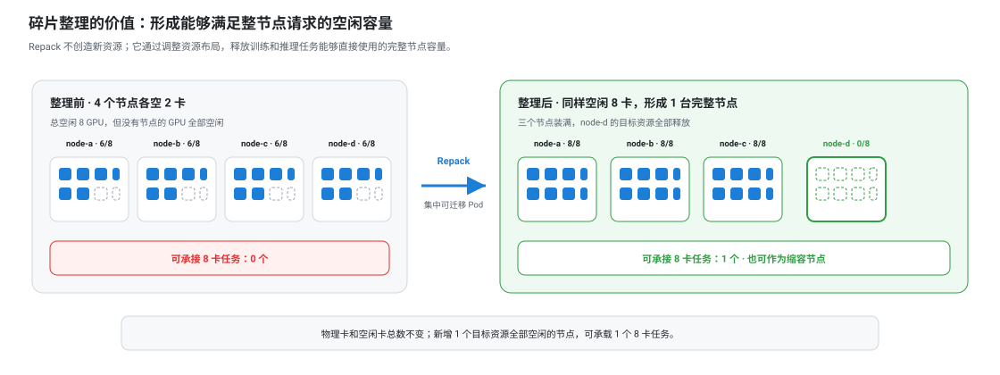
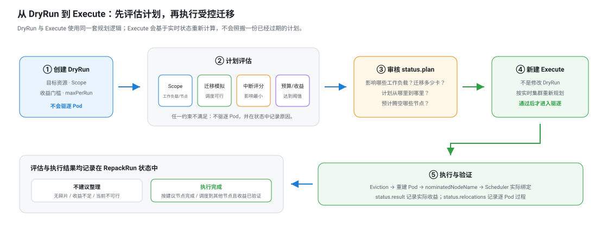
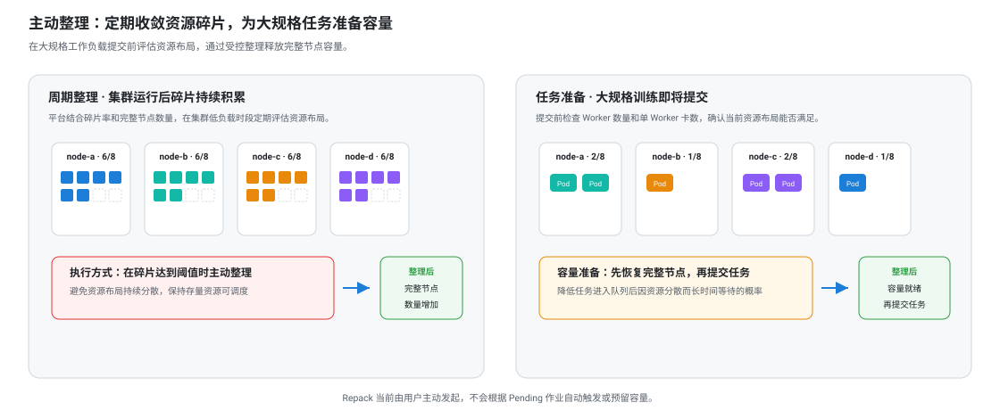
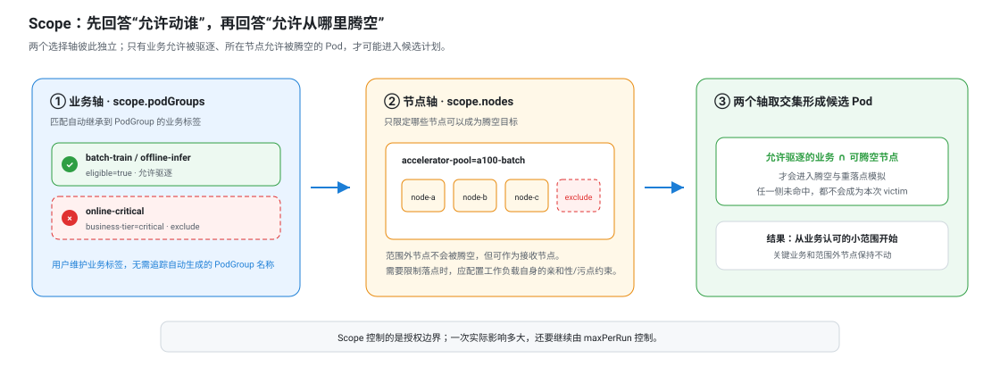
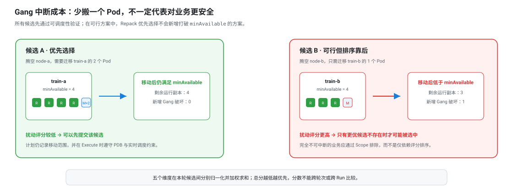
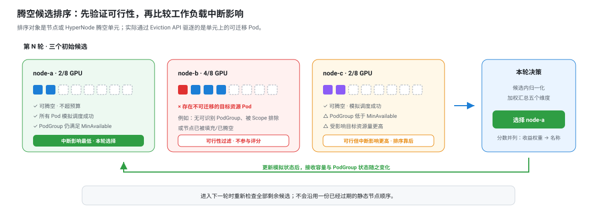
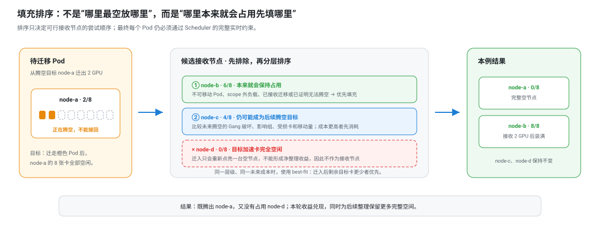
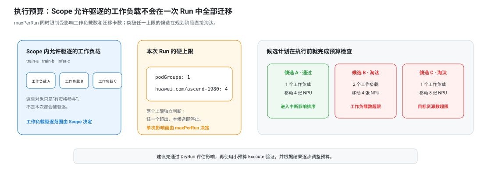

# Repack 异构资源碎片整理用户指南

> Repack 当前为预览能力，默认关闭。生产环境启用前，应先在测试集群完成验证；在生产集群验证时，应通过 Scope 和 `maxPerRun` 严格限制工作负载、节点及目标资源范围。

本文面向集群管理员和平台运维人员，介绍 Repack 的适用场景、规划机制、安全控制、操作方法及 API 状态语义。

本文是 Repack 的唯一用户文档。社区方案与技术实现分别见 [Repack Proposal](../design/repack-runtime-defragmentation.md) 和 [Repack 技术设计](../design/repack-design.md)。

> **术语说明**：本文使用“工作负载”统称 VCJob、ModelServing、Deployment、StatefulSet 等由控制器管理的 Pod 集合；“PodGroup”仅指 Volcano 用于 Gang 调度的资源对象；“迁移”指驱逐原 Pod、由工作负载控制器创建新 Pod 并重新调度，不表示运行中的 Pod 被原地迁移。

> **阅读建议**：首次评估只需阅读“背景、功能、前提条件、约束和限制、开启方式”；准备配置时，再按需查看“功能详解与配置示例”。“从最简用法到完整配置”提供从 VCJob/ModelServing 到 DryRun、Execute 和结果确认的一套连续流程。

## 快速了解

Repack 用于解决一种常见的容量问题：集群仍有空闲 NPU/GPU，但空闲卡分散在多个节点，无法直接满足完整节点或固定单 Pod 卡数的任务。它通过受控迁移现有工作负载，把零散占用收敛到部分节点，释放能够直接用于后续任务的完整节点容量。

用户可以按三个步骤使用：

1. 创建 `DryRun`，查看预计释放节点、迁移 Pod 和受影响工作负载；
2. 根据报告收紧工作负载 Scope、节点池范围和 `maxPerRun`；
3. 创建独立的 `Execute`，观察逐 Pod 驱逐、替身调度和最终收益。



如果只想快速开始，可直接跳到[最简推荐用法](#1-最简推荐用法先执行-dryrun)；需要控制业务影响时，再阅读 [Scope](#2-使用-scope-限定驱逐范围)、[Gang 中断影响](#4-以-gang-语义评估工作负载中断影响)和[执行预算](#6-通过执行预算限制单次影响范围)。

## 背景

Repack 解决的是“集群仍有空闲卡，但资源布局无法满足目标工作负载”这一运行时容量问题。集群长期经历任务结束、扩缩容、滚动更新和故障恢复后，NPU/GPU 空闲容量会分散到不同节点；即使设备总量充足，也可能无法满足工作负载所需的完整节点、单 Pod 卡数或拓扑组合。

### 资源布局影响工作负载的可调度性

异构资源的容量不能仅由设备总数或空闲率衡量。训练与推理任务通常具有固定的单 Pod 卡数和节点规格要求。只有布局满足工作负载资源规格的空闲设备，才是能够直接分配的可调度容量。

以一个训练、推理混部的千卡资源池为例。监控系统显示仍有 192 张设备空闲，账面空闲率接近 20%。此时，一个分布式训练任务申请 32 张设备，由 4 个各占用整机 8 卡的 Worker 组成，并要求放置在同一调度拓扑域内。

从设备总量看，剩余容量足以运行 6 个此类任务；但从实际布局看，空闲设备分散在多个节点和拓扑域中，部分原本满足条件的整机节点又被单卡推理副本或小规模开发任务占用。在任一候选拓扑域内，均无法提供 4 个完整且满足约束的节点。最终结果是：集群仍有 192 张空闲设备，但对这一任务规格而言，有效可调度容量为 0。

这类现象揭示了 AI 集群容量管理中的关键差异：设备利用率衡量资源是否被占用，可调度容量则衡量当前资源布局能否满足目标任务的资源规格。容量管理因此不能只回答“还剩多少张卡”，还要回答“这些卡能否满足工作负载的资源请求”。

### 碎片是集群持续运行后的常态

资源碎片通常不是一次错误调度造成的，而是多租户集群长期运行的结果。训练任务的设备规模和运行时长差异较大；推理服务持续扩缩容、滚动升级和故障重建；任务完成、重试和优先级调整又会不断释放或重新占用局部资源。即使初始布局接近最优，随着时间推移也会逐步偏离。

同一集群还可能同时承载单卡推理、小规模开发任务和多节点训练。小任务具有更高的放置灵活性，但如果持续占用大规格任务所需的完整节点或拓扑域，就会把可用容量切分为无法组合的局部余量。当集群负载较高时，碎片通常先表现为大规格任务排队，而不是设备利用率立即下降。

因此，仅依赖新 Pod 调度时的装箱策略无法完全解决问题。调度器可以优化当前放置，却无法预知后续任务的资源规格，也不会主动重排已经运行的工作负载。运行时碎片整理需要作为常规调度的补充，对现有资源布局进行受控调整。

### 训练与推理工作负载具有更高的迁移成本

通用无状态服务通常可以逐副本重建，而 AI 工作负载中的 Pod 往往属于同一个训练任务、推理服务或 PodGroup。驱逐一个 Pod 可能改变整个任务的运行状态，甚至触发工作负载控制器重建整个工作负载，或重建同一 PodGroup 中的所有 Pod：

- 分布式训练通常声明最小可用成员数；剩余成员低于该阈值时，整个任务可能无法继续运行；
- 大规格任务需要完整节点或连续拓扑域，分散空闲设备无法通过简单累加满足请求；
- 推理 Pod 重建可能涉及模型加载、缓存预热和流量恢复，迁移会直接占用服务冗余；
- 节点上的资源余量只是必要条件，接收节点还必须满足工作负载原有的调度约束。

因此，AI 资源整理不能等同于普通 Pod 重调度。判断一个计划是否合理，既要评估资源收益，也要尽量减少受影响的工作负载数量，并优先迁移不会使 PodGroup 低于 `MinAvailable` 的 Pod。

### 运行时整理的难点在于形成可执行方案

发现空闲卡分散，只能说明集群可能存在整理空间，不能直接推导出应该迁移哪些 Pod。真正执行整理时，需要连续解决以下问题：

1. **整理后是否能形成实际收益**：将 Pod 从一个节点迁移到另一个节点，可能只是改变了碎片位置。只有释放完整的目标资源节点，并使整体布局更紧凑，迁移成本才换来了可使用的容量改善。
2. **腾空哪个节点对工作负载影响更小**：目标资源占用最少的节点不一定最适合腾空。该节点上的 Pod 可能分属多个工作负载，迁移后会扩大影响范围；也可能使某个训练任务低于最小可用成员数。候选选择需要从完整迁移方案评估影响，而不能只比较节点上的卡数。
3. **被迁移的 Pod 是否有可行接收节点**：接收节点有空闲卡不代表一定能够承载目标 Pod。规划需要继承工作负载原有的调度要求，并累计前序迁移已经消耗的容量，避免多个单独可行的放置组合后相互冲突。
4. **如何避免整理产生新的碎片**：接收节点选择不当，会把原节点上的零散占用重新摊到更多节点。迁移需要优先填充确定会继续使用的节点，在释放腾空节点的同时保持剩余布局紧凑。
5. **如何控制一次整理的影响范围**：运行中的训练和推理工作负载不能被无限制迁移。平台需要明确允许驱逐的工作负载和可腾空节点，并限制单次影响的工作负载数量与目标资源迁移量。
6. **如何应对规划后集群状态变化**：从方案生成到 Pod 完成重建期间，节点资源、调度队列和驱逐条件都可能变化。计划需要能够审核，执行时需要重新校验，并记录计划节点、实际调度节点和最终收益。

因此，运行时碎片整理不是简单的 Pod 迁移，而是一次具有收益目标、驱逐范围、执行预算和结果验证的容量变更。Repack 围绕这一过程提供规划与执行能力，用于周期性碎片整理、大规格任务提交前的容量准备，以及节点维护前的目标资源腾空。

## 功能

Repack 是 Volcano 面向异构资源的运行时碎片整理能力。它在不改变工作负载资源请求的前提下调整现有 Pod 的节点分布，将分散的空闲资源集中到部分节点，释放完整节点容量。规划以节点腾空为目标，以 PodGroup 识别受影响的工作负载并评估中断影响；执行阶段逐 Pod 记录驱逐、重建 Pod 识别和调度结果。

Repack 面向一次明确的碎片整理目标：在限定的工作负载驱逐范围和执行预算内，通过迁移现有 Pod 释放完整的目标资源节点。一次整理只有同时满足以下条件才会被推荐：

- **恢复有效容量**：能够释放至少一个完整的目标资源节点，并达到碎片改善阈值；
- **降低工作负载中断影响**：在可行候选中优先影响更少的工作负载，并优先选择迁移后仍满足 PodGroup `MinAvailable` 的方案；
- **迁移路径通过可行性验证**：所有计划迁移的 Pod 都能基于当前集群快照和调度规则完成模拟放置，组合后的接收容量仍然成立；
- **工作负载影响可控**：只驱逐 Scope 允许的工作负载，并且不突破单次工作负载数量与目标资源迁移预算；
- **过程可以核验**：规划、驱逐、重建后的 Pod、建议节点和实际调度结果均记录在 `RepackRun` 状态中。

> **关于建议节点**：Repack 验证规划时刻的迁移可行性，但不会锁定接收节点或预留资源。Execute 期间通过 `nominatedNodeName` 向 Volcano Scheduler 提供候选节点建议，最终绑定结果仍由 Scheduler 根据实时集群状态决定。

用户通过集群级 CRD `RepackRun` 发起一次整理。每个 Run 面向一种扩展资源，例如昇腾 NPU 资源 `huawei.com/ascend-1980`；GPU 资源的使用方式相同，并支持两种不同的执行模式：

- `DryRun` 基于当前集群状态计算方案，不驱逐 Pod，用于判断预计释放的完整节点、受影响工作负载、中断影响和迁移路径；
- `Execute` 重新读取实时状态并生成可执行方案，通过 Kubernetes Eviction API 发起迁移，并跟踪重建后的 Pod 或新一代 PodGroup 的调度结果。

这两种模式使碎片整理具备明确的目标、驱逐范围、执行预算和结果记录。



### 能力一览

用户可以先通过本节判断 Repack 是否适合当前场景，后续章节再按需查看具体配置和示例：

- **目标与收益**：指定一种 NPU/GPU 扩展资源，以碎片率下降和完整节点释放衡量容量改善；
- **工作负载驱逐范围**：按标签或名称选择允许被驱逐的工作负载，并限定可腾空节点；
- **调度可行性**：使用 Volcano Scheduler 的调度规则验证接收节点，避免仅按资源数量生成迁移方案；
- **Gang 中断影响评估**：识别 VCJob、ModelServing 等工作负载的 PodGroup，减少受影响工作负载数量，并评估迁移后 PodGroup 是否仍满足 `MinAvailable`；
- **节点选择与装箱**：动态选择腾空节点，并按 best-fit 等策略填充接收节点，抑制二次碎片；
- **变更影响范围控制**：限制单次影响的工作负载数量和目标资源迁移量；
- **候选节点建议**：通过 `nominatedNodeName` 提高重建 Pod 调度到建议节点的概率，不进行强制绑定或资源预留；
- **结果记录与验证**：记录受影响的工作负载、逐 Pod 驱逐与调度过程，以及最终节点腾空结果；工作负载就绪状态仍需通过 VCJob、ModelServing 和 Pod 状态确认。

Repack 当前适合由平台主动发起的周期性碎片整理、大规格训练任务提交前容量准备、计划性推理扩容，以及节点维护前的目标资源腾空。它不会持续监听 Pending 作业并自动触发，也不会为后续任务预留已释放容量。



## 前提条件

1. 集群已部署 Volcano Scheduler，目标加速卡资源已由设备插件正确上报。
2. 允许被驱逐的目标资源 Pod 由 Volcano 调度，并关联可识别的 PodGroup。Repack 通过 PodGroup 识别受影响的工作负载，并读取 `MinAvailable` 评估迁移造成的中断影响。
3. 工作负载由 VCJob、ModelServing、Deployment、StatefulSet 等控制器管理，确保 Pod 被驱逐后能够重新创建。
4. Volcano Scheduler 能够正常调度这些工作负载。Repack 使用相同的调度配置模拟 Pod 迁移。
5. 操作身份具备创建、查看和删除 `RepackRun` 的权限；平台管理员还需具备部署组件和配置 RBAC 的权限。
6. 使用 ModelServing 时，集群已部署兼容版本的 Kthena CRD 和 controller，能够将工作负载标签同步到自建 PodGroup；同时 Volcano 的 Repack placement admission webhook 正常工作，能够协调 PodGroup 重建时产生的新 PodGroup 和 Pod。

## 约束和限制

- `RepackRun` 是一次性任务，`spec` 创建后不可修改；调整目标、范围或预算需要创建新的 Run。
- 每个 Run 当前只支持一种带 `/` 的扩展资源。`cpu`、`memory`、`ephemeral-storage` 和 `pods` 等原生资源不属于整理目标。
- 为控制规划开销，Repack 基于当前集群快照采用启发式搜索，不承诺获得全局最优解。系统仅推荐预计能够释放完整目标资源节点并达到收益门槛的方案；实际收益以执行结果为准。算法边界与设计取舍见 [Repack 技术设计：启发式边界](../design/repack-design.md#88-启发式边界)。
- Execute 在集群内串行执行；同一时刻只运行一个 Execute，并在完成后进入冷却时间。DryRun 不受该并发限制。
- `scope.podGroups` 限定允许被驱逐的工作负载，`scope.nodes` 限定可腾空节点；`scope` 为空表示在全局范围评估。
- Repack 只整理目标扩展资源。不申请目标资源的 DaemonSet、系统 Pod 和普通 Pod 不会被迁移，也不会阻止目标资源腾空。
- 请求目标资源但不满足可迁移条件的 Pod 会阻止所在节点被腾空，例如使用 kube-scheduler、缺少 PodGroup、被 `scope` 排除或不满足其他可迁移要求的 Pod。
- Repack 与常规资源调度并行运行，不锁定规划时的节点资源，也不暂停工作负载的创建、删除或调度。并发状态变化可能使实际布局偏离计划，甚至导致计划无法完整执行，属于预期行为。
- Execute 通过 Kubernetes Eviction API 驱逐 Pod，由 API Server 按实时状态校验 PDB。Repack 不提前规划 PDB 规避策略；PDB 不允许驱逐时，对应迁移可能失败。
- Repack 不执行抢占、不 cordon 节点，也不通过污点独占已释放容量。
- Repack 通过 `pod.status.nominatedNodeName` 为重建 Pod 提供候选节点建议，不绑定节点或预留资源。重建 Pod 仍由 Volcano Scheduler 统一调度；发生资源竞争时，可能调度到其他节点或保持 Pending，Repack 不保证其在本次整理周期内恢复调度。
- Repack 不会根据 Pending 作业自动触发整理，也不会为计划外的后续任务预留已释放资源；周期性整理和大任务提交前整理需要由用户或外部平台流程发起。
- VCJob 的 `PodEvicted` 生命周期策略或 ModelServing 的 `ServingGroupRecreate` 可能将单个 Pod 驱逐放大为多个 Pod 重建。Repack 当前不评估上层控制器的级联重建成本，实际中断范围可能大于计划迁移的 Pod 数量。

## 开启方式

Repack 默认关闭，可通过 Helm 开启：

```bash
# 使用与当前安装一致的 chart、release 名称和 namespace。
helm upgrade --install volcano ./installer/helm/chart/volcano \
  --namespace volcano-system --create-namespace \
  --set custom.repack_enable=true \
  --set custom.repack_default_resource=huawei.com/ascend-1980
```

该开关部署 `volcano-repack-engine`，同时启用 Volcano Controller Manager 内置的 Repack controller 并配置所需 RBAC，无需部署独立的 Repack controller。确认组件就绪：

```bash
kubectl -n volcano-system get deployment volcano-repack-engine
kubectl get crd repackruns.repack.volcano.sh
kubectl get repackrun
```

`custom.repack_enable` 默认为 `false`；chart 中 `custom.repack_default_resource` 的默认值为 `nvidia.com/gpu`，上述命令将其改为昇腾 NPU 资源。生产 Run 建议始终显式填写 `spec.goals`，不要依赖全局默认值。默认扫描周期为 5 分钟，Execute 冷却时间为 10 分钟，可通过 `custom.repack_schedule_period` 和 `custom.repack_execute_cooldown` 调整。排障时可将 `custom.repack_log_level` 从 `3` 临时提高到 `4` 或 `5`。

## 功能详解与配置示例

### 1. 以完整节点释放衡量整理收益

对于具有固定单 Pod 卡数或整节点需求的工作负载，空闲卡能否用于调度，取决于单个节点的剩余容量是否满足其资源请求。Repack 保持现有资源请求总量不变，通过减少目标资源的占用节点数、释放目标资源全部空闲的节点来衡量碎片改善。

#### 碎片率计算

对于目标资源 `R`：

```text
                         当前占用节点数 - 理论最少占用节点数
碎片率(R) =  ------------------------------------------------------- × 100%
                              提供资源 R 的节点数
```

- **提供资源的节点数**：`Allocatable[R] > 0` 的节点数；
- **当前占用节点数**：正在使用资源 `R` 的节点数；
- **理论最少占用节点数**：保持当前资源请求不变，紧凑装箱所需的最少节点数。

例如，20 个 NPU 节点中有 15 个正在使用，理论上最少只需占用 12 个节点。本次计划再释放 2 个节点：

```text
整理前：(15 - 12) / 20 × 100% = 15%
整理后：(13 - 12) / 20 × 100% = 5%
改善幅度：10 个百分点
```

`minFragImprovementPercent: 10` 表示碎片率至少下降 10 个百分点。碎片率按全集群统计，`scope.nodes` 只限制可腾空节点，不改变统计范围。该指标衡量布局紧凑程度，不代表某个未来任务一定可以调度；计划中的每个迁移仍需通过 Scheduler 可行性验证。

Repack 使用 `goals` 指定目标资源和最低改善幅度。方案必须至少释放一个目标资源节点，并达到配置的改善阈值。

#### 配置示例

```yaml
goals:
  - resource: huawei.com/ascend-1980
    # 碎片率至少下降 10 个百分点，本次整理才具有执行价值。
    minFragImprovementPercent: 10
```

布局已足够紧凑时，Run 以 `NoFragmentation` 结束；存在碎片但无法达到收益门槛时，以 `InsufficientImprovement` 结束。两者都属于正常评估结果。

### 2. 使用 Scope 限定驱逐范围

碎片整理会驱逐运行中的工作负载。`scope` 从两个维度限定本次操作范围：

- `scope.podGroups` 定义哪些工作负载的目标资源 Pod 允许被驱逐；
- `scope.nodes` 定义哪些节点允许作为腾空目标。

例如，训练、推理工作负载部署在同一集群时，可以允许低优先级训练和离线推理参与整理，同时排除关键在线推理；节点侧还可以只选择某个节点池作为本次腾空范围，其他提供相同 NPU 资源的节点池不参与本次整理。

#### 配置示例

```yaml
scope:
  podGroups:
    include:
      selector:
        matchLabels:
          repack.volcano.sh/eligible: "true"
    exclude:
      selector:
        matchLabels:
          repack.volcano.sh/protected: "true"
  nodes:
    include:
      selector:
        matchLabels:
          accelerator-pool: ascend-npu
    exclude:
      names: [ascend-maintenance-01]
```

VCJob controller 会把 Job 标签复制到其 PodGroup，Kthena 会把 ModelServing 标签复制到各 ServingGroup 对应的 PodGroup；通用 pg-controller 也会继承 Deployment、StatefulSet 等工作负载 Pod 模板中的稳定标签。用户只需在工作负载上维护标签，再通过标签选择器配置驱逐范围，无需识别和维护自动生成的 PodGroup 名称。

同一 `include` 或 `exclude` 中，名称列表与标签选择器取并集，且 `exclude` 的优先级更高。PodGroup 名称采用 `namespace/name`，节点直接使用节点名。对于自动创建的 PodGroup，推荐使用工作负载标签而不是名称。

需要特别注意：`scope.nodes` 限定的是“哪些节点允许被腾空”，并不限定 Pod 的接收节点。如果工作负载不能离开指定资源池，应通过节点亲和性、污点/容忍或其他原生调度约束表达；Repack 会在规划时继承这些约束。



### 3. 基于完整调度语义验证迁移可行性

设备数量能够相加，只能说明计划在资源总量上成立，并不能证明 Pod 可以实际调度。Repack 在生成计划时复用 Volcano Scheduler 的集群快照和过滤逻辑，对每个待迁移 Pod 模拟重新调度，验证其原有调度约束和节点剩余资源是否允许迁移。

一个节点能否作为腾空候选，也通过统一的可迁移性判断完成：

- 不申请本次目标资源的 DaemonSet、CNI、kube-proxy 和普通 Pod 不参与迁移，也不会阻止目标资源腾空；
- 申请目标资源的 Pod 必须由 Volcano 调度、关联可识别的 PodGroup，并属于 `scope.podGroups` 允许驱逐的工作负载；
- 任一目标资源 Pod 不可迁移，或者任一待迁移 Pod 没有可行接收节点，该候选即被淘汰。

模拟过程会累计已经规划的迁移，避免多个局部可行方案组合后超过接收节点容量。它验证的是当前快照下是否存在完整迁移路径，不保证未来集群状态。模拟选出的接收节点不会触发资源预留；Execute 会重新规划，并通过 `nominatedNodeName` 提供候选节点建议，最终绑定结果仍由 Scheduler 根据实时状态决定。

#### 验证示例

先检查目标节点上的 NPU Pod 是否使用 Volcano Scheduler 并关联 PodGroup，再通过 `-v=4` 日志确认节点被过滤的具体原因：

```bash
kubectl get pod -A --field-selector spec.nodeName=ascend-node-01 \
  -o custom-columns=NAMESPACE:.metadata.namespace,NAME:.metadata.name,SCHEDULER:.spec.schedulerName
kubectl get podgroup -A
kubectl -n volcano-system logs deploy/volcano-repack-engine --since=10m \
  | grep -E 'not freeable|immovable|no feasible receiver'
```

如果目标资源 Pod 使用 `kube-scheduler`、缺少 PodGroup、被 Scope 排除或没有满足原调度约束的接收节点，该节点不会进入可腾空计划。不申请目标资源的 DaemonSet 和普通 Pod 不会因为存在于节点上而直接阻止整理。

### 4. 以 Gang 语义评估工作负载中断影响

在分布式训练和模型推理中，整理方案不应将迁移分散到大量工作负载。即使迁移 Pod 总数相同，从一个工作负载迁移多个 Pod 通常也比从多个工作负载各迁移一个 Pod 具有更小的影响范围。Repack 因此以 PodGroup 作为中断影响统计单元，对每个可行腾空方案计算多维成本。

#### 是否低于 Gang 最小可用成员数

对于一个 PodGroup，Repack 从 Scheduler 快照读取 Running 成员数和 `MinAvailable`，计算不影响 Gang 最小可用条件的最大迁移 Pod 数：

```text
可安全迁移的 Pod 数 = max(Running - MinAvailable, 0)
```

- 计划迁移数不超过该值：PodGroup 仍满足 `MinAvailable`，受影响目标资源量按实际迁移量计算。
- 计划迁移数超过该值：PodGroup 将低于 `MinAvailable`，低于最小可用成员数的 PodGroup 数量增加；受影响目标资源量按整个 PodGroup 的目标资源占用量计算。

对于 VCJob，用户配置的是 `spec.minAvailable`，Job controller 会将其转换为调度器内部使用的 PodGroup 最小成员要求。Repack 最终使用 Scheduler `JobInfo` 中的 `MinAvailable` 进行判断。

例如，一个训练任务当前有 8 个 Running Worker，`minAvailable: 6`：

- 迁移 1～2 个 Worker 后仍满足 `minAvailable`；
- 迁移第 3 个 Worker 后低于 `minAvailable`，Repack 将整个 PodGroup 的 NPU 占用计入受影响目标资源量。

#### 多维中断影响评分

每个活动候选都按“已选迁移 + 当前候选预期迁移”的完整计划计算五个维度，而不是只评价当前节点上的局部 Pod：

- **受影响工作负载数，默认权重 10**：尽量减少同时受到迁移影响的训练或推理工作负载；系统内部按不同 PodGroup 计数；
- **低于 `MinAvailable` 的 PodGroup 数，默认权重 8**；
- **受影响目标资源量，默认权重 6**：PodGroup 仍满足 `MinAvailable` 时计算实际迁移卡数，否则计算整个 PodGroup 的卡数；
- **迁移目标资源量，默认权重 3**：在工作负载影响接近时减少迁移的 NPU/GPU 数量；
- **迁移 Pod 数，默认权重 1**：进一步减少驱逐与重建对象数量。

每个维度的原始中断成本都在当前一轮候选之间反向归一化为 `0～100` 的整数分：成本越低，得分越高。候选总分为 `Σ(策略得分 × 权重)`，总分越高越优先。权重越大，该维度对综合排序的影响越强；权重为 `0` 时关闭对应评分项。分数只用于同一规划轮次内的相对选择，不能跨集群或跨 Run 比较。

例如，三个方案都能释放一个节点并迁移 3 张卡：方案 A 从同一工作负载迁移 3 个 Pod，且迁移后仍满足 `MinAvailable`；方案 B 从 3 个工作负载各迁移 1 个 Pod；方案 C 只影响 1 个工作负载，但迁移后低于 `MinAvailable`。综合评分通常优先方案 A；方案 B 的工作负载影响范围更大，方案 C 在低于 `MinAvailable` 的 PodGroup 数和受影响目标资源量两个维度上的成本更高。

`scope` 和 `maxPerRun` 是硬性限制，中断影响评分只用于在满足限制的候选方案中排序。评分倾向于减少受影响工作负载，并避免使 PodGroup 低于 `MinAvailable`，但不会将其作为禁止条件。不可中断的工作负载应通过 `scope.podGroups.exclude` 明确排除。



### 5. 动态选择腾空目标，并抑制二次碎片

Repack 的规划不是预先排好一次节点顺序后逐个执行。规划器采用增量方式工作：每选定一个腾空方案，都会把相应迁移计入模拟状态，再重新评估剩余候选。这样可以处理接收容量被前序迁移消耗、PodGroup 影响范围扩大，以及后续节点腾空代价发生变化等情况。

#### 腾空候选的选择

规划开始时，Repack 会一次性识别可腾空候选，并缓存待迁移 Pod、工作负载信息和节点目标资源余量。每一轮先排除已被使用、超出执行预算或接收总容量不足的候选，再按综合得分从高到低排序。该总分同时考虑受影响工作负载数、低于 `MinAvailable` 的 PodGroup 数、受影响目标资源量、迁移资源量和迁移 Pod 数。分数相同时，继续比较腾空收益和候选名称，以获得稳定结果。

候选排序完成后，Repack 从第一名开始执行完整 Scheduler 模拟，选择第一个所有待迁移 Pod 都具有可行落点的候选；若校验失败，则继续尝试下一名。这样既保留 Volcano Scheduler 的完整可行性判断，也避免在大规模集群中每轮预先模拟全部候选。每次提交后，剩余候选会基于已消耗容量和累计工作负载影响重新评分。

因此，Repack 选择的不是“当前空闲卡最多的节点”，而是“能够腾空、具备完整迁移路径，并且工作负载中断影响相对较低的节点”。



#### 接收节点的填充

把 Pod 从源节点移走并不等于碎片得到改善。如果接收节点选择不当，迁移可能只是把碎片从一个位置转移到另一个位置。Repack 按以下原则组织接收节点：

1. 排除正在腾空的节点，并避免重新占用目标资源完全空闲的节点；
2. 优先填充因为工作负载不允许被驱逐、范围限制或既有迁移而确定会保持占用的节点；
3. 在仍可能被后续整理的节点中，优先使用未来腾空代价更高的节点，保留更容易释放的节点；
4. 对同类候选采用 best-fit，优先选择迁入后目标资源余量更小的节点。

该策略在实现当前节点腾空目标的同时，尽量为后续任务和下一轮整理保留紧凑的资源布局。节点排序只决定模拟顺序，最终候选仍需通过 Scheduler 的完整调度过滤。



#### 验证示例

将日志级别设置为 `-v=4` 可以查看候选节点的多策略评分、最终选择和不可腾空原因：

```bash
kubectl -n volcano-system logs deploy/volcano-repack-engine --since=10m \
  | grep -E 'drain target score|selected drain target|not freeable'
```

`drain target score` 用于展示本轮活动候选的扰动预排序；`selected drain target` 中的 `selectedPosition` 表示最终候选在该排序中的位置。位置大于 1，说明前面的候选未通过容量预检或完整 Scheduler 校验。规划器提交该候选到模拟状态后，会重新计算下一轮候选，而不是继续使用一张静态节点排序表。

### 6. 通过执行预算限制单次影响范围

`maxPerRun` 从工作负载数量和目标资源数量两个维度限制单次 Run 的变更范围：

- `podGroups`：最多影响多少个工作负载；系统内部按不同 PodGroup 计数；
- `resources.<resource-name>`：最多迁移多少单位目标资源。

`podGroups` 是 API 字段名，用户不需要据此维护 PodGroup。VCJob 通常对应一个计数单元；ModelServing 的每个服务分组分别对应一个计数单元，因此应按实际可能受影响的服务分组数量设置预算。

#### 配置示例

```yaml
maxPerRun:
  # 本次最多影响两个训练或推理工作负载。
  podGroups: 2
  resources:
    # 即使工作负载规模更大，本次最多迁移 8 张卡。
    huawei.com/ascend-1980: 8
```

任何超过上限的候选都会在规划阶段被淘汰。首次上线建议从一个工作负载和较小的设备数量开始，结合 DryRun、历史恢复时长、SLA 和运维窗口逐步扩大预算。

Execute 在集群内串行运行，并在一次执行完成后进入冷却时间，避免多轮整理相互影响。Pod 驱逐通过 Kubernetes Eviction API 完成，API Server 会根据实时状态检查 PDB；DryRun 不保证 Execute 时 PDB 仍允许驱逐。



### 7. 通过 nominatedNodeName 提供候选节点建议

规划阶段给出的接收节点基于当时的集群快照。进入 Execute 后，资源占用和调度队列仍可能变化，因此 Repack 不会将计划节点作为强制绑定结果。

原 Pod 被驱逐后，工作负载控制器创建新的 Pod。Volcano Controller Manager 内置的 Repack controller 根据持久化的 relocation 记录识别重建后的 Pod，在确认候选节点仍然可行后，将节点名写入 `pod.status.nominatedNodeName`。Volcano Scheduler 优先评估该节点，同时继续应用完整的调度规则。

- 建议节点仍可用时，重建后的 Pod 优先调度到该节点，提高计划完成概率；
- 建议节点不可用时，Scheduler 可以选择其他可行节点，避免过期计划阻塞工作负载恢复；
- Repack 不通过 cordon、污点或资源预留限制节点使用，调度队列中的其他工作负载仍可参与调度；
- `status.relocations[].placement` 记录规划节点、执行时选择的节点和实际绑定节点，用于识别替代调度及超时。

`nominatedNodeName` 是调度建议，不是节点绑定或资源预留。


#### 验证示例

```bash
kubectl get repackrun <execute-run> \
  -o jsonpath='{range .status.relocations[*]}{.victimPodName}{"\tplanned="}{.plannedNodeName}{"\tselected="}{.placement.selectedNodeName}{"\tactual="}{.placement.actualNodeName}{"\tphase="}{.placement.phase}{"\n"}{end}'
```

`plannedNodeName` 是规划阶段选择的节点，`selectedNodeName` 是重建 Pod 出现后基于实时快照选择并写入 `nominatedNodeName` 的节点，`actualNodeName` 是 Scheduler 最终绑定的节点。三者不同时不一定表示失败，最终应检查计划节点是否腾空以及结果指标是否通过验证。

### 8. 从方案评估到结果验证形成闭环

DryRun 和 Execute 使用同一套规划逻辑，但承担不同职责。DryRun 用于确认是否达到收益门槛、影响哪些工作负载、Pod 的计划迁移路径，以及预计释放哪些节点。相关信息保存在 `status.plan.summary`、`status.plan.moves` 和 `status.plan.freedNodes` 中。

审核通过后，应创建一个新的 Execute Run。Execute 基于实时状态重新规划，而不是执行 DryRun 的静态计划；随后将逐 Pod 的驱逐和调度过程写入 `status.relocations`，将实际腾空节点和最终碎片改善写入 `status.result`。

因此，计划值和实际值不同并不一定表示故障。差异可能来自 PDB 状态变化、重建后的 Pod 调度到其他节点，或者执行期间出现新的资源竞争。用户可以同时查看计划、执行过程和实际结果，判断本次整理是否达到容量目标。

#### 验证示例

```bash
kubectl get repackrun <run-name> -o wide
kubectl get repackrun <run-name> \
  -o jsonpath='plan: frag {.status.plan.summary.fragBeforePercent}% -> {.status.plan.summary.fragAfterPercent}%, freed {.status.plan.summary.freedNodeCount}, moved {.status.plan.summary.movedCardCount}{"\n"}result: frag {.status.result.fragAfterPercent}%, freed {.status.result.freedNodeCount}, moved {.status.result.movedCardCount}, verified {.status.result.metricsVerified}{"\n"}'
```

DryRun 重点审核 `status.plan` 和 `Complete` Condition；Execute 还要检查 `status.relocations`、`status.result`、工作负载状态和计划腾空节点。`metricsVerified=true` 表示最终收益来自重建 Pod 完成绑定后的一致 Scheduler 快照。

## 从最简用法到完整配置

以下示例以昇腾 NPU 资源 `huawei.com/ascend-1980` 为主。不同设备插件或驱动版本上报的资源名可能不同，请以节点 `status.allocatable` 中的实际资源名为准，并同步替换所有 YAML。GPU 集群的使用流程相同，只需将目标资源替换为 `nvidia.com/gpu`。

示例先给出一份能够直接运行的最小 DryRun，再说明如何按需增加工作负载范围、节点池、收益门槛和执行预算。用户不需要一次配置所有字段；只有在需要对应能力时，才将相关字段加入基线 CR。示例中的节点名、PodGroup 名和容量需要按实际集群调整。

### 1. 最简推荐用法：先执行 DryRun

首次使用只需指定 `DryRun` 和目标资源。下面的 CR 会在提供 `huawei.com/ascend-1980` 的节点上评估碎片和迁移可行性，不会驱逐 Pod：

```yaml
apiVersion: repack.volcano.sh/v1alpha1
kind: RepackRun
metadata:
  name: ascend-npu-dryrun
spec:
  mode: DryRun
  goals:
    - resource: huawei.com/ascend-1980
```

```bash
kubectl apply -f ascend-npu-dryrun.yaml
kubectl get repackrun ascend-npu-dryrun -w
kubectl get repackrun ascend-npu-dryrun -o yaml
```

重点查看 `status.conditions` 和 `status.plan`：

- `RepackRecommended`：存在具有正收益的可行计划，可以继续增加安全控制并审核；
- `NoFragmentation`：当前目标资源无需整理；
- `InsufficientImprovement`：存在碎片，但当前没有达到要求的可行计划。

DryRun 的 `status.phase=Succeeded` 仅表示评估正常完成，不表示已经执行迁移。

省略 `scope` 表示不额外限制工作负载和腾空节点范围，省略 `maxPerRun` 表示不设置单次影响上限。由于 DryRun 不驱逐 Pod，这种最小配置适合作为首次评估；进入 Execute 前，应按后续章节增加必要的 Scope 和执行预算。

从这份基线 CR 扩展时，只需按实际需求增加对应字段：

- 需要限定允许驱逐的工作负载或节点池：增加 `scope`；
- 需要过滤收益过低的计划：增加 `goals[].minFragImprovementPercent`；
- 需要限制单次影响的工作负载数和卡数：增加 `maxPerRun`；
- 需要执行迁移：新建 RepackRun 并将 `mode` 改为 `Execute`；
- 需要调整 Pod 优雅终止时间或 CR 保留时间：增加 `eviction` 或 `ttlSecondsAfterFinished`。

### 2. 准备工作负载标签和节点池标签

如果现有 VCJob、ModelServing 已由 Volcano 调度，并已配置可供 Scope 选择的稳定标签，可以直接跳到“按需增加 Scope”。本节 YAML 仅用于说明如何准备示例工作负载，不是使用 RepackRun 的必选步骤。

首先为允许参与整理的昇腾 NPU 节点设置稳定标签：

```bash
kubectl label node ascend-node-01 accelerator-pool=ascend-npu
kubectl label node ascend-node-02 accelerator-pool=ascend-npu
kubectl label node ascend-node-03 accelerator-pool=ascend-npu

# 确认节点已上报 NPU 容量，资源名和卡数应符合预期。
kubectl describe node ascend-node-01
```

以下示例创建一个 Volcano Job（简称 VCJob）训练任务和一个 Kthena ModelServing 推理服务。两类工作负载都显式允许参与整理；生产环境中不允许迁移的在线服务，应设置 `repack.volcano.sh/protected=true`，并通过后续 Scope 排除。

```yaml
apiVersion: v1
kind: Namespace
metadata:
  name: repack-demo
---
apiVersion: batch.volcano.sh/v1alpha1
kind: Job
metadata:
  name: ascend-batch-training
  namespace: repack-demo
  labels:
    workload-type: training
    repack.volcano.sh/eligible: "true"
    repack.volcano.sh/protected: "false"
spec:
  schedulerName: volcano
  queue: default
  minAvailable: 2
  tasks:
    - name: worker
      replicas: 2
      template:
        spec:
          nodeSelector:
            accelerator-pool: ascend-npu
          terminationGracePeriodSeconds: 30
          containers:
            - name: trainer
              image: alpine:3.20
              command: ["sh", "-c", "tail -f /dev/null"]
              resources:
                requests:
                  huawei.com/ascend-1980: 1
                limits:
                  huawei.com/ascend-1980: 1
          restartPolicy: Never
---
apiVersion: workload.serving.volcano.sh/v1alpha1
kind: ModelServing
metadata:
  name: ascend-online-serving
  namespace: repack-demo
  labels:
    workload-type: inference
    repack.volcano.sh/eligible: "true"
    repack.volcano.sh/protected: "false"
spec:
  schedulerName: volcano
  replicas: 2
  recoveryPolicy: ServingGroupRecreate
  template:
    restartGracePeriodSeconds: 30
    gangPolicy:
      minRoleReplicas:
        inference: 1
    roles:
      - name: inference
        replicas: 1
        workerReplicas: 1
        entryTemplate:
          spec:
            nodeSelector:
              accelerator-pool: ascend-npu
            containers:
              - name: leader
                image: alpine:3.20
                command: ["sh", "-c", "tail -f /dev/null"]
                resources:
                  requests:
                    huawei.com/ascend-1980: 1
                  limits:
                    huawei.com/ascend-1980: 1
            restartPolicy: Always
        workerTemplate:
          spec:
            nodeSelector:
              accelerator-pool: ascend-npu
            containers:
              - name: worker
                image: alpine:3.20
                command: ["sh", "-c", "tail -f /dev/null"]
                resources:
                  requests:
                    huawei.com/ascend-1980: 1
                  limits:
                    huawei.com/ascend-1980: 1
            restartPolicy: Always
```

```bash
kubectl apply -f ascend-workloads.yaml
kubectl get vcjob -n repack-demo
kubectl get modelserving -n repack-demo
kubectl get pod -n repack-demo -o wide
kubectl get podgroup -n repack-demo --show-labels
```

VCJob controller 为一个 Job 创建一个 PodGroup，并把 VCJob `metadata.labels` 复制到 PodGroup；Kthena 为每个 ServingGroup 创建一个 PodGroup，并把 ModelServing `metadata.labels` 复制到这些 PodGroup。用户只需在工作负载 CR 上维护标签，后续即可通过 `scope.podGroups.selector` 同时选择训练和推理工作负载，无需依赖带 UID 或代际信息的 PodGroup 名。

#### VCJob 的 `restartPolicy` 与驱逐恢复

示例将 `tasks[].template.spec.restartPolicy` 设置为 `Never`，这是训练任务常见配置，但它不是 Repack 能否迁移 VCJob 的开关：

- `restartPolicy` 控制容器异常退出后，kubelet 是否在**同一个 Pod** 内重启容器；
- Repack 通过 Eviction API 驱逐 Pod，`restartPolicy` 不负责重新创建 Pod；
- VCJob controller 发现某个任务实例缺失后，会按原任务名和序号重新创建 Pod；Repack 随后识别重建 Pod，并为其提供候选节点建议；
- 使用 `OnFailure` 时，普通容器失败可能先在原 Pod 内重启；但 Pod 被 Repack 驱逐后，仍由 VCJob controller 重建。

如果 VCJob 额外配置了 `event: PodEvicted` 与 `action: RestartJob`、`RestartTask` 等生命周期策略，一次 Repack 驱逐可能触发整个工作负载，或同一任务角色下的全部 Pod 重启，使实际中断范围大于计划迁移的 Pod。准备纳入 Repack 的 VCJob 不建议配置这类策略；确有整体重启语义时，应按所有受影响 Pod 评估恢复成本，并使用更严格的 Scope 和执行预算。

#### ModelServing 删除一个 Pod 时为什么可能重建一组全部 Pod

ModelServing 的 `spec.replicas: 2` 表示创建两个相互独立的服务分组，Kthena API 将这种分组称为 ServingGroup，而不是只创建两个 Pod。示例中每个服务分组包含一个 entry Pod 和一个 worker Pod，并共用一个 PodGroup。Repack 的 `maxPerRun.podGroups` 也按这些服务分组对应的 PodGroup 计数。

示例使用 `recoveryPolicy: ServingGroupRecreate`。在该模式下，一个 Pod 被 Repack 驱逐后，Kthena 不只补回这个 Pod，而会删除同一服务分组内的全部 Pod 和旧 PodGroup，再创建新的 PodGroup 和全部 Pod。当前示例通常按服务分组序号复用 PodGroup 和 Pod 名称，但对象 UID 会变化；Repack 协议也允许控制器生成新名称：

1. `restartGracePeriodSeconds` 控制异常 Pod 触发 ServingGroup 恢复前的等待时间；Eviction 导致 Pod 确认删除后，Kthena 按恢复策略重建 ServingGroup。它不同于 `spec.eviction.gracePeriodSeconds`，后者控制 Repack Eviction 请求的 Pod 优雅终止时间。
2. Repack 保留原 PodGroup 作为计划审计身份，通过相同 ModelServing owner 识别新一代 PodGroup；名称变化时在 `relocations[].replacementPodGroupName` 中记录新名称，复用原名时该字段可以为空。
3. 新 PodGroup 中的重建 Pod 经过 placement lease 和 SchedulerGate 协调后，由 `nominatedNodeName` 获得候选节点建议；最终绑定仍由 Volcano Scheduler 决定。
4. 该 PodGroup 的所有重建 Pod 完成调度且目标节点释放后，收益写入 `status.result`。因此，最终效果可能是“Repack 只驱逐一个 Pod，但控制器重建整个 ServingGroup”。

这种恢复语义会扩大工作负载中断范围：`maxPerRun` 限制的是 Repack 计划内的 PodGroup 和目标资源迁移量，不能替代 ModelServing 自身的可用性设计。生产推理服务应至少保留其他可用 ServingGroup、确保流量摘除和模型预热能够完成，并将一个完整 ServingGroup 作为中断影响评估单元。不能接受 ServingGroup 重建的 ModelServing 应标记为 `repack.volcano.sh/protected=true`，由 Scope 明确排除。

以上 ModelServing 行为依赖 Kthena 已支持将 ModelServing 标签同步到自建 PodGroup，并支持 Repack 的 PodGroup 代际重建协调协议；部署前应确认所用 Kthena 版本具备这些能力。

上面的工作负载用于演示选择和迁移流程，不保证在每个集群中自然形成固定碎片布局。验证整理收益时，应在已经产生碎片的测试资源池中使用，或通过历史扩缩容、滚动升级等真实过程构造分散布局。

### 3. 按需增加 Scope

最小 DryRun 会在全局范围评估。如果只允许带 `repack.volcano.sh/eligible=true` 标签的工作负载参与整理，并且只允许从 `accelerator-pool=ascend-npu` 节点池选择腾空目标，请复制最小 CR、使用新的名称，并在 `spec` 中增加：

```yaml
metadata:
  name: ascend-scoped-dryrun
spec:
  # 保留基线中的 mode 和 goals，在同级增加 scope。
  scope:
    podGroups:
      include:
        selector:
          matchLabels:
            repack.volcano.sh/eligible: "true"
    nodes:
      include:
        selector:
          matchLabels:
            accelerator-pool: ascend-npu
```

如果还需要排除关键在线推理等不可中断工作负载，只需在现有 `scope.podGroups` 下增加 `exclude`；需要排除维护中的节点时，在 `scope.nodes` 下增加 `exclude`：

```yaml
spec:
  scope:
    podGroups:
      # 保留已有 include。
      exclude:
        selector:
          matchLabels:
            repack.volcano.sh/protected: "true"
    nodes:
      # 保留已有 include。
      exclude:
        selector:
          matchLabels:
            maintenance-state: draining
```

以上代码块是需要合并到基线 CR 的字段片段，不是两个独立的 RepackRun。

```bash
kubectl apply -f ascend-scoped-dryrun.yaml
kubectl get repackrun ascend-scoped-dryrun -w

# 确认 selector 实际解析出的 PodGroup 和节点数量。
kubectl get repackrun ascend-scoped-dryrun \
  -o jsonpath='podGroups={.status.plan.summary.resolvedScope.podGroupCount}, nodes={.status.plan.summary.resolvedScope.nodeCount}{"\n"}'

# 查看受影响的工作负载标识、计划迁移的 Pod 及源节点/接收节点。
kubectl get repackrun ascend-scoped-dryrun \
  -o jsonpath='{range .status.plan.moves[*]}{.owner.kind}{"/"}{.owner.name}{"\t"}{.namespace}{"/"}{.podGroupName}{"\t"}{.cards}{" cards\n"}{range .pods[*]}{"  "}{.name}{": "}{.fromNode}{" -> "}{.toNode}{"\n"}{end}{end}'
kubectl get repackrun ascend-scoped-dryrun \
  -o jsonpath='{.status.plan.freedNodes}{"\n"}'
```

检查结果时应确认：

- `resolvedScope` 的数量符合预期；
- `plan.moves[].owner` 只包含 Scope 允许且未受保护的 VCJob 或 ModelServing；
- `plan.freedNodes` 只包含 `accelerator-pool=ascend-npu` 的节点。

`scope.nodes` 只限定哪些节点可以成为腾空目标，不限制接收节点。本示例通过 Pod 自身的 `nodeSelector` 保证重建后的 Pod 仍调度到该 NPU 节点池。

### 4. 加入收益门槛和执行预算

在生产 Execute 前，建议继续按需增加以下字段。

需要避免执行收益过低的计划时，在已有 `goals` 条目中增加最低碎片改善幅度：

```yaml
spec:
  goals:
    - resource: huawei.com/ascend-1980
      # 碎片率至少下降 10 个百分点。
      minFragImprovementPercent: 10
```

需要限制单次影响范围时，增加 `maxPerRun`。两个上限同时生效：

```yaml
spec:
  maxPerRun:
    # 最多影响 1 个工作负载，内部按不同 PodGroup 计数。
    podGroups: 1
    resources:
      # 最多迁移 4 张 NPU 卡。
      huawei.com/ascend-1980: 4
```

需要自动清理已完成的 DryRun 时，再增加 TTL：

```yaml
spec:
  # 终态 1 天后自动删除。
  ttlSecondsAfterFinished: 86400
```

以上字段均为可选扩展。将目标资源、Scope、收益门槛和执行预算合并后，推荐的生产 DryRun 如下：

```yaml
apiVersion: repack.volcano.sh/v1alpha1
kind: RepackRun
metadata:
  name: ascend-guarded-dryrun
spec:
  mode: DryRun
  scope:
    podGroups:
      include:
        selector:
          matchLabels:
            repack.volcano.sh/eligible: "true"
      exclude:
        selector:
          matchLabels:
            repack.volcano.sh/protected: "true"
    nodes:
      include:
        selector:
          matchLabels:
            accelerator-pool: ascend-npu
  goals:
    - resource: huawei.com/ascend-1980
      minFragImprovementPercent: 10
  maxPerRun:
    podGroups: 1
    resources:
      huawei.com/ascend-1980: 4
  ttlSecondsAfterFinished: 86400
```

```bash
kubectl apply -f ascend-guarded-dryrun.yaml
kubectl get repackrun ascend-guarded-dryrun -w

# 一次核对预期收益、腾空节点数和迁移卡数。
kubectl get repackrun ascend-guarded-dryrun \
  -o jsonpath='fragmentation={.status.plan.summary.fragBeforePercent}% -> {.status.plan.summary.fragAfterPercent}%, freedNodes={.status.plan.summary.freedNodeCount}, movedCards={.status.plan.summary.movedCardCount}{"\n"}'
```

假设 DryRun 输出如下，表示迁移批量训练 PodGroup 的 2 张卡，预计释放 `ascend-node-01`，碎片率从 33% 降至 0：

```yaml
status:
  phase: Succeeded
  plan:
    summary:
      fragBeforePercent: 33
      fragAfterPercent: 0
      freedNodeCount: 1
      movedCardCount: 2
      resolvedScope:
        podGroupCount: 1
        nodeCount: 3
    moves:
      - namespace: repack-demo
        podGroupName: ascend-batch-training-2f6c840d-8b14-4e45-a4cf-b43c249acbfd
        owner:
          apiVersion: batch.volcano.sh/v1alpha1
          kind: Job
          name: ascend-batch-training
        cards: 2
        pods:
          - name: ascend-batch-training-worker-0
            fromNode: ascend-node-01
            toNode: ascend-node-02
            cards: 1
          - name: ascend-batch-training-worker-1
            fromNode: ascend-node-01
            toNode: ascend-node-03
            cards: 1
    freedNodes:
      - ascend-node-01
  conditions:
    - type: Complete
      status: "True"
      reason: RepackRecommended
```

以上状态仅用于说明字段关系，实际计划由集群实时状态决定。Repack 以 PodGroup 为中断影响统计单元，并在多个可腾空候选之间综合评估迁移卡数、低于 `MinAvailable` 的 PodGroup 数量、受影响目标资源量和迁移 Pod 数；`maxPerRun` 是硬上限，候选一旦超过任一预算就不会被采用。

需要解释节点选择原因时，可临时使用 `-v=4` 查看候选节点及评分明细：

```bash
kubectl -n volcano-system logs deploy/volcano-repack-engine --since=10m \
  | grep -E 'drain target score|selected drain target|not freeable'
```

### 5. 创建独立 Execute Run

DryRun 和 Execute 是两种独立执行模式。Execute 不会执行旧 DryRun 中保存的计划，而会基于实时状态重新规划。审核生产 DryRun 后，复制其完整 YAML，保留已经确认的 Scope、目标和执行预算，只修改以下字段：

```yaml
metadata:
  # 必须使用新名称创建新的 RepackRun。
  name: ascend-execute-001
  labels:
    change-ticket: change-20260730
spec:
  # 将 DryRun 改为 Execute。
  mode: Execute

  # 可选：覆盖 Eviction API 使用的优雅终止时间。
  eviction:
    gracePeriodSeconds: 30

  # 可选：Execute 结果保留 7 天用于审计。
  ttlSecondsAfterFinished: 604800
```

该代码块是相对于生产 DryRun 的修改片段。创建 Execute 文件时，仍需保留原 CR 中的 `scope`、`goals` 和 `maxPerRun`。

```bash
kubectl apply -f ascend-execute-001.yaml
kubectl get repackrun ascend-execute-001 -w

# 持续观察被驱逐 Pod、重建 Pod 和节点变化。
kubectl get pod -n repack-demo -o wide -w
```

Execute 使用 Kubernetes Eviction API，PDB 仍然生效。若另一个 Execute 正在运行或仍处于执行冷却时间，新 Run 会保持 `Pending`，可通过 Conditions 中的 `AnotherRunActive` 或 `ExecuteCooldownActive` 识别。

### 6. 验证 Execute 是否生效

Run 进入终态后，先检查 Conditions 和最终收益：

```bash
kubectl get repackrun ascend-execute-001 -o wide
kubectl get repackrun ascend-execute-001 \
  -o jsonpath='{range .status.conditions[*]}{.type}{"\t"}{.status}{"\t"}{.reason}{"\t"}{.message}{"\n"}{end}'

# 对比计划值和实际值。
kubectl get repackrun ascend-execute-001 \
  -o jsonpath='plan: frag {.status.plan.summary.fragBeforePercent}% -> {.status.plan.summary.fragAfterPercent}%, freed {.status.plan.summary.freedNodeCount}, moved {.status.plan.summary.movedCardCount}{"\n"}result: frag {.status.result.fragAfterPercent}%, freed {.status.result.freedNodeCount}, moved {.status.result.movedCardCount}, verified {.status.result.metricsVerified}{"\n"}'
```

再检查每个被驱逐 Pod 对应的重建 Pod 和实际调度节点：

```bash
kubectl get repackrun ascend-execute-001 \
  -o jsonpath='{range .status.relocations[*]}{.namespace}{"/"}{.victimPodName}{"\teviction="}{.eviction.phase}{"\tplacement="}{.placement.phase}{"\tplanned="}{.plannedNodeName}{"\tselected="}{.placement.selectedNodeName}{"\tactual="}{.placement.actualNodeName}{"\treplacement="}{.placement.replacementPodName}{"\n"}{end}'

# 确认 VCJob、ModelServing 和 Pod 恢复正常，并检查计划腾空节点。
kubectl get vcjob -n repack-demo
kubectl get modelserving -n repack-demo
kubectl get podgroup -n repack-demo
kubectl get pod -n repack-demo -o wide
kubectl get pod -A --field-selector spec.nodeName=ascend-node-01 -o wide
kubectl describe node ascend-node-01
```

三个节点字段分别表示：

- `plannedNodeName`：Execute 规划阶段计算的目标节点，作为不可变计划记录；
- `selectedNodeName`：重建 Pod 出现后，Repack 根据实时调度快照选择并写入 `nominatedNodeName` 的节点；
- `actualNodeName`：Volcano Scheduler 最终绑定的节点；Volcano Controller Manager 内置的 Repack controller 观察重建 Pod 的 `spec.nodeName` 后写入该状态字段。

`nominatedNodeName` 不会强制绑定或预留资源，因此 `actualNodeName` 可能与前两个字段不同。若调度到其他节点后仍达到腾空目标，Run 可以以 `ExecutionCompletedWithAlternativePlacement` 成功结束。

一个成功 Execute 的关键状态示例如下：

```yaml
status:
  phase: Succeeded
  result:
    fragAfterPercent: 0
    freedNodeCount: 1
    freedNodes:
      - ascend-node-01
    movedCardCount: 1
    metricsVerified: true
  relocations:
    - namespace: repack-demo
      podGroupName: ascend-batch-training-2f6c840d-8b14-4e45-a4cf-b43c249acbfd
      victimPodName: ascend-batch-training-worker-0
      plannedNodeName: ascend-node-02
      eviction:
        phase: Accepted
      placement:
        phase: Placed
        replacementPodName: ascend-batch-training-worker-0
        selectedNodeName: ascend-node-02
        actualNodeName: ascend-node-02
  conditions:
    - type: Complete
      status: "True"
      reason: ExecutionCompleted
```

该示例体现 VCJob 的重建特点：`victimPodName` 与 `replacementPodName` 相同，但两者 UID 不同。Pod 名相同不表示原 Pod 被原地重启，而是 VCJob controller 按相同任务序号创建了新的 Pod 对象。

如果本次计划选择了 ModelServing，除 relocation 外还要观察 ServingGroup 对应 PodGroup 和全部 Pod。下面展示的是一种“计划主动驱逐 1 个 Pod，Kthena 随后重建整个 ServingGroup”的结果：

```yaml
status:
  plan:
    summary:
      movedCardCount: 1
      freedNodeCount: 1
    moves:
      - namespace: repack-demo
        podGroupName: ascend-online-serving-0
        owner:
          apiVersion: workload.serving.volcano.sh/v1alpha1
          kind: ModelServing
          name: ascend-online-serving
        cards: 1
        pods:
          - name: ascend-online-serving-0-inference-0-0
            fromNode: ascend-node-01
            toNode: ascend-node-02
            cards: 1
    freedNodes:
      - ascend-node-01
  result:
    freedNodeCount: 1
    freedNodes:
      - ascend-node-01
    movedCardCount: 1
    metricsVerified: true
  relocations:
    - namespace: repack-demo
      podGroupName: ascend-online-serving-0
      victimPodName: ascend-online-serving-0-inference-0-0
      eviction:
        phase: Accepted
      placement:
        phase: Placed
        replacementPodName: ascend-online-serving-0-inference-0-0
        selectedNodeName: ascend-node-02
        actualNodeName: ascend-node-02
```

该状态中的 `plan.moves` 和 `relocations` 记录 Repack 计划主动处理的 Pod，不会把 Kthena 恢复策略级联删除的所有 Pod 都扩展为计划迁移记录；`result.movedCardCount` 也是 Repack 已接受驱逐所对应的卡数。因此，判断 ModelServing 的实际影响不能只看 `movedCardCount`，还应确认：

```bash
# 查看 PodGroup 名称、UID及代际变化；同名重建时名称不变但 UID 会变化。
kubectl get podgroup -n repack-demo \
  -l modelserving.volcano.sh/name=ascend-online-serving \
  -o custom-columns=NAME:.metadata.name,UID:.metadata.uid,PHASE:.status.phase

# 确认受影响的 ServingGroup 已恢复，其他 ServingGroup 持续可用。
kubectl get pod -n repack-demo \
  -l modelserving.volcano.sh/name=ascend-online-serving -o wide
kubectl get modelserving ascend-online-serving -n repack-demo -o yaml
```

如果 Kthena 复用原 PodGroup 名，`replacementPodGroupName` 可以为空；应结合 PodGroup UID、重建 Pod UID 和 ModelServing 状态确认新一代对象已经就绪。最终成功的判断仍是：受影响 ServingGroup 恢复可用、重建 Pod 完成调度、计划节点释放、`metricsVerified=true`。若服务只有一个 ServingGroup，重建期间可能没有可用副本，不应在缺少可用性保护措施时执行整理。

判断执行是否生效，应同时满足：工作负载恢复正常、relocation 完成、`result.metricsVerified=true`，并且 `result.freedNodes` 中的节点不再承载目标 NPU 资源 Pod。若 Execute 失败，已经完成的迁移不会自动回滚；此时仍应结合 `status.result`、relocation、PDB 和事件判断已完成的操作及实际收益。

### 7. 整理后提交大型训练任务

Repack 不会为后续任务强制预留容量。大任务提交前完成 Execute 后，应尽快下发训练任务，并通过工作负载自身的节点约束限定昇腾资源池。下面的 Volcano Job 需要 2 个 Worker 同时准入，每个 Worker 使用 4 张 NPU 卡，可由一个整理后释放的 8 卡节点承载：

```yaml
apiVersion: batch.volcano.sh/v1alpha1
kind: Job
metadata:
  name: ascend-large-training
  namespace: repack-demo
  labels:
    workload-type: training
spec:
  schedulerName: volcano
  queue: default
  minAvailable: 2
  tasks:
    - name: worker
      replicas: 2
      template:
        spec:
          nodeSelector:
            accelerator-pool: ascend-npu
          containers:
            - name: trainer
              image: alpine:3.20
              command: ["sh", "-c", "tail -f /dev/null"]
              resources:
                requests:
                  huawei.com/ascend-1980: 4
                limits:
                  huawei.com/ascend-1980: 4
          restartPolicy: Never
```

```bash
kubectl apply -f ascend-large-training.yaml
kubectl get job.batch.volcano.sh ascend-large-training -n repack-demo
kubectl get pod -n repack-demo -l volcano.sh/job-name=ascend-large-training -o wide
```

请根据节点实际卡数和训练并行策略调整 `replicas`、`minAvailable` 与单 Pod NPU 申请量。这里验证的是整理后释放的完整节点容量能否承载目标训练任务，而不是只观察空闲卡总数。

### 8. 完整 RepackRun CR 实例

下面的实例覆盖当前全部用户可配置的 `spec` 字段。`RepackRun` 是集群级资源，不填写 `metadata.namespace`；`status` 由 Repack 组件维护，不应写入用户 YAML。

```yaml
apiVersion: repack.volcano.sh/v1alpha1
kind: RepackRun
metadata:
  # RepackRun 是集群级资源，不设置 namespace。
  name: ascend-complete-execute-001
  labels:
    # metadata.labels 仅用于检索和审计，不决定整理范围。
    accelerator-pool: ascend-npu
    change-ticket: change-20260730
spec:
  # DryRun 只生成计划；Execute 会重新规划并通过 Eviction API 驱逐 Pod。
  mode: Execute

  # 限定允许驱逐的工作负载和允许作为腾空目标的节点。
  # scope 为空时，这两个维度均不限制范围。
  scope:
    podGroups:
      # 工作负载驱逐范围。selector 匹配继承到 PodGroup 的工作负载标签。
      include:
        # 同一 include 内，selector 与 names 按并集计算。
        selector:
          matchLabels:
            repack.volcano.sh/eligible: "true"
        # PodGroup 名称格式为 namespace/name；自动生成的 PodGroup 推荐使用 selector。
        names:
          - repack-demo/manually-managed-training-pg
      # exclude 优先级高于 include，命中的工作负载不会被驱逐。
      exclude:
        selector:
          matchExpressions:
            - key: repack.volcano.sh/protected
              operator: In
              values:
                - "true"
        names:
          - repack-demo/protected-training-pg
    nodes:
      # 只限定可作为腾空目标的节点，不限制待迁移 Pod 的接收节点。
      include:
        # selector 与 names 按并集计算。
        selector:
          matchLabels:
            accelerator-pool: ascend-npu
        names:
          - ascend-node-03
      # 从腾空目标中排除维护中或本次不允许整理的节点。
      exclude:
        selector:
          matchLabels:
            maintenance-state: draining
        names:
          - ascend-node-08

  # 指定本次整理的目标扩展资源；当前每个 Run 最多配置一种资源。
  goals:
    - resource: huawei.com/ascend-1980
      # 要求碎片率至少下降 10 个百分点，未达到时不推荐执行。
      minFragImprovementPercent: 10

  # 限制单次 Execute 的影响范围；任一上限被突破时，候选方案会被过滤。
  maxPerRun:
    # 最多影响 2 个工作负载，系统内部按不同 PodGroup 计数。
    podGroups: 2
    resources:
      # 本次最多迁移 8 张昇腾 NPU 卡。
      huawei.com/ascend-1980: 8

  eviction:
    # 覆盖 Eviction 请求的优雅终止时间；省略时使用 Pod 自身配置。
    gracePeriodSeconds: 30

  # Run 进入终态 7 天后自动删除；删除 CR 不会回滚已完成的迁移。
  ttlSecondsAfterFinished: 604800
```

同一 `include` 或 `exclude` 内的 `selector` 与 `names` 按并集计算，`exclude` 的优先级高于 `include`。PodGroup 名采用 `namespace/name`，节点名直接填写 Kubernetes Node 名。自动生成的 PodGroup 名不稳定，生产配置优先使用从工作负载继承的标签选择。

#### 核心 `status` 示例（只读）

下面展示一个 Execute 成功后的核心状态。`status` 由 Repack Engine 和 Volcano Controller Manager 内置的 Repack controller 协同更新，用户不应手工填写。DryRun 同样包含生命周期字段、Conditions 和 `plan`，但不会生成 `result` 和 `relocations`。

```yaml
status:
  # 简化生命周期：Pending、Running、Succeeded 或 Failed。
  # Conditions 是权威状态，phase 由 Conditions 派生。
  phase: Succeeded

  # 面向操作者的当前结论摘要。
  message: "Repack succeeded for huawei.com/ascend-1980: all 1 replacement Pod was scheduled and all 1 planned node was verified free [ascend-node-01]; cluster fragmentation changed from 33% to 0%."

  # 首次进入 Running 和首次进入终态的时间。
  # completionTime 也是 ttlSecondsAfterFinished 的计时起点。
  startTime: "2026-07-30T10:00:00Z"
  completionTime: "2026-07-30T10:03:20Z"

  # DryRun 和 Execute 都会保留的规划快照。
  # Execute 不会用实际结果覆盖 plan。
  plan:
    summary:
      # 计划前与完整计划成功后的预测碎片率，单位为百分比。
      fragBeforePercent: 33
      fragAfterPercent: 0
      # 预计释放的目标资源节点数。
      freedNodeCount: 1
      # 预计迁移的目标加速卡总数。
      movedCardCount: 1
      resolvedScope:
        # selector 解析后、当前使用目标资源的候选 PodGroup 数。
        # 这不表示所有 PodGroup 最终都会被迁移。
        podGroupCount: 1
        # Scope 内提供目标资源、可作为腾空目标的节点数。
        nodeCount: 3

    # 按 PodGroup 汇总的计划迁移明细。
    moves:
      - namespace: repack-demo
        podGroupName: ascend-batch-training-2f6c840d
        # PodGroup ownerReference 中记录的直接工作负载控制器。
        owner:
          apiVersion: batch.volcano.sh/v1alpha1
          kind: Job
          name: ascend-batch-training
        # 该 PodGroup 本次计划迁移的目标加速卡总数。
        cards: 1
        pods:
          - name: ascend-batch-training-worker-0
            # Pod 的计划源节点和建议接收节点。
            fromNode: ascend-node-01
            toNode: ascend-node-02
            cards: 1
    # 完整计划成功后应释放目标资源的节点。
    freedNodes:
      - ascend-node-01

  # Execute 的实际观测结果；DryRun 中不存在。
  # 从第一批 Eviction 发起前开始计算，覆盖驱逐重试、replacement placement、
  # 绑定和最终收益验证；默认由 --repack-execution-timeout 控制为 10 分钟。
  executionDeadline: "2026-07-30T10:10:30Z"

  result:
    # 重建 Pod 完成调度后观测到的碎片率。
    fragAfterPercent: 0
    # 终态快照中实际验证已释放目标资源的节点。
    freedNodeCount: 1
    freedNodes:
      - ascend-node-01
    # Eviction API 已接受驱逐的 Pod 所对应的目标加速卡总数。
    movedCardCount: 1
    # true 表示以上收益指标来自重建 Pod 绑定后的一致 Scheduler 快照。
    # false 时不能将收益指标视为已经完成最终验证。
    metricsVerified: true

  # Execute 的逐 Pod 驱逐和重新调度记录；每个计划迁移的 Pod 对应一条。
  relocations:
    - namespace: repack-demo
      # 原始 PodGroup 名称，是不可变的计划身份。
      podGroupName: ascend-batch-training-2f6c840d
      # replacementPodGroupName 仅在重建 PodGroup 名称变化时出现，本例省略。
      victimPodName: ascend-batch-training-worker-0
      # UID 精确标识被驱逐的原 Pod，避免同名重建 Pod 被重复驱逐。
      victimPodUID: "11111111-1111-1111-1111-111111111111"
      # 规划阶段选择的建议接收节点，不会在执行过程中改写。
      plannedNodeName: ascend-node-02
      eviction:
        # Pending、InProgress、Accepted、IndirectlyRemoved 或 Rejected。
        phase: Accepted
      placement:
        # WaitingForReplacement、WaitingForNodeSelection、Nominated、
        # Placed 或 TimedOut。
        phase: Placed
        # 执行阶段基于实时快照选择并写入 nominatedNodeName 的节点。
        selectedNodeName: ascend-node-02
        # Repack 识别到的重建 Pod。
        replacementPodName: ascend-batch-training-worker-0
        replacementPodUID: "22222222-2222-2222-2222-222222222222"
        # Volcano Scheduler 最终绑定的节点，可能与 selectedNodeName 不同。
        actualNodeName: ascend-node-02

  # Job 风格的权威状态。终态成功时 Progressing=False、Complete=True。
  conditions:
    - type: Progressing
      status: "False"
      observedGeneration: 1
      lastTransitionTime: "2026-07-30T10:03:20Z"
      reason: ExecutionCompleted
      message: "Repack succeeded for huawei.com/ascend-1980: all 1 replacement Pod was scheduled and all 1 planned node was verified free [ascend-node-01]; cluster fragmentation changed from 33% to 0%."
    - type: Complete
      status: "True"
      observedGeneration: 1
      lastTransitionTime: "2026-07-30T10:03:20Z"
      # reason 给出本次 Run 的具体终态结论。
      reason: ExecutionCompleted
      message: "Repack succeeded for huawei.com/ascend-1980: all 1 replacement Pod was scheduled and all 1 planned node was verified free [ascend-node-01]; cluster fragmentation changed from 33% to 0%."
```

建议的生产操作顺序是：创建小范围 DryRun，核对 `resolvedScope`、计划收益和迁移明细；随后创建独立的小预算 Execute；最后检查 Conditions、`status.result`、relocation、工作负载状态和节点目标资源占用情况。

## 状态解读

`status.conditions` 是权威状态，`status.phase` 是简化生命周期。常见状态如下：

- `Pending`：`AnotherRunActive` 表示存在运行中的 Execute；`ExecuteCooldownActive` 表示仍处于冷却时间。
- `Running`：`Planning`、`Evicting`、`ReconcilingPlacements` 分别表示规划、驱逐和重建 Pod 协调阶段。
- DryRun `Succeeded`：`RepackRecommended` 表示存在可审核计划；`NoFragmentation` 或 `InsufficientImprovement` 表示正常完成但无需执行。
- Execute `Succeeded`：`ExecutionCompleted` 表示计划完成；`ExecutionCompletedWithAlternativePlacement` 表示部分 Pod 调度到其他节点，但收益已验证。
- `Failed` 时优先阅读 `status.message`，再结合 Conditions、相关 Pod/PDB 事件和引擎日志定位问题。

## FAQ

### 为什么三个节点都提示不能腾空？

节点通常包含请求目标资源、但不满足 Repack 可迁移条件的 Pod。重点检查其 `schedulerName`、PodGroup 关联和 `scope.podGroups` 匹配结果。将 Repack Engine 日志级别提高到 `-v=4`，可查看具体阻塞 Pod 和不可腾空原因。PDB 不影响规划阶段的可迁移性判断，但可能在 Execute 驱逐阶段拒绝请求。

### 节点上的 DaemonSet 会阻止整理吗？

不会，只要 DaemonSet 不申请本次 `goals[].resource`。Repack 的腾空语义是释放目标扩展资源，不要求节点上不存在 CPU-only Pod。

### 节点上有 kube-scheduler 调度的 GPU/NPU Pod 会怎样？

这类 Pod 通常没有可识别的 Volcano PodGroup，因此不可迁移；只要它请求目标资源，所在节点就不能作为腾空目标。需要参与整理的工作负载应由 Volcano 调度并关联 PodGroup，否则应通过 `scope.nodes` 排除对应节点。

### 只设置 `scope.nodes`，不设置 `scope.podGroups`，哪些工作负载可能被驱逐？

所有可识别 PodGroup 默认进入候选范围；`scope.nodes` 只限定腾空目标。生产环境应显式配置 `scope.podGroups`，避免扩大工作负载影响范围。

### 我需要单独给 PodGroup 添加标签吗？

VCJob 不需要，Job controller 会复制 VCJob 的 `metadata.labels`。兼容版本的 Kthena 也会把 ModelServing 的 `metadata.labels` 复制到每个 ServingGroup 对应的 PodGroup。Deployment、StatefulSet 等通用工作负载应在 Pod 模板中添加稳定标签，由 pg-controller 继承。其他自建 PodGroup 的控制器需要自行同步供 `scope.podGroups.selector` 匹配的工作负载标签。

### 为什么指定了节点范围，Pod 仍可能被安排到范围外节点？

`scope.nodes` 只限定腾空目标，不限定接收节点。若工作负载必须保留在指定节点范围，应使用节点亲和性、节点选择器或污点/容忍等调度约束限制其候选节点。

### 为什么 DryRun 是 `Succeeded`，但没有移动计划？

`Succeeded` 表示 Run 正常完成，不表示一定存在迁移。查看 `Complete` Condition：`NoFragmentation` 表示无需整理；`InsufficientImprovement` 表示当前范围、预算、可行性或收益阈值下没有推荐计划。

### 为什么 Execute 的最终腾空节点数少于 DryRun？

Execute 会重新规划，并受实时资源变化、PDB、驱逐结果和重建 Pod 实际调度节点影响。DryRun 是计划快照，Execute 应以 `status.result` 为准。

### nominatedNodeName 是否会将重建 Pod 强制绑定到指定节点？

不会。`nominatedNodeName` 仅表示候选节点建议。Scheduler 仍根据实时资源和调度约束完成最终绑定；实际节点记录在 `status.relocations[].placement.actualNodeName`。

### 如何停止或回滚？

删除 RepackRun 或关闭组件不会回滚已经完成的驱逐和重新调度。尚未开始的 Run 可以删除；Execute 已启动后应停止后续 Run，并根据 `status.relocations` 和工作负载状态处理异常。关闭功能前必须确认不存在运行中的 Execute。

### 如何收集排障信息？

```bash
kubectl get repackrun -o wide
kubectl describe repackrun <run-name>
kubectl get repackrun <run-name> -o yaml
kubectl -n volcano-system logs deploy/volcano-repack-engine --since=30m
kubectl get events -A --sort-by=.lastTimestamp
```

排障时请同时提供 RepackRun YAML、目标节点的 Pod 列表、相关 PodGroup、PDB 和上述引擎日志。

## RepackRun API 字段参考

本节用于查看 `kubectl get repackrun <name> -o yaml` 时快速理解每一个字段。`RepackRun` 是**集群级**资源，没有 namespace；短名称为 `rpr` 和 `repackrun`。

### 顶层字段

| 字段 | 由谁写入 | 含义 |
| --- | --- | --- |
| `apiVersion` | 用户 | 固定为 `repack.volcano.sh/v1alpha1` |
| `kind` | 用户 | 固定为 `RepackRun` |
| `metadata.name` | 用户 | Run 的唯一名称；建议包含资源类型、模式和批次，例如 `ascend-npu-dryrun-20260730` |
| `metadata.labels` | 用户可选 | 用于审计、检索和平台自动化；不决定 Repack 的迁移范围 |
| `spec` | 用户 | 本次一次性整理的输入；创建后不可修改 |
| `status` | Repack 组件 | 生命周期、计划、执行记录和最终结果；用户只读 |

> 若要改变任何 `spec` 字段，请新建 Run，不能 `kubectl edit` 已创建的 Run。

### `spec`：用户配置项

| 字段 | 必填 | 说明 | 使用建议 |
| --- | --- | --- | --- |
| `mode` | 是 | `DryRun` 仅模拟；`Execute` 会驱逐并重建计划内 Pod | 所有生产变更均先用 `DryRun` |
| `scope` | 否 | 本次整理允许驱逐的工作负载范围和允许腾空的节点范围 | 生产环境推荐显式设置 |
| `goals` | 否 | 目标加速卡资源及最小碎片改善阈值；当前最多一项 | 推荐始终显式填写，便于 `kubectl get` 展示资源 |
| `maxPerRun` | 否 | 单次 Run 的工作负载数量和加速卡迁移上限；工作负载数量在内部按 PodGroup 计数 | 首次 Execute 必填并从小值开始 |
| `eviction` | 否 | Execute 通过 Eviction API 驱逐 Pod 时的参数 | 一般保持默认；有明确停机预算时才覆盖 |
| `ttlSecondsAfterFinished` | 否 | 终态后自动删除 Run 的秒数 | DryRun 可设为 1 天，Execute 建议保留更久用于审计 |

#### `spec.mode`

| 取值 | 是否驱逐 Pod | 输出重点 |
| --- | --- | --- |
| `DryRun` | 否 | `status.plan`；不会有实际执行结果和 relocation 记录 |
| `Execute` | 是 | `status.plan`、`status.relocations`、`status.result` |

#### `spec.scope`

`scope` 的两个轴独立生效：`podGroups` 选择**允许被驱逐的工作负载**，`nodes` 选择**可腾空节点**。任一轴缺省均表示该轴不限制范围。

| 字段 | 含义 |
| --- | --- |
| `scope.podGroups.include` | 允许被驱逐的工作负载集合 |
| `scope.podGroups.exclude` | 明确禁止驱逐的工作负载集合，优先级高于 include |
| `scope.nodes.include` | 允许作为腾空目标的节点集合 |
| `scope.nodes.exclude` | 不允许被腾空的节点集合，优先级高于 include |
| `*.selector` | Kubernetes LabelSelector；对于 PodGroup 轴，匹配的是从工作负载自动继承而来的稳定标签 |
| `*.names` | PodGroup 使用 `namespace/name`；节点直接使用节点名 |

选择规则如下：

- 同一个 `include` 或 `exclude` 内，`selector` 与 `names` 是**并集**；
- `exclude` 优先于 `include`；
- `include` 为空表示默认包含全部，`exclude` 为空表示默认不排除；
- 对自动创建的 PodGroup，推荐在工作负载的 Pod 模板上设置标签，再使用 `selector`，不要依赖其名称；
- `scope.nodes` 不限制接收节点。待迁移 Pod 仍可调度到范围外但满足其调度约束的节点。

#### `spec.goals[]`

当前 `goals` 最多一项，因此每个 Run 只整理一种加速卡资源。

| 字段 | 必填 | 说明 |
| --- | --- | --- |
| `goals[].resource` | 是（填写 goals 时） | 目标扩展资源，如 `huawei.com/ascend-1980`；GPU 环境可使用 `nvidia.com/gpu`。资源名必须含 `/`，不支持 `cpu`、`memory` 等原生资源 |
| `goals[].minFragImprovementPercent` | 否 | 最低碎片改善幅度，范围 0–100，单位为百分点；`0` 表示只要有收益即可 |

若省略 `goals`，引擎使用 `--repack-default-resource`。但 CRD 的 `RESOURCE` 列来自 `spec.goals[0].resource`，因此省略时 `kubectl get repackrun` 的资源列可能为空；生产使用建议显式填写。

#### `spec.maxPerRun`

| 字段 | 单位 | 含义 |
| --- | --- | --- |
| `maxPerRun.podGroups` | 个 | 本次最多影响的工作负载数量，系统内部按不同 PodGroup 计数；显式设置为 `0` 表示不允许驱逐任何工作负载 |
| `maxPerRun.resources.<resource-name>` | 张卡 | 本次最多迁移的加速卡总数，例如 `huawei.com/ascend-1980: 8`；显式设置为 `0` 表示不允许迁移该资源 |

两个上限同时生效。只要一个候选计划超过任一上限，Repack 就不会采用该候选。字段缺省表示不从该维度额外限制。

#### `spec.eviction`

| 字段 | 含义 |
| --- | --- |
| `eviction.gracePeriodSeconds` | 覆盖本 Run 中所有 Eviction 请求的优雅终止时间，单位秒；省略时沿用每个 Pod 的 `terminationGracePeriodSeconds`；`0` 表示请求立即终止 |

此字段只对 `Execute` 有效，DryRun 忽略。无论是否设置，都仍通过 Kubernetes Eviction API 执行，PDB 仍然生效。

#### `spec.ttlSecondsAfterFinished`

终态后自动删除 Run 的等待时间，单位秒。未设置表示不自动删除。删除 Run 不会回滚已经完成的驱逐或调度结果，因此 Execute 的 TTL 应满足审计和故障排查的保留周期。

### `status`：运行进度、计划与实际结果

`status` 由 Repack 组件维护。Conditions 是权威事实；`phase` 是为列表和 `kubectl wait` 提供的简化状态。

| 字段 | 含义 | 排障/使用方式 |
| --- | --- | --- |
| `status.phase` | `Pending`、`Running`、`Succeeded` 或 `Failed` | 先看它判断生命周期，再看 Conditions 的 reason |
| `status.conditions` | Job 风格的详细状态集合 | 判断为什么等待、成功或失败；以此为准 |
| `status.message` | 一句面向操作者的当前摘要 | 列表页、告警和人工排障的首选入口 |
| `status.startTime` | 首次进入 `Running` 的时间 | 衡量规划/执行耗时 |
| `status.completionTime` | 进入终态的时间，也是 TTL 计时起点 | 用于审计和保留策略 |
| `status.plan` | DryRun 和 Execute 都会保存的计划时快照 | 回答“原本计划做什么” |
| `status.result` | 仅 Execute 的观测结果 | 回答“实际上完成了什么” |
| `status.relocations` | Execute 中每个迁移 Pod 的驱逐、重建 Pod 和调度记录 | 排查驱逐、候选节点建议和实际绑定差异 |

#### `status.phase` 与 Conditions

| Phase | Conditions 中的典型状态 | 含义 |
| --- | --- | --- |
| `Pending` | `Progressing=False` | 已创建，等待引擎处理；Execute 可能在等待其他 Run 或冷却时间结束 |
| `Running` | `Progressing=True` | 正在规划、驱逐或等待重建 Pod 完成调度 |
| `Succeeded` | `Complete=True` | 正常完成或成功得出“不建议整理”的结论 |
| `Failed` | `Failed=True` | 执行、Pod 调度协调或结果验证发生错误 |

常见 `conditions[].reason`：

| 分类 | Reason | 解读 |
| --- | --- | --- |
| 等待 | `AnotherRunActive` | 另一 Execute Run 正在运行 |
| 等待 | `ExecuteCooldownActive` | 仍在 Execute 冷却时间内 |
| 进行中 | `Planning` | 正在构建和评估候选计划 |
| 进行中 | `Evicting` | 已准备好 relocation 记录，正在调用 Eviction API |
| 进行中 | `ReconcilingPlacements` | 正在识别重建 Pod、写入 `nominatedNodeName` 并等待绑定 |
| DryRun 成功 | `RepackRecommended` | 找到达到收益门槛的计划，值得人工审核后执行 |
| 正常结论 | `NoFragmentation` | 目标资源没有碎片，无需整理 |
| 正常结论 | `InsufficientImprovement` | 存在碎片，但没有符合范围、可行性和收益阈值的计划 |
| Execute 成功 | `ExecutionCompleted` | 所有重建 Pod 均调度到建议节点，且计划腾空节点已验证 |
| Execute 成功 | `ExecutionCompletedWithAlternativePlacement` | 部分重建 Pod 调度到其他节点，但计划腾空收益已验证；检查 relocations 了解差异 |
| Execute 失败 | `InvalidConfiguration` | 默认资源或运行参数无效 |
| Execute 失败 | `ScopeResolutionFailed` | selector 或范围解析失败 |
| Execute 失败 | `ExecutionPreparationFailed` | 驱逐前持久化计划或放置准备失败，尚未安全开始执行 |
| Execute 失败 | `EvictionFailed` | Eviction API 返回不可重试错误，或已接受的驱逐无法形成有效腾空结果 |
| Execute 失败 | `ExecutionTimedOut` | 从第一批驱逐到 placement/收益验证的整体执行超过 `status.executionDeadline`；PDB 长期阻塞也会收敛到此结果 |
| Execute 失败 | `PlacementTimedOut` | 状态中已有 placement 超时记录，无法形成完整结果 |
| Execute 失败 | `ResultVerificationFailed` | 无法得到一致的终态调度快照以验证结果 |
| Execute 失败 | `BenefitNotRealized` | 重建 Pod 已调度，但计划腾空节点没有全部释放目标资源 |
| Execute 失败 | `ExecutionInterrupted` / `ReconcileFailed` | 引擎执行被中断或状态协调失败；结合引擎日志排查 |

#### `status.plan`：计划值（DryRun 和 Execute 均有）

`plan` 是创建计划时的不可变快照。Execute 不会用实际结果覆盖它，因此它适合审计“引擎原本要做什么”。

| 字段 | 含义 |
| --- | --- |
| `plan.summary.fragBeforePercent` | 计划前目标资源的集群级碎片率，按“超额占用节点数 / 资源提供节点数”计算，范围 0–100 |
| `plan.summary.fragAfterPercent` | 完整计划成功后的预测碎片率，范围 0–100 |
| `plan.summary.freedNodeCount` | 预计腾空的节点数 |
| `plan.summary.movedCardCount` | 预计迁移的目标 GPU/NPU 卡总数 |
| `plan.summary.resolvedScope.podGroupCount` | selector 解析后、当前消耗目标资源的候选工作负载数量，系统内部按 PodGroup 计数；不表示最终一定会驱逐 |
| `plan.summary.resolvedScope.nodeCount` | 范围内提供目标资源、可作为腾空目标的节点数 |
| `plan.moves[]` | 按 PodGroup 汇总的迁移明细 |
| `plan.freedNodes[]` | 计划中应被腾空的节点名列表 |

> 碎片率是集群级指标：即使设置了 `scope.nodes`，指标的分母仍是集群中提供目标资源的节点；Scope 只限制可执行操作，不改变指标统计范围。

`plan.moves[]` 的字段：

| 字段 | 含义 |
| --- | --- |
| `namespace` / `podGroupName` | 被影响 PodGroup 的身份；PodGroup 是内部调度对象 |
| `owner` | PodGroup `ownerReference` 中的直接控制器引用，含 `apiVersion`、`kind` 和 `name`；VCJob 通常显示 `Job`，Kthena 工作负载显示 `ModelServing`，Deployment 自动建组通常显示 `ReplicaSet` |
| `cards` | 该 PodGroup 在计划中迁移的目标加速卡总数 |
| `pods[]` | 该 PodGroup 下每个待迁移 Pod 的计划明细 |
| `pods[].name` | 计划时的 Pod 名；随机命名控制器重建后名字可能不同 |
| `pods[].fromNode` | 计划时所在节点 |
| `pods[].toNode` | 规划阶段建议的接收节点，不代表强制绑定或资源预留 |
| `pods[].cards` | 该 Pod 占用并计划迁移的目标加速卡数量 |

#### `status.result`：Execute 的实际值

`result` 只出现在 Execute 中。它描述重建 Pod 完成调度后的实际结果，应与 `plan` 对照阅读。

| 字段 | 含义 |
| --- | --- |
| `result.fragAfterPercent` | Execute 后观测到的集群级碎片率 |
| `result.freedNodeCount` | 在终态快照中实际验证已腾空目标资源的节点数 |
| `result.freedNodes[]` | 实际验证腾空的节点列表；与 `plan.freedNodes` 对比可判断是否达到计划收益 |
| `result.movedCardCount` | Eviction API 实际接受驱逐的目标加速卡总数 |
| `result.metricsVerified` | `true` 表示结果来自重建 Pod 绑定后的一致 Scheduler 快照；`false` 时不能把数值视为已验证的最终收益 |

#### `status.relocations[]`：逐 Pod 驱逐与调度记录

每条 relocation 对应一个计划迁移的 Pod。DryRun 不会创建这些记录。

| 字段 | 含义 |
| --- | --- |
| `namespace` / `podGroupName` | 原始 PodGroup 的命名空间和名称，作为计划身份和审计锚点 |
| `replacementPodGroupName` | 重建 Pod 实际所属的 PodGroup；工作负载重建 PodGroup 后可能与原名称不同 |
| `victimPodName` / `victimPodUID` | 被驱逐 Pod 的名称和 UID；UID 用于区分同名重建 Pod |
| `schedulingRequirementsHash` | 子组调度约束的内部匹配标识；通常无需人工修改或解读 |
| `plannedNodeName` | 规划阶段选择的建议节点 |
| `eviction` | 原 Pod 的驱逐进度和错误信息 |
| `placement` | 重建 Pod 的识别、候选节点建议和实际绑定进度 |

`relocations[].eviction`：

| Phase | 含义 |
| --- | --- |
| `Pending` | 已持久化驱逐意图，尚未调用 Eviction API |
| `InProgress` | 已记录将要驱逐，API 请求可能已发出；故障恢复时会通过 UID 安全确认；PDB/429 等临时失败也保持此状态并按批次退避重试 |
| `Accepted` | Eviction API 已接受该 Pod 的驱逐 |
| `IndirectlyRemoved` | Pod 在同一 PodGroup 的其他驱逐后消失，但本条没有收到单独的接受响应 |
| `Rejected` | 永久错误或整体执行超时导致本次没有驱逐该 Pod；查看 `eviction.message` 和 Pod 事件 |

`relocations[].placement`：

| 字段/Phase | 含义 |
| --- | --- |
| `phase=WaitingForReplacement` | 正在等待工作负载控制器创建可识别的重建 Pod |
| `phase=WaitingForNodeSelection` | 已识别重建 Pod，正在根据实时快照选择可行接收节点 |
| `phase=Nominated` | 已写入建议节点 `nominatedNodeName`，等待 Scheduler 绑定 |
| `phase=Placed` | 重建 Pod 已绑定；比较 `selectedNodeName` 和 `actualNodeName` 可判断是否调度到其他节点 |
| `phase=TimedOut` | 重建 Pod 未在期限内完成绑定 |
| `selectedNodeName` | Repack 在实时快照中选定并写入 `nominatedNodeName` 的节点 |
| `replacementPodName` / `replacementPodUID` | Repack 识别的重建 Pod 名称和 UID |
| `actualNodeName` | Scheduler 最终绑定的节点；可与 `selectedNodeName` 不同 |

所有 relocation 共用 `status.executionDeadline`；它限制从第一批驱逐到收益验证完成的整个 Execute 流程。

### `kubectl get repackrun` 列说明

| 列 | JSONPath | 含义 |
| --- | --- | --- |
| `MODE` | `.spec.mode` | DryRun 或 Execute |
| `RESOURCE` | `.spec.goals[0].resource` | 目标加速卡资源；省略 goals 时可能为空 |
| `PHASE` | `.status.phase` | 简化生命周期状态 |
| `PLAN-FREED` | `.status.plan.summary.freedNodeCount` | 计划预计腾空节点数 |
| `ACTUAL-FREED` | `.status.result.freedNodeCount` | Execute 实际验证腾空节点数；DryRun 为空 |
| `AGE` | `.metadata.creationTimestamp` | Run 创建时间 |
